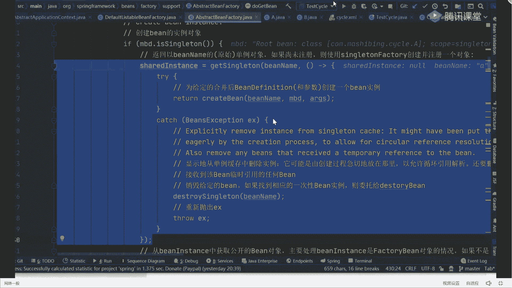
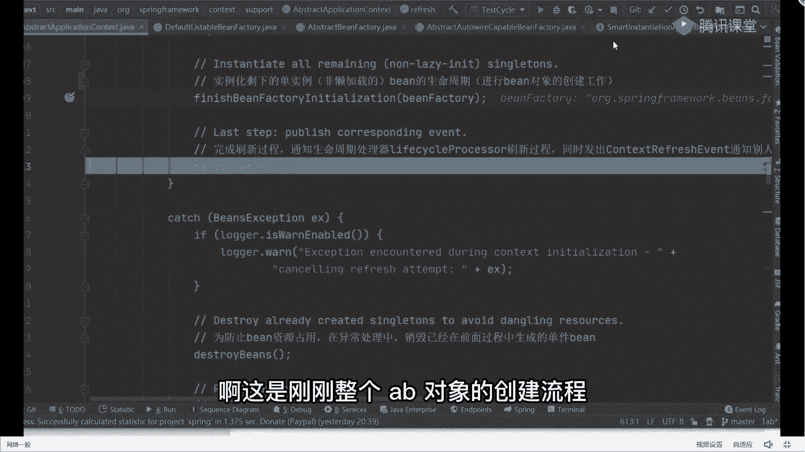
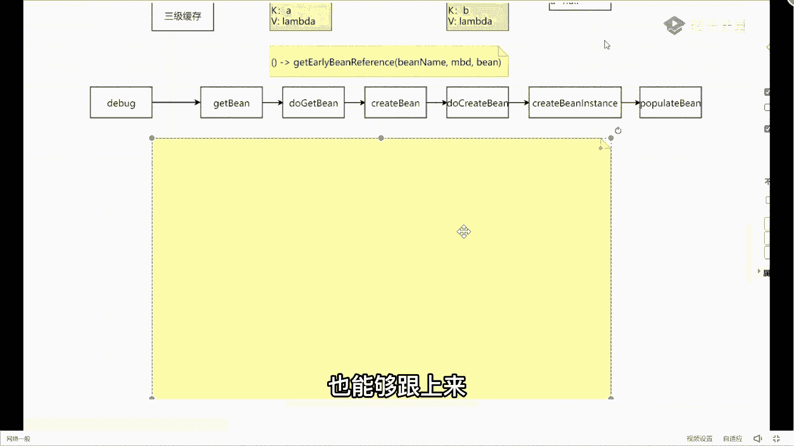

# 系列 6：P79：循环依赖的详细debug过程 - 马士兵学堂 - BV1RY4y1Q7DL

加上之后我们开始运行整个应用程序，打开我的test tt里面也非常简单，我这打一个点，打完之后开始右击第八个，我错了，为啥写配置文件，你可以用auto wear，没关系，我为什么讲配置文件。

讲配置文件的原因非常简单，因为配置文件是最原始最老的方式，它也是最完善的功能体现，如果你能把配置文件的方式搞清楚了，那么你再看注解也好，看配置类也好，都会非常轻松，因为他是最麻烦的，明白吗。

他是最麻烦的好，所以这样带你们看最麻烦的东西，捡东西你们自己看啊，所以刚开始会提到这个地方，我们点f7 进去创建对象，这是一个weblogic，等于bug，不管它点mc进到我们的构造方法里面去。

再点mc进来，上面的东西super不用说了吧，调用父类的构造方法干什么事，不管爱干嘛干嘛，我昨天给大家说过了，看原版的方法论了，不要每一个方法都点进去，你通过方法名字，知道我调用父类构造方法就完事了。

爱干嘛干嘛，管他下一个叫sconfig equations，什么意思，要设置配置文件路径传过来的，就是我们的dota 2的称号对吧，我只要把配置文件传进来，他会设置到我们指定的位置里面去就ok了。

明白意思吗，还是硬，你别点进去看好吧，里面处理逻辑还多呢，你要一层层往里边点，我告诉你一会就点蒙了很多，别忘你的点啊，学会适可而止，控制住自己的手好吧，不用管它，再往下走，看看我们的reflash方法。

我昨天也说过这件事了，我说如果你能把abstract application，contest里面的reflesh方法，你如果能看懂的话，我告诉大家，基本上源码已经从源码已经接到了，基本就够了好。

但是还是那个里面逻辑还是很多的好吧，这块前面有一些准备工作好吧，要做一些容器的初始化好吧，赋值啊，包括像监听器啊这些东西操作，不管它，我们直接到这个代码里面去，这个因为从这个步骤开始。

才正儿八经的去创建我们的对象，所以这直接跳过来，有的老师是这样吗，是不是这样，我们可以做一个验证，刚刚我带你看过了1233缓存是什么，一级缓存叫c工程object。

二级缓存叫early signal objects，三级缓存叫signal factories，所以你打开当前这个第八页面之后，找到我们的b3 腿，在b feat里面找c工程objess，找一下。

往下看，spinal test里面有对象吗，有吗，点开有ab对，有ab对象吗，这里面提现这五个对象是什么，是容器需要对象，并不是我们创建的a和b对象，所以现在容器里面没有ab对象，你再看二级缓存。

明白三级缓存零吧，我说了对象还没开始创建，所以现在这个步骤一定都是空，不管它，我们点f7 进去进去好吧，进来之后上面有一些属性值的判断，你可以直接跳过好吧，这些步骤也是出现对象了，我们直接到这一行。

从这一行开始，终于进入到我们创建对象的流程里面去了，所以再点f7 进来，加之后来问一个问题，刚刚的配置文件里面，我问一下，我需要创建几个对象，我需要出现几个病，俩吧，就2万，一个a一个b没别的东西了。

就是两种东西好吧，所以当我识别到之后，我点开我的创建类，你看到他会把病对象的名字给你，放到一个集合里面，器是release里面，就是我们的a和b两个对象，我说了a b两个对象，它没有明显的先后创建顺序。

也就是说我可以先创建a也可以先创建d，这个无所谓啊，对于我们当前应用程序而言，0号位置是a嘛，所以刚开始取的时候取的是a对象，我先把b列母取出来好吧，当我取到b类a等于之后干嘛了。

是不是该创建我们的a对象了，但是注意了，同学们在创建任何对象之前，我都要去做一个预先的判断，那什么东西啊，我需判断茶才能告诉我，对容器里面是否有对象，所以往下走走走哦，这行代码里面叫get be。

我要先去容器里面获取一下，我到底有没有当前的a对象，所以从这开始，进入到我们核心的处理逻辑里面去了，也是我刚刚给你说的第一个方法叫a对象，这个叫get in，这是我们第一个叫get in好吧。

get完之后点f c进去，到第二个方法叫do get in好吧，这儿提个醒以后，你们再看一些框架源码的时候，如果你看到了以do开头的方法，一定要警醒一下自己，为什么。

因为你不开头的方法基本上是实际干活的方法，也就是说在这个do开的方法里面，包含了非常多的真实的处理逻辑，在这儿是我们要小心的留意的，ok我再点f7 进去，进来之后先获取一下我们对应的名字吧。

获取完名字之后来了一个东西叫get singleton，什么叫get sgo，电瓶之翼啊，我昨天讲过电瓶之翼，为啥注释是黄色的，给自己改的颜色亮一点，好看一点，获取单单单单例对象吗。

我们现在能获取到a的单例对象吗，不是一级缓存的名字啊，这是一个方法叫获取单对象能吗，你都没创建，你哪来的获取不能啊，所以当这个步骤执行完成之后，你会发现这个对象等于空，如果等于空意味着什么事。

我是不是必须要去创建a对象了对吧，已经创建了吗，因为没有吗，没有你只能创建吗，别人不会给你，所以我再往下走，下面有一堆的逻辑判断，你可以直接跳过，不用管它好吧，不用管他，不用管他。

我们直接找到一行代码里面去，再定行，到这块之后，你会发现了一个方法叫什么，叫create密码对吧，终于看到了创建对象这个方法名字，这是我说的第三个方法，然后往下走一步，又来到一个方法里面。

叫get singleton，这个时候我希望你能好好留意一下，get singleton这个代码，就是刚刚给大家说那个object factor，这个这个东西就拿出来，让你好好看一下，拿过来。

我把这些乱七八糟的注释给他干掉，是不是没啥用，同学们注意看在当前这个方法里面，我放什么东西，get telement是方法名字对吧，b name是方法的第一个参数就是a，然后后面我重来一个另这玩意。

这玩意是啥，就是我们的lambda表达式啊，它对应的就是我们刚刚那个object factory函数式接口，它的一个调用过程，所以当我开始进到这个singleton方法里面去的时候。

我这里面的cret d并不会真正的去执行。

所以来点mp进去，进到这个方法里面去，调完之后，这里面依然有一堆的判断逻辑，我刚刚前面写过了，我说这个东西要通过什么来调用来着，通过get object的方法来进行调用，所以此时我们在看源码的时候。

我就要去找了，完找找啊，找一堆的判断跳过去，不管它，你不要好奇，看这东西没用好吧，直接到这一行，叫single factory，singleton factory是啥呢，往上翻是我们刚刚传过这个参数。

传递参数是啥，是我们的拉姆达表达式，所以此时当我在调用这个get object的时候，你告诉我实际执行的方法逻辑是谁，不要三跟三熊猫跟3d缓存没关系，没到那是我们的qub方法，所以我点一个f一进去。

是不是到壳里病了，到creepin方法了，从这个步骤开始，我要真正的去创建我们对象，然后再点f7 进去，这里面又有一堆的逻辑判断，我说了这些逻辑判断，你可以不管，我问一下第四个方法名字叫什么。

他们听好了，这东西啊，很难理解，我在带着你去抵八个源码，如果你都觉得很难理解的话，你自己去看，你会变得更懵，所以现在晕，这着急，跟着我的逻辑线去慢慢往后走，你会把这些源码给理解透的。

没大家想的那么难好吧，所以这个方法叫do create b，我们下期要找了，找找找找，找好了，找到了第四个方法叫do credd，我刚刚也说过了，不开多方法都是实际干活的方法，所以我们再点fc进去之后。

终于到了实际创建bean对象的一个处理逻辑吧，好意思，往下走往下走，往下走，往下走，到这个方法，那么到这一步之后，这是我们说的第五个方法吧，来这个fm叫什么，叫pread bean instance。

叫创建并实例，说白了就是我们创建对象对象名字是谁，是a嘛，所以我创建出来的就是我们的a对象，对往下走一步，你会看到现在我获取到的a对象叫什么，叫aat 1655里面的属性b是什么，是空的吧。

是不是空的好吧，所以这样我一个标做一个标注了，我先创建出一个a对象，叫a at 1655，此时的b等于n，我问一下，现在我有往三个map结构里面放东西吗，现在我要往三个map里面放东西吗，没有啊。

还没我只是把当前对象给创建出来了啊，所以这是什么，相当于我们刚刚在这张图里面，我只完成了实例化对象，还没开始这里面进行赋值呢，哎同步b解错了，所以我先把它扔一边，先放这个地方，当放这个方之后。

中间依然有一些逻辑判断，不管它我们该干嘛了，是该去填充我们的属性了，所以来到我们的第六个方法里面去，那第六个呢叫popub，但是在populate b之前有这样的一个处理逻辑。

叫adsingleton factory，当你看到这个方法之后，别着急，猜这个方法干嘛的，你注意看它的参数，第一个叫bean name，第二个我又传递了个什么玩意儿，什么玩意儿，lambda表达式。

这个拉姆表达式我要给大家站出来，因为这东西才是我们解决循环依赖的，最关键的问题所在，我需要把它给粘出来，方便我们一会来进行查看，站出来爆炸好吧，放完之后来往下看，干什么事呢，很简单点。

m7 进去往这方面去，进去之后往下走，里面有一些异常的处理，不是那个现成的数据操作，不管它，第一步叫this。c构成factories，点put，这是往哪个缓存里面放，哪个三级缓存吧，但是你注意三级啊。

不是二级啊，三级，但是你注意往三级缓存里面放的是啥，k是我们的a value是个什么玩意儿，什么玩意儿，lambda表达式，它并不是把我们的a对，他并不是把a对象放进去了，留大案。

他并不是把a对象放进去的，而是放了一个，然后表达式，所以我这在进行标注的时候，我也应该这样来标注它，什么叫做刚开始k冒号放的是我们的a对象，对吧，而value放的是什么，叫拉表达式，哪个老表达式呢。

就是下面这块我放这儿了，下面这个对象把它放进去了，搞清楚没放对象好吧，现在没放对象，ok完了之后来往下走，叫this radily singapore object remove啊。

二级可这个移除掉二级，可能现在里面本来就是空的，啥都没放，就不管它再往下走，叫reject c功能，当你所有的病对象放完之后，会有一个已注册的并对象把它放进去，所以这相当于是一个已注册并对象。

的一个呃集合，不管它没啥用，跟三级缓存没关系，跳过也就是说在对象属性设置之前，我已经把k等于a value，等于拉姆表达式的一个东西，放到了三级缓存里面去，注意我放的并不是a对象。

而是包含a对象的一个lab表达式，来这儿能听懂的，给老师扣一，能听懂吗，好了继续跟没到精彩的地方，当这执行完了之后，我们紧跟着再来干嘛，下一个步骤叫popular bean。

你注意popular be pop类的变叫填充属性，你可以翻一下，说白了就是给我们的属性来进行赋值好吧，现在我们的a对象还是这玩意儿，a at t1655 好吧，b等于空，没做任何变化。

然后从这个步骤开始，我要开始填充我们对象了，这里面有一堆的逻辑操作，你都不用管它，我们直接跳到最后一行，因为只有在最后一行，这块才是具体的属性值的操作，中间这块都是检查判断啊，没啥用。

所以我这直接跳过来了，到最狠哈，明白吧，直接跳过来，跳完之后点f7 进去啊，进来之后怎么进行属性的赋值啊，走走走走走走走，注意啊，我先问你个问题啊，a里面有几个属性，一个吧只有一个b属性。

所以我要找到我们对应的属性值，所以往下走走走走，走到这往下看，叫pv，pv就是我们的属性值的集合，好吧，里面只有一个属性值b，所以当我重新完成之后好了，我获取到我们属性名字了。

等于b好在下一步我该干嘛呢，叫pv。get value，正常情况下，你告诉我我这个get value应该获取到一个什么值啊，得到一个什么值，那么好吧，但是当你执行完成之后，你会发现他这获取到一个对象。

这个对象你们可能没见过叫什么，叫raw time being reference，记住啊，叫roten being reference，把这个名字给我记住，因为后面我们会用到的东西。

probe refer，暂时记住叫运行时的一个并引用，这样你是必须要知道的好吧，当你知道这车之后往下走，来到这行叫value reserve的result value，if necessary。

通过名字判断你告诉我干嘛的，如果必要的话，我要去处理value值了，实际上我们这个value我最想获取到的是啥，是不是应该是一个b对象，因为如果我能够获取到b对象的话，我就可以直接完成我们的布置工作了。

但是我现在获取到的是什么，是一个wrong time being reference的一个对象引用，而不是b对象，所以现在我要去处理我们的b b对象了，这是不是必须要注意了，因此从这点f7 进去。

进来之后，这有个逻辑判断，if value inance of wrong time being reference，来告诉我我们刚刚传过来value值是不是这个类型，是不是这个类型是吧好了。

如果是的话，我能进来，第一步类型强转调整完了之后，到这叫resolve reference，开始处理我们的引用了，我再点f7 进去，第一步先获取我们b类型的b的类型，但只有一个标签b嘛。

好返回之后等于空获取标类型，如果他在找他的复工厂里面有什么东西好吧，然后说如果不等于空做什么事，我们再等于空可以跳到这，往哪儿看，同学们关键点来了，叫string。

value of two evolureference，get the name，说白了我就是把什么，把我们刚刚传过来那个b参数，给它做一个名字转换，所以这样处理完成之后。

我的名字等于谁等于b a你写不出来了，没事儿，往哪看，这个叫result name于谁等于b，然后当你到b站之后泡完，从此开始看下面这行代码，叫并等于this，点been fashi，点get。

并告诉我这是你第几次看到get并对象，第一次第二次吗，相当于什么事儿，我现在本来要给a里面的b属性赋值了，我通过我的名字拍完照之后，我发现我没有b对象，所以我现在要干嘛。

是不是要去容器里面查找我们的b对象吧，回到这张图上，是判断容器里面是不是有b对象，知道这个步骤了，从这开始要判断了，来到这儿还能跟上同学给老师扣一，听好了，这个地方我为什么说它是套娃了，开始。

因为从现在开始，他的执行步骤，跟我们刚刚创建a对象的执行步骤，是一模一样的，所以当我点f7 进去之后，又回到了我们的第一个数理逻辑里面去，叫get be get in，后面的第二个方法叫什么。

叫do get in对吧，再减f7 进去，第一步转换名字，第二步叫get singleton，来，问题来了，这个get singleton里面有b对象吗，有没有没有，所以这取出来a等于空。

当它等于空之后，紧跟着我是不是要去创建我们的b对象了，对往下走走走走走走走走走走，走到这儿再进到我们的get single里面，然后里面是什么，create编码一模一样，p m c进去填完之后找什么。

找get object的方法，走走走走，当我找到get object方法之后，紧跟着我要去调用我们的create bean方法，我再点fc进去，下一个方法是啥，下一个方法是什么。

do create bean，所以往下走走走走，一直走去看看，跳过不管走走到这叫do created by，不是去了点fc进去，进去之后往下走走走走啊，到这一步，当我到这一步之后干嘛了。

我是不是要去创建我们的并对象了，此时我创建对象是谁，一把是该b了，所以这时候你打开，你会发现我现在已经把b对象创建好了，创建好之后，b是谁，叫bf 1995来拿出来，我依然想扔一边，b at 1955。

此时a属性等于空，来，我问一下，那对于我们上面那个图里面，哪个步骤是这个步骤，我开始完成b对象的实例化了吗，b对象实例化，当我b对象的实例化结束了之后，紧跟着来再进行操作。

往下走走走走走走走走走走走走走，走到这层来告诉我这行干嘛，这样干嘛，放缓存吧，往哪放，往三级里面放，放的是谁，到这儿，我往三级里面放的时候，我一样的，我放的对象k他放的是谁叫b。

但是我的value是谁啊，还是那个拉姆达表达式，所以现在三级里面都已经包含上我们的ab对象，和a b的名字了，但是不过我的值是一个拉姆达表达式而已，那这个拉表达式有什么用，一会儿我们再说啊。

先把它搞定好了，这边执行完了，所以往下走，大家都这叫populate bean，点mc进去吧，哎那就这干嘛了吗，现在是不是该给b对象里面的a属性，来进行赋值了对吧，给b对象里面的a属性进行赋值。

所以点mt进去下来之后，营养老规矩直接跳过到最后一行，叫apply property values，再点f t进来，进来之后往下执行我们代码的一个逻辑，找谁找属性名字吗，都跳过跳过跳过跳过。

不管他跳过跳过跳过跳过，好到这一步获取我们属性的名称，往下走，名称是谁，a吧好吧，紧接着获取我们的value值，这个时候你再看你获取到的value值是谁，是什么，同学们是不是依然是a吗，怎么会是a呢。

你a现在都没往里面放，咋那会是a呢，不是a啊，是不是还是一个运行时的并引用，依然是一个运行时的并用啊，没关系，当我看到运行的并运用，我也不慌，往下走，是不是该进行值处理了，点f7 进去好吧。

判断一下你是否是这个类型，很明显我们的value值是这个类型，一旦我是这个类型之后，可以干嘛，是不是可以强转类型，转完之后开始处理我们的引用，初进营的时候步骤一样，第一步get beat啊，没有好吧。

然后呢，变态不等于空进入到里面，等于空往下走，又开始获取我们的属性值了，当这儿获取完成之后，我破掉了a8 好了，现在告诉我第几次看到get b方法，第三次第三次了，所以我说了。

如果你真正的能把一遍流程跑通的话，你会发现里面基本上都是套娃，它的处理流程，处理步骤几乎是一模一样的，所以不需要慌，好吧，来再点x，这这干嘛来着，我要去找找谁了，现在我要去找谁了，告诉我，找a对象吧。

好找a对象，然后我点f7 进去又到哪了，do get been对吧，再点f7 进去哇，获取名字，然后到这个里面去，现在问题来了，他到哪了，是不是相当于执行到这个步骤了，不知道这个步骤了，来执行这个步骤。

能理解，同学给老师扣一大能理解吗，可以吧，能理解的话，来我问一下，这里面有a对象吗，我们现在三个缓存里面有a对象吗，看着看图有没有，有对象，那有吗，注意你是没办法从1233个缓存里面。

直接去获取a对象的，但是这有一个你看三级缓存里面有值吧，所以我没干什么事，来看他的处理逻辑，点f7 进去，再点f7 进去，照这个方法干什么事呢，第一步从一级缓存里面获取值，一级缓存里面有a对象吗，没有。

所以这值变等于空，没问题吧，第二个判断一下，如果这个值等于空，并且叫is singleton come increation，我问一下，现在我们的a对象是不是在创建过程中，是吧，所以就等于true。

我能够进来，进来之后，我从二级缓存里面取，我问一下二级缓存里面有对象吗，看图有没有没有，依然是等于空的，所以跳过这个值是恒等于处的，那如果这个等于空，这个值等于负的话，ok我进来劈开之后往下看。

这是从哪儿取，一级吧，这里面有一个synont的双重检查，一级怎么是三级呢，一节再走一遍，一节二节都取不到之后，紧跟着我开始从三级缓存里面取对象了，我问一下，从三级里面取完之后，我获取到的是个啥。

是a对象吗，不是是一个拉姆达表达式，所以你取出来看看，dollar拉姆达i1738 是一个拉美达式，当我把这个拉姆达式取出来之后，我是不是要调我们的get不get了，你告诉我。

当我在调这个get object的时候，我执执行的实际的处理逻辑是哪个逻辑，get early being real reference吗，这东西get early being reference。

是不是该进行它了好吧，然后点f7 进去，再点f7 进去，到这个画路径里面，到这之后你好像看到点东西这个属性名字，我觉得你应该认识叫exposed object来。

谁能告诉我什么叫exposed object，翻译过来叫啥，看过叫啥，暴露对象，这是你们在看帖子的时候看到那个暴露对象，什么叫提前暴露对象，暴露是谁，暴露的是这个玩意儿，这玩意儿干嘛呢，来往下看。

第一步操作，我先把a对象赋值给了expose project，紧跟着我在最后返回的时候，我返回的是object，但是中间这一块的时候，你pose不在，有没有可能会改变，有没有可能会改变，可能吧好吧。

这里面是不是有数理逻辑改变啥呢，这需要做什么改变吗，需要有什么改变，来我们点到这个方法里面看一眼，点进去，点完之后找实现类，第一个是一个debtor适配器，不用管它，它上面有一个类叫abstract。

auto purposecurity，再点进去叫viper，if necessary，我再点进去叫create propose，再点进去叫propose battery，they get policy。

我再点进去干什么，再点进去往这儿看，你告诉我干嘛，我这是不是有可能拥有一个判断，判断什么东西啊，同学们，判断一下我此处是否需要把它改成代理对象，也就是说这个步骤我在提前进行暴露的时候。

要不然我暴露的是原始对象，要不然我暴露的是代理对象，来这句话能听懂的，扣一，记住啊，我说的是要不难，要么暴露的是原始对象，要么暴露是代理对象，至于是否是带着项，取决于什么。

决于当前这个衣服放大能不能进来，我们刚刚的配置很简单，什么东西配，就配了一个ab对象，那个ab对象他需要生成代理对象吗，需要不需要不需要吗，对这个地方if是进不来的，我直接把谁返回了，把线返回了。

不就是我们的a对象吗，对对象a at 1655，把a对象返回回去，当我返回回去之后，你告诉我我能不能取到a对象了，能不能，为什么a b没有带这样，你配了吗，因为没配在这个项吗，所以返回原始对象吗，好了。

当我返回原始对象之后，紧接着看叫this early snoobject，点put放哪儿了，把原始对象放哪了，二级缓存嘛，所以现在我可以改变一下，我们将图了拿过来，k依然是我们的a。

但是value变成什么，叫aat 165，问题是现在的a是成品还是半成品，半成品啊，记住了好了，放这半成品，ok放完之后紧跟着叫v4 点sgo，再点remove，把谁删除了，把那东西删除了。

把三级缓存里面的东西给删除掉，我们这儿不停的删除，给他标个红色表示删除吧，删删除掉，为什么要删除啊，有人想这事吗，为什么是半成品，你看这个a对象，你的b是等于空啊，你没给b赋值啊，对不对。

所以为什么是三级，可能要删除掉啊，因为你的查找顺序是一级二级三级，如果二级里面有了我，三级还有必要存在吗，没必要明白意思吧，没必要了，这个是不是这个意思好吧，把它搞清楚了，所以这块我们到这就不说了。

这是为什么三级缓存容量比较小的原因，原因在这16 16吗，哇好了，被搞明白了吧，搞明白之后来现在我的他说网络返返返返回返，回到这步之后，我把我们的为什么拉表示一会儿来说好不好，别着急，我说了。

你们跟着我的思路走，要提前问问题，你现在都想不通，后面的东西，你没法问，问的东西白问，这是我的思路走，我后面会解释的，为什么要换完美达式，我不解释的，别着急，好不好，心急吃不了热豆腐，晚上哪来好不好。

我已经尽快放慢这个节奏了，好听ok好了，现在我有没有把a对象给取到，按计划就能调档了，你放的数据多了，自然而然就扩容吗，还有自动扩容技术，为什么要自己去设置，不像吗，提到了吧。

我刚刚为什么要取a对象来着，我取a对象的原因是啥来着，对不对，不错了，不好意思啊，所以现在我已经把a对象获取到了，我能不能给我们的b对象来赋值了，你看到了。

刚刚没有create并列方法是进不去create并了，所以往回返再往回返，在往下走，现在我获取到了我们的a对象，那我可以干什么事了，我是不是可以给我们的b属性赋值了，在哪复制，很简单，看完啊。

看完在这个步骤里面叫b w。set property values，在这里面可以完成我们整个的赋值工作，往下走走走，返回返回，好吧，再往下啊，不是到这就可以了，你再看一下你的b对象，有了吗，是不是有了。

有了的话，你告诉我现在的b是成品还是半成品，成名了吗，虽然这个a里面是b，但没关系，我的b对象已经有属性值了，所以b现在已经成品了，那成品之后往下走，谁走走走，一直往回返返返返返返回来。

按照我们刚刚出逻辑，一直往回返反到哪呢，放到这个方法里面去，叫adsingleton，注意b类是b signal object，是谁，是b对象，然后点f7 进去，第一步叫these。

点sigmobject，点put，这是几级缓存，一级放的谁和b对象吧，所以此时可以到一个结论，我可以把什么把我们的b对象给放回来了，写一下k冒号是谁b吧，value冒号谁叫b at 1995。

现在我们的b对象是成品还是半成品来着，刚说过了吧，成品对象好吧，翻转过来了，挪过来之后，紧跟着干一件事，就this sfactory，三级缓存移除掉，然后呢二级缓存移除掉。

是把三级和二级给1921955，这把二级和三级干掉，这样我们一样标红b是不是完了，不就是成品了吗，赋完值之后不就是成品了吗，对不对，好了，当然完之后剪下来下一个问题，我为什么要去创建b对象来着。

可能听好，我为什么要对创建p对象来着，是为了给a里面的b属性赋值，现在我的b对象已经获取完了，我是不是可以给a属性赋值了吧，所以返回返返到这，我现在我已经能获取到我们这个b对象了，当时看诶。

哎看那b i s1991995 就是九五，没写错啊，那就这写错了，好吧，这写错了，所以现在我已经获取到我们对应的b对象了，那我获取到b对象，而且获取到是一个成品对象，下一步干嘛。

是不是该给a属性a里面的b属性赋值了，所以往回翻翻翻翻翻反反反一直反，现在这逻辑判断，不管它过过过过高铁好，叫bw表示set pro value到那儿完成之后，是不是给b赋值了。

所以往回反反一步到这一步，你再看当前的a对象，a对象里面有没有b有b吗，有吧，是不是，意味着我的ab对象对象都已经创建完成了，对不对，所以此时ab都成了成品，但是还没完，怎么做，走走走走走走。

往回返返返返返好吧，反到哪，我现在a对象我也创建完成了，翻完之后别忘了，还有一个步骤叫adsingleton and on，干嘛，是不是a还要去丢到我们的一级缓存里面去，把它丢上来，听完之后。

现在我们的a变成了成品对象，然后把二级是不是也给干掉，是不是意思好，是不是删掉，我说让红色表删除，那你告诉我，现在我这个逻辑执行完了吗，听完了没完了吗，没完没有，同学们，你不要忘了。

刚刚我们为什么要创建a对象来着，我问一下为什么要去创建a对象，说实话是，因为我们在刚开始的这个循环结构里面，我是先取了a，对不对，当我取完a之后，别忘了这个集合里面有两个值，你只是把a处理完了。

现在你的b处理了吗，没有吧，我先干嘛，该处理毕了吧，处理b的时候是不是也是一样，我找get in，找不get in，然后这个步骤你告诉我，现在能不能从一级里面取到b，能不能从一级里面去取到b可以吧。

所以此时我直接获取到b对象，我获取到b对象了，好了，我下面我还需要去重新叫create b吗，还需要执行这个步骤吗，不需要啊，他就执行完了，所以当这个步骤执行完成之后好了，我们整个处理器才算是结束了啊。

这是刚刚整个ab对象的创建流程。

来听懂的，扣一，告诉你我我以这样的方式去debug，你们能能能读上吗，应该没问题吧，好了，这能跟上，我告诉大家还有问题，其实告诉大家，现在给大家解释这个流程，它并不是循环依赖里面的最关键的点。

最关键的点，下面我要写的这段文字，描述才是最重要且最关键的点，也就是说那个流程其实非常简单，你只要正常情况下，你听完了，你应该能认得出来，哪怕你跟不出来，你下去之后自己跟着做一遍也能跟上来。

这其实并不是主要的，主要是什么。