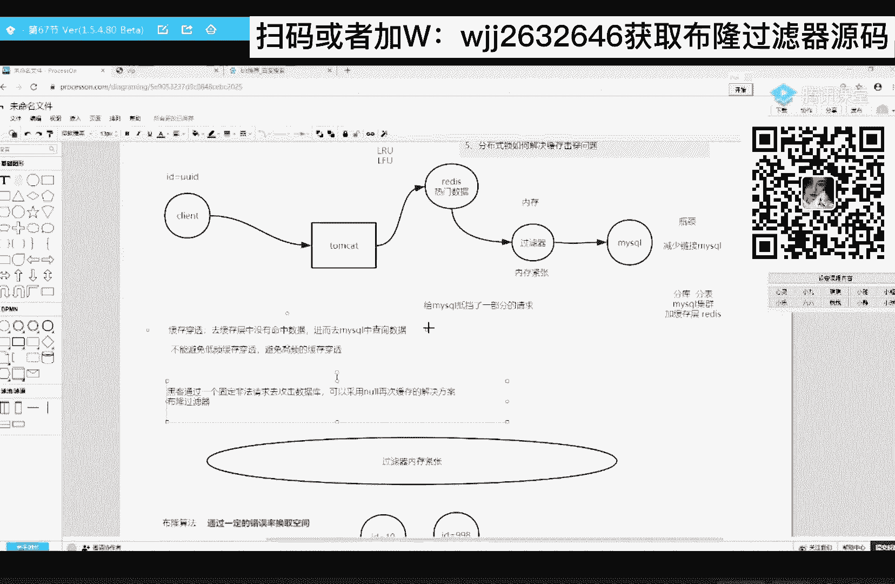

# 系列 6：P94：布隆算法原理 - 马士兵学堂 - BV1RY4y1Q7DL

记住这句话，不能算法它是通过一定的错误率来换取空间的，先记好，我会给你一个个解释，那么不同算法的原理是什么样的呢，不能算法的原理，它是通过一个b的数组来标识我们的数据，或者说来存来存储我们的数据。

好好听不难，这个算法这个算法不难，假设我们现在过滤器里边，他需要把我们数据库中所有的id号，进行一个存储，那么之前这个过滤器啊，他很实诚实打实的，是不是存的是我们的id的具体值对吧，我再说一遍。

我们之前那个过滤器是很实，诚实打实的去存储的，你mysql里面具体的id值，那么使用这个不同算法呢，它不是存具体的i d值了，而是通过一个倍的数组来标识这个i d值，比如我现在要标识id等于十。

这个id值我说了，他是通过一个被子数组来给大家画个倍的数组，稍等啊，这个，来这是长度为四，假设我搞一个长度为20的，这是12，这个是16唉，这个是20哎，这个倍数倍数组的长度是20。

那么刚刚初始化的时候，所有的位置都为零，b的数组吧，所有的位置要么存，要么存零，要么存一对吧，那么初始化完成之后都是零二，那如果我现在要标识id等于十，这样一条数据怎么标啊。

首先他会把这个id值先传给一个哈希函数，先传给一个哈希函数，这个哈希函数可以是你自己写的，我一会儿会给你讲代码具体怎么实现啊，不管你自己写，还是去使用已经开源的那些哈希函数，总之它需要保证这么几个特点。

第一个特点，它的哈希值它的一个范围必须在数组之内，零到数组的长度减一之间，这这对他的第一个要求，对汉信函数的第二个要求，计算出来的结果，计算出来的哈，希值啊，要读过的散列，第二个条件很简单，来传给了他。

那么传给他之后啊，他会给我计算出一个哈希值，比如泰国计算的，他一直是一，这个哈希值啊，它还代表的是我们这个倍数组的一个下标，也就意味着我要在第二个位置把零变为一，初始的时候都是零啊对吧，那这样的话。

我这个b的数组中的第二个位置的一，代表的就是id等于十来，常规流程我给你讲明白的，扣一，这个非常简单，这个常规流程，来假设我现在又来了一个id号，需要我来标识一下这个id啊，假设是998。

把这个998这个id值传给哈希函数，它是不是也给我计算出一个哈希值，比如说他记得他一直是我，这就意味着在我们的第六个位置，这是第六吧，这12345对在这个位置标为一。

那么这个位置的一就代表着i d等于998，细心的同学肯定能发现啊，这肯定有错误率啊，当发生了哈希碰撞之后，一定是有错误率的对吗，比如我现在来了一个client客户端，我这个客户端啊。

他想去查一下你这个id等于100的数据啊，id等于十的数据，在你这个b的数组里边有没有存储，有没有标识，哎，他会把i d等于十传给这个哈希函数，那么刚才这个id等于十，它的哈希值是不是为一。

那么再次传给他之后，唉，值依然是一，值依然是一，这时候我再去第二个位置一看，哎这个位置为一，这个时候就可以告诉客户端i d等于十，我是标识过的，听懂了吧，i d0 时是我标识过的，但是有这种特殊情况。

比如说我要看一下i d等于100的数据，我有没有标识过把id等于100传给他，ok听我说，我问你他的计算结果有没有可能还是一啊，来觉得有可能的扣一，没可能的扣二，有可能吧，记着看这句话。

我们的哈希函数有一个特点，它的计算结果零到n4 减1b区间之内，也就是说零到19之间，但是有可能还是唯一的，如果这个时候他给我计算出来的值为一的话，我再去第二个位置一看为一，这个时候再告诉他。

i d等于100，这个数据我存在，我标识过，那这是不是就是一次错误，对不对，这就是一次错误，你看他的错误，是由于发生了哈希碰撞而导致的错误，来我给你讲清楚的，666告诉我，ok，所以再回到这句话。

它是通过一定的错误率来换取的空间，首先错误率我们知道了，哎为什么说换取了空间啊，因为b的数组它占内存实在是，太少了，我们百度1下啊，我们来查一下这个bit换算，查一个b的换算。

假设我这个被子数组的长度啊，100万来，这是100万，我们换算成gb是不是才占这么点儿，这100万来，1000万，一个亿，10亿百亿来，我们长度这么长，是不是才占1g的内存啊，来这句话听明白了。

666告诉我怎么解决，我一会儿说哈希碰撞怎么解决，我一会说，ok一演示就发现了，为什么它是通过错误率来换血的空间对吗，来还需要再进一句话，还需要再记一句话，不能算法是由于，存在，哈希碰撞。

所以导致透绿是吧，所以导致错误率来，正要的话，我就给你标个颜色，标红色，那你说我想降低我不能算法的错误率啊，就是来解决你哈希碰撞的概率啊，你哈希碰撞的概率降低了，那你的错误率就会降低对吗。

怎么去解决这个哈希碰撞的概率啊，降低它的概率啊，来咱大伙告诉我，来大伙告诉我，嗯这个写错了啊，我这个输入法它有问题，嗯老是暴露我，今天晚上可能要加钟啊，跟你们的女朋友们说一下啊，好了。

降低哈希碰撞的概率有两个手段，第一个手段加大数组的长度，增加数组的长度，第二个解决办法，增加哈希函数的个数，两个解决办法，第二个解决办法你可能不是特别理解，但第一个解决办法你肯定能理解。

你这个数组越长啊，我这个哈希值的可能性是不是更多，发生碰撞的概率就会降低啊，这个不需要说是不是，第二个为什么增加哈希函数的个数，也能降低这个错误率啊，呃也也能建立这个哈希碰撞的概率啊，举个例子啊。

比如说我现在有一条数据id等于十，等于十，然后我这个数组的长度啊，假设长度为100，随便画了啊100，然后一开始哈希函数个数只有一个，我现在增加到了三个，那也就是说我现在标识一条数据。

我需要把这条数据传给三个哈希函数，听明白了吗，那么第一个哈希函数计算结果比如说是一，第二个哈希函数计算结果比如说是三，第三个哈希函数计算结果比如说是六，那也就是说我现在要在第二个位置。

在第四个位置以及第七个位置是不是标为一，那换句话说我现在标识一条数据，我需要使用是不是三个坑来标啊，对不对啊，需要使用三个坑来标，那你使用三个坑来标一条数据，那么这一条数据就就就是发生碰撞的概率。

是不是降低了，不好理解，没关系，比如说我现在有一个客户端，client客户端，我现在要查询一条i d等于100的数据，你有没有过标，那你说你把i d等于100的数据，传给这三个哈希函数，听懂了吧。

传给这三个哈希函数，那么第一个哈希函数给你计算出来哈，希值为一的概率是不是以1%，那么传给第二个哈希函数，给你计算出值为三的概率，是不是也是1/100啊，传给第三个为六的概率是不是也是1/100。

也就是说他们这三个哈希值全发生碰撞的概率，1/100的三次方，进而降低了碰撞的概率，来听明白的，666告诉我，如果数据越来越多呢，那你就把你的倍的速度变长啊，刚才不也带你去换算了吗。

100页的长度才占一个g的内存，你怕什么嘛，对吧哎应该大伙都能理都能听懂啊，举个别的可能没听懂，你就回去看录播了，唉这个范范说了也说了一个，提了一个很好的问题，提了一个很好的问题。

就是如果啊我这个数组的长度长度只有十，这个长度啊，只有十，我的哈希函数啊，假设一共就有有有十个，我增加到了十个，来十个，我这是id等于十那个数据，我需要把这个数据是不是传给十个哈，希函数对吗。

那么假设第一个和第一个哈，希函数给我计算值为零，第二个为一，第三个为二，依次类推，最后一个为九，依次递增啊，那也就是说我在标识这一条数据的时候，他就给我把所有坑给占满了，所以q的位置是不是都是一啊。

那未来它的错误率一定是百分之百，但这个能听懂的666告诉我，那我们就可以得得到一个道理，得出来一个道理哈，希函数的个数并不是越多越好，需要与数组的长度啊，或者说需要参考，数组的长度。

这就是一个trade off，明白吧，这就是一个trade off，这就是一个调优点二，这是关于怎么去降低它的一个错误率，关于哈希函数的错误率啊，给大家补充一句啊，给大家补充一句，也是很重要。

给它标粗标红，他的错误率主要体现在，就是现在什么这个这个，布隆算法，数据存在，那么实际有可能不存在，如果他说数据不存在，那么一定不存在，来好好琢磨一下这两句话，宁可错杀3000，绝不放过一个的感觉来。

感觉来了，666告诉我，来感觉感觉有的666告诉我，就如果他告诉你，你这条数据不存在，那说明他从来都没有标过，那是真不存在，如果他说存在，它有可能不存在，有可能是发生了哈，希碰撞对吧。

好啦你看通过一个不能算法，我们就可以解决，刚才这个过滤器内存紧张的问题，内存简章的问题，那你说对于第二个场景下的黑客攻击，这不就由刃而解决了吗，迎刃而解了吗，对吧嗯老师你走神儿了嗯，我们这个不能算法。

这个不能算法嗯，它有也它也有一个弊端，它有一个弊端，什么弊端，关于删除数据的一个弊端，给大家点一下啊，就是你这个b的数组中这个位置的一，它可能代表的是好好几个id号，能听懂吧。

这个位置的一它可能代表的是一堆的i d号，所以说这个位置的一你不能轻易的变为零，对不对，这就很蹩脚啊，这就很蹩脚，那我们可以怎么办啊，我们可以搞个计数器，我们可以搞个计数器，搞一个二维的，搞个二维的。

第二维就代表的是一个计数，能听懂了吧，如果你的计数器显示值为零，计数器的值为零，这个时候你可以放心的把一变为零，咱能听懂的六六告诉我，好，了关于这个不能算法的代码。

我已经给大家写好了，在这。

快速的看一眼啊。

代码不重要，重要的是思路啊，思路决定你的出路，代码不就根据你的思路去用一个个单词，实现出来的，对不对，没啥难的，快速看一下啊，首先这里边的贝的数组啊，我们使用redis里边的bmap这个类型。

所以在这呢我也连接了一下这个redis啊，主要就是使用它这个beat map类型啊，首先在这呢我这是设置了我要存多少数据啊，以及它的一个错误率啊，这有个main函数，这是先看这吧。

我我只带你看几个重要的啊，看这个get index，get index这个方法啊，这里边就是来计算我们的哈希函数的哈希值，来计算我们的哈希值，计算我们的哈希值，首先这边有个数组的长度多长。

这里看见哈希函数的个数，因为你你有多少个哈希函数对称。

是不是要计算出来多少个哈希值啊对吧，那么这里边这就是我自己写的哈希函数，自己写的哈希函数啊，最终他把这个数组给返回了，返回了，那么这个数组里面的值，这就代表着我未来要在这个beat map数组中。

哪些位置填一，哪些位置不动，能听懂了吧，其实这个就是核心的，这个就是核心的，其他的并不重要。

好吧。