# 系列 6：P98：zookeeper分布式锁的利弊 - 马士兵学堂 - BV1RY4y1Q7DL

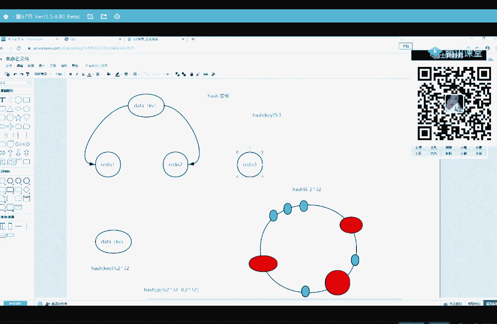

我看。

所以说关于这个基于mysql的这个分布式锁啊。

问题很多，所以也很少有人会基于mysql去实现一个分布式锁。

一般用的比较多的都是基于这个主keeper。

基于这个组keeper去实现一个分布式锁。

主keeper了解吗，听都没听过是吧，ok。

关于这个组ker怎么去实现一个分布式锁，以及它的分布式锁原理啊。

在我之前课里边有给大家讲过啊，就给大家讲过。

我之前的一个录播行吧，那么这节课呢我就给大家分析了一下。

这个分布式锁的一些优缺点啊，实现基于这个mysql的一些问题。

那我们继续回来继续回来，那我现在知道什么是分布式锁了。

诶在哪呢。

在这儿。

稍等把这个往下移一下。

好我们现在知道什么是分布式锁了，那么怎么使用我们的分布式锁。

去解决这个缓存击穿问题啊，怎么解决这个缓存击穿问题啊。

这样来解决，我们说如果你的缓存计算问题需要解决。

说明你的并发量很大对吧，访问量访问量很高。

访问量很高，所以你这个架构啊肯定会发生改变啊，比如说你的架构变成这个样子。

这有个负载均衡器，是我们的，他们开的一，然后他后边会挂好几个服务器对吧。

可能架构就变成这个样子了，来三那我客户端发了一个请求。

先给nginx，那么n个n gx会根据一些分发策略，是不给他们开一或者二或者三。

当然分发策略有很多，有人询会基于哈希的对吧，很多分发策略啊，好，那么现在现在如果我rise里边这条数据它失效，这条数据它失效了。

过期了，那么所有的请求是不是都怼上了mysql。

就在这一刻，非常非常多的请求都怼上了mysql，那你这一刻的马sl有可能承受承受不了。

会宕机对吧，那怎么办呢。

来这边我搞一把分布式锁，搞一把分布式图。

甭管这个分布式锁是基于mysql还是读kep的，就是你如果去你的rise里边没有查到数据。

ok你来抢所，那说明我这条数据是不是失效了。

来他们都来抢所，都来抢所，那么谁先抢到了锁。

比如说他们开了一抢到了锁，那这个时候他去mysql征去查数据。

那么剩下这两个没有抢到锁的。

在那等着，那么tom cat一去mysql中查到了这条数据之后。

再把这条数据缓存到redis中。

现在raid里面是不是就有数据了，那么刚才tom cat 2和tom cat 3的这两个请求。

现在不需要在这等锁了，哎你就直接来mysql中去拿就ok了。

你看我们采用分布式锁。

如果就在你数据突然失效那一刻。

假设有1万个请求准备打向mysql。

那么现在是不是在分布式锁这一块卡卡住了。

只能允许一个人去mysql中查，查完之后再放到redis中。

那么剩下的9999个请求，是不是直接去red之后拿就ok。

虽然这种办法它的效率很低，效率很低，但是能够很好的去保护你的mysql数据库，我给你讲明白了吧，来我给你讲明白了，扣一。

呃刚才这位幸运学员说，1万个请求怎么可能k是相同的呢。

你看啊，我们刚才所说的这所有的请求。

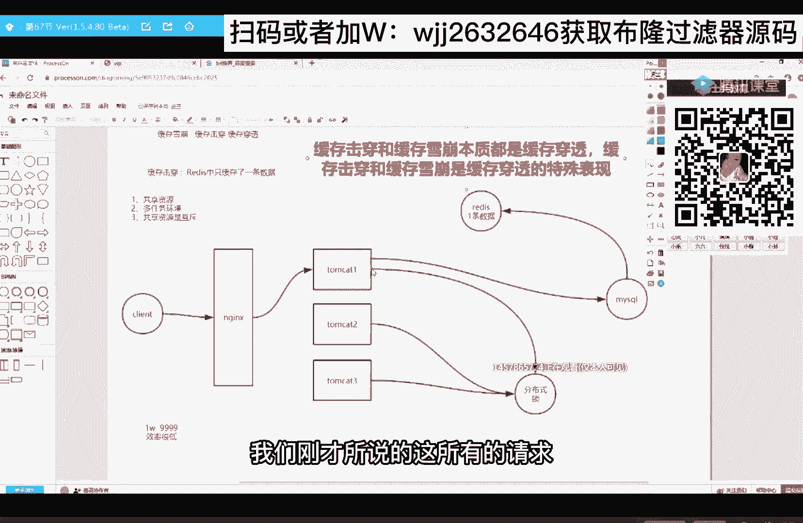

这都是请求这条数据的请求，我们没有去聊请求其他数据的请求。

我们没有关心那些。

我们只关心请求这条数据的请求，那你请求的是其他数据，管我屁事啊对吧。

我现在解决的是缓存击穿啊，啊这种解决方案效率很低，解决方案效率很低，这样去解决的不多啊。

采用分布式锁来解决不多，而是采用了一个非常简单的办法。

一般的公司啊，会弹一个非常简单的一个解决方案。

就是直接把数据把查询出来的数据。

缓存到red。

给大家解释什么意思呢。

就是这个不用这个分布式锁了，但这些你都得会啊。

都得会，现在不用分布式锁了，比如说这里边数据是失效。

他们在这请求是请求不到，他也来也请求不到。

他也请求不到，这个时候他们是不是都集中打向mysql对吗。

那就在这一刻可能有100个请求提升打下mysql。

那这所有的请求啊，你去mysql中查询出来的数据都还算到专证。

那么第101个请求，第101个请求序列里边。

是不是就能拿到数据了对吧，就是这一整个解决方案，它没有这个分布式锁的解决方案，那么严格它允许有一部分的请求。

是不是来接受mysql，就你的数据库没那么脆弱，所以一般采用第二节要放就ok。

来我给你解释清楚的，66告诉。

ok好了。

我们来做一个复盘，来做一个复盘。

通过一个redis缓存穿透给大家引申出来很多东西。

首先给大家引申出来的是什么，是缓存穿透。

那么对于不同场景下的缓存穿透，应该怎么去解决。

当你遇到了黑客，那么黑客他会采用两种方式去攻击你的数据库。

来分别应对的方案是什么，我们进而引出来啊。

不能过滤器和不能算法对吧。

然后又跟大家聊了这个缓存的血崩。

缓存雪崩怎么解决，导致缓存雪崩原因有哪一些不同的原因，怎么去解决。

它也跟大家聊了焊锡一致性算法。

然后再往后跟大家聊的是缓存击穿，通过缓存击穿，又跟大家聊一下这个分布式锁的一些思想。

就是我们讲的这些点，其实就是围绕着缓存雪崩。

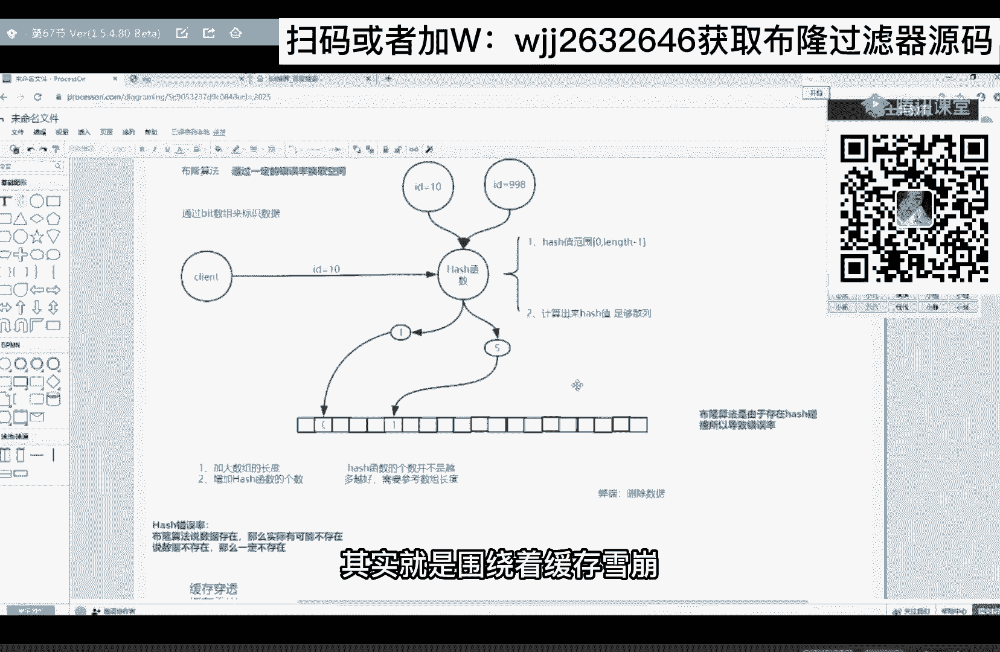

缓存穿透和缓存击穿来给你讲。

首先第一个你肯定get到了来，第一个get到66，告诉我来复一下盘，然后第二不能算算法的原理，我相信大伙应该也能听懂对吧，然后第三不能过滤器的实现代码。

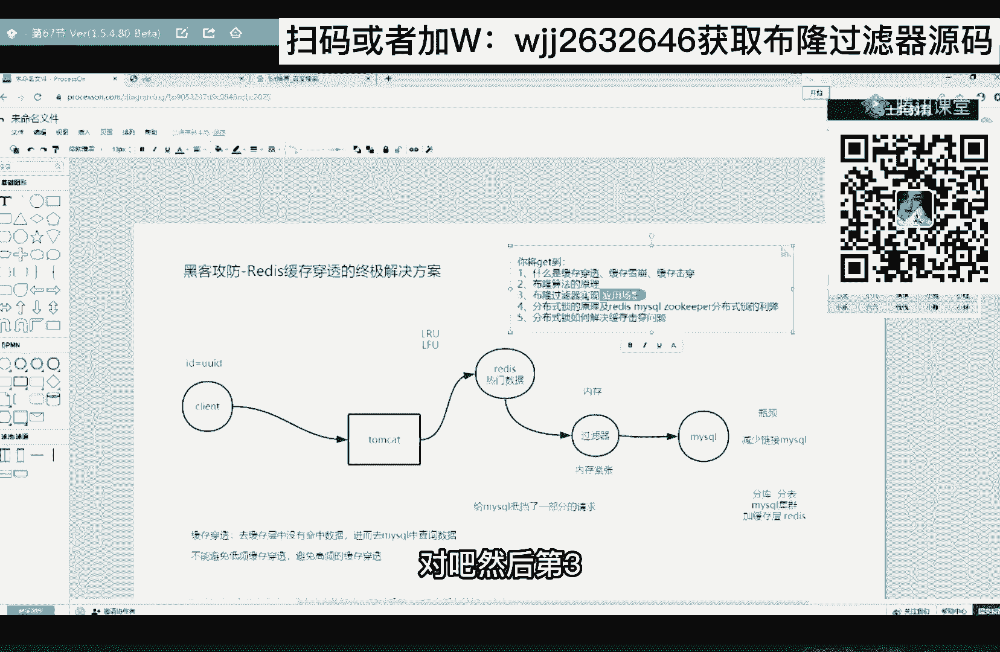

我会发给你说说给你肯定给你。

然后第四分布式锁的原理以及它们的利与弊。

聊了吧，然后第五分布式锁如何解决防弹击穿也聊了。

哎我说这个解决方案一般不常用。

原来p主唱一个。

最后我希望。

大家要得到这样一个技能，最后我要给大家讲一个技能，关于面试的技能。

我觉得很有必要，正好借助于今天给大家讲的。

应该叫我希望给大家讲一个面试的技巧。

正好借助今天讲的东西给大家举个小例子来，我问一下有多少同学最近在找工作，找工作的扣一没有的扣二，还没一个人，出去面试，一般需要写一份比较精美的简历对吧。

很多同学可能会疏忽一点，就在简历里面去挖坑。

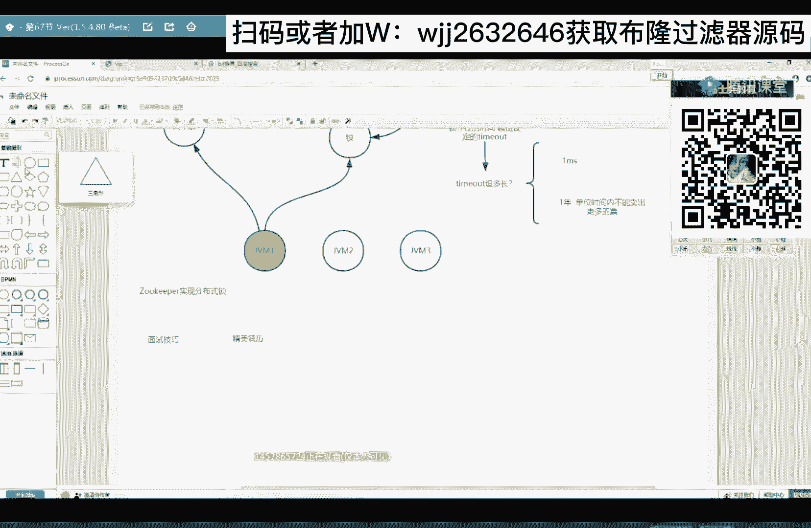

在简历里边挖坑，在精美的简历里边一定要空。

一定要挖坑，这叫残缺美，挖什么样的坑啊，你要想面试官喜欢问啥，你就把什么样的坑啊，比如说面试官喜欢问你在开发项目的过程中，遇到过哪些bug，哪些黄金bug对吧。

以及这些bug的解决方案对吧，面试官可能还喜欢问。

你在开发的时候遇到过哪些性能问题啊，以及你的优化方案。

这都有可能会问的，所以你就把这些问题。

你就主动写到你的简历上，放到你的，放到你的简历上，这里边有个小技巧啊，关于你曾经遇到过的这些bug，黄金bug你要描述的清清楚楚，关于这些bug的解决方案，要一两句话带过，你要一两句话带过。

性能问题也要描述的清清楚楚，优化方案也是一两句话带过。

这样就可以足以吊足他的他的胃口啊。

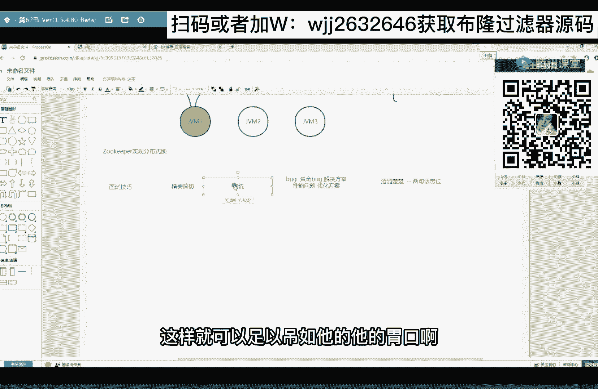

他看到你这份简历，就非常希望要见到你。

对吧。

先挖坑先挖坑，比如我们今天讲了是不是缓存。

穿透和缓存，就是缓存的一些问题。

那你基于今天讲的东西，你可以在简历里边挖一个这样的空，比如说你在上家公司接盘了一个项目啊。

刚刚接盘这个项目的时候啊，他的q p s很低啊，比如说只有10q p s。

然后经过你优化之后啊，能够达到200kp，性能提升了20倍，性能提升了20倍。

又可以把这个性能提升描述的清清楚楚。

就是性能问题描述的清清楚楚，那怎么优化，那就一两句话带过啊，比如你就简简单单的说引引用了redis做缓存对吧。

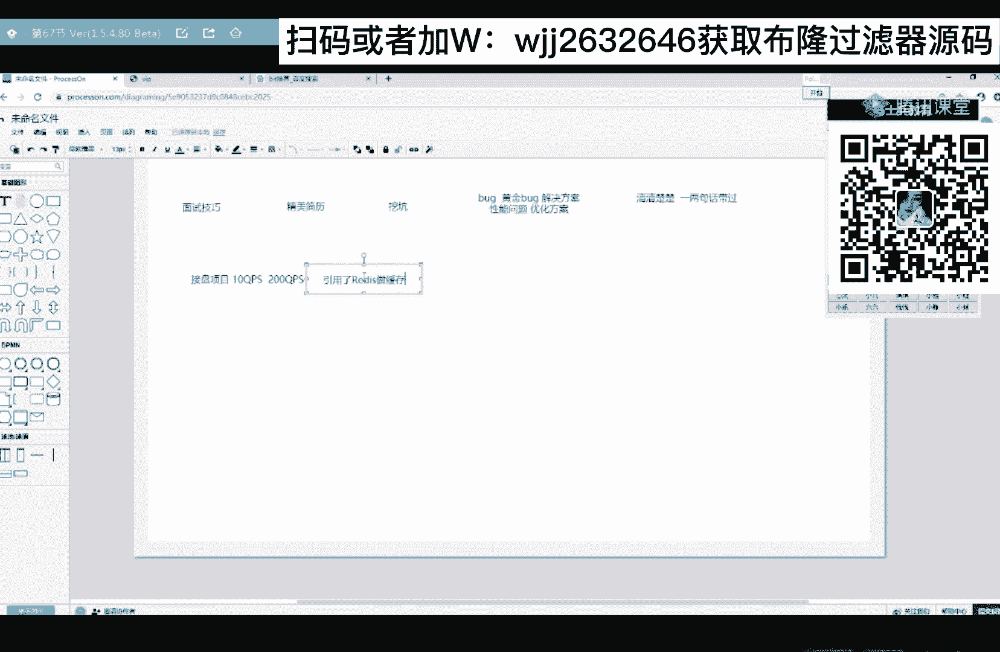

或者说做分布式缓存，就简简单单的说要吊他的胃口。

明白吧，你的简历里边要多挖这样的坑。

那么你去面试的时候，面试官所问你的第一个问题一定是。

吸引他的问题，你像这个问题就比较吸引他。

如果他不是特别low的话，它会沿着问的，他可能会问你具体是怎么优化的对吗。

这时候你就可以聊啊，我是加了一个缓存层。

我把这些热门数据我放到rise里面去，但是这个时候你要去跟他聊细节。

你当初是怎么判定热门数据的，判定标准是什么样的，你mysql中的数据是怎么迁移到raid中的。

这些细节一定要聊清楚。

你不要等着面试官问你细节，面试官问你细节的时候，恐怕你很多细节真的很难答上来。

不管你有没有做过，你，哪怕是做过有些细节，你也答不上来对吧。

所以你就主动出击，直接把细节给他聊明白了。

让他不要怀疑你，听懂了吧。

那么你在回答完这个问题之后啊，啊你说你加了一个缓存层对吧。

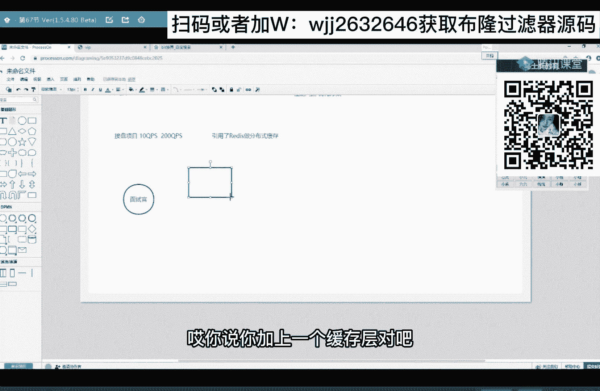

哎具体怎么怎么做的，在回答完之后，不要忘了你要抛出来一个新的问题。

哎你说我加了一个缓存层之后啊，他又给我引出来一系列的问题。

比如他给我引出来一个缓存雪崩问题。

听懂了吧，比如引来一个缓存雪崩问题。

如果他不是特别low的话，他可能继续研究这个问题来问你。

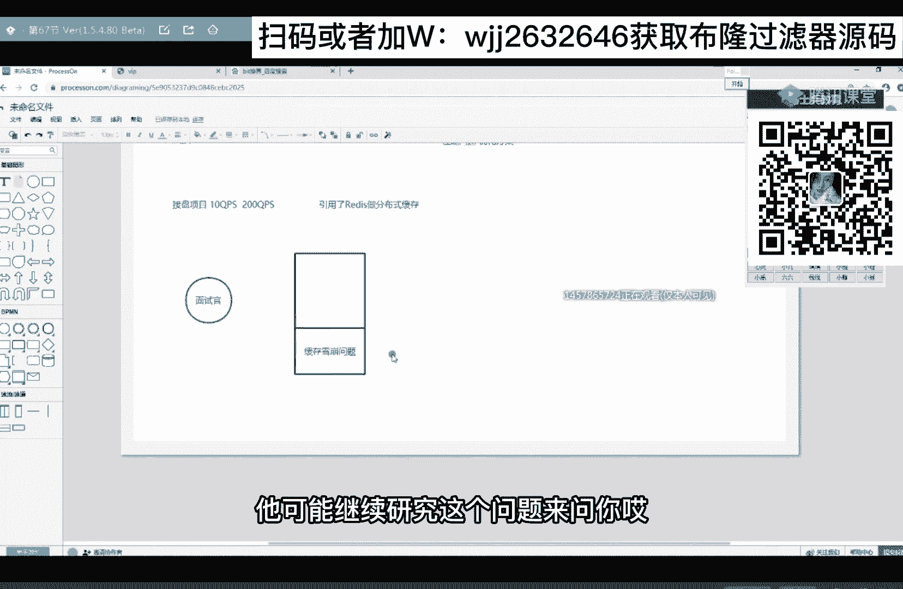

哎什么是缓存雪崩啊，你给我解释一下你们当初是怎么解决的。

ok那就把我给你讲的给聊出来。

对不对，那你聊聊完这个缓存雪崩之后啊，哎你可以说。

我们最终是通过分布式缓存来解决的。

哎我们说redis这个集群。

它所引用的哈希一致性算法简直是太了。

ok啊他听到这个关键词可能又吸引到他了。

如果他不是特别low的话。

可能又会问你哈希一致性算法的原理。

让你给他去解释，而解释完之后再给他抛一个新问题。

你说哈希一致性算法它也有弊端，它也容易发生数据倾斜问题。

唉他可能会问你还怎么去解决。

我说的这个思路呢，就是你每回答完一个问题。

你要抛出一个新的问题去吸引他，让他沿着新的问题继续问你。

哪怕你抛出来这个问题没有吸引住他，他也会继续通过你的简历。

是不是继续再找问题去问你啊，所以简历里边的坑和你回答之后。

抛出来的新问题就可以引导整场面试来，这个技巧能get到666，这个很重要啊，就是很多同学会去刷题。

会去背这些面经，你从来没有想过把这些题怎么串起来。

怎么去引导这个面试，你从来没有想过你背那么多题有什么用啊，你只能说你去面试的时候，面试官恰巧问到这道题了，你非常的开心，能回答上来，但是接下来下一个问题你可能又是懵逼的对吗。

我靠这这里边是不是有面试官啊，面试官，你赢了，你成功的做了一次间谍，来面试过其他同学的。

扣个一，我看看来是面试官的扣个一，我看看面试官别人的来。

大伙儿记好了哈，大伙儿记好了，就这几个人。

我只能帮你们帮帮到这儿了。

我只能帮到这儿了，记好了，成功的做了间谍，ok。

好这里边还有一个技巧啊，这边还有一个技巧。

就是我们除了要去设计这个面试，这个面试环节怎么去引导面试官。

还有一个很重要的一个细节。

很重要的一个技巧。

其实我们要学会去表演，其实我们要学会去表演。

其实我们回答的每一个问题啊，这些答案这都是我们提前准备好的对吧。

都是提前准备好的，就这些剧本都给你准备好了。

你怎么按照这个剧本去演啊，这也需要演啊，那很多同学可能面试官诶。

第一个问题正好就是你设计的问题，他正好问了，问了之后。

哎你这个答案也准备好了，就非常的开心啊，心里倍儿美。

他就滔滔不绝，如同黄河泛滥之势，一发不可收拾，恨不得五秒钟把这个答案给你背出来。

你觉得这个效果好吗，你觉得好吗，嗯这个房你们说就是如果你面试了一个人，你问他一个问题，就是连思考都不都不思考，直接给你对答案，对方案，不好吧啊。

所以我们希望在回答这些问题的时候。

在回答这些问题的时候，就是你要把这些什么磕巴，什么卡顿啊，什么卡壳，你要表表，你要表现出来。

你要给面试官一个感觉，你是一边在回忆当初一边在回答问题。

而不是说这个答案是你提前准备好的，一旦你让面试官认为。

你这你这个答案是你提前准备好的，那么他就会认为，这次面试不能很好的挖掘你的潜能，不能很好地考察你的能力对吧。

一定要给他一个感觉。

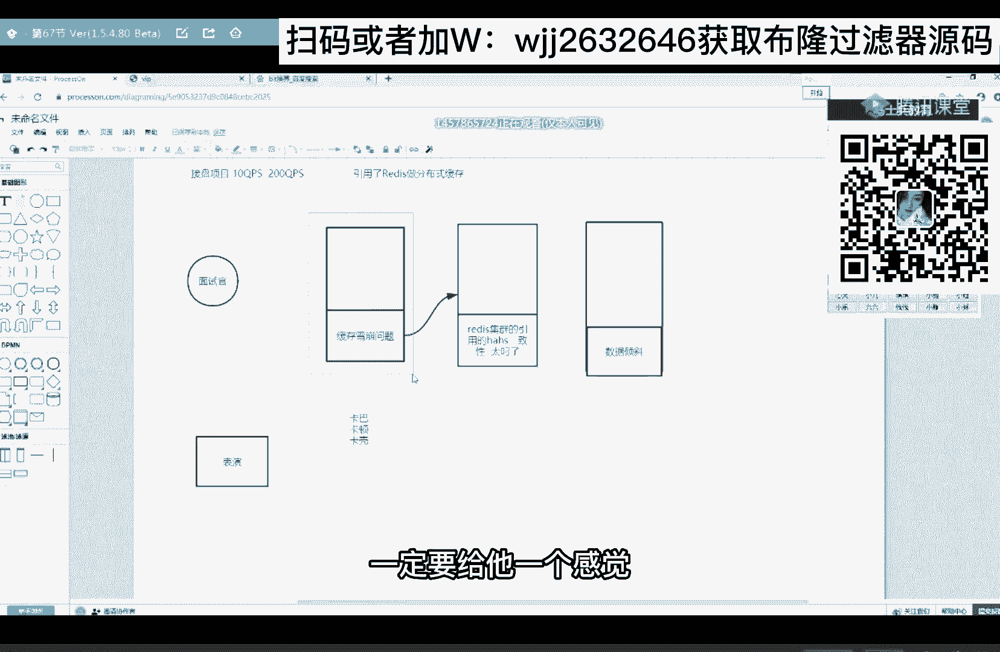

你是在一边思考，当初一边来回答问题，来get到了666。

面试官们都走了吗，所以面试成与败啊。

有很多因素来决定的，每一个细节我都要把控到位，每个细节都要把控到位。

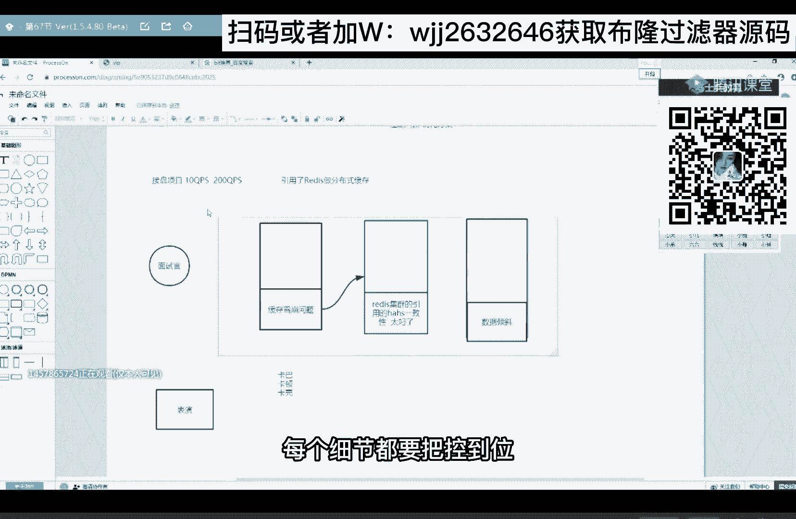

除了你要去设计你的面试环节。

在面试的过程中，也要去设计来最重要的一个思路。

我们要引导面试。

设计我们的面试环节去引导面试。

千万不要让面试官来引导你，一旦你让面试官去引导了你。

你基本上没啥戏，一个面试官是两个独立的个体。

他擅长的不代表你擅长对吧，然后第二我们细节要到位，ok这就是我要跟大家说的。

通过今天讲解的讲解的这些知识点，给大家串联了一下。

给大串联了一下，ok了，唉有同学说ready for和to keep。

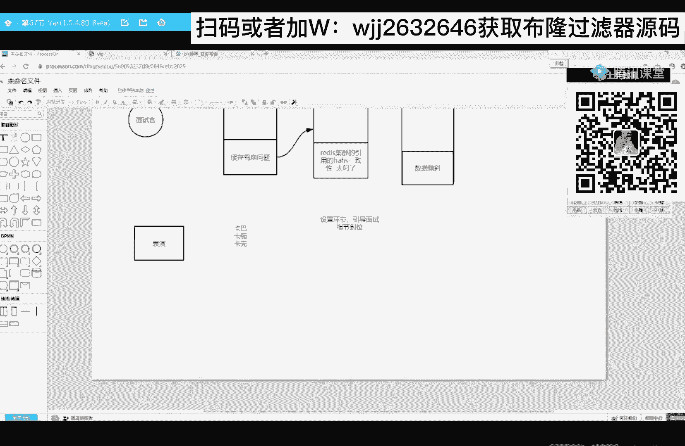