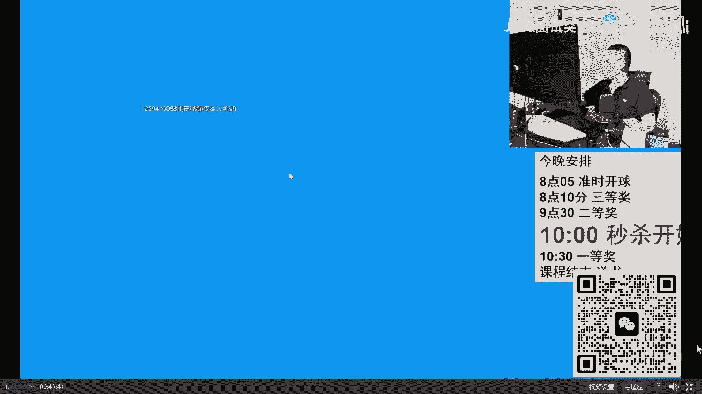
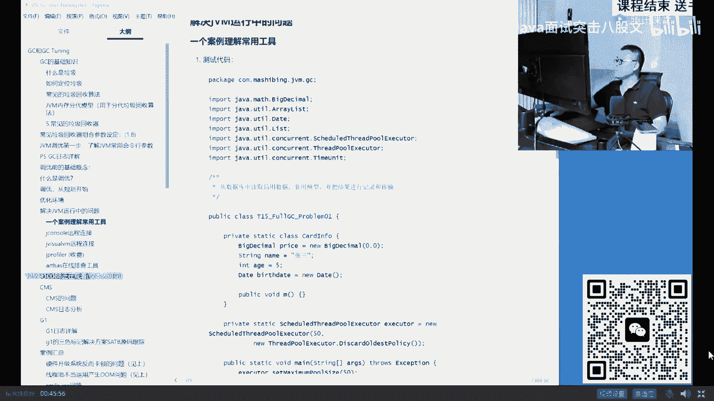
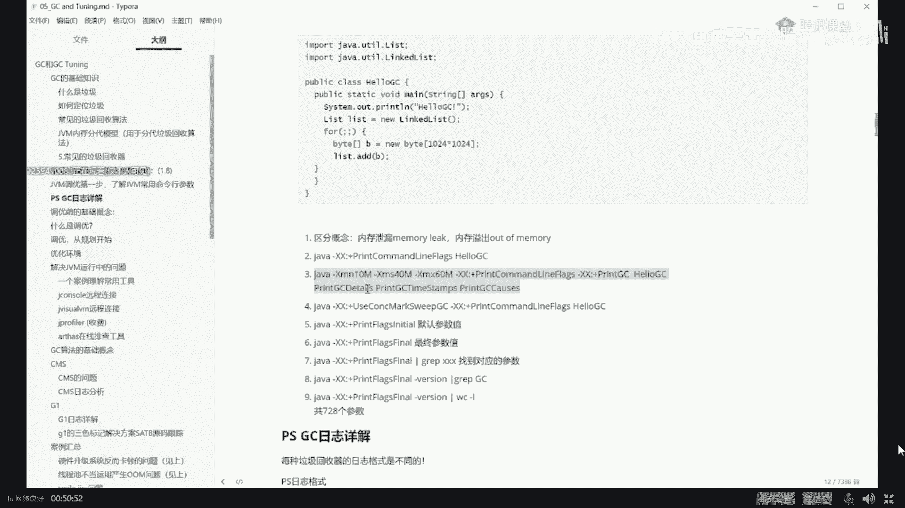
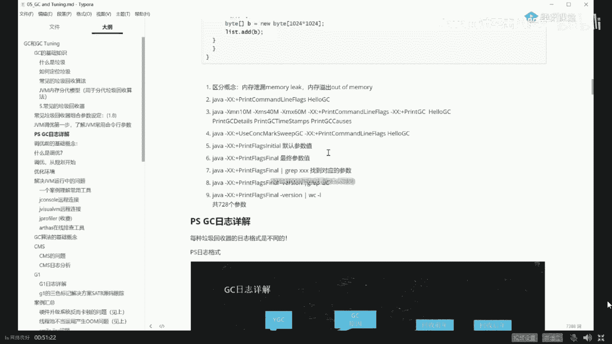

# 舍不得花27980买马士兵教育的MCA架构师课程？免费开源马士兵教育VIP课程 - P12：【JVM调优实战】JVM调优实战 - 马士兵北京中心 - BV1VP411i7E4

。开始今天的课。今天呢我主要讲什么呢？讲JVM的调优实战。JVM调优实战好吧，今天我们主要讲的是实战。

OK废话不多说。我们稍微呃回顾一下，我原来曾经讲过这个DVM的调优呢，你需要理解一些。首先啊以后一说调优第一件事，脑子里立刻浮现。您用的是哪个垃圾回收器？左有垃圾回收器。昨天我讲了10种。

不知道大家还有没有印象。有可能有同学昨天没来，所以呢我是我稍微呢呃我们。😊，回顾一下啊。烧回顾。昨天我讲了十0种蓝球回收器，就是这十0种。这是6呢分别是zeal和seal old，它俩是一对。

plor sky这个p old他俩是一对，注意这歌俩比较特殊。这个料是今年目前大多数的在线的系统默认的垃圾回收器组合。简称PS加PO。调优今天的讲的调优课建立在这哥俩的基础之上。他定有CMS啊也可以用。

但一般来说，CMS现在用的越来越少了。呃，如果用CMS，你如果达不到你自己想要的效果的话，很简单，直接升级G one。🤧嗯。okK还有几种G oneZDC以及什么都不干的epilon。

作为PS加PO来说，它是分代模型，分带模型是什么样子的，大家还有印象吗？分代模型是这样子的，你的内存呢会分成两大部分，分别称之为年轻的young以及老年的old，而年轻代呢又分成三部分。

分别是一甸园区svivve一svivve2啊或者from tosvivve零sve一说都是一回事儿。搞定。今天建立在这个模型和这个PS加PO的基础之上，我来教大家呢调优这个概念。

首先讲一点小小的概念性的东西啊，到底什么叫调优？我跟你说，调优这个词啊，用的太烂了啊，所有东西都叫调优啊，随便动点什么参数啊，也叫调优。嗯，调这个词儿实际上是如果严格意义上来讲呢，它包括好几部分。

什么叫调优呢？从JVM角度，它包括三大部分。第一大部分呢是根据你的需求进行GVM的规划和预调优，这是什么意思？比方说我规划之中，我要每天支撑100万的下单量啊，我这时候要用什么样的机器。

用多少内存这东西呢我们可以叫预规划。也可以叫玉调肉。第二个呢是优化运行这Y的运行环境。比如说你现在这Y文运行环境运行特别慢。가든。好，这个时候你需要定位到一个系统的瓶颈来进行调优。

定为一个系统平瓶颈呢基本上要进行压测，要进行全链路的压测。那么如果是单机的话呢，你只要通过方法进行跟踪就可以。那么如果是分布式的话。

你需要用zip k啊、sky working啊这一类的进行全链路的压测来找出来到底哪个服务特别慢。然后再进行调优。好，这块儿我我解释的，不知道大家还能不能跟得上，能跟上的给老师扣1。

You文 the tuning， yes。你说的太对了，你英文太好了。嗯。来，我们继续。还有一种调优呢是面试之中问特别多的，就是解决这Y运行过程之中出现的各种问题。什么问题呢？

比方说memory leak。比方说OOMOOM的全称叫out of memory呃，内存溢出内存报表这个意思。今天呢我用一个小例子来教大家解决这类问题，你会用到哪些个工具和他们怎么具体的使用。

好好听我说，如果说调优你需要理解很多很多东西的，你需要理解怎么去设设定日志的参数，你需要理解呢怎么啊这个日志。日志怎么去解读它？呃，今天呢我给大家略过一些细节，就像昨天我说的。

希望各位小伙伴们先学最粗犷的东西，然后树干再学树枝儿，再慢慢去抠每一片叶子，你才会变得越来越牛。关于日志这块呢，其实还是挺复杂的。每一个日志你怎么去解读它。我们暂时先略过它。

今天也用不太上用到的地方我大概跟大家说一下。另外呢在工业生产环境之中，一个java程序应该设置什么样的参数，这块也特别重要。有一些参数很多人从书上得来的，实际人家工业环境不可能那么设。

比方说你设置日志文件就设一个，这不可能的好吗？一个日志文件，你很快硬盘就占占满了，所以这根根本不可行，必须是循环的，好多个日志文件不断循环。

比方说你根本就不设heep dump on out of memory error。就是说如果说它OOM之后，你不把堆导出来，那你完蛋你定位不了问题，所以这个也不行。

呃，这块呢我们暂时先把它略过。