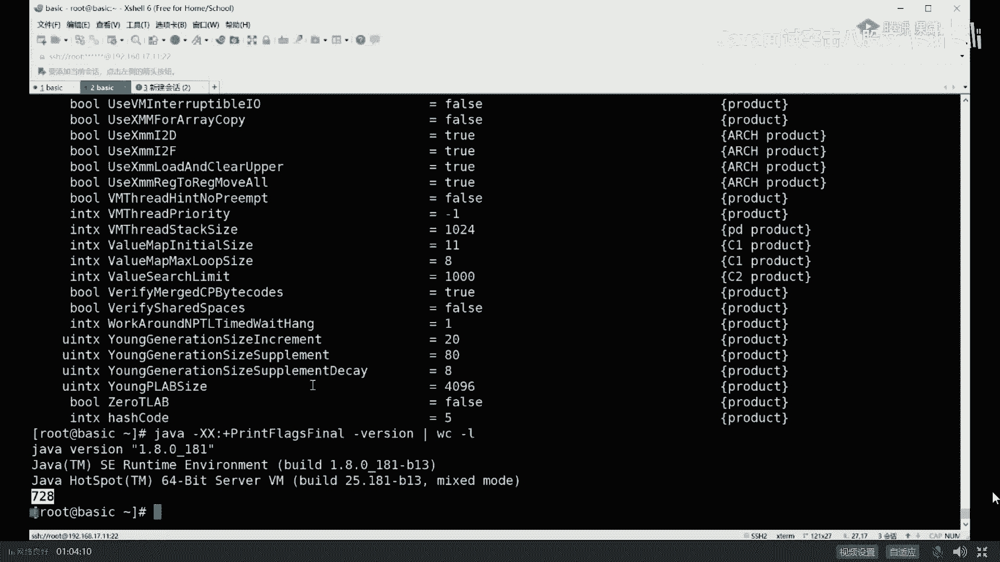

# 系列 4：P14：【JVM调优实战】定位JVM问题的实用参数设置 - 马士兵北京中心 - BV1VP411i7E4

加一些最基本的一些常用的命令线。作为java来说，最常用命最常用的命令，当然就是java是吧？好，我们下面来聊一下java的参数。java回车，你会看到作为一个java命令，它后面可以跟哪些个参数？

我先说第一点，就是当我们一敲java的一个命令的时候，它就会启动一个java虚拟机。以前老我同学在这里头犯糊涂，说老师我起了一个javaT1，又写了一个java T2，这这是几个虚拟机啊？两个。

只要你敲一个java命令，就会起1个GVM。这个JVM专门给他服务。这个JVM专门给他服务，你调优的时候不能两个火在一起调啊。这件事很难很难理解吗？很容易啊。好，大家看这里，作为java来说。

它本身有一好一堆的参数。这种以横杠开头的叫标准参数。标准参数没有多少。看上去呢也并不太难理解，但是你不要忘了，这里还有一个杠X开头的，这叫什么non standard non standard。

非标参数。非标准的。所以你需java杠X回车的时候。

它会把非标参数全都给你列出来，像杠Xmix杠S interpretpre这个我在VIP课里有讲过，像什么diagnostic啊，nonclass dC啊等等等等。

这些杠logDC这都是设置你的GC的文件的等等。杠XMS XMX我们都设过了。好，听我讲这个叫非标参数，像这些参数都是可以用于调优的。但是真正调优用到的东西是以杠XX开头的。但是很不幸的是呢。

这个杠XXX开头的这些参数，它是没有一个专门的文档给你列出来。如果你想知道这些参数到底包括哪些。用。这个东西print。Flas。Final。

friend flies final叫打印所有的参数的最终值。我们后面不跟class文件名，直接敲一杠version。我们看他有多少呢？当然你是不知道他有多少。

来试一下。这个杠XX开头的参数非常多。

OK大概是有这么多屏。到底有多少呢？

WC杠L回着。好，一共有728行，透除我们这些特殊的信息，大概有700个参数左右。

恭喜你啦。知道为什么java调油比较值钱了吧。H。

不过呢你们也不用心慌，作为老师这么体贴的男人。肯定会告诉你。到底有哪些个常用的，常用的就这么多几十个而已。parallel常用的参数又有哪些？CMS常用的参数又有哪些G万常用的参数又有哪些？

所以加起来呢也就几十个而已。

不用担心。Okay。脾今天可以放吗？可以啊，没问题呀，脾在哪儿聊聊小姐姐就知道了。好，我们可以继续了吗？可以继续，老师扣一了。😊，好玩啊，我跟你说，实战的东西还是比较简单，又比较好玩的。太多了。

我就给你700个参数里头，我给你摘了几十个出来，还多，你还要怎么你还要怎么着？😡。

好，你看啊程序呢已经开始呃慢慢的呢在不断的产生GC了。由于它不断分配对象，所以它不断的产生GCA。

嗯。