# 系列 4：P15：【JVM调优实战】用top、jps、jstat、jmap等“业余”命令行工具进行定位 - 马士兵北京中心 - BV1VP411i7E4

好，下面呢我教大家一些。呃，常见常用的命令用来跟踪我们java的进程呢，到底有没有什么毛病和bug。第一个命令。叫做JPS但是同学们你们呢也不用记。

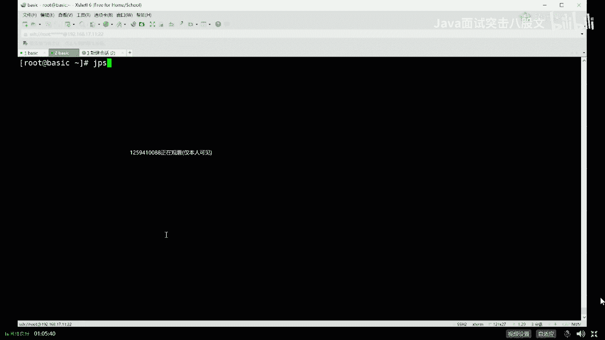

作为老师这么体贴的男人，你猜我给你记下来了吗？一定是记下来了，所以不用挤啊。常用的工具我都给你记下来了嗯。

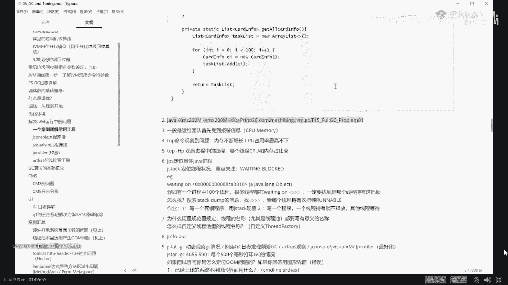

好吧。好啦。

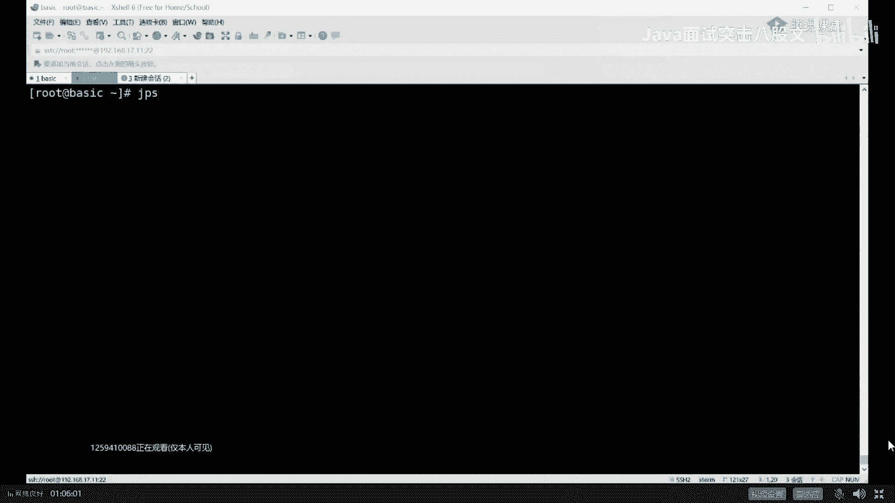

。好，我们先聊第一个工具，第一个命令叫做JPS这资料可以领啊，没问题啊。第一个工具叫GPSGPS全称的叫java processes。什么意思呢？就给我列出来整个系统里面java的那些进程。

我们java两个进程。第一个就是GPS本身，第二个是11800的T155服，就是我们内程序。就是它好，这是第一个命令。😊，第二个命令是什么？第二个命令是the infer。

你看一眼它的名字叫java的 infer，很容易就能理解这东西是是个啥呢？这东西是java进程的一些相关信息。后面当然要跟我们进程的名称，11800回着。

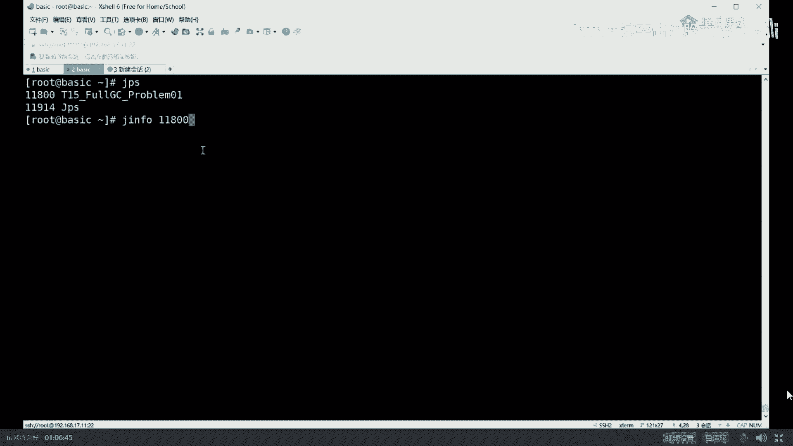

他会把11800这个进程相关的一些属性全都给你列出来。

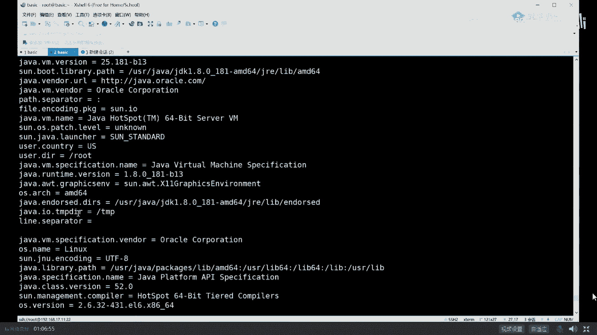

啊，比如说separator是什么啊，比如说那个我们的java的虚拟机是谁来提供的啊，等等等等吧，其他的比如说我们的bu class pass里面包包括了哪些站文件。

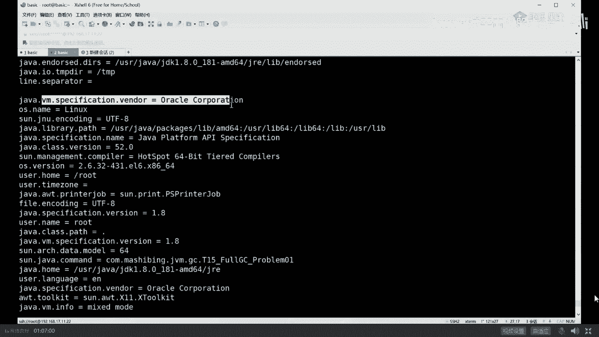

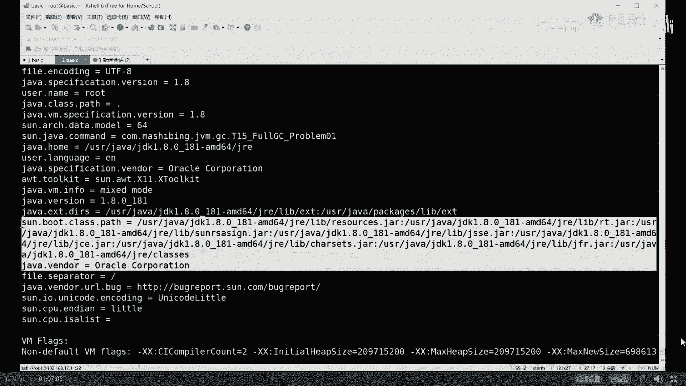

等等等等吧啊。比如说我们它的嗯默认的这种启动的参数是什么？嗯，com line的参数是什么？OK这一份这个通过这些信息呢，你可以定位一下你你的程序到底哪有问题啊，这两个命令非常简单，我就快速过了。

OK下面呢我来教大家另外一个命令，这命令呢叫J state。This later state the。statistics叫做叫做java的呃统计信息啊，或者叫java的数据的跟踪信息。

this date最常用的，你要跟参数呃。J state的杠GC就是跟踪他的GC的一些信息。后面呢跟11800，这是什么东西呢？跟上我们的进程号。

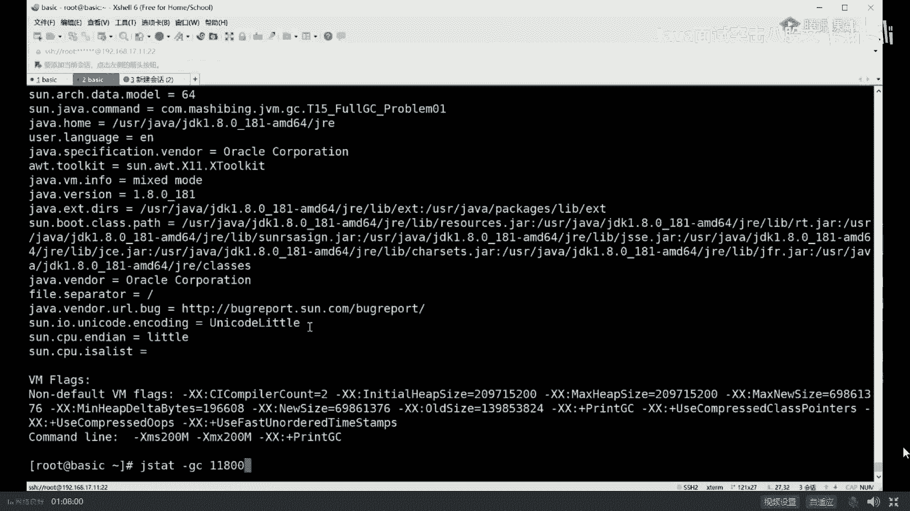

然后回车哦，你会看到他会把。内存里面的每一块区域占有的大小全部给你列出来。当然这些区域呢，其实它代表的什么意思？上网一搜你就知道。但是这个东西呢读起来呢特别的特别的。不爽不顺啊，这东西读起来特别抽象。

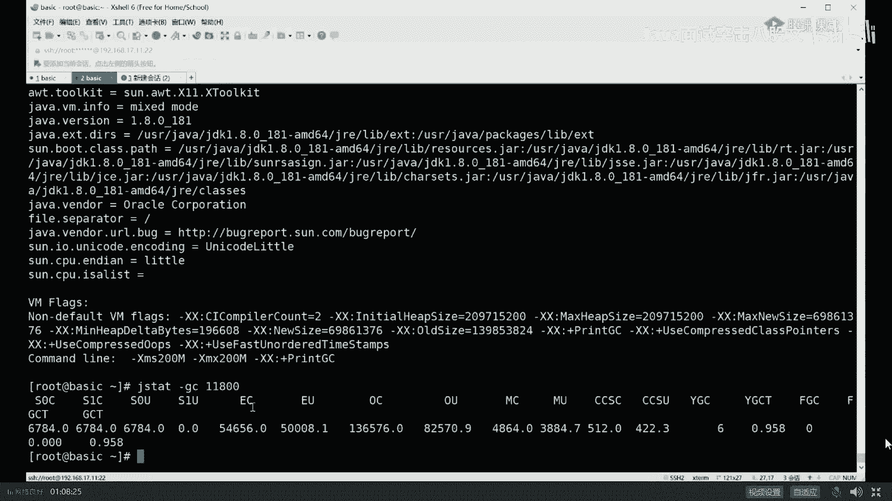

呃，这个命令还有一个参数可以跟后面跟1个500，指的是什么呢？每500个毫秒刷新一次，你能观察到你内存的动态的变化。这命令在不装我们后面我要讲的超级的工具之前，这个东西呢完全是有用的啊。

你可以用它来跟踪你内存的增长过程。你注意看这块内存它会不断的往上增长啊，中间这块。这块儿。从27直到313233，当然你跟踪了之后，你就会知道哦，原来我的程序已经在不断吃内存了。

会产生这样这样的呃一个直观的认识。

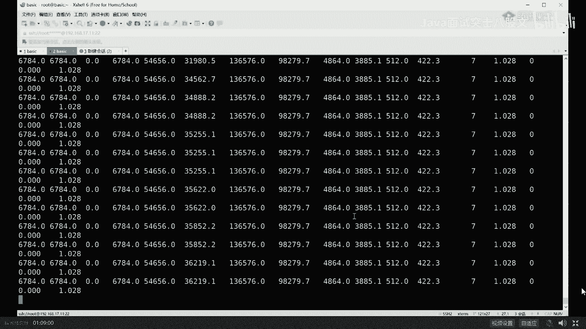

好好听我说啊，就是这里面的每一个参每一个名字代表什么，我就不给你解释了。因为后面呢我会教大家在实际当中能够用起来的呃工业级的特别棒的一个工具。阿里开源的阿尔萨斯好吧，OK你知道人民命令就行。

这些命令都是JVM自带的JDK自带，直接拿来用就行。

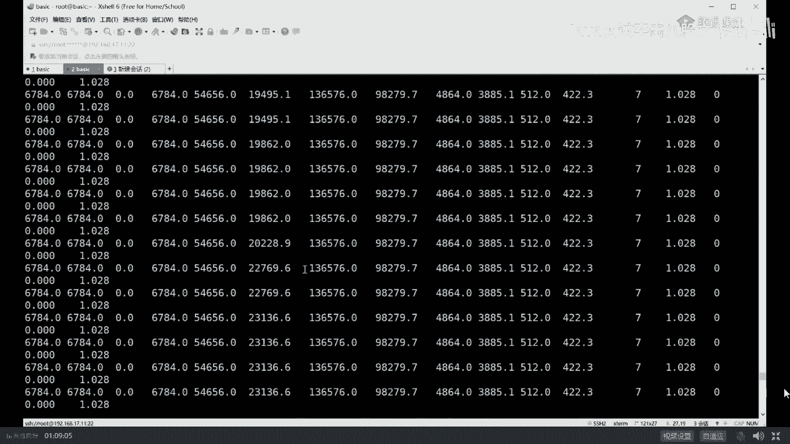

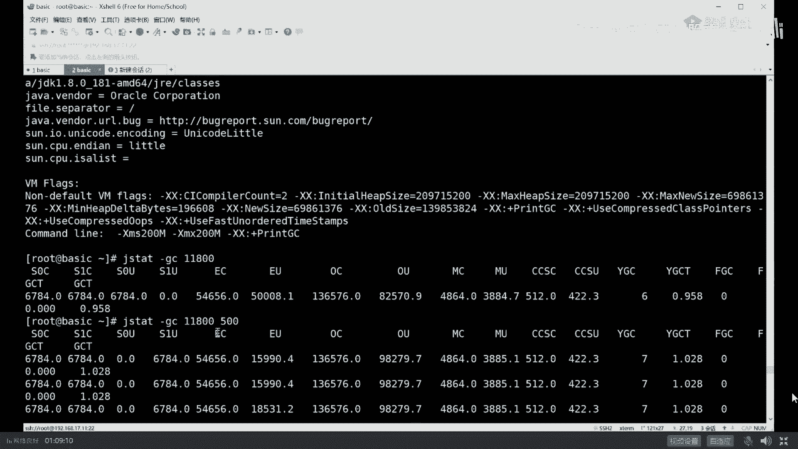

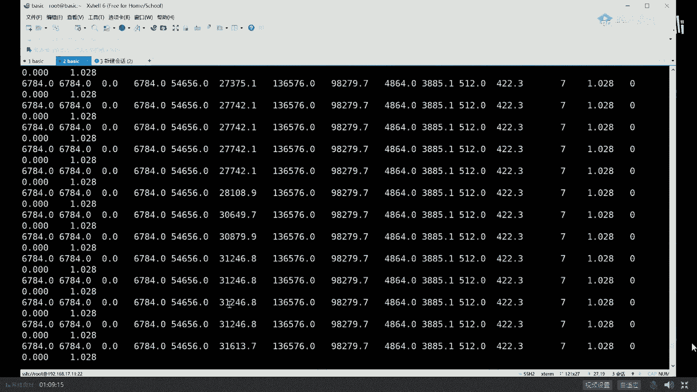

好，除了这个之外呢，我教大家另外一个命令，这命令是什么呢？Jt。Cl J stack。这也是一个非常重要的命令。这t的意思t叫站。站是谁来拥有来着？还有印象吗？是不是县城啊，县城才会拥有这。

所以Jt就是用来跟踪县城的。11800，他干一件事儿，会把11800里面所有的线程。

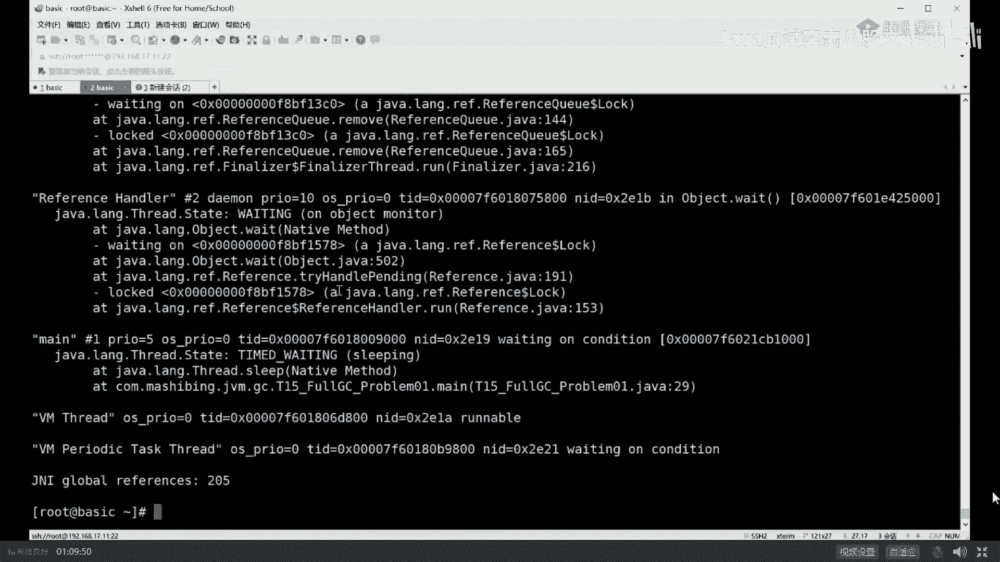

所有的见证啊。还木吧。一瓶两瓶三瓶四瓶，你就会看出来它会把所有的县程县城名的线程编号、县程的优先级。操作系统级别的优先级，现成的状态啊，这是现成的状态。包括县城的调用对战。

tack trace就是这个方法掉了哪个方法，这个方法又调了哪个方法，A方法调了B方法，B方法调了C方法啊，调用站，把这个调用站给你打印出来。这有很重要的作用。比如说你观察到某一个县城或者某几个县城。

一直是waiting在某一个所上面啊，这个candation看了吗？就这个线程一直是waiting on condition。如果很多县程一直wa在某一把锁上面。

那么这时候是有可能是说你的你的程序产生了死索。还有。在面试官问问题的时候，有一个经典的问题，这个经典的问题是。同学，如果你的这VMCPU爆了，请你告诉我怎么去。查这个问题。怎么追查这个问题？

如果你的GVMCPU爆了。比如说你这VM。90%的CPU持续。居高不下。怎么查？有谁遇到过这问题吗？面试的时候，面试官问你。有遇到过吗？你看打小打小就遇到过，因为他打小长大的。向死而生。

他遇到的问题比较多。对。top杠HPtop杠HP呢是说你已经知道这个JVM已经占据占据占据比较高的CPU了。他问你呢，是知道你的JVM已经占据很高的CPU，你怎么去查它呢？怎么去定位问题呢？水和牛羊。

毛老师别闹。马老师什么时闹了？马老师作为中国正经老师，number one严肃课程，number one的老师，怎么能闹呢？一般是某个线城在发傻。如果一个线程在发傻，它在wait。

它是不需要消耗CPU的大哥。采样分析，最后是加密算法问题。小杰，前两天咱们联系过是吧？还听我说啊。好，听我说CPU比较高。拿什么看？其实你呢得去查。这个线程它呃就是什么样的线程在占用CPU。

那么这东西怎么查呢？教大家系统级的命令。所谓系统级的命令指的是。听我说所谓系统级的命令。指的是linux系统提供的下一个命令叫top。贵州。当我们一条top回车的时候。

它会给我显示出来当前系统里头的哪个进程占的CPU是多少，占的内存是多少。

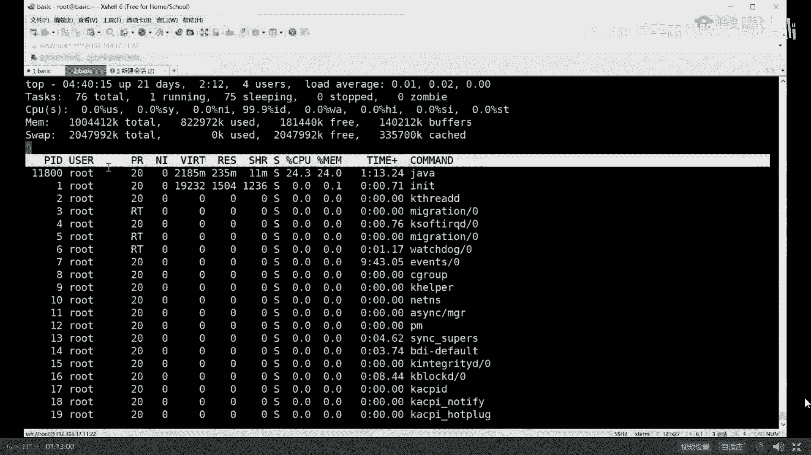

如果你top多观察几次的话，你就会发现它的内存会不断增长。它的CPU呢有可能是忽高忽低，这是我们的程序产生的问题。当然，如果你只是观察top这个命令的话，你只能观察到某个进程占的CPU比较高。

如果你想知道这个进程里面哪个县程占的CPU比较高。

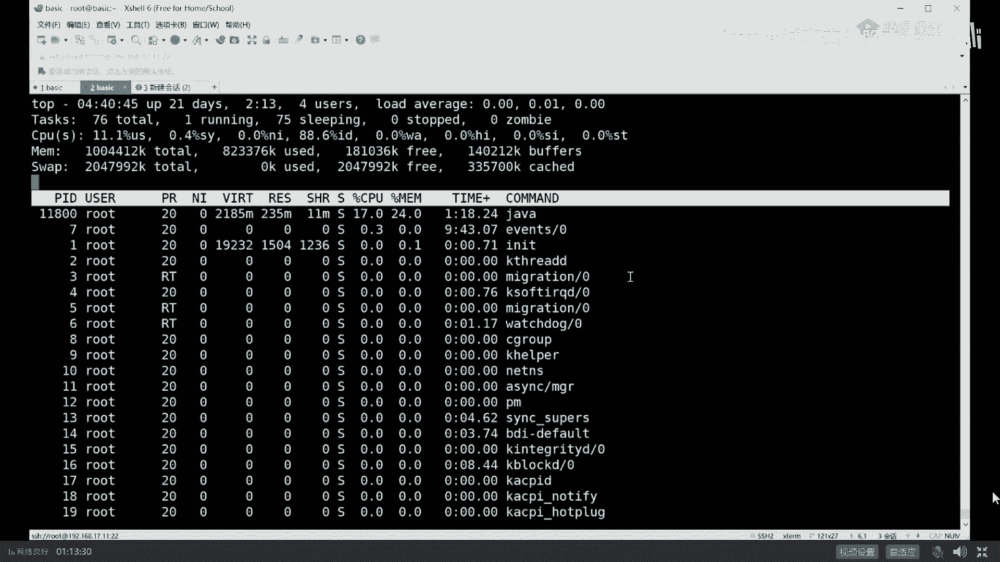

小伙伴们，你得用另一个命令，这命令叫top。依然是t，但是杠HP11800回手。

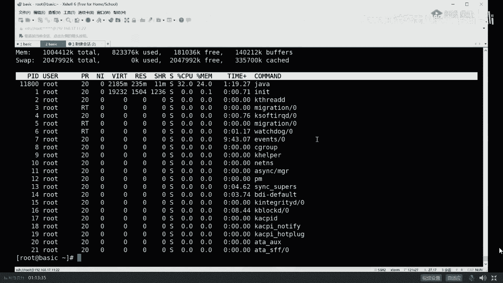

他就会把你这个县程里面的你这个进程里面的所有的线程给你列出来。然后他的CPU。

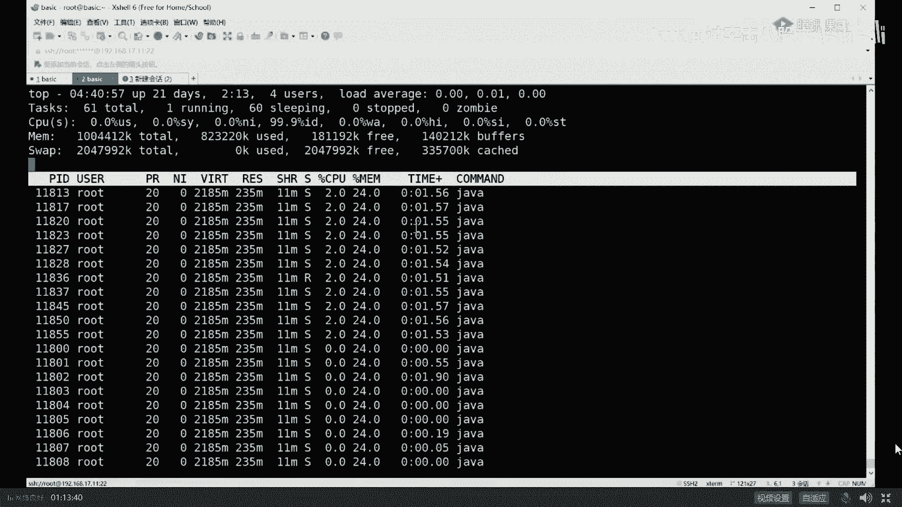

给列出来。所以如果你要是玩这个的话，得得怎么办呢？啊，得是这么办。得这么干，你仔细听我讲啊，就这块呢如果不采用先进工具的话，你得这么干。首先top找出来哪个进程占CP比较高。

接下来top杠HP找出来这个进程里面哪个县程。占CPU比较高，然后根据这个线程编号，用Jt。对照Jt执行的结果，Jt大家知道会跟踪出来好多好多线程。把这个线程编号跟Jt结果对应上。

看看这个县城到底是哪个。一般来说，我讲到这还能跟上吗？能跟着给老师扣一来，可以吗？good，这块也不难啊，就是一些思路和工具的运用。很简单很简单啊。你放心啊，再难的问题在老师这儿都是很简单的。

so easy。to simple那you在这里。找到这个县城之后，需要定位这个县程有两种情况。第一种情况，这哥们儿是。VMth一般就是GC垃圾回收现程，这哥们是业务现成。那这二话不说。

去看这个业务线程里掉了哪些方法，是哪个方法不断的循环占CPU呢？这就是业务进程，你怎么去查，这跟业务相关。假如你定位到是GC，那么它一定是在频繁的GC。不断的GC，所以它的CPU才不会不断飙高。

这时候就干嘛？读GC的日志。

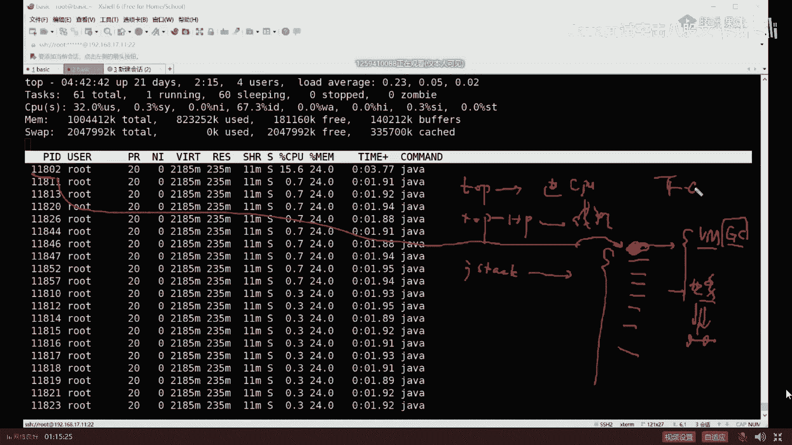

看看日志里面是不是在频繁DC原因是什么。有可能压力突然间爆表了。双十一正好赶到12点那那那那一秒，哗来了一大波的流量爆表，啊这是正常的，你应该能撑住，撑不住的话，你扩机器。还有一种内存回收来回收去。

总是回收不掉。那么这种情况就是有内存泄露。这过程我说清楚了吗？听明白同学老师扣一来。😊，嗯。good，你看他现在CPU已经占993。9了，看到了吗？😊，好，我们看这里。

当我们看这个呃我们程序的输出的时候，你会发现它已经在不断的FDC了。注意看。最关键的是呢，我们来读它的这个输出信息啊，你看一眼它的输出信息呢会明确的显示出来。这哥们儿呢FDC的过程是这样子的。

他每次的回收内存是从20兆开始回收198015。回收结束之后还占多少内存？198098009就回收了6K。我们总的大小198016。回收一次就回收了6K。哎，这哥们儿还特别的。坚持。他呢也不报啊。

内存也不爆，每次就回收个6K哈哈。嗯。Okay。好，那说明什么？说明我的内存里头一定有一个有人在不断的占内存，而且我回收不掉它。再说一遍。当你看到频繁FGC的时候，这个呢就叫频繁FGC。一秒钟好多次。

或者你内存比较大的时候，几秒钟一次、十几秒一次都可以认为是比较频繁。还要听我讲。频繁FDC怎么定位？这个也是面试官经常会问的。频繁FDC怎么定位观察你频繁FGC的每次回收过程是不是正常。

比如说你这里显示的是从每次都从200兆回收到20兆good，这个是正常好吗？这是 normalmal是正常，没毛病，不要给人家吃药。他频繁的原因，你的前端的压力太大了。他的那个负载太重了，他必须得处理。

这个很正常。但是如果是说像是我这种的，每次200兆回收完还是200兆。那么你想想看它发生了什么问题啊，一定是在我的内存里头。有谁把这内存全给占住，而且呢？都有引用指向。垃圾回收不掉。没有你吧。

听听听懂听懂我的意思了吗？好，我们可以继续吗？可以继续，老师扣以。这小程序牛叉就牛叉在，它呢是不断的产生毛病，它还不报哈哈它偶尔会报，偶尔不报。就是这么的牛程。Clear。我们在把这终于跑起来。

不然我没法定位呢。好的。下面我教大家在这个小程序里面。是由谁在调用，在占用我们内存？谁在占用我们内存呢？教大家另外一个命令，这个命令叫做。Come on bybe。好，这个命令叫做。

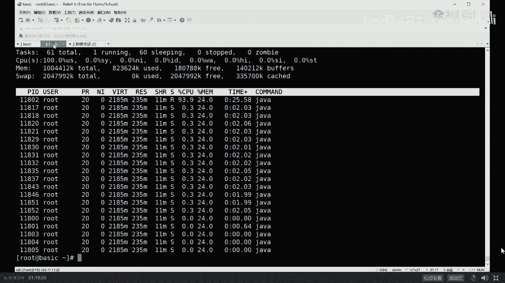

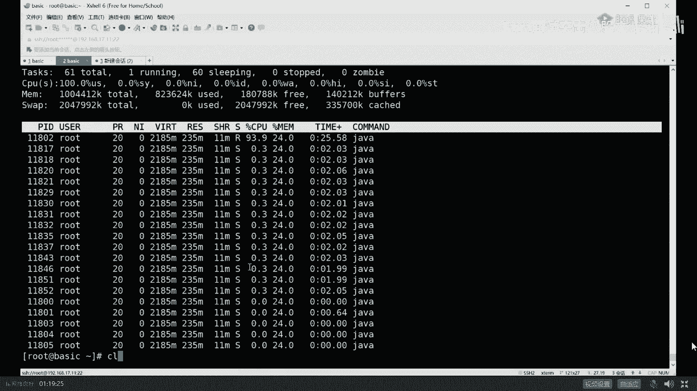

Yeah。著名的JmGm呢这个命令有两大作用。第一大作用呢是帮我查一下堆内存里头哪些个对象占用的情况，就是不同的类的对象占用内存的比重。占用的情况，这是第一个。第二个呢叫产生。堆转储文件啥意思呢？

什么叫堆转储文件呢？当你怀疑这个JVM的内存里面有bug的时候。你用这个命令可以让。整个的这块内存。导出来。存到硬盘上存成一个。文件，然后你可以把这文件拿出来分析。大家听明白的意思了吗？来再说一遍。

这面赔两大作用，我一个一个给你演示。我们今天说第一大作用。Gm的离带作用。刚。hiisttogram生成对象图46。我们我们我们得看我们那个进程号是什么啊，GPS您的进程号是12049。sorry。

不是11988。说不定正号jam，你看hi program。跟进成号11988，魏哲。它会生成什么呢？它会当前你在正在运行的这个JVM里面，它会对你进行一个整体的分析。从头儿给你分析到尾。

哪种类型的class里边有多少个对应的对象，我们看脑袋就知道了，看这里。

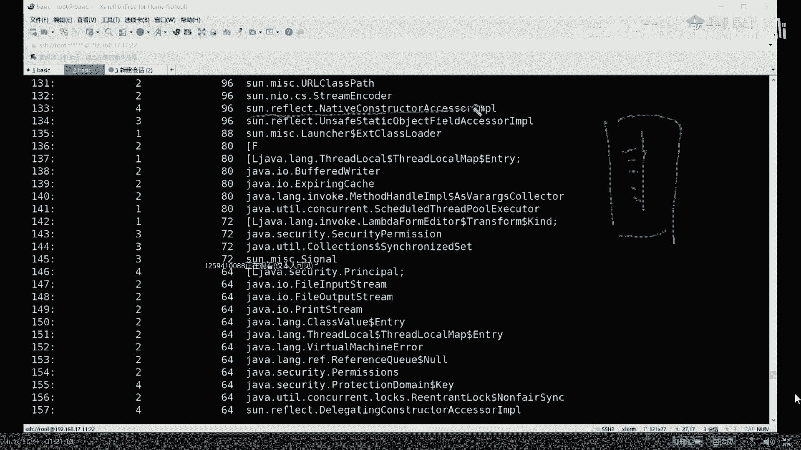

来注意看。有这种类型的对象，333个。占了这么多字己。有这种类型的对象，什么类型呢？叫stter filter task。还有一个叫big D mode，还有一个叫ca in的。

这是我们刚才读代码的时候读到过它有多少个对象呢？这个类有多少个对象呢？11万个占了多少个字节呢？这么多个字节，然后呢，它是从大到小排列。大家看懂我的意思了。来。当然其实大多数的时候。

我只需要观察前面的部分就行了。爱的取取取前二十行就行了啊，我不需要观察下面这些就只有一个对象的，它一定是占不了多少内存，他不会说让我回收不掉的。回证。好。

从这你就能看到这个呢是目前为止在我们整个的JVM里面最占内存的那些对象就产生了。这是这map的巨大的作用，不知道大家ge到没有。所以同学们，你们想想，有一些东西我回收不掉，我执行完Jm之后做了对比。

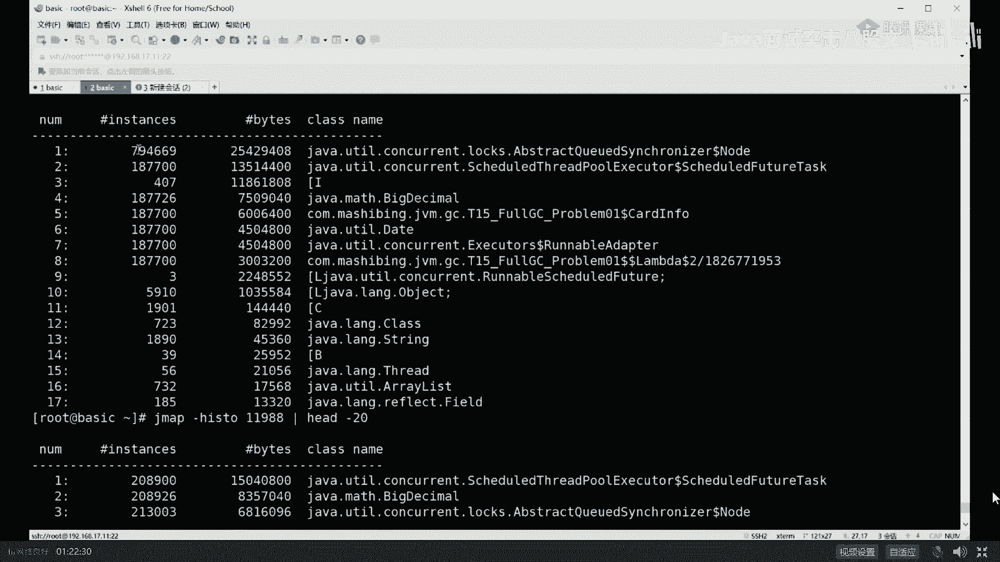

比如说就拿这个big decimal的对象来说，big decim对象你的前面是18万个，我又执行一次就变成20万个，没回收啊。来再继续。变成22万个没回收啊。变成哈依然是22万了。23万个。

不知道大家观察到没有？有一些类的对象在不断的产生，而且回收不掉。Yeah。H。Yeah。所以会产生什么问题啊？你是不是get到了？我的内存被占用，回收不掉，就是由这些对象引起的。是。哦，这块还能跟上吗？

能跟上给老师扣一。这是音的数组。叉数组by类型数组这种的一般都比较正常，不会出大毛病。嗯。那这事儿是不是就简单了？既然你知道哦，原来是我的sgattered filter task。

或者是n或者是b decimal，或者更有甚的是cut in。是由这些类的对象不断的产生，而且回收不掉造成的。那怎么办？简单你去查你的业务逻辑嘛，你去查你业务逻辑不就完了吗？很简单啊。😔，查业务逻辑。

好，这作业留给大家吧。我告诉你。我教你定位东西超级简单。

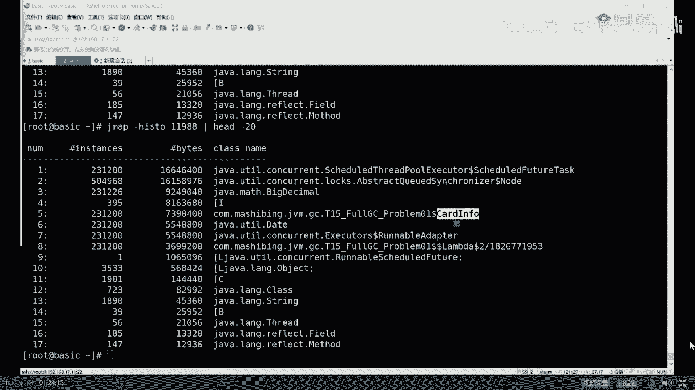

他再难，在老师这儿也是嗯小菜一碟儿，豆芽子长一防高，它也是根菜啊，想咋吃咋吃。但是呢真正在业务环境里面，就算你定位到是由于calin这个类不断产生对象吃内存造成的。可是他原因是什么？你能知道。你试试看。

我的小程序给你，你们自己去调，看看能不能把这bug给调出来。我告诉你，如果你不懂。现成池完蛋，你还是调不出来。就算你懂现城池，你也未必知道问题出在哪儿。更何况在你实际工作环境之中，这些毛病啊。

你的业务逻辑呢是分布在很多特别复杂代码比这个要长好多的那些文件里面。所以，定位问题并不难解决问题才是真正的难。

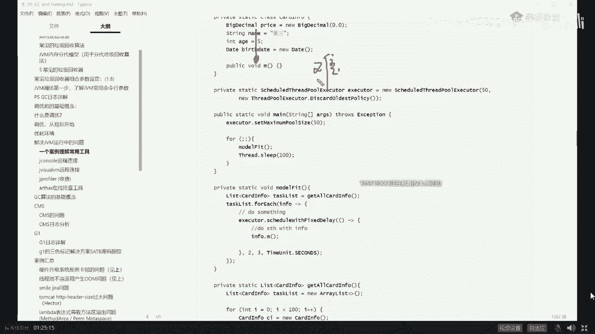

好，我们稍微的复习一下。

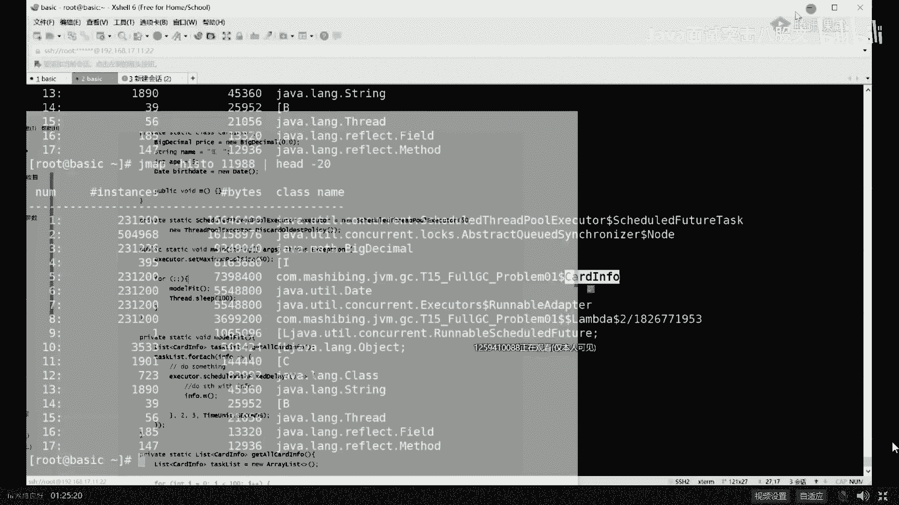

我今天呢给大家讲了几个常用的命令，回顾一下，第个叫top。第二叫top杠HP。

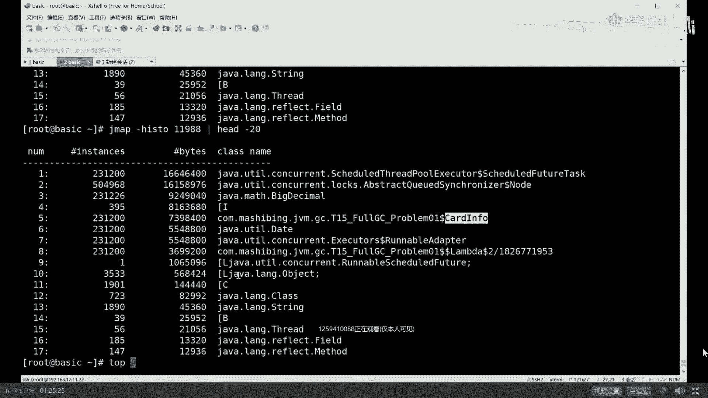

好。第二个呢叫GPS很简单，这infer。

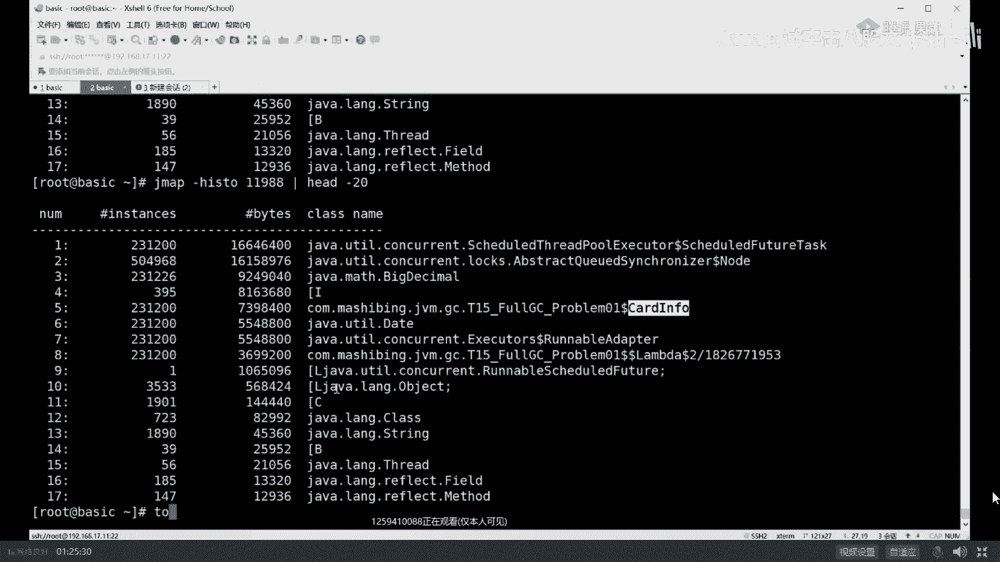

列出信息来。第31个继续啊叫this tag。O，这 state。OK还有一个呢叫jam。 jm的第一个作用，把里面的每一个最用的最多的这些个类给列出来。所以当面试官问你的时候，你就可以说了啊。

我实际当中写了这么一个程序。

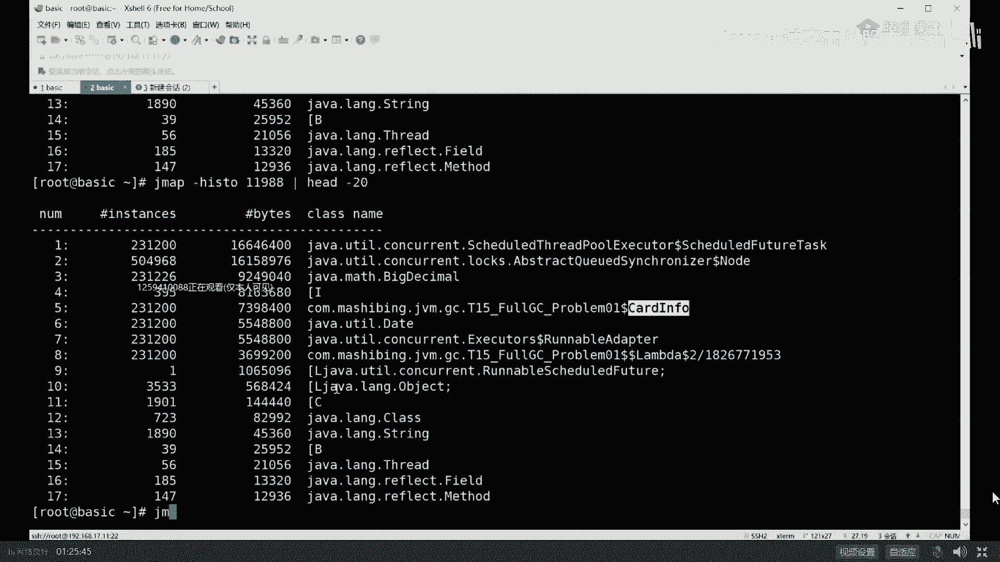

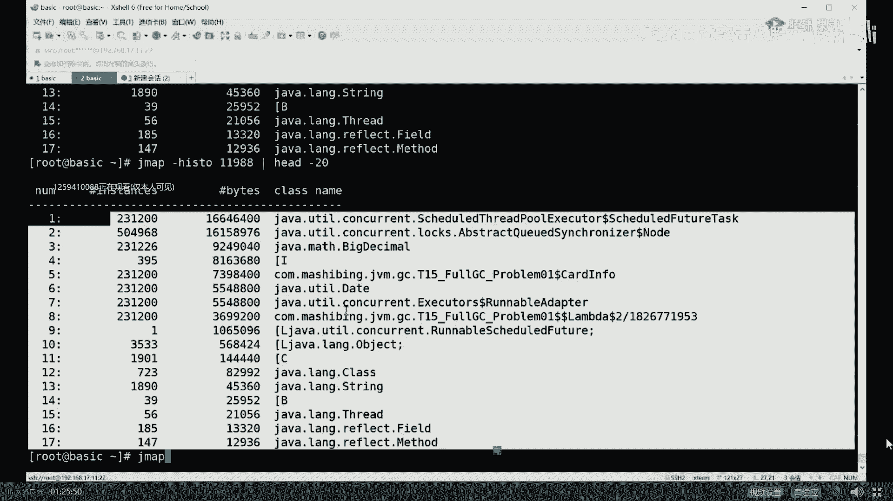

风险普查模型，然后它产生了内存的泄露。我们频繁频繁GC，但是回收不掉。后来我一定位，我发现了卡yinfer经过我的努力修正了原程序的bug搞定。听清楚了吗？嗯。来跟上来老师扣个一。

面试官问你谁当中什么情形，你就像我这样噼里啪啦说一遍，搞不定。😊，当然。怎么改怎么改，你自己去自己去找。当然你这么说完呢，估计面试官会一个大嘴巴子抽不上来。告诉我。

你生产环境之中难道可以随便执行Gm命令吗？如果你告诉面试官说我这卖命令是在生产环境之中执行的。面试官估计就是要请你出门右转，拜拜。还为啥嘞？关键是怎么搞定的，哈d森还搁那纠结呢？

怎么搞定的是你的业务逻辑问题。大哥，我今天给你讲的是JVM的调优。你的业务逻辑出的问题，别人能知道吗？只有你自己知道。ok。听我说听我说。这m这命令会产生一个很严重的后果。产生什么后果呢？

我们现在内存啊就200兆，真正运行起来了之后，就中间我开始运行它，估计就占了几十兆的时候，我就开始把它运行了。这m会让整个JVM卡死。卡死在某一个状态，stop the world，然后把里面的。

对象全都输出出来。Very good。真正生产环境能让你卡死吗？大哥懂吗？能不能。你现在双十一正搁那儿秒杀呢，上来一个你Gmap连连连续掉十0遍，哇，卡死10次。关键人家内存还特别大。128G。啥了。

一个Gm命令。2个小时以上。Yeah。所以大哥别这么玩，别这么说。这是一定有问题的。跟面试官聊的时候怎么说呢？我先卖个关子。你听我讲。我先把Gm的另外一个作用讲出来，还能跟上吗？不能强制停止吗？

你看super king多牛，那边双十一正在秒杀呢，直接把电源给拔了牛刀。佩服。你猜马云会不会拿大鞭子抽你？上次不是说半夜执行吗？可以啊，没错。哎，半夜执行是一种说法啊，这个没问题啊。

就是你是在半夜的时候执行的。可是半夜执行，他万一不是FDC特别频繁的，是吧？嗯嗯。😊，总而言之呢，要说的，你要跟面试官聊这些，一定是要聊的。跟实地生产环境要更贴近。3SLB摘下来执行。good不错。

还有一种说法是什么？来的访问复制一份，复制到备份机，在备份机上执行。good不错，测试环境压测的执行，good不错都可以get了吗嗯。好，我们来看第Gm第二个命令，第二个作用。是。啊，看这里。呃。

那么Jm的第二个作用。我先把我的头像投出去。再看这里。嗯，Gm第二个作用是什么呢？第二个作用是它可以用量来写dump。for等B就是banary二进制类型产生一个d部文件。fiile等于。

咱说就今天是2020年9月11号，20200912。There H profile。后缀名无所谓啊，后缀名写什么都行，这是产生一个我们整个堆内存的转储文件，然后呢来对它进行分析啊。

然后后面跟我们的ID号，ID号是什么来着？11988是吧，11988回者。好了，他这时候开始把堆进行转储，产产生完了呃。嗯，这是我们新产生的啊20200912的H法。好，听我说一句。

这个堆专注文件的意思是把java的整个堆整个堆。KVM的整个队导成一个文件。然后下面可以你对这个文件进行分析。对这文件点行分析的时候，就完全可以使用那些网上你们喜闻乐店的各种工具了。比如说。

图形渐变的JVOVM。

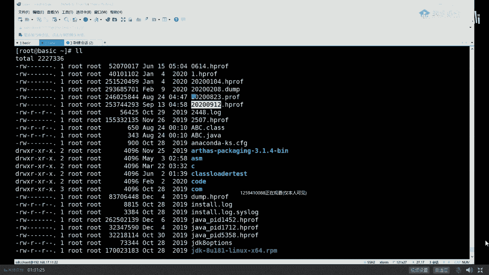

。这是Jvi VM嗯，你你你你打开文件啊装入，你就直接把那个刚才那文件呀给它装入进来就可以了。这种的pro给装入进来，好吧，然后呢，装入进来之后呢，你找到内存，找到抽样。

然后你就观察出来到底是哪些个呃对象啊占的内存比较多，你就观察出来了。

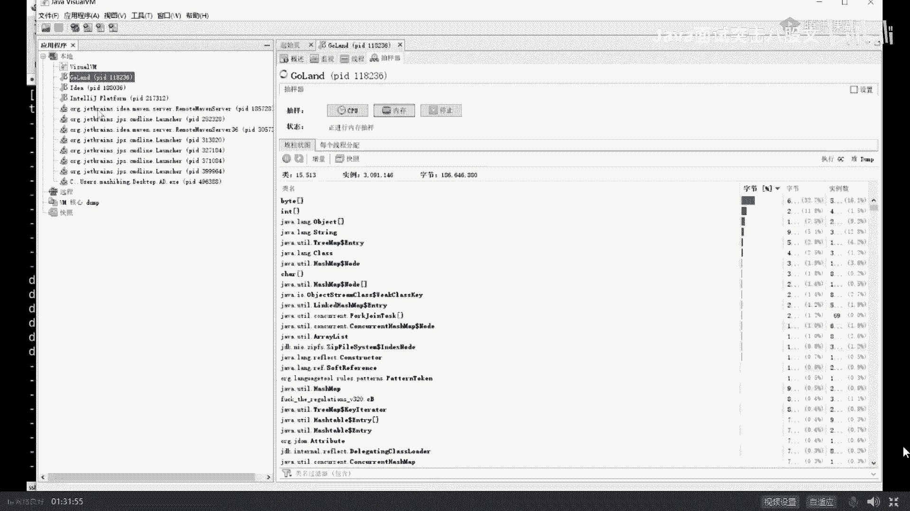

嗯，这是一种，好吧。这是第一种。