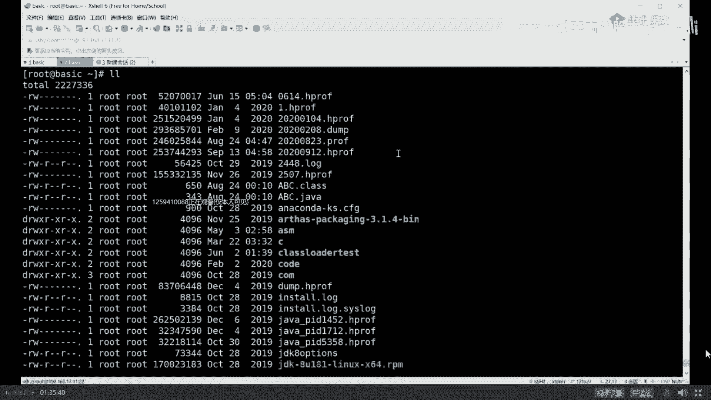

# 舍不得花27980买马士兵教育的MCA架构师课程？免费开源马士兵教育VIP课程 - P16：【JVM调优实战】用图形化工具visual VM、MAT、jprofiler进行定位 - 马士兵北京中心 - BV1VP411i7E4

同学说了，老师这个JBVM我没接触过，这是java自带的这东西这东西用我说吗？这东西我说吧，不用吧嗯。不用不用啊，很很很简单啊，这是javaJDK自带的。好吧，说两句。有同学实在是基础太弱。

你基础这么弱，我就没招了，简单跟你说两句吧，你你就是你java装完了之后。😡，JDK battery里面，你找到J。viro VM就是这个图形界面的工具。这通文界面的工具呢它也比较强大。

它呢除了可以观察你本机的这些ID之外，也可以装入用文件来观察，也可以干嘛呢？也可以远程来观察啊。比如说这是你linux服务器，你也可以用1个JBra远程连接去观察它。

这也是可以的，这也没问题。嗯。然后你就可以对它进行分析了。分析完之后，你也得出结论了。原来是card infer那个类太多了，依然是这个结论，没有什么其他的。好吧，然后下一步查你业务逻辑，查业务逻辑。

别人就替不了你了。好，这块内容讲的稍微快乐一些，来能跟上一老师扣个一。因为觉得这个比较简单嗯。没问题吧，但是。但是。我讲这么快是有原因的，因为实际生产环境之中很少这么玩儿。原因是啥？

你往外导文件依然会产生卡死。会让JVM卡死，你能让你随便倒吗？不能。所以这就涉及到你什么时候才能把这个文件给拿到。生产环境里头的第一件事儿，好好听我讲，生产环境第一件事儿叫做。设置好你的启动参数。

这个启动参数啊。

包括这个参数。hiap， dump on out of memory error。就是当我们启动的时候，一定要把这个参数给设置好。这个设置好的意思是什么呢？就是黑 down。什么时候产生OOM了。

什么时候它会帮我自动生成堆转储文件。再说一遍。什么时候你的内存爆了？它会自动帮你生成一个对专出文件，d文件。这时候你内存爆了，你相当于你java进程已经死了，这时候就没关系了，把你这文件拿拿出来做分析。

分析的工具特别多。我呢跟跟大家说过JVMJDK自带的Jhead居命航呢。ecclipse带的MAT完全也可以，还有其他各种各样的工具都可以。刚才有同学提到这些 easy，那是读日志的。

跟这没有半完全关系。好了，同学们。这块不知道我说清楚没有。所以你在生产环境之中，你说我用Jm导的不对，这个事儿不对，这是第一个。第二个，你跟面试官聊的时候说我远程是linux。我用JVM远程连接上去。

这事儿对吗？能这么说吗？告诉我一下。这c也可以远程连接。这比如VM也可以远程连接这proeller收费的也可以远程连接。

来，你要跟面试官说，你说我在生产环境之中，双十一那机器正在那玩着呢，我上1个JBUVM去观察它。

完蛋。面试官估计一个大嘴巴子抽上来。那凉快哪带着你搁哪学的吧，你。出门又冷啊，拜拜。听我说一句。在生产环境中的机器一般情况下，除了运维之外。尽量不多开任何端口。但是你如果用远程的这种图形界面去连接它。

sorry必须得开各种各样端口，产生各种各样安全问题。另外呢它会对性能造成一定的影响，大概性能会下降10%到15%。因为他需要不断的对vi这vi VM往外传我每一个对象的状态。好吧。学率是不行的。还。

有同学说了，老师，那我人家面试官问我，我是怎么查出来的呀，我该怎么办呢？好，听我说一句，如果说你说是图形裂面的工具观察出来的也可以。什么情况，比较牛逼的说法是。我是在压测环境里头压测的时候。好。

挂一个上去远程观察，这个没问题，这是第一种说法。第二种说法是我们机器做了负载均衡。我们发现程序有问题之后我。把这台摘出来，从负载环境里头摘出来，我把它的堆转储文件导出来。好，这个也没问题。

very good。这是第二种。第三种。由于双十一的或者是什么样的这些个从互联网过来的连接特别多，我用TCPd这个命令给他复制一份。一份儿打到我们的生产环境里头，一份儿打到我们测试环境里头。

我们用测试在测试机上做观察，good牛逼。说明你不仅懂负载均衡，你还懂TCP蛋吗？你还懂生产环境里头这么调优的手段。好了，50万给你了，公开呢。呃，我说清楚了吗？TCP不sorry TCP copy吧。

TCP copysorry啊，不是不是TCP done。I'm sorry嗯。super king这是50万必备的技能之一。反正不是你那摁电源，好吧，super king，你要摁电门那个那别说50万了。

5000多千多。super king啊。好嘞，我们可以继续了吗？😊，嗯。Cl。

但是呢在这儿我今天给大家介绍的并不是这个。