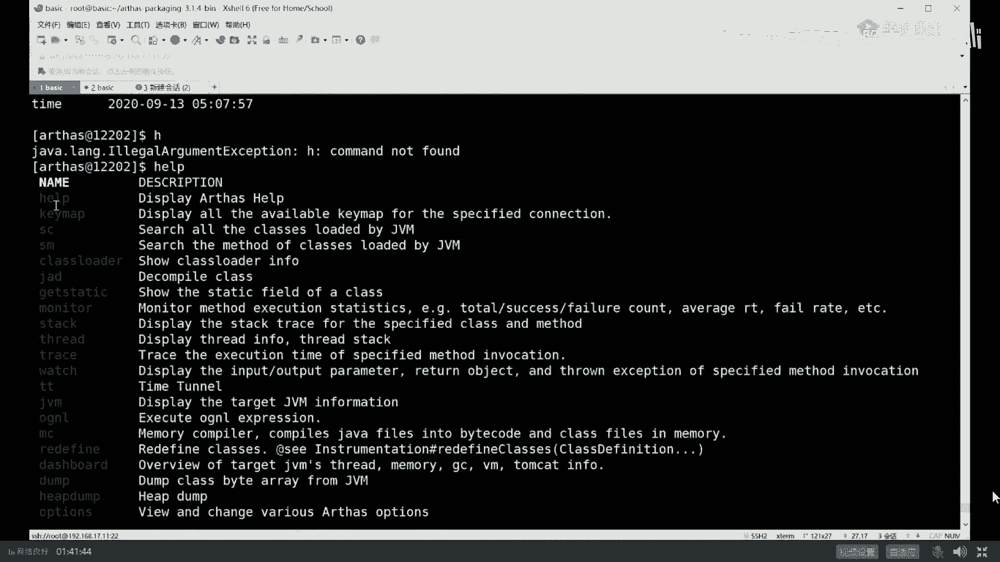

# 舍不得花27980买马士兵教育的MCA架构师课程？免费开源马士兵教育VIP课程 - P17：【JVM调优实战】用一线大厂专业工具：Arthas进行定位于调优 - 马士兵北京中心 - BV1VP411i7E4

要的呢是阿里开源的工具，这工具很有名，目前用的特别多，这工具名字叫做阿尔萨斯。叫SS好听我讲啊，作为ass来说是阿里开源的中文文档的工具。今天呢我带大家用一下，但是我不想带大家安装了。这个没问题吧。

我不想带大家安装了。安装你自己去玩，我要他跟着讲安装就没劲了。好，作为阿尔萨斯来说。下载下来之后，解压解开之后得到这个目录，进到这个目录里去。

我已经进来了。想执行它的时候，执行这个栈文件就可以。它有好多种启动方式，这是最简单的。加个壮这。Others gone。当它启动之后，它会自动的寻找你当前机器里面的。那些个java的进程。

目前呢只有119988号进程，在它的阿尔萨斯的内部编号里头叫做一。所以你挑一。阿尔萨斯尝试着把自己挂到这个进程上。可能挂不上去了，因为他已经死了。重新器啊。挂不上去了，稍等。卡屏了吗？卡屏了吗？

我还在吗？我还活着吗？你们还在吗？你们还活着吗？Y， but。重新启动，我们重新挂一下。啊，O。重新启动了小程序，我们在阿尔萨斯里面挂上它。回咯。当你看到。

这个输出的时候说明2尔3斯已经正常的灌到了我们这个进程上。这进程号呢是12202。这块能跟上吧，就是在我们整个系统里头，这是一java进程。234的进程在这里，234挂到这个进程上，然后对它进行观察。

好啦。可继续吗？下面我来介绍。阿尔萨斯它的一些个功能，这个不会STW这个性能上会有所降低，但降的不多。至于会不会STW大哥取决于你要执行什么命令，阿尔萨斯完全可以替代我前面敲的。

基本上能替代我们敲的所有命令。而且他比较直观。打开榴览。234。他有好多命令，如果你不知道的话，你就叫help就好了。

Help。嗯。他有这么多命令，help key map ICSMclass loader JADt等等等等等等等等，乱七八糟的。好了，同学们。

在这些命令里面，我教大家几个，一个呢叫dashboard，这是最常用最简单的一个命令。dashboard仪表盘回车。

它用命令行底下模拟一个仪表盘，在这里面，它基本上综合了top那个命令和top杠HP命令以及这infer命令的一个组合。在这你能看到你的整个进程里面有哪些个线程，有哪些线程在吃CPU。

现城吃CPU的都都放在最前面嗯。然后现成的状态是什么？接下来内存占了多大，一电区占多少，swiber占多少，老年的占了多少，非堆内存占多少。ok好，这些都是常用的一些参数的信息。啊。

所以这个一个dashboard搞定了，很直观。最关键的最最好用的是这个就是到底哪个线程在吃内存啊，吃CPU你如果用Jt和top杠HP组合的话，你得来回的换算。因为他哥俩呀一个是十0进制，一个16进制。

我跟你说，这哥俩你得来回换算，但是你若果用二萨斯的话，直接一观察就知道了。哦。原来是52号县城，他的现程名字叫pro1339，他在吃CPU，不知道大家听清楚没有嗯。好，这是第一个命令。

我们继续除了这个命令之外，还有一些什么命令呢？

Help。看这个命令，hiep dump还用我解释吗？这边就没有一点是吧，hiep dump替代谁的？替待哪个命令的能告诉我Gm是吧？这太简单了啊。Heep dumpok嗯这 map对。哦。

还有一个命令叫thread。

回州。他会把整个你的进程里面所有的线程全给你列出来，哪个县程吃CPU最多。

最关键这个工具有一个特别牛叉的地方，thread你小杠hel。

呃，第一个呢它的帮助非常的给力啊，你完全也有中文版，这这虽然这是英文版啊，但它是完全有中文版。另外呢它有好多好多的这些个examples，你都可以直接拿来用就行了。特别简单。

来教大家thread里面最常用的一个参数，这个参数叫杠B，看一眼这什么意思，读一下。😊，thhreadagon include blocking thread啥意思 Find thread who is holding a log that blocks the most number of threads。

啥意思？对，查找死锁查找死锁。你像我教你用Jt的时候，你还记得吗？Jt。如果你要观察死锁的话，你得去观察每一个线程它是不是wa在同一把锁上。喂了好长时间，这个时候有可能会产生思索你也会检查。

但是在阿尔法斯里面一个命令就可以搞定了，直接敲。出来关闭。当然我由于我们这个线程呢，我们这个程序它没有思索，所以它找不出来numbous呃bling three found。

如果是你自己故意写一个思索程序，你用这个来观察一下，一把就给你找出来。好用。点赞。可以继续吗？嗯。How are you meeting叫 JVM JVM。当然这个命令呢其实很简单。

它就是那个J infer差不多，它会把这个java的进程，一些常见的参数。

是怎么设的，给你列出来哈哈。这里面有一个比较好玩的呢，你可以观察它的garbage collectors，就是它默认用的哪种垃圾回收器呢？Gbage glers，但你会你会发现年轻的用的是copy。

老年的用的是mark sweep compact。一般mwe啊mwe到一定程度碎片化了，compact进行压缩。

好，还有其他命令吗？还有。教几个比较酷的这就个太简单了，交几个比较酷的。

来我们来看这个命令。可以跟上吗？新时代说抽奖吧，不抽，不要带节奏。再节奏，我先把你的名字给踢出去，我再抽掉。为啥这工具不会影响系统性能？大哥，我我哪句话说不会影响系统性能啊，我说过吗？

这个会影响系统性能10%到15%。好，看这里。看这里教大家这个命令，这个命令叫JAD。okK这里的意思是什么呢？嗯。

就来这个命令的话呢，我就换一个程序吧，不用这个程序了。我们换一个小程序。Clear。在这我还有小程序啊，这小程序呢叫。叫T我们先来看这小程序啊。

Yeah。moreT点回好，看这里啊，这个小程序，我这个T这个小程序呢是干了这么一件事儿，你读一下啊，很简单，三贝函数里面写一个死循环，这个死循环s andread我从呃命令行上读一个字符进来啊。

读一次，我就扭出一个TT对象来调它的M方法。

MoreTT点点了。comTTTTM方芳怎么写的？这方法超级简单就是sem点2的pre line1。就打了个一，所以你执行这个程序执行起来，这是这样子的javaT回车。😊，输一个字符。

他要出出一个一输一个字符，出一个一输个字符，出个一输个字符出个一。嗯，这个输了三个字符，所以出了三个亿。好的小程序能看懂吗？😊，相当简单。下面呢我们通过阿尔萨斯挂上它。

Yeah。教大家一个命令就是JADJAD的意思是反编译叫jeva decomp反编译javaJADT这好，你就会看到哎他把。整个呃源代码呢给你反编译了出来。然后JDTTTT。回者啊在线反编译啊。

给你反编译出来。有同学在这就开始说了，老师，你逗我玩呢，这破工具能有啥用啊？我代码是我自己写的，我还用反编译，我不是有毛病吗？来认为这个工具没用的，给老师扣2，认为有用的给老师扣1。Yeah。

有扣2的吗？没有吗？嗯，还有的时说太有用了，还有科尔的说没有用。😊，来凡是扣2的。我估计你们就是在小P公司里，一个小P工程师拧着一个小P螺丝。为啥呢？其实啊。在一个超级大型的项目里头。是有很多个团队。

共同。把代码往上写A团队的代码有可能依赖B团队。B团队一个成序员把整个程序上运行起来之后，发现代码怎么不对呀，我检查我自己代码也没问题呀，为什么输出结果是不对的呢？本来这里想输出的是2。

结果你问您老人家为什么输出的是一呢？好，我领你听我讲，你这时候怎么查呀？哈。这个时候你如果怀疑有可能A团队用错了B团队的版本。版本听懂了吗？很有可能是A团队用错了B团队的这个版本。

我的第一个版本里面输出的是2，第二个版本输出的是一，结果你用错版本了，你输出的不对，并不是我B团队的问题。我怎么定位这个问题啊？没办法，在线反编译。对，先开始开始扯皮啊两个。两个那个那个哎。

为什么我这图像这么模糊啊？关闭摄像头，重新打开。哎，为什么那么模糊呢？有点模糊啊，大家凑合看吧嗯。对，两两个小组的组长，A组和B组开始扯皮，看看谁嗓门大。互相猜忌，然后论证。

这时候呢其实很简单去上线反编译一下，看看正在运行的是哪个版本就搞定了。建筑清凉，长得模糊。对你是怎么知道的？我用了好多锐华技术才达到这种情形，混淆过代码可以反编译吗？反编译，不管你什么代码。

当然可以反编译，只不过混淆之后，它反编译出来是那个混淆的那份代码。好了，不知道这个问题大家听清楚了吗？在线定位一些问题，bug到底出在哪儿啊？这个反编译工具很重要，很有用。JAD是哪个命令？

exception的名字是哪个？哎呦，我的妈呀，JAD是哪个命令，你还要问我这AD命令那就是JAD了。大哥。嗯。那。idea自带反面译来super kingsuper king提出的问题总是能触及灵魂。

super king的意思是说，当你这个程序在远程你的服务器上运行的时候，它可以用idea远程连上去给你反编译下来。哎呀，super king，你赶紧你这个骚操作，如果能做出来，赶紧教我一下啊。😡。

佩服啊，简直。实在是太佩服了啊。哇。Okay。😀呵呵。😊，Yeah。嗯。😊，可以用javaP。好，可以可以可以，完全可以嗯。好吧好吧好吧，你你你们别搁这扯了啊。

那个凡是提出奇奇怪怪的问题的那些啊奇奇怪的知识，奇怪的问题啊，奇怪的问话你就不要再提了，好好反思你自己，你就是那个小P公司的小皮螺丝钉，记着这个就行了啊。😊，好嘞。来，我们继续。

那现在下面我再讲另外一个比较酷的比较酷的这样的一个命令。这个命令呢叫reefine。Reefine。好，reading fun是什么意思？define define是定义。

如果你学过老师讲的class load，你就应该知道这个东西呢是定义一个class用的，是可以修改一个class的。reeffin叫在线修改class。啥意思呢？仔细看，现在这个小程序当每一敲回车。

它输出一，一敲回车输出一。但是经过定位你用错版本了，我不应该输出一，而应该输出的是2。那么这时候怎么办呢？一个骚操作是这样子的。注意看。我不要把程序停掉。你继续运行。我干这么一件事儿。我干这么一件事儿。

V。继1点亮啊。我把这里的一。直接给改成2。存单退出。然后呢，加个CTT。等着把它编译好，把这class上传到远程去。这是我本地上传到远程嗯。接下来在阿尔萨斯里面，reefine。root下面的。

T P their class。没说。好，ready翻成功之后。直接在原来程序上回车，哎，已经变成二了。嗯。😊，这又是一个骚操作。当然有同学可能就会说，老师这破东西有用吗？我难道就不能本地代码改好了。

把一改成二编译好了，把原来的程序覆盖掉就行了吗？原来程序停掉，等我改好了，覆盖，然后不就搞定了吗？对不对？你没事在线改，你不是有病吗？来认为有用的，老师扣一，认为没用的扣2。Yeah。

那又有人说可太有用了，是吧？嗯，李晨嗯李晨扣2扣2的不多，特别有用是吧嗯。你们跟担心这种权限问题的那是人家运维的权限的管理，跟这有半毛钱关系吗？担心的问题都不知道担心在哪儿。这边你跟你媳妇儿结婚呢。

你担心呀那个美国那边要大地震着火了，你这不扯呢吗？😊，对，在线改单码。这个呢最关键的点呢叫不用重启你的在线程序，听懂了吗？因为什么呢？如果说敲12的，您您还是那个小P公司的小P螺丝钉，为啥？

大企业做项目做在线项目。我就问你这在线项目能随便停吗？随便说哦，我这有一bug来把它停掉。😡，等我修改完了之后，传上去，发现产生了新的bug，没回事，停掉。😡，穿上去能这样干吗？大哥。

你知道在一个大兴的公司里头，咱们不说大兴互联网公司的，说银行吧。银行一个系统上线。上线之后启动开始服务，经过多少多长时间的，多长时间的审批，有没有在银行的？有没有？挺好发公告的对啊。一周两周很正常吧。

就是你一个新系统上线的审批过程很可能就要一周两周。长则一周两周，短则一天两天，就为了修改你一个特别小的bug，你得把这些东西全部停掉。如果是大bug灰度恢复原系统。如果是小bug，直接在线先把它改了。

双十一马上到了一个小时之后，秒杀开始了。你的这个价格原来是100，你不小心写成了1000，你怎么改啊，能停掉吗？没关系，直接在线先把它改过来，等下一个版本升级的时候，整个bug全部覆盖成新的。

这就是救命用的紧急救命用。嗯，好了。😔，集群用脚本批量执行提款。对啊，你集群只能用脚本啊。没错嗯。一般这是救命用的，并不是特殊的情况下，它特别有用，好吧。好。这个是阿尔萨斯的骚操作之二。

还有一些其他的骚操作，你想看吗？比如说我前面讲过的，你怎么定位一个系统的系统瓶颈呢？阿尔萨斯是可以的。平静。平静哎，静还写错了。一会儿教你234的下一个操操作，好吧，你看殷传宁啊。

我就知道有人得得有人问这个问题，炸包情况下怎么操作呢？😊，哎呦，我的银传宁啊我的银传宁。你你你先拿大腿给我想想这班操作怎么操作，其他同学也帮他解答一下。纸箱炸包里，哎呦我的妖娆尾遂，你赶紧嫁给银传宁。

你们夫妻两个叫做对眼水平一致嗯。大哥，我就想问你啊，各位小伙伴们，在JVM的内存里有炸包这件事情吗？有没有？有没有一个炸包在JVM内存里？炸包是干嘛的？里边装了好多class放在硬盘上。

JVM启动的时候，从这个炸包里面解压，把这class漏到内存。JVM管你里边有没有什么炸包啊？对你咋不说wall包呢？没错啊，你咋不说zip呢？你咋不说IR呢？

你看super king问了个突吉灵问的问题，super king问的问题一般的水平都比较高啊，super king什么呢？VIP中屁，只要他说话，所有人都够停止。认真看100台服务器怎么改呀。

不能一个一个改吧。😊，怎么改？写个脚本呗，写个脚本批量改呗。Good嗯。好的。Yeah。好啦。呃。好了，我们继续来看。另外一个是操作。这骚操作呢我重新启一小程序啊，觉得这小程序忘了。

有点这小程序叫ABC吧，我记得ABC点粘了。Mn， AC or。先读一下啊。Clear。More。ABC年了。来读一下小程序，很简单，看能不能读懂。

看一眼。十几秒钟读一下。是。好这小程序干了件什么事儿？扭了就在for循环里面ma方法里面扭了1个ABC点点A。掉6了ABC调它的A方法。这A方法呢是睡了一秒钟之后，掉了B方法。B方法睡了2秒钟之后。

掉了C方法，C方法睡了3秒钟，很很简单啊。好听我讲啊，就这东西呢呃我主要是模拟每一个方法的调用站。就是这里面你一定知道A是调用了B。B调用了C，然后我用sleep模拟的是什么？

sleep模拟的是我业务逻辑在里面执行了多长时间。大家应该知道，作为一个系统来说。有的时候呢你会观察到你的系统显应速度特别慢。这种的呢我在呃我们的学员里头呢已经遇见过好多次了。

他说老师我这个系统的显应速度特别慢，并发量特别低。比方说这个并发量，你你做一个压测，访问我的A方法，发现我设计是要达到1万的。QPS。好，但实际当中呢我只能达到100。原因是啥？原因很简单。

一定是A方法执行速度特别慢嘛。本来设计之中是10毫秒完成，结果你500毫秒完成一次，你一秒钟也就执行个20次。啊，听你听懂我意思了吗？同学们。这块儿大概知道什么什么意思吧。OK。就说我们要查的时候。

我们我们我们不知道这个系统的性能点到底个瓶颈在哪儿呢？是A呢还是B呢，还是C呢？这个调用站有可能非常长，C又掉了D丢又掉了FF又掉了E等等。这个调用站可能特别长。这个链路上。

整个这条链路上到底是哪个方法出问题了呢？OK234可以帮我们干这件事儿。

好，这个过程我说清楚了吗？可以继续的给老师扣个一来。是。嗯。嗯。true boy，你看人家是真正的男孩，他说链路追踪，这叫单机版的链路追踪。单机版的就是你在这一个JVM内部里面A掉了BB的掉了C。

但是如果是微服务版的呢？这个服务调用了另外一台机上的另外一个服务，他又调了其他的服务，他又调了别的服务。好，这个叫做。分布式链路追踪。今天我给大家讲的是单机版的阿尔萨斯就可以。

这个呢如果你要用分布联路运动zip can。skywalk都可以，好吧，觉得咱们。VIP课里全都有嗯。好听讲阿尔塞斯就可以。当然这种工具特别多，除了阿尔萨斯之外呢，好多好多其他工具都可以用。

比如说Jpror。Profir。当然DDK自带的还有一个命令，我忘了叫什么了，其实也可以呃，命令很多，但是阿尔萨斯的很好用。这个东西是收费的，这pro是收费的GDK自带的呢相对于阿尔萨斯的难用。

所以我讲阿尔萨斯这个版本。好吧。好，看这里。厚德载物。厚德载物，不要停啊。你居然你居然说的是名字，是我们的学校的校训。赵道清华的校训是什么？自强不息，厚德载物是吧？听蛙的小哥是什么？清国的校训是什么？

忘了啊。你们知道北大的。孝哥是什么？校训是什么？小辉是什吗？没有啊，北大的全没有，所以北大又称三无学校。北大每年那个都探讨说，我们距离国际双一流学校到理还差到底还差多远？一般情况下呢，我们都会告诉他。

出你们东门左转100米就到了。就差100米。嗯。😊，北大家就是这么一个牛逼的学校啊。开个玩笑啊，我们继续我们来我们来来来来追踪整个呃这个链路到底哪出了问题。😊，该怎么追踪呢？我们先把它跑起来。じは。

It say。依然是挂上阿尔萨斯。关上234。二回ろ。好，这次我们的命令。是什么呢？是这个证明论的叫tracetrace的意思叫trace the execution time of specified method navigation。

看一眼。这啥意思啊？trace这个。

每这个方法的执行时间嘛。嗯。Thoose。

Help。呃，来看看它的例子程序就知道了啊，trace这个类名哎，然后方法名啊来trace一下。Ts。呃，ABC。方表名是A回着。然后他就开始trace这个方法。

I fed a class count 1， Me count 1 cost in。

这是他方法的分析过程，看到了吗？

他分析出来了，他说呃他分析了好几次，他说你看那个我执行A的时候，我执行了6秒钟，我的脑大爷哇，你会发现哇，不会吧，我A设计的是500毫秒，你居然给我执行出6秒钟出来，什么情况哦，他给你定位。

他说原来A调用了B，在B里面。😊，在A里面，自己睡了一秒钟，给你跟踪出来了。在B里面呢，居然执行了5秒钟，我的我的娘啊，所以B一定是有问题的。这能看懂吗？能看懂的给老师扣1。Yeah。

那既然您老人家B是有问题的，咋办啊？追B嘛，看看B是啥情况，怎么回事，怎么执行这么长时间？😡，好，B追踪出来了，说B总共花了5秒，他自己执行的时间是2秒钟，sleep了2秒。但是呢他掉了C。

你会发现C直行了3秒，我勒个去，C怎么回事？😡，C一定一定是有问题的。所以跟到C里面去。嗯，然后来看看，当然你一路追踪下来，你就会发现你这条链路上到底哪个方法，它的执行过程花费的时间太多了。剑走清灵啊。

前几天刚调是吧？嗯，剑走清灵不错。super king啊，这功众号哇，遭到了super king的表扬啊，今天晚上没白讲。VIP有这些吗？必须有大哥，我公开课都有的VIP必须有。对。而且比这详细。好了。

同学们。依有去有有有饮。我们呃呃呃今天差不多就介绍到这里吧，我们稍微回顾一下啊，今天讲的东西呢其实比昨天稍微的容易，为什么？因为今天都是实战，实战比较好玩儿。又有力的程序又能观察到结果。

昨天讲的全是理论，理论性的东西特别难。VIP啥时候开的，一直在开呀。嗯。10点钟我们开始秒杀啊，我们有一个秒杀，秒杀的是我们的自己的课程。

这课程呢我稍微给大家做一点小小的介绍。呃，这课程我们目前叫MCA。他叫什么名字不重要。关于这个课程呢，我稍微如果想了解我们整体课程的话，我得给你简要介绍介绍我们的历史。

听着玩吧。老师给你讲历史也是很好玩的。我们是这样的啊，我们大概在呃19年的中旬啊，19年6月份开的第一次课，在腾讯课堂做在线课程。我们大概用了半年时间就达到了Java类目的第一名。

那个时候是提供8个月左右的知识课，每每周三次课，每次2小时啊，跟别人是一模一样。后来呢。我们呃跑着跑着，突然间发现呢，就是那会儿那会儿我们可程也便宜啊，大概六七千块钱。好，我们跑着跑着呢。

突然间发现呢这8个月时间根本不够。因为我要讲的东西特别多。讲的又比较深入。每一个课呢我都想讲的特别深入，深入到原码层级，深入到实际过程之中到底是怎么用的。所以发现时长不够了怎么办？

我们后来呢就把这个8个月课程直接免费的扩展到124个月24个月左右的课。这个加起来的话呢。而且每周不再是三次课啊，每周是一堆课。每周不再是三次课，每每周大概是大概是这么多课。这这这还是少的。

嗯看上一周的话，它就会更多啊。如果再看上一周的话呢，他会他他会更多啊，都是一堆课就不再是三次。就是我们课程量大增，把课程拉的特别长。然后呢，只有做的特别特别时长够啊，特别特别长才能讲的比较深入。

只有特别长才能比较深。这个很正常，时长不够，我不太可能能能够能能够能够想说你能讲的特别深，这不可能。就像课堂上有些抄我们的是吧？啊，说自己的时长也2000个小时，然后每周就讲6个小时，你自己算一下。

大概有300周5年左右，你不扯了吗？啊，基本讲课就一个老师，别这样啊，这么抄你骗傻子呢？好，看这里啊。呃，这是第一次的拓展。后来拓展完这个课程的这些个知识点之后啊。

这是这是这是我们呃最开始做课的时候的那些知识点这样子的。那会儿呢我们叫高成客。嗯。对。Yeah。那会儿叫高层体系啊，叫高层知识体系。这这你可以认为这是去年提供的呃这些个课程。呃。

像我今天给大家讲的JVM呀，这个GMM呀、多线程啊等等这些这都是呃呃就是我们原来叫那个高层的课，当然还有设计模式呀，反正你能想到的这些个知识点的课啊，基本上全有。呃，一直到分布式的。

到那个MQ的到keeper的到原码的解读的到那个RPC的到spring bootsp cloudcker云计算的my调FS open以及团队化团队管理的。

一直到我们的这个大数据相关的一直到流式计算f stream源码到机器学习的入门成员的数学继算法和学习实战一到呢软技能英语课职业规划指导面试软技巧以及编写技术文档等等。这是去年我们提供的课。

后来我们提供这个课之后呢，发现这课还不够使，你知道吗？为什么？因为每个人啊他的需求是不一样的。有的有的有的小伙伴就跟我们说，说，老师你这课不够啊。我说不够在什么地方呢？他说老师。

我原来是做CROD没有互联网相关的项目。我想在我的简历里头写项目怎么办？我们一合计来扩。扩充项目到现在为止，我们大概扩了8到9个可以写在简历里的真实项目。嗯，这个项目呢是在这个位置。我们项目呢大概是有。

这么多个。呃，从。网游服务器呃一直到这个合家云的平台。到微妙商城到网易车，到一级流量啊，到推荐系统，到流入平台，到中台到秒杀。大概给大家呢专门做了几个这样的项目。呃，这里面如果大家想了解项目的话啊。

你像这个这个课的话呢，已经讲到第三版了。每年我们也在不断的更新它。呃，30堂课才讲完了一个项目，这个项目呢就非常方便的让你从原来的CRUD直接转向互联网分布式微服务项目。而这项目讲起来也特别好玩啊。

我们讲项目跟其他的地儿呢还不是特别一样。可以这么说啊，这基本上从项目到到到到所有的地儿啊基本上全不一样。老师也不一样，老师都是一线大厂出来的，一线大厂刚刚离开的。鲜活热辣的一线大厂背景。像这种项目。

我们是怎么讲的？我们呃。架构啊。源代码二三十个人源代码全都给到你。而且现在这个项目线上是可以跑的。哎，我忘了你跑的网址是什么了。嗯，我头我问问曹老师，给你们演示一下。

你可以你你们现在可以在线上打我们自己的这个车，知道吗？马世平教育的车你可以打，嗯，就像你打滴滴一样呃。😊，而这项目讲解过程是从那个项目立项开始到评审。到架构设计到接口，到工程到DB到开发编码。

开发编码会给你讲到微分布式微服务每一个模块的原理和原码到底怎么运用的。讲到分布锁分布事务，怎么做测试，怎么做部署。最牛叉的是呢，假如说你你这项目写到简历里，人家面试官问你，你说老师我还不知道怎么回答。

曹老师说，他自己帮你去面试。然后把。整个过程面试官怎么问的，给你录制下来，回放给你。这就是著名的保姆式服务，一对一保姆式服务。够牛吧。诚意满满。做到这个程度，你说我还不行呢，这就太少了。这么说。

来咱们这学课程叫做你只要把人带过来，老师让你学啥，你学啥剩下的一切的一切，怎么写简历，怎么改简历，怎么跟面试官聊，怎么谈薪资，怎么建HR怎么建技术总监。好，这些所有的问题全部交给老师。

几个offer不知道怎么选来找老师。因为这20位来自于一线大厂的老师，每一个你都能直接联系，这就是鲜活的你的指导教师，你的导师。我们是导师制一线达肠导师制。你就是头猪。这帮人也能带你飞起来，好吧。

当然一般情况下，你不是猪啊。啊，这是增加的一些新的项目，我就不给你一一一一写了。这是。O。增加完项目之后呢，我们的发展历程呢，当然这个程序这个这个这个就比较长了啊，呃课时已经比较长了，对不对？

各是一秒长。然后我们接下来又进行了一次升级。好，这次升级为什么升呢？是因为啊你学到前面我讲的这些个基数点加项目之后，你基本上差不多是能够达到P6P7水平。但是你如果想拿到一个真正的架构师的资格。

这种的薪水啊大概在差不多顶头顶头在七八十万左右。如果想拿到一个更好的薪水，就是说你这个这个就涵盖你从从进阶啊，P5P6P7差不多拿到一个七八十万的薪水最高的。但有人不满意，有人人家本来就赚七八十万。

想在课程里头再收回一些东西。我们又升级了一本架构课。如果各位在互联网上了解过加构课的话，我相信你应该知道。大多数的架构课叫做PPT架构式。PPT架构式就像这样的架构式。就是哎我给你，我告诉你啊。

一个高可用的架构，高并发的高扩展的架构怎么玩了？前面有防火墙，这里有NX啊，这里有负载均衡，这里有MQ啊，这里有K8S的集群，这里有CSCD这里有大数据等等。你看完之后觉得很嗨。真正让你一操作。

你一个都答不起来。见过这种课吗？见过雷老师扣个一来。😊，Yeah。好，这口还贼贵。我就告诉你啊，市面上凡是架构时刻，我们全报了一遍。就想知道为什么这么贵，然后有能得到的能得到的效果是什么。

后来我们发现我的个去，没有一个能落地的。这种东西呢远远不符合我们老师的脾气。我认为能落地的架构师才是真正的架构师。所以我们的架构师课程。除了这十几篇理论知识之外。最重要的一篇在这儿。这篇东西叫做。

再造淘宝。落地，把理论全部落地。我们这个再到淘宝的过程。给你从实际当中一点点的几十台服务器，几百个节点给你搭起来。嗯，就是你看到的这张图是怎么一步一步。干成这样了。我是一个鲜活的过程，让你能看得到。

而且在我们的私有云上。你可以亲手搭建起来。好吧，这个才是真正牛逼的架构师。你自己开发完整个业务逻辑，代码开发完再亲手把它搭起来。好，这叫架构式，这是马士兵教育的架构师。

全称叫MCA叫马士兵 certifiedtified architect。我们从分布式ID生中心开始搭到配置中心索集群、事务集群。

缓存集群网关集群注册中心监控MQES分布任务调度tenending以及myxico的服务集群。这些我们大概买了服务器，前后花了60万。加上我们私有云的环境搭建，100万以上。

为了讲一门好课。这里叫做不惜代价。

不知道大家能不能 get到这个苦心，好吧。呃，能盖到的老师扣个一。没人干这事儿，除了我们真的没人干这事儿，好吧。嗯。这是我们又一次升级。呃，就这样，所以诞生了我们现在这个课啊。

现在呢整体性的这个课叫做MCA。呃，腾讯呢是这样的，原来一直逼我们把课程给分开啊，分成PP5P6P7P8，你都给我分开大数据啊，我们没分没分的原因是什么？因为在我看来，一个牛逼的架构师。

他要掌握的机知知识实在是太多了。我希望呢在一个课里头全一课全包全都给到你。不要分那么多，从最基础的理论我就不给你一一展开了。因为每一个展开优又特别多。理论基础CAP。到呃比方说这个这个呃密等啊。

到高考用怎么设计，到高高呃高扩展怎么设，高性能怎么设计等等。脑练你该怎么解决？到技术底层的支撑。记住底层啊，像这节课可能链接都已经是现现成的，你直接拿来看就可以，好吧。

从lin内核一直讲到我们存储系统操作系统。Tow。算法。关于算法这块也是特别大的一张。很多很多人他的基础很不牢靠。有很多人认为我去面试架构时，是不是就问我那些个。上层的知识真心的不是那么回事啊。

我就直接告诉你，想面试架构试很多时候问的就是底层。左成云左老师从最基本的算法从最基本的数据结构一直讲到刷题BATword的刷题。这个课左老师在原来的时候要卖6000多。在咱们这儿就包含了整体包含。

分布式算法的支撑，派克索斯一直到。我们这种嗯机器学习算法，因为主要要做推荐系统。到网络基础设施该怎么玩，偏一点运维，但是牛逼的架构是应该掌握到总体设计怎么设计啊，这就太多了，我就不给你一一看了。

就是从单机一步一步是怎么发展到那么复杂的几台架构的。我把这过程给你演示出来，你就理解了，知道吧？因为很多人呢他学不会东西，他是没有看到这个从零到一的这个过程。我把从单机版给你慢慢拆。

服务微微服务开始拆啊，这个数据库开始拆，缓存开始建进建起来等等。一步一步建完了，你就知道哦，怎么从单机版发展到了这么几台机器这么一个对外提供的服务。核心微服务怎么设定？

spring cloud全站又该怎玩？我去太多了。st跑哪去了？啊，这个。有太多了啊，我就不给你打开了，太多了。Yeah。好，然后大数据相关的怎么玩？人工智能建立在大数据的基础之上，我们进行推荐系统。

这个怎么玩？CICD怎么玩？就是我们呃这种服务质量的保着保障性能测试、功能测试，全链路的压测又该怎么玩？运维这个方向该怎么玩？我们技术的前沿性的课程，课题又该怎么去进行探讨？这是我们整体性的课程。

除了包含整体性架构师课，也包含我们的高层体系，包含我们所有项目，整个课全称。啱四。适合什么参加工作的小伙伴们，就是你至少知道SSM你就可以学这个课。有同学说老师，我连SSM都不知道，没关系。

我们有一个零基础的A课程。这个是从零基础的，先把这课学了再学也可以。

这课呢你来。当然我讲到这儿，有同学可能他就会嗯心里打鼓，说，老师我靠这课程太多了，我怎么学得过来啊？好，听我讲，我们课程叫做。4叫做一对一定制。这课呢不要求你学完，你也学不完。

因为我们每天每时每课都在不断更新里面内容。跟着我们走就是了，让你永远站在技术的最前沿。呃。

我们叫做一对一定制。这句话意思是什么啊？我稍微给你敲两句啊。我们其实现在定制已经特别特别细化了。😊，一对一的服务的定制，这句话是什么意思呢？我给你举个例子，就是我会根据每个人的背景。你是大大本啊，本科。

大专生工作几年。背景。每个人的背景，每个人的基础，你是会SSM还是会spring boot，还是会了解一些spring cloud？算法又怎么样等等。每个人的诉求。你是想短期内跳槽掌心。

你还是想要追求一下进大厂，冲一下大厂啊，你还是要怎么样。好，根据这个来进行定制学习。好，看这里我给你举几个例子，比如说你大二大三。镶近大厂的。7加1加1帮你搞定。这最普世的啊。

也可以对你个人慢慢的进行个人定制。你大四想进大厂呢，这个该怎么办？我告诉你，大四想进大厂要比大二大三要难很多。原因是你要走。校招或者社招了。那么这个的话呢有点。这个跟社招进大厂啊，社招三年以内进大厂。

社招。3年以内的啊，基本做这个好吧。呃，如果是说来给你举个简单例子，你你我我我就想跳跳槽涨个薪水啊，短期内的比如说一个月我就想涨个薪。跳个槽3加1把，你搞定。再给你举个例子，你说我说全面提升。

整个MCA的架构师，一个项目带着你就淘宝那个项目，直接带着你所有的这些知识点全部都给你带起来。我零基础怎么办？没关系，A课程一直到MCA课。ok。有同学说了，老师，我那个就想进特定的某些特别牛逼的大厂。

比如说字节字节特别看重算法，没关系，左老师算法可以帮你搞定。算了从0。一直到。google级别的算法，我们的课程呢。有一个谷歌的老师啊，还给咱们讲了谷google老师的这些个算法OK。就总而言之。

言而总之。我们的课叫做一对一可定制的大学选课制的独立升级的这种课。不知道大家能不能 get到这一点。好。这是所有的课程。这课程学完之后是一个什么效果？其实这课啊我们自己说牛逼也没啥意思。在这里啊。

就是每天你如果观察观测我们这个界面的话，你就会知道啊每天都会有新的。

我们的学员的一些好消息传过来啊，这是这是今天最新的。学完课大概就这么一种效果。这是到30万了吧，这是涨薪7K啊，干了。呃，一个多月学了6个课，掌握的不是很扎实，一个月看到了吗？涨了7K。

这课一个月就让你涨了7K，这还不是说是特殊现象啊，这是一个普遍现象。我们一般情况下会向你承诺3个月让你涨5K，每个月一年你就涨6万，入职一说涨了6K，课程很有帮助OK。女生入职京东涨了50%啊。

这个女生也是啊，你你们看我们我们在群里头啊是怎么对她进行服务的，看到了吗？这都是老师的一步一步的聊天。哼。很辛苦的。嗯，我们现在正在做自己的APP做自己的论坛。当我们这些工具齐全了之后。

我们打算撤掉这个一对一的这种这种这种服务，好吧，这个太累了。没这个老师，我我现在手里手机里有几千个群，快服务不过来了，希望大家赶上末班车。Yeah。晚上呢是我们的12点之前的一次秒杀，好吧，10点开始。

这课呢后面的我就不再提供这种服务了啊。这个服务比课还值钱，你就自己想吧，有20位你的师傅。从洪七公啊一直到聂小莹。带着你，你就笨如郭靖，也全部能给你带出来。啊，但是这个服务实在太累。

我们后面会考虑把它砍掉。抓紧。一年运维转账了，底薪干到30万看吧？这哥们儿是一年的运维。后来我建议今今天下午还过来了，今天下午还到了我们公司呢，跟我聊了几句天儿。我后来建议他呢，还是哪个工资高。

现进哪个，因为他薪水总体还是偏低。25岁英语专业5天突击就干进携程了。携程回复16乘15。5天5天。啊。就是老师的定制帮你专门的一个路线辅导，就牛就大概这么一个水平的。牛逼过程好吧。

不是不是说我们自己吹牛逼，好吧，就是你你们自己可以去随随便便的看这些信息啊，聊天记录。以及包括什么呢？

包括评价啊，这是学学生学完之后的差不多1000多条好评，1300条好评。咁嘛。自己看就行了。啊。名济实力啊就不说了嘛，追加评论买到就是赚到是吧？这是课程的广度和深度，这都是追评的啊。

267个小时学完一个追评。哦，总结一下我们自己的这个课程。很简单，这个课程叫做你只要肯来。带着人来就行了，剩下的一切全交给我们。只要你愿意听话。你告诉我你的诉求，老师告诉你一条路线，让你学啥你学啥。

让你什么时候学完，你尽量什么时候学完。你的诉求直接搞定最简单最简单的诉求，我相信大多数同学应该是要涨薪的这种诉求吧。3月涨薪5000。到不了的退款。前提就一个要求，听话。Yes。

教我们课只要你听话会达到什么程度？嗯。这种。就算你是比如说是。这样的吧，找找找几个例子。就烦这不听话的啊，自己也不知道你的经历啊同样是一个小时。我告诉你应该学这个，我我告诉你应该学这个为啥？

因为这个在今年最重要，你就学它就行。不要给我讨价还价。自己不乐意，非得学别的。有这种的学完之后达不到效果，回过头来还得找老师帮你重重重新规划。这个没招，你听话就行。

比方说我给你举个例子，你像这种的38岁的女成员。我也能帮你找出出路来，看到了吗？年薪四0的offerOK它很美的，原来找工作找不着的。特别想在公开课的时候能够多影响一些人。

让他们在职业生涯中规划中尽快走出迷茫。人家会是以为我是托，没托，咱们这没托。😊。

39岁大龄乘务员薪水翻了将近10倍，这就是我们课的威力。咱有同学说老师我赚的钱赚的比较少的，我能不能够得到收获？我告诉你啊，就找一个有一哥们儿是翻了5倍，他原来是在长沙拿5K直接。干到杭州去拿了25。

他拿的非常的少。

像这种半年涨9K的啊，这都很很很轻松的事情。干半年薪水翻了4倍。原来学5K现能干到20K，这个还不如你长沙那哥们儿。

当然还有一些特别快的啊，像这种高中学历，上海30K。

月薪呢。大专学历学了不到一个月，薪资翻了一倍的。直接是嗯。老师牛逼是吧？没没没办法，就就这么牛，我们想我们想低调都不行。学俩月涨3K的这算少的了，俩月涨3K一年有3万多。

好，这课今天晚上的秒杀已经10点了，秒杀已经开始了。今晚秒杀。掌新记的秒杀。Here。零点秒杀截止。这一课今天晚上腾讯的8000的优惠券，一对一的规划已经进入倒计时时间。今天晚上的规划啊。

后面再报可能就没有这个了，一对一了。呃，今天晚上报名送樱当红州键键盘一个，不要可以折现。9月9号开启的源码玩，15号开启的，我们要开启的多线程第二版做了什算码坡全都有。找小姐姐抓紧时间秒杀，千万别错过。

错过今晚你绝对会后悔。价格12000多块钱。这12000多包含着对你三个月每个月涨薪5000的承诺。放心。老师这的课没坑，你来就是了啊，只要你肯来，我一定会带你飞起来。Yeah。北方云天若今年32。

明年明天明天3月份明年3月份吧，50万年也有希望，你现在赚多少钱？北方云天因为你很多东西我需要查一下你的背景，你现在要每年就赚15万，我没法让你50万。但是你现在如果说今年你已经赚到30万了。

上到50万的可能性就特别高，好吧。就这一课你们觉得值多少钱，你们自己想去。帮你搭各种用环那样不你掏钱。当你落地整个的云的东西，如果在线下学这课没有10万，你真拿不下来。好，只有这个线上。1万多块钱。

没有比我们性价比更高的课。他有可能同样的，人家你注意问啊，注意多多去问问人家是啥一周就讲三次课，每次就讲2小时。大概讲个8个月，收你五六千块钱。平均每个课时200到300。我们是多少？

2000学时已经讲完的，接近已经接近2000学时，还还有好多没讲的。正在直播的。总共12000多块钱，平均每课时5块。为什么腾讯逼着我们拆分，你们知道了吗？没招啊，现在就是打擦边球。

深圳12K可以提多少换了吧？大哥，你这你怎么你你怎么。我我觉得你你你你你也你这个好熟悉啊。王老王，你好，天天在是的。12K你就踏实来吧。Yeah。哎，别的不说整个什么18K啊。

这一类的都很很轻松很轻松的啊。可以先报名这种空着再选，没时间。啥叫没时间啊？你天哪。来给你看看看看我们后台。你达到效果就行了。你看这后台这些都是原来叫耗长没时间的，到课率0。7%，10千节课就听七节课。

😊，整体完成度百分百啥意思？直播没跟上，跟了录播了，就这么简单。录播也可以，录播还可以两倍速呢。最后依然得到很好的效果，知道吧？我们学课程是为了啥？为了掌心，为了跳槽，为了得到更好的人生轨迹。

这个事情比别的都重要。什么叫更好的人生轨迹？如果你自己走，你很可能走这样一条路线。到达一定年龄之后，我开始走下坡路。就在今天这个点上。跟着这20位一线大厂的老师。你的人生轨迹很可能是这样子的。

你知道这个差距有多大吗？所千万千万不要在以后的某个事间段后悔说，2020年的9月12号，马老师带着20位一线团队的老师想带着我飞。但是。我犹豫没参加。你这辈子的亏损。大概就这么大。多了也不敢说。

每年10万肯定有。因为课程。课程最高可以给到你什么程度，你们想看看吗？给你看几个学生简历，这是课程一般可以给你给你到什么程度，大专生。这哥们儿是大专。就写了5条。五年一线开发管理经验，负责项目什么的。

这个稍稍有夸张。像这种东西，你教给老师，老师教你怎么做就行。构建高吞土低延池分布架构缝布经验。MCA可听完，这个没问题，放心吧。JDK各种集合队列所读现成高并法老师讲的东西。

面试常问的数据结构与算法设计模式。我跟左老师一块讲的。各种DC垃圾回收算法，JVM调的经验。我从最基本的理论开始给你讲，一直给你讲到各种各样的啊。咱们今天调的只是PSPO还算比较简单。

还有比较复杂的G one，还有比较复杂的CMS各种各样的日志该怎么读？只要你学完，你完全可以这么写，这么写的效果是什么？阿里给了他4次面试机会，当然没进去，这个没招。并不说大专进不了阿里。

阿里给大专好多机会的。但是最后进的也不错，60万到70万这样一个年薪。进的融360说为什么不固定？因为这里面有股票，它的股票是浮动的，好吧，很给力的啊。这是注意这是普通课，听懂了吗？

这个差不多就是学我前面所说那个高程课。还有同学说，老师，我要真把这加构课全学完，什么效果？好，看这里全学完就这个效果，你要真能全学完。看这个简历就知道了。差不多是这种水平。自己读一下吧。就是你简历。

你你的简历就可以这么写了。😊，好，这个简历120万年薪。最近刚跳槽到字节了。200万。刚刚跳完槽。我就跟跟你这么讲，就是你的人生轨迹发生改变之后，就越牛逼的人就会越牛逼。越差的人就会越差。

这东西就是骑自行车。这就是做汽车。我希望你今天坐上汽车，不要在原来的自行车轨迹上甚至步行的轨迹上跟那儿浪费时间，浪费生命了。这是他的项目经验。好了。当然还有更高的，你还想看吗？算了，别看了啊。对。

有有好多呢你没达到这水平。我给你看完呢，你自己。空于恨啊，觉得自己做不到。其实很多东西只要你拼。老师会告诉你哪条路线来跟着老师拼就行了。能拼到啊。好。课程别犹豫。找到小姐姐。参加今晚的秒杀。

一对一的这个学习规划是比什么都值钱的东西。ok。是不是加班贼多才要高薪？我就想问你这么一句啊，如果说你不加班，年薪给你10万，让你加个班996，年薪给你100万行不行啊，可以吗？加就加嘛，实在受不了了。

我就找一别的。今天有学生还还还挺逗呢。我看我这微信里这个电脑的微信是不是同步过来了？嗯呵。Yeah。今天有学生啊，找找。嗯。就是你你你记住啊，就是你的你的技术水平越牛叉的时候。嗯嗯。呃。

你的技术水平越牛叉的时候那个。你你的选择面就越宽啊，这非常重要。你看啊你看这小伙。这小伙呢是在外地，在外地之后呢，他想到一县城市发展。然后呢，他就拿那个滴滴呃，跟那个用友呃，两个offer。

当时呢滴滴那边面试的时候，他还在外地，所以他没他就他他就没没面成。后来就入职用友了，四点半就下班，看到了吗？四点半就下班。😊，所以小伙伴们，你们的技术越牛叉的时候，你就会选择面就越宽。

你可以选择加班加班的公司。也可以选择像外企啊，或者像传统企业呀这种不加班的公司。这是你有选择了。你如果不学习不进步，你连这个选择都没有。没有关系，好吧。用油可不是4点半下班，我在用油。哎。

没没没没没没办法，人家现在HR告诉他的14点半下班。啊，也许拥有的某个部门吧。嗯。有年龄限制吗？几岁不建议报名了，目前还没有什么年龄限制。我们年龄最高的是49岁报的名。他的诉求就是我想了解技术。

他在公司很稳定的地位。管管理，但是我想了解技术，想管理的更好，这是这是他的诉求。现在你想涨薪的呃年龄比较大，就刚才我给你看的那个39岁的，39岁，他依然可以涨薪翻一倍啊。

还不是说还不是说涨的那个特别咋说呢？就是特特别少的那种，还真不是啊，那哥们是翻了一倍啊，39岁。就说看你看中什么。你你觉得你年龄大了就不不不要进步了是吗？那我就没招啊。

但是咱们这个行业你不进步就会被淘汰，非常简单。这行业就这样。这不是吗39岁大龄成员，薪水翻了将近100K。嗯。就在天津。杂七杂八的补助。6乘13虽然全北京杂七杂八补助加起来可能又流失。我记得是啊。嗯。

人家38岁的都在努力，你多大了，不努力了，打算。嗯。Okay。1辈分都走30万到60万吧，应该是啊他一年就干的多多了2二三十万。你说我们这课才1万多块钱，他不值吗？而且这1万多块钱的课呢。

你以后遇到过什么什么难题嗯，你们公司技术选型了，你不给你不知道跟怎么跟领导提提建议。这么多老师做你的后盾。你就算请20个顾问多少钱，你自己好好想想过吗？就这颗。全中国最值的性价比最高的。我们要说，第二。

没有人敢说第一。想学习的来这儿肯定没错。不想学习的，我就没招了。当时boss之孙写的4人加班去了9得73个月。那就离开，拜拜。这有好转岗吗？搞管理岗可爱美丽些。每次我听到这个转岗转管理岗的时候。

我就特别烦。你知道这句话害了多少人吗？嗯。不干不给你看今天聊天记录了。今天有个小伙三十二三岁了，说老师，我转了管理岗转了好几年了，我现在想转回技术，为什么？因为我发现我招的人赚的比我都多。

而且人家聊的技术我都听不懂。大哥各位大哥。您老人家做一个技术的人。技术不行了，转管理，你扯淡呢。你给我记住我现在要说的话。叫做技术管理两条腿，必须都得给我走硬了，你才能在管理技术这条路上走的越来越远。

叫技术加管理。给我记述这句话叫加管理。就这个转字不知道害了多少人。我不知道今天在座的有没有很早很早就转了项目经理，离开技术一线。过了几年之后，你突然间发现你踩的全是沙地。有没有？有的话给老师扣个一行吧？

有羊仔。千万别这样，小伙伴们，你知道这个真是害害死人啊。如果你想走你想走什么样的路，看这看这个简历吧。看这个简龄。这小伙的学历也不高。学历也不高。然后呢，技术呢人家没放弃啊，我同学说学历不高是硕士。

怎么学历不高？仔细看就是了，这哥们是大专生，而且还是非计算机大专。当然。哥们现在已经是40多岁了。他写这简历的时候已经40多了啊，跟我年龄差不多。他呢这种40多的简历啊。

跟这种这是这是黄老师20多岁的时候写的简历。你你大概是五六十万的年薪这样一个简历。嗯啊40多的简历跟30多的简历，30多岁大专生简历跟这个。40多岁的这种比较牛叉的人的简历，他就完全不一样。

我我重点看的不是想让大家看这个，你主要看它的发展历程。你看看。扬州大学热加工工艺设备大专。第二专业才是计算机应用。好，下面这个什么高等数学排名成绩，什么第一等奖、二等奖。

这些全都不要管这个东西叫做简历技巧。简历技巧这件事交给我们的老师。交给我们就行了，你不用管这东西也很重要。非常重要。以前有同学写就我们帮他改了改简历，就涨了2000块钱，每个月。一点不有。很重要。

但是你不用管交给我们就行。你看他的发展历程。南京大学自考的本科，人家在补了学历了，看到了吗？不断学技术，不断补学历。最后，工商管理的硕士MBA合肥工大的MBA。他的人生发展路线是值得借鉴的小伙伴们。

技术学历管理，当然还有什么沟通、情商、人际关系。这个构成你综合的素质，才能让你安稳的度过中年危机。只有这样。您您千万不要再说技术转管理了，你转个屁，技术不行，你怎么你怎么管搞技术的人啊，别扯。

哥们儿要的年薪。88万到13万的月薪。一年100万到160万。有同学说老师会给吗？会有人给吗？去年我们的内推。那推于岗位里头有一个是龙湖地产。人家就要求150万以上年薪的啊。

8年以上研发经验带领研发销费，这是必须得有技术，必须得有管理。就是给这类人准备的第二个岗位稍微稍微少一些的，也有120万。房地产公司。非IT的一样也会给那些个在大厂待过有管理经验的人以很高的薪水。

所以这个大厂和小厂的区别就在于这儿。同样35岁，你从大厂出来，从阿里出来，有一堆的这样的公司以百万年薪去请你。你要是中小公司出来，你就是走的这条路，知道吗？自行车失业了。这是在大厂的。

还是的话越牛逼的就越牛逼嗯。我们可牛逼牛逼了。这个都是主动找到我们要求内推的。字节跳动的直播研发负责人看到我们课程就觉得有不错学员，为啥？课程牛意啊，这个没招是吧嗯。这是4月份，今年4月份找到了。

建立下来联系。我最近推，你想有好几个学生就直接就直接就干进大厂去推进去再说。当然你也不要有误解，是不是推进去就一定进。哎，关于内推这件事儿，有有多少同学有误解，就觉得哇内推是一条捷径。

别人推进去我就能进去了。来，有没有谁这样觉着的，有的话给老师扣个一，我认识一下。内推这件事有需要我解释一下的吗？什么叫内推？不是我要真能说内推进去，你一定进，那我干脆不要讲课了，我直接卖人头就行了。

来吧。能进一线大厂10万0个，有没有人想进的？有的是。但是内推是这样吗？谁要是这么跟你说话，直接拿大嘴巴子抽他。内推什么样的？内推叫做。人家正常的HR前面有一堆人排着在面试。内推插个队，优先面试。

听懂了吗？实力才是根本。内推就是帮地简历加一个人情，说的很对。所以大家也不用对内推这件事儿看的特别重要。你只要简历水平够了，我给你推进去，企业还欠我个人情呢，你是人才。企业很需要人才的。嗯。

内推成功率高一些，也高不了太多。现在企业都学精了，人家招聘人一定是要独当一面的，你只有达到这个实力才可以。你就是插了个队，也许你不插这个队，人家后面一个人就站在这坑了。

所以趁着我们现在非常熟悉大厂的这些坑，趁着我们现在。非常熟悉人家现在看中的技术是什么，然后都我们都进行了讲解。等这些坑占满，你就后悔死。啊，你来我带你飞。带你长个跳个槽，长个心呢，真的跟玩似的。运气好。

带你进大厂了，你开展更以后更美好的人生。你不来。这些坑你将面临的就是我们学员的竞争。你可以试试看啊，学完我们这些课的这些学员。来跟你竞争。你自己好好想想，你能不能竞争得过。其实毫不客气的讲。

现在为什么面试越来越难。培训公司在里面推波助澜。我们呢基本把我们的学员定位在全国的前10%这种水平。引流好吧。面对的就是一线达成。一流企业。有同学说老师我想我想我就在二线怎么办？没关系，降维打击啊。

学个百分之五六十，最简单的像那种二三线的厂的，二三线的。这种城市前5%岗位你就可以平摊了。这不是我说的学员说的啊。嗯。记得有学员啊，找找哇太，因为就业信息太多了。你挑的挑了一些给它列出来。搜一下。

咱们学员说了吗？二线城市技术平刚啊。之前拿多少14。5啊，现在还没学好，找点好好学习，有再兼职学习，先干一年半载的啊，我觉得把我们的课程学完真的可以二线城市躺着走。就这样啊。

所以你不要问我说我我在厦门啊，我在苏州，我能拿多少钱，别问这事儿，不用问。😊，你们城市前5%的岗位，把我们课大体学完半年左右。你们城市前5%的岗位所要求的技术，你就到了。嗯。好了。😔，需要课的别犹豫。

你不要犹豫，今天晚上就是改变你人生的机会。干就是了，有很多人就特别犹豫，犹豫来犹豫去，很多机会就在这种犹犹豫豫的过程之中全部浪费掉啊，人生就这么废掉的。ok。呃，有需要了解的小姐姐的找小姐姐聊啊。呃。

有对咱们课程有兴趣的，有需要问老师一些什么的什么问题的，在这问，抓紧时间。还有一个呢，晚上的你技术，你说我搞不懂，需要问老师的问。哪个更适合初学者，这都是进阶课。

初学者的建议从我们的A课程零基础的开始学，好不好？什么场景用多线程？多线程场景非常多，你写中间件用的是最多的。写业务上的话呢，比方说刚才我讲的这个小程序线程池。ok。32岁女生转账不靠谱吗？

这东西我需要了解你原来的背景。一般来讲，32岁是转成员的最后的时间啊，当然这东西呢也分人啊，有好多人呢他比较牛叉，38岁转那我还真遇到过啊。呃，今天1。2万报名是零基础吗？对，零基础包括包括零基础。

我是小白，能不能白嫖一些基础的，完全可以。我们现在进节课是包括送给你一个基础课。键盘只送钱十。对，没错，送键盘只有10个，10个折，10个键盘送完就没有了啊。所以大家抓紧时间。多县成多县成嗯。

都是马老师写的书，不是不是有两本呢是我我我在讲课，然后给总结出来的，有一本是周老师讲课总结出来的。后面还会有一本啊，我们第四本书很快要出了。myciical调优是梁老师讲课总结出来的。

如果一开始问老师很基础的问题，老师会很不耐烦的啊。我们有专门的基础课老师，此人姓赵名赵珊珊，我们有自己的专门的基础课的助教。所以不会很烦，你放心，基础课才是真正的保姆式的服务。就是他们在群里。

你随时都可以问他问题，他基本上看到就秒回的这种啊。呃，但是我们进节课并不提供保姆式服务，你记住这一点啊。不需要运费。对运费我们替你出了，就是这么体贴。怎么领书？莫及，我们是。课程结束的时候才送书。

课程结束还在我们直播间呢，送你一本书。32岁女生，本科是文科之兼会计，零基础，现在能学逻辑所学能力还行。我觉得这件事儿是这样的啊，叫做有风险，有收益。如果你没有别的更好的选择，你可以朝这方向拼一拼。

我很难保障你说你现在能达到一个特别好的效果。学这东西包括学任何东西都是肯定是越早越好。像你32岁，你得拼。我给你讲几个故事，这叫蝼蚁。诶。我们我遇到的就是转行零基础转行的年龄最大的是1个38岁的。

年龄第二大就是32岁，听听懂了吗？我再说一遍。年龄最大的是38岁的，年龄第二大就是32岁。他们是怎么做的？为什么他们在这种时候去转行？因为这哥们儿叫投资失败，欠了一屁股债。这哥们儿叫家庭破产。

他们家里原来是县里头特别好的一个企业，县县里的企业挖沙子的。他是沙场老板的公子，家里。破产。然后欠了一批股债200万。去年的时候，这个哥们儿在我们直播间做过节目啊，我们当时几个人跟他一块聊天儿。

他当时聊起那会儿的事儿来，眼眼眶都红了。当时他学完之后的面试过程，大概前八家，面了8家，没有一家成的。他站在那个过街天桥上看着北京三环的滚滚车流，当时就是真的想跳下去。但那时候呢，他小孩还小。

父母破产欠了一屁股债，他只有撑下来。32岁到35岁的时候，他大概拿了40多万不到50万年息。然后呢，债还的差不多了。牛逼吧。但我告诉你啊，人家是什么样的都这种压力，欠了债的。

所以你要是在这个年龄想转这一行。做好吃苦的准备。不然你真不成。Yeah。嗯。没得选这行还是不错的。因为这行呢，你只要拼还是至少有就业机会，能够找出来你你你能够有安身立命的地方，没得选的时候。

有的选要比较。32岁的妹纸。这能吃啥口不就敲吗？嗯，晨晨嗯。一看就是年轻人的话，32岁的妹子找个好老公。😊，嗯，我从来不建议女生放弃自己。然后去依附别人。你的人生没劲，别聊。

什么宅什么什么什么宅输的码怎么扫？课程结束才给扫。38岁入职互联网企业面试机会都很难得到，简历包装很多，简历必须得包装。你32岁也得包装。28岁也得包装，不包装是不可能的。入职互联网企业面试机会都很难。

他至少有一些人脉，38岁做投资的能一点人脉都没有吗？最后就做唯唯唯唯品会嗯。越学越回不了老家了。呃，你在。大城市呆惯了，你肯定回不去。小城市的那种。工作氛围，那种人情世故，大城市全没有。

尤其是那个特别不喜欢去搞人际关系的这些，其实你在小城市呆不住。别说小城市有很有一些像我原来认识的同学，西安的。他在北京呆惯了之后，西安都回不去。中国城市一定会越聚人越多。所以一线城市它的发展，它的。

各种的资源的聚集一定是最多的，机会也在这儿啊。是为我就是唯品会的。好吧。这么说，快把人家的我隐私给暴露了。错过了什么错过了什么算什么。什么是持股的具体表现？持货有什么代价？什么是持股的具体表现？

我们有一个女生在这学习的。他有两个小孩，白天伺候着两个小孩，晚上半夜学。大概就睡几个小时。Peno，我是老VIP这衣服还没有就没了，找啊，抓紧时间找咱们小姐姐嘛。只要你找总是有的啊。

投资中国银行原油了吧，嗯不知道你是怎么知道的？😊，年薪770个，那得多牛叉才行，感觉智商达不到。那那就不用学了。您现在多少钱就踏实待着多少钱吧，什么时候淘汰，什么时候为止。😡，我是连老师的服务对象。嗯。

两个人服务很给力的。请问您这个具体教什么？我想摘了教。课程比较多，从高层到项目，一直到架构师整体的这个课。呃，课程内容如果不了解的话呢，随便扫咱们一个小姐姐。

找他去要就可以了啊，找找他去要我们的大纲，你就了解了，好不好？讲高等数学嘛？成语员的数学里头会讲一部分高等数学，但是呢并不是专门讲高等数学。老师，我想做字节跳动的首席架构师。呃。了解你背景。

你先你先别做梦。这东西不是拍胸脯就能实现的。您老人家知道字节跳动。字节跳动的首别说首席架构是。普通普普通的。程序员或者说高端一点程序员拿多少钱吗？你们想知道吗？有没有想知道的？正知道就说一下。

会飞的瓜牛1000万。有可能啊有可能。无图无真相给你调图出来。老嘴说没劲。来看这图。字接跳动北美。当时没有没有被美国干的时候给的薪水，自己瞅一烟。所以你想成为字节跳动的首席架构师来奔着这方向学。

能看懂吗？84万美元的年薪。50万股票。呃，应该是10万的什么签字费吧，24万的补贴。来吧，干吧。美刀对美刀。

。え。shit哪去了？我还在吗？

我还在吗？我还活着吧。哦，还活着。突然之间我能感觉。画面一下全清了啊，嗯哼。年薪580万。yes。呃，梦想无极限，你得动手做580万。估计在座诸位啊，包括我们自己都有可能很难达到。但是啊。

我觉得学东西也好，教东西也好。我们为什么怼一线大厂一流城市？啊，不是那种像什么呃长沙呀、武汉呀这些二流城市的培训培训者。他们面向的也就是个30万50万年薪到头了。

我们直接给你怼到100万年薪以上到200万年薪。因为你学东西就算学一半儿。就算学4分之1，你发现没有？你达到的技术水平。都和人家的那个二三线的那那那种课程差不多。学东西呢要让自己学狠一点，叫做这个取法。

古代有句话嘛，叫取法护上。得乎中取法乎中得乎下。就很多时候你要给自己留余量。好嘛。580万比蔡崇信还要牛，怎么了？现在中国互联网界有三大薪水最高的公司，你们知道是谁吗？第一个叫拼多多。第二个叫自节。

136华为。所以各位小伙伴们不要认为阿磊的薪水给的就是最高的。呢不是这么回事儿啊。自己拼多多、华为。有同学说还包括华为呢，对华为的很多呃有一定工作年限的员工，他的所谓的工资只占他总体收入的3分之1。

所以一般来说，华为工资是多少，乘以3是他的总体收入。拼多多是真高，华为最难进吧，倒也不是啊，华为现在老搞些OD之类的，所以你要曲，有的时候是曲线。呃，要想直接进的话，要求水平确实比较高。小二瑞是29岁。

三本未婚，目前做电话客服一个月3000多来这种29岁没有问题。Java web前端软件测试排除哪个最容易上手，软件测试最容易上手。但是他的薪资呢也是偏低的，最难上手的是java。

但是它的天花板也是特别高的，所以有有利有弊。爬虫不建议去玩，因为这东西面儿特别窄，还容易出问题，不要不要不要不要学这个啊，前端后端测试都可以。我们也有自己的测试课，今天没有重点给大家介绍。

如果你想了解的找小姐姐聊。我们测试课有自己的特点，叫做不就业，不用你花一分钱。你不是现在做电话客服吗？我们现在的测试课是这样子的啊，叫做你先来学。基本上两个月带你进初级测试岗位。就不了业，不收你一分钱。

你一点风险都没有。说到这儿呢，我想给大家讲个故事啊，就这个这个扯的有点远了。我们为什么要做这个时个，很多人可能想不到。😊，这测试课面向的是谁的？面向更低端的。比如说你初中毕业的。职高毕业的学文科的。

Okay。做送快递的啊，做客服的这些。为什么我们想做这样一门课？就是当时啊我们几个老师一块儿去坐地铁。大家知道北京地铁呢安检比较严，北京地铁安检的时候是有那些小哥哥小姐姐，大概十七八岁。

2是郎don sir。他呢就在那儿拿一个仪器上下扫你。我那当时就是说这么年轻，20岁啊，黄金年龄啊。做啥工作，哪怕你做个销售都比这强好多。拿一仪器每天就在那扫，然后没事了呢，拿一手机就搁那玩。我的妈呀。

这真的是太浪费了啊。😔，那是外包啊，没有编制的。就这些这些安检的全是外包，没有编制。后来我们说要不然。我们做一个课适合他们学的。好，我们做了一个测试课，适合他们学。但是就算是解释给他们听。

他们也没人愿意来学。那就是就一个算一个吧，我们也不收你钱，你只要来学俩月行吗？觉着测试适合你来学继续学。然后就了业还我们钱，还一个月工资就行。我让你4000块钱就业，你就给我们4000。

让你八000就业就给我们8000。救一个算一个说我没让你救得了也，没关系。一分钱不收。就当做公益了。主要真的这批人看上去太心疼了。好吧。这样的工作。老头老太太退了休的去干。啊，你让年轻人干这种工作。

太浪费了。就是我们做培训呢，还是有自己的一些情怀在里面啊。当然我说想让他学渣文，那他也学不会啊，也没有必要嗯。是。所以你真的你你你同学啊，老婆呀、女朋友啊，如果真的是说我想进到IT行业。

我也不想担任何风险来就是了。好吧，真的没有没没有一1一点坑都没有，你就了业给我们钱，不就业，一分钱不要啊。老头老太太工资比年轻生高太多了。对呀。😊，哎，一招。😔，普本毕业软工入职银行项目运维课程怎么学？

从零开始。一一年运维，几年运维转的好几个，不给你看了，从零开始，一定要从零开始，它是扎实了，把基础给我打好了。OD就是最好的外包算是一VE了。没错，OD大概有20%到30%的会转账，所以你拼就是了。

这就是变相的剥削，等着你拼。P pin pin。我们11点送书吧，好不好？现在是10点50了。嗯。啊。只有架构方向，还有ID其他方向的课程吗？呃，那个有。课程比较全，现在运维方向有安全安全的课。

测试方向。测试呢。有我们的前端课前端课。Python。他种。数据分析。大数据开发。python全战。java小白到就业。java的进阶课。今天只摘个小白就业加进节课。就12000多贵吗？谁要说这颗贵。

谁就真的没了良心了。到入养学后3年内拿到年薪100万。看你的技术跟你的冲劲了。三年百万我遇到的啊，年轻的，我不知道你多少岁。30百万到现在为止，年轻的我仅遇到一亿人。此人姓黄。

是我们自己公司的CTO他在美团离开的时候是85万年薪加股票。我把他从美团挖过来，美团当时都快跟我急了。听我说。有很多那个企业做培训的呀，找找找老师都是差不多二三十万三四十万。在那个线下讲了很多年的。

就讲一个固定的某个课的。我们的理念不一样，我们想请到的是整个一线大厂里头在待过的有实际项目经验的，能把实际当中的经验讲给大家听的这样的老师。不管他多贵。只要我们有正向收入，我们就愿意在老师身上投钱。

这帮人值钱知道吗？有一个牛逼的老师带你两句。比那个。普通的资质平庸的老师教你半年都要强的多。想看看他简历吗？他大概在一年多的时候入职阿里。就这份简历。这份简历是在一年多的时候入职阿里的简历。

大概那时候是拿55万不到60万。入职美团的时候是85。今年2020年。24岁。Yeah。不到25岁。所以你想三年百万来干就是了。水平到达这个程度的时候，会有百万零星的岗位等着你。What。

 what what？What， what， what。那时我刚学完多燕城下面该学什么？欢迎。呃。下面不知道该学什么的时候，找到咱们的班主任老师，然后。班主老师会拉一个小群，老师会专门告诉你。

你下一步该学什么？周耳讲可以带进。yes。周老师讲课叫做我我我们讲课大家伙啊吹牛逼点叫，大家伙得跪着听。周老师讲课呢你得趴着听。屁股朝上不敢起来嗯。简历还是很朴素的，关键得货真价实。没错，原因就在这儿。

当时阿里的人找他去面试的时候，说你才23岁多啊，那会儿才23岁多。你写这么多的简历，说你是在哪个培训班培训呢？给他拎过去，从头问。阿里面是有一个特别好玩的地方，从屁股开始问。P5问一堆，哎。

没难住来P6又没难住。P7还是没难住P8。黄老师当年讲过P8问呢，他什么问题？AQS原码。还没难住。啤酒。P9问什么问题？0X80调用过程。80终端的调用过程，lininux内核的东西。依然没难住哎。

后来说好吧好吧，确实水平比较高。给定P7的薪水，但是职级只给定了P6，因为太年轻。阿里太年轻的，不给P6，不给P7。老师刚刚有个逗逼趁我不注意，发些莫名其妙的信息，现在感到好丢人。这个逗逼是谁嘞？😊。

是你的男朋友吗？0X80不是0X86吗。0X80呢叫做80中段，叫做软中段。86呢叫做。计算机的体系架构两回事儿啊，别扯一块儿。是我的同事。肯定关系不错了，共用同1个QQ号很暧昧了。0X86就可以这样。

对呀。0X80讲啊。😊，只要他要面面试的东西，我们就讲就是我我我我觉实刚才没有跟大家说，我们会深入到什么程度啊。其实主要怕吓到大家，就觉着啊我是不是学不会啊，你不用担心啊。

就是我们老师们讲东西都是讲的很很很通俗易懂的。😊，我们讲那个啥，ho sport源码知道吗？😊，这里面公作公认比较难的课呢，实际上是周老师讲的。这男的课呢叫做IO的知识。你只要愿意来听听看就知道了。

这里面呢公认比较难的课呢是。是。这是我这VM的课，制周了reis课SU调U。那我找一下啊，去哪儿了。Oh。哎，这块儿。我告诉你啊，公认比较难的课是这块这块的课叫做内存与IO这课是超级难的。

从那个C1K啊的scket的BIOTTP参数怎么玩，网络编程服容器一po到那个手写net的RPC到网络IIO到底怎么玩的，这块是比较难，而且推是帮着你实现推导。推导过程。哎，这块稍微难一些。

你可以往后放，不着急啊，然后这个呢课难完之外呢，就这个课最难了，这课叫算法与数据结构。从那个复杂度对数器二分法到链表规并啊，比较器啊等等。统统链表、二叉数、贪心暴力递归动态规划。

动态规划呢讲了大概10个小时。进阶版呢就是单调战非布弹切数力啊，各种算法，KMPmanature莫里斯变历啊切座术。到打表技巧到速度啊、还哈奇函数啊、有序表啊等等经典的各种各样经典的面试题。

这块是比较难的，但是这种东西呢需要你慢慢的修炼，知道吗？制作神yes。传说中的左成。对，没错。就是这种东西呢是需要你真的需要你慢慢的修炼。这些算法一般工作中用不到呀，恭喜你啊。

你可以作为一个螺丝钉钉在那个。钉在这种工厂的生产的这种生产生产呃生生产线上，你就钉在这儿啊，只只是把自己当螺自营来用就行了。就我说用用是用不到，但是面试。如果问到答出来，您老人家的年薪叫做50万。

便是答不出来，您老人家的年薪叫做20万。哎，这就是区别。工作中是用不着，但是他是开拓思路，是内功，是易筋经。你打那黑虎掏心，你天天打黑虎掏心，没错，是用不着。可如果你内力变强，易筋经变强了。

你一招黑虎掏心打出去，前面会倒一片。杨仔杨仔，你面的肯定是小公司了。二。0是算法岗二本二本非科班年时，我就不要学这个想涨心吗？想涨心来学。这还用说你才15K。小case了啊。等再看看24牛人的简历。

你有啥可看的，你想copy下来是吗？不给你看了。看两眼吧。放心啊，就是咱们课。即知识那那段东西学完，你就可以写了。就不需要那个还不还不说项目和架构的东西，好吧。你像这种的都我跟你讲的。😡。

我给你讲通俗易懂的，昨天听过课吧，通俗易懂，给你讲完之后，你还不敢写这精通，放心放心写啊。老师，我和我的同意都想去自己做手席架构师啊，加油加油啊，欢迎你们字杰，欢迎你们啊，找我内推，我新推进去。😊。

自己手艺教育师啊，年薪千万肯定是没问题了。算法不会写，只会看，也算是一种写和看是一个巨大的差距，但是也也可以。有的时候他面试的时候呢，就面试你思路，思路写出来就可以了啊。哇，11点了，我送书吧，好不好？

目前直播间有420人送你送你们420本书。老师都别说手机只能有一个，没关系啊，今天你来，明天他来嘛？轮着来轮值轮值首席。是。嗯。扫这码。扫码之后选一本书三选一。好。自己选好了，填好地址。

不如你掏一分钱给你邮过去。夏威夷想要马老师的亲笔签名来签给你。马上给你签。等着我打开我我的画图板。找到我的签字笔。开始给你签好不好？你大名叫啥呀？送给你。Yes。确。Okay。是的。Yeah。确实。好。

拷贝一下吧，拷贝一下。Yeah。只有奋斗，才能成就更好的自己。希望大家伙埋头苦干。响应我们习大大的号召。让自己在这个行业里变得越来越有竞争力。好了吧，签完名了吧嗯。老师逗逼说太浓的手掉过湿。

因为他的头发没我多，没关系，你自己拔掉好。你自己拔掉他就做不了了，就开始拧了。

你说小白兔小白兔，你掉毛吗？你说逗比逗比，你掉不掉毛，不掉毛的话，拿把你拿来用一下好吗？手机看的扫不上，先截图，然后在截图里扫。小白兔小白兔，你掉不掉毛？嗯，这个梗小白兔哪个梗啊？😊。

老师骚话怎么这么撩？什么叫骚话？老师从来都说正经话，从来不说骚话。啊，领完书了吗？这个码我可以撤了吗？听过挺恶心的。哎，嗯子呀。😔，注明你心理素质不够啊。单号会给吗？单号会给啊，没问题。

那个找小姐问单号，我们是京东的快递，京东的快递啊。VM多线程哪个偏实战一些？呃，多线程其实主要是为了面试用的VM会更偏实战一些。老师，我们要山库跑路了，加油加油加油啊。这一定要隐姓埋名。呃。

最好呢跟我们的另外一门课，我们另外一门课叫易榕树，你也可以跟我们学习一下。现在能有海外吗？sorry邮不了。有不了海外有。是。嗯，还的话。😔，课程呢一对一这块是非常值钱的。但是呢学着学员越来越多的时候。

扶不过来，这就没了。抓紧时间，这种福利并不是所有人都有。Yeah。都说别的也没有用，我觉着最合适了。哇，怎么又更新了一个。刚开始看到的还是这个呢啊，现在又又有又有两个又有两个，这应该是最新鲜热辣的。

我们来看一眼什么情况。收到4个offer入职美团。美团啊后来才知道面试官是VP美团让我写希望薪作填了45万1年。拉钩是这么多，一年可以拿1次数16限，试用期6个月。首期约车是这样的。

一点资讯是这个就差美团了。美团这边确定了。要你了。眼前这个几万块无所谓，对，少点就少点儿。美团毕竟是一流大厂。不错不错啊。太好了。一是课程班里面shaingBC的小课。

还有架构4期黄老师讲的分布式ID用就是美团的。先看这两个对比着集团的技术文档，就是美团进去之后该怎么怎么怎么怎么怎么学，都会告诉你。只觉得sprint克进了用友涨了涨了50%啊。

只有刚才那个我给大家看到过了，他用友用友这边呢嗯4点半就下班了，他主要看中这个，后面继续学习进达场嗯。

不错。😔，眼瞅着。眼瞅着人家就已经打开新的。职业空间了，你还等啥呢？搁那儿。逗比我搞的是吧？嗯，你俩这个。俩逗逼嗯。jakins彻里起不了了，重装重启。呃，有什么长沙好点的厂，长沙好好歹厂不多吧。

430不可能的，我觉得有点是，但是人家给的HR说的就是430。我不知道你们HR是不是在忽悠。😊，I。嗯哼。都科班，哪里能领书，已经领完了，讨厌，刚才让你领你不领。现在在想量没有了。嗯。

已经是11点10分了啊，小伙伴们领完书应该已经领完了，我把码撤掉了。就是我强调一下。一对一目前还有。抓紧时间秒杀没了，千万别没了，再后悔。成都先。周树人，什么叫？什么叫成都西安呢？

成都的薪水应该比西安稍微高一些吧，现在是四发告要转开发嘛，对薪资感觉还行。呃，我我希望你能慢慢建立一种。什么东西呢？就是你可以不用转，但是你一定要眼界要开阔，你懂吗？我给你讲故事吧。

就是我不知道在座有多少人啊，呃是这样的啊。反正那个。聊聊聊聊点小甜天啊，慢慢聊着玩儿。我你讲个故事啊。好，我不知道在座有多少人是这样的，是玩呃开发开发各种语言的啊，给我们玩玩玩玩玩玩算法的。呃。

需呃做点net的。呃，做C的，做回编的。做C加加的做swift的。而购的。开发java的。开发C的啊，开发C加加的开发说过了啊，开发什么colin的。开发前赚了。玩PHP的。甚至玩Rst的啊等等等等。

呃，玩什么archs啊啊。面特别窄的这些。呃，小伙伴们听我说啊，就说人路要想越走越宽，一定掌握东西必须得越来越多。我不知道在座的诸位，尤其是玩什么PHP的，尤是玩玩前端的，玩够的。

我不知道你们有没有问过你们的前辈最高能拿到多少钱。一般来说，只玩语言，最高拿到多少钱。这个我们称之为叫做语言的天花板。这语言天花板到底有到底是多高呢？我理解的我们了解到的不是理解的。

我了解到的做点net北京35K左右到头了，想找再高，您老人家找不着，知道吗？整个行业最高就给你这么多，玩C的也差不多，玩C加加的比这高一些，但也高不了多少。你要只玩知道吗？不了解架构。

这些比这个甚至还要低差不多22225到30。知道吧。你要玩够，可能稍微比这va稍微高一点点啊，也35左右，40差不多了。这哥们儿现在最惨。差不多20就算是不低了，而且往上涨还真涨不了。好，听我说一句。

这种东西叫做眼界太局限了。给自己设限了，说我这辈子他想找找那个轻松的活，你懂吗？找那个好走的路。我这辈子就懂这么一个，我就想活一辈子，完蛋。😡，我希望大家至少建立起来叫。架构思维。好，什么叫叫构思维啊？

绝最简单利润。你要盖一座大楼。这地儿啊适合用水水泥混凝土，你就用它适合用塑料，就用塑料，适合用木头用木头。作为一个软件的比较牛叉的架构思维，叫做这个地儿适合用牌粉，用牌粉，适合用java。

用java适合用go用go适合用C就用C。这叫你牛逼架构师。他并不会让语言局限自己的眼界和发展。好，这叫就比较合适，这叫做leaderlea级的。引领技术做出决策。好，这叫有钥匙。

即便你们现在没达到这种程度，这种层次，它的天花板200万没问题，知道吗？就是最最高的这种天花板。即便你们没达到，但我希望你们在脑子里存着这个嘛，我们见贤思齐，好不好？你不要躲，记住这一点。

这个时代最怕你躲要迎难而上。我们讲架构师课总是要拿一一门语言来落地。我们为什么要采用java呢？我给你举个最简单例子，拿那个现在最流行的java的后端的这种架构来说，后端架构来说不是java后端。

而是后端架构。最流行的架构是这样的，这层呢叫网络的接入层，我们简直称为网络层DNSCDN资源的静态化LVS index基本上都位于这一层。在列层把。所有的这些链接打过来之后。

进入到我们后端的叫API网关层路由熔断限流。OK经过它才会访问到我们的数据的微服务层。微服务现在已经落伍了。下一步要发展的就是我们的service mass叫服务网格层。别人讲吗？没有。

我们都已经要落地了，知道吗？servicem下一版的网约车，就是service matchsh的落地。就是你跟着老师这就永远让你站在最前沿，你落不了伍。好。数据的。服务层或者叫数据访问层缓存层。

数据持久化。链路追踪全链路压测安全在旁边等着监控。熔断限流降级okK好，这就是典型的一个互联网的架构。像这种架构。我要讲给C的人，他听不懂我要讲给ASM他听不懂，我讲给安卓的人，他听不懂。

但是我讲给java的人。他大致就能听懂，这是为什么做java人更容易成为架构师的原因。好有这块不知道我说清楚没有。所以各位小伙。不要让语言局限自己，好不好嗯。

是。澳们11点半吧，你们去骚扰小姐姐吧。🤧没有什么需要跟老师聊的，我就撤了，年龄很大，嗓子都疼了。嗯。思维和语言没啥关系。对啊。嗯，你们知道为什么我们要讲算法了吗？

我们为什么要请很牛逼的老师来给大家讲算法？左老师是国内讲算法第一人，好吧。我们为什么要请到这个？算法，你说跟语言有有多大关系吗？真没有，它就是一种思路，一种内功。你说IO的知识跟语言有关系吗？

没有我们为什么要花大精力花在这个上面？能能能体会到吧？这东西叫一通百通。我昨天给大家讲GC的时候，我是不是横向比较啊？我不单跟你讲那个java语言的GC，我给你讲C语言的，给你讲C加加的。

给你讲rat的。好，这个叫一通百通。当你到这种层次站在一个更高角度的时候，你会发现你的路不仅变宽，你的眼睛也会变宽。嗯。0点秒杀截止，不要犹豫，这就是全互联网最牛逼的架构课。老师，你要戒烟呀。

为什么要戒？我就不借，因为我从来不抽，所以借无可见。25倍的深圳音乐段能涨到多少？我要看你背景，我要看你的背景爱 stand。像你这种就突兀出来一句话的，我就很难给你做界定了。但是涨是肯定会涨的。

你才25K而已。上。嗯咋说我给你看几个吧，就这种掌新的啊。嗯。是。这是3540万年薪干到70万的，这是大龄了吧嗯。诶。涨薪的睡前睡前34干到睡前50了。一个月从新水2从20干到29的。

半年薪水涨50%了，大四没读完，就干了21K的offer。经过学习5薪水翻5倍，这就是刚才我说那个俩月年薪涨了5万的。Yeah。其准offer已经在手又收获另外一个offer的。好。嗯。

一个月干到陆金所60万年薪。美团啊涨了13万年薪。学了一个半月，拿来7个offer的。涨了8K的。我需要看你背景，这哥们儿30岁，原来从平安干到腾讯60万年薪，薪是翻倍了。

原来平安30万年薪干到腾讯60万。刚到美团薪水涨了7万的。这比较典型，哥们是国企的。国企的。总体有半年，在实际当中呢，没有俩月吧，每天晚上2到3个小时，薪水涨了20%。本他没跳槽，在原公司长的很牛啦。

这国企幅度也可以了，从基层到集团。是我们课程质量还是杠杠的啊，跟同事说还是嫌贵啊，嫌没时间，思想不到位，没有被生活好好毒打。我跟你说，课程超级值来就是了。

嗯。五八同城干到。呃，5K的58就是个中中小厂子啊，这个倒时也不不值当的有多么骄傲。6加2就干到了24乘15的。一个半月干了8K的。嗯。这只改了简历啊，月星就找了3K。这就是前面疫情期间了。疫情期间。

四轮进入飞猪。疫情期间进，阿里的。多个offer的跳槽到33万的。跳槽月薪4044万的。已经跳槽年薪42万的，年薪涨了15万的。你说这1万多块钱，自己想想有多值，好吧。就是你的1多块钱不是你不是你出的。

是3个月之后嗯，你的下一家接盘你的。这些场子替你出的哈。专升本的两个offer45万的。这是干紧google的北美google啊不是中国的。研究生跨两个月拿到金融录强满。好。自己看就是了啊。赵风照样。

明天有公开课吗？有呀，我们天天有公开课。老周两个逗比组团报名有优惠吗？组团必须有优惠，找小姐姐问就可以了。走开一下，错过了领书吗？没错，你错过了平凡。不过没有关系，你找个小姐姐要一本吧，我送你一本。

好不好？因为你的名字太平凡了，大家都是平凡的人。平凡的人送你平凡的路。就是路遥写的那本书叫什么来着？平凡的世界。送给平凡这个人。白嫖的到哪儿都不忘记白嫖。嗯，对你们把白嫖这件事情慢慢上升到。

让自己有体系的受到指导。同学们，你们自己好好琢磨琢磨啊，尤其是咱们白嫖党，你们呢上个拳击课啊，上个健身课啊，上打个打个羽毛球啊，你们知道那个报个雅思啊，出个国啊，报考个研，你们知道找牛逼老师来。

帮个客来来指导你一下。为什么当牵扯到你自身后半辈子整个人生发展的时候，你们就想不到。请牛逼的老师来带你吗？这个收益绝对比你考个研，过个四级出个国。这叫做长远收益。好好琢磨琢磨。自己玩儿白嫖，没关系。

一年你干完的路，在我们看来，仨月足够。你一年所花的精力很可能花在不该花的地方，我们带着多余的精力，不用你花。你的人生曲线发生质的改变。Yeah。嗯。白嫖的小同学好好好好琢磨你的。这种思维方式好不好？

就是你知道吗？就是人是怎么慢慢变成更牛叉了。我呀我在你们这个年龄的时候。也是觉着别人能帮我什么呀，我不知道，我不知道一个牛叉的带头人啊，跟一个不牛叉的带头人，他的他的一个区别之所在。

现在是深刻的意识到了。它的区别就在于，一个是风清扬，一个是乐不群。风清扬带你，你就是令狐冲，岳不群带你，你就是陆大有。区别就在于。一个能带你飞，一个只能带你爬。差别太大了啊。我希望你们。

我后来也慢慢发现，凡是能用钱解决的问题都不是大问题。凡是免费的都是最贵的。同学们，你们自己想，就我这个课你自己学自学。你就看着我们大纲，你找资料自己学习去。你知道你要花多长时间吗？

你要想达到我们3个月涨心5K的效果，没有两年没有两年，你根本干不到。你知道跟我们走仨月让你干到，剩下一年9个月，就是你涨薪的时间。高起点已经在眼前。白嫖党免费的都是在吃亏。这个你认也好，不认也好。

好好琢磨琢磨这事儿。对。Okay。当你们飘完这个没有了，你就亏大发了。Yeah。老师带你最关键的是啥？你花的这点钱买的是时间，小伙儿是效率。这是最值钱的。我也是很长很长时间之后才意识到啊。

其实免费的是最贵的。能花钱解决的问题都是最便宜的嗯。三四分钟我就不跟你们聊了，你们多多去骚扰骚扰小姐姐好不好？sor扰骚扰，小姐姐。Yeah。嗯，老师累了。😔，聊了聊了，反正就是挽就一个算一个了。

最关键是一个那年咋就能不玩命学吗？不需要你玩命，你就但你听话就行，还是那句话老师会给你安排好的，这周学这个下周学那个。告诉你学习方法怎么学。这么迟了也不让小姐睡觉，小姐陪你们一小。

倒计时嗯还有30多分钟，0。5秒杀截止，赶不上一对一了，烦你倒霉。Hello。老师和逗比想现要请您吃饭，欢迎啊。可以啊，我有时间的话，完全没问题啊。我们线下沙龙跟你们说啊。

我们那个那个我我们呃不是在那个呃我进门桥这儿吗？😊，我不是在进门桥。北三环进门桥北京市北三环进门桥嗯。文教产业有R哎，不过算了，你直接在百，你直接在地图上搜嘛人民教也行就知道了。啊吧。

直接去搜一下地图上一搜就找出来了。啊们在这个位置，但是你得疫情过去啊，疫情不过去，我们还是不欢迎你到访。疫情过去之后吧。😊。

呃，我们会搞一些线下沙龙啊，分享一些技术呀，分享一些不方便的公开讲的东西啊。欢迎你过来请大家伙吃饭。欢迎欢迎热烈欢迎嗯嗯。Has in太原。卢太恩。😔，只要你走，他就到了。路太远，你要迈开脚步。😔。

我觉得马老师玩马老师没空玩，不要过来找我玩。到别江景，你过来南京玩，可以啊，我最喜欢吃。鸭血粉丝汤。南京板鸭。还有。秦淮和上那那叫什么来着？嗯，忘了哈哈就是好多道菜，每一道都是一小一小盘一小盘的那个。

😊，小龙虾就算了。狮子头盐水鸭y。饿了。琪琪老师。锅贴儿。南京大萝卜鸭胗。苏北和苏南啊好像还有互相歧视的这种成分啊，也挺好玩的。呃，移动端很多人问移动端呢一般来说移动端的技术它比较杂呃。

安卓端IOS端H5端PC端它全都不一样。所以移动端呢，你要想全精通的话呢，稍微麻烦一些。另外呢移动端是这样的，呃，要想薪水拿的高啊，4万也就差不多到头了。呃，它跟服务端比呢，就是还是天花板稍低。

服务端呢到架构师呢，它薪水还是非常高的啊。呃，移但是移动端呢确实也是一个刚需。如果你不太在乎说说我三四万薪水，我认了移动端也是一个很好的选择。老师有fluer吗？必须的要啊，大哥。

南京白菊比郭德纲的先生还搞笑，真的吗？😊，哦，11点半了，小伙伴们。还有。半小时你们去骚扰骚扰小姐姐好不好？嗯，我们明天还有课，明天也可以大家继续听。是啊。Tomatomato。诶为。

