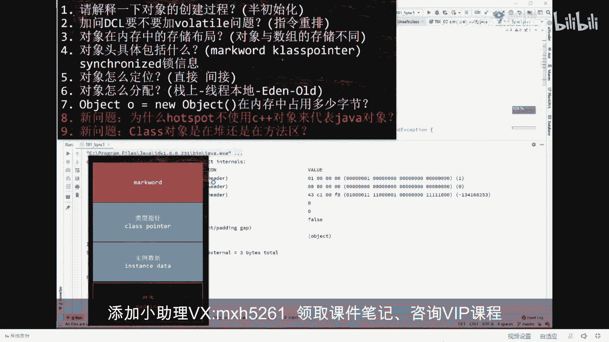
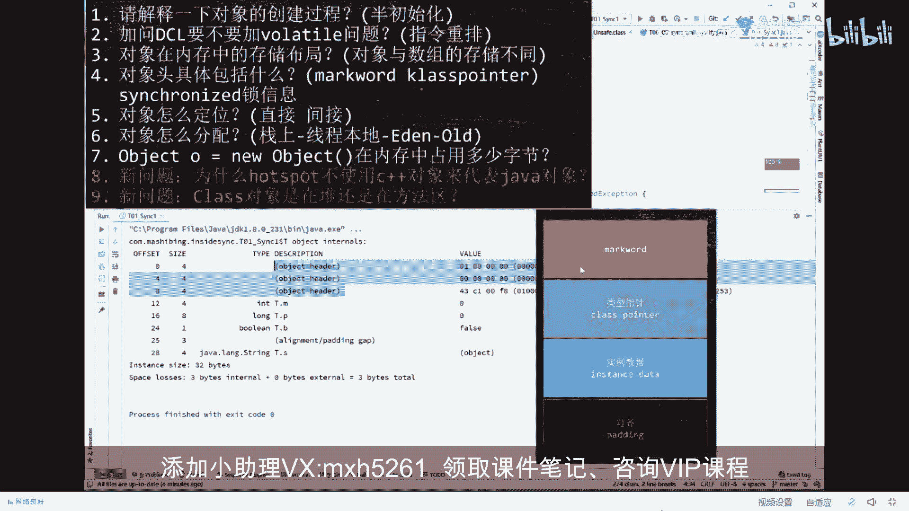
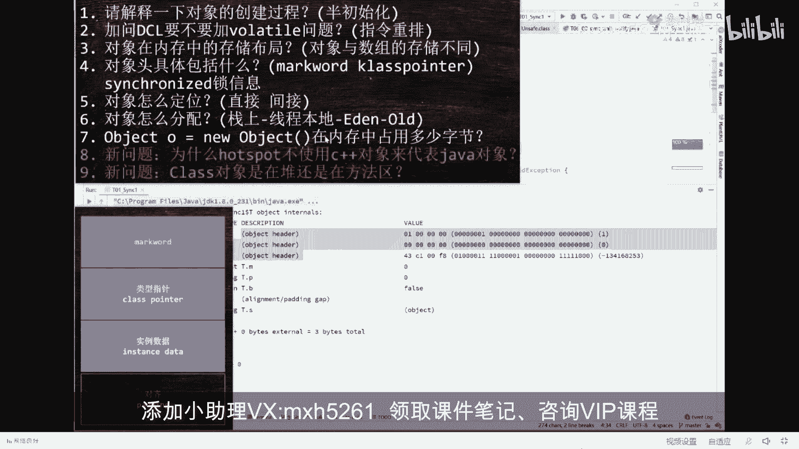
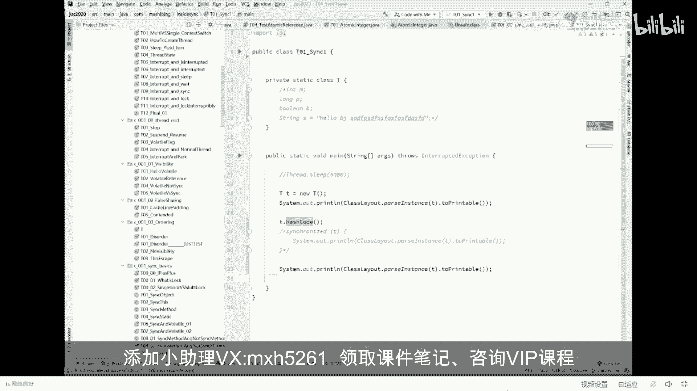
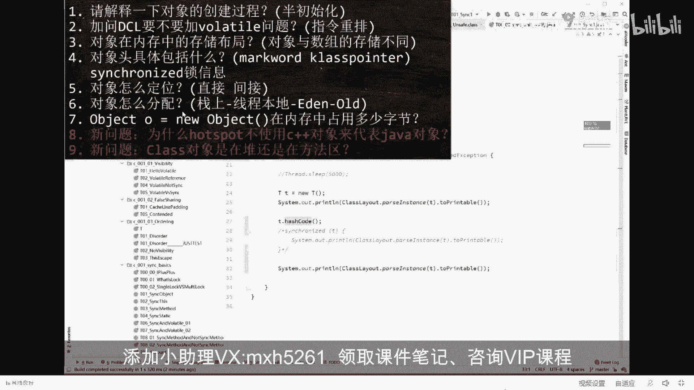
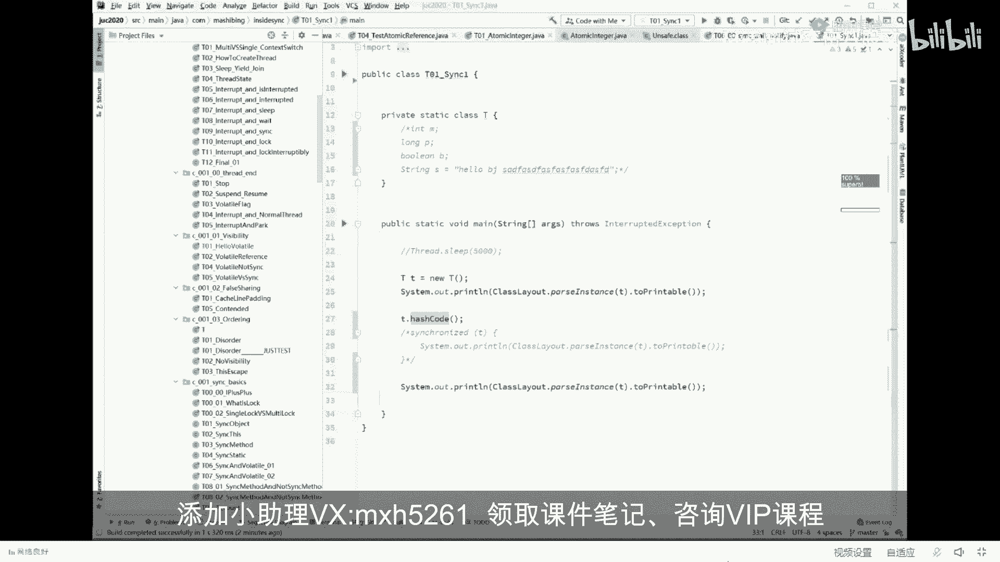
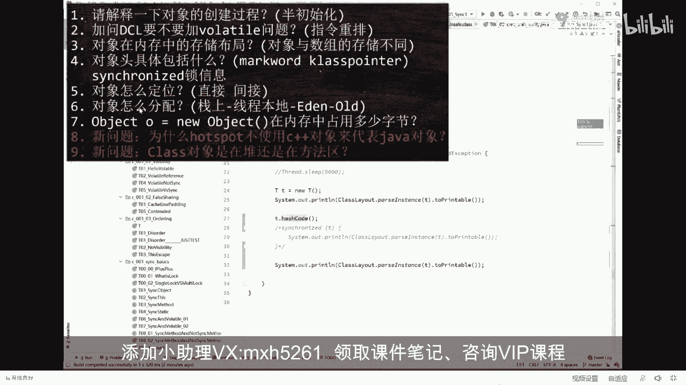

# 系列 4：P20：【JVM大厂面试真题】对象头具体包括什么？(markword klasspointer)synchronized锁信息 - 马士兵北京中心 - BV1VP411i7E4

先讲脉络，总而言之，这玩意儿它是一个死东西。这玩意儿呢如果你是64位的机器，这个mark word就是64位。如果你是1个32位的。咱们的呃GDK，那么这里就是32位啊，这是一般的那个见对象的时候啊。

做这种呃运行时对象的时候经常使用的一种技巧。看这里。在这里呢呃第二部分呢叫类型指针，类型指针比较简单，我在这就不展开了。面试的重灾区实际上在markac word这里，它的重灾区在这儿。

他说对象头者包括什么？听我说对象头这两部分。这两部分叫对像头mark word加上class point，这个叫对象头。所以当你看到呃我们这个对象布局的时候，他在前面12个字节里标了。

它叫object header叫对象头。

对象头包括8个字节的mark word，加上4个字节的class pointer，class pointer指向class的对象，这个不说了，mark word主要包括什么？这里是面试重灾区。

我直接说答案，mark word里面主要包括了三大信息。

主要包括三大信息。mark word主要包括哪三大信息？这东西没什么可说，背过就完了。第一个叫锁信息。第二个叫hsh code。第三个叫GC信息。有同学说老师我能不能看到，可以的，没问题。

我跟你讲的东西都能让你看到。

看这里。🤧我们同样是。我们同样是这个T对角。把它里边的成员变量给它注掉，就不展开了。一个小小的T对象，在个它刚刚扭出来的时候，它的布局到底长什么样？刚才我们看过了啊。看这里。刚刚溜出来这个T对象。

它的布局。他布局是这样的。好，我们说锁信息为什么是有锁信息？大家都知道啊，在JDK里面的java里面，我们想给某把某个对象当成一把锁来使用怎么做，就这么来做schronize就是把这个对象当成一把锁。

我锁定这个对象之后才可以执行里边的内容。好，我这内容里面是什么呢？再把这个T的信息输出一遍。注意这时候TB是上了锁的。为了做一个对比起间，我可以把这个锁释放了之后再做一个对比。😊，第一个是刚刚拗出来的。

第二个是上了锁的。第三个是释所释放之后的。我们来比较一下，看看哪里发生了变化。走你。仔细看，这是刚刚扭出来的时候，我们主要看那个零和一的地方就可以了。往这儿看。你会发现呢。

他第一个字节叫就是就是所有都是0，最后一个是1000001哦。😊，但是比较一下。当我们给他上了锁之后，你发现他什么长什么样啊？能看懂吗？这里明显发生了变化。好听我说，这里面记录了什么呢？

这里面记录的就是关于锁的信息。所的信息就记录在这里。我还可以告诉你，这里头你看的00，那么它就是一把轻量级锁。轻量尼锁，也就是自选锁啊。当然这里面包括了锁的升级过程，锁升级过程会从偏向锁。

到自选所到重量级锁有一个升级的过程，要看就看这两位。当然这个细节呢比较多，要要讲的话，两个小时开外去了，先把这个略过锁释放之后，你会发现okK整个对象又恢复了原来很自然的一个状态。

所以平时我们讲的时候给某某个对象来上把锁到底什么概念呢？其实就是修改了对象的m word。当然，如果你要愿意的话，你比如说我们把这个锁的信息先给它注掉，我们打开这个hsh code。

只要你对它调用了任任意一次hsh code这里面的呃布局也会产生变化。我们跑一下。看这里，这是刚刚扭出来的状态，这是调用了还是code的状态。所以这里面还是code的信息已经被我们记录在了。脑脑袋上面。

所以呢由于一个对象的hash code用的特别多，因此我们调用一个对象的hash code之后，再下次再调用的时候，都不是说重新再计算，而是直接在脑袋上拿出来就可以了啊，它效率这就是它效率高的地方。

OK有同学说，那GC的信息怎么能看到GC信息不太容易看到，因为你没有办法控制JJVM的GC的过程。但是我告诉大家GC的信息。😊，这个对象到底是什么颜色的？这个对象到底是什么颜究？

同学说老师这对象还分颜色，没错。因为一般的我们现在讲的这种GC的回收的垃圾垃圾回收算法叫什么？叫三色标记。这个对象到底什么颜色记录在哪儿？记录在我们的mark word里面。呃。

如果你听过老师的关于三色标记的课，那么你就会知道这两堂课实际上是有着有机的关联。好了。不废话了，我。😔，把刚才的这个问题啊大体上给大家介绍完了，就是对像头里面主要包括什么呀？

主要就包括mark wordclass pointer这两部分，mark word是八字节class pointer四个字节。

呃，那mark word里面主要包括什么呀？mark word里面主要包括锁信息还是code以及什么呀？GC的信息。😊，好了，这会儿还能跟上呢，给老师扣个一。神经蛙java中也是三字标记吗？

是java最开始的三次标记，其他的勾浪是后来学的。

嗯。好嘞，那我们继续。

现在呢我们回答了两个问题。第七题和第三题和第四题啊，一共回答了三个问题。好。😊。

