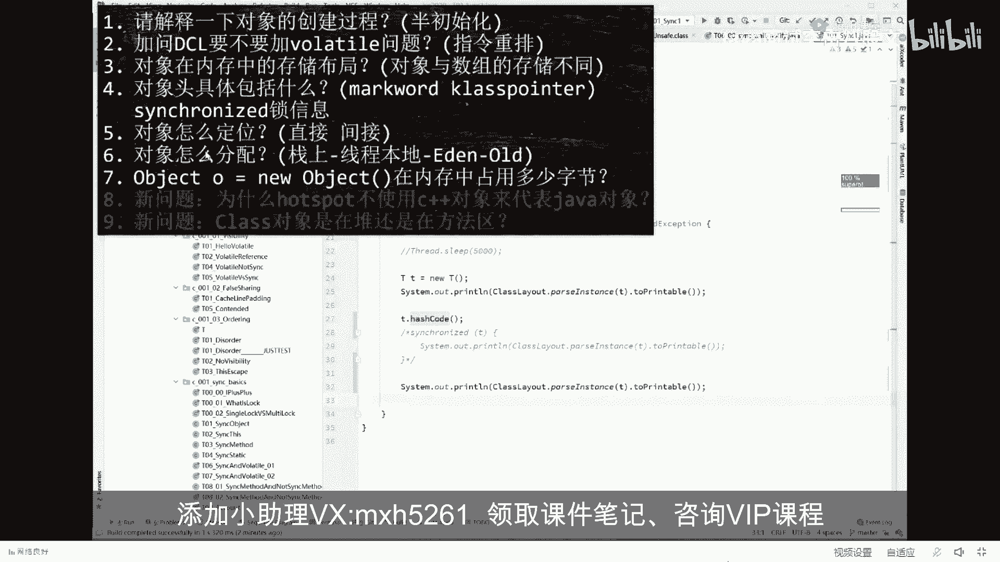
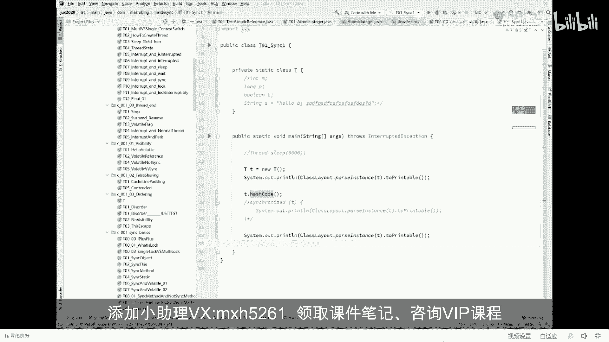

# 舍不得花27980买马士兵教育的MCA架构师课程？免费开源马士兵教育VIP课程 - P21：【JVM大厂面试真题】对象怎么定位？(直接间接) - 马士兵北京中心 - BV1VP411i7E4

对象怎么定位的问题？嗯，这定位问题呢相对比较简单一些。我先讲简单的，再讲复杂的，好不好？好，我们来看这个对象怎么定位这个问题。对象定位问题指的是什么？但定位问题呢嗯。

相对复杂一些，就这玩意儿呢其实是设计JVM的人才会考虑这些问题。这个问题呢问的并不多。不过呢我建议大家还是要大致了解一下对象怎么定位。我们简单说两种方式。第一种呢叫直接定位。第二种叫间接定位。

什么叫定位定位指的是什么？定位指的是这个意思。认真听我写了这么一个一句话，str S等于new string。大家都知道我们6个str在对对里面啊，你一个对象出来，这个没有问题。

那str S是通过这个S怎么找到对应的对象，这个就叫对象的定位，就是通过这个引用是怎么找到它的，这个叫做对象的定位。仔细丁认真听设计JVM的人，其实上有两种方式来对一个对象来进行定位。哪两种呢？

第一种叫直接定位，第二种叫间接定位。当然他有一些专业名词叫直接指针或者聚柄。不管它总而言之，一个是直接，一个是间接。我们JVMhospot默认使用的就是这种直接定位。通过它呃某个算法也好。

或者直接内存地址也好，当然这里不是内直接内存地址，从某某个算法攻击会找到直接定位这个对象，已经知道这个对象的大小，已经知道这个对象的起始地址。那么这个对象就很就很容易就被定位了嘛。😊。

内存里面一大堆的零和一，我知道得从这儿开始，然后多长就结束了。那这个对象我是不是一下就找到了，就这个定位的意思。好，当然我刚我们刚才分析过了啊，说这个对象里面呢，除了包括他自己的成员变量之外呢。

还包括了什么呢？类型的指针。类型指针是通过这个指针可以找到哎，你到底是属于哪个class。😊，所以堆里面有一个对象，通过一个指针可以找到方法区里面的T点 class大概就是这个意思。这是我们。呃。

hospot默认的一种方式。除了这种方式之外呢，其实还有另外一种。另外一种呢叫聚柄方式，也叫间接的方式。间接的方式指的是什么呢？是通过哎这个指针啊直接指到了。这么一个结构体，这结构体呢。

通过这里是两个指针啊，这个指针才会找到对应的这个对象。有另外一个单独的指针指向的是这个D点class。好，这两种方式，我通过这个图相信一演示你就能演示到位了，是吧嗯。😊，好了。

那个呃我我这块呢我就先不做细节上的解释，我看看大家伙能不能接受啊，就这块大家能跟上吧，这两种方式应该都明确什么意思了，对不对？😊，来能够明确的可以继续的给老师扣个一。嗯。ossal的不明不明白不明白。

直接提问，哪不明白是吧嗯。元旦楼人啊，不明白，直接提问哪不明白。如果大家伙呢是java的小白呃，这么跟你说，薪水拿在1万到2万之间，现在还不是。没有没没有什么没有什么基础的啊，甚至说还没有就业的这些呃。

今天这课你听着会稍微费劲点，听到哪就算了，好不好？嗯。好。听我说。当然你给他讲明白对象怎么定位之后，他一定会问你哎，为什么没有采用这样的方式呢？为什么不采用间接的方式呢？间接的方式有什么好处。

有什么坏处，直接的方式有什么好处，有什么坏处，这个大家能想通吗？嗯。直接的方式有什么好处啊？快一下就定位了，光机一下就找到了，对不对？😊，好，那间接的方式有什么有有什么好处啊？😊。

鉴接的方式你发现没好处，你发现没有？你要找两次才能定位到这个对象，他不是速度很慢吗？他有什么好处呢？以前有同学告诉我说老师间接的方式。省空间。你看这个这个对象变小了，因为它里面没有这个类型的指针。😡。

同学们是这样吗？思考一下。当场不会只问你是什么，他一定会问你为什么。嗯。好，我还有同学呢回答到了问题的关键，能回答出这个问题来的人，说明是平时经过呃思考的，而且是平时注意积累了。积累了很多知识的啊。

这个真不错啊。以前我讲这个课的时候，基本上一个同学都答不出来。现在呢你看啊先生你好，说对象在内存中移动的位置，不用重新定位。对，说的非常的对。😊，就是如果是这种方式。

那么如果这个对象在内存之中移动了位置，挪到这个地方来了。同学们，你想一下，你这个T里面的所包含的这个地址要不要跟着变？啊，你从503挪到了806楼层都挪了，你说这里的地址。变不变，务必跟着变，肯定得变。

但是这种方式就不用这个对象挪过去了。没关系，这个T不用变T不用变所带来的好处是什么？垃圾回收。效率就会比较高。有同学说老师这事儿不对呀，有这个垃圾回收这玩意儿。😡，为什么会挪动地址呀？好。

这块就会涉及到JVM垃圾回收的它的一个过程。作为这边M来说，最普通的叫做分带模型。现在用的最新的叫分区模型。不管是分带模型还是分区模型，内存呢一定会从一个。对象会从内存中的一个位置挪到另外一个位置。

它一旦挪动，你的这个指针必须跟着变。好了，大概就是这个意思啊，在这儿呢我就不多说了。因为不知道，因为有很多很多同学呢，可能连呃这班的垃圾回收到底什么样，不知道。呃，尤其是我给大家讲这个什么叫分带模型啊。

什么东西又叫分区模型。我讲这些东西的时候啊，如果没有一定的基础，应该是听不太懂。所以呢我就在这不展开了。呃，这个题呢无所谓的事儿，因为这个题问的也非常的少，把它放过。所以到现在为止呢。

我们大概讲了这么几道题。