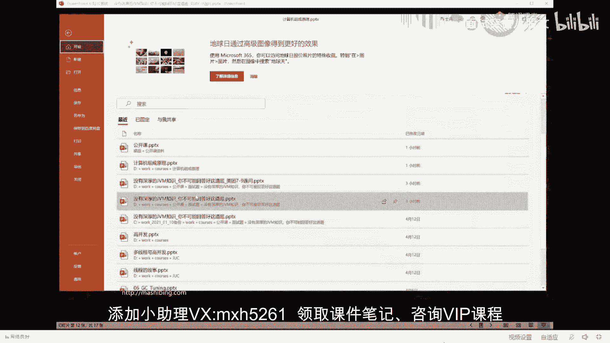
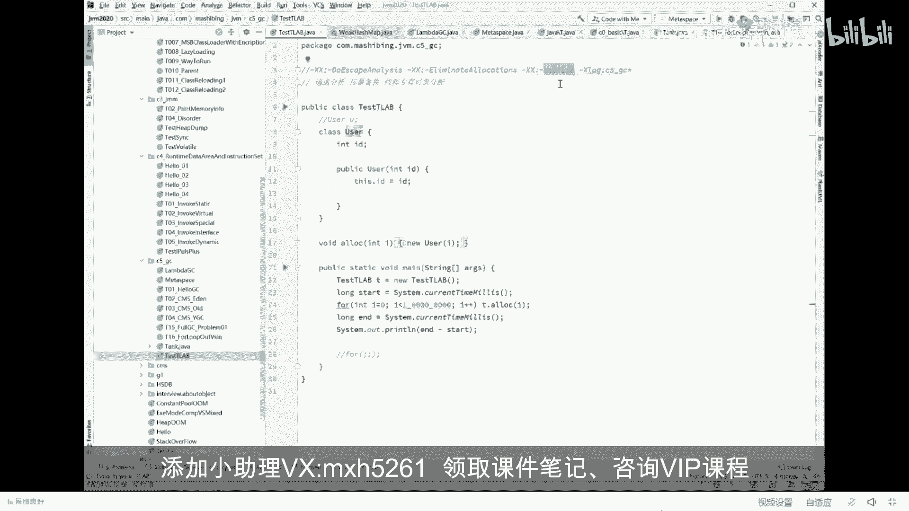

# 系列 4：P22：【JVM大厂面试真题】对象怎么分配？(栈上-线程本地- Eden-0ld) - 马士兵北京中心 - BV1VP411i7E4

来看第六个第六个问题叫做对象怎么分配。认真定。现在这些题都相对简单，所以我过的速度非常快。居名指向的地址不是也得变吗？你说的很对，但是呢它内部。will啊，我解答唯唯一解答will的一个问题。

就是聚丙指行的地址不是也得变，是得变。但是它内部对于对象的整个维护。这个对象要不要回收啊，到什么维呃就是回收到什么程度了，他是把那个指针来用那个T那个指针来维护的那个指针只要不变的话。

它计算的效率就高很多很多嗯。好了。嗯。如果你你你如果想深入了解，可以了解一下那个三色标记算法。你会发现呢，在三色标记算法里面还有挪动的时候，整个是需要维护它的什么呢？维护它的内存的地址必须得维护出来。

如果他来回来去老变。那个维护你你的那个ha是扣的表，哈西表就必须老跟着编。在这不展开了。我们谈这个啊叫对象怎么分配。这过程我希望大家伙把它背过。有很多比较复杂的过程呢，我一般喜欢做动画。

这是为什么我喜欢用PPT的原因。很多人喜欢画图也好，或者还喜欢用文字也好，无论怎么样，也不可能用动画描述的，像我用动画描述的更加精确，不信你就仔细看。好，看这里。对象怎么分配？哎呀，我的天哪。

我发现我我我最后再回答一个问题啊，我最后再回答一个问题。这个问题之后，我们开始讲对象怎么分配。因为每次讲到这儿呢，因为同学们。😊，呃，对于这个问题的疑问会比较多一些。

我稍微多讲两句就看这里神经蛙问了个问题，他说垃圾会收不是在堆上，T不是在站上吗？譬我就想问你，我写了这么一句话，叫stream S等于new string。我想问你这个S一定是在占着吗？一定是在站上吗？

哪位同学告诉我。😡，S等于new string，这个S一定在站吗？你这个S不能是一个对象里面的成员变量啊，大哥。你拿大腿给我想想，沈建华这么简单的问题跟这。有疑问是不是？好了，不废话了。

来看这里看对象怎么分配啊，这个过程也比较复杂。😊，对象怎么分配？有同学可能会说了，大哥那个对象分配，那还不简单，直接扭个对象往对象一扔嘛，很简单嘛，对不对嗯。😊，我看刚才有同学说声音忽高忽低。

有多少同学有这个问题，有这个问题的给老师扣1。声音无靠无的，就是头讯课堂这个。就是腾讯可堂做的这玩意儿吧，我说有的时候真是无语啊。我已经把降噪给关了。嗯，自动争议给它关掉，回音消除给它关掉。降噪开成弱。

喂，hello，好点吗？😊，好点了吗？更不行了。呃，如果是更不行了，你就把你那边的声音啊那个稍微开大点。但是呢声音有点小，你可以把你那边的功放开大点，好吗？他就是忽高忽低会比较难受。声音小。

你可以把你的功放开大啊。哎，来看这里，我们来看这个对象怎么分配的问题。这个问题呢，基本上也是一一系列的JVM的一个总结性的，你才能够了解的理解得了。大家伙认真听。

这里头的分配指的是JDK默认的垃截回收器。呃，这JVM一共有10种垃圾回收器。这10种呢分别是sal  serialal old， parallel parallelel old。CMS然后呢。

parelve啊，这个G oneCDCsando和eppsilon一共有10种。在JDK的1。8，这是大家伙经常使用的一个版本。线上呢大多数用的都是这个版本。GDK的1。8。

它默认使用的垃圾回收器叫做PS加POparlocar加 parallello old好，细节我们不展开这个垃圾回收器会把对象分成啊，会把内存分成两部分，一一般我们称之为叫分区模型。

这个分区模型呢分成两部分，这两部分分别叫做第一部分叫年轻贷。第二部分叫老年代。那么整个对象呢会在年轻代和老年代之间的来回复制。好了，同学们。嗯，我刚才讲的这一小段来能跟上的给老师扣个一。

这块需要我展开一下吗？需要我展开的给老师扣个6吧。如果需要我展开的。就是我刚才讲的这小段听不明白的。嗯，我讲到这儿，我我突然想起来，估计会有好多小伙伴这块跟不上。

嗯。我看这里。我告诉大家这张图。嗯。好，看这张图。这张图啊就是呃我们默使用的默认的垃截回收器。叫做分带的这种垃圾回收器，它使用的一种内存模型。这种内存模型呢会把我们的整个内存分成两部分。

这两部分分为长什么样呢？就是哎这里是新生代，新生代的意思呀，很简单，就是我们刚刚扭出来对象刚刚扭的新生儿嘛，哎放到我们的新生代里。然后呢，我们那老年代老年代在哪呢？老年代是。

经历了好多次的垃圾回收都干不掉的人。比方说这个对象扔进来了，但他一直有用垃圾回收跑一次，哎，没有把你回收掉。这个时候呢就很简单，就把你的年龄加1。来就回收又来了一次，又没把你回收掉。

加2当你到达了一定的年龄之后，进入到老。好了，这里是年轻代，这里是老年代。来，这个概念大家听明白了吗？那，能跟上的给老师扣个一。就是年轻代就是装那个新对象的，老年代呢就是装那个老对象的。😊，当然。

年轻代和老年代呢采用的算法是不一样的。垃圾回收这东西呢有好多种算法，一般来说有三种。从上个世纪五六十年代开始到现在为止，就这三种。这三种呢，第一个呢叫标记。清除就是你这里是个垃圾，哎，把你标出来。

把你干掉，把这块空间给你空出来就行。好，第二种呢叫复制。复制是什么意思呀？😡，我们先说这个标记清楚啊，标清楚也比较简单，你拿大腿想想，我把你标出来，把你清掉啊，时间一长把你标出来，把你清掉。时间一长。

我们的内存会产产生什么呢？会产生碎片化。😡，税票。又这这里有一个洞空出来了，这里有一个洞空出来了，碎片化的产生的原因产生了之后会有什么后果呢？就是当你弄一个大对象，你发现装不进去了，为什么？

因为那些个碎片化的东西加起来呃，能够被我装进去。但是呢那个碎片没连着。所以呢如果我们在标记的时候清除完了之后，再加一个整理的过程。整理的过程指的什么呀？指的是哎。

把这些个中间的这些空的东西都给它挪到一起去，把中间有用的对象全挪到前面来。哎，在标记完了之后再做个整理。这是第二种算法。这个算法呢叫标记整理或者叫标记压缩。特别简单，跟操作系统一样。对，说的很对。好。

这两种算法大家会听明白了，对不对啊，不难。好，这其中呢还有一种算法，这种算法是什么呢？叫复制。复制是什么意思？复制的意思是这样的，认真听。这是我的内存啊。甭管你多大，我给你一分为二，分成两个，特别好玩。

哎，我这个里面的这个对象呀，凡是活着的，我都给他拎出来。甭管他在哪。然后统一的复制到另外一边来。同时排列好啊，这个这个速度很快的。拿过来之后，挨着盘的复制嘛，复制过来之后，一下把整个内存全部清掉。哎。

你会发现这玩意儿的效率特别高，贼高。这是效率最高的一种呃，垃圾回收的方式，但是毛病也很大，你拿大腿想想都知道是吧啊，你你你你你你会一看。浪费空间，甭管多大内存只能用一半啊，是不是？好啦。

所以大多数的垃圾回收器都是怎么做呢？他会嗯。综合运用咱们将刚才讲的这三种方式。那么PSPO是怎么做的呢？我给大家简单解释一下，你认真听。在这里。他这么来做的。当我们刚刚调出来第一个对象的时候。好。

这个对象呢会扔到我们年轻代里面，在年轻代里面会分成3块区域。第一块区域叫伊甸园，人类诞生的地方叫伊变区。当然所有年轻的对象啊，这是诞生的地方就扔在这儿了。好。呃，一般来说。

这种年轻的对象呢特别容易被回收。呃，这个大多数程序的一个统计呢，你你比方说你一次性产生100个对象，经过一次垃圾回收，很有可能会回收掉95个，知道吧？只有5个是活着的。如果这事你理解不了。

你就想一个fer循环里面，你不停的扭对象。这个出了这份循环，没有人认识他他他就会成为垃圾了，就很简单一件事。同学们，你就想了，如果说100个对象会被回收掉95个。那采用什么样的算法效率最高呢？

当然是复制，你想想一定是复制啊，对不对？那个呃复制算法为什么效率高呀？因为它只有5个活着的，你只用把这5个哎给复制到另外一一块区域里头去，是不是就可以了？😊，所以年轻贷里面采用的算法叫做复制算法。

但是这个复制如果说你把年轻贷一分为二，浪费空间浪费的太多了。尤其是你想想我要复制过来的这块空间，只有5个对象。我用得着那么大一块空间吗？用不着。所以这个时候他的算法是怎么做的，是这么来做的。

这里产生一个对象。然后如果经过垃圾回收，它还活着，它会被复制到另外一块区域里。这块区域叫做surviver，叫幸存者。S0S1S1S2from to说的都是这块区域，不管它叫什么名词，无所谓。总而言之。

复制到一块相对小的区域里，为什么它小就可以？因为他活着对象很少。好，这块还能跟上的，给老师扣个音，我我会认我认为比较简单，对你来说未必未必简单啊。就是它的中间的设计为什么这么来设计？就在于这儿。

你会发现呢它的80%的区域，年轻年轻在里面80%的区域都叫一甸源区。10%是死歪玩区。另外的10%是另外一个40本K。他这么来做的。ok。那有同学会说了，那为什么需要两个sver啊？很简单。

因为还他除了经历这次复制之外，还要经历下一次复制，什么意思？看这里。这是我们这个对象。比如说我们整个对象啊，用了5个对象出来，然后一次回收干掉了4个。

只剩了一个活着的这一个活着的会被我们复制到一个sve里面。接下来把整个一甸园去全部干掉，他又可以重新使用了，特别爽，连连续的你可以分配好多对象一次性的。后来又来了5个对象。然后呢，又被干掉了4个。

只剩一个活着的。同学们，你们想一下，我下次再回收的时候，我是不是连这个都想得一块回收？如果这个对象被回收了，他们会不会被干掉。如果这个对象不会被回收，注意你还能往自己的这个里面来复制吗？你没法复制了。

你得去哪复制呢？你得把这两个活着对象都复制到。哎，第二个svivver，接下来把这个和这个一块干掉。下一次再开始的时候呢，把这个活着的又复制回来。然后呢，把这个和这个一块干掉，你会发现这2块区域。

同时使用的只有一块浪费的空又多少，只有10%而已。不像原来一分为2，浪费50%。来这块儿能听明白的给老师扣个一。对，默认比例811，但实际上JVM的调优，我们讲JVM调优是什么东西？

JVM调优就是可以调整这些比例关系。比说年轻代默认比例对跟老年代1比2。但如果说你那个呃你本身你的算法产生的年轻的东西比较多，老年的东西比较少。这个很简单，你就改成2比1都没关系，随便你。好了。

能听明白的。如果还没听明白，我给你一个动画看。仔细看一个对象从出生到消亡的过程，他到底长什么样？你有这个对象最开始产生放在站上。当然这个先略过，这是一个细节，这个先略过，他会首先进入到伊甸园区。

进入到伊甸园区之后呢，如果他还活着。复制到S1。如果下次还活着，被经历一次垃圾回收之后，还活着复制到S2。还活着又复制回来还活着又复制回来，一直到年龄够了，进入到老年代为止。当然。

老年的表他又被回收掉了，那说明什么他就被被干掉了。就结束了，从出生到销亡，大概是这么一个过程。好。这会儿还能跟上呢，给老师扣个一哎，可以可以继续的。所以下面呢我我就给大家伙补一点这个知识啊。

下面我来讲对象怎么分配这过程。这过程是这样的，仔细听认真听。当你刚刚开始另一个对象的时候，首先会尝试在站上分配。有同学说了，老师一一直一直您讲的就是在堆上分配啊。你你去问哪个线下的老师，你随便学。

他说的6一个对象一定是往堆上分。对，是的，但是很不幸的是，如果你的被大肠问到。你就必须把这个过程给他说出来。你有一个对象的时候，首先会尝试往站上分配。有同学可能就会说大哥还能往站上分配。这是什么概念？

这是一个站，站里面通常有方法的调用过程。好，这是一个main方法。关于ma方法的局部变量，全往这都，能听懂吗？比方说我在ma里面声明了一个。变量int类型M等于8。好，这是放在妹方法里面的一条语句。

这个东西叫ma方法的局部变量，它局部变量。放在站里面，所以这个小M等于八就扔在这儿。接下来第二一个呢，如果这个ma方法调用了另外一个方法啊，第二个方法叫Mma方法执行到这儿了，还没开始继续执行的时候。

就调用了另外一个方法。这个方法进入到站里面。好，这是这个方法，自己局不样论的空间。这个一般我们称之为叫战争，叫tack frame。好，不管它。这个方法又调落第三个方法，没关系啊，再进来。好。仔细听。

当我们明白了这个过程之后，一个方法一旦结束了。你比方说这是M方法，这是N方法。M调用了NN结束了，回到了M继续往M往下执行了。同学们告诉我一下，这个里面怎么处理呢？这里面有操作系统，直接来帮我们管理。

直接把它往外一弹。什么叫往外一弹，站顶指针往下一挪，这块空间就废了。好了，这个叫做。战大家明白了什么叫做战的或者叫战争的概念之后，你会发现呢，如果用战争来搞管理对象。

这里面对象呢放在这里有一个什么好处啊，好处就在于，只要这个战争一结束。帮机往外一弹。我们的对象自然而然就结束了。我需要垃圾回收来参与吗？不需要。效率高高，太高了，垃圾回收这个玩意儿是一个。

咱们系统里面的现程知道吧？需要这个县程定期的或者找时间来运行，你才能够把这个对象给回收掉。但是如果你的对象放在站里面，你会发现。😊，不需要他参与。直接往外一弹结束。所以当你一个对象可以分配在站上的时候。

有什么好处呢？好处就在于。网站上一分配。这样往外一谈，哎，整个对象分配结束。在，这会儿能听懂的给老师扣个一。当然。那你明确了这件事之后，你一定会问，那为什么不是所有对象全都分配在站上啊，有这个疑问吗？

😡，肯定有这个疑问。为什么不是所有对象全部分别在站上？😡，听我说站上这东西，其实呢嗯。是因为什么呢？站上这东西呃。看刚才有朋友，我看刚才同学跟那说热热预热默认，不管他啊，听我说站上这东西。

第一个占的空间比较小，默认是256K，知道吗？就这么大个。所以经常我们遇到tack overflow叫粘移出。如果你对象全部在上面被移出了，还有一个。有些对象不能往站上分，为什么？

比如说给你举个最简单的例子，这是一个战争。它里面有个引用，用到了这里面的一个对象。你这玩意儿能随便谈吗？你往外一弹的话，你好好琢磨琢磨。😡，我这里面的引用是不是就孔指针错了，你谈完了，我找不着那对象了。

你不就孔指针了吗？所以这里面呢，站上分配是需要有两个标准的。第一个标准呢叫做逃逸分析。逃逸分析的意思就是说，我看你有没有逃出我整个方法的执行范围。比方说你for循环里面，别人谁也没用到的对象。

你可以往站上分，完全没有问题。但是如果这对象被别的方法里面的引用给用到了，或者被堆里面的某个。引用给用到了，那你完蛋绝对不可能往这样分配的。因为你这个这样一谈，别的引用就完蛋了，就用不用用不了你了。

所以这叫逃逸分析，看看你的生存有没有逃出我们整个的方法范围。好，第二个叫标量替换，我就不解释了，只能用最基础的数据类型才能够。能够替代的对象才能够往这这上面分配。你说特别复杂的，有些引用类型放在上面。

不好意思，这上面不能分。好，不废话了，了解这个过程就可以。来，可以继续的给老师扣个一。😊，嗯。好对象怎么分配，这是第这是第一个一个过程。第二过程是什么样的？如果在站上分配不下，就看这个对象是不是个够大。

如果是一个特别大的对象，我告诉你直接进入老年代old old区老年代。当然老年代的话是需要经过负DC叫做全量回收啊。负DC之后才会被回收回收掉。哎有同学马上就会问。老师这个个够够不够大，是什么意思？

多大是大，听我说JVM调U里面，你完全可以用一个参数来控制，叫max threshold。我在这就不展开了。那现在真的有对象在这样分配吗？这不是废话吗？我给你讲半天了，哎，不就给你讲。在这上分配吗？

其实我是可以向你证明的，我只是懒得给你证明了而已。嗯，占赏分配。罗鸟愿意把这小东西拿走。而且呢把这些个参数都给我打开或者关闭。仔细实验一下，你就会知道哦，确实有战赏分配这个概念。不展开了好吧。

可以不展开吗嗯。😊，来可以，同学给老师扣一，我们继续不可以，同学给老师扣7652。63的开根号，最后得到的结果值。OK大家伙都觉得都可以，那我们继续啊。😊，嗯。开个玩笑啊，看你们有没有在认真听课嗯。😊。

啊，看这里啊。嗯，他因为因为因为这东西呢细节太多，他有好几个参数，像他必须你要把他的战役战译出给他关掉的话，怎么怎么做呢？就是逃逸分析给他关掉要 escape analysis做逃逸分析。

你必须得把这参数给他关掉。还有一个呢必须关掉标量替换。还有一个呢必须得关掉 buffer这个我一会讲给你听。

OK看这里。好，接下来我们刚才说他个儿够大，直接就进入到老年代了。那他不大不小，又不能在站上分配，这时候分配在哪呢？这时候才会正式的进入到我们刚才讲的那个过程。接入到哪儿去呢？进入到了。

伊甸园区伊甸区啊，回想我刚才给你讲那张图。好了，但是有同学马上说说老师怎么前面还有一步啊，对，这步叫做尝试在县城本地分配。什么意思？这个T2AB的全称。他是这几个单词的缩写。

thread现场local本地。呃了。Ocaion分 buffer。缓冲区叫县城本地分配缓冲区叫。请跟我读跟着我读re local allocation buffer。要读出那种英国流氓英了啊。

relic allocation bug。There没 logo allegation about that。23的口音也可以。我要不开玩笑了，就是县城本地分配，这到底是什么意思？认真听。如果说我们。

呃，一个程序开始之后，好多个现场。开始往那个伊甸园区开始分配对象，注意是好多个县程。那么大家想一下，你如果想分配好这个对象的话，必须得做现程同步。大家伙都看上这个位置了，谁抢到算谁的。

各个县城之间的同步必须得做好做到位才可以。这点很容易理解。但是如果上来就给县城做同步，这个效率一定高不了。所以呢它在前面加了这么一步优化，这个优化指的是什么呢？给每个县城一块独立的空间，什么意思？

每一个小县城在一甸园区里面啊，都有自己的一块独立的空间啊，这是A县程的空间，这是B县程的空间。A县城要分配对象的时候，优先往自己兜里装。😊，B县城优先往自己兜里装，不会先用公共区域，先在自己的卧室啊。

往往往里装，只有卧室不够使了，再去那个客厅里面去抢抢位置。所以说。你自己往我自己兜里装，你还需要现程同步吗？不需要，所以这个效率就又变高了。

OK这个东西呢叫three local election buffer。如果大家感兴趣，GVM调优里面这块区域也可以调。但是这块区域本身就分配在伊甸园区。所以我们说对象。在这块区域。

不管你开没开启sloc啊，最终都是在伊甸园区进行了分配。🤧啊，这块能跟上的，可以继续的给老师扣1。嗯。这个YN代表啥？这个Y叫yes，这个N叫no。好。我们在这个伊甸园区。那了伊甸园区之后。

回想我们刚才执行的过程啊，这伊甸园区如果被击C，那就会说清除一遍。被清掉了，那就直接结束了。如果没有被清掉会怎么样啊？回想一下是不是进入到我们的S一去了。S一区。又经过一次垃圾回收，如果被清掉了。

那就又结束了。如果没有被清掉，就看你的年龄多大。如果年龄够了，是不是又进入到老年代了？如果年龄不够，会进入到S2去，如此的循环往复。好，抓图吧。对象怎么分配的过程，我用一张逗号给大家画出来了。

逗号我画了2小时，给他演示完5分钟。讲一门好客比较辛苦的。不是那么的容易。这张图啊。Yeah。好。现在美团的。大概有几个问题。我们现在能回答了朝燕第七个问题。

你们可以回答了objectO等于new objectject内存中占占多少个字节呢？16个。😊，对象怎么分配呢？哎，首先在这，然后在现城本地伊甸园区old区中间呢有S1S0S1互相之间的复制过程。

对象怎么定位呢？直接和间接两种方式主要是体现在垃圾回收的区别上。对象头具体包括什么呢？mark wordclass point啊， synchron。

然后mark word里面主要包括什么锁信息GC的信息。还有一个呢？还是扣的信息，对不对？对象在内存中的存储布局长什么样呢？四部分mark word。Class pointer。

instance data和padding。好，到现在为止，34567讲完了。9点06分速度还可以吗？如果说那个时间充足的话呢，我会给你讲里面的好多好多细节，时间不充裕，有些细节我先错过。

比如说class pointer本质上这玩意呢，虽然说你你你你你认为啊。class pointer这玩意儿。啊，虽然说你认为呃，他是一个一个一个。四个字节，但实际上呢。

这里面有开启压缩和不开启压缩的区别。这里面还有超过32G内存之后自动失效的区别。这里面比较复杂，我就不展开了。而不管怎么样，听我说，起码34567我能答出一大概来了，对不对？

