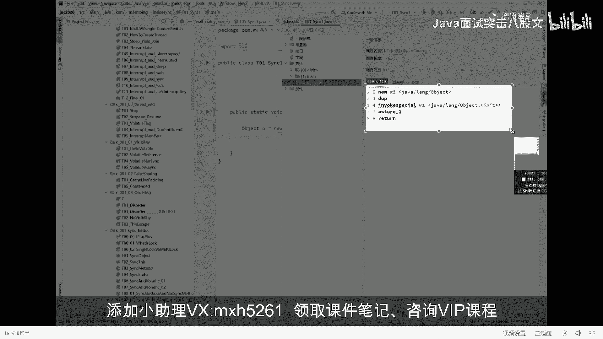

# 舍不得花27980买马士兵教育的MCA架构师课程？免费开源马士兵教育VIP课程 - P23：【JVM大厂面试真题】请解释一下对象的创建过程？(半初始化) - 马士兵北京中心 - BV1VP411i7E4

好了，下面我们来聊一和2。一和二他娘的是最难的，每次讲一和二比较头疼，所以我们要留留足充裕的时间来给大家讲一和2哎。哦，可以继续的来给老师扣个一啊。😊，该进广告了，没有啊。我没有想打广告的。

我们讲第一题和第二题。一题和第二题是最复杂的，我尝试讲给你听。第一题呢叫做解释对象的创建过程。什么叫对象的创建过程？这东西呢。嗯，讲起来呢并不是并不难，我直接告诉你，我我先给你讲结论啊。

认真听对象的创建过程什么样的？其实对象创建过程比较简单，就object O等于new object。它首先往这块空间里头你有一个对象出来是吧？刚才我们说过这个对象里面内存布局了。

那它推向创建过程到底长什么样吗？得听我说对象的创建过程，实际上它是分成三部分三步构成。如果大家伙想了解一个对象的创建过程到底是哪三步，你做一个小小的操作，这个操作这么来做。这是刚才我们这个小T对象。

删掉。我们就执行一句话，T小T等于6T，其他什么都不执行。跑一下的小程序。然后接下来我们去观察这个小程序所生成的字节码。这是什么意思？就是java语言的汇编代码。class的字节码，它到底长什么样？

我们来看。怎么看vi。Show bycode。看它的生成的字节码，或者是使用一个插件。这个插件呢叫J class library。我喜欢用这个插件。

这插件叫s code with the j class library。打开来看，他会帮你把你整个生成的class文件全部帮你分析一遍。生成的方法里面类方法。在它里面的代码到底长啥样，就在这儿。嗯。

这里面有个satic class，这里面生用的稍微复杂了一些。这样啊，我把代码呢再写的再简化一些。看这里，因为这里头呢有一个interrup exception，我把代码写的再简单一些。就这么简单。

obO等于new。Oject。跑一下。好，我们再来看它生成字节码。6 should by code。With the j class slide。方法没有方法。

扣的。你看一眼他生成的字节码。

生成这个字节码呢大概是有方便手机的。大概是由55个指令构成。这第一条指令叫new new指令。缪指令是个什么概念？我先跟大家说，new就是扭一个对象。那就是分配一块空间，你会发现他掉了一个对象。

这个对象呢就是javaline object，所以他拗的是这个对象。第二条指令叫duplicate。我今天不想给大家讲，ja不到汇编码，这是在我这破里专门讲的。先把这块给大家略过，这块比较复杂。

我先把它略过。好，第四第二步第二步叫什么？第二步叫invoke specialial特 invoke调用，special特殊叫特殊调用。特殊调用了一个方法，哪个方法呢？一号方法一号方法是哪个？

是object的initialize方法，就是它的构造方法。你调一个对象，肯定要调它构造方法，对不对？好，第第三步叫做ace store a store的意思叫建立关联。我一会给你解释。好。

这条指令呢叫return returnturn就不管了。所以最核心的指令有3条，分别是new。invo special和a store。来这会儿能跟上的，给老师扣个一。

我下面向你解释这三条指令到底是个什么样的概念？我看这里。

我们解释对象的创新过程。刚才我说了6这条指令啊，就是内存里头申请一块空间。但是大家知道，如果一个对象里面有成员变量的，它的成员变量一定是要占空间的。比方说我们有这样一个classT。

它内部有一个成员变量是小M。我想问你当执行到这条指令的时候，这个小M的值是几是8吗？讲到这儿呢，有一些语言的历史，我稍微给你们展开一点点。老师我呢从最开始的时候，我们讲这个语言里面的，怎么说。

就是讲这个讲这个讲这个呃C加加语言，先还是讲C加加，后来讲汇编讲C，然后一直讲到java，讲了很多很多种语言。我原来在那个。华中科大就是。左老师的母校啊，曾经讲C加加的时候，同学们都跟那震撼，我靠。

原来C加加还能这么讲。认真听C加加语言呢，它也能扭对象。这个大家知道C语言其实也能扭对象，无非就是分配一块内存，把这个内存里面好好来组织一下就可以。但是。听我说。我想问大家一句话。

如果在C加加里面或者在C里面，当我们扭出一个对象来的时候，它里面有个成员变量小M。我想问你这个M的值最开始是几？这个大家能知道吗？如果在C加加里面扭出来一个对象int类型的这个小M的值会是几？

怎么这么多说零的呀？这都是没学过，有没有学过C加加的，跟跟我说一个。这说灵的明显是没学过的，没学过C的。这东西叫做遗留纸，遗留纸能听懂吗？什么意思？什么叫遗留值啊？遗留值的意思就很简单。

就是上次有一个程序在这里面用过了一个数值。注意我们说这块区域又可用了，他只是做个在这里做个标记，说这块区域又可以用了分配一个对象往这一分配的话，上次留下的里面的这值是几，这个M就是几，上次用完啥。

这东西就是啥？所以这是遗留值OK。你前男友的吻深深的印在了你的嘴唇上，所以你的新男友印在了你前男友的。怎么这么乱呢？我不说了啊，就是总而言之呢，它中间没有一个renew的过程。OK。

他就是一个有一个遗留值在这里，所以遗留值。就会诞生一些个安全性的问题。为什么会有安全性问题？比方说这个地儿正好是个密码。你上来之后，你M等于几，等于你的新程序可以直接访问这块内存，直接拿密码了。我的天。

😊，大家都知道那个汇编啊，C啊都能做什么东西呢？做逆向，对不对？逆向怎么做，就是分析里面的现在正在跑的那个值到底是多少，直接给他改过来。OK。正是由于这些安全性的问题。java是怎么做的呢？

Java是这么做的。当我们扭出来任何一块内存之后，它里面有个成员变量。都给他附成默认制。所以像inter类型的默认值0。波尔类型的默认值false。引用类型的默认值空。OK。

所以当我们扭出来一个对象的时候，它里面的成员变量注意是默认只是几是零，它并不是等于8的。来，这会儿能听懂的给老师扣个一。对他先清理了一下，等于你交了个新女朋友，他实际上把自己renew了一下。

把自己遗留他前男友遗留的各种各样的问题呢，都从身上清理了一遍，能听懂吗嗯。所以你得到的是一个。崭新的。女朋友或者男朋友啊，开了个玩笑啊，好不说了，所以java的比较安全啊。嗯，大概就这个意思。好。

那中间这个invo special只有调用完构造方法之后，这个值才会被我们复制成为8。原来是0，后来它就变成8。好，第三步叫A store，我来解释，看这里。第一步。

当我们执行到newnew这一步指令的时候，它里面的值0。执行到invo special的时候，这个值才会变成8。那下面这个a store的意思很简单。这个小T哎和我们这个对象建立关联。

所以对象的创建过程由三步构成。第一步，申请空间。设默认值。第二步。调构造方法设初始制第三步建立关联。好的。很简单，所以第一题也特别简单。这是。解释对象的创建过程，半初始化，这个题非常的简单。

