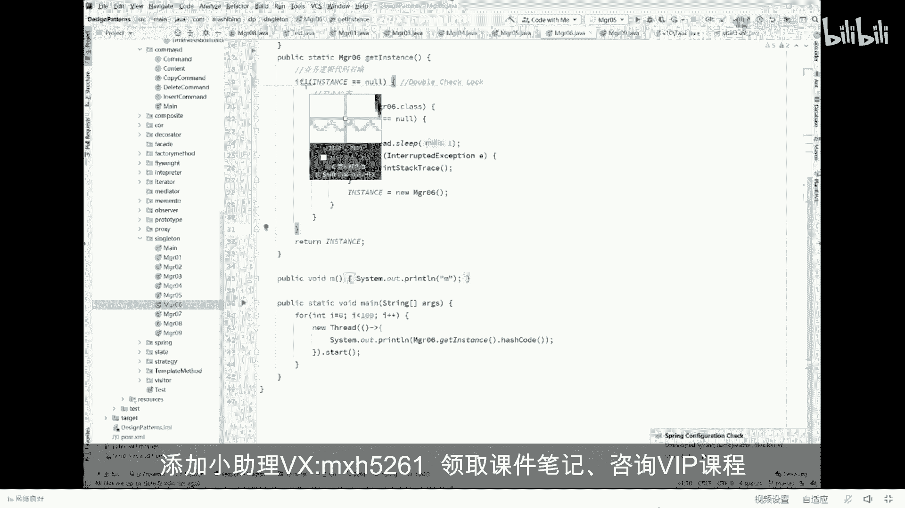

# 舍不得花27980买马士兵教育的MCA架构师课程？免费开源马士兵教育VIP课程 - P24：【JVM大厂面试真题】加问DCL要不要加volatile问题？(指令重排） - 马士兵北京中心 - BV1VP411i7E4

而且就超级难。第二题太太他娘的了，每次讲这个题呢都都比较费劲，但是也没有办法不讲。先承诺给大家讲给大家听。好，听我说。要讲清楚。第二个问题，我们先来聊。一个触及灵魂的问题啊。嗯。蒋这个成序员。

需要掌握的底层知识啊。嗯。嗯嗯嗯。汇编啊。😔，嗯。

嗯。稍等啊，我还是得得要PPT给大家演示，不然的话呢，比较费劲。好，听我说啊，我们现在先问大家一个小的问题。这个问题是这样的，他说程序是真的按照顺序执行，这什么意思？真听。比如说啊我们现在有两条指令啊。

或者要两条语句吧，说X等于X加加。或者是X等一Y等于一这两条指令啊，这两这两条语句到底是一定是程序真正执行的时候，是一定是先执行它再执行它吗？一定是先执行他再执行他吗？我先说结论，结论叫做未必。

结论叫未必不一定什么意思？就是在你程序真正开始执行两条指令的时候，很有可能是后面你写的指令先执行，前面写的指令后执行。我们我们先我们先我们先记住这个结论。然后我们再来讲为什么原因呢？其实很简单。

我稍微给你解释一下，你就明白。比如说啊我们的CPU执行指令的时候，它的速度非常快，它是内存访问速度的100倍。如果我们现在有两条指令，第一条指令呢是去内存里面取个数据。

第二条指令就是CPU内部的一个加加操作，某个寄存器加了个一。那但是你想一下，如果说我们强制按照CPU按照这两条语句的顺序执行。强制按照它按照顺序，那是不是会造成这么一个现象？

就是当我的CPU执行这条指令的时候，我发了一条指令给内存，我就得等着内存大概100个时间单位之后，就我CPU在那歇着，你懂吗？等100个时间单位。嘿，等你回来了之后，我才能继续执行。第二条。

这个大家能听懂吗？就好比说我们那烧个水，想泡个茶，我烧完水，我必须等得等得等水开了，我才能去。拿茶叶洗茶壶、洗茶杯泡茶。所以。CPU怎么能容忍这样的浪费呢？所以一般来说它是可以进行优化的。

怎么进行优化呀？能进行优化优化的办法就是我烧水的时候，我同事就开始洗茶杯喜茶玩不就得了吗？所以。我在发出这条指令，等这条指令还没有回来的时候，我就开始执行下面的指令。下面的指令跨机先执行完。哎。

等什么时候这条指令回来了，我们再继续往下执行。😊，哎，这会儿能听明白的，给老师扣个一。所以在你真正开始执行程序的时候，有可能是哎后面写的程序先执行，前面写的程序后执行啊。有同学是能不能证明？

时间关系我就不给你证明了。我告诉你，我写成这个程序完全可以证明出来。嗯，VIP呢，我专门给大家写了证明，在这我就不单独写了。因为这个过程呢也相对复杂的解释半天。因为后面呢还有很多事儿要做。

所以我们先跟大家说说清楚这件事，程序不一定是按照顺序执行。当然有同学呢可能会说了，说老师这事不对呀。你想想看。像这样的两条语句能随便换顺序吗？我想问问能换吗？这肯定不能换，这换了顺序。

比方说原来的X值为0，这换了顺序，最后的结果是不对的。你先在等于X加加，最后结果是2，你先X加加最后X等于之后结果是一，这能对吗？😊，这不行。所以大家认真听我讲。程序什么时候能够乱续。

最终的一条规则叫做。保持只要保持最终一致性就可以。什么意思？注意，这里使的是单线程乱续。单纯论叙的意思是，只要在一个县城里面，这两条语句随便换，不管你怎么换，换到最后最终的结果是一样的。你看这两条语据。

我先执行Y等于和先执行X等于一最终的结果，我们内存里面是不是这块X等于一，这块I这块Y等于一，无论你怎么换，无所谓嘛。X等0Y等。Y等于2。5。随便换对不对？所以前面两条语句叫做没有产生依赖。

你就可以随便换。哎，别的人也一样。对，没错。来，待会儿能听明白的，给老师扣个一嗯。所以说程序不一定是按照顺序执行的。那到底呃什么样的东西？可以换顺序的，反正保持最终一致性就可以。

那如果我讲了这个问题之后啊，我想问大家一个小的问题。这是一道面试题，也是一道面试题啊。比这道面题稍微容易一些，我看还能不能打得出来。看这里。来看这道题。为了方便手机档，我把它复制一下，放大。

这个体贴的男人啊。呃，手机档应该也能看清，仔细看。嗯，来看着小程序，我们有一个类啊，这个类呢叫T03。😊，然后呢呃他有一个成员变量number等8。然后呃，在我们6T03的时候呢，启动一个线程。

这个线程呢是打印this点 number，让它启动。接下来呃，我们在 main方法里面new了这个对象。哎，你可以想一下，我扭完这个对象之后，一个线程启动，然后打印这个number等吧。

来告诉我一下这个程序有没有什么问题。有没有bug存在？有bug吗？好，这个程序呢叫做注名的this溢出问题啊。他叫做this escape，就就这个单这两个单词。

this escape叫this一出问题。这个就是这句话是什么意思？为什么会产生这种问题？你仔细听啊，同学们，你们回想一下，我们另一个对象是由三步构成，记得吗？六一个对象的时候。这里我们定了个对象。

第一步呢是扭了哎，扭了一半，刚刚申请完空间，这里面的number值是几啊？是0。好，我假设我刚刚扭了一半的时候，我另外一个线程启动了。另外一个县城启动了。我是不是就能读到这个中间状态啊？

这个大家能能理解吗？我这对象购的方法还没执行完呢，我这县程是不是就已经启动完了，我现程启动完了之后，OK。😊，我是不是就读到这个中间状态了，所以你读的时候，这个vis number是有可能输出为零的。

虽然你做实验很难做出来，但是从理论上来讲，这个this只构建了一半，你就把它拿出去用了这个叫this溢出问题。来这个问题听懂的，给老师扣个一。这个面耳题相对简单。

但是美团的这道题呢实际上是相对非常复杂的一道一道题。我们翻回头来再来看美团这道题。委团人道题呢，他是这么来问的，他说DCL要不要加volat？呃，我我先问大家，DCL用我解释吗？估计得解释。

DCL要不要加朋友？DCLDCL是一种编程模型，用的特别特别多。需要解释的给老师扣2，不需要解释的扣1。嗯。看这里。看这里啊。嗯。我们来解释DCL。就得打开我。讲的另外一门课叫设计模式。

Design patterns。嗯，设计模式。啊，我们来看那个设计模式这门课里面我讲的一个单立模式。呃，首先解释什么叫单利，这个我就不不问了啊，因为有同学真不明白什么叫单利。

我简最快速的解释单利呢就是保障某一个类的对象只能扭出一个来。最简单的实现方式是这种。比如说我们有一个对象。magger01，然后呢，我我只能允许你有managger01的一个对象，不允许有多个对象。

那我可以上来二话不说，我先把自己的一个对象给扭出来m01 instancet等于new manager01。同时把构造方法设成private，别人永远谁也拗不了，只有我自己能拗。那当然了。

我这扭出来个对象之后，别人怎么用啊，我提供一个方法，这个方法叫get instance。然后呢，return。你在后面用的时候，不管你调用了多少次这个方法，你拿到的永远是同一个对象。

来这小程序简单读一下，读明白这个程序的基础之上，我们继续往下探讨这个东西呢叫做单立模式。这种实践的方式叫做扼汉式的单力上来二话不说，非常饿，二话不说，先把它扭了再说。这是你的老婆，你的老公。

husband，你的husband从法律上来讲，即即便你有一个class叫husband，但是法律上来讲，你只能有一个husband，有且只有一个。不然你就犯罪了，你重婚罪。

但是呢如果呃如果这个class叫做boyfriend，就是你的男朋友，那你理论上你可以有多个。虽然说法这是法律上起码不会治你罪，只是道德上你会遭遭受到谴责而已。所以有的时候我们是需要单立模式。

就是你从语法上来直接给他规定好，就是他就只有这一个only one。就这意思。好啦。呃，当你呃理解了这件事之后呢，这个单例模式比较简单。但是呢这个单利模式的写法呢会稍微有一些麻烦的地。有有人挑毛病。

毛病在于哪呢？同学们你们想想。我有没有husband，有没有 wifeF，二话不说，先扭一个出来。对吧我我我我先先先先遛一个出来，但是我还没用上呢，我还用不着husband，我还用不着wi。

你给我拗出来，不是占空间，占地，我还得养着他，还得给他吃饭，累不累？我能不能什么时候我想用的时候，我直接调get instance的时候就表示我想用了，我想使用这个对象了，你再给我拗出来啊。

这个简单对不对？这个写法特别简单，就是我们在get instance方法里面判断一下嘛。如果instance空，然后给你扭出来。那是那意思就是说如果你不为空，说明已经拗过一遍了，就不要再拗第二遍。

直接return就可以了。这种呢叫做懒汉式。嗯。嗯。当你听明白这件事之后。懒汉士也有他的问题，问题在哪呢？在于多县城访问的时候，你很可能拿到的不是同一份husband，什么意思？同学们，你们仔细想一下。

现在有100个县城。我们同时调用get instance。输出他的 hasash code它会是一样的吗？不会好下看就知道了。游戏中间我sleep了呃一个毫秒，让他让这个程序呢把这个问题暴露的更加。

快啊，看这里。你看啊那这个还是扣的明显好多个嘛，对不对？好多个完全不一样的。所以呢呃在多线程访问的情况下，你这种写法是有问题的。来这块能ge到的给老师扣个一。保证不了单利。对，没错。好。

当你保证不了能力之后啊。你该怎么做？解决方案应该是非常的简单。上锁不就完了吗？直接二话不说。在这个方法之上，上把锁 synchronize。这太简单了是吧？啊，上把所你放心，上班所就代表的什么？

上把所代表的是只有我一个县程执行完整的代码的时候，另外一个县程才可以开始这段代码，你知道吗？就是原来的那种并发已经变成了序列化了。所以你想想看啊，你第一个线程执行完了，同步好了。无论如何。

第二个线程再来访问的时候，这个instance一定不会空。所以呢他拿到的永远是你6好的那个对象，只要有你你有一个就可以了。当然，这是上诉，我就我就不给大家看结论了，这个肯定没问题。好，当你上完锁之后。

带来的问题马上又出现了，这个问题是什么呢？这问题在于，假如说你这个代码里面有一些业务逻辑。那么这些业务逻辑跟你这把锁实际上关系不大。啊，从数据库里读一些数据展现出来，你说跟上班跟这把所有关系有多大呢？

不大。但是如果你的这把锁锁定的范围，包括了这些业务逻辑的话。实际上叫做包含了一些不必要的业务逻辑。你的锁的力度或者锁的范围过宽了。这个一般我们认为critical section叫做过宽了啊。

叫做临界区过宽。好，这个临接过宽了，就代表你效率肯定低嘛，对不对？你执行一段代码，你你上锁的代码，你肯定是执行的越快越好，你加了很多不一要的逻辑，太浪费了。那这时候怎么办？怎么办呀？同学们。

简单把锁的力度变细就可以了，怎么怎么变细？怎么做？很简单吗，把业务代码放过去，根本我就不锁你了啊，你这个互相之间同时访问没有问题，只读。好，只是在这加锁就可以了。上来判断if instance等空。哎。

如果你为空上诉。上管所有对象出来。那么如果不为空。直接拿来用啊，很简单。来这会儿能跟上的给老师扣以，我讲的速度还算是挺快的。😊，嗯嗯， good不错。应该样说明你们这个记录还可以啊，凑合。嗯。

我我我们继续聊，我想问大家一个问题。这段代码有没有毛病？呃，能不能够保证？最后的数据一致性可以吗？来看结论啊一下。在这里，我们最后看看他最后输出的结果是有多少个对象，你会看到啊。

你会很明显的看到拿到的绝不只是同一个对象啊，中间有32结尾的，也有264结尾的。为什么会这样呢？我上了锁为什么不行呢？其实很简单，问题出在这，我们简单思考一下。

第一个县程过来的时候判断instance等空等空吗？等空没问题，一个县城先暂停。第二项程过来的时候判断insence等空等空吗？等空。好，第二项程开始上锁。锁定。没问题，我也没人跟他抢。

锁定完了之后扭对象。好有这个对象已经扭出来了，成功。然后是锁匙放把锁匙放掉。好，到这个时候，第一个县程继续运行。注意第一个线程已经判断完了。第一个县程申请上锁能锁定吗？可以。

为什么第二个县程已经把锁释放了？锁定。又扭了第二个队象。所以已经扭出来两个了。因此，你拿到的未必就是同一个。这个问题主要出在哪呢？主要出在。这里。好了呃，终于诞生了这种写法。

这种写法就是著名的DCL的写法。我们来看这个D四条的写法和上一段代码区别在哪？很简单。当我们一个现场判断完它等空之后。上锁上完锁之后，再判断一遍是不是依然为空。你交了你女朋友了啊，你判断了。

你确认了她没有和前男友藕断丝连。好在你。结婚的时候再判断一遍有没有藕断丝连。然后再决定领结婚证，就这个意思。好了。呃，上完锁之后再判断一遍，避免有有其他的线城已经在这个时间段之内上完锁已经把它扭出来。

OK这个东西的全称呢叫做double check lock doubleouble check双重检查锁，为什么叫双重检查？这里检查了一遍是不等空，这里检查了一遍是不等空，中间加了一把锁。

所以叫双重检查锁，叫double check lock。OK这就是DCL的由来。啊，这代码理解一下。

我们把流量代码了啊。

复制一下。方便手机档我稍微放大理解形式的代码，这段代码就是著名的double check log，很多的开源软件都用它。嗯，很多开源开源软件都用的啊，所以呢。嗯。呃，这个这个以后提DCL。

你就直接脑子里浮现双重检查就可以了嗯。好，当你明白了这件事之后。我们来看那个。下面的这个这个这个程序。嗯。我相信呢关于双重检查呢。呃，这个同学们会有一些小小的疑问啊。为什么可能会说会这么说。

这个以前有同学提过说老师啊，这玩意儿有什么用啊，你直接把它删了不就完了吗？我也面这层检查有屁用屁用没有一上来2号不说上锁，然后再判断它是不等空，不就OK了吗？搞定。😡，干嘛要外面再判断一下。需不需要？

来思考一下。给大家10秒钟时间，你好好思考。如果我们把外面这行给删掉之后。会产生什么样的不利的影响，有没有？一定有。为什么同学们，你们琢磨一下。😡，如果说啊你是我们假设说1万个线程。

现在1万个线程来访问这段代码。那。第一个县程已经上完锁了。然后第二个线程上完锁，第一个线程上完锁扭出对象来了。第二个线程再来访问这个对象的时候，他就已经不为空了。如果说外面这段代码没有这1万个县城。

所有的县城，1万个县城，所有县城都得上一遍锁。才能拿到这个对象来用。但是。如果外面这个检查有，你会发现，只要有一个线程已经把它给扭出来了。那么其他县程只需要做一个简单的判断。

这个简单判断呢大概是需要几个纳秒的时间就可以。但是你上锁的话，这个消耗的资源就太大。所以你发现如果有外面这个写法。外面这层检查。1万个县城里只要有一个县城上一把锁就可以。如果没有外面的风检查。

1万个县城，所有县城上一万变所。效率不就变低了吗？这块能听懂，对不对？嗯，这个问题比较容易解决。好，我们说最难的问题难的问题在于这段代码有没有什么毛病？有没有什么毛病？好，毛病在这儿仔细听，认真听。

我呢还是得把这代码复制过来。然后。你看这里。嗯。呃，再稍微复习一下啊，对象过程分三步构成。没有对象。是。默认值，然后调拨的方法是初始值啊，然后建立关联。哦，陈德林。来开了小程序。再看这段代码。

在这段代码开始执行的情况下，假如我们现在有两个县场。第一个县城。判断为空没问题，上锁没问题，判断依然为空，没问题。接下来有对象。接下来我们假设第一个县程已经执行到哪步了呢？已经执行到这步了。

第这是第一个县程执行的步骤已经执行到这儿了。回想一下啊，我们你有一个对象的时候是三步构成，还记得吧？这三步分别是new invo special和a store。好，接下来。接下来第一个选中来了。

thread一执行到这句话了，执行到这句话之后，扭对象扭了一半，刚刚扭了一半。6T这里的M值为0，本来它正常值为8。然后呢，调购的方法建立关联，结果正在这个时候发生了指令重来序。刚才我说过。

两条指令之间是可以互相换顺序的。哪两条指令换了顺序呢？四和7这两条指令划了顺序。另重牌。好，再看一遍，第一县城过来的时候，扭到了一半。发生了指令重排序。发生指令出歪序会把S store调到前面了。

S store调到前面是什么意思？T直接指向这个初始化了一半的对象。来这会能跟上的给老师扣1。啊，那么大家你想一下。地址箱的一半的对象。指向了一半的对象。好，正好在这个时候第二个现场。

第二线程也是执行这段代码，他上来之后先判断它是不是等空。哎，你告诉我。你看这个内存的图，它现在等空吗？等不等空替等空吗？不等空不等空的话，后面还执行吗？不执行，是不是拿到这个T就直接拿来用了？

你的男朋友刚穿了一半衣服就出来见人了。不好意思，这个值只拿到了M等于0。你本来正常是应该M等于8的。如果这记录的是一个很简单的一个呃。比如说是那个双十一的期间，这里记录的100万单。

然后突然之间呢不一访问有一个显程访问到的是零完蛋。嗯。来再来看一遍。这一个。第一个县城。六对象啊，判断为空上锁依然为空，所以开始拗扭了一半，发生指令重排。结果这个T指向了一个半初始化。第二个线程来了。

先判断嘛，判断它是不等功，一判断不等于空了，直接拿来用，结果第二个线程就用到了初始化了一半的对象。好了。所以这个线程是有问题的。来，大家听明白这件事的同学给老师扣1。但这个bug非常的隐蔽。

有同学可能会说了，老师你讲的这事儿不对呀。你schronize的什么概念？schronized的可是做了内存同步的。😡，我的天，你做内存同步，你居然说能让我看到了遛了一半的对象，你不扯淡吗？😡。

有没有同学有这个有这个疑问？synchronize本质上是一个什么概念啊？它比较复杂。其实本质它的执行比较复杂，就是schronized做完的一个东西呢，必须得是内存的。最后最终同步完了之后。

另外一个线程才能看。我再说一遍。哎，对打开我们的那个刚才那个代码。我再说一遍singronize什么？synchronize的概念就是说我下面必须都得执行完了，我把里边的内存呢做好同步了。

我这内存状态改完了，我才会释放所其他的线程才能访问到里边的内容。我已经拗完了，你怎么能访问到我中间状态，你不扯淡吗？能听懂我的我的问题吗？来，这会儿能听明白的，给老师扣个一，就是问题在这。

现在的问题就在于第一。synchronized的执行的现程内部能不能重排序？第二。synchronize的中间状态会不会被别的变现成独道？好，听我说，我们先回答第一个问题。

schronized执行到内部的时候，他内部的指令能不能重排序，这件事超级简单。我刚才讲了。能不能重排，取决于你是不是能保障最终一致性？如果能保障最终一致性，随便你排。同学们，你们琢磨。

我这个先建立关联，还是说先给他初始化，最终的结果是不是一样的呀？所以中间的这几条指令，您老人家随便换，没事。所以。schronize的内部重排序是没问题的，认真听好吧，这里头很多那个。

别的说说法都是有问都都不对啊，完全能重排。第二个schronnet内部的中间状态会不会被别的线程读到？为么？如果另外的线程执行的是同一段schronnet的代码，它一定会读不到，必须得等一个线程执行完。

另外一个线程才能读到。但是很不幸的是，我想问你的是，第一个线程执行到了synchronnet里边代码，第二段线程执行的是哪个代码啊？他是在新空台的内部还是外部？没有锁定的代码能听懂吗？

一个执行的是被锁定的代码，一个执行的是没有锁定的代码。我告诉你，这两个互补冲突，你里边执行的任何状态，外面都能读到。这个东西就是大家伙都是并发执行。好了。

两个问题我就解答完了。