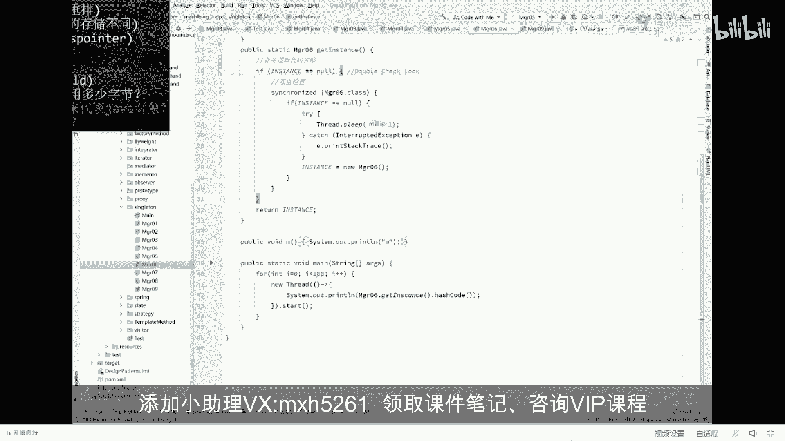
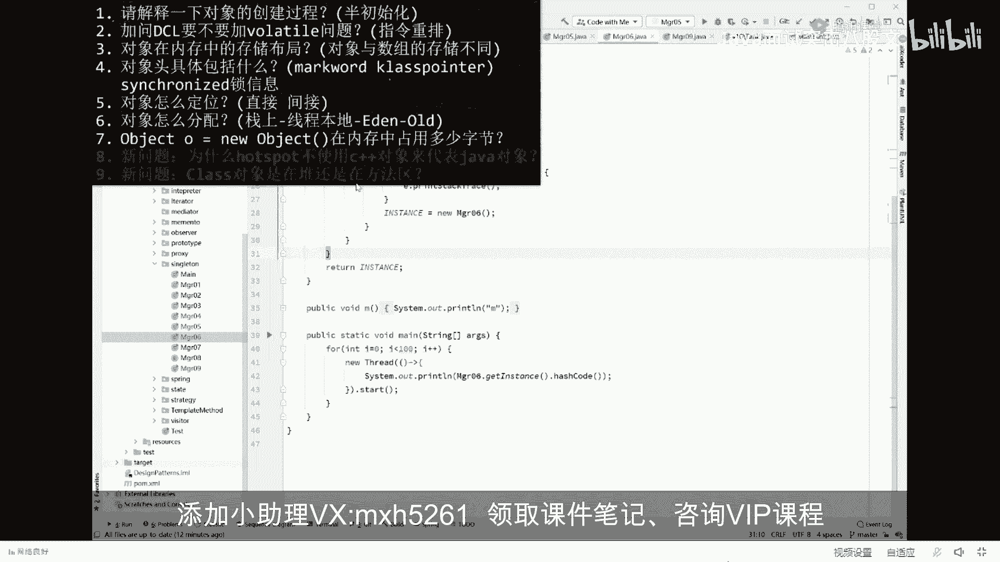
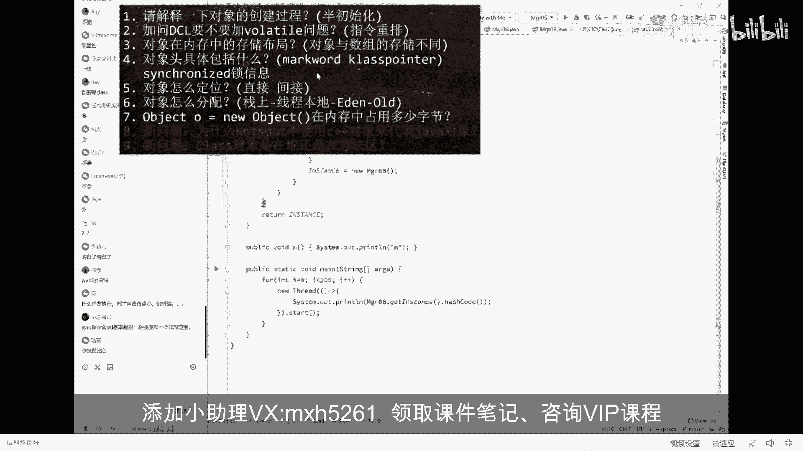
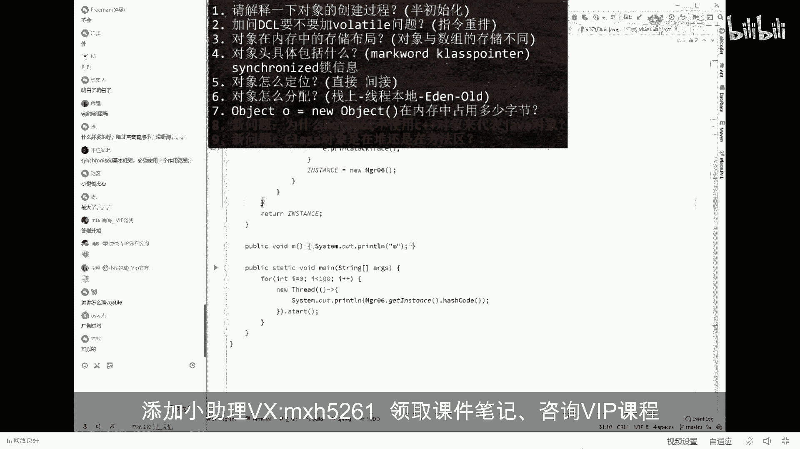
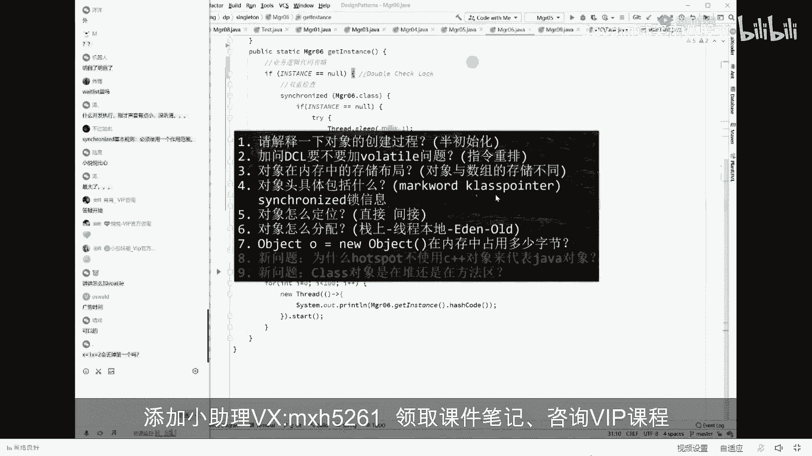
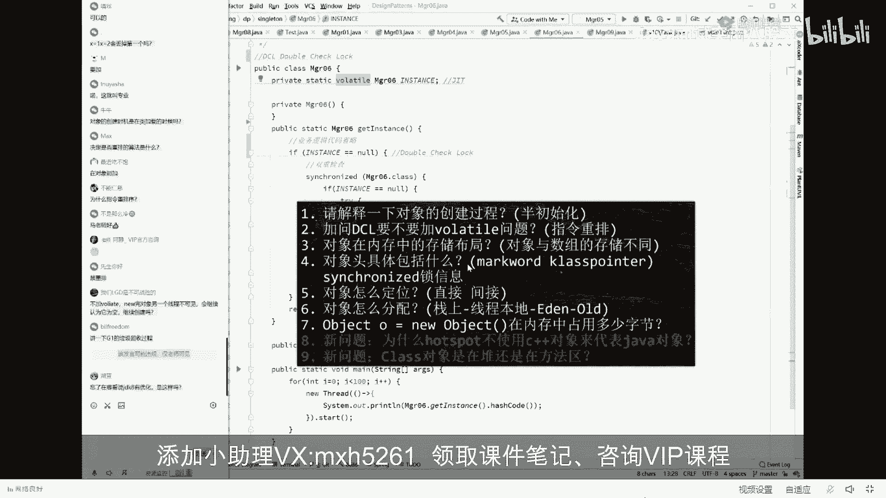
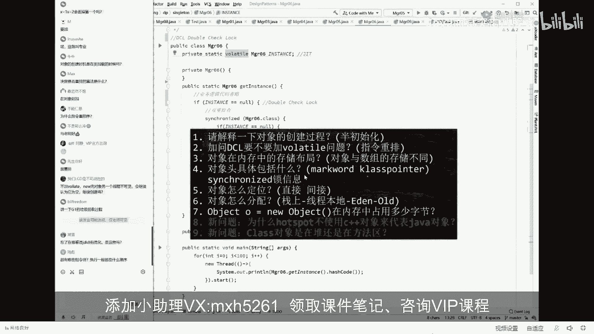
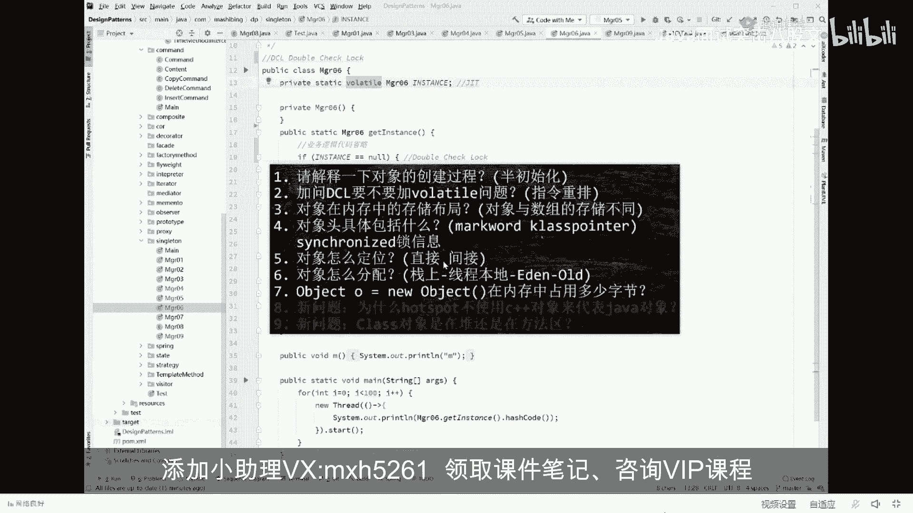
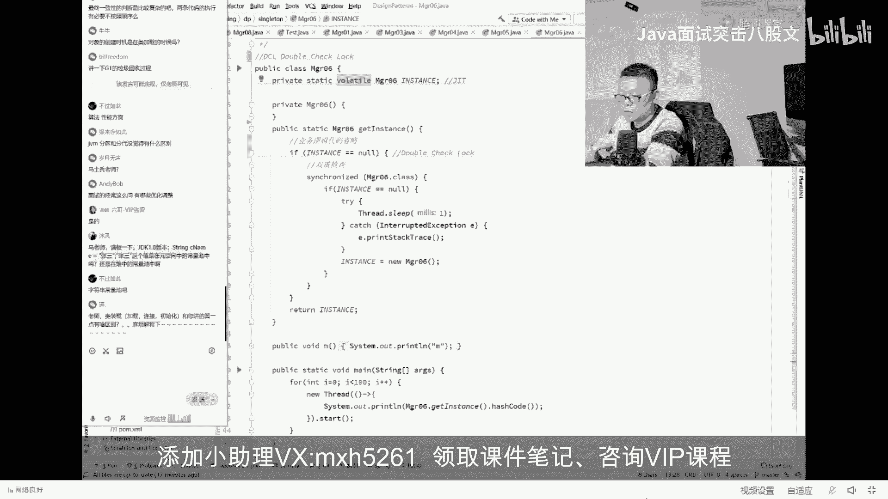

# 舍不得花27980买马士兵教育的MCA架构师课程？免费开源马士兵教育VIP课程 - P25：【JVM大厂面试真题】学员问题答疑 - 马士兵北京中心 - BV1VP411i7E4

约一内以外的概念。这个东西呢，我我VIP课上给大家做过实验的啊，绝对是能向大家证明这一点。好了。

现在已经是9点44，我说过我9点50会打广告。5分钟。当然还有两大问题啊，就是这两大问题也比较复杂。hosport为什么不使用C加加class到底是对还是方法区？我一会给大家讲这里面尤其是第二个问题。

尤其是第九个问题。呃，最近被问到的，你想答的很全呢，不容易。🤧嗯。

嗯。ok。5分钟我答一下刚才我这个问题的答疑，看看有没有。

明白了明白了是吧嗯。😊，什么病外之音，刚才声音有点小，没听清大哥，你把你的声音放大啊，其他人都能听清，你没听清，把你的那边的声音放大好不好嗯。😊，小月月，笔先对。最大了，因为我这边一放大它会有杂音。

你知道吧？我给你增议一下啊试试。5分钟答疑，刚才我提的我讲的这些有疑问的地方，你随便问你把老师问到了，老师这课就可以送你了。任何问题，关于JVF呢，您老人家随便问。好，讲讲怎么叫？猫了头。

我刚才故意略过这个，结果呢你非得。非得把让老师把这个事给你调出来是吧，听我说要不要加包了条，必须要加。

vololaile什么概念啊？就是你你在。

double check里面。double check里面你要定义这个。呃呃呃，这个这个代理对象的时候，必须要加volleile。为什么要加vol了条？原因是V了条能保障你两方面的作用。

第一个呢叫保持县城之间的可见性。第二个呢，叫禁止指令重排序，能听懂吗？叫禁止重排序。就是您老人家那两条指令，不就是刚才换了顺序的问题吗？产生了问题。没关系啊，我可以给你禁掉，叫禁止重排序。

所以必须要加va。当然。我老怎么是禁止怎么禁止的？😡。

这个东西要讲到内存屏障。今天的时间肯定是讲不完的嗯。

完了在哪看说这里可吧有优化，有什么优化。都有哪些指令，执现在一般什么顺序指令。java大概是200多条。执行的什么顺序，一共有8条规则，叫不可以冒犯这8条规则。只要不犯这8条规则，其他指令随便排序。

这8条规则我就不给你背了，但是这东西你不需要背过，因为它也比较简单。比方说你扭出县城来之后才能执行。像这种规则，类似于这种的，能听懂吗？你放心，这8条规则里面从来没有哪一条规定说我拗了一半的对象。

不能复值。所以刚才我讲的质量重白序是完全没问题。X等一X等2会丢掉第一个吗？什么叫丢掉第一个呀？你说说啊，你X等于一X等2肯定会留掉第一个呀嗯。😊，对，这条规则叫8条happens before原则。

如果有兴趣，可以百度一下。或者找咱们VIP。听老师给你讲。为了给你们讲这个课，我可以这么跟你说。为了给你讲这么这个课嗯。基本上我市面上所有关于JVM的书啊。

以及包括JVM虚拟机规范这种这种基本上那个不是写JVM的人都不读的人，全部跟你讲，全全部读完。

所以关于这VM您老人家随便了，我给你讲的这MM课呢叫做总结了十几本书，外加上各种问题，外加上这M虚拟机规范给你总结出来的嗯。这地可以不针对这外面体系优化，那多了太多了，这没法说了，就优化太多。😊。

因为你们这个优化什么叫JVM优化呀？😡，你看你这问的这个问题吧，你说的那个为了中国人民呃过上那个美好的日子，这个我我我我们党我们国家做了哪些优化，你说这玩意儿怎么跟你说？😊，听我说有哪些优化。

有些优化是需要你自己做的元旦老人。什么叫做JVM调优，能不能理解？JVM调优这件事就是JVM里面。有好多参数你需要进行调整，调整到你GVM的自由状态。JVM的条有呃这个参数有700。多个参数。

GVM参数本身有700多个常见的调优的大概是有五六十个左右，50到60个。需要你进行组合使用才能调优。我要给你讲这玩意儿，你说我能给你讲完吗？起码今天讲完。面试的时候经程这么那些优化调整。你问他具体的。

你说哪方面的？你比如说执行层面的，他有那种JIT。是吧。就是那个及及及及时编译，他有呃这种C one级别的优化和C two级别的优化。D个128版本木封。你问的这个问题是。嗯。

那个谁的第九题，美团的这个第九题哦，还不太一样，但是也差差不了太多。你问的这个问题，基本上是每年的第九题，就是class项是对岸的方法区，实际上本质上跟你这有点类似啊。最终一致性判定比较复杂。

对他变异器的优化。这是在。