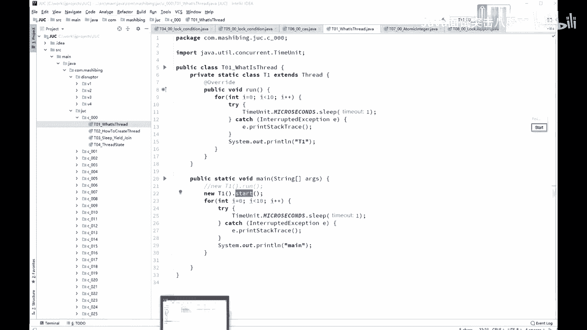
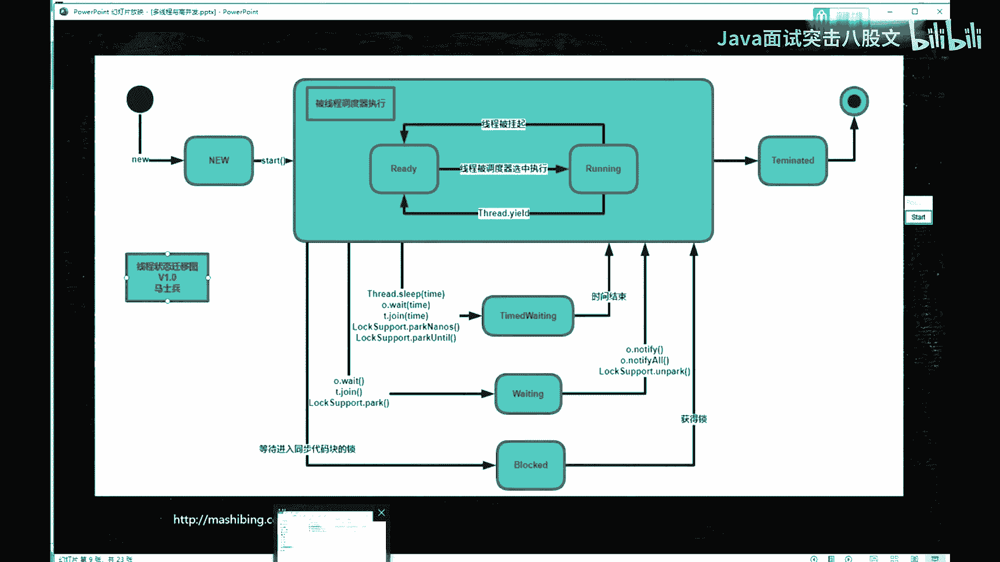
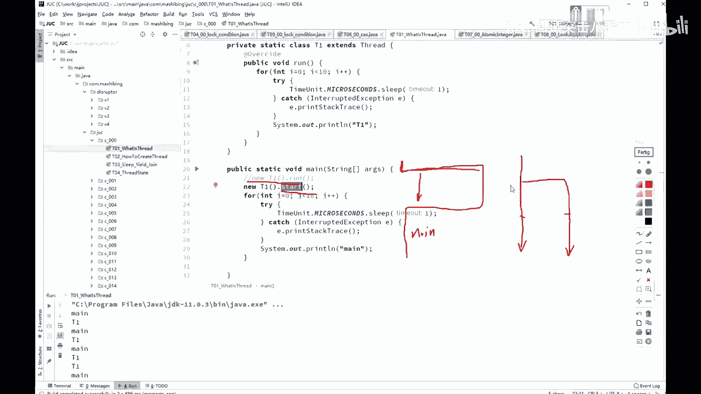

# 舍不得花27980买马士兵教育的MCA架构师课程？免费开源马士兵教育VIP课程 - P29：【多线程与高并发】线程的概念 - 马士兵北京中心 - BV1VP411i7E4

你脚多线能高病发啊。内容上我就唯一重复了，刚才跟大家说过了。嗯。😊，呃，我先说一下为什么要讲这个多线流和高并发呃，原因是什么呢？原因是现在啊呃如果你想拿到一个比较高的薪水。

在面试的时候呈现了两个方向的现象啊。第一个呢叫上天，第二个呢是入地。那么入地的这部分呢相当于就是那个很多特别基础的内容就越问越基础。上天这部分呢高并发缓存大流量。是这部分的内容。今天我要讲的现场呢。

实际上是入地这部分内容啊，土行孙这部分的内容。我们那先讲，第一个就是我们先从那个什么是县城开始给大家复习，这个是给大家稍微复习一下啊。呃，不知道有多少同学是嗯基础不太好，说什么是现程都不知道的。

不知道有没有。如果确实有的话，听我说这么内容我花的时间肯定不会太长。呃，老师的那门基础的课啊就是。特别特别呃老的那个视频里头那个讲的基础的课程。如果你现成的概念不清楚的。

先去那个课里头找到现成那一章是第十1章。先把那部分内容看完，看完，你才能听得懂后面的课。找，不知道说清楚没有啊，同学们。那个王明天涯说老视频不是很清晰，这个没办法，他是好多年前录制的。呃。

那会儿那个屏幕最大的分辨率还抵不上现在的4分之1呢。所以这个是没有没有办法的事情啊。不过在代码应该是大致能看清楚的，我看过嗯。那么今天呢我先从到底什么样是一个。现程啊来开始给大家复习。什么是县程？

有这么几个概念啊，第一个呢是什么是进程？什么是程序？什么是进程？什么是县程？什么是县程是吧？这几个概念呢。

嗯。

想想啊，我是在哪块儿给大家讲的这。嗯。Yeah。有这么几个基本的概念啊。第一个呢，什么是呃一个进程，什么是一个县城，什么是一个携程，或者叫什么是一个县程。那，这个我们后面还会讲，这个不多说。呃。

什么叫一个进程？什么叫一个现程？做一个简单的解释，你的硬盘上有一个程序。这个程序是什么呢？叫QQ点EXE这是一个程序，好吧，叫它program。好，这个程序是一个静态的概念，就是它扔在硬盘上，没事。

是也没人理它。但是当你双击它哎，嘣儿，它就弹出一界面来。然后你输入你的号码密码，你就进去了。OK这个时候呢叫做一个进程，就是它起来之后，一个程序运行起来之后叫一个进程。所进程呢相当相对于程序来说。

它是个动态的概念。这个意思。呃，作为一个进程里边最小的一个执行单元。其实呢它就叫一个现成这块呢。估计有的同学如果基础差，可能听不太明白。我在这儿呢给大家做一个小小的演示，看这里啊。

怎么样子才能起一个现程。现成启动的方式呢，我一会儿再讲啊，我们现在呢。先定义一下呢，到底什么是现成。呃，定义了一个class，这class呢从哪个类继成呢？从thread这个类继承。好。

重写它的run方法已经重写完了。在这里面我要想调这个run方法，有两种方式认真看。那么第一种呢是new three new T一点run，我就直接掉了。在闷方法里面，我掉的妞体一点run。

在这里面呢它会输出T一。然后。在我的ma方法里调完了T一的入方法之后呢，又会不断的输出T2。sorry不是T2，而是ma。运行一下。Okay。跑一下看看啊。嗯。好，结果你会看到是吧？

T一先输出T一后输出妹。好，这种方式叫做方法调用。你直接用了个提议这个对象，然后调了它的re方法，先执行re方法完了之后马上执行后面的输出 main的内容。但是呢你想运行这个run。

还有一种方式就是new T一点star。为什么它用start的方法？是因为thread这个类里面有start的方法。连体一star，然后与此同时，ma方法开始运行。输出的结果。你们看到呢和原来大不一样。

是ma和T一交替输出。原因是什么呢？当你调t的方法的时候，从这个地方会产生一个分支，这个分支会和我的主程序一块运行。如果用图来表示的话。润方法的调用相当于呢。ma方法开始，然后b跑到run方法那执行。

执行完了之后再回来继续ma方法执行。所以它先输出T一，然后再输出main说来说去在你的程序里头呢，只有一条执行路径。但是如果当我们调star的时候，好，到这儿了，到start这了。ma方法继续运行。

与此同时。run方法同时运行。OK这个呢就叫做不同的线程，同时运行。好了，所以现成的概念用一个最简单的啊，不用那个书上书本上那些刻板的那那那些数语来定义的话，非常简单。一个程序里不同的执行路径。

就叫做一个现程。