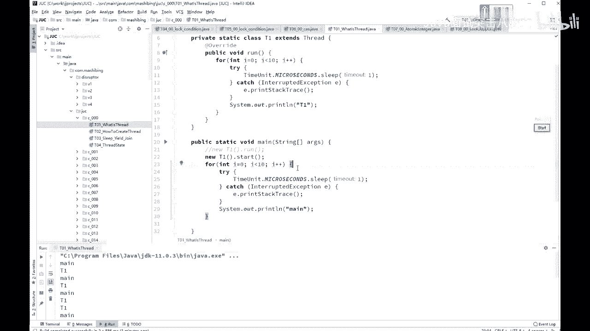
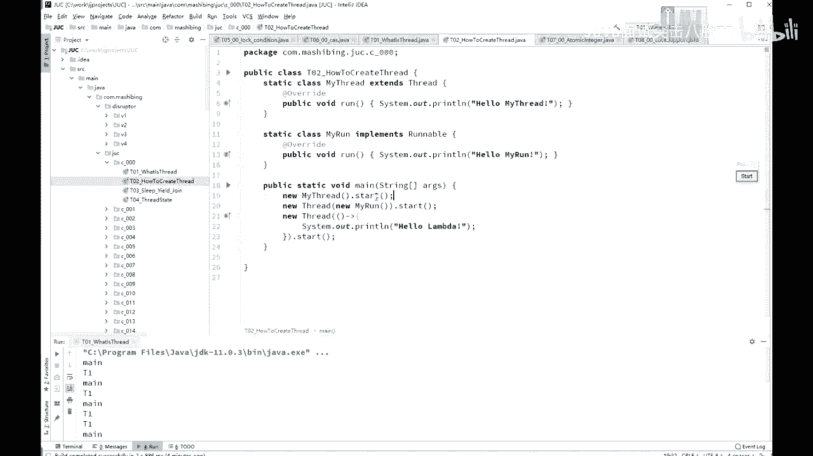
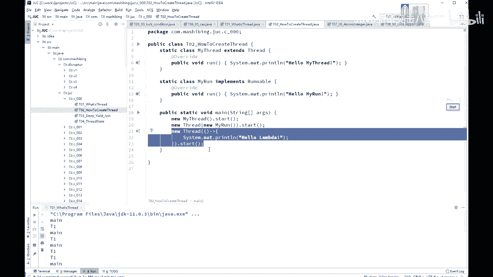
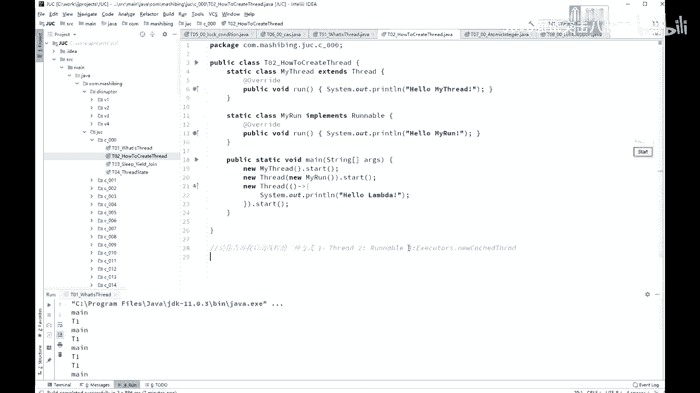

# 系列 4：P30：【多线程与高并发】线程的启动方式 - 马士兵北京中心 - BV1VP411i7E4

很多时候呢我们呃作为真正使用这些概念的人啊，不需要把概念说用特别文绉绉的方式表述表述出来。因为编程呢是一个工程学科，你能理解能用通俗的语言表示出来就很不错就可以了。

啊，这是现成的一个基本的概念。我们来看这个县城的怎么样来创建一个县城，怎么样来运行一个县城。创建一个县城的两种方式啊。这个我在原来老的课程里头也讲过，在这呢也是带大家复习。创建现成的两种方式啊。

第一种呢是从thread类继承。class my thread extends thread从th类集成。第二种呢是。你资料集成之后重写re案方法。好，第二种呢是。你定义一个类去实现reable接口。

依然重写run方法。但是如果你用第二种想让这个线程运行起来的时候，必须new thread，然后呢把我的实现reable接口的这个类的对象传进来，然后再调用start。如果你是从th类继承的。

那么你直接调用start就可以。需要注意的是一定是调用start，而不是调用run。

那还有第三种，其实第三种呢也是第二种的一种变形。JDK8之后呢，有一个lamb的表达式。

第三种就是使用lambda表达式的方式，newstr括号啊箭头，然后呃里边怎么写是吧？Systematic， printline， hello lambmbda。给大家20秒钟时间。

看着小程序能不能看懂，有没有什么地方有疑问的。因为我默认的你是了解过现成这概念的哈。好，那么在这儿呢，我突然想起到面试题了，我突然想起来了啊。呃，有的我记得有一个。同学出去面试的时候被问到我说呃，请你。

告诉我。启动现成的三种方式。而且你告诉我几种现能的三种方式。呃，需要大家注意的是呢，这三种方式并不是这三种，而是说第一种是从。thight继承。第二种实现reundable接口。好，第三种是什么呢？

第三种呢是通过现程池来启动啊。一呃 exit。呃，exe。Executors。通过这个new catch的。thhread嗯。you catch the thread啊。然后拿到一个线程值之后。

然后再去通过线程池来启动一个线程。这是他想要的第三种。但其实啊在这个现成池里头起现成的时候，也是用的这两种之一。呃，因此呢他说用三种方式来启动，有点儿有点吹毛求疵的意思。所以你值得理解这个意思就行了。

如果有人问你这方面的东西，你说你说第一个thread，第二个readable，这肯定没问题。好，那第三个呢，你要说leer表达式，如果他不满意，不满意，你就告诉他啊。

线程池通过线程池里头也可以起一个新的线程。

