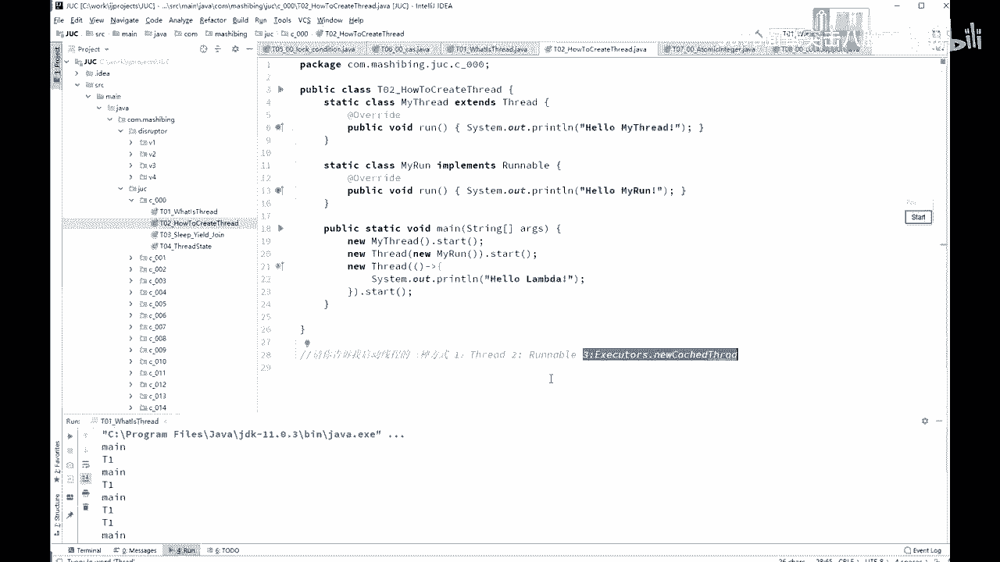
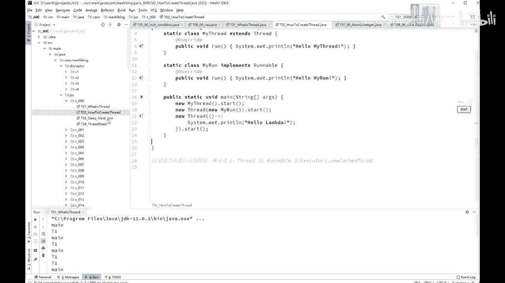
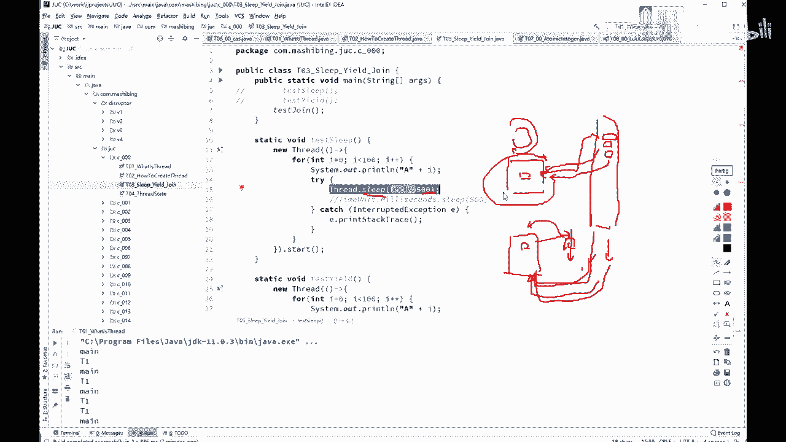
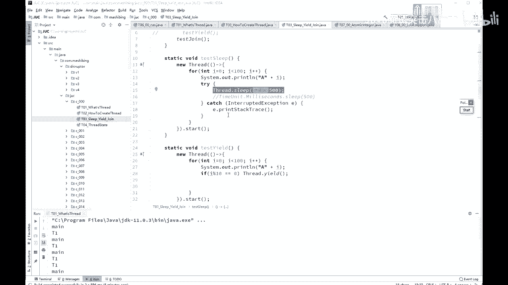
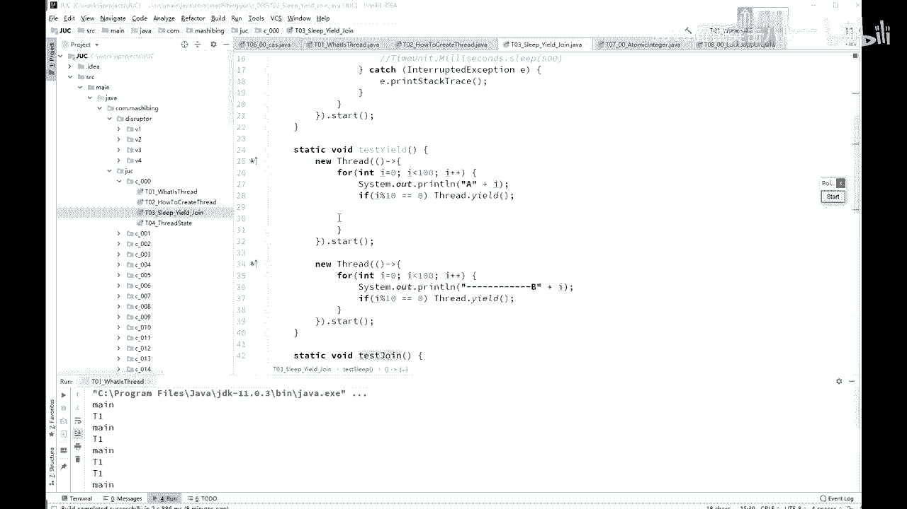
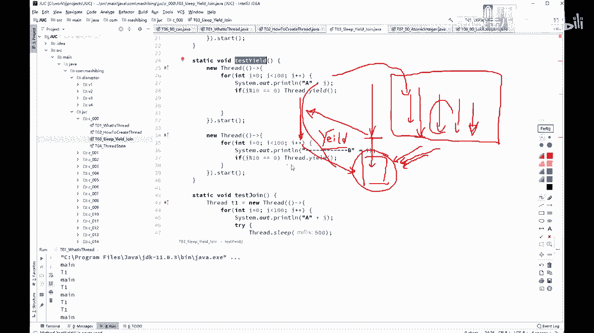
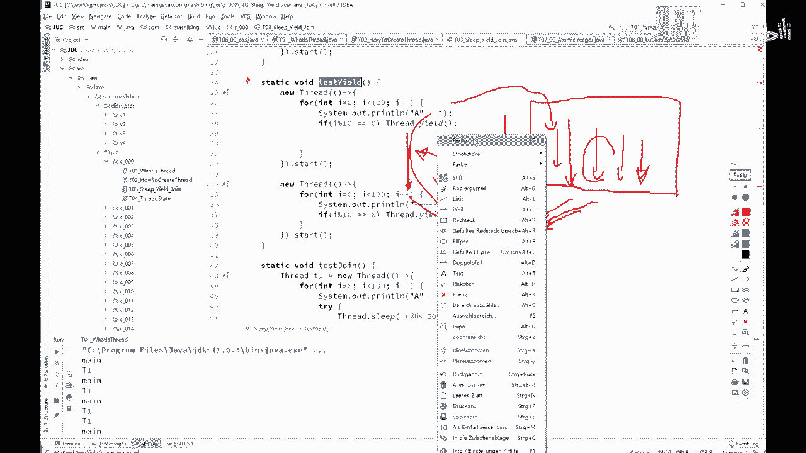
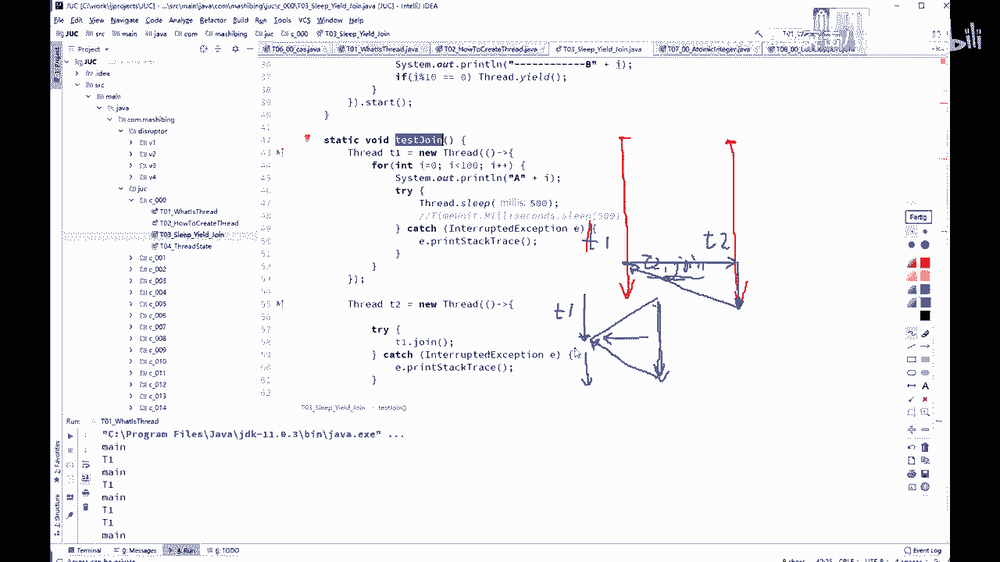

# 舍不得花27980买马士兵教育的MCA架构师课程？免费开源马士兵教育VIP课程 - P31：【多线程与高并发】线程的3个方法 - 马士兵北京中心 - BV1VP411i7E4

可以起一个新的建程。

OK这是现成的最基本的概念。好。Yeah。呃。

我们来认识几个现成的最基本的方法。那么第一个方法呢叫sep。sleep就是睡眠，所以睡眠的意思，当前现程暂停一段时间让给别的县城去运行。啊，是这个意思。好，那既然讲到这儿的话。

这个睡眠让给别的县城到底是什么概念？如果从操系统的角度来讲的话，这是我们的CPU。CPU啊是一个特别土的特别土的这么一个元件。这个原件呢在它的概念里头是没有现成这概念的。他只知道干嘛呢？

就是他就是不断的一个死循环。这个循环啊就是从那个。内存里头把指令拿过来运行，拿下一条指令运行，再拿下一条指令运行，一直就这么不停的循环，不停的循环，不停的循环，没有指令了，歇着就这意思。

所以就实对CPU来说，没有现成这个概念。呃，但是我们这多线程的是什么意思呢？其实呢是有好多不同的线程。每个人在如果只有1个CPU的话，那么每个人呢就在这CPU上执行一会儿。每个人在CPU上执行一会儿。

直接一会之后，都是你把你扔出去，把第二个线称再拿进来。然后呢，不儿再把第三个线程哎拿进来，把第二个线程扔出去，是这么一个概念。而这个sleve的概念是什么呢？

就是说这个线程麻烦你啊跟我这儿睡500个毫秒。然后在500毫秒之内，你唉别人别的县程可以去运行。

让给别的县城去运行，是这个意思啊，t sleep。那代码我就不跑了，太简单啊。

好，第二个呢叫e业的意思是非常谦让的退出一下。

这个代码呢我就不演示了，你们如果有没有同学对业务的有疑问的，如果有疑问，一会儿一一会儿一会儿找我问啊，我先讲。好，E是什么意思呢？比方说我一个线程在运行，另外一个线程也在运行。

然后当前这个线程在CPU上运行呢，运行到某个程度的时候，它掉了个已有的方法。那业务的方法意思是哎，哥们，我先退出一下，我从CPU上先离开。离开之后呢。别的县城是有机会在这执行的。当然我离开了之后。

如果说别的前程没执行，我还可能继续回来继续执行。所有的离开就是进入到一个等待队列里头。等着干嘛呢？哎，我从本来我正在上面运行呢，结果呢我又的一下右的一下就是哎，不我又回到等待队列里。回到等待队列里。

在操作系统的这个调度算法里头呢，还是依然有可能把你刚回去的这个线程拿回来继续执行。当然，更大的可能性是把原来等待那些拿出一个来执行。所以业务的意思本质上就是我让出一下CPU。

至于后面你们能你们能不能抢到，不好意思，那我不管。嗯。好，这是业的意思嗯。折接据说返回就绪状态，没错，就是返回到就绪状态去。

Yes。

那第三个呢叫join。joman的意思画还是画图啊。如果这是我们第一个县程，这是第二个线程。O。这个重要的意思，如果这线程叫T，如如果这个线程呢叫T1啊，左边这线程叫T1，右边这个线程呢叫T2。

它调的过程呢，如果是在T1的某个点上掉了T2点jo，认真看。在某一个线城里掉你自己的点状元是没有任何意义的。掉了，如果是掉了T2点joinjoin的意思叫加入，那意思就是麻烦你跑到T2去运行。T一干嘛？

T一在这等着，什么时候T2运行完了。继续T一运行。所以join的意思就是哎，当我本来我这线程到这儿了，然后我调了个join，我就跑到另外一个线程去运行。运行完了之后，我第一个来运行。

所以相当于把这个线程给加入到了我当前线程里面。这要你常经常用来干嘛呢？经常用来等待另外一个现程的结束。T1完了之后调T2点joinT2点join的意思就是哎，我等T2结束了，我T1才继续运行。

咱以前有个面试题说，呃，我怎么才能保证另外一个县程运行T一运行这个T1T2T3，我起了三个线场，怎么才能保证这三个线程能够按顺序执行完？这个事太简单了，你运行完运行起来之后。你在那个。

主线程里先调用T一重，再调用T2重，再调T3重。就可以了。还有一种那个更加精确的方式呢，就是你T一里面调T2转，T2里面调T3转啊，保证是T3先完了，T3T2才能完T2完了T1才能完。

啊。