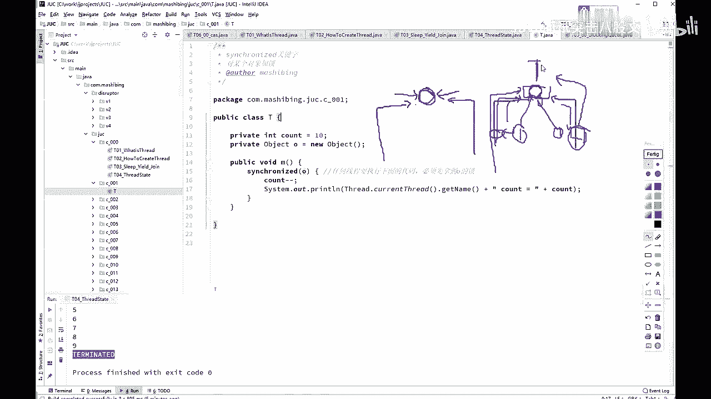
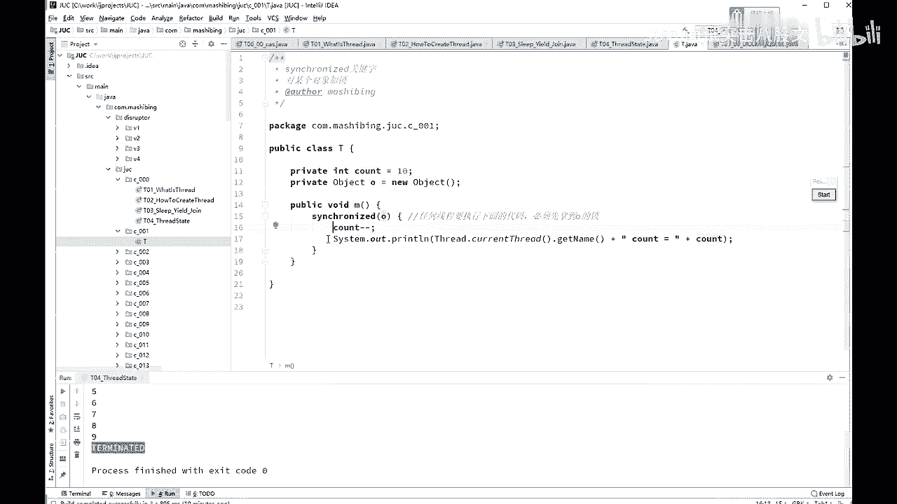
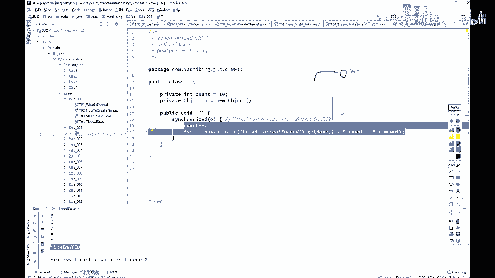
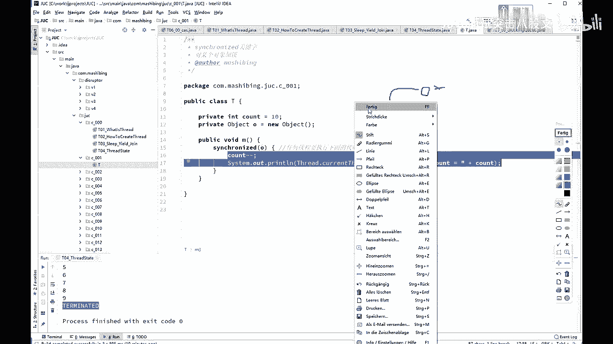
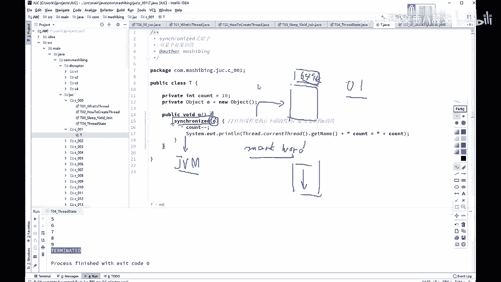
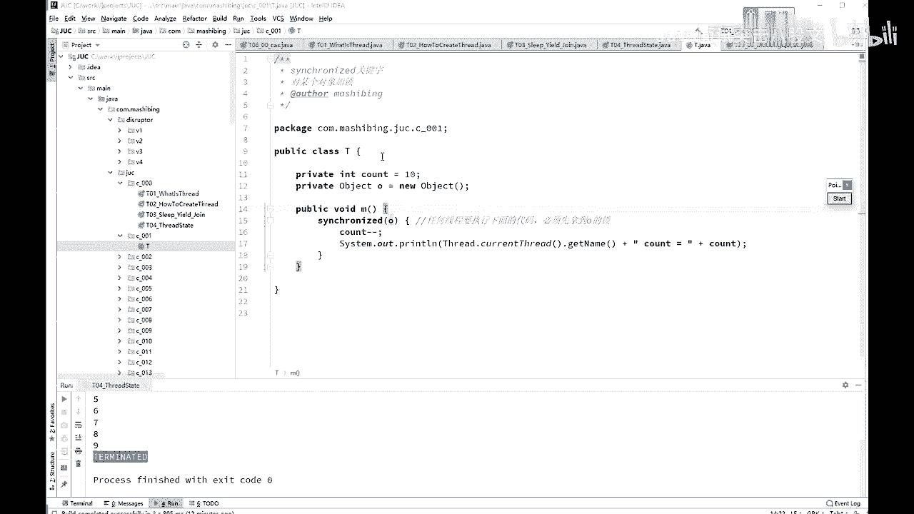

# 舍不得花27980买马士兵教育的MCA架构师课程？免费开源马士兵教育VIP课程 - P33：【多线程与高并发】锁的概念 - 马士兵北京中心 - BV1VP411i7E4

呃，下面呢我来开始讲这个schronous关键字。sch个schron关键字呢，我估计不少同学也是那个耳熟能详了。不过呢作为复习还是要复习一下，好吧。好，第一个呢。是多个县城去访问同一个资源的时候。

需要对这个资源上锁。啊，为什么要上锁？这个概念有没有同学不能理解呢啊，为什么要上锁，必须得上锁？这是一马桶，很多县城过来去访问，必须得等一个县城执行完了，另外一个县程才能执行啊，不然的话呢。

不然的话你自己去想象是吧嗯。O。😊，啊。呃，就是访问某一段代码或者某一个临界资源临界区的时候啊，这个时候呢是需要有一把锁的概念在这儿的。这个锁的概念呢，我估计有的同学可能又会跑高问点。没关系啊。

咱们使劲问啊，我看看我哪哪有问题没给大家准备到位的。什么意思呢？😊，为什么要上锁呢？其实关于为什么要上锁这个概念。估计多少同学也是知道的啊，就举一个最简单的例子呢，我们用一个对一个数字来做递增啊。

这个数字最开始是0两个程序对它一块来做递增。这个递增的就是把这个零的往上加一了。第一个线程，如果两个线程共同访问的时候。第一个线程一读它是零，然后把它加一。

在在这自己这个线程里面的内部的内存里面算算算算啊，0比加个一变成几啊，变成一。然后这个一还没有写回去的时候，另外一个线程来了，一读还是0。读到自己的。内存里面加了个一变成一了。好。

第一个线程把这一写回去了，第二个线程又把这一写回去了。本来正常加了两次，结果呢你最后的结果只得到了一个一。所以。在对这个线程对这个数字进行递增的过程之中，必须呢得上把锁上把所怎么上呢？

就是说我这个线程在对这个数字进行访问的时候。是独占的，不允许别的县程来访问，不允许别的县程来对它进行计算。我必须得给他加完这个一之后，下面这个线线程才能够去拿到这个一之后继续加。

Okay。但是在这儿呢有一个特别特别容易让人。呃，有一个误区吧，应该说而且呢很多的很多的文章里头啊，还有很多老师讲的时候啊，他他就一带而过。我，在这儿呢，我把这个think的。

Synchronized啊。给大家画个图。Yeah。这个think到底think的是什么？呃，我拿我刚才说的这个概念。就这有一个数字一，然后呢两个线程去访问它。那么有有的老师呢就会聊说那个这个呀就是。

这是第一个现程啊，呃这是第二个现程。有的老师六位聊说，这个呢就是把把把这个进行锁定，把它进行锁定。听我说啊。把他进行锁定这件事是不对的，是我们是有一把锁。在这儿呢是有一把锁的。画一下，看能不能画出来。

诶。😊，可以。对也太不想说了。像个狐，好吧，我不管啊。好，我们其实是有一把锁的。听我说，但是这把锁就是说我我我任何的现场去访问这个对象的时候，或者说去访问这个数字的时候，是必须得看这把锁是不是属于我。

是不是由我占有。😊，如果有我占有，我才去对他进行操作。如果不由我占有，我不再进行操作。而这把锁在内部底层上是怎么实现的呢？有的老师会说啊，直接就把这个数字进行锁定，千万别这么谈。

实际上在本质上它并不是对这个数字进行锁定的。它对谁进行锁定了呢？你可以任意指定对谁进行锁定，你想锁谁就锁谁。看这里我的第一个角正易是这么写的。countt等于10，然后让count减减。好。

如果说你想上了把锁之后，才允许对count简减进行访问。比就说我得上把锁才允许执行下面这段代码。那这个时候是怎么做的？你可以new一个object，object O等于new一个object。

然后写schronized的O，这意思就是说对这个countt进行访问的时候，我得去看O这把锁。所以这里锁锁的是谁，锁的是O。但是我们平时也说锁定了一段代码，锁定一段代码的意思是说。

当我拿到这把锁之后才能执行这段代码。

所以要说的比较细致，比较到位的话，应该是这里有一把锁，这个锁是谁呢？是OO这个对象。但是拿到这保所之后能干嘛呢？能执行这段代码。

如果说讲的更加底层一点，我原来讲过一堂公开课。这堂公开课呢叫hsh code与mark word。好，在那条公开课里呢，我讲过这个schronize在底层是怎么实现的呢？其实schronized呢。

在底层的实现没有任何要求，就是java虚拟机规范里头没有规范说 synchronize，你必须得给我怎么实现。不是，他没有任何要求，反正最后的结果不论你怎么实现呢，你只要说必须得加了里把锁之后。

才能执行身份证的代码就OK了。那么hoport是怎么实现呢？hoport是在。一个对象的头上面。这是我们尿在堆里面的一个对象。这个对象的头上面。这个对像头呢是64位。

这个头上面呢有拿出两位来来记录着这个对象是不是被锁定了。是这个它是这么来实现的啊，这个呢叫mark word。感兴趣同学去找一下，看他怎么实现的。他是有两位啊。

两位来实现这两位的组合呢分别是不同的锁的类型。Yeah。好，呃，这是它的具具体的底层的实现。但是呢是需要拿到这把锁之后呢，才去看唉。下面这段代码我能不能运行？所以。锁定。是锁定的某个对象。

不管是哪个对象，你锁定它就行了。那么新能兰这把锁呢呃而且它会有一个所升级的概念，我们一会儿再说。

