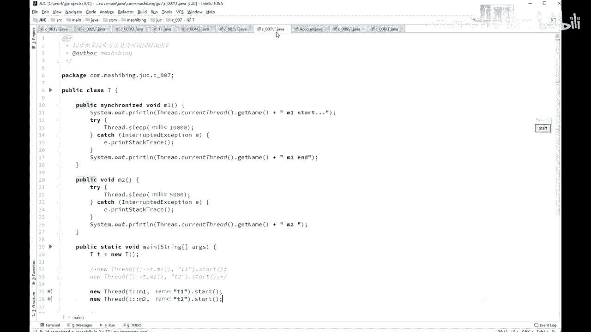
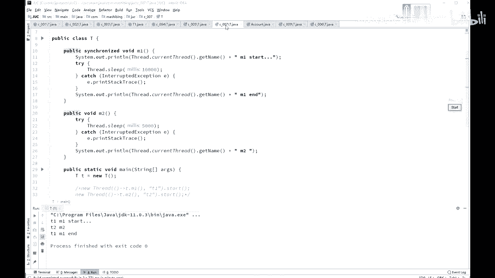

# 舍不得花27980买马士兵教育的MCA架构师课程？免费开源马士兵教育VIP课程 - P35：【多线程与高并发】设计小程序验证锁的问题 - 马士兵北京中心 - BV1VP411i7E4

好，同学们，我们继续啊。嗯，后面代码呢这前面几个几个小代码也不能我讲的速度呢稍微快一些啊，看这里。呃，我们来分析一下这个小程序，它的输出有没有什么问题。sorry，我这个。啊，是这个啊005。

这小容易的输出。你仔细读一下。Yeah。看着小程序的输出有没有什么问题啊。又有一个thread是吧，然后呢start start呢让count呢不停的剪减。嗯。😊，🤧嗯。Yeah。好。

这小程序的主要的问题在哪呢？主要问题呢有两个，刚才那个我看有同学说没有写vollettail。对。嗯。这是一个啊。呃，但是。严格来讲呢，这个小程序呢其实跟那个what time没有太大关系。

就是另外一个呢，他有可能呃读不到别的线程已经改过的内容，这是很有可能的。除了这一点之外呢，其实它本身还有问题，问题在哪呢？就是这个count减完了之后呢。

下面这个count的输出和你count的减完之后的结果不对，这很容易分析。如果有一个线程从十把它减到9了。然后另外一个线程在第一个这前面的线程还没输出呢，另外一个线程进来了，把九又减到了8。

前面这线能继续输出。就把这个。八给输出出来了是吧，它输出的那个不是不是不是9啊。所以他呃这个呢是有。这样的一些个毛病。那么如果你想修正它的话，你第一个呢是上面加volla条，这边改了之后。

另外一个呢马上得到。除了这个之外呢，其实最关键的呢你还是要在。这里加schronized是吧？这成语比较简单啊，我就不多说了，加schronized。呃，那么我问大家一句。

加了schronized我还用加volat吗？当然现在还没有讲vollatile，所以我简单提一句啊，加了schronized就没有必要加voltile了啊，为什么呢？

因为schronized既保证了原子性，又保证了可见性。好，我们讲volattile的时候再说。嗯，就是这个小程序啊，来看第七个。C007里面的这个小程序。呃，这也是会被有有可能会被问到的。

就是说同步方法和非同步方法是否可以同时调用。哎，什么意思呢？就是我有一方法看见了吗？M1。Synchronized。我调点M1的时候，能不能调M2？可以吗？这个可以不可以，你拿大腿想想，其实就能想出来。

你都不用不用试。这肯定可以啊，必须得可以啊。你本来这个。现城里面。访问访问M1的时候呢，需要加个锁，可是访问M2的时候，我又不需要加锁。所以你还不不让不允许我这行M2啊。😡。

所以问这问题的人脑子都进水了，是吧？开玩笑啊。你本来在这儿。正在运行。啊，你往这一坐，正在运行是吧？你是得上厕所？前面得把这门锁上，这是必须的。可是人家有别的方法，哎，别的方法是什么呢？

人家后面有一擦马桶的，那擦马桶的不需要这把锁，直接就可以擦。是不是？所以你运行这是M1啊，运行你自己的手，这是M1。人家参考桶这事是M2，M2不需要加这把锁，在你运行的时候。

人家直接就可以在后面参考桶啊，没问题。当然呃讲到这儿呢，听我说啊，有很多的那个呃原理性的东西啊，就原理性的东西。还有一些细节上的那些状态的迁移等等。关于这些东西呢，你如果能够写程序去模拟，让它显示出来。

这是一个很好的能力。呃，所以很多时候呢你要去想办法去做这方向的，做这方面的模拟，你能把这个模拟的程序想象出来怎么写，对你也是一个很好的锻炼。所以以后呢有什么别人给你讲的什么的知识。

你都想要想办法呢去写程序模拟它一下，好吧。

只要能模拟出来那，就是一个很好的锻炼啊。😊，呃，不然的话，你只能说老师告诉你是什么，你就认为是什么，你是没有办法做实验去验证它的。嗯，我想那小程序去验证它。这小程序呢。M一是加锁的方法。

然后在加锁的方法里边，MEstar ME end。呃，中间睡了是1万毫秒，然后M2呢是睡了5000毫秒，输出来了1个M2。那么大家你可以想一下，如果说我对M1加了锁之后。它不允许M2执行的话。

那它必须得肯定是M1结束了之后才会显示这M2。如果中间显出来了，那就说明肯定是允许M2执行的。是不是啊同友们。所以我是这么来设计这个小实验的啊。这小时间的设计也比较考验公利的同学们。

所以你们我告诉你们的任何的这种。这种多线程的或者是这个虚拟机的等等各方面的这些个理论上的东西之后呢，你要自己去想办法去写程序去实验它。呃，你比如说我我我说那个你一恋区。对象满了之后呢，它就会产生YDC。

那我怎么去验证它，你得写程序能去验证它，好吧，这其实是比较有功力的。好解这两个小程序啊，你用str T一执行M1。T2M2。运行一点。看结果。T1M1star是吧，你看M2出来了。接下来M一才结束。

说明什么？当然允许人家在后面擦马桶。

啊，这个小程序有没有同学有疑问的？嗯。

有问题是吧？好，继续啊。😊。

好，如果没问题，我们继续。嗯。😊，我们再来看一个schronized的应用的例子啊。这是某拟个银行账户，对业务方法的加锁，对业务写方法加锁读方法加锁行不行？什么意思呢？看这里。

我这里定义了一个class叫account账户，账户有一名称，有一个余额balance name和balance。写方法set给哪个用户。设他多少余额啊。

that their name the name theirbal balance。读方法gebalance通过这个名字去得到这个balance的值。方法呢都相当简单。那好，如果我们给写方法加锁。

给读方法不加锁。会不会有问题？其实这个呢。嗯。😊，好，这个过程呢其实呃。不能说它有没有问题，而是说你的业务呀容允不允许你产生这种问题。如果你的业务说呃我中间读到了那些不太好的数据也没关系。好。

那这个时候呢其实也就没问题啊，如果说你不允许客户读到那个中间的不好的数据，那这个就有问题。正因为呢。我们加了锁的方法和没有解锁的方法是可以同时运行的。同时运行的是什么概念呢？就是说如果有个人啊。

你比方说张三儿，哎，你给他设了100块钱启动了是吧？然后睡了一个毫秒之后呢嗯。去读它的值啊，然后再睡一个2秒钟之后，又又读它的值，这个我需望。要做这个实验的话呢，需要把中间打开啊。set的时候呢。

先设好它名字，然后两秒钟之后再设它的值。嗯。我。才能模拟到这个效果啊。实验一下。就问题呢肯定会有你会你会看到你读到的呢，你本来设的是100，但是你读到了呢是一个0。呃，得到零的原因是什么呢？

是因为呢你那个在设定的过程之中，这点name完了之后呢，你中间睡了一下。然后在中间这个过程我模拟了有一个线程，在这个时候来读。这时候来读的时候调的是get balance方法。

而调这方法的时候是不需要加锁的。所以呢我不需要等你整个过程执行完，我就可以来读到你中间结果产生的内容。那么这个呢现象呢叫做脏读，叫dirty read，叫脏读。如果你想解决这个问题。

这个问题的产生就在于schronize方法和faceschronize方法是可以同时运行的。想解决这个问题怎么办？简单你就把get balance也加上schronized。就可以了。啊。

关于这个小程序，看有没有同学有疑问的。当然我再说，我再强调一下啊，如果你的业务逻辑允许增读，臧读没问题啊，读到中间结果啊，没有关系，我读完了之后，反正我也不做任何重要的业务逻辑，我就读一下，就就O了。

也可以，也没问题，你就不用加锁，能不加锁就不加锁。加完锁之后的效率低100倍，好吧。所以能不加锁就不要加锁。业务逻辑允许不加锁，那就别加。如果不允许就加上schronize。呃。

这个小实验我你们你们下去去复习的时候啊，记住呃。

看着这个面试题来写，你不要看着我的代码来写。你们那个做这个面试做这个题的时候呢，不要拿我的代码在旁边跟这这么来做参考，而自己想象着自己手动的把它写出来。因为你去面试的时候，不可能说你旁边有代码啊。

记住这点就成。

