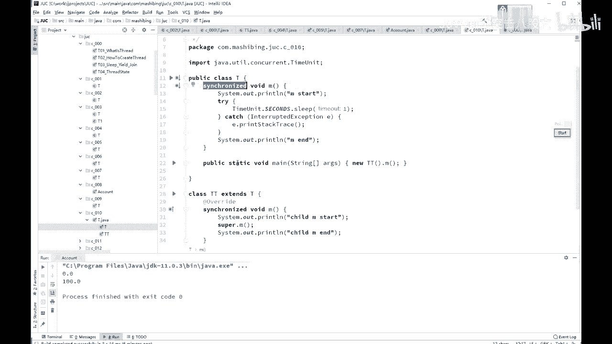

# 舍不得花27980买马士兵教育的MCA架构师课程？免费开源马士兵教育VIP课程 - P36：【多线程与高并发】锁的可重入属性 - 马士兵北京中心 - BV1VP411i7E4

下面我们来看schronize的等等另外的一个属性。呃，这个属性是什么呢着？这个属性叫做可重入。这可重入也是 synchronize必须的个一一个概念啊，不然的话呢就没法使用它了。

simized叫可重入。可重入是什么概念呢？如果说一个同步方法调另外一个同步方法，有一个方法加了锁了。另外一个方法也需要加速，加的是同一把锁，也是同一个线程。那这个时候申请仍然会得到该对象的锁。

比就如说signronnet可重入的什么意思？

有一方法，M1它是 synchronized，有一方法，M2它也是 synchronized的M1里能不能调M2，可不可以？如果它不可重入会产生什么现象，你分析一下。Schronize。

我们M一开始的时候是这个线程得到了这把锁。然后在M1里面调M2。如果说这个时候不允许任何一个线程再来买这把锁的时候，就死锁了，这是不可能的。这时候如果再调M2的时候，他发现还是同一个县程。

因为你M2也需要申成这把锁，结果他发现调M2的时候呢，我需要申请这把锁的时候，发现哦，原来是同一个县程申成的这把锁，允许。可以，没问题，这就叫可重入锁。所以 synchronized的是可重入锁啊。

synchronized的必须是可重入锁。以前有个同学会被问到问到了面试的时候问到了这么一个问题。呃，simcherronize是可不可重入的，为什么？它必须是可重入锁，原因是什么呢？

你比方说你有一个负类。哦。Parent。它里面有个方法，M有一个子类child，它里面有个方法，M重写了它，但是呢它掉了super。点儿M。如果你上面是schronized的。

OK这里也是 synchronized。你说掉super点M，这个很正常啊，我调腹类的这个M方法。但是如果它不能够重入的话，你就直接父类父子类之间的这种继承就直接死锁了，这肯定不行。

好了。

这是sful可重入的概念。

嗯。好，看这里啊。

嗯，这个呢就是我刚才模拟的一个负类子类的概念，负类 synchronized是吧？子类你标用C点M的时候，必须得可重入。如果不可重入的话，那肯定出问题了。调付类还是同一把锁吗？必须的呀。

你看schronize是锁的谁啊，锁的this嘛，this就行。

这个signchronize也说的是this似对象目嗯。

还是同学要锁啊，估计有同学可能会在这儿有疑问说我这个schronized的到底锁的是副类的face对象还是子类类对象？我记得我原来画那个父子类的这个图的时候，你扭出来这个对象叫TP。

在它里面呢有两种方式啊，第一就就基本上就只有这这种实援方式吧，就是它有一个。他有一个那个那个呃parent的这个指针指向的是他的负类的对象。但是锁对象的时候，你想想看。你掉的这个方法。

symronized它锁的是谁，锁的是this，这个地是谁啊？这是他嘛。对吧。当你调跑到这个方法去调的时候，super点M它锁的还是叫this嘛？this次还是谁，还是他啊。

所以锁的是同一个对象啊。呃，所谓的重入锁就是那个你自己拿到这把锁之后，自己不停的加锁加锁加锁加锁加好几道，但是锁的还是同一个对象，还是你自己锁的。你去一道就减个一，再去一道。

再减个一这么一个概念比较简单。

