# 舍不得花27980买马士兵教育的MCA架构师课程？免费开源马士兵教育VIP课程 - P37：【多线程与高并发】异常跟锁 - 马士兵北京中心 - BV1VP411i7E4

Cha。啊，如果没问题呢我们来看那个异常跟缩啊，这个也是也是需要你小心一点的概念。这异常跟锁的概念异常跟锁的概念是什么意思呢？就程序之中，如果出现异常，默问情况下锁是会被释放的。再说一下。

记住这一点就行了。程序之中如果出现异常。默认情况下，锁会被释放。

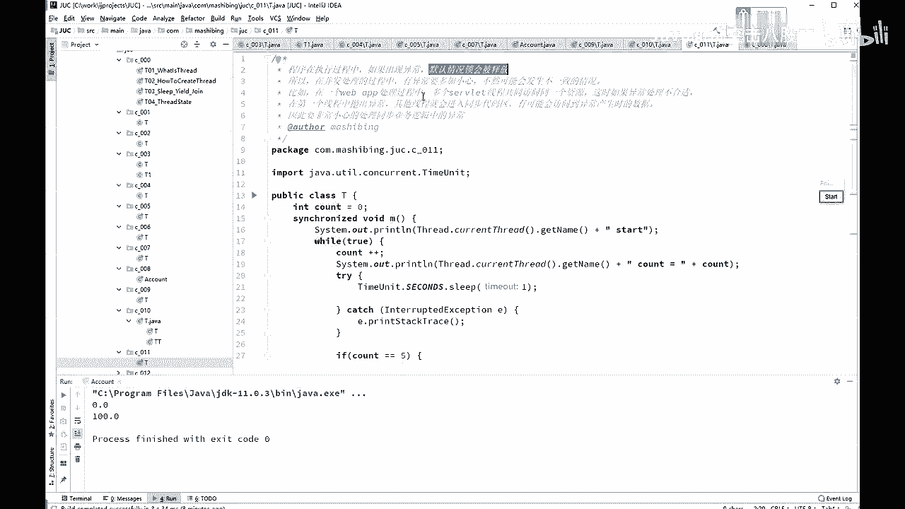

Yeah。

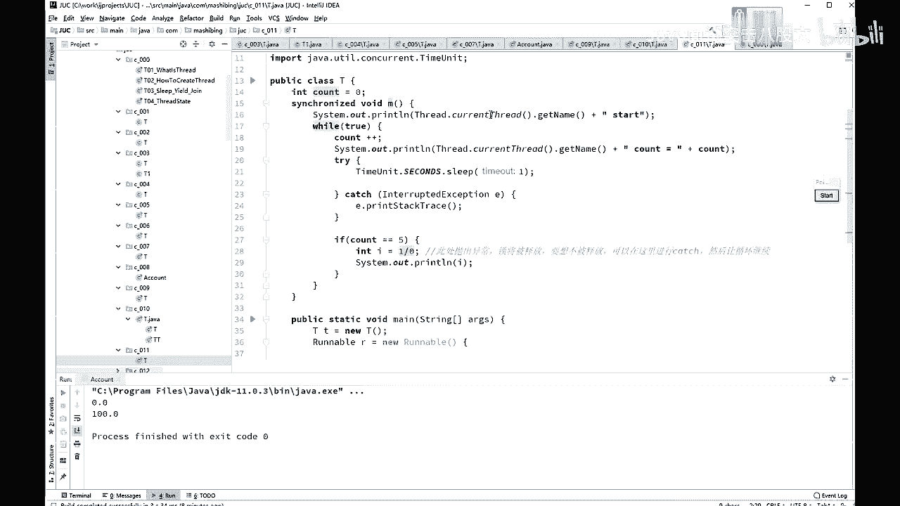

好。不。看这个小程序，加了索schronize voiceMYl不断执行现程启动。

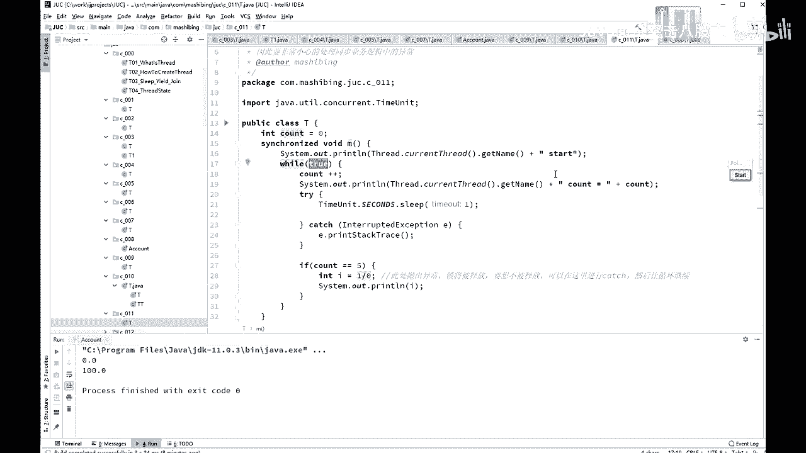

看的佳佳。嗯，等come呢s。如果come能5的时候，我让他人人为产生了异常，I等于一除以0，这肯定会产生异常除零异常。所将被释放。如果不想释放。让循环继续。本来我们是well true一个服务器程序。

在这里不停的运行。

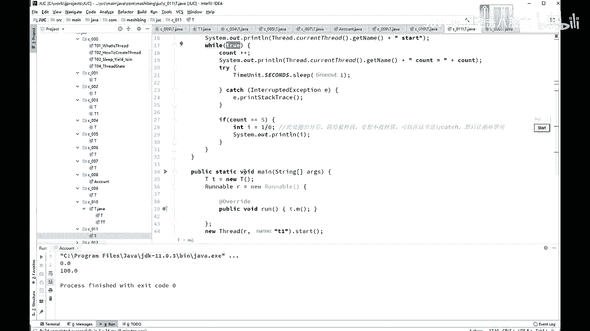

然后呢，还加了锁 synchronized的别的方法进不来。这个时候你如果产生了任何的异常的话。

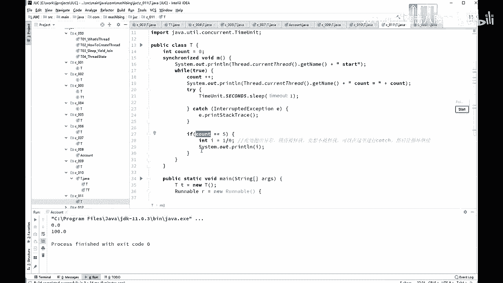

O中间产生了任何的异常，就有可能会被什会产生一种什么情况呢？

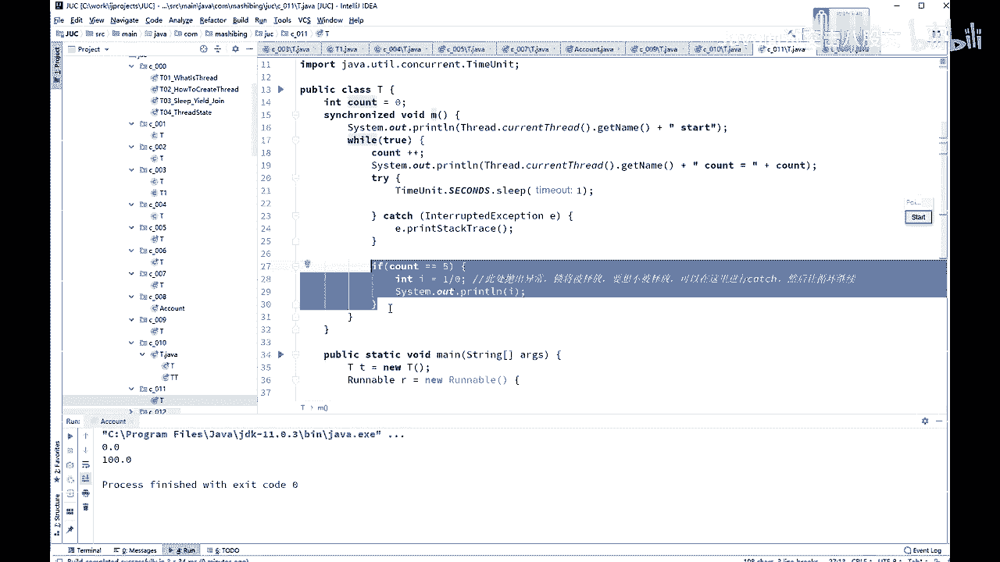

会被原来的另外的那些个准备拿到这把锁的程序。

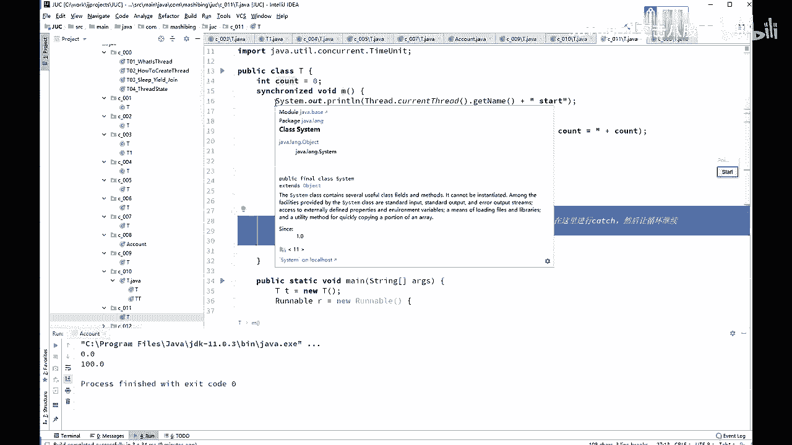

乱冲进来了，乱入程序乱录是吧？本来。我要执行下征证证代码，要拿到这把锁。哎，但是呢我中间产生了异常，然后我就把这锁给释放了。另外的所有的那个程序，哎，正等着往里头运行呢，马上我就拿到这把锁。

有可能会对你的数据产生一致。

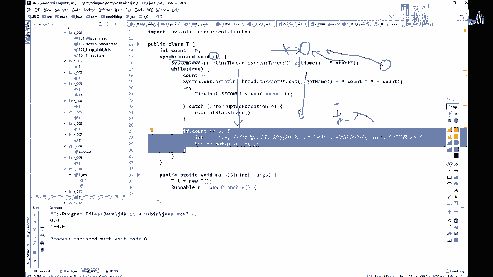

好，这个叫做异常会释放所。所以一个web application的处理过程啊，多个serv线程如果说共共同访问同一个资源的话，异常处理不合适。抛出异常之后，其他的就有可能进到这个同步区。

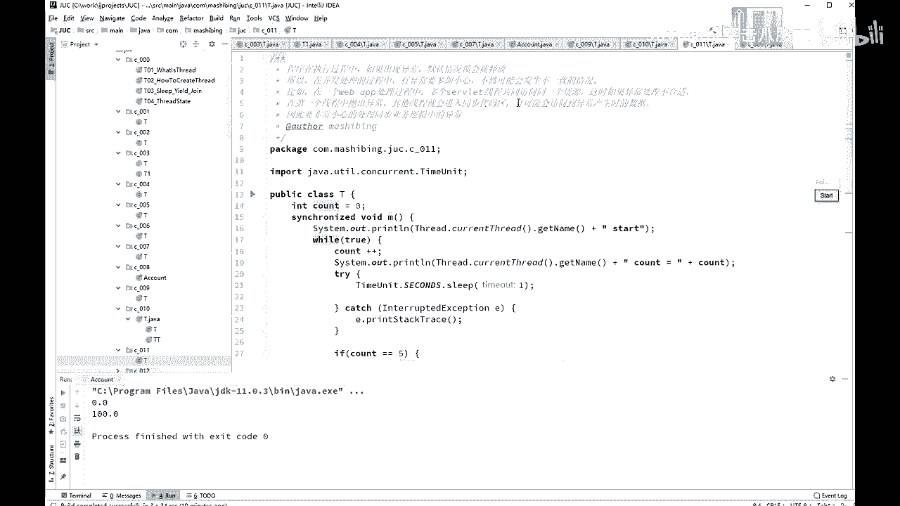

会产会访问到你异常产生去出的那些中间的那些数据啊。这要非常小心。嗯，这我就不演示了，好吧。本来你看上面这个线程O要处嘛不停的运行啊，但是一旦抛出异常之后。这个就会被其他县城所运行了。上面呢是我们的。

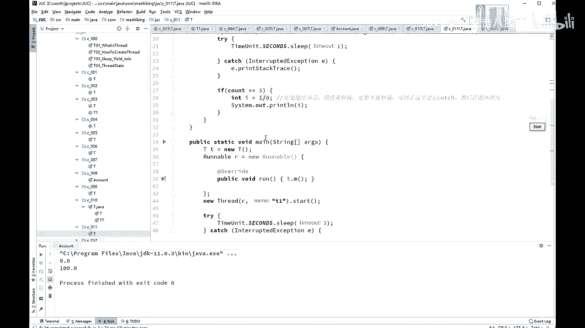

T小T等于6T。T点M都是叫T点M方法。那么第一个线轴呢是。去调它的T点M方法。嗯。😊，第二个线程是T2，也是调T点M方法，输出的呢是每一个线程的名字。本来正常情况下是T一运行，T2不可能运行的。

不过呢，它一旦产生异常之后，T2这可能运行。来看一下结果。T4。2的啊。你看你这里产生了一个异常。by zero结果马上T2就得到了执行执行结果了，看到了吧？得到了执行的机会。

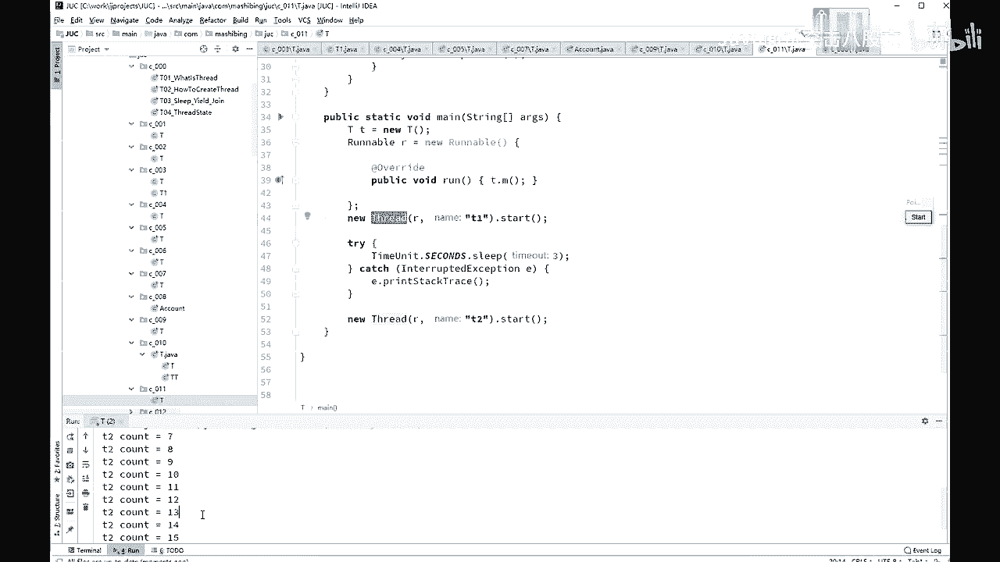

啊，你的程序呢本来正常是不允许他执行的OK。好，这里呢是异常和锁的概念和schronize的这个概念。

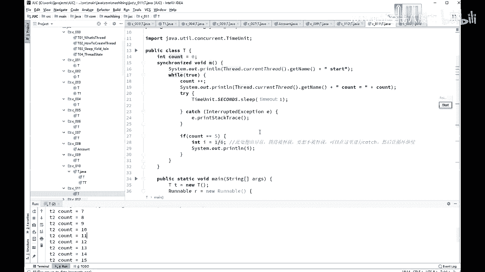