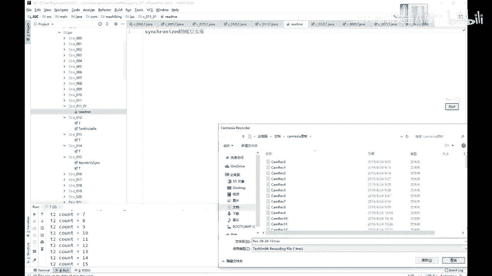

# 系列 4：P38：【多线程与高并发】锁的底层实现 - 马士兵北京中心 - BV1VP411i7E4

Yeah。好，看这里啊。

ok同学们呃，那么讲到这儿呢，我觉得有必要呢跟大家谈一下就schronized的这个具体的底层的实现。

对。

啊，看这里，我那个建了一个新的package包啊，C001-01，我觉得我好像少跟大家谈了一点小问题啊。我把这个sronnet的具体的实现在这呢跟大家交代一下。这个sronize的具体的实现呢。

有他经历了好几个阶段，可以这么说啊，就原来呢。最早的时候啊，在JDK比较早期的时候吧，这个也不太记得到底是哪个版本了。总而言之，是这JDK比较早期的时候。Yeah。这个sim的实线是重量级的。

schronize实际验是非常重量级的，它所谓非常重量级的一个概念是什么概念呢？就是它这个schronize的都是要去找操系统去申请锁。然后就会造成schronnet的效率非常低。

后来呢嗯就是要加va后来越越来越开始处理那些高并发的这些方面的职业程序的时候，很多那个成员就特别不满意，说你schronize这个方法这些简直用的是实实实在是太重了啊，我我没办法，我就得开发新的框架。

我不用你原原生的了。后来做了一些改进，后来的改进，后来改进成什么样了呢？其实simize呢是有一个所升级的概念。关于这个所升级的概念啊，我还专门写过一个。文章叫做我就是厕所所长。大家去找一下啊。

我的我的那个公众号里面也有。呃，然后那个网上你搜一下啊，应该网上也有啊，两个，一共是两个，一和2。啊，我专门用小说的形式讲了这个所升级哎，到底是怎么样的一个概念。呃，我不带来家读了，好吧。

两篇文章还是有点长的啊。在这里我跟大家交代一下，这个所升级是什么概念呢？这个所升级的概念呢是这样的。呃，原来呢都是去找那个操都要找操作系统，要找内核去申请这把锁重量级的。到啊折基是1。51。5之后是吧？

嗯，好，到后期呢进行了一些对simronnet做了一些改进，它的效率呢变得比原来要高少。改进在什么地方呢？当我们使用schronnet的时候，hospot的实现是这样的啊，上来之后第一个。

去访问某把锁的现程。你比方说schronize的某一个。F it。上来之后呢，先在这个object的头上面。mark word记录这个现场。就记录一下这个现成的。写现成号就行了，就往这个O上一记录。

什么也不干，没给他加锁。我再说一遍，如果只有第一个现程访问的时候，实际上是没有这个给这个O直接加锁的。在内部实现的时候，只是记录这个现成的ID。Yeah。这叫什么呢？叫偏向左。

所以偏向组的概念就是说你你是我的第一个，我偏了你一些。我默认将来呢不会有来第二个县城来来抢这把锁。好。O。这个时候使用的是偏向锁，只记录这个线程ID效率非常高。如果还是这个线程回来访问，哎。

一看这就是我的那个对象得嘞，我也不用申请什么锁了，乱七八糟的了，我直接开始执行就完了，所以它效率非常高。而且大多数情况下呢，也都是一个线状来执行啊，这是偏向锁。然后偏向锁如果有。现成征用的话。

如果有现成征用。去。好，这个时候就升级为什么呢？自选锁。自悬锁什么概念？自选锁的概念就是哎你蹲在马桶旁边，这哥这个有有有一哥们儿在这蹲马桶了，对不对哎。我哥们在这蹲着马桶呢。好，另外来了一个哥们儿。

他干嘛呢？他在旁边等着他不会去跑到那个我刚才说的那个CPU上那个就绪队列里面去，不会，他就在这等着占用CPU用一个well的循环，welll true是吧，之类的，类似的这种循环。

在这转圈玩转了好多圈之后，发现这哎哥们你还不行了。得这种情况下，整个锁才会再进一步升级。好，自权所悬默认的情况下是悬多少次呢？是选1次之后。两个县程，一个县程在那占着锁。

另外一个线程跟他自悬悬了10次以后。如果还得到这把锁。升级为。可以。重量解锁。所谓功能机锁就是去操作系统那里去申请资源，再加这把锁。啊，这里呢是经过一个所升级的概念。有了这个新生代的改进之后呢。

原来曾经有一些个文章哈，还有一些那个其他的那个那个那个啊讲法也好，说说这个schronize啊比atomic原子类的那些操作慢不少啊等等这样的一些个说法。啊，但实际上我告诉大家。

经过了这些个所升级的这些概念之后，schronized用的偏向锁自选锁，然后呢重量级锁。你你如果做测试的话，你会发现大多数的情况下，schronized并不比那些atomic慢。原子类哈不不比那些慢啊。

😊，好了。😊，所以这是一个所升级的过程啊。好，看看这一小块呢，有没有同学有疑问的地方。折子记说好像还有1个CAS的过程，大哥自选锁在干嘛？october自悬10次不也站在CPU，别人也释放不了锁呀。

如果释放不了，再去升级为重量级锁的时候，这个线程就成为等待状态，就不占CPU了。october。啊。啊，锁好像只能升级，不能降级。对，没错。是的。缩耗像是没法降级的嗯。哎。

jo的是你你提的这个问题还是很尖锐啊。这说的非常的非常的到位啊，就是说。你本来这个锁大家伙的征用征用来征用去。哎，然后呢它升级为重量级锁了。升级为重量级锁之后呢，后来这个征用下来了。

就只剩那么一两个线程了。这时候呢如果你再回来效率会更高，但是呢你回不来了。其实能不能回来。我想啊如果你的你的虚拟机实现写的到位，也可以做到能回来。我再说一遍，synchronize这个东西。

java虚拟机实现里面并没有规定它到底该怎么实现。所以我说的这些全都是hospot实现。就oracle的这个虚拟机的实现。假如orle虚拟机实现不是这么实现的，我也没法给你这么讲啊。嗯。😊。

Otober感觉自学没有用啊，你再感觉感觉我给你。3分钟4分钟5分钟之后啊10分钟之后。如果你你再感觉感觉，如果你还不能不能理解，我再讲给你听。嗯。😊，自选组啊。呃，既然讲到这儿呢，我们讨论一个问题啊。

在什么情况下？我们使用自选锁比较好，因为atomic以及包括后面的很多锁啊，这各种的lock。其实他用的呢全都是那个自悬锁。用的自选锁基本上用的全都是自选锁。这个特收不有一个特点，它是占CPU。

但是它不访问。操作系统。所以呢它是在用户态，在用户态去解决这个锁的问题。它不经过内核态。因此，它的效率上，这个加锁和解锁这个效率上其实要比那个经过内核肽这个效率要高。哎。

但是呢你分析一下在什么情况下用自悬锁会更好一些。在什么情况下用重量级锁会更好一些。经过内核的要要要好一些。你们分析一下。在什么情况下呢？自选锁由于它是要占用CPU的，而OS这把锁呢实际上是不占CPU的。

所谓的不占CPU的意思是说，在旁边竞争的那些个线程是进入的等待堆列里。等待堆列呢就是说你在那儿等着不占CPU什么时候CPU让你运行了，你才把你把你叫起来，你才运行。所以什么情况要用自己选锁。

什么情况要用这种锁，你分析一下。执行时间长的用系统锁没错，说的非常对。这个问题你们要好好思考。像这一个问题，如果在面试的时候，能跟面试官谈清楚，肯定会高看你一眼啊。没错。啊。

这writerder说的非常对啊，执行时间长，尽量的用系统锁。执行时间特别短。另外，除此之外，执行时间除了短之外。你的这个县程还不能太多，2万个县城跟这等着自选。我告诉你。

这事儿也受不了一个县城在那执行19999个在那自选，你觉得你CPU受得了？Yeah。所以。是执行时间比较短，这是第一点，就是说加锁代码执行的时间比较短。他别人经过就十四字悬。

这个别的那个锁可能已经做已经拿到了。好，在这种情况下。直行时间短，县城数比较少，用自选锁。执行时间比较长。现程数呢比较多，用系统锁。Oh。

O。Yeah。把这个个给大家写出来啊。这里指的是加锁代码啊。用自权。执行时间长。小能鼠多。用什么？系统走。就是你用syronized的就这意思啊。Okay。好，4分钟也过了啊，刚才那个。

刚才是谁我问你了，october是吧？凹小鬼懂了是吗？好，很很好啊，good。😊。

嗯。😊。