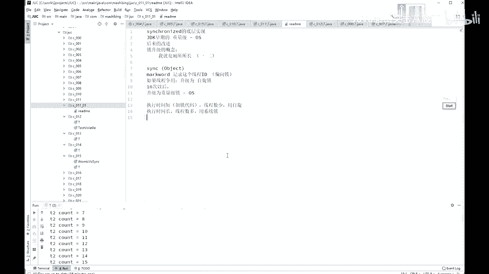
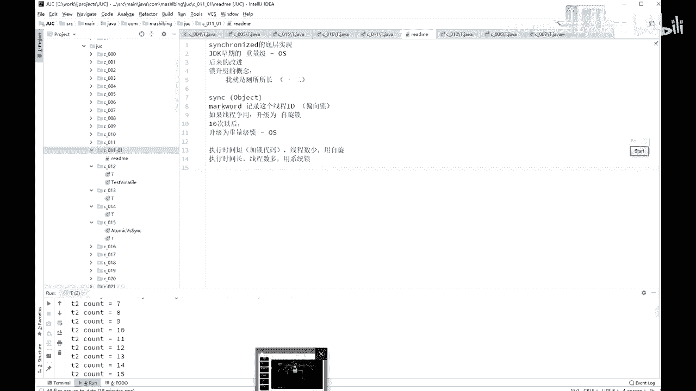

# 系列 4：P39：【多线程与高并发】day1课后总结 - 马士兵北京中心 - BV1VP411i7E4

好。呃，我们呢稍微回顾一下今天讲的内容，好吧。

や。你稍微就回顾一下今天讲内容啊，今天呢实际上就讲了哎到底什么是现成，对吧？现成的概念。启动方式。嗯。常用的方法，sleep join。常用方法。嗯。然后呢，我们讲了现状。同步的概念。

主要讲的是什么辛苦。我们稍微回顾一下这个 synchronize到底什么意思。首先，schronize锁的是谁呀？锁的是一个对象。锁的是对象，不是代码儿。这是必须要搞清楚的。第二一个呢。

如果你在一个方法上，如不加任何锁的话，锁的是呃不加不加任何指令的话，锁的是this。好，呃，除了这个之外呢，你可以锁静态的，锁静态的锁的是什么？锁的是什么什么点class，是不是锁这个类。呃。

还有一个呢就是schronize呢是锁定方法和非锁定方法。可以同时执行。O。呃，除了这个概念之外啊，就是所升级，它本身有一个所升级的概念。所升级呢是经历了三个过程啊，第一个过程呢是偏向左。

这所就是那个你来了之后，我就进你个号就行了。哎，开门还是你还还是你，那你就进来这意思。第二个呢是自悬锁。我先不尝试去找操系统申请那个大锁，先申请这个小锁，先自己悬着在旁边转圈玩。然后呢才是重量底锁。

就是向操作系统申请的重量底锁。然后呢，我给大家讲了，在什么情况下用自悬锁，什么情况下用重量去锁啊。OK这是我们今天讲的内容。呃，sorry啊，我想起来了，我少给大家讲了一个小问题。

就我讲一什我少讲你什么问题呢？呃，锁定。就schronize。你锁定这个对象的时候啊，这个objection。不能用什么。不能用screenring。不能用integer吧。

不能用long这些基础的数据类型。不能用s string的概念，主要是什么呢？因为呃不能用s string的常量，严格来讲应该是这么说。你尽量的连那个连对象都不要用就行了。不能用时间常量。

为什么不能用死针常量啊？你分析一下，如果你simronize的有一个，比方说是sronize的是这么一个玩意儿。是这个对象。增这常量。那字符特常量大家都知道那个所有用到这个字符特常量的地方。

其实用的都是同一个，对不对？好，假如你某一个县程锁定了这个字符串常量的话。而且很不幸的是呢，这是一个内库，一个library。别人用的一个炸包里面，你写的某一段程序，你锁定了这个字符串常量。

然后你的用户的现成的人呢又尝试着去锁这个字符段长量。结果就会发生什么呢？用到这个内库的那些个代码，哎，不小心给给这个给锁定了。结但是呢当你用到这个内库的时候，又需要锁定这个。

你发现你一不小心别人写的代码跟你写的代码之间竟然锁定的是同一个对象，中间会产生什么奇怪的现象，我就不知道了。Thank。方下也不自得说重入了，你你给我哪凉快，哪待着去。😡，重入一定是同一个县程啊。

sorry，你你我我我我连我打两回哪来行这个也有可能你跟你用到那个内裤的确实是同一个线程，但也有可能不是同一个县程。如果不是同一个线程，很可能就死锁了。如果是同一个县程，很可能重入了。

重入了也不一定是想你想要的那个结果。😊，所以记着这一点就行了，你不要用这个磁针长量，也不要用integer。因为inageger它内部做了一些特殊处理，你每产生这个integer。

只要那个里边那个对象稍微变一下那个值，它就会变成一个新对象。OK所以。记着这个结论就行了，不要用死针常量，不要用这些基础的数据类型。听懂了吧？所以就别废话，你就那个别用这个就OK。

