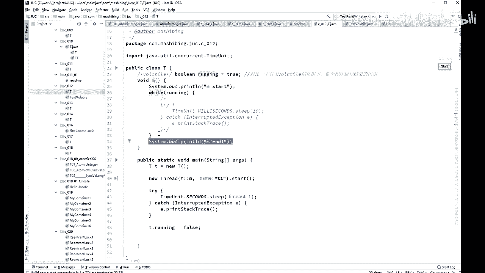

# 舍不得花27980买马士兵教育的MCA架构师课程？免费开源马士兵教育VIP课程 - P41：【多线程与高并发】Volatile保证线程可见性 - 马士兵北京中心 - BV1VP411i7E4

dmon就行了。现场有一个方法叫set demon设成 true，自己去查thread类里面的一个方法。okK我们呃唉。下面我们来看这个volattile的概念啊，voltile到底是什么意思？呃。

vololaile呢我我们直接来看程序，来看这个小程序啊，vololaile也是面试。现在现在像那种大的互联网企业的面试。

基本上额了条是避会的。呃，那么他有时候也不太问了，因为他认为呢你应该会。呃，所以你会不会呢？他也他也不问了，但是呢像那个呃中小企业呢，他也开始问这方面的问题啊，窝了条那窝了条到底是什么意思呢？

来我们来看一下这个小场序，你就知道了。看了小程序，小程序呢我写了一个方法啊，先首先定一个变量，布尔类型running等于tru。说现在正么在正是不是正在跑着呀？是的。然后呢，我们唉写了这么一个。

这么一个一个一个方法啊，这方法呢是哎上来之后呢，我输出M start。

然后while running while running的意思是说，哎，如果说正跑着我就执行我的操作。这里模拟的是什么呢？模拟的是一个服务器的。服务器的操作。大家知道那个不管是什么样的服务器啊。

游戏服务器也好，ATP服务器也好，这些服务器呢一定是说在没有停止的情况下，它就在那7成24小时不间动的运行。什么时候让它停止，你可以点它一下，可以强强制的杀死它。我就模拟了这么一个操作。

这个操作呢用一个波尔类型的变量来指示你要不要继续运行。如果这个值为处，那么你给我不停的监督的运行，我什么时候把这只fose，你就应该停止了。这里呢是一个非常理想的情况。

我什么时候就把这值设成forse，你就应该给我停止。所以这时候你应该输出M end。

ok好，大家看这里啊。我的方法是怎么测的呢？我我来进行对它进行测试。因了一小T，我就不说了，newth。起了一个线程，这线程呢调用了M方法。好，这个写法同学们没有问题吧，有问题同学给老师扣1。

后面林老师在初级里头，我给大家讲了咱们的表达式。这是lembber的表达式啊，lambber的表达式相当于是我new了一个thread。因为有同学有问题啊。这是lemb表达式的写法。

相当于呢呃是这么写的，new了一个thread，扭了一个reable。然后在这ranable里面呢，大家要知道它要重写run方法是吧？在run方法里边直接调用了M，就是这个意思。O。哦，sorry。

这是我的问题啊，有问题扣一，你扣到12sorry。😊，我的问题啊。啊。我那我就不多说了啊，然后呢扭了一个现程start。好，睡了一1秒钟，睡一秒钟之后呢，我把这个值设成false。那就是理想情况。

你把这个值设成false之后，理想情况。这线程应该就停止了，这线程停止的话，它就应该输出M end。我们来运行一下，看看是不是它会停止啊，看一眼。你看Mstar啊，你就数吧。

一秒钟、2秒钟、3秒钟、4秒钟。你数多少秒，这哥们儿呢就是不停。但是神奇的是呢，你只要把reent打开。哎，如果这里呢我们。修饰这个变量的时候加了volat volatile。运行。M star好。

一秒钟之后MN。OK咱能理解这意思吗？你加老公的条。😊，这这个它就能准确的停止。如果不接，它就停不了。okK这这就是vololatile，它起的作用。那vololatile到底起的什么作用呢？好。

vololaatile本身的含义呢叫做可变的易变的，容易产生改变的那意思就是说这个值啊是可变的，你得使劲的跟踪这个值。什么时候它发生了变化，你要好好跟踪它。好，你认真听，今天呢来聊这个vollock啊。

🤧大看这里。word要聊起来呢，它有两个作用。第一条作用呢叫做保证现成可见性。第二条作用叫做禁止指令重排序。大家给我记住了。由于面试场考，你也啥话也啥也别废话，给我记住就行。保证现程可见性。

禁止指令重排序。不是实时监控，听我说。看这里。保证现成可见性指的是什么意思呢？指的是这个意思。我呃讲过很多次呢，这个现成的概念呢。呃，JVM呢我们是讲完这个这并发之后才讲JVM啊。

所以如果有同学没有听过的话呢，我简单给你解解释一下。大家知道java里面呢是有堆内存的嘿。多内存呢是所有的现程共享里面的这个内存。这是呢所有县城共享的内存。除了所有县城共享内存之外呢。

实际上呢每个县城都有自己的专属的区域，都有自己的工作内存。如果说在共享内存里面有一个值的话，比如说像刚才我们的running，它等于true啊，或者等于fose啊等等。当我们县城某一个县城。

这是我们的主线程。这是我们的T一线程。好，这两个线程都要去访问这个值的时候，他们会把这个值科py一份。copy到工作性自己现成这个工作空间里头，然后对这个值的任何改变，首先是在自己的空间里进行改变。

比如在这里呢，我把它变成了false。但是这个fors什么时候写回到主共享内存里头？不好控制。我再说一遍，什么时候写回去。不好控制。O。是。所以你刚才看到它什么时候写一下，这玩意儿不真真的不好控制。

除此之外呢，还有一个呢就是这个well使用flag的副本这块的内容。那他什么时候他已经拿到这个副本了呢？它will不断的循环，不断检查他什么时候再去检查这里面有没有新值啊。也不好控制。那好。

如果你对这个变量不加高了，它就这种情况，它什么候写回来，我不知道什么时候读这个新的有没有改改过的这个纸，我也不知道。啊。No。呃。对不起啊，我感觉什么时候读是不知道的，什么时候写的话。

应该是你改完之后会马上写回来。改完之后会马上写回来啊。这个sorry。这我要查一下啊，应该是改完之后马上写回来，但是什么时候读是不知道，但是不管怎么样啊。在这个县城里头，它会产生一个现象。

就是在这个县程里头对这个副本进行了更改。并没有及时的反映到另外一个县城里面。okK并没有及时的反映到另外一个县城里面，这个就叫做县城之间呢不可见。县城之间不可见啊。好，那既然县城之间不可见的话。

你这个县城里头改变另外一个县程就不知道。我刚才是在没县城里头把它设成foralse。那么我在提这个县城里头，他什么时候看见这foralse，他不知道。对，这个变量值加了vol了跳之后。

就能够保证一个县城之间的改变，另外一个县城马上就能看到。这是vololaile。What头。它本身如果我们说的再细致一点的话啊。听我说，我不知道会不会考到这么细啊。

其实现在这种这种这种变态的考试越来越多了。请大家去查这个词叫如果没记错的话，MESI。呃，这个是它它的本质上是使用了CPU的一个叫做缓存一致性协议。CPU的缓存一致性协议。缓存一致性协议啊。

我刚刚想起来。呃，大家去分析下，就是多个CPU之间，它也需要对进行一些个缓存。由于你不同的线程是不运行在不同的CPU上，所以这个CPU里面的这个副本改了，另外1个CPU不一定马上就能看得到。

本质上呢它这个。他呃。这个概念上是一样的。但是呢你java里面这种线程之间的可见性，实际上要靠CPU的缓存一致性协议，你才能够保证你你你你你能得到这个值。不然道你考虑一下，它中间写回读取的这个过程。

如果在读取的这个过程之中，又有人改了又怎么办？所以归根结底是要靠硬件来帮我们实现了。