# 舍不得花27980买马士兵教育的MCA架构师课程？免费开源马士兵教育VIP课程 - P42：【多线程与高并发】Volatile禁止指令重排序 - 马士兵北京中心 - BV1VP411i7E4

那么窝外条还有一个很重要的，它的作用是什么呢？叫做禁止指令重排序。那么禁止指令重排序又是什么概念呢？听我说我们先说指令重排序是个什么概念？指接重排序呢。如果往深里挖的话，也跟CPU有关系。也是跟。

现代的CPU是有关系的。那么你去考虑一下啊。每次写都会被现成读到。对每次写都会被现成读到，加了vol条之后。呃，这个指定铜白具呢。如果往细节上抠，它也是和CPU有关系的。

CPU呢原来执行一条指令的时候啊，它是那个就一步一步的顺序的执行。但是现在的CPU为了提高效率，他会把指令呢。并发的来执行。这是第一个指令指令的执行到一半的时候。那么第二个指令就可能已经开始执行了。

第三个指令就可能开始执行了，这叫做流水线式的执行。都是一些的。那好，在这种新的加设计架构的这种这种基础之上呢。如果想充分的利用这一点。那么就要求你的编译器compilr。要求你的编译器。

把你的原码编译完的这个指令之后呢。可能进行指令的一个重新排序。重新排顺序。呃，原来是A等于3，B等于4，你代码里是这么写的。但是由于这两个呢，如不如果说他们两个之间啊，后面又把B的值负为5了啊。那么。

边际呢可以对它进行一个一个重新的排序，有可能把B等于三排B等于4排前面啊，马上后面B等于5跟上，后面写A等于3。这件事情很正常。这是一个逻辑上的概念。那么细节上的就是那个汇编语言上的它的一个重排序。

这个。mod了掉还有一个作用呢，就叫做禁止指令的重新排序。那么禁止指令重新排序。它会起什么样作用呢？我通常给大家举例子，举的是这个例子叫做double check lock。

这个例子呢也是非常深入的一个内容啊。好，下面我来聊这个指令重排序的问题。这能空白序其实经常举的就是这个例子。而且这个例子呢原来是一个面试题啊，甚至其实在这个业界里头也曾经出现过很长时间的争论。

就是说我到底应不应该加vololatile。那么这个到底是什么意思呢？没有没有听过性格也没有关系啊，我来一步一步讲给大家听。然，我们来聊呢，到底呃什么是单利？单利的意思呢就是这个意思。

我保证你在JVM的内存里头永远只有某一个类的一个实例。其实这个也很容易理解。在我们工程之中呢，有一些类啊，他真的没有必要拗好多个对象。你你比如说什么样的类呢？权限管理者。权限管理者。

那哥们儿就是专门管权限的，哪个操作呢，我都进行一个权限，我我真的没有必要拧好多个，一个就可以。呃。守大门的对吧？一个就够了。这时候呢叫做单机上的这种单利模式嗯。但这种模式呢最简单的写法是这种写法。

这种写法呢叫恶汉式。恶汉式的写法是说看这里。我有这么一个累。定义了这个类的一个对象。然后这个对象呢是在这个类内部的。同时呢我把。这个类的构造方法设成什么设成private。

那意思就是说你比人说你没法扭我，你不要去扭我。你不要去给我拗manage01，只有我自己能拗，所以我自己就拗了一个扔在这儿。既然别人拗不了，只有我自己能拗，我拗完了之后扔在这儿。那么理论上来说。

我就只有这一个实例了。那什么怎么样才能访问我这个实例啊？通过一个方法叫get essence。我就拿到这实力，给它返回去返回去。所以无论你调用多少次的get instance，本质上它只有这一个对象。

而，这第一个小程序非常的简单，我解释的比较快。没问题，同学给老师扣1啊，有问题直接提。我。嗯。但是这种写法呢非常的简洁，也很容易理解，而且呢由JVM来保证，永远只有这一个实力。

为什么JVM能保证这个很简单，一个class漏到内存之后，这个static是由JVM来帮我们做初始化的。由JVM来帮我们做初始官啊。那那个只有初始化完了之后，你才能使用。这个JVM就直接给你保证。

肯定就只有这一个实例了。那好。但是有的人呢他会吹毛求疵，他会说。我还没开始用这个对象呢。然后我没没用这个对象调这个方法是吧？你干嘛把它给初始化了？你能不能够说什么时候我开始用的时候。

有时候get instance什么时候我调这方法的时候，你再给我做初始化。所以呢。这个是另外一种磁带和样上一种一样的写法就不说了啊。好，所以呢就会产生这种懒焊式的懒汗式的意思是说。

我get instance，什么时候我一开始调用这个get instance的时候。我才给对他进行初始化。当然你这个初始化的话，你尽量不要初始化两次，你应该只能初始化一次才对，不然就成了俩对象了嘛。

所以上来之后，你先判断instance等于空的话，我才初始化。那你可以想象一下，如果有人访问啊，发现它是空吗？我就初始化了。那么后面一个人再来的时候，发现他是空吗？已经不是空了。

那就把这个insense给返回回去。不过。更加吹而求疵的事情就来了，说我不单单的要求你，我用的时候才初始化，我还要求你现成安全。那这里就就要问大家了，同学们，这种写法是会使现成安全的吗？

能不能支持现成的安全性？不会，这个肯定不会嘛。你第一个县程判断它是空，第二个线程同时也判断它是空。第一个线程扭了一下，第二个线程又扭了一下。

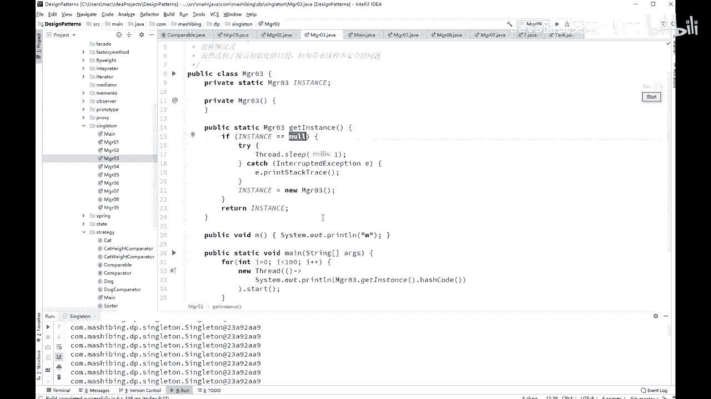

啊，这个。所以。你多个县城开始访问的时候，那它一定会出问题，这个我不运行了，就个它一定会出问题，你自己去实验。

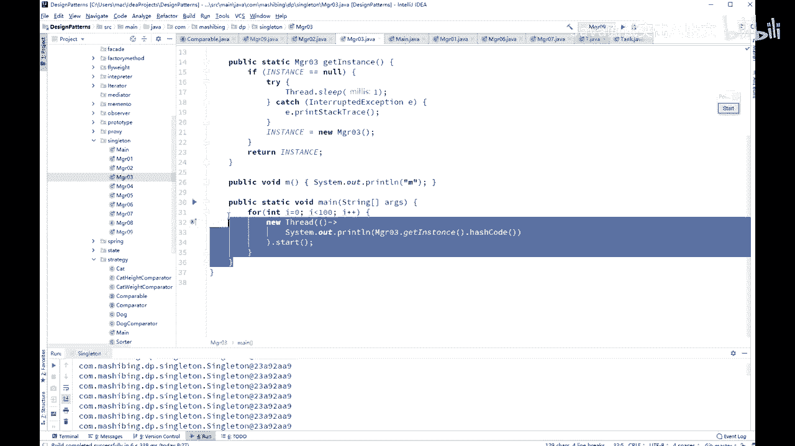

所以他会怎么做呢？我们要加一个schronize来解决，这是肯定的对吧？我们加把锁嘛，所以我加这个叫做publicity synchronize to get instance啊。

这句话一旦加上肯定没问题了。那。所这句话一旦加上肯定就没有问题了。

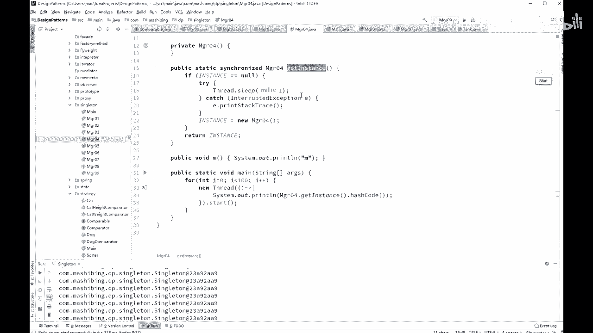

因为这里面从头到尾的就只有一个线程运行。那第一个第一个线程发现他那个空给他扭了。第二个线程。

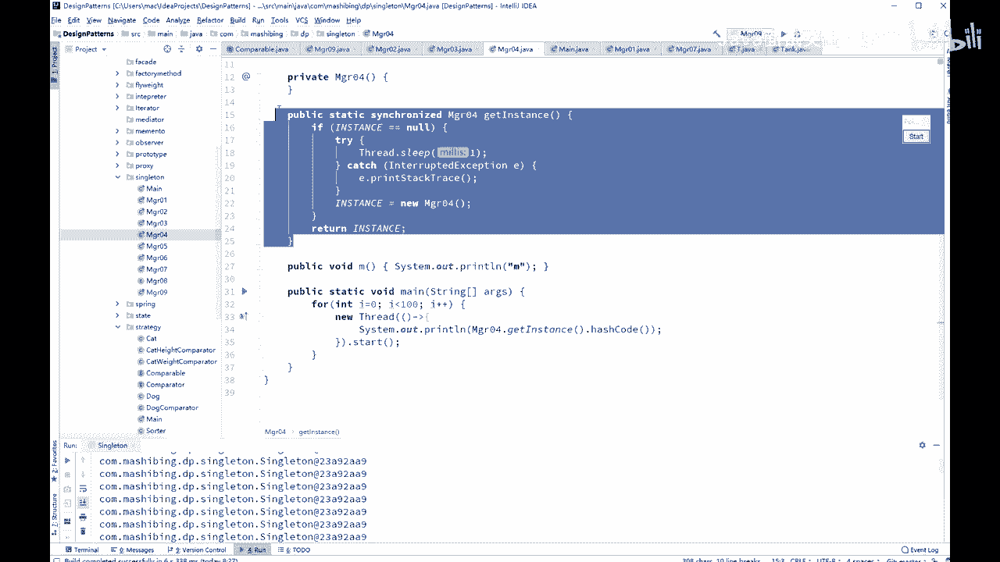

它无论怎么访问，这个值已经永远都不可能为空了，所以它只能是拿原来第一个县程初始化的这个部分，这是没问题的。但是有的人又开始吹毛求疵，说，你对sronize一下加在方法上，你锁定这个代码这个代码区啊。

实在太长了，说不定里边还有其他业务逻辑。咱们说对于加锁这件事情来说叫做代码能能能锁的少的，就要尽量的锁的少。这个后面我还会提这个问题。所以呢有的人就开始进一步的吹毛求疵。

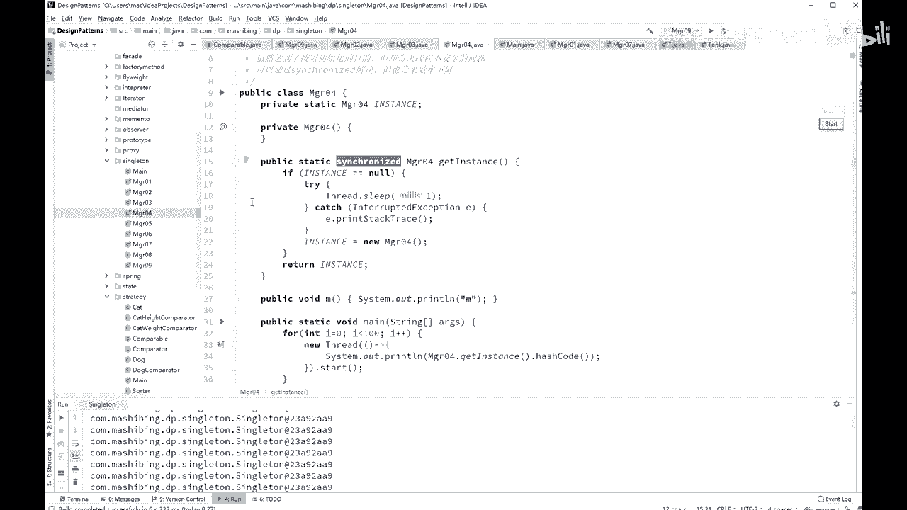

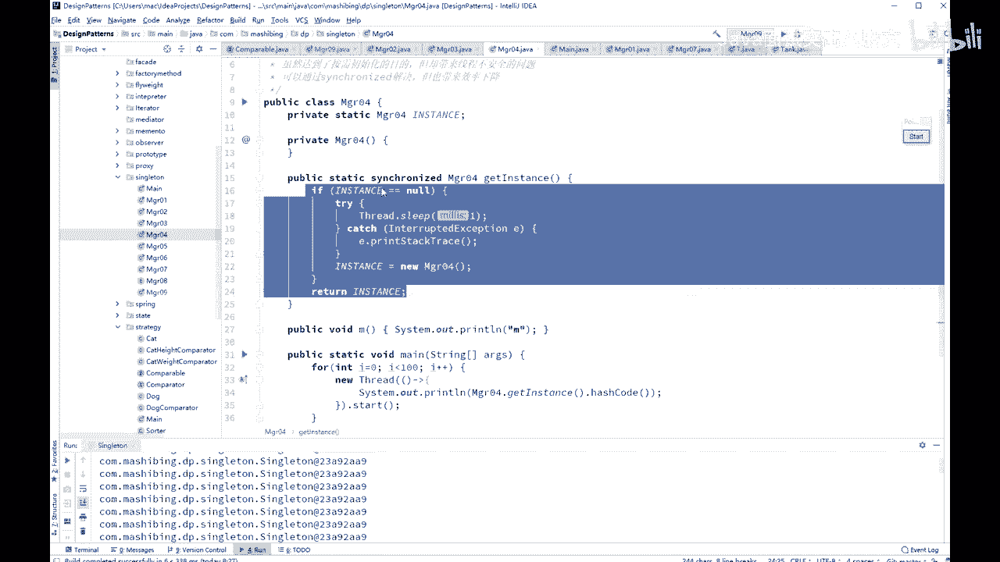

它会变成新的写法。这个写法是什么呢？上来之后，您先判断，你先别加锁，你先判断判断它为空，然后再加锁初始化。

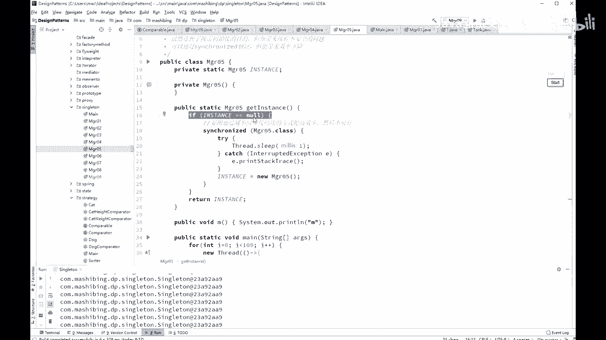

细力度的更细力度的一个锁，这叫做所细化。也是锁的一个优化的一步。

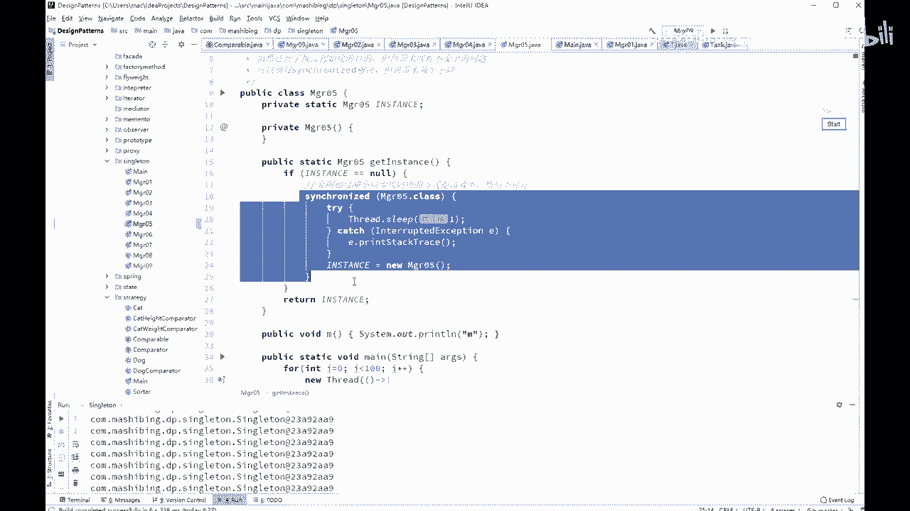

不过很不幸的是，这种写法是不对的。为什么这种写法不对，我们来分析一下。第一个县程判断它为空，然后还没有进行下面的执行的过程。第二个县程也来了，也判断它为空。那好。

那么第一个线程呢就开始schronized。schronet上来之后，对它进行了初始化，初始化完了之后把锁释放了。但是这个时候第二个线程记住第二个线程也已经执行完这句话了。

它还仍然视为空的那会儿还第二个线能拿拿到这把锁又初始化了一遍。这种写法是有问题的。所以就会产生了好今天我们要讲的vololatile这个问题，这个问题呢是是是是这样来产生的啊，这样这样来问。

我们把这窝老汤给住着了。O看这里。呃，这叫做双重双重检查所，或者叫双重检查的单例。是怎么写的是这么写的，就是if instance等空schronize synchronize完了之后再判断一遍。

这叫做双重检查，它是不是等于空。如果在这种情况下，刚才说的那种现成的问题就不会再有了。来分析一下。第二线程来了。说哎okK你确实是空值，然后呢它进行下面的初始化过程。

假设第一个线程把这个instance已经初始化了。好，第二个线程检查第一个线程检查一等空的时候，第二个线程也检查它为空。所以第二第二个线程在这句话之后停住了，暂停。暂停之后呢。

第一个线程已经把它初始化完了，释放锁。第二个线程继续往下运行，继续往下运行的时候，他会尝试拿这把锁，他能拿到这把锁吗？可以。第一线程已经释放了，对不对？他释放完之后，拿到诊疗所之后。

注意他还会进行一次检查。由于第一个县程已经把ins森初始化了，所以它这个检查已经通不过了，所以它不会再重新谬一遍。因此，这个双重检查这件事儿是能够保证现程安全的。讲到这里。有没有同学有疑问的。

没问题给老师扣1。我马上讲volattile。那说那外面的判断没必要啊，外面判断可以省很多很多的。你不用加锁，外面这个判断不用加锁，你理解吗？不加锁的话，上来不用加锁，你的效率就会高。啊。

刚才我可我没看清楚是哪位同学提的这个问题。我再说一遍，你想你县城，如果你如如果你没有外面这个，你上来之后呢，你直接就开始申请锁，这个效率当然就会低锁竞争了。但是呢呃如果你上来之后先检查。

你是不用申请锁的。你先检查一下多数的情况下，这个值已经不为空了，肯定有个现成吧已经把它初始化了。如果它已经不为空了，那你就直接拿就行了，就跟跟锁就没有任何关系了。呃，听懂这意思了吧。

所以外面这个还是有必要的嗯。好，现在的问题是你看啊，我用了双重检查之后，我起了100个线程，这100个线程每一个能调用一个ge instance打印它的hash code。为了县城之间的互相之间会干扰。

所以我还中间让他睡了一个毫秒。

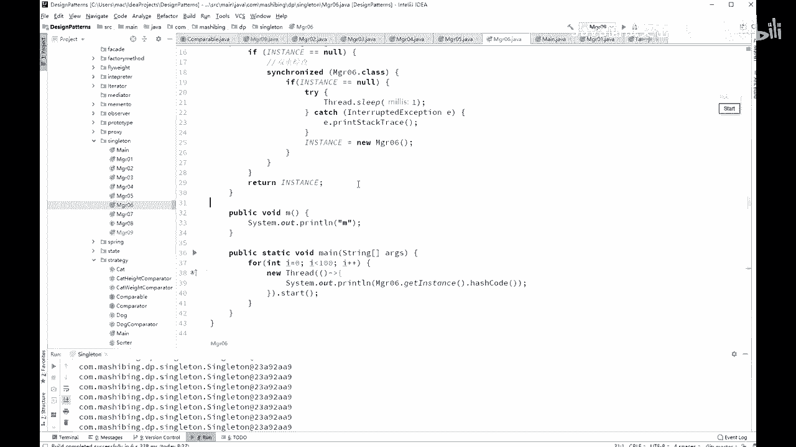

跑一下。那么结果你会发现呢，我告诉你，就这个程序，无论你运行多少遍啊。

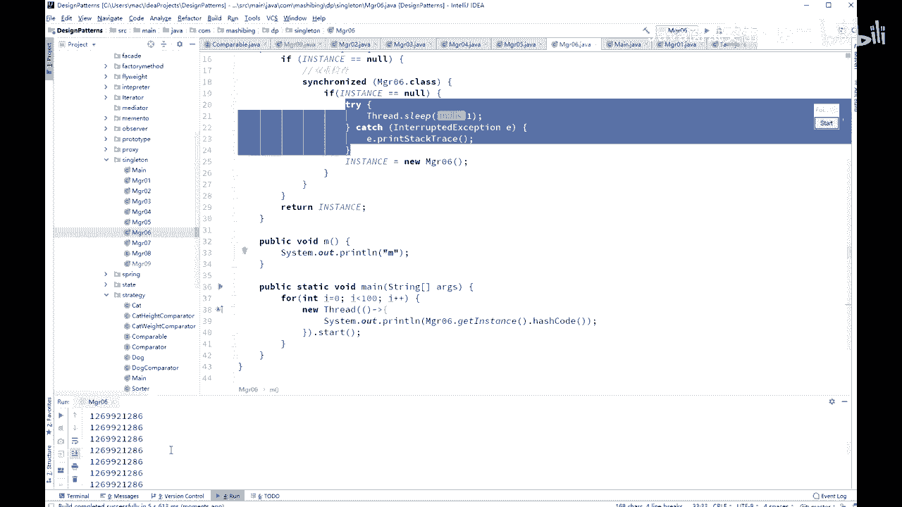

你就算在高并发的情况下运行，拿100台机器同时访问着一台机上的这个geide instance。然后那个每个机器上跑跑个1万个线程，使劲跑。

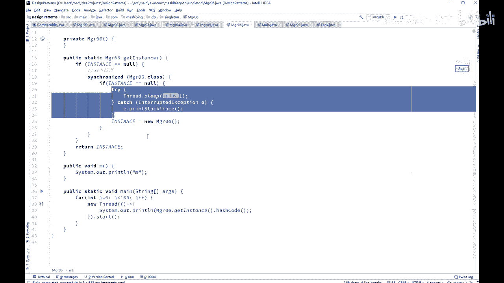

O。使劲儿使劲儿的跑这个程序，最后运行出来的结果一般也是正确的。嗯。这怎么说，没有外面，一开始方法上不就一样的吗？不是这是两回事。我我际上省略了这其中的一些业务逻辑的处理。

在这种地方很可能有一些业务逻辑。能理解吧，我省略了这些了啊。所以还是不一样的。你加Cle呢的加代方法上的话，那整个的就包括业务逻辑全锁了，没有这个必要嘛。嗯。好。那有同同学会说。

那到底要不要加vollatail好，这是一道面试题。这道面试题他会直接这么问，你听说过单利模式吗？你肯定得说听说过，你要是没听说过单利，你还聊个肾呢。啊，那单立模式里头有一种叫双重检查的，你了不了解？

好，你这时候要说不了解，咱就咱就挂了，就别聊了。你说了解OK那了解的话，问你一句，这个单例要不要加volatile。通过我们的实验来看，你哪怕就是进行压力测试，压个1110万遍，它依然。不会出问题。

你拿到的依然是同一个对象，但是要不要加voltail呢？答案呢是药价，这个以前啊由于这个实验你很难做出来，就是让它出错的情况。所以以前很多人就不加这volat跳，但是它也不会出问题。

那么加了不加多的条问题会出在哪儿呢？就会出现在指令重排序上。好，认真听。这个模型呢特别的复杂，你认真听我们说第一个线程第一个线程。需要你了解这句话，就是instance等于new manager。

那么利用manage经过了我们的。JVM虚拟机的呃编译编呃，sorry这个编译器编译完之后呢，它这个指令呢其实是分成三步。一你有一个对象的时候分成三步，这个指令分成三步。第一步呢是给这个对象申请内存。

第二步是给这个对象的成员变量。初始化。第三步是把这块内存的内容。复制给这个instance，所以它是一。235。好，我再说一遍，申请内存。申请完内存之后呢。呃，这个值啊是一个默认值。

还是给大家在PPT上画一下。

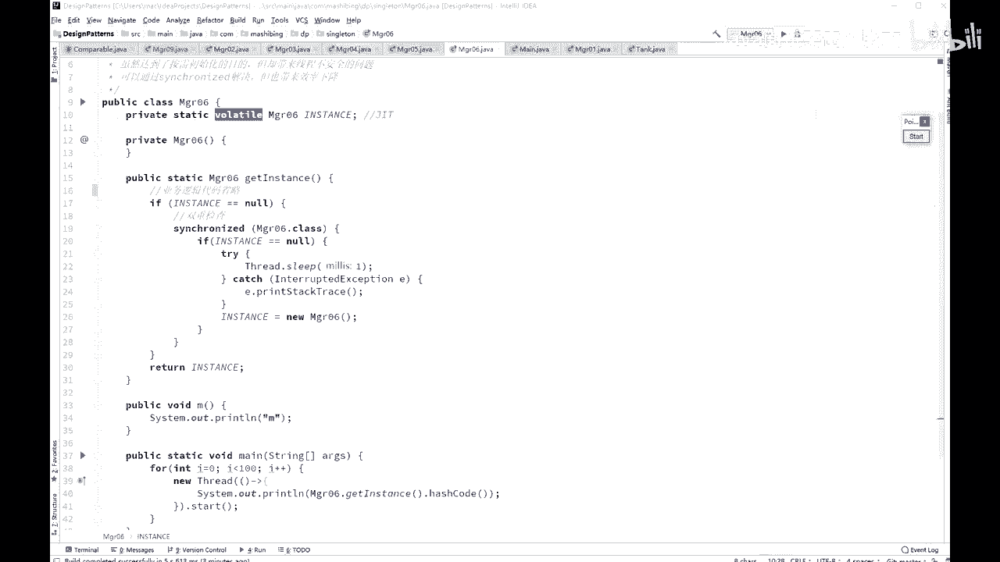

先说 new对象的这个过程啊。简单给大家画一下。好。没有对象的这个过程啊。应对现这个过程呢分成三步啊，第一步呢是申请这块内存。假如它里边有个值的话，呃，I这个值它会给这个I它会A这个值吧。

A这个值它会给这个值呢付一个初始值默认值。这个默认值如果它是in特类型的话，它是一个0O是一个0。然后呢，进行第二步。第二步呢是把这里面成现面料这个值呢设成真真正正的那个初始值。

比如我们给AA付的初始值是8，那么再把这个A变成8。哎，然后呢是第三步，第三步是什么呢？是把这个变量啊，这时候它的值已经是8了，是吧这个变量呢呃真真正正的赋值给我们那个inst。

大家知道那个inst呢是在那个呃站内存里。是吧让他呢哎只想。这个变量的地址。理理解这个过程啊。第一步申请内存，第二步改值。第三步呢把这个值赋值给他。但是如果说认真听。

如果说这里面有指令重排序会发生什么呢？会发生A等于0之后。还没有对AD行初始化之后。好。我们就已经把这个instant的值赋值给他了，也就是说把第三步和第二步给换了个位置。这个A等于零的时候。

我们这个instance里面就有值了，就是已经指向这个这个这块内存了，反正这块内存的地址是不会变的。好，刚才讲的这个内容有没有同学有问题的，你给老师提出来，没问题给老师扣1。也就是说什么呢？

这一个对象在半初始化，初始化到一半的时候就已经赋值给这个变量了。那如果复值给这个变量之后，你仔细分析一下。第一个线程， synchronized的。虽然说它加了锁了。Synchronized。啊。

加了锁了，但是在加锁执行到没这个对象扭到一半的时候，扭了一半，A的就变成0。第二个选程来了。第二个选程，你刚才咱们刚才也多定代码了。第二个线程来了之后，它上来先判断这个instance是不是等于空。

可是大家注意。由于它已经初始化一半儿，而且这个instense里面有值了，它已经不再是空值了。同学们。所以。它不再是空值了。就相当于第二个县城已经拿到这个对象，可以直接使用。

既然拿到这个对象可以直接使用了，我很可能会使用里边这个值，这个很正常。但是呢我本来期望这个值应该是个8，可是很不幸的是呢，这个值是个零。假如在一种超高超高并发的状态，这种情况是有可能产生的。

超白超高并发的状态。阿里京东。秒杀的时候是有可能产生的。如果你秒杀的时候，这里记得是一个库存的值。原来或者订单的值吧，订单的值原来这个订单呢下到1万了1万个订单了。你本来这个值再来一次的时候。

应该是1001。但是很不幸的是呢，中间你读到了一个零的状态。结果这个订单值变成一了。O。不知道我说清楚这个问题没有？所以在这种状态上，你就会出问题。reedemption你说的这个你的这个疑问呢跟。

办初始化没有任何鸟关系。没出始换会完全释放锁，这跟释放锁不释放锁没有任何关系。我说的是这个instance的值已经有了。既然有这个值了，那么你在另外一个县城里头上来先去检查，你会发现这个值已经有了。

你根本就不会进入锁那部分的代码。听懂这意思了吧。那好，那么加了vol会怎么样呢？加了多了跳。指令重排序就不允许存在了。对这个对象上的指令重排序不允许存在。所以在这个时候。

一定是保证你初始化完了之后才会复制给你这个变量。okK这是vololattail的含义，两个含义我就讲完了。看看有没有同学对这块有疑问的。它有两个含义，第一，保证现成可见性底层的实现。

CPU的缓存一致性协议。第二个行业禁止指令重开序。单立的时候，超高低频盘你才可能会出现。但是平常我们写程绩是测不出来的。我是没办法测出来的。如果你要是愿意的话，你可以测一下试试啊。呃，其实是可以测啊。

我跟你说，其实是可以测，只不过重新写下来比较麻烦，怎么测呢？大家知道那个ASM呢是直接。就是ASM是可以直接操作二进制码的。你只要在二进制码呃，这三条指令之间啊，就是说申请内存初始化复值。

这三条指令之间你你你你插插入一些代码睡觉就能测出来。那这个太费劲了，我就懒测了。そ。嗯，好的，我们我们看看同学们还有什么有有没有什么问题。但是有同学可能很难理解说那个中间居然是三条指令。

你你你怎么证明是三条指令啊？嗯我给你看看证明一下，好吧。随便写一个小程序。找个比较简单的小程序啊。嗯。😊，没有了。Just test。面包款啊什么都不写，就直接写 new object。写。

OjectO等于 new objectject。嗯，跑一下。跑掉之后呢，vio这是我后面讲虚拟机的时候一个小工具。这种容易的会观察我们这背方法呢生成的哪些个。二进制码它的code。

它的汇编指令是怎么生成？你看这个汇编指令，这汇编指令呢，它是你要这个对象的时候，有这么几条指令。第一个是newnew就是申请内存。先把内存申请上diplication是复制的就不说了。

new完了之后的第二条指令。dplication这个是下面这指令要用的啊，你不用去不用去管它。第二这个一一条指令你new完了之后申请完内存，申请完内存之后。

invoke special invoke special。你看它调的是什么呢？调的是object initial方法调的是object的构造方法，所以它要用new完了之后调构造方法进行初始化。

初始化完了之后acestore一才会真真正正的把这个值赋值给。欧这个对象。所以你仔细如果看的话，这还不是一条指令的，这是4条指令。Yeah。我。所以这些指令中间是有可能被打断或者重新排序的。

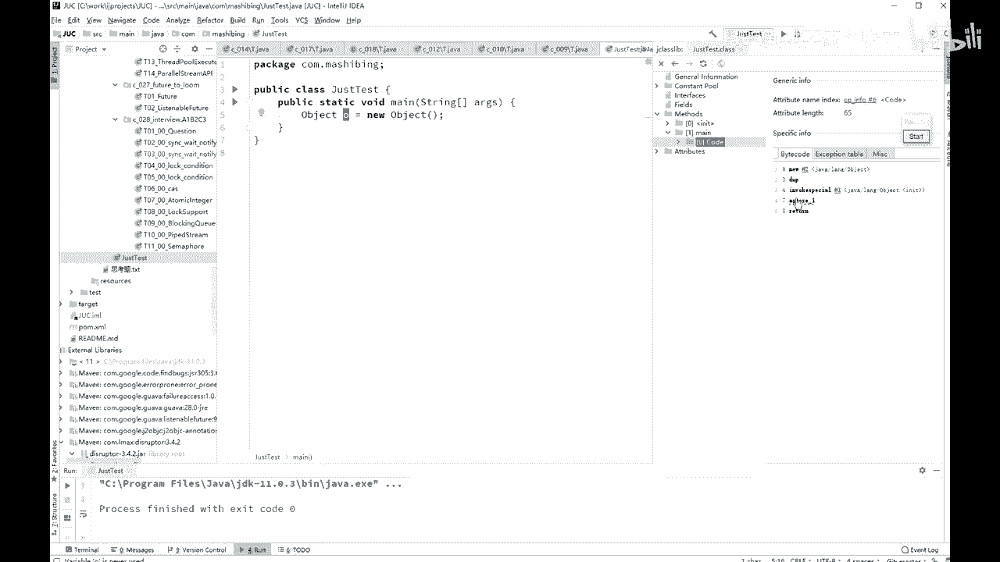