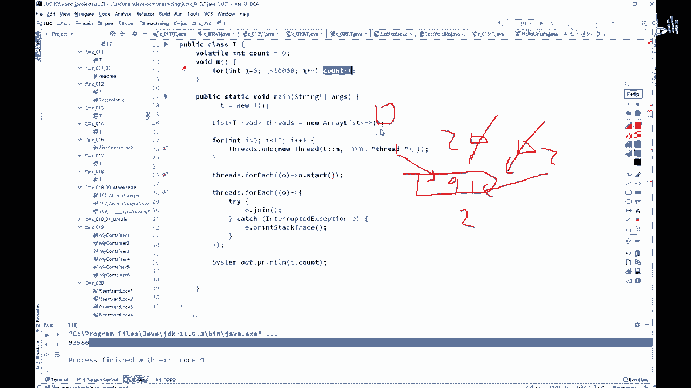

# 舍不得花27980买马士兵教育的MCA架构师课程？免费开源马士兵教育VIP课程 - P43：【多线程与高并发】Volatile不能保证原子性 - 马士兵北京中心 - BV1VP411i7E4

Oh。嗯。okK好了，同学们我们继续上课啊，看这里嗯嗯。嗯，那么word tell呢刚才我们说了，它能够保证现成可见性，也能够保也能够呃禁止指令重排序。呃，微上呢它并不能够保证原子性。

lo条是不能够替代 synchronize的，这个千万要注意。那么什么意思呢？我们来看这个小程序啊，小程序也比较好玩儿。what cell in the count等于0。接下来有一个方法。

MM呢循环了1万次，让com加加。那么com值呢就会变成9999啊。好，看这里。会变成1万啊嗯。6T呃，我做了一个现程。作为一个list似的list似里面全是现场。聊后取了10个线程。

I等于0I小于是I等于2，然后stres点艾。这个现程里面调用了M方法。10个县城每个县城都调M方法，那一共加了10万次，对吧？

把所有的线程都启动。等所有现程结束。最后输出这个值。嗯，同学们考虑一下。由于我加了窝了条了，每个县城在访这个值的时候呢，一定能是能读到最新的值的。来能不能告诉我最后这个值是多少？

有没有什么问题，会不会是10万？我要不加波了条，大家想想肯定有问题嘛。

你先说不加波了跳。

不加窝了条78000。

好，我们家乐嘉乐宝乐条。

家乐格乐条，你想一下，哎，这个时候是我的新的值一旦改变啊，我的另外一个现生是马上能看见的。另外现生马上能看见，他就应该拿新的值啊，拿新的值来加了，对吧？他正常应该是10万呢。800。

再跑一遍。65000。又跑远。做晚身。反正总而言之是到不了10万的。原因是什么呢？分析一下。原因其实很简单，虽然说你count的加加这块呢。你是保证这个count值改了之后啊，能够。被别的县乘客看点。

但是看光看点没用。呃，现在这count的值是0，第一个线程确实它是一它加了一下啊，变成一了，他把这一写回去了。然后第二个线程也读到这个一了，第三个线程也读到这个一了。所以第二个线程拿到的还是乙。

第三个线程拿到的还是乙能理解吧。所以第二个性能加完是2，第三个性能加完也是2，两个写回来呢，最后还是2，不就少加了一次吗？

所以归根结底是说这count呢count这个值是保证了可见性，但是countt加加本身。它并不是原子性的一个操作。那有同学会说，老师countt加加，这不是一句话吗？它为什么不是原子性？刚才你看到了。

你没有object还是一句话呢？在java的内幕会分成好多条指令来执行。countt加加也是。

这个我在后面。讲虚拟机的时候才会讲到这个指令的问题啊。客看加佳呢本身它会分成好几条指令，至少三条。

所以中间被打断的可能性也非常大。因此，loc了条是只能说。

呃，保证现成的可见性，但是呢它并不能够是替代 synchronized的但保证不了原子性。这句话能不能理解？

