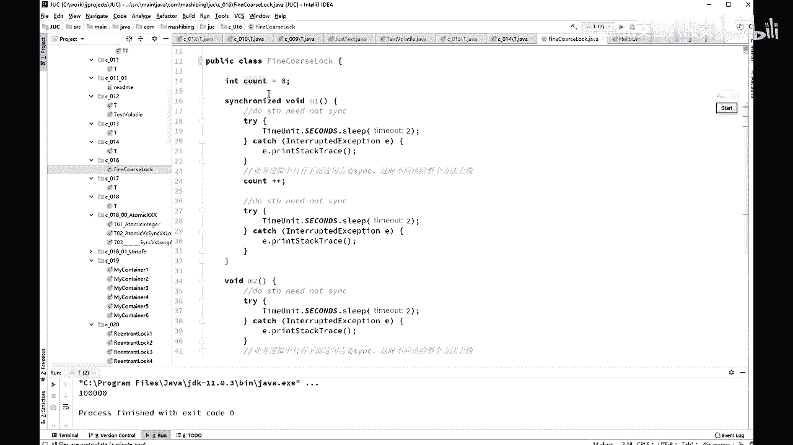
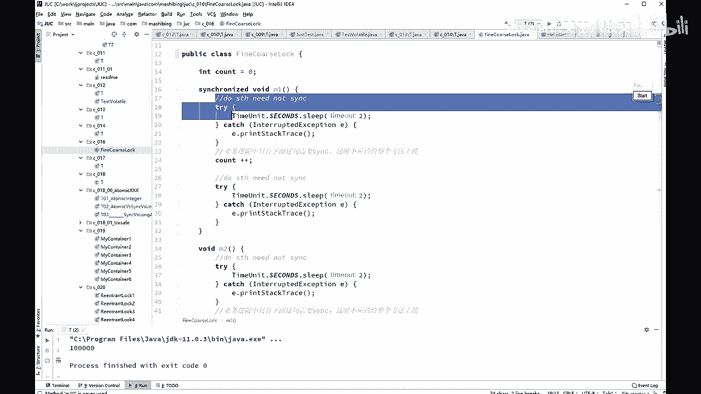
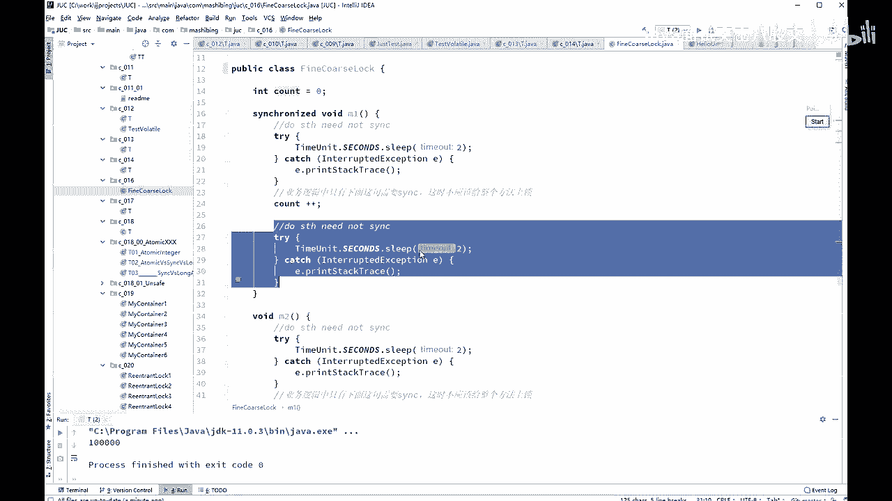
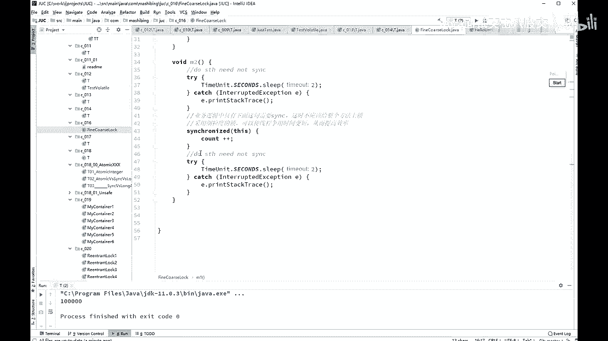
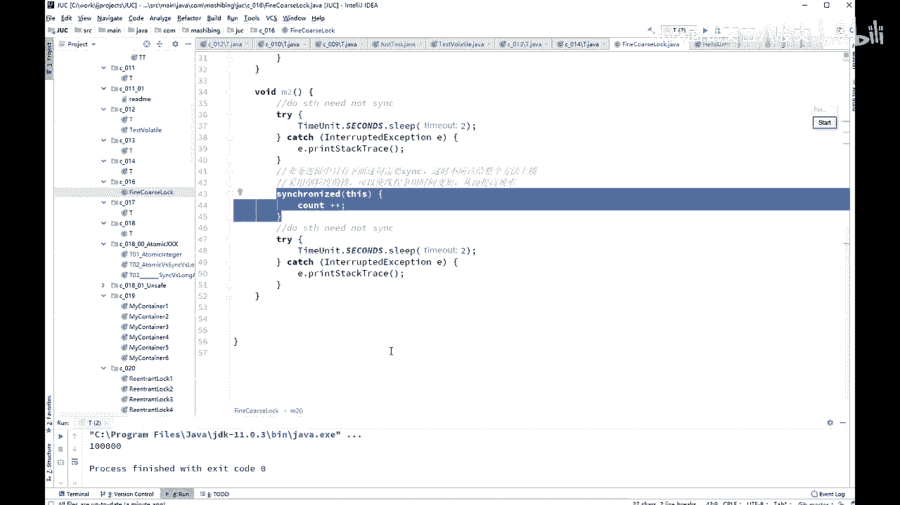
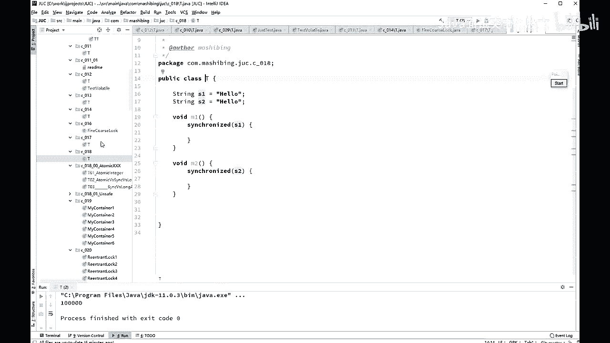

# 舍不得花27980买马士兵教育的MCA架构师课程？免费开源马士兵教育VIP课程 - P44：【多线程与高并发】synchronized优化 - 马士兵北京中心 - BV1VP411i7E4

啊，我就就是就是现成这块内容啊就特别好玩。你如果按照逻辑来讲的话呢，它是这么一个顺序，1234567是吧？77的内容。但是你如果按照优化来讲呢，它这些优化的内容呢可能分布在不同的里面的。

不同的这这个这个步骤之上。所以优化呢我我讲到某一个问题的时候，讲到优化我们就谈一次，讲到优化我们谈一次，好吧，这优化呢所优化这个问题呢，其中有一个就是把锁力度加变细啊，还有一个叫把锁力度变粗。

却说都是一回事儿，什么意思呢？作为Cpro宅子来说，你这个锁呢要。这种不是很很剧烈的前提之下，你这个锁呢力度最好是要稍微小一些。好，我这个小程序呢叫fine course， fine是细化的。

co是粗糙的这个意思啊，fine course look什么意思？看这里。

呃，如果说我们这个M方法啊，它假如说前面有一个有有一堆业务逻辑，后面有一堆业务逻辑。

这业务逻辑呢我用sleep来模拟了它，然后中间是你需要加锁的代码。那么这个时候你不应该把这个锁加在整个方法上，而应该加在哪儿呢？只加在。

靠在加加上。听懂我能理解的意思吧，这非常简单。

这叫做呢锁的细化。那有的时候会不会进行锁的粗化呀，有有有没有有没有？没有了。你们能想象一种情形，让你对进行所优化的时候。不是细化，而是让它变大变粗。有这种可能性吗？能想象吗？考虑一下。

争的特别频繁的时候，没错，假如你这个锁，由于你锁的力度呢越编越细啊，特别特别。越变越细哎。好，越不用心好多好多小的细索啊，就跑跑在你这个上面。

这个这个这个这个方法某或者说某一段业务逻辑里头好多好多特别细碎的锁。那你还不如干脆给它弄成一张大锁，它的征用反而就没那么频繁了。嗯，也会容易容易死索是你写程序的问题。你程序写的好也不会发生4索。

我说的优化呢是是说你程序没问题。但是你可以有进一步的更好的写法，这个叫优化。这个时候呢你可以某些情况是可以进行锁的粗化的，把锁加大。这是没问题的。数据库的一张表。你在某一行所有的行上都加锁。大哥。

我跟你说，你的效率就会累死。随便的读写，某一行上都加锁，那你不如把整张表都加不加拉锁得了。嗯，这个所粗化所细化的问题呢，是一个概念上的东西，它并没有一定之规，理解这个概念就可以了啊。好，关于这个小问题。

我们过了没问题吧，有问题的老师扣一啊，sorry有问题扣2，没问题扣1。我们以后没问题，永远扣1啊。H。那好，下面又是一个小概念，很简单，很直接就能理解。所以我速度会比较快，你认真听。锁定某个对象O。

如果O的属性发生改变，不影响所的使用，但是O变成一个对象一定会。产生产生问题。什么意思？objectO等于6object。如果我们把它中所 synchronized的O。

但是你在某一种特定的不小心的条件下，你把O变成了别的对象了。大哥。这个时候现成的并发就会出问题。这事儿太简单了，因为我们刚才说过。这个对所呢是在对象上头上的两位来代表的。

你这个县城本来大家伙都去访问这两位了。结果突然之间，您老人家把这把锁根儿变成了一别的对象，去访问别对象那两位了，这俩之间还有关系吗？俩现生。没有任何鸟关系。因此，你如果用对象做锁的时候。怎么写？

同学们来告诉我怎么写。😊，不让它发生改变。Okay。所以你会看到别人的那些大牛的人写的程序啊，它非常非常的规范和细化。这个final它是少不了的嗯。啊，很简单啊，没问题吧，有问题提没没问题扣1啊，继续。

😊，sring这个类型嗯，我我已经讲过了，不要用s stringring类型来作为锁。

