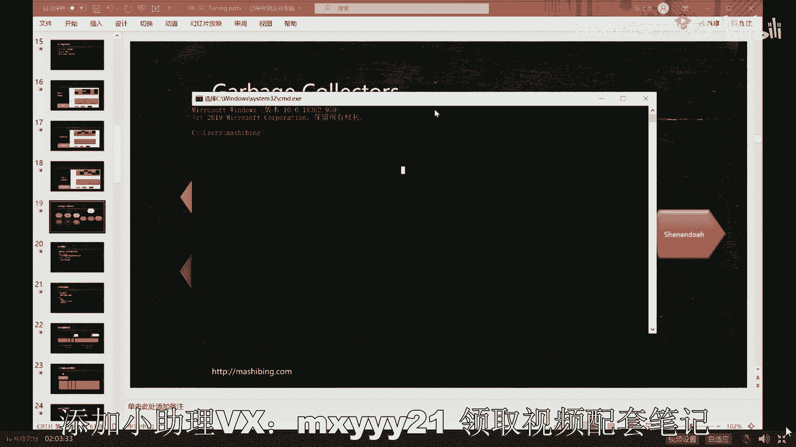

# 舍不得花27980买马士兵教育的MCA架构师课程？免费开源马士兵教育VIP课程 - P7：【JVM调优实战】垃圾回收器Serial与Parallel - 马士兵北京中心 - BV1VP411i7E4

最开始最简单的垃圾回收算法呢叫做cereal，就是这种cereal。当然，cal有两个，一个叫cal，一个叫ceal old。有同学会说了，老师它为什么分成俩，原因是。

为了因为你你要把一整块内存用统一一个算法来算的话，怎么算都有毛病。为了综合运用。最开始的时候啊一直到现在为止吧，这地块1。8默认的都是把内存分解成为两个大的年代。看一下。这两个大年代呢分别叫做新生代。

一个叫新生代，一个老年代。我们怎么区分新生代和老年代？这件事特别简单，就是刚刚诞生的对象优先的往新生代分配。有同学可能抬杠说老师那个个特别大的会怎么怎么样。😊，不用抬杠，别着急，那些都是细节。

我们先把最基本的概念先掌握新生代老年代。学东西是要分层次的，先把最高层次的先掌握啊，然后再慢慢去纠哪些细节啊。😊，好，看这里。一个叫新生代，一个老年代，新生代是什么意思呢？老年代是什么意思？

新生代很简单，刚刚诞生的对象，特别年轻的对象，年轻的。刚溜出来往这儿扔。然后有一个是老年代，老年代是什么？经历过一次垃圾回收的，我们任何一个对象说来了一次垃圾回收过程啊，垃圾回收进来了，扫了一遍。

没把你给扫走，说明。你长了一岁，这个对象长一岁，当年龄越长越大，超过一定阈值的时候。它就会升级升级到老年代。这个意思。那为什么涉及新生代？为什么涉及老年代？原因是。

如果一个对象经历好多次垃圾回收都回收不掉，说明他是老顽固。他如果是老玩固儿的话呢，我们就不要每次都扫它了，我们把它扔到老年代去。什么时候内存里装不下了，我们再扫它一遍，把里面的东西全部清掉。啊。

它效率上会会会提升，不用每次都扫它。那么新生代的概念是什么？新生代的概念是一般来说。扫他一遍，这个新生代的时候，很多对象可能就被我给淘汰了，就只有一个活下来。那么就直接把它扔到这个空间。

扔到新生代空间里头，我就频繁的扫它啊，反正扫一次，说不定就把你给情回回收掉了，这是新生代。那么这个时候呢。就可以根据不同的对象的特点，你发现没有？我们根据不同对象特点，就可以采用不同的算法。

我们在新生代里面采用什么算法呢？新生代的算法叫做复制算法叫做copy算法。在老年代里头采用什么算法呢？采用我们的mark sweep，就是把它标记出来清掉，这是一种或者是mark compact。

或者是markwe和mark compact的组合。我前期先进行markwe，后来觉得呃碎片块太严重了，我就对对它进行一次整理等等。所以不同的年代算法不一样。因此在GDK早期的时候啊，一直到现在吧。

JDK1。8都都都支持这种分带算法，分带分带模型。这就是内存的分带模型。但有同学会说啊，我我叫到这大家还能跟上吗？能跟上给老师扣个一来，没问题吧嗯。😊，对对对啊，应该没问题。好呃。

这种分带模型呢到目前为止，这K。8默认的垃圾回收器，它叫做PSPO它依然采用的也是这种分带模型。分带模型直到现在，只要你内存不是个儿不是特别大，它依然运行的还可以。如果说你个儿超级大。

然后需要调优的时候，你这种分带模型它有天然的毛病就已经不行了啊，这个我们后面再说，我们下面来解释，年轻代呢这个拷贝算法，它是怎么拷贝的。我们理解的拷贝算法不就是说我们一分两半儿。

然后这边用完了拷贝到这边来，这边用完了又拷回来等等，不就这样吗？但是并不是。😊，年轻代的拷贝算法是根据工业实践统计出来的结果。一般来说，一次年轻代的回收，我们称之为minorDC或者叫YDC。

一次年轻贷的回收，这个回收它会回收掉90%对象。举个最简单的例子，你一个for循环里边不停的扭扭出来很多对象。除了这个for循环，这里面扭出来对象就没有了。好，就所以你回收掉的话。

一次性可以回收掉大量的对象。😊，根据工业实践的统计，人们发现扔到年轻的对象经过一次垃圾回收被扫掉的可能性90%。如果这样的话，我就没有必要说你想想看啊，我就没有必要分成两半了。

因为你一次剩余的对象就10%，你复制过来就占10%空间。哎，没必要这么浪费空间，占这分成两半，我可以这么来分，它默认的比例叫8比1比1。他是这么这么来复制的，怎么复制呢？一个对象产生的时候。

优先放到伊甸区，伊甸园区人类诞生的地方。10个对象放进来，一次扫描之后扫掉了9个。活着的扔到40万1。虽然它是这个比例是一，但是由于我们活的对象特别少，没关系，它已经能装开了，能撑开了。

然后整体空间全部回收。这是呃。整个的这个这个年年年年轻代回收的这个算法。OK好，那这个算法下一次呢下一次我我又往里头分配了对象了，又分配了10个，又扫掉了9个。那这时候怎么办呢？

你还往svivver一拷贝吗？不是下一次是把这个一定区跟这个svivber一。😊，这哥俩一块扫描。把这个swive一活着的放到另外一个svivver，把一恋区活着的也放到另外一个swivivver。

然后把这个svivver一和一恋区全部右都清掉。当然下一次呢就把这个svivber又拷拷回来。😊，啊，这过程很简单的，不知道我说清楚没有。😊，呃，有没有同学有疑问的呀？DMOU。

说剩余对象拷贝到别的地方，引用地址会跟着改变吗？你你挪了地儿了，你家原来住2号楼308，你挪到你挪到1107了，那引用不不跟着变吗？你不跟着变还能找着你吗？大哥。中文你还用问。没听懂啊，没听懂就算了。

没听懂呢，让自己放松放松。就当个故事，当个卡通听。swi装不下呢，你猜猜看你拿大腿想想，如果s外装不下了，你会往哪儿扔？老年代嘛老年代是最终。承受最终的。好。所有的装不下的东西的地方。不要了，疯了吧。

你。😊，你的业务逻辑不要了是吗？计算计算着突然一堆数据我不要了，太任性了。服。😊，嗯。服你了，好吧，再也不被这事撒尿了。两个surviver是什么关系？大哥，你还没听懂啊。

第一次扫描活着的都扔到这个svivvever，那第二次扫描也不能活着的往这个slivivver扔啊，扔到另外一个嘛，这个svivver就清掉了。下一次呢下一次把这个servvivver活着的又返回来。

把这个关掉。😊，好吧好吧好吧。😔，这么费劲吗？来看看看看看看看动画看动画。我我其实想偷点懒儿，不想给你讲这动画了。没想到你。这么费劲。一个对象产生优先往占空间分配。但是我我们暂时先把这个细节略过，好吧。

先不管。他会往一恋区里去取。如果经过扫描之后，他还活着。svivever一下一次扫描它还活着。svivber2，然后sveber一就清掉了，听懂了吗？然后swiver2里面还有火了。

又回到swiver一，然后svivver2和一点又清掉了。300什么时候年龄够了？老年代搞定了吗？好还有没有谁要疑问的？来，这块没问题的，给老师扣1。什么时候负DC？你问了一个触及灵魂的问题。

每一种不同的垃圾回收算法触及负GC的时间点。和机会点它都不一样。总而言之，言而总之，最简单的说法叫做对象分配不下了。我就要GC。老年代会满吗？你拿大腿想想，不断的由对象往里面升升级升级，升级到老年代。

你说他会满吗？好，他满了之后怎么办呢？他满了之后就会诞生FDCFDC整体回收。所以年轻代的DC经常会发生，什么时候会发生呢？年轻代满了就会产生年轻代DC。什么时候会产生总的DC呢？

全DC负DC老年代满了。就会产生fluor d say呃嗯。淘宝不知道说清楚没有啊，小伙伴们嗯。😊，Good。这里面细节太多了，你看看你还要跟我说，还要跟我聊finalize，还有还要怎么怎么怎么样。

大哥，别这样啊，这样聊起来的话就真的没完。好，看这里。发回来啊，你记住我还是那句话。你永远记得我的学习方法是最重要的。先把这里面所有的大体的内容搞清楚，然后再去钻研细节可以吗？老师有东北味儿。

你咋知道的呢嗯。你是咋知道的呢？Yeah。marGC大哥，你拼错了，叫mar GC。是。嗯哼。😊，数DC不是在永久带吗？我的我的老铁呀，你你先听我讲吧，行吗？

你们就别在这儿混混混了吧唧的这些概念混来混去。什么叫永久带？😡，永久的叫permanentgenium permanentman area。永久带这是永久带的含义，这个是放clance这些原数据用的K。

好，perman area它在1。7之前和1。8之后，这两个是有不同的区别。1。7之前这个东西叫perman area，1。8之后，这个东西叫mat space，叫原原空间。好，这两哥们儿无论他怎么变。

都叫做med area。以前有同学总是把这仨概念混一起，别这样。你既然到我这儿了，我就给你把细节给你揪开。就是你不读java虚拟机规范，这概念你是搞不清的，当然也不用你读，老师读了，讲给你听就行。

抽奖啦。为什么我又没说9点我又没说9点半抽奖。好。下面我继续，我先把整个垃圾回收的故事给你们讲清楚，好不好？没事这样是年轻呆吗？😊，mes area是另外的空间，既不是老年代，也不是年轻代。

它是另外单独的空间。好，我们先把这故事讲清楚，随着内存大小的不断增长而演进，我们大概明白了什么叫做分带算法，对不对？好，在明白了，大概明白了什么叫分带算法之后啊，我们来看看。像这个图先先不不给你们讲了。

这图要讲起来就又没完了啊。好，看这里。你不要想这一节课把所有细节全掌握啊。大哥，我这讲了好几十个小时的课，你非让我一节课讲完，那也不不可能的。😊，好，看这里啊。呃。从呃内存特别小的时候。内存很小啊。

这这Java刚诞生的时候啊，那会儿内存特别小，大概就几兆到几十兆，就就就这么少啊。我记得那会儿8兆8兆内存是吧？呃，几兆到几十兆内存。😊，Shit。好。几兆到几十兆嗯。Yeah。这样一个内存。

这个内存啊它的那个采用的垃圾回收器呢，就叫做cereal。这cereal特别简单，我稍微给你一说，你就明白了。你看这里也给。根据JY messagejava虚拟机规范的定义，seal是什么呢？

叫做esttop the world copy collector which uses single j thread说读一下来叫做esttop worldsto world世界停止这个词呢叫STW。

S T， W。这个很重要，你记住这个词儿以后就说SCW不要跟人说世界停止，或者说什么什么什么什么乱七八糟的，不要不要这么说，就直接说SCW专业，显得你特别专业OK。

copy collector with uses a single G thread使用了一个单线程的GCGC线程。形象一点儿。咸阳鸟是江子弟江子地。你们那哥仨，你你女朋友，你男朋友好。

在里边扔线团扔到一定程度，满了满了怎么办？好，这哥们儿是工作在年轻带的。满了满了咋办？很简单，你妈妈进来了，哪里来着一根扫帚，来了之后的第一件事儿。😊，你们仨给我停。

stop the world业务线程全给我停止停。到我了，你们仨给我停住，不许再动了。😡，不管你什么。😡，什么姿势什什么什么动作，不许再动了，因为我要清理垃圾了。

接下来你妈妈就顺着你们三捋捋捋捋捋捋捋到的这些全都不是垃圾，把那些垃圾全都清清除掉。听完了之后说你们仨继续go on，等你们仨又玩了一段时间，又满了怎么办？你慢妈又进来，停stop。😊，然后。等他清完。

你们仨继续。听懂我的意思了吗？这一个县程。对。这就叫STW叫stop the world进来给我停止，停止之后，垃圾回收去干活。由于他工作在年轻代，所以他叫做拷贝color。使用了单线程。

一个线程就够了。为什么一个线程就够了呀？好。看好。为什么有见人就够了，很简单吗？😊，因为内存少啊。空间特别小。Yeah。Yeah。年轻的也是这样的。老年代。也是这样的，老年贷也是单线程。

等年轻贷回收了很长时间，老年贷转满了产生负D息的时候怎么办？😊，也是单县城，你妈妈又进来了。它这时候老年代的叫做esttro world max compact collect that uses a single d thread依然是单线轴。

只不过他这时候是工作的老年代，in斯达的算法是标记清除或者标记压缩，或者标记清除完了这之后，碎片化过于严重了，怎么办？进行压缩。可以了吗？同学们很简单吧。😊，来可以继续的给老扣一。这就是sal的算法。

ok。所以这张图啊我们翻回头来再看又去哪儿了。你看。我一下就把这哥俩给讲了。好，这是常用的组合。那么下面我觉得我都不用怎么讲，你就明白了，下面叫什么叫parous gal，这句话什么意思呢？

就是当你的内存越来越大了，同学们内存越来越大几十兆到上百兆，甚至到一个G的时候。Yeah。这个没有一定之规啊，就是他跟你的业务是有关联的。什么时候你觉得业务不好玩不好使了。我告诉你。

你这个时候就得考虑所谓的调优第一步换垃圾回收器，这种垃圾回收器不好使了。同学们，你们想想。为什么内存变大，单线程就不好使了？很简单嘛？你原来啊你们家3平米，你妈妈一个人蹭蹭蹭两秒钟就扫过来了。没关系。

停两秒没关系的，很多。这种业务啊暂停2秒钟，卡顿2秒钟没关系的，可以接受。或者几几十个毫秒就扫过来了。没关系啊，可以接受啊，没有问题。所以在这种情况下。你单县程就完全没问题，但是你们家现在变大了。

你们家现在是100个平方，100个平方。你妈妈一个人要清理过来，清理一次性清理100个平方，要清理多长时间？太长了，半小时。妈呀，有没有人能够忍受半小时，你的程序不动。你们现在正在进行双十一秒杀。

用户下单之后，突然间半小时不动，你的服务器没响应，为什么没响应？因为你们哥仨是不是都在那STW都在那蹲墙角呢？😡，听懂了吗？所以。这时候单线程不够不好使了，拿大腿想想优先采用的解决方案是个啥呀？同学们。

多建成吗？漂了。哦，这种叫 parallelel，叫并情。多现场。好，变行多线程工作在年轻代叫做 parallelelcaage，工作在老年代叫paralel old。如果用图来画的话。

就是最开始是你们哥你们你们哥仨在这里工作，突然间。满了满了怎么办？你妈妈，你爸爸，你姥姥，你姥爷一块儿进来。😊，你们仨给我听，然后。他们四个一块干活，迅速的帮你清理掉整个的垃圾。来，你们仨继续。

周而复始。好。这就是zeal和zeal old parallello scavvenge和 parallel old它的玩法。讲错误了吧，哪里。哪里错了，你说出来。🤧。是朋友no。你错了，孙汉南。

parlo gal，parlo old，这哥俩的组合。这是经常用的，简称。PS加PO。强妞我还没讲呢，你着啥急？😊，我告诉你。你你们你们生产环境里头啊，我告诉你1。8，如果你们生产环境用的1。8。

你没有换过任何垃圾回收器的时候，恭喜你，你的默认垃圾回收器就是这哥俩，请你给我记住它，它叫做PS加PO。叫p sc，叫parlo old。哎，有同学可能会说，老师，我怎么知道我用的是哪种垃圾回收器呢？

严格讲，这是明天我要讲的内容。但是今天呢既然你们问到了。就稍微跟你们说两句，可以说两句吗？对这样来说，你只要敲一个指指令就可以heit。什么情况？

。嗯。😊，java杠XX。frame迎 come flag回车，当然带一个带带带一程序或者带一个version吧。好，这里呢它会把呃你加格区拟已经启动的时候，默认的那些个参数全给你列出来。

注意看这里面有个参数是什么？叫做us看了吗？来看一眼。这是你java启动的时候，默认带的参数叫做什么？叫做us parallel。哎，那有同学可能会说，老师这个us parallel到底是个什么东东呢？

放心，像老师这么体贴的难言。肯定给你做了笔记了，是吧？how you parallel是个什么东东呢？你，找着看啊，我找着看我记在哪儿了啊。😊。

Here。这个us parallel d呢指的是okK就是 parallel scavvenge和 parallel old的组合。好了。你可以继续了吗？可以继续，老师扣一了。😊，那这个笔记在哪呢？

明天找小姐姐拿。我今天稍微给大家调整调整。好，到现在为止，你们听起来应该相相对比较轻松吧，也不太难吧。因为你先建立比较轻松的整体性的树干，我们再去追究那些树叶子。哎那时候你就轻松好多PPT给不不给。好。

我刚才讲了两种组合了，第一种是ceal的组合，第二种是plor的组合。调优的话呢，我明天给大家讲讲这块儿怎么调优。因为JDK1。8，只要你没改过，就是这哥俩，好吧。好，我们继续。随着空间越来越大。

现在不是几十兆到上百兆1G吗？现在空间变得更大了。现在是。1G或者几十兆到什么呢？到。第十记。数十计。好，我告诉你啊，到数十级的时候，你会发现，无论你怎么玩儿。你采用多少个人来啊。

你说我采用我我调一个团的人来来帮我parel嘛，原来原来只有一个，后来我把它变成N个多个四五个，四五个不够使了，我来我来四五百个行不行？我来一万个行不行？这里面就牵扯到一个操作系统的最基本的概念。

就是线程是不是越多，它的效率就越高。是不是线程越多？效率会线性提高，是这样的吗？不一定。明明确说。县城到达某一个预值之后，它的效率反而会降低。Yeah。原因是什么呀？原因又回到了这张图。

刚才我看最开始我讲这张图的时候，老师就就就就就同学们不是说老老有这张图。没错，原因就回到又回到这张图。为什么？因为一颗CPU的核或者一核的CPU同一时刻只能执行一个线程。假如我们有16核。

最多在同一时刻能执行16个线程同时执行。哪怕你使用线程撕裂者啊，最多也就是说四核八线程、8核6线程，总而言之它是有数的。就算是你16个县程。同时在运行。那么你这个时候派了1万个县城过来。

你猜猜看会发生什么会发生排队和切换，什么意思呢？就是。我这1万个县程，我每一个都要让他有执行机会，我怎么办呢？我就执行你一会儿执行他一会儿，执行你一会儿执行他一会儿。在执行你的过程之中，把你拿走。

把它拿进来。😊，好，这个过程叫做线程的切换。线程切换本身也是需要消耗CPU资源的。如果现程数量特别多的时候。上下文的切换context switch，这是它的专业名词。好。

现程切换的所占的资源就超过了县程本身运行。所占的资源。所以CPU会把大量的时间用在线程切换上，它的效率反而会降低。不知道我说清楚没有？一一个厕所只有8个蹲位，最多有8个人往里蹲在里头蹲着。

后来来了8万人，你猜怎么着？怎么办？CPU就把这8万人排好队来把你拎进去。蹲110个毫秒，把你拎出来，换另外一个。注意你们哥几个排队协调这个资源，CPU也得管着，所以CPU会把大量的精力浪费在这个上面。

因此，不是人数越多越好。所以在在你到达一定阈值的时候，到达啊好几十个G的时候，我告诉你你再增加多少个线程，嗯，没有效率提升不上去了，这时候怎么办啊？这时候就诞生了惊天地气鬼神的concurent的玩法？

Concurrently就会中。刚才这声音有点泰俊的味道，太太太你个头啊，说太俊吗？是蛇赛花吗？好，这个叫做concurrent d。我告诉你。垃圾回收器里面有哪些是concurrentDC呢？

here著名的承天启后继往开来，历史清史有名的CMS concurrent mark sweeppe。以及和他配合的朋友。好，继续。Thank。替代CMS的G1。后面的ZDC。后面的悬念咒啊。

这些所有的后面所产生的全都是concurrent。Concurrent。Okay。好，我们先来说明什么叫 concurrent。那到底什么叫坑 current呢？concurrent的意思是是这个。

Here。concur的意思这个。Concurrent意思是说。当我垃圾回收器干活的时候，你的业务现程可以继续。what这叫concur呢知道吧？并发，所以所谓的并发指的是GC县程和垃圾回收现程啊。

sorryGC现程垃圾回收是一个GC县程和业务现程。我主要有没有看你们认真听讲GC线程和业务线程可以同时在运行。原来都啥样，原来是GCE运行业务线程就得给我STW都得给我停住。

dtop the world。现在不需要了，现在没关系啊，咱家特别大，已经变成500个平方一栋别墅。你们姐儿仨在里边玩，随便玩你们的，你们在旁边玩着啊，我们我们这个妈妈爸爸爷爷奶奶姥姥爷作为摄像师哦。

sorry作为呃垃圾回收者就在旁边捡你们玩出来的这些垃圾啊，你们边玩，我们边边捡垃圾，边玩边捡垃圾。你们随便扔吧。那这时候就会产生一种什么现象？这时候产生的现象就是。我的应用程序永远有想要。为什么？

因为我业务现成在这里跑着呢，我当然有响赢了，所以这是concurrent的本质。嗯，不知道我说清楚没有。来能get到这一点，同学老师扣以。嗯。当然。这里面就会产生各种各样特别麻烦的问题。同学们。

你们想想看。我我我往这边一边扔垃圾，你这边一边捡，万一我扔一会儿。你呢扫描完这个对象说啊，这个对象是个垃圾，但是万一我一会儿又把它给捡回去了呢，对吧？他又不是垃圾了呢，你把它清掉不就。玩的完蛋了吗？

而且就重样的还有还有一个叫做万一我。比如说。我我我我我我我本来啊这个对象呢，你扫描它不是垃圾，但是我玩着玩着，我已经把它的连线给他剪断了，它又变成垃圾了呢？你又怎么处理？😡，就给标错了。

所以就会产生各种各样的问题。是不是啊，同学们。好，这是concurrent。我们先来介绍concurrent的这种呃开天地开天辟地的第一个啊。

就concurrent的呃呃。