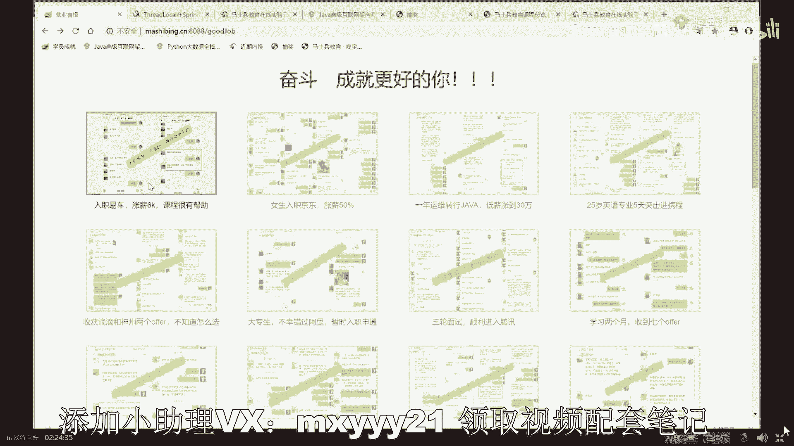
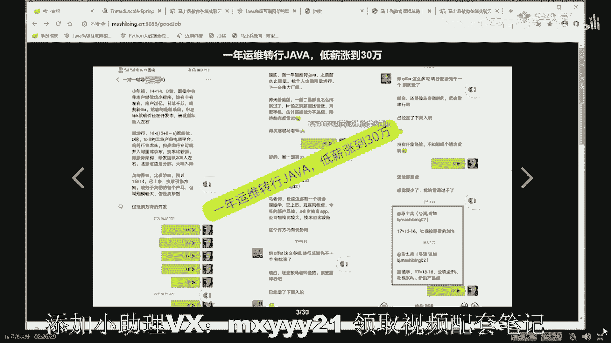
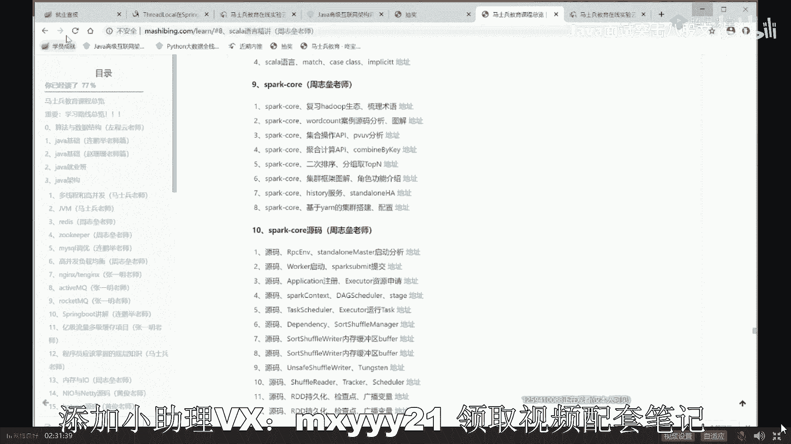
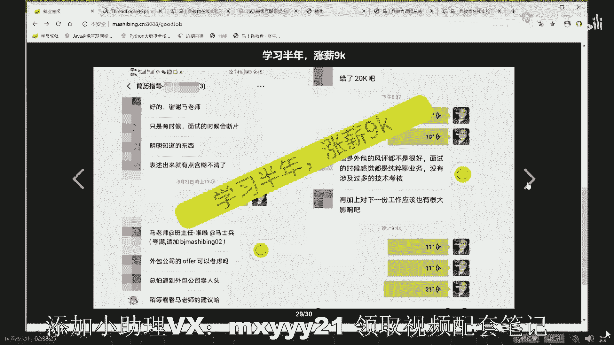
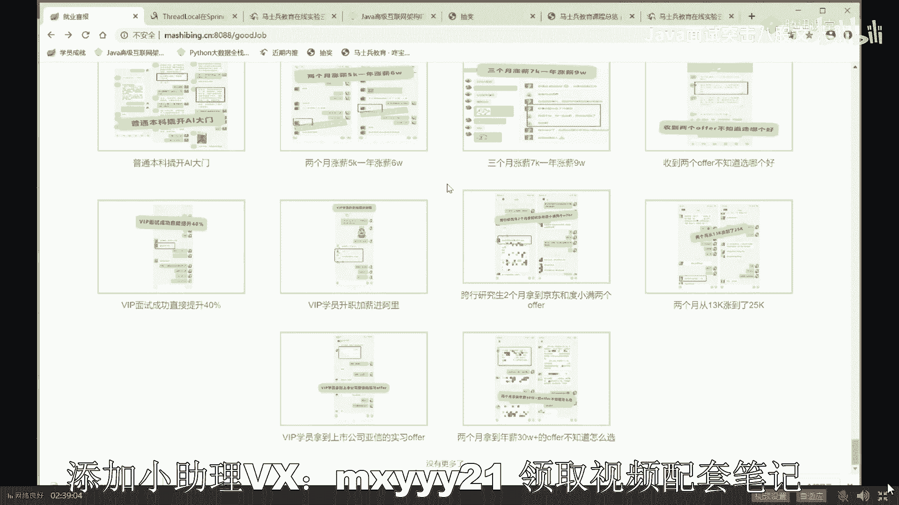
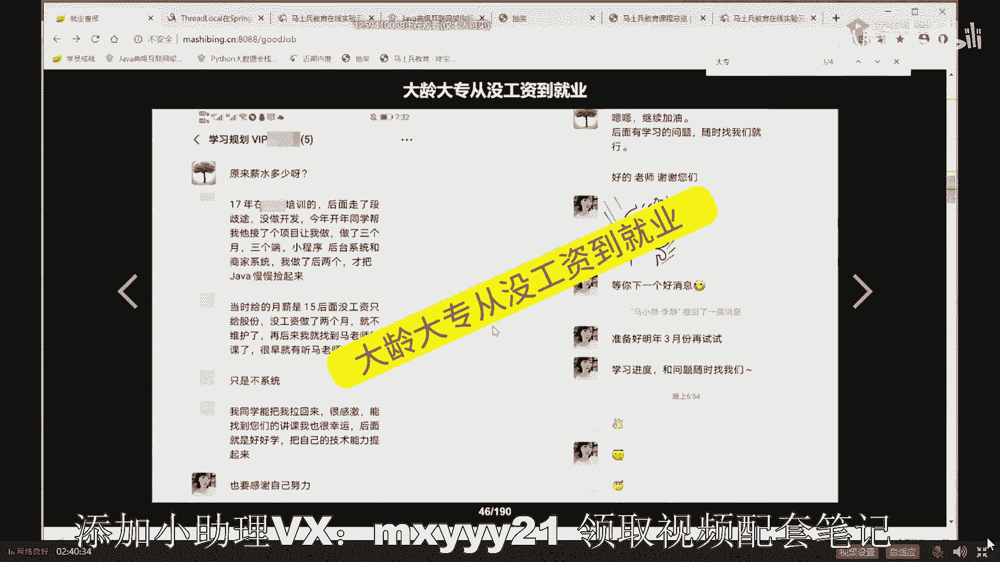
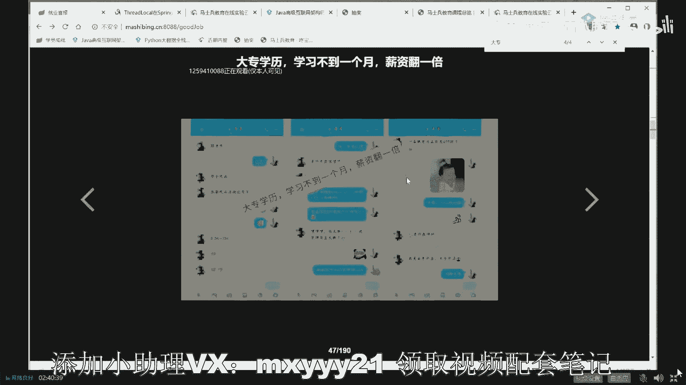
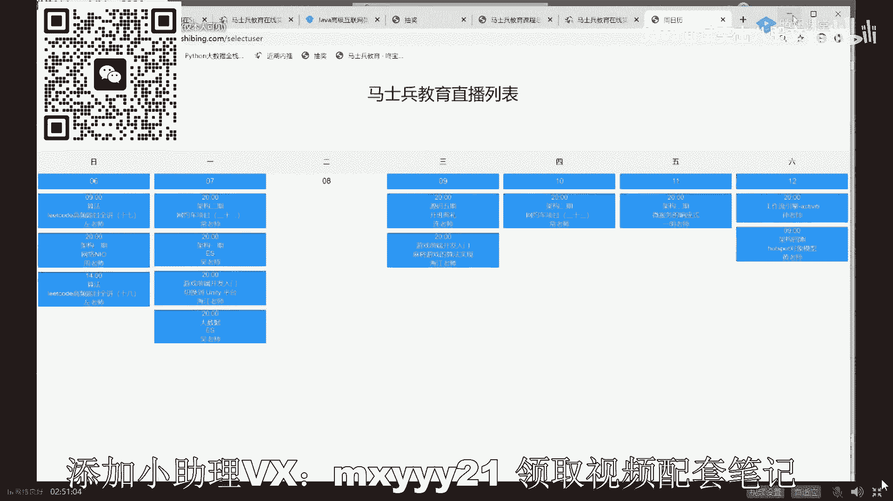
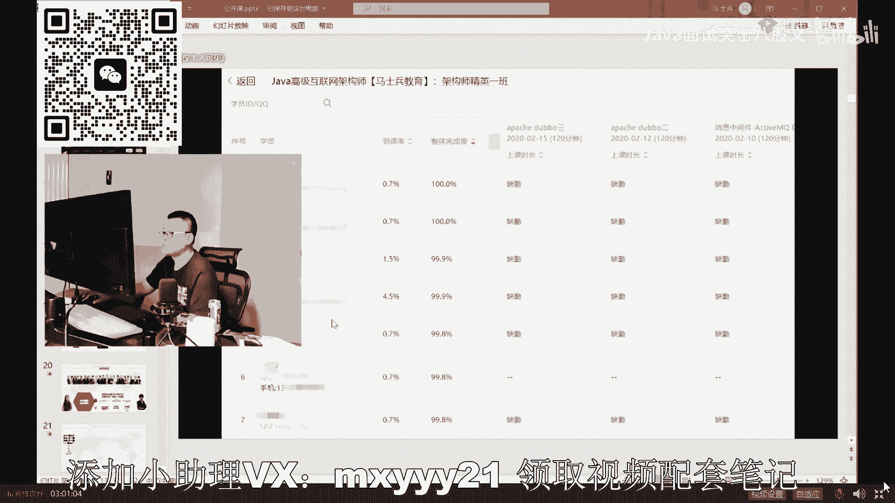

# 系列 4：P9：【JVM调优实战】著名的三色标记算法 - 马士兵北京中心 - BV1VP411i7E4

okK这里。CMS。他是这么来玩儿的。他的原理呢也非常简单。虽然说从最底层角度讲，它由6个阶段构成，但是你跟面试官聊基本聊够聊聊通这四个阶段就可以了。这四个阶段分别是什么呢？分别叫初始标记、并发标记。

重新标记并发清理。11。1点来讲，他很容易理解。这里面最难理解的是这个阶段，这个阶段就是著名的三色标记算法。今天看时间吧，好不好？现在已经10点了。看到里。呃，这是。它的四个阶段四阶段是什么呢？

初始标记初始标记的意思非常简单，就是找到根儿上的对象，找到那些root对象。大家知道我们垃圾回收过程就是从根上开始找。先把这根上的对象找到这部分叫初始标记，注意它依然是STW的。

但是他SDW时间会非常短，为什么？😊，原来的SEW6时间是要你把所有工作全干完，所以它时间非常长。现在这个SW6时间，你只要找到根上就可以，根上对象毕竟没那么多，所以。这个SCW时间特别短。

一一般来说没有多长，所以没有关系。接下来就是最重要的阶段。这个阶段是什么？这个阶段是我们的业务线程继续，不管你有多少个业务线程，几十个，或者你们哥仨，你们几十三随便玩儿。你们在哪玩的时候，我垃圾回收器。

就在工作了。垃圾回收器开始工作，我就开始找哪些是垃圾，哪些是垃圾，哪些是垃圾的是垃圾。你一边玩着，我一边清着，我一边标记着啊，不能叫一边清着叫一边标记着啊，这个是垃圾，这个是垃圾，这个是垃圾。

这个不是垃圾，全给你标出来。😡，等我标好了之后，注意它一定会产生错标。错标主要有两种情况。第一种情况是。好好听我讲，原来这哥们是个垃圾。原来这哥们儿是个垃圾，但是呢运行过程之中呢又有一个引用指向头了。

okK他就变成不是垃圾了。这种的你后面不能把它给清掉，你得把它修正过来。还有的呢，原来这哥们儿不是垃圾，有人有引用纸箱的运行过程之中呢。好。引用没有了，它又变它就变成垃圾了。好，这是两种经常见的情况。

这块大家能呃听得懂吗？这块是最难的内容了，concurrent里面就是CMS里面最难的内容。嗯能能盖到吗？嗯。讲错了吧，宋海强。一定是你错了，你放心，我这不会错。凡是怀疑老师错了的，你们都错了。

引用没了，怎么又会引用回来，我一会儿讲给你听。😊，那个叫做先引用了，然后我们的垃圾回收器以为引用没了三色标记，我一会儿讲给你听好吗？引用没了也能引用回来。我告诉你。😡，虽然情况比较特殊，但是完全可以。

比如说缓存你命中了。然后你那些没命中的，你要清掉了，突然之间他又来了一个命中了。比如说你重写了finalize方法，原来死了对象你又给他复活了。😊，放心啊，我这儿没错，我这没bug。

成员的bug就像自己的内裤不会展示给别人的，放心。Okay。总而言之，会发生两种情况。就这两种。这两种情况最终都要进行修正。好，这个修正过程要重新标记。修正过程不能让原线程继续，业务线程再继续的话。

那你不断的新错误再产生了肯定不行。所以从整个的CMS角度，一共有两个阶段是STW的，一个是初始标记，一个是重新标记。毕竟出错的不会特别多，所以重新标记的这个STW时间也不会特别长。好。

最后呢我标完了确确定标清楚了。这就这个哥几个是垃圾，那哥几个不是垃圾，好嘞。并发经历清理完了之后，下一步。好，这是大体的过程，这里面有很多细节，最差的最多的细节就在这儿叫做三色标记算法。

著名的三色标记算法。勾浪采用什么算法？狗浪。知道吗？三色标记。是。那小点点问SW了怎么能出错？大哥，你看看这是SCW吗？我说的是出错，是在这出的。嗯。😊，三色标记勾浪也是啊。

所以你不要说那个java超勾浪，别扯。好嘞，下面我聊我我详细给大家讲。这个问题可以吗？就这讲这有点难。今天我告诉你，我讲完三色标记就没有时间讲G one。

就没有时间给你们讲G oneZDC she能doahexllent。你是想听Jg还是想听三色标记，你们自己挑。都要。Okay。我能做广告吗？我告诉你想听全了，找老师报VIP来。我VIP啊告诉你啊，那个。

我先不跟你说，我们VIP课程有多牛，我就直接先跟你这么说。😊，就是我们的VIP。全中国我们要说第二，没人敢说第一，我VIP课好吧。呃，内容先给你解释，我们VIP课有一个非常显著特点。我们叫做快速有效。

注意快速这件事儿超级重要。叫做不仅有效而且快。有效。而且快。快点写错了。姚急，我今天肯定给你讲完，不管是三色。还是。还是还是Gone哪个都成。快速有效。这是我们原来VIP学员，全部都是真实的截图。

你自己随便看。非常非常的给力。呃，我我我大概给你打开几个看看，好吧，这这好像是最近的啊。如果你要是跟着我们。

每天的课在跟的话，你会发现这个页面会天天更新，每天都有新的这入职一车涨薪的6K啊，课程没有帮助啊，课程是很有帮助的。其实不只是面试，实际工作也很有帮助啊。😊，这个是我们呃一个女孩入职京东，涨薪50%。

呃。其实给大家看呢，你就你会发现呢老师呢除了给大家讲课之外，还给大家。告诉大家怎么去面试，怎么去对付面试官，怎么去跟HR聊啊等等。最关键这哥们儿这姐们儿有点后悔。果然像你说的，我是少要了少要了。

我是我要少了，一分钱没砍，直接成了啊。他原来十6要了23直接成了，要太少了，亏了。一年运维转闸了，低薪涨到30万。他原来那个他原来是一年一年的运维经验转到粘了。经过我们我。

然后赵老师周老师在一个群里头不断的辅导他，看见了吗？这一个群里头是6个人，6个人里头只有一个学生，剩下全是老师。然后一年日月为准的占了，地薪给干到了30万，这就我们课成特点啊。课程特点叫做特别快。

然后呢又又有效。好，听我说，我先简单跟大家聊一点点课程的特性。不过别着急，我一会儿就会给大家讲后面的内容。呃，所以我们课程来讲呢，有这么几个特点。第一个特点呢叫做课时特别长。我们课时超长。长到什么程度？

我们已经讲完的课大概是已经是2000个小时左右。

这个是我们讲完的课啊。这是我们讲完的课。如果要从头拉到尾的话呢，基本就没完了。你你你可哎。啊。从最基本的。Yeah。Yeah。到。太多了。继续啊往下拉。到进阶的到网络。

到Junit注解反射前端的没稳的嗯多线程的啊。我今天给大家讲的呢，实际上是JVM的部分啊，所以这里面每一堂课都是两个小时，这这内容非常多啊，reis zookeeper。

myxico高并发activeMQsp boot一级流量电商嗯n。好，ELK区块链my catDBC，然后架构算法项目，网约车第一节二版3版TDDspring cloud。然后整个架构大数据还有。好。

不玩了，不演示了，太多了啊。好，我跟你说，就是这个课的特点呢，这是第一个特点就来了。😊，第一个特点叫特别长。好，第二个特点呢叫特别深。因为只有成才能比较深，原因是什么？你课时不够，我想跟你讲特别深入。

那不可能的。第一个超级长2000个小时以上，有同学可能不明白这个概念。我直接告诉你，同学可能大多数的凡是跟你说，每周四每周三次课，每次2小时，你自己去算去。他们这课讲一年差不多也就300个小时左右。

我们是2000个，是它的7倍。我们要照他的速度讲，得讲7年才能讲完。但是我不是这么讲的，我们讲的非常的深入，我们只有讲的课时特别长，才会讲的非常深入。我会深入到每一个算法。

比如说我今天给大家讲的三色标记，我们要给大家讲的G one，我会跟深入到每一个算法，每一个源码，知道吧？深入到那个hosport的源码来跟你聊G one里面到底是怎么进行分区的。好，听我说。

讲的这么深入，同学们的第一个观感一定是说大哥，你这个太过分了，我怎么才能学得完啊？就这是我们课程最大的特点，就是我不需要你学完，你也不要学完，你慢慢学。你首先拿到你想要的。

然后再跟着老师慢慢练这辈子你就跟定老师了，永远让你站在技术最前沿。我们怎么教你呢？这么来教。你入学之后。我我们有呃专门的老师来了解你的什么呢？了解你的基础。了解你的诉求。帮你设计一条最短达到目标的路线。

沿着这个路线进行一对一的定制学习。可以这么说，我们是一个大学的选课制，一堆的知识点。一堆的项目。作为老师来说，你想拿到一个，比方说你想涨薪5000最简单的要求了。3个月涨薪5000。

老师就给你拿出A加B加C，再加一个项目搞定。举个最简单的例子，作为社招生，你已经参加过工作了，你想涨新的6加2。3个月之内搞定。好，作为。比方说大学生，我想进大厂7加1加1。

最好的是大二和大三跟着我们练，这是最好的时间。基本上你学校不是太差的，保定大厂。好，老师，你说我特别着急，我已经辞职了，我想短时间内回到行业，涨顺带涨点薪水，一个月之内3加1搞定。老师，我想全系列提升。

我们MCA架构师带着你一个项目，带动你N多个知识点全系列提升。老师，我零基础。A课程一直到MCA。从零基础一直到进阶半年左右。老师，我那个想进某一个特别牛叉的厂子，他特别看重算法。左老师的左神算法课。

左神算法从最基础的数据结构，最基础的算法开始。到BAT体格的刷题班。搞定。好，这就叫做一对一定制学习。全网唯一，没有第二家。笑容。我的人说老师这是能行吗？自己看效果就行了。

25岁英语专业5天突击进携程，携程回复19乘15啊这个。他那哪说了5天，我记得啊。看了吗？5天后你面试携程，也是想突击一下，定制一份学习规划。对，5天突击携程就直接给了19乘15。有逼吗？为什么？

因为我告诉你了，注意先学脉络后学细节，老铁们。学习方法叫超级重要。滴滴神舟两个offer。大专生不幸错过阿里，暂时入职申通申通，他为什么不幸错错过阿里的？我告诉你。

当时啊他在入职申通的时候面试阿里的那个HR给连着给他打了8个电话，他都没接着。惨了，不然就进阿里了啊。嗯。阿里三面的时候正在四面的时候打了两两次，8个电话都没接到，都在面申通，太惨了。史上最惨大专生。

三轮面试进入腾讯。这是明哥给做的指导。其实从这里面你会发现，我不知道大家发现没有，在这里面呢会有老师的大量的指导过程啊，我的民歌的连老师的、周老师的、曹老师的都有。左老师的啊全有。呃。

有很多时候呢就是大家伙在学习的时候，很多人的学习他没有方法。他也不知道把时间一小时，我该用在这个地方呢，还是用在这个地方。我是去抠这些细节呢，还是去掌握整个脉络呢？他根本不知道他不知道重点。

所以全部都浪费了，太浪费了，不要这样。在咱们这儿有一批牛逼的老师就直接带着你。今天你该学啥，明天你该学啥，啥你都不用想，你人过来，我就让你长薪，就这么简单。你只要人过来听话就行，你听话我让你学啥。

你学啥剩下的什么怎么面试，怎么写简历，怎么优化简历，怎么去投递这件事你全都不用想，全交给老师就行了。我就需望你做到一件事，听话。以前有人已经吃过这个亏了。我记得我们有1个30多岁的女生，知道吧？找找。

哇，这个。看到吗？哦，这是39岁的一个呃小伙儿，这是大大专专科学历。薪蕊翻了一位啊，他只要听话就行。OK。😊，是。还有一个看看这个了吗？38岁大龄女成员，年薪4万，听话就行，就怕有那些不听话的。

就是我因为我知道我作为老师这么多年的教学经验，我知道你应该把重点放这儿，你就拿到大厂offer了。你应该把重点放这儿，你就轻松涨起薪水来了。但是你是自己是不知道的，我一会儿学他一会儿学习，一会儿云计算。

一会儿学习一会儿大数据，一会儿学习，一会儿后端感了兴趣聊聊前端又有这个有时间了，聊聊shall，你扯淡呢。集中精力工益点。好，把这点躬身了，比什么都强。而这一点功在哪里，每个人其实是不知道的，我们知道。

今年重点。大厂的重点是四个方向，你们知道吗？我一说哎，我知道你不知道。所以老师给你带来的是什么呢？你原来是带来的你的你的你的这种。呃，发展机会，改变你人生轨迹的机会，知道吗？什么叫人生轨迹？

就是你原来是这种路线，如果没有人带着你没人指点你，你就是这种路线慢慢往前走，到一个程度开始往下跌。跟着老师走，跟着我们20位左右的认准了。因为课堂上有很多很多抄袭我们的，知道吧？

但是他们没有这种这么多的老师，也没有呢一线大厂的这种工作经历。一线大厂工作经历很容易就能找着的。比方说他说在阿里工作过，你问他花名是啥？阿里一查就能查着，知道吗？比如说你想问我们老师的画面。

随便问黄老师画名博熙自己去查去，一定能查着。我们20位一线大堂的老师带着你，你的人生曲线是这样子的，所以别后悔。千万千万抓住呃，就是跟我们跟跟我们飞的这个机会。OK。呃。

我们课程呢大概是每个课时在55块钱到7块钱。呃，你不要看总数，因为人家的课时是300个，知道吗？人家课时50005000多到6000多，但是你自己算一下，人家每课时是20块钱到30块钱。

我们每个课时5块钱到7块钱，性价比超高。同一课堂都受不了。同一课堂说不行，你们再这么玩的话，我不允许你们送这个送那个，不允许你们把这么多的课时怼在一堂课里。Sorry。到目前为止，腾讯可能受不了。

一直在逼我们拆。目前还没有还没有拆拆开。如果要拆开的话，我告诉你MCA会拆成P5P6P7P8。四个可，但就不拆了啊，现在不拆。全给到你，因为有的人的基础不一样，有些人认为他具备P7冲P7水平。

实际上他连P5的内容都没掌握住。我可以这么说，在座的诸位，99%的人有一些屁股的最基本内容，你没有掌握住。比如操作系统底层，比如我就问你0X80的标用过程。80终端调研过程，这是阿里P9面试的一道题。

你能答出来。很多很多人都答不出来，好吧。哪个计存器放的什么参数，你能答出来，你答不出来。这是我们听话的同听话的同学看到了吗？我特别想在公开课的时候能够多影响一些人，让他们在职业生涯规划中尽快走出迷茫。

但是人家会以为我是兔儿，所以只能先忍着啊，你别来了，没事儿。托儿呢到处都有，不用，我们这没有托儿，也不用当托儿，不需要VIP学员来这当托儿，直接看结果就行。半年涨了9K的。

滴滴快手双offer的。这个没有加载完啊，加载完的话就太多了。还有像特特别有人的，就特别的那种那种那种有什么呢？有有有疑问说老师我大专能进大厂吗？

我有很多每次每次讲这课的时候都有都有人问我说我大专时候能不能进大厂。有这种疑问吗？有这种疑问给老师扣个一来，我认识一下。陈润基对，石家头，没错，刘志祥。我给你搜一下啊，我不太想跟你聊行还是不行。

我给你搜一下。

这个是大专生，不幸错过挨里赞术这进行申通的。其实你刚才看到过了。阿里已经给他在四面了，能不能进啊？有绝对有机会。这是大专学历，收到多家大厂的offer看了吗？一鸣哥，非常感谢帮忙P开简历。

也感谢我们马上教育的课程啊，接触到不少的东西。😊，按照周老师的说法就认知偏差了。经过三周面试，我目前已经收到了不少的offer，后期我会继续学习，真是想不到大专学历的，我也不再只是那种中小型公司。

喊会去面试。所以小伙伴们啊，有很多大厂有一些大厂啊，是他是不太在乎学历的。一线大厂，我们认为中国有一中国IT界有10家左右的一线大厂，他们是头部。那么这十家大厂里头呢，有几个是不在乎学历的。

分别是阿里、京东、滴滴，这几个不在乎。当然，再往下那些二线的、二流的、三流的，也有好多不在乎的。小伙伴们，大专学历的，你已经改变不了你学历的情况下。请记住，加强另外一条腿就行了。技术。

说着我老师忍不住给你们看看点简历啊，大专生的简历算了，一会儿再说吧。呃。这是大龄的大专生，从没工资到就业啊，这个年龄比较大了。

30毫几了啊。大专学历不到一个月，薪资翻一倍的啊。

还有好几个就是大专拿拿两个滴京按那个京东跟滴滴两个offer的，呃，可能没记录大专生这件事啊。所以各位同学们，你们记住这一点，就是说学历呢在你改变不了的情况下，加强另外一条腿儿，没毛病。

你千万不要自暴自弃，大专生有的是机会。如果大专生候有机会，你们想想你作为。其他的这种学历的那就更甭题了。这是32岁大专生，这哥们拿了60万到70万年薪。有同学说怎么还不固定，因为他拿了9500股票。

这股票的来回的升降，他不一定。这个大专生。你仔细看看他的个人优势，他的写法，这就是学完我们课程之后的轻松可以写上去的东西。😊，瞅一眼。5年夜样开发管理经验，这个有点夸张，负责项目日活300万。

注册人数1。3亿。这个项目上的呢有点稍微有点夸张。高吞土低延迟分布架构分布分布经验。一会儿我有机有时间我给你介绍介绍我们课程内容就知道了，这是我们的一个非常擅长的一个点。呃。

JDK的各种集合队列所多线程高并发NL相关底层制能原理，这都是我讲的。数据结构与算法设计模式。我跟左老师讲的GC垃圾回收算法，丰富JM调学经验。我现在正在讲给你们听的。5条大厂就已经向他开门了。

660万到70万。当然我们课程要是学完是什么水平？我课程学完大概大概是这种水平，你真要能学完。大概是这种水平。自己看。给大家时先读一下吧。你真要学完啊，大概是这种水平。没有精通的废话，你跟着老师学。

你就精通啊。你要听完我这个M课，不敢写精通的那你这是是你太太太把老师看的太低了。😊，还是一个啊，就是我们这儿的课说第二，没人敢说第一。随便倒。不继续讲课了啊，讲讲讲讲讲。😊，看完这简历我们就讲行吗？

还想看吗？不想看我就关了，想看我就带你们看看。😊，简历我可不敢写精通，懒洋洋，恭喜你，你以后尽量的什么都不要写精通。然后我的学生们都写精通，你猜猜看谁会拿到面试机会。傻不傻呀？Okay。上什么怎么样。

随便他上什么下什么随便好吗？我不是针对谁啊，是针对所有人是吧？嗯，有有的人可能呃广告做的比我们好啊，这个影响面比我们宽，但是就课程质量随便玩。你拿大腿想想，我这的老师可是来自于BAT勾一线的。

而不是在线下干了很多年来回来去翻来覆去讲的那些老师，好吧。我们说还是那了啊，我们要说第二，没人敢说第一。好，看这里。就是你你学完用整体课大概是这种水平。分贝系统架构。海量数据。高并发系统架构。

高可用加构高性能架构。O。项目水平大概是这种技术水平，大概是这种。好，这个小伙拿了多少钱？阿里的P7加。80万底薪加40万股票，120万每年。恭喜你最近跳槽了。叫做薪水，非常的具备竞争力。

叫做200万左右加股票。Okay。当然他有他的天赋，有他的优势，他的学校比较好。但是我想是这样的。我作为我们老师讲，我不管你的优势天赋，那是其他方面，我只负责把技术给你们讲到这种深度。听到了。

就是我呢我们我们这的老师就负责一件事儿，把技术给你们讲到这种深度。就行了。他这个学历是本科，但是他学校比较好，好吧。但是你就想吧，你就算不是科班，你薪水比他低。你拿他3分之1薪水行不行？

啥学校这有点那个隐私啊，反正不是清北啊，但是他学校确实也很不错嗯。嗯。你就想吧，你就拿它3分之1左右的，然后慢慢以后慢慢长嘛，怕啥？😡，核桃花生礼哇塞。你们是怎么猜出来的，怎么那么牛刀。😊。

好了好了好了。😊，呃。说这么半天呢，今天晚上呢，金金明金明吧金明我们都有一个秒杀，但你不要错过啊，我今天晚上既然是第一天，其实第一天没想打广告的，结果聊着聊着开始打了广告，打一点就打一点。

我们今天晚上金九涨薪剂。我们MACA马兵认购架架构师的这个课。涨薪最快，20天内让你涨最快的。最慢的90天。最高涨薪500%，这不是说着玩的。有同学说老老师涨薪还能500%的涨呢。他我也奇怪呀。

但是人家就是长上了，有一定的狗屎运，只能这么说。你找找这哥们啊，留着呢。你像这种5K涨到15K的这这都算是相对简单一些的啊。就是那个这么这么跟你说。

其实这里面帮助你能够走出来的最重要的一点就是老师在群里头真的是手把手。步步指导你哪步没走通的，没关系啊，都有一堆牛人带着你。找找。找找那哥们儿啊，就就这个应该是这个。啊，问我CMS三个过程。

三色增量remarkFDC。啊，不不不不是这个哪个来着？哇。找不着了，找不着了啊，你你们你们自己可以去找啊，这个这个这个界面就是这个呃这个网址就在这儿啊，你们自己上面看就行了啊。

每一个都是非常真实的一个聊天记录。这聊天记录里面呢，你们要体会老师在这里面花的心血，你知道吗？😊，你会发现这都是一个很很明显的一个互动过程。我觉得呢教知识这块我们肯定没问题。

但是其实最重要的呢是在服务这块。就是我们的这个服务呃，应该也是number one，好吧。嗯，他是大概原来在长沙拿5。5K，然后跳到杭州，直接拿了25。接近5倍啊，就这么强。呃。

今天晚上呢有10个秒杀名额，0点之前秒杀截止。今天晚上找腾讯申请的8000的大额优惠。如果我们要不申请优我们课程呢是非常贵的。今天晚上申请完大概5到7块钱一个课时1万1万多的课啊。

报名呢送你一个樱桃红红豆键盘，你要是不要可以给你折现。9月9号首次开启的源码班。今天晚上报名送了。15号我们开始讲多线程的第二版左老师的算法全都有。好，如果有有有有意愿的去找我们小姐姐。

骚or扰他们一下，好吧。随便找哪个小姐姐都可以。当然你已经加上小姐姐，就不用不用再找其他的小姐姐了，不要三心二意。啊，要用成专业OK。折现多少钱，你问问小姐姐，这个是他们市场部定的OK。好。

我呃是这样啊，你们骚扰小小姐姐，我来我去上一个小小的厕所。回来我给大家讲三色标记吧。三色。今天讲高兴了，我讲完三色之后。在顺带的给大家讲讲G oneZGC Sheandoahepllent。可以吗？

要可以的话，给老师扣个一。一般上课什么时间？晚上8点到10点，周末所有的时间。就我们课呀。我我我我觉着啊你们一定要擦擦亮眼睛，一个是什么什么什么点呢？就是呃现在有好多网课。

这是肯定的网课呢有很多是每周就三次课，每次就2小时。小伙伴们。同学们，你们拿大腿想一想，每周三次，每次2小时，他得讲多少年才能达到我们课程量？这种呢想讲深的不是扯淡吗？怎么可能？我们的课是怎么上的呢？

这是我们一周的课表。嗯。这是我们一周的课表啊，这周课表还不算不算多的。我们课表一周最多的，找找看上上一上一周的这是上一周的，看到了吗？每天都有课，每周末都有课。不断的在更新。当然这是我们课程特点。

我们课程特点就是特别全。所有点基本全有，然后每个点都在独立更新。更新更新更新更新。然后你需要的时候帮你组合，组合好了之后，老师再带着你整个一条路全部走完。这周还不算太多的。这周呃今天晚上好像没有那个。

周二那天没有没有没没有VIP嗯。

呃。慎掉忘了啊，我我我我我我去我去拍空一下膀胱，大家稍等我片刻。5分钟最多5分钟。在这个时间段找一个别的老师算了，你你们稍微等我一下啊，回来我再跟你讲。三四标记今天讲高兴了，都给你讲完了，好吧嗯。😊。

这个膀胱不足以伺候你们了，得去排空一下。🤧。Okay。Yeah。Yeah。嗯。Okay。嗯。今天白天呢睡的比较多，我跟你说，原来呢都是基本上我晚上就讲俩俩时课。呃，2小时算多了一个半小时。Okay。

今天白天睡的比较多。今天晚上讲开心了，主要你看。今天晚上又失旭东在。石旭东啊，哎，正是因为有你在。今天晚上多讲一些，好吧。Okay。呃，课程是怎么学习的？直播加录播，老师一对一辅导。你带着人来。

然后老师让你干嘛你干嘛？老师说这周把这个掌握。你就把这掌握住，老师说下周把这掌握，你就把这掌握住搞定。你说3月我想涨个新，涨5000来就是了。在这儿还没有人长不了新锐的，好吧。一对一是每周几次辅导。

有问题随时你一周有10个10次问题。就十次一对一。你如果一周有100次问题，就100次一对一。如果说想去快手呢，一共多少钱？一共1万多块钱吧，一万出头嗯。MCA对。我们要推我们自己的标准了。

因为我们讲啥他们都抄，你知道吗？我们说我们叫P8P7啊，他们抄我们我说我们说我们说P8，他们抄，我们现在就是整个java培训会界的标准，知道吗？

我们现在推MC叫马士兵 certifiedtified architect。那你再抄。2。对。😊，XCAX什么意思？X战警吗？😊，Okay。不好。你出个主意。怎么灭怎么用得抄袭。关紧抄完了之后吧。

他们就一个老师还号称自己有2000多个课。😊，拿大腿想想大哥。一两个老师三四，然后每周就讲三次课逗我呢嗯。😊，Okay。几个月可以去快手。你你说的非常特定的一个企业呀，我跟你说。

万一这家企业现在正不招呢。这个不能把自己锁在所有鸡蛋放在一个篮子里啊。我希望你面对的呢是整个这种水平的企业，你懂吗？我们整个企我们整个呃。课程呢是这种就是一流大厂。一线呃一一线城市一流大厂的水平。

至于说。二流的三流的，你降维打击就行了嘛，无所谓的事儿啊。快手现在只招外包。对啊，你要万上万一遇上人家不着呢，你你不惨了嗯。你让我想起了哪个老师？Yeah。怎么怎么让你想起的，我怎么没get到嗯。😊。

说好的回来就讲三次了。没错，你你先让我把这个补充点补充点营养行吗？先补充补充啊，毕竟老师6060多了。一口气讲太多也也够累的啊。嗯。这个课程是不是需要有很多年的经验，不需要没有从零基础开始的。没必要。

嗯。你来就是嗯。来就是了，好吧，解决你所有的难题就在今天晚上。我操60以为40对，你以为的对了啊，开个开个玩笑，开个玩笑，没那么老啊。😊，嗯。7几年的70年代人啊。😊，🤧小姐姐头像好漂亮。

这都是小姐姐的真人，不是头像。好。课程太深，听不懂咋办？从浅的开始。所有人啊都是从浅到深的。每个人都是从零从零开始慢慢走到这么深入的。你们知道你们你们为什么喜欢听老师的课吗？因为老师讲课也下功夫。

还是过期了就没了。呃，如果是录播，是终身都有的。如果是直播的话呢，呃现在腾有可堂限制我们有没有我们原来是那个终身制的会员，你都可以终身听直播，但是。现能有可能限制我们是两年。然后第三年。

你想继续听怎么办呢？88亿年88块钱，大哥总得有点仪式感啊。听得懂，但是过段时间就全忘了。恭喜你。说明你是个人。你要是听一遍全记住了，那你就不是人，你是神。嗯。嗯。😊，没关系啊。你拿张纸。

把重要点全给我记下来，没多少，老师都帮你总结好了。😊，你就干一件事就行了。😡，面试之前拿出来看看。吃饭之前，饭前饭后。变前变哄。只要你别你别变后变后变后用了就行了嗯。Yeah。运维需要往这方面转吗？

现在感觉上不去了。你看你多大年龄。如果你年龄比较大了，我建运维呢往两大方向。第一个叫做。那个CICD知道吧？

就是和开发结合CICD叫呃continuous integration和continuous developmentCICD这一大方向。第二大方向叫安全，这两大方向运维可以走。还还有还有涨新机会。

Yeah。は。便后用的饭前用啊。VIP课程没时间上怎么办？😊，其实我们VIP不太多，多数人。不会有所有时间全赶上。但只要效果到位就行，我觉着不用赶所有时间。没看能涂啊，就这样涂。这上我们课的到课率。

你看这哥们儿这倒客率，这哥们儿到课率是0。7。😊，嗯，1000堂课来7堂。但是整体完成度是百分百，看到了吗？没关系啊，你那个没赶上直播看录播嘛，录播还可以两倍速呢。而且你跟老师在群里，你有啥问题。

直接问老师就行，不用担心没有互动的，放心。

Yeah。你追求的是效果。Okay。10个，今天晚上。放完就没，不知道还剩几个，所以有需要的你抓紧找小姐姐啊，我喝完这点水，咱就开始下一步。最后一口啊。让我稍微吃点喝点。开始吃播是吧？2牛9随便看。对。

没错。腾讯课堂啊在哪儿？腾讯课堂。完成度什么概，有作业吗？呃，我们有的课是要留作业，有的课没有这个分课不一定。老师三七女怎么发展？一对一指导，我是需要了解你的背景的。就是你以前是做什么的？做了多长时间。

有什么项目经验，从哪毕业，分哪个厂子，哪个城市，这些都很重要。你这么简单一句话，我很难跟你说清楚怎么发展。🤧嗯嗯。Yeah。那就要我最后一口喝完，吃完喝完我就开始啊。要完三个月涨薪后。

再给跳槽搭成了的一对一指导，没问题。于是知道知道你到底。就是你相当于啊这1万多块钱买了什么呢？买了20位导师，这20位导师，你想听他们过来人的一些建议意见来就是了。像这些都是在阿里呆过的。

美团呆过的oracle呆过的银行呆过的。亚马逊外企待过的这种双大厂都待过的。就是这些人给你两句，你很可能就少走了很多弯路，你原来得绕着弯的才能走到这个位置。现在你只要直接就过可以过来了，少了很多坑。

这个不值钱吗？太值钱了啊。而且不要担心这点学费，第一个学费可以分期。第二1个，你这学费谁掏的？😊，三年之后下一个不是sorry，3个月之后下一个。接盘你的场子替你掏的。

因为3个月涨5000块钱是我们的基本承诺。我们对你的唯一的要求，让你学啥你学啥。老师，明天讲吧，要洗洗睡了，你先洗洗睡，我先讲啊。😊，好了，我们准备好了吗？要找小姐姐找小姐姐啊。

不少道小姐姐的我们准备好。我们开始讲比较难的难点，三色标记，三色标记超级难。我要讲完的话，基本俩小时。但是我先给你讲入门知识，你了解CMS到底是怎么玩的，好不好？😊，准备好的老师扣一来。哎，我跟你说。

老师从我这讲课，我就喜欢特别难的东西，给你拿什么来演示呢？动画。嗯。嗯。嗯。Yeah。Yeah。Okay。放心吧，我这讲的课你别的地儿都没都听不着的。😊，那个。我跟你讲三色标记，也许你在网上看到过。

但是你想在网上看懂三色标记真心没那么容易。但是我通过给你动画的演示，很容易你就能理解。嗯。来准备开始。下面我们要聊的是三色标记算法，用在什么地方？并发标记阶段。注意是并发标记。他还没有清理。

听我说还没有清理，只是在标记。回想这个场景，你们哥仨在这里不停的扔线团，扔线团，扔线团，垃圾回收器，在这里不停的找。哎，哥们是垃圾吗？哥们儿是垃圾吗？哥们是垃圾吗？在你一边扔一边找的过程之中。

会产生各种各样的问题。他的这个扫描过程是这么来扫描的。由于这个县程是隔一段时间才能运行，隔一段时间才能运行。所以你必须把上一次运行阶段要保存下来。上一次运行扫描到这个程度了。

下一次要在这个基础之上继续扫描，什么时候扫描所有的完事结束为止，然后才开始清理。这块大家能听懂吗？我再强调一遍，这个扫描过程是本身分了好多步，而且是不确定的。为什么？

因为现成的运行时间是由操系统来进行调度的。它调度的以及执行的时间片时间长，时间长时长都不是固定的。linux内核采用的叫CFS线程调度算法叫completely。fairness strategy啊。

complete fair strategy叫嗯嗯嗯嗯完全呃呃公平算法。嗯，它并不是平均分配啊，这这是完全两个概念。这是我这是我在讲操作系统课的时候讲讲的概念。在这就不跟你说了。总而言之。

我们开始对整个对象图开始产生标记的时候，垃圾回收现场在这里面会议运行好多次，每次运行完这个时间段段之后，一定要把这个。当前你已经标记到哪里了，给记录下来，我标记到这个对象了，还是标记到这个对象了。

还是标记到这个对象了，给记录下来。😊，这个概念能get到的给老师扣个一，然后下一个阶段再回来的时候继续。😊，那么怎么才能记录下来呢？它采用的方式叫做三色。标记算法。VIP课人也聊天嘛？

VIP课上就不怎么聊天了嗯。😊，关客聊天聊的稍微多一些。好，下面我们来聊三色标记。我们首先明白第一件事儿，什么叫三色。三色的意思是，在他标记追踪整个对象的过程之中，如果一个对象。他自己已经被追踪到了。

就是顺着线我们已经访问到他了，已经捋到他了。找着这线头了，并且这个线头的孩子们我也标记完了，我也标记过了。好嘞，这哥们儿叫黑色黑色对象有一个特点，就是当我下一次垃圾回收现程再回来的时候。

黑色的对象我就不再去扫描了。不再扫描。黑色对象不扫描了，为什么？因为他标完了，他孩子也标完了，那没必要再扫他了。所以这个呢叫黑对象。叫black。好，那我们在扫描的过程之中，我扫描到黑色了。

也扫描到他的孩子了。但是他孩子我扫完了，像这种的，本身他扫完了，这哥们儿是个不是垃圾啊，不是垃圾，扫完了。😊，但是他的孩子我还没扫到。这种叫灰色。那我们当我们垃圾回收线程暂停之后，再次回来。

发现灰色对象的时候，他干一件什么事儿呢？他不去扫描他自己，只去扫描他的孩子就可以了，继续往下进行。Okay。YeahYeah。古城我说的是标记清楚。标记清楚的标记过程不就是三色吗？哎呦我的天哪。😡。

这个累呀三色是解决什么问题，不就是标记吗？我第一句话就是说三色是解决标记还没有开始清除。😡，好，能能继续的给老师扣个一。那白的是啥？白的是没有便利到的节点。这叫白。Yeah。嗯。😊，这个。Hey。

 Bethley。这就是三色标记。当然。Yeah。有同学会说。那个老师我我我以前啊讲课的时候，真的有人问我说。老师，这这这这颜色是怎么标标识的呀？这这个怎么能把这个对象给给他染成黑色呀？😊。

这个呢我告诉你啊，你可以拿一把刷子把那个对象呢蘸点黑色的漆，就可以把它染成黑色了。听明白了吗？H。黑油戏讲的就是黑色嗯。嗯，原来是这样子的对。开个玩笑啊，我觉得问我这个问题的人应该是没写过程序。😊。

大哥，你的年龄是50，你的年龄是15，你怎么标记的呀？不就是一个变量吗？黑色白色、灰色怎么标记的？我告诉你，就是在对象上做了一个记录。比如说。有两位01代表它是黑色，1一代表它是灰色，10代表它是白色。

不用我讲了吧。那有同学可能会深究老师啊。他这个011011这些标记。是放在哪里的呢？😊，恭喜你，你问到了一个触及灵魂的问题，它是放在了这里叫m word。在m word里面。

8个字节的m word四个字节的class pointer，N个字节的instance data以及N个字节的padding。好，就在这里。这里面有四类信息，第一类三类信息，第一类叫锁信息。

第二类叫hash code。第三类叫GC。这个GC就是CMS的脑袋记录在这儿。Okay。又来了m克 word废话，前后都是相通的，好吗？怎么着，那还不给你来买味的了。嗯。好啦。当然那是另外的知识体系。

那个我也会讲VIP课里也全有。我们今天先来这套知识体系，这个知识体系是这样的。自己标完孩子也标完黑，自己标完孩子没标完灰。还没标到的白好。由于在整个标记的过程之中。

它的不阶段运行以及我的业务线程也在不间段运行。那么他会发生什么情况呢？第一种情况是这样子的。当我们经历一次时间段的垃圾扫描之后，扫描到这种程度了，还没来得及扫描到白色对象的时候。由于我业务现成的运行。

我B指向D的引用消失了。就会导致一种什么情形啊，就会导致我扫描到B的时候，找他孩子，本来我要扫描到D呢，扫描不到了。地会把我们被我们当成垃圾，他没有便利到。本来应该便利到。但是还没有便利到了。好。

这种情况会产生什么严重后果吗？不会，没有关系，大不了啥呀，大不了它就叫浮动了。你下一次我再次扫描的时候，就会把它当成垃圾给找出来。这个没有关系，所以这种情况没有关系，听懂了吗？最严重的是另外一种情况。

仔细看。这是最严重的情况，认认真真看理解了这种情况，理解它是怎么解决的，就理解了CMS。Okay。看这里。扫描几次。你扫描多少次，总而言之，你整个对象图扫完了为止嘛？你所有都扫到了，全都变黑了。

那就是扫描完了，这跟扫描几次有半毛钱关系吗？我刚才跟你说过，多线程线程的调度是被操作系统调度的，它调度多少次，每次运行多长时间，这事儿我们管不了。改到了吗？Yeah。好，我们继续。B纸箱D的引用。

这个时候注意看，在我们正在扫描的过程之中，我扫描完黑色了A扫描完灰色了，B，还没来得及扫描B的孩子D。这时我的业务逻辑开始运行，B指向D的引用。消失了。与此同时，A指向D的引用增加了。来再看一遍。

B纸箱D的引用消失了。A指向D的引用增加了。同时发出了这两件事儿。来，你猜猜看。再想象一下啊，在我们扫描完A之后，经过一次扫描一个线程，那就围绕线程运行了一小段时间。A扫描完了B扫描完了D没有扫描到。

下次回来的时候。你会发现发生了中间发生了这种情形，业务线正在运行的阶段，A指向低的引用产生了B指向低的引用消失了。同学们，你们发现没有？当我们下一次垃圾回收现生再回来的时候。

如果我们不对这个问题进行修正的话。还记得吗？A是黑色的。我会去扫描他的孩子这个地吗？不会。那我B本来呢能扫描到地，但是由于它的引用消失了，那我还能扫描到这个地吗？扫描不到。因此，这个D既然扫描不到。

你猜猜看是不是会被我们当成垃圾呢？所以回来的县城如果不对它进行修正的话，这个地会被我们当成垃圾。这个地不修正，就会把它给清掉。再看一遍，这是最严重的问题。第一次垃圾卫生现城标记到这种程度了。

在下一次标记中间。B纸向底的引销是A指向D的引用诞生。OK这个D就淡出了你的视野。你生了个野孩子，你们哥仨生了个野孩子，扫描不着。来get到这一点呢，老师扣一，可以继续的。嗯，go。好，怎么解决呢？来。

你们拿大腿想想怎么解决。应该把A的颜色清除掉，扫描不到是不是就不会被清除了，扫描不到的才会清除啊。大哥，你扫描不到的不就是垃圾吗？😊，对你看琼克杰斯啊，杰克琼斯啊，jackjones。

jack看人家是吧，大腿多么的发达，把A标成灰色不就行了吗？也就是说，如果有一个黑色对象，他的孩子又指向了新的对象的时候。你的程序必须得跟踪，如果这对象是黑色的，他的孩子。又指向了新的对象的时候。

OK要把它自己变成灰色，变成灰色有什么好处啊？变成灰色，就是下一次垃圾回收县城回来的时候。😊，会重新扫描他的海纸。修改B为白色，你疯了，这跟修改B为白色有半毛钱关系吗？小点点。所以这是。

这是CMS解决方案。CMS解决方案就是把A。换成灰色。白标灰就行了。看懂了吗？这种解决方案叫做 incrementalcrement update。所以三色标的是什么？CMS解CMS解决方案是什么？

应该都能get了。B要改黑色吗？B如果他已经标完，他孩子标完了，他自己就标成黑色了，这个无所谓啊。总而言之，你A改成灰色，下一次我回来的时候就知道哦，A是灰色，我又要扫描他的孩子好D又被我们扫描到了。

Very good。好。讲点更难的问题。还要讲吗？毕业这孩子对毕这个孩子已经扫描过了嘛嗯。