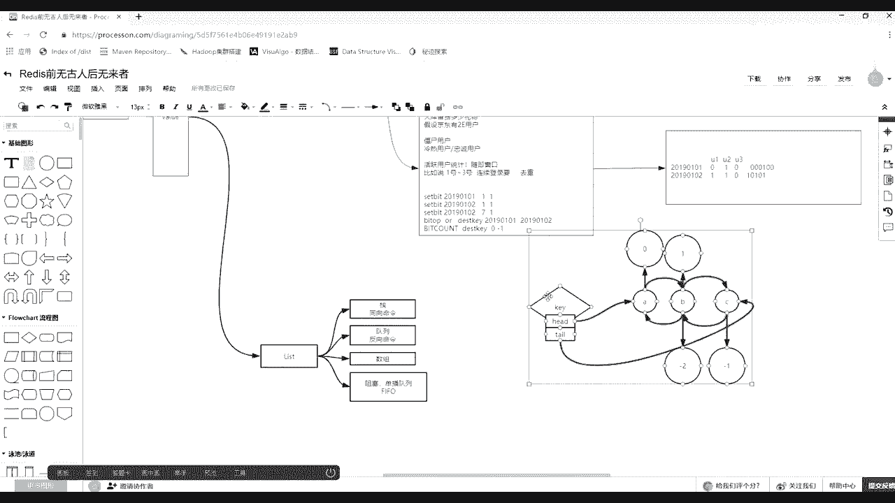

# 花了2万多买的Java架构师课程全套，现在分享给大家，从软件安装到底层源码（马士兵教育MCA架构师VIP教程） - P100：【Redis】redis中value类型--list - 马士兵_马小雨 - BV1zh411H79h

我们开始讲课，简单回顾一下，简单回顾一下，我们在学redis，我们在学redis，redis在一台服务器里面，它是一个进程，然后它里边会有默认16个库，然后你可以在一个库上创建很多的兼职。

对着对着对着队，然后呢建都是为都是一样的，这个k啊都是这个k都是一样的，只不过歪的里面有很多的文章，它的类型有很多种，我们之前讲的什么，之前讲的是string的一个类型，数值的操作，还有bt map位。

图，二进制位的操作，没有声音的话，我给打个字吧，我过完这个视频啊，到了就当做英国同学之类，马老师一块，没事这样的处理下客户端好吧，这是这是之前讲的，那么spring算收官了，给你讲完了。

他有这么多案例跟你说过了好吧，这篇翻过去之后说第二篇，其他的也行，比如说下面要讲一个list，然后讲一个list的类型，首先你要明白的是，还是那句话。

这个value reky当中那个value的类型是list，注意它的value的类型，list k还是一个字字节数组，一个字符串一个类型，那么一提到list，一提到例子你会想到啥。

就是每每提一提到历史的时候，如果你是一个coder做程序的，你会想到什么呀，什么是历史的链表了呗，首先你要想明白它的一个链表，这个一提到链表的话，列表的分为什么呀，列表分为单向链表，双向链表。

然后有环的和无环的，对不对，对对吧，它是一个线性的，也就是说这个我技能从前面找到，你就能走后面往前找，那么这双向的如果再来，然后最后一个就是首歌，不知道知道有10年以上的a一说这4年一个这个双向链表。

然后如果从最后一个我还能回到第一个开始，从第一个还能直接去到最后一个，那么这叫做有环的，那么一般我们很少去用用到那种有环的，就是一般就是无环的双层电表，这个列表，这个这个是你要知道第一个点可以。

比如第一个存了一个a，然后这里面存了一个b，这里面存了一个c，然后在rei当中，它的value如果是list list类型，你像这个value里面放了很多元素的话，这些元素就是这样去存储的。

然后这个时候注意它有一个p release key当中，我特意的在这都给你写一下，他的key当中有两个东西在key身上，一个是hi，一个是t，那么同位指针在k当中有这两个两个乘属属性有什么好处。

这个i的话可以指导你这个y的一个链表的第一个元素，太阳的话是可以指着它最后一个元素，那么这样一个好处就是如果你仿了一个key，然后它的类型，它的value的类型是list的时候。

你可以通过qq有的有的两个属性，快速地访问这个value列表当中的第一个元素和最后一个元素，先把这张图画出来，这是一个基础，当你对这个人对他这个类型为例子的value这个设计感知之后，我们再来聊。

比如说在这里面我们可以用help你放我出来，但是今天我们要讲历史的话，命令当中有很多，比如说b开头的，然后左边的什么弹出啊，右边弹出之类的，然后还有一些l开头的，那么还有一些是r开头的。

在这里面第一个开头什么意思，开头有一个俗称，就是其中有一部分命令l是left左边的意思，r是右边的意思，然后呢还有一些以l开头的代表的是粒子这个类型的命令，就是通过这个字母就知道啊。

这个后面这个命令是只能操作外表类型为list，第二基本上right当中后续几个类型的value，它的命令都会拿他这个类型的首字母拼他那个那些个所有所有的子集，这个命令啊，这是他的一个特征。

你看好我一会给你讲，通过这个have，我现在先带你走一遍，照你那么比如说现在看我图一个简单操作，如果我想对一个链表往里增删改查，添加元素那个比如说就是list，然后说这个兔使。

那么注意这个l是左边的意思，从左边，然后往里推送对一个key，这个key你随便起，然后主要是value y轴往里贴什么，注意它value是一个可以多个，比如我填a b c bf，我可以添正多元素进去。

哎，都哪些注有点多啊，我先清一下库，flash这个问题问你家，重新退一点，拿到这边来，这里有几天卡，那么这个命令就是我们的粒子命令，这是push往里压压。

把那个key代表那个粒子往里添添了a b c d e f添了这么多元素，然后我们先不考虑别的命令，如果这个程序是你设计的。

你觉得在内存当中它应该是怎么码放的，如果这个k就是k1 。

我感觉就是一个链表，我通过了一个命令往里推了a b c d e f q了很多很多个元素进去。

请问它的内存当中，这个双向链表里边a b c d e f是怎么放的，咱们可以刷一下，在公屏上，在公屏上，他的这个在这个例子列表当中，它是怎么去怎么去存的，这个过程是怎么做的，相关的一个这个吗。

那就是两个，你直接把顺序给打出来，那是a b c d e f吗，第一个叫一个王者还是f1 dcba是哪个方向，这点很重要，啊你看这不同的声音了。

那么这时候你来理解一下，注意它前面是不是带了一个l是不是左边的意思，是不是就是后续的元素是在链表的左边往里放东西。

对不对，放的时候是比如说先把a放进去了，那么这个位置是比如就是a了，假设后面没有东西啊，那么表里如果一个元素的时候，你光放a是不a就进去了，然后注意是不是还得往里放，b b的时候是不是从左边开始放。

从左边开始放的话，其实找到t就可以从had当中，然后找到这个a然后在左边放一个b，然后had指向b b在指向a然后tab指向a就可以了对吧，所以这周放的元素应该是f一等等，这个顺序听同学来刷波一各种挑。

这个时候大家想一下好吧，来那么这时候让你放有有一个方向有l的，是不是应该有r，因为它这个链表双向的嘛，你看有l从左边放的，就有r放的，那么这个r不是k2 的话，还是a b c d e f也推荐一个元素。

然后这时候回说，那么这个k2 里边放的例子，其实先把a放进去了，是从右边先放一个a，然后从右边往里放一个b，其实就是找个tell，然后在后边追b追c追d追眼这个k2 里面的a b c d f k1 。

里边是f e d c b a那个顺序好吧，这两个非常好理解，这往里推送，那么推进去了，我如果想把金的元素弹出来取出来，注意它有个成对的命令，有push，还有一个那个pop还pop，比如说这两个。

比如说这就定个k1 ，我就对了一个k1 ，我可以用l pop，然后对着k1 ，然后没了，这一把就是你对哪个k弹出一个元素回车，它弹出就是f，因为我对k一放的时候，因为从左边放的，所以f是最后压进去的。

然后泡泡从左边弹的话，弹出一个f，如果继续弹，会把e好，把d弹出来，看到了吧，那么这时候注意听我在给你讲list这个类型，但是霸现在我用左边推左边弹，你发现他在描述一个我们编程当中的什么东西啊。

这个f是什么时候进去的，什么时候出来的呀，lf是不是最后进去的，但是他却被第一个弹出来，然后一直弹出来，d的弹出来，能理解吧，没错这描述的是一个站啊。

所以list这是这个例子是非常好玩的，两个类型的专业当中，这个例子可以描述我们java开发当中的一些数据结构，除了它自身可以是一个类似的类型，这么一个数据结构之外，它还可以描述这样。

那么站你总结一下是如何时间站的。

它的规律是什么规律啊，那我想对k2 实际实现站的话，我想对k2 刚才压进去这些元素也是先把f弹出来，我下面怎么去写，是不是要用r炮k2 才能把f弹出来。

对不对，所以这时候你可以找一个规律，什么规律同下，这咋回头啊，下面是不是同向命令，这个这个这个总结的很到位吧，就是在你使用例子的时候，如果你使用的rl的push和pop的话。

那么你在对着那个类似做站的使用。

但是有头像之后还有逆向就反向，如果说我对着这个k1 ，你l推进去的，我r泡泡k一他们就把a弹出来了，那a是不是先进去的，a是不是先进去的，然后a现在如果一直使用r的话，是a先a的先出来了。

是先进先出，对不对，所以他又能描述什么样啊，类似的描述可能在加上当中，我们可以用什么东西就自己不用去写了，直接连接redis就可以完成那些java jdk api的东西，是不是队列好吧。

那么它的特征什么特征，反向命令各种事物的时候，要么全部对数，是不是含有变量，那么这时候一定要get到一个点啊，就是你当发现rex的东西越来越丰富的时候，找到丰富感之后。

你会发现未来你的程序可以不用new jdk的app，因为那个在你的这个java进程的堆内存里边，你这个进程消失，这些东西都没有了，为了数据的可靠性，你完全在api层面的时候。

不用java自带的什么map啊，什么队列啊，什么list的，什么数组之类的，完全就是接release，然后所有数据从你进程写到rarely去这个词，这个听同学来刷波一。

那么这是一个最简单的一个概念啊，那么除了那么刚才是一个元素，一个元素，如果你想看里面所有元素呢，有一个l range，但是这时候注意了这个l就不是左边的意思了，这个l是类型list的首字母。

list首字母后面可以给出一个key，然后给出一个star store，又一个起始和结束。

然后在这儿还要必须记住一件事情，就是right room做的非常巧妙，他都有正负所引，那么面向我们刚才维护这个，如果他一个电表，那么它的索引值是零，它的索引值就是一对吧，然后他的所引值就是-1。

然后它的索引值就是-2，基本上redis会被后续的东西都维护这么一个负向的，就是政策所引，这这个前面学那个string的时候没有字节，这应该非常好理解，那么这个时候再来看。

根据过往经验，如果要拿出所有东西的话，后面接t1 ，我后面可以接什么呀。

star从零开始，从左边的零开始，然后里边队伍元素不知道我在取回所有。

是不是直接给出右端-1是不是可以了，大家可以看这些没看清楚，但是不使用交叉曲，听不见了，我说我说我说我说了也听不见，听不见了，就总结一下，你能听见我说话了，对不对，哈哈哈好了。

那么这时候看l range，然后k10 -1是不是就把里边cd取出来了，然后咱们来刷一下吧，刚才在那个支点的验证一下袁绍，然后还是我对着k一压刚才的一个元素，对于k一从左边压的话。

是a b c d e f回车，然后这个时候你用l o n g验证的话，我k一从零到-1是不是就是f是第一个，因为它是f从左边最后进去的f1 ，然后如果是刚才的k2 从右边推的话，然后l让你然后k2 的。

然后从零到-1，那么拿到就是a b c e f，它里头在内存里面打的顺序是不一样的。

但是第一个叫好，就是这个又增了一个正负正负正向缩写这个知识。

然后这个锦鲤练就熟悉了，其实有战和队列之外，他还有一个能力，比如说我们可以看一下，他还有一个index的能力，什么都会搞，这还有一个hour index，然后给出kindex。

get a limit from a list of bug，就是根据它的索引，你给出一个索引可以取出丽兹的元素，有这个可以取的元素，还有一个l s一个都是成对的，还有一个l set给出一个索引。

给出一个value，那么这是对着某一个索引更新的，这个值除了可以跟按照索引取，按照索引更新，然后后边还有什么删除之类的再说，我们先来演示一下哈哈，比如说l y让你看到k一里边从零到-1的值。

我想把d取出来，我怎么去取，然后index就是t1 ，d是第三个，也是下标为二的，问给出下标index取出来就是d如果对列表我也不知道多长，我就想取出最后一个，那么这时候只用l index。

然后k一的-1就取出最后一个a对员工能看懂，同学们哎，我说这个时候注意我比如说再再做一个，我想把c我想把c变成x等于做是l set list set，在对着t一去设置是谁，这是c 14，那么下面就是三。

因为咱们下边缩引从零开始的变成x多写几个x回车，然后l range，然后配一从零到-1，那么乘着4g就变成x那么现在回答我同学们，现在回答我一系列这样的命令，就这样的，l什么index什么的。

l set是什么东西的，然后操作所有这种形式的。

其实这是历史的，又像什么的呀，还有可以代替你曾经计算机当中使用什么数据结构啊，这话有结果应该是放的，按照新公司没错，数组，如果你一直对着它的索引操的时候，它其实就是好像是一个数组嘛。

因为数组是频繁使用下标的啊，好吧，那么再多说几个命令。

除了可以这样，还有，remove啊，那么一个l是list的意思，remove是移除的意思，就是移除一些元素from list，但是注意语法是移除某个k这个k他对另外的一定是粒子类型的。

然后count多少个那个外表，那我在这补一句，在list当中，list这个类型去除吗，list去除吗，链表驱虫吗，公屏刷一下链表，是不是不去虫没错，这一点一定要知道，所以才有这个财务会有这个命令。

比如说我在设计一个k啊，l然后push了推推着k3 推推一个一个推一个1a b2 b，然后3a4 c5 a6 d好吧，我这么这么一个操作之后，l one对我们的k3 从零到-1取，那么取出这些元素之后。

这里边有一个a然后两个a3 个a，然后我做这么一件事，情，如果l remove主要移除移除k3 ，移除几个，我想移除两个，移除谁移除a这个语法对都应该能看懂，是不是都应该能看懂。

那么请问我这三个a移除哪哪哪三个a移除哪三个a，你说了数据是不可以用的之后，那么在这要注意了，先给你剧透一下这个数值，这个count这个数值它分为正数，负数和留三种情况，如果它是正数在底层链表的。

从左就是还得头开始向右找它次数各，然后移除也就是为正二的时候，移除的是第一个a和这个a，然后b这个这个二一之间那个a是不移除的，比如回车一共两个，然后再来看一眼，也就是二级店那个a是没有被移除。

这个qq同学来刷波一，咳咳然后这时候我们要模仿刚才把这个a再贴回去啊，他还有一个命令，比如说还有看一下list，咳咳咳，是否算有四个，但是还有一个规定是可以在水前面插入一个l insert，插入。

插入的时候分为before前after后，你给出一个元素要差的是哪个，就是你面向那边都用哪个元素，在前面或者后面插入一个什么什么值，这个是l a s，比如说像刚才l orange我们的k3 。

然后从零到-1，我想在，六的前面插入一个a，然后三个四的后面插入一个a也非常好，你说在六的后面，他六的后面插入一个a吧，咱六的后面插入一个a是l insert，然后对着我的k3 。

然后index indesert，第一个对着我可以三，然后再after，然后在谁是在六到后边六，注意这六不是索引啊，是这个元素六对吧，是这个元素在元素六后面插入一个什么，插入一个a回车。

然后这个时候l range，然后我的k3 的零到-1个a就在六下面插进去了好吧，再补一个，补一个是在三前面插，你拿过三的前面插入一个a这就是before，before写错了写错了，然后再l range。

然后k30 到-1，ok这个a是有三个a了，当然正数的时候，如果l remove k3 为周二的时候，移除a是前两个，那么为-2的时候移除的就是我们的后两个好看，前面那个又住了，后面两个也被移除了。

好吧，那零的那个零的那个如果两个六的话，他就在第一个后边追加，他不能在第二个后面追加，这个问题的确的确很值钱，如果两个六的话，他只能在第一个，它换成第一个位置，差不能在后边了，好吧。

ok这个知识点听完的同学来刷一波六，所以说你那天说的都是对，然后相应的常常见的，比如说在我们的字串当中也有统计，就是style los，在这也有一个l l lse。

总结我们k3 和杠精一共有多少元素等等的一系列的这个命令，好吧，这是最基本的，最后list里边除了这三个，还有除了这三种方式，还有一个功能就是b开头的一系列b开头的内容。

比如说b pop和b pop或者是b的push，哦不是这个是是都是b炮的，无非就非一个l和1l两端的端，那么它是什么意思，他是阻塞弹出元素，无论你是否存在，比如说我把库删掉，flash全清掉。

这是我的一个标签，然后随便再找一遍，再开几个redis plan，再来个6379，然后再开一个redis杠client，我现在一共有三个客户端不听。

我有三个客户端都连接到了同一端口的统一进程的reid身上，然后注意看他不是避开的话，比如说先看看pk这个库里是什么什么简直就都没有，什么数据都没有的，但是bl p翻的其实无所谓，然后对着一个圈圈叉叉。

那个key不是一个key，那么是l这个因为那个mate来自于例子，未来肯定是一个例子才才可以啊，然后我要取取取东西，然后这里面注意你可以可以可以这个可以多个啊，可以一个后面还有一个time out。

time out，超时时间的意思也有阻塞多久的意思啊，组合多有意思，如果你组你写的是一个具体的一个时间，就组成这个这个这个描述，如果你写一个零，那么它一直会在阻塞，等着这个里面有没有数据回来之后。

首先第一点全家是不是不存在，里边也没有，他说不能耐，也也也里面没有数据了，绝对是他想泡泡他的话，他根本都是乱，然后由于你生成零了，所以他一直在那等着他，阻塞了这个他的未来里面有数据，这是一个。

然后我再开几个还是一个b，然后pp还是圈圈叉叉，然后我还是阻塞零，那么现在第一个是它阻塞的，第二个是这个客户端阻塞的，然后看那边如果有一个客户端说突然有数据到达了。

随便一个r push对我圈圈渣渣放了一个hello，那么这个命令是不是像那个队列里边去这个例子里边去压一个元素，哈罗进去，对不对，往那去压回车，啪压进去了。

然后这时候看两个阻塞也是第一个紫色的拿到了数据，他在这个队里面拿到了哈佛那个，然后第二个且没有推出阻塞，然后这时候如果扣某一个客户端，再向里边生成一个数据在上面，那么第二章就拿到了，那么综上所述。

他其实还支持一个什么呀。

通常来说一个简单的组词队列，对不对，这个作弊或者单播单播订阅，注射的单播给送两颗星，是作为各位业主说的话，下次有微信啊，之前我们应该做的提交大部队列，这句话什么意思，同学们还是挺好用。

什么叫紫色的单播队列啊，因为如果消息订阅的话，有可能我一个人的消息可以被十个人订阅，100人订阅，我所发的这十个人同时都拿到，但是刚才有人发现，我发现哈喽到这个这个历史里边，谁第一个阻塞的，他拿走了。

第二个人根本不知道有这个东西出现，但这个人还在那等着，没有意思，而且这里面得出一个结论，结论才是特么force force out先解，对不对，拿到我组错了，有了我拿着我走，这是一个简单的。

为什么先埋他一笔，因为后面redis有一个特征，它是支持小订阅了，所以订阅了那个那个最后讲。

先先说说这个这个质量，还有一个小命令，还有个小命令，这个小命令挺好玩的，还有一个是l tree tree，我看一眼，然后是剩下的意思是你给出一个stars store，比如一个起始。

然后它会对那个list那些原则中的stars stop stop，两端的数据进行移除删除，它会对两端进行删除，你一次打造中间的东西是不会删的，好吧，我来演示一下，咳咳咳咳，然后push一个k4 。

然后a b c d e f我就往里往里放东西了，放完之后随便放，放完之后l orange，然后k4 的攻音开始到-1去这个元素，然后这周注意我做这么一件事情，还trim，然后对着我k4 从零到-1。

请问我回车之后删多少个元素，公屏刷一下，所以到后面里面发展，所以按照你来的时候，他姐夫不会强行说点回车，然后再l range一个元素没删，为什么，因为他是删你这个零和-12端的零零最左端的飞行。

最右端了都没东西了，那这时候如果把前面零改一个，把后面改一个-2和车，那么删掉的就是他首尾那个元素可能看懂吧。

当你出生先生的命令了，我就不给你往后写了，然后自己一定要拿着我的给你那个比这个图的框架，晚上补补这个笔记啊，补这个笔记，然后你你自己操作一点点笔记，我给你写一个轮轮廓的一个笔记。

你再补一个你会实操的过程，让你记得会更清楚一点。

