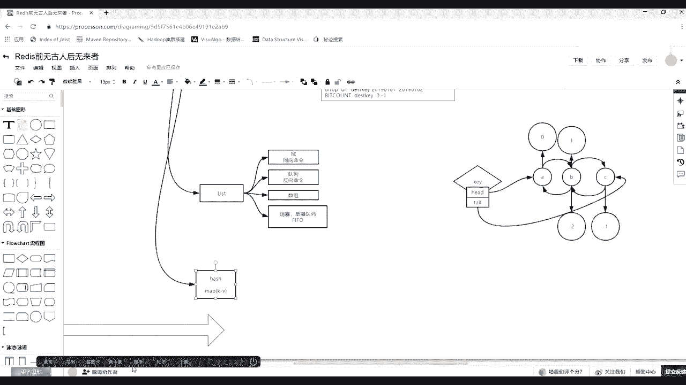
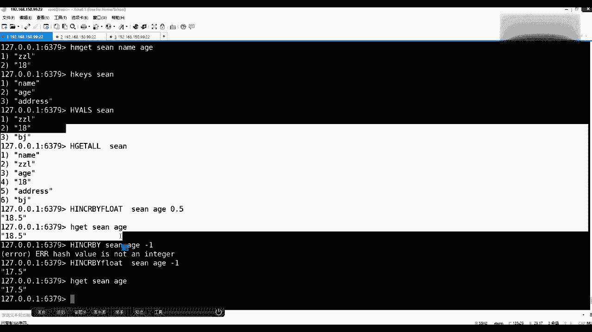
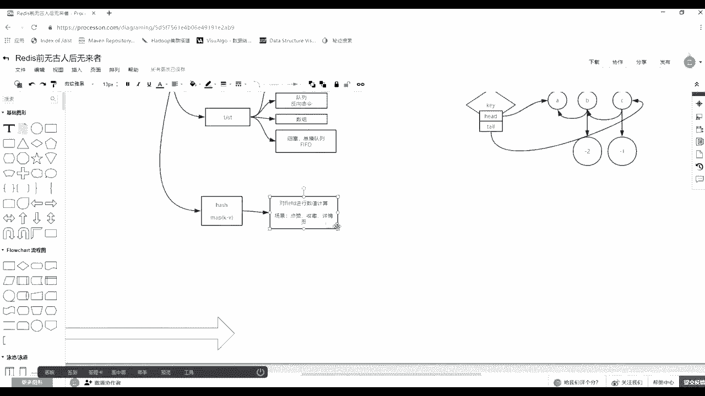

# 系列 3：P101：【Redis】redis中value类型--hash - 马士兵_马小雨 - BV1zh411H79h

然后除了list子，再来讲下一个list子这这段收了。找下一个。能保证。reice5种外能类型，除例思，还有一个还有其剩下几种，还有比如一个哈西哈西是什么意思？其实就像你们曾经学的那个扎亚东的哈希麦。

然后卖了它一定是什么呢？坚持段少。KV。但这注意了，这个哈希类型说的是raice建职队里的value的类型是哈希。然后哈希的话代表这个value里边，它自身又是一个键值对，就等于你们在账号当中。

哈希 mapap里面那个value里边又放了一个哈希 map。😊，非常非常简单这么一个一个一一个理解，好吧，然后讲他之前。

我们来讨论一个事情，如果面向一个用户，他有姓名、有大小、年年龄，有有地址。然后这三个维度每一个人都有这三个维度，让你使用readies存取的话，你怎么去设置怎么去存？每个人一个一个公司有很多用户。

每一个用户有三个维度或4个维度。存出来有那种建段的数据库。如果没有学哈希，他们给你开发这个K，你可以怎么去用啊？我希望可以这样去用。就用我们的简单的间别句，比如说set一个肖恩。

然后name中间你可以用这两个冒号来隔离。前边是肖恩这个人，后边这个是他的名称，但是他整体算作一个T，一个字符串，它整体是一个字符串，它只能就是一个value，它个valueview就是说。周磊啊。

这有一个一个周磊的名字回车。取的时候你要get肖恩给出K的完整的名字。就能把里边那个层那个值取出来了，这能看懂吧？哎，如果。除了有。How8。然后比如说18岁。Kt Sean。诶。就是18你也能存能取。

而且你从K上是不是也可以也可以区分出来，对不对？啊，也能区分。然后case用这个命令的时候，你还可以肖恩星号拿出关于肖恩开始的后缀的所有的这个K6是吗？你把这个拿回来之后，你扣端是不是可以询问电力。

分别对整个完整的K发起这个概的请求，你你也可以想拿谁拿谁。是个成本。这个车呢其实是极其。及第阅为什么？如果这个肖恩有100个字段，什么姓名地址啊，一W堆100个字段。

那么其实你可以先用一个case发一个指令，从你的客户端发一个消息发到服务端，服务端给你返回了一堆的关于这个这个肖恩的这个所有的K。然后呢，你可以通过一个more get再发一次多个K的取值，对不对？

你可以说可以通通过moremore get，你可以一个一个取，也可以通过more get发一次。但是这时候你会发现一个case取回，然后再一个more摸 get多次的多个case读取。

你有两次对服务端通信，对不对？😊，这个理解吧？而且你的个case触发这种模式频面的查找的话，其实成本是很高的成本很高的。所以这个时候解决它的问题就完全什么呀？我的K可以是肖恩。

然后如果它的value是一个间定对数就好了。😊，那么这个就是所谓的啊要是要引这个哈气的概念。注意看哈希的命令一般都是什么开头，是不都是H开头的。那么基本上就是小学或者一这个这个幼儿园大班的这个英语水平。

你见到A开头呢你就知道啊，这个肯定是哈西的相关的命令，这个有哪些比如删除啊是否存在呀，然后取里边的值取的是你要取value的话，肯定跟着K和那个fe因为这个value也是一个间然后get取回所有。

但是get什么the andvalue对吧？这个K名下的它所有的那个value里面那个间段给你取出来。然后他也支持相应的计算，对着value，然后还有kis取回所有的K。

取回取的就是有多少个间对这个value里边还有more get取出相应几个你指定的那个这个fe。还有有摸掉的就more side，你可以试置多个或者H side，只是其中一个。

然后还有一个不存在的时候才可以被设置。现在读起这些单词就已经见名之义了。因为其实和我们曾经那个单词符上的操作一样，只不过是在字符串，那些命令前面加了个H。还有一个strlu，这是字账里边，前面加了H。

那代表就是建立段里边的we间立段那个操作压力级。我们来演示一下。还有1个HY的是属于所有。那么比如我们准备把刚才那种单一的多个K能表示一个人的数据，用一个K一个K来表示。比如说Hs一个K。

一个K就是肖恩，然后呢它会有name name的话就是周志磊回车。那么这个时候其实你是对着这个K里边只做了一个间对。那么一个K里边的Y6，如果是这种间对的话，它其实可以有很多笔，只要K不一样就可以了。

所以这时候你还可以H more set。对的，这个已存在这个key，然后给出间立多少，建立多少间座少，一定是间对成对成对出现的。好吧，然后比如说在age，然后18岁，然后address。

然后比如说北京回车，然后往里放了，如果想往下取的话，注意是H get。其实你把H抹掉之后，是不是曾经建立队的那个那个sprint操作，只不过现在描述它的ve就是那个哈希的。

然后给出key给出给出field。你们可的话，就是肖恩这个人。然后比如说取出它的name回圈，就是周志蕾，然后取age。这是18等等的，这就不多演示了，还可以mgan。给出肖恩，你要给出K。

给出K之后要给出几个，你要取择一个字段。比如说有name age，他那两个都取出来了。还有比如说H kiss，然后对着肖恩，我只拿回它有多个字段，我要生成一个表头，然后或者是H kiss。

然后我们就H values。然后对于肖恩，我只取分的一个value来填充下分成jason来封成封装一个固定的一个表的内容，或者是H。Get他 off了。get到追着我这个肖恩。

那么这样的话我会取出这个key，它里边Y的那个间职对，所有的那个间职对儿，它们呢既有title又有valuetle  valuet value。那么这样我在封jason的话。

给到前端现段就可以绘制绘制出一张表了。哎，那么这是我们关于哈西这种建支队儿的YYY类型为建支队儿的。他还支持数值计算，在我们使用类型当中，是不是支持字符串这种操作，也是不是支持我们这个数值的计算。

你比如说在这里面一般有一个小故事，就是你要问一个两三岁，刚说话的小孩，送三四岁的啊，你问他你你你多大了，这个小孩一般回答年龄都是比如说这个3岁半或者5岁半，有一个半，对不对？几岁半。

那么其实啊你像我的名字叫周志来，然后我的年龄是18，但是其实我这个年龄不是18，我是18岁半，那么这时候要不然我年龄我东记错了。如果要变的话，他怎么做，你可以覆盖，直接覆盖一个覆盖成18。5，对不对？

他也支持计算。比如说H。Increase by flood。你把前面盖住了incr increment by float是不是增加单丁的那个问题，对不对？对着肖恩对着他的age，然后增加0。5。

然后再Hge肖恩 age。回车就是18。5没毛正版。是不是刘老病？哎，那么这个时候其实哎我说错了，记错了。其实我17还不到18岁呢，我还不到18岁。那么怎么办？是不是要给它减掉一，对不对？

然后这时候有H吗？有吗？是不是没有是不是没有。那么其实这时候加法也可以做减法吧，increase in increment by float，然后对着肖恩的age做一个-1。要减一的话，其实是不用fl。

就直接办就行了。这面能能看到吗？就是虽然是inclement增加，但是我增加了一个负数，这就是减减掉了是。哪错了？Hashveo is not an antiger。発信が。哦。

它是一个它是一个一个一个一个一个单晶的，因为这里面已经变成浮点数了，对不对？而且还是要加上那个f。因为这个win类型不是引Ter，它是一个浮电值。

所以这时候你前面命令一定要是你的命令一定要随着那个value值要要要一一对应上去。因为这个命令间接掉底层方法啊，它传单的传对，所以这样做就对了。H钙 shown的 age是不是就是117岁半了？

当你对隔系有所可以。好吧，那么说一下，简单简单介绍一下它的应用场景，应用场景在哪。首先你妹妹res是内存的数据库，对不对？像这种所有对值的操作的速度都非常的快。那么当你有了这种。

比如说像我们的这个商品的详情页。那么客户端打开一个页面，关于这个商品会有很多很多的字段的信息，对不对？然后这个时候你的客户端要请求这么多数据的话，这一笔请求请求一个接口的时候。

你接口是每一个数据然要访回一次数据库呢，还是说我给出肖恩就拿出了它所有的Y6斯，然后呢，给客户端返回页面，你刷新就出来了。

然后这是第一种，就是数据整合的访问这个总量，调调用次数会变会会变低。第21个，然后数据的话都会随之变化。比如说微博当中有关于我这个人的关注，然后点赞，然后商品详情页当中有这个页面被浏览的次数。

被收藏的次数，被加入购物车的次数，那个数据既要被查询，有的时候他要发生计算，对不对？所以这时候他的哈西这个类型当中还支持这种数值计算。是我们而且还能统一取回的一批数据面前的一个对象的。

这就是它的应用场景。好吧，我先不介入更多的技术，就拿rease来解决这个问题，是不是可以解决了？进入选型的时候，你可以选选型这mongo这种document类型的，也可以使用这种建制对儿的。

因为它其实这种就是一个简单的哈西，其实就是一一种简单的document，只不过它的value就是reice的value是哈西哈西里边这个里边这个存的这个建职段儿这个age0。5，这两个类型就死了。

它就不能再再分叉了，它是单一元素了，所以它做不到一个复杂document，但是它自身它已经是建队，已经是doment了。😊，这个这个共同点能能能列吧。好嘞，那么。简单的做一下笔记。

就在讲了哈西的时候。这块好像没有什么可以可以说的。就做一个吧，可以做数值计算。可以对数值进行计算，一般做的应用场景。比如说各种的点赞啊。然后收藏啊。然后详情页。等等的。

面向一个人或者一个事物的一个页面的等等的，好吧。

