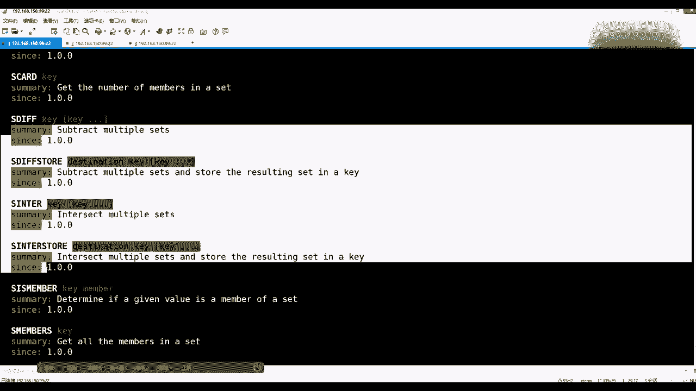
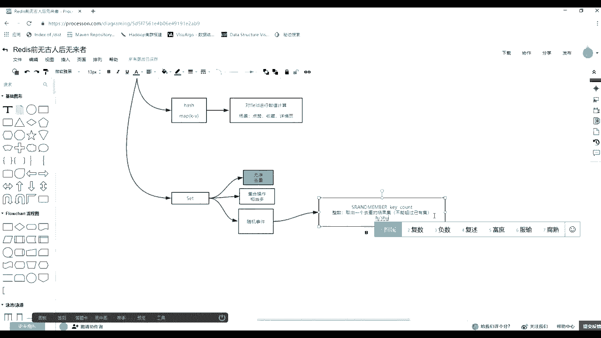

# 花了2万多买的Java架构师课程全套，现在分享给大家，从软件安装到底层源码（马士兵教育MCA架构师VIP教程） - P102：【Redis】redis中value类型--set - 马士兵_马小雨 - BV1zh411H79h

有16类型、粒子类型、哈希类型。那么它还有什么类型？再往一下再来一个类型。Okay。我把这三个。我还正这个。最后把。还有一个类型是set。sad类型那么注意听前面是不是有过一个list了。

list是不是就是等于一个向量，然后它里边放可以放很多元素。那么side其实它也是一个可以放很多元素的一个一个数据类型。那么这个时候为什么有了这样的一个东西，还有这样的一个东西，它俩不是重复了吗？

没有reice在学数据结构的时候，是不是也要辩证这个问题。那么其实每种数据类型有它自己的特征，对不对？这以时先对对比着来描述一下，list是可以有重复出现的，是不是可以重复出现的，且list是有序的。

but注意听。或者你们先给我解释list有序，这个序描述的是什么序啊，什么顺序。这是么小能力的。我不要听。没错，是存入的插入的弹出那个顺序，对不对？它并不会去做排序，对不对？

这个list没有给你去做排序。所以这时候把它描有清楚之后，然后再来看ss是一种什么呀？去重的一种集合，它是去重的，它是可有重复，它是必须去重的，而且它里边不维护排序。

也不维护存这个插入和这个弹出这个这个这个元素的变化的一个顺序。它完全是会这个这个乱序的。但是它里边最致命最优势的一点，就是去重。如果你能够去重的事，用它就可以了。找到每种类型的特点了吧。

OK这个定完之后，我们再来继续聊这个s可以做什么事情。这写。能干这个节奏吧，没问题吧，我觉得觉得其实应该。应该算应该算比较慢了。首先它的第一个特征啊它的特征。あも。是无序。然后去虫。

这是它非常值钱重要的。因为你要在不同的场景下使用不同数据结构的时候，你要选选选它，那么就一一一1依据它就可以选。

回来。😊，我们来看一眼s有哪些命令。一定要我现在没有讲API开发，但是你们一定要。这个先拿着这个命令行这多练习，多使用，多看帮助，把它弄明白了。因为你基于命令行这个都弄明白之后。

其实像这种no circle口基本都是原语的。也就是说它的命令的方式比较单一，然后呢，功能比较比比较简单，然后它的API的一端和它是基本是一一对应的。

你在这有这个命令到API那也点一个对象身上也可以点出这个命令。好吧，所以你只要会一个，先拿着一个面，会了之后，其他东西就好学了。那这个呢比如说S艾可以向你这个key。

然后里边去这个这个s里添加添添加元素，你可以给一个，也可以给多个。然后又因为它是s类型的，所以你把你即便有重复元素，它也会给做一个去重。这可以往里添加。

然后Scar这个Scar的话是可以给出几个当中的元素的个数。然后像different different store和in这个。interect，然后还有一个un等等，这是关于集合的一类操作。

就是交并插集，这个很重要。然后下边的是S is member，你要给出一个member，看这个集合当中是否有这个元素啊，使用这个元素。

然后还有S membersge the members个 side就是可以取出它所有的元素。但是其实在我们使用s的时候还真不要刻意的客户端调这样的命令，因为你可以可以给s放很多元素。然后要它做元素时候。

其实会消耗ready所在主机的网卡的吞吐量。那么这时候这台主机上其他的进程，其他ready实力，那些个链接请求的话，可能就是请就变慢了。所以使用ready的时候，虽然它给出了很多的功能。

但是你要知道什么会影响性能。这句话听懂的同学来说一6。

所以一般如果说哎我这个还真得存很多的东西，真的就是为了让未来来取，还不把这种请求压到数据库里边的话，没办法，也就是单拿出那么几台服务器，就专门就放几个这样的一个集合，就专门负责这件事情就可以了。

就要在它的一个功能里边把它单切出来，不要特别的这种其他的些KY要混在一起使用。然后常用的还有S run member。然后还有一个来讲吧，一个来讲吧，基本的添加删除这个事儿已经可以可以可以操作了。

我们把数据填津再说。S艾，然后添加一个，我刷一下裤嘛，那是。D。先清一下，然后SI的1个K1，然后里边添tm，然后肖恩，然后peter。然后圈圈扎扎，然后套。然后再一个叉叉深针。好，听见。😊，S算来算。

S算添加添加完之后，注意添加了几个元素啊，一共1234566个里边只添加了5个，对不对？那么这时候我们可以S。members，然后对着K一来看一眼这里面它是对谁做了驱重，对了我们那个tm做了驱重。

这不是只有一个了，好吧，这是比较简单的一个事情。这个林老师那个声音我也是醉了。然后除了。嗯。移除吧，还有应该还有一个移除Sremove，可以有增山改查，可以往里放，可以查。

还有删除移除K里边的一些元素的时候，比如说remove我们的K一里边的，比如把圈圈叉叉和叉叉圈圈。移除掉回车，然后在S members。给出K1。那么就可以把两个移除了，有增山改查的操作之后。这个。

我现在还可以做它最重要的就是为什么要使用集合这种s类型，主要做的就是它要算它那个交集并级和差级，他们得准备两个元素，比如说SI的1个K2吧，231个21个32个K，这里边放12345，放5元素。

SI的1个K3，然后里边放45678。那么这样的话，我得到了S members1个K2里边上的元素和S members1个K3里上的元素。做交易差题的时候，什么叫做交定差题？比如说我们的S。因此。

然后给出相应的给到。你一看有两个命令，一个是。带就带不带那个story，带不带这个story。那么如果你后面不带那个story的话，如果不带的话，就是直接给出一个K2个K3个K4K给出一相应的K。

那么它就会做一个嘴的集合间的一个交集。对对吧？如果你带了一个，就是直接它会输出。如果你带了一个s的话，你要先给出一个目标K。就是交易的结果会存在你服务端的K里边。我来演示一下，比如先对我们的K2和K3。

回车，然后他就直接把结果给你打印出来了，就返馈给你给你的客户端了45，这是他的交集。明白了白？但是这时候如果你接了一个。S story。然后给出一个目标KDST回车，然后你客户端拿不到。

然后这时候你可以单独的去弟么Smeers，然后DEST回车可以拿里边这个交集的元素。好吧，那么这两点其实也是一个作者的比较细腻的一点。因为带不带st，它可以不开发，它完全直接开发这个单一命令。

然后你但是如果你想让readd里边既有K2K3那种全量级，又有它的一个交集。那么你客户端必须要先执行它取回，把数据邮走到客户端，然后再把这个数据，然后再S艾到你那一个新的那个目标K里。

等于数据会有一个来回的交互的过程，这叫移动数据。如果有了这个命令的话，你等你客户端出发这个命令，只需要给出两个数据级作为参数，给这个目标的。然后所有的做交集和生成新的K的过程是在服务端一步完成的。

数据是没有进入IO，对不对？能白吧？啊，所以你不光要知道这个命令，要知道哎呀，我我知道这俩命令，你不光要知道你在面试的时候还要多说了多说么这么两句，你多说两句，他就知道你会做这个这个选型的一件事情。😡。

那么除了可以有这个胶集焦敏差，然后还有病例比S。Yeah。uni然后给出也它也是可以带不带这个story的这个概念。分带和不带这个story，比如说我们就不带啊，就把我们的K2K3。

那么什么叫做那个病级啊？回正之后是12345678，它也会给你查的结果也会给你做一个去重。好吧，那么这个焦急病级是非常好理解的。然后注意看还有除了这种的疾合，还有一个什疾格，是不是就差级了？还有差级。

差级是哪一个命令来着？啊，different差级。那么注意差级它只有一个。但是我们知道集合的差级是分为什么呀？左差外差的对不对？啊，前差后差中差后差的对？啊它有它有这个方向的概念，但是只有一个命令。

所以这时候呢取决于你怎么用这个命令，它是有方向性的。不理解我的意思吧？然后比如说你把K2放在前面，K3放在后边，那么得到的是123，如果你给它换一个方向。K2，那么得到的就是678，所以这时候没办法。

作者没有给你设计过多的关于差级这个带方向的一个概念这个这个参数选项。但是你只需要调整你要做谁的外插是不就可以了。想在谁里边取到数据，就把这些都放到左边去，右边往后的时作为它的参考，好吧，哎。

集合操作是我们那个s用的比较多的。

下个里边现在支持一个集合操作，集合操作。这个用的是相当多相当多。有说的场景，有说到的场景。除了有这个集合操作，它还有一个操作。因为集合里边有一个命令可以产生随机事件，随机事件。

Oh。这个位是什么？是S run number。As our member。这个S remember，然后后面给出给出一个K，然后给出一个count的次数，取多少个。注意，这个count呢也分为正-0。

分为正-0。我们举个例子，先添加一个元素出来嘛，那是。哦，然后呢添一些元素给。比如说这在讲个sideI添加添加1个K1，里边多添几个元素啊，添一个。tm，然后圈圈叉叉叉叉圈圈，然后叉圈叉圈圈叉圈叉。

然后叉圈圈叉，然后圈叉叉圈。好吧，这是一个、两个、3个、4个、5个、6个、7个。7个元素对不对？唉，回车。那么用S round number给出K1的时候。

比如说我要在里边取出5个或者我现在写出来-5个或者10个或者-10个或者0的0个先不说啊。那么前面那种是有四种情况，对不对？是吧？四种情况，注意，如果是为正数的时候，为正数的时候。

它会在你已有集合当中尽量满足你的数这个数返回一个不会重复出现的结果集，如果为5的话，它可能把前面5个挑出来了，或者随机几个5个独立的元素返回。如果你给出正十，它也是取不出来10个。因为你才有7个。

它不可能把某一个变多拼拼成10个，这时候就会出现重复的元素。为正的时候有这么一个概念。所以事验的时候，也就是在用S member这个命令的时候。

然后后边会有一个key，会有一个烫子。然后主要这个抗抗的若为正数。为正数的数候，然后这时候取出。嗯，数量取出一个去虫的结果机。然后这时候无非就是什么呀？取多对不能不能超过。超过。右急。规避规了。

已有即合。这个非常精精精精辟，对不对啊？非常简单，然后如果是负数。

睇下。负数里边你有可能取的比他少，对不对？哎，负5啊有可能负十比他多，有可能比他多。那么这时候其实。

负数是首先它可以取出一个带重复的结果机。然后一定满足你要的数量。一定会满足你要的数量。好吧。如果为一空，那就是不返回。不如果为理由，如果。为理由，你说不返回。不给返不给返回东西了。好了。

当这个能听准之后，那么其实这个随机事件可以解决什么问题呢？我在图。他可以解决什么问题？来，我们可以遮肉刷一下，看可以解决什么问题。就随机试件的时候。正常。有强迫症都有。他可以做什么做什么事情。抢红包。

除了小红包呢，小红包其实不太不太不太准，你个抽奖，因为最多的是抽奖。抽奖是不是这种随意随意概念？那么抽奖分有很多种抽奖。比如说。如果我有10个10个10个奖品。10个奖品，但是我的用户。可有两种情况。

第一种情况是小于十。就是小于1或者是大于10个用户对不对？用户可能大过奖品数量可能小小过奖品数量，而且用户中奖。用户中奖又分为重复和不重复。重复。重。补充。是否重诉？没有什么意思？问们。而且除了有抽奖。

还有什么还可以解决。家庭。争斗。这点其实很重要。

我一个一个一个来说。如果我们现在。假设一个场景。假设一个场景，微博你有很多的粉丝，然后呢你准备了几件礼物，比如准备了三件礼物。你想让这些粉丝中备三件礼物，那么你可以怎么去做呀？首先如果用reads的话。

这个里面你需要准备一个数据集，请问这数据集里放的是什么呀？是放的礼物，那几件不同的礼物还是放的你的粉丝那些人？来都刷一下。那一定要注意了，你要放的是粉丝，你要你要放的是礼物的话，你抽出仨礼物来。

还是得撒礼物。你三你知道就得撒礼物，给仨礼物，你给谁啊？你说还还是不知道对不对，所以集合里放的是人，然后呢，无非就是抽三个或者是抽正三或者是抽负三的概念了。能理解我什么意思吧？如果你抽的是正三。

他就一定会给你三个什么呀？给你返回三个，因为三个小于他对不对？而且这三个一定是去虫的，你无怎么抽都去虫的。所以这时候符合一个语义，就是一个人最多只能中一件礼物。啊，不是。如果你给的是-3。

会有一个现象出现。如果你给它负3会现象重呀，比如八抽了，就你们没出现，然后再抽。再抽概率呢概率呢唉，这出现了，是不是为复数的时候是不是可以有重复的？也就你奖品就仨这三个有可能被一个人抽走。

有可能被两个人抽走，有可能被三个人抽走了。就是在抽奖的时候，你可以这么去设置，这是是符合实际场景，对不对？哎，就无非是一个正负的一个这个控制了。然后再来听还有一个场景，还有一个场景就是。

这是一个实际的一个场景，就是曾经我上班的时候，我在好多年前了，还没有raice，还没有raice时，然后是工行。这个工行找到我找到我们的这个公司，然后说他们里边一个人跟我说，因为他们自己的开发团队。

但是他们想自己部门自己自己造一个软件给他们抽奖。为什么？因为其实银行银行是做这种理财，就是贷款这种方式来来盈利的。就是他们我们存进的钱，这个钱在那放到，他长毛了，还得把这钱贷款贷出去。能理有什么意思吧？

所以他们工行里边很多的部门，很多人，他们每年一翻过年来，脑袋都大了。因为这一年要带出几十亿几百亿去，每个人都有很多的这个这个这个这个额度指标。然后那年年终的时候，那个部门他们领导人领导就找到我们这边说。

哎，你给我写一个抽奖的软件。因为我们是超额提前完成了这个任务，然后行里边上面的这个领导说给我们一些购物卡作为奖励。这个购物卡的面值有100的，300的、500的1000的。啊。

但是注意这个部门才十来个人，这个小部门才十来个人。对道吧？但是这个卡卡将近几十张卡还是一两两三百张，我忘了，他说卡特别多。能理白这么意思吧？也就是说抽奖中奖的人少，但是礼物会很多，对不对？😡，唉。

那么这个场景听明白了。如果想抽奖的话怎么抽？而且这里边还有这么一个规则啊，这个规则多说一下就逗你们一下。其实当时找我的时候，他们说了说这个卡很多，面值有大有小。然后您设置一个抽奖的程序。

尽量的让每个人都多抽几张，那均衡一下，别一别一个人就抽一张。然后呢，我们领导那多让他抽几张大大大面额的。明白什么意思吧？当然如果这个加上这个需求的话，我们用reies就很难实现了。

就很难实现这个公平公正的一个这个效果了。能令我什么意思？能令我想表达一个什么意思？这时候你必然要手写一个程序，因为程序里面要附加各种什么呀暗箱规则，对不对？那么我们不讨论那种这种黑规则。

我们就说正经的就是拿re公屏抽奖，人大于人小于礼物数的时候，应该怎么抽？有。小于礼无数的时候，应该怎么去抽啊？😡，是不是直接把后缀数放大就可以了。我刚才集合当中是不是7个人，对不对？

我是不是有20件礼物或者2张卡，我就让那7个人去分这二张卡，就是一定要加个负数，因为负数才能返回一个重复的一个数据级。回车。是不是就这么走的，但是这里边为什么说它是公平公正的，你看有套沫啥事儿吗？😡。

是不是top里没出现，对不对？你再抽一次，就就你抽的时候就有可能出现t了。哎，这是不是有T了？特别重奖卡。能解吧？就几种条件，几种框框。如果人小于礼物数，那么你用负数让那个一个人多中几张。

是不是就可以了？

然后这你课门之后，我说他可以解决家庭问题。

可以解决家庭斗争问题，什么斗争问题。比如说在座的未来都会结婚生子，或者你已经有孩子，有孩子咱就不参与这件事了。未来你会结婚生子，结婚生子的时候，其实孩子哪个东西非常重要，洗碗也算一个。😊。

因为这个孩子取名字是不是非常非常烦，对不对？因为你你想给孩子叫张三，你媳妇想管他叫李四啊，然后呢，你婆婆不是你看丈母娘吧，还是怎么的，你家里边的，反正各个人都给他推出了一个名字。

然后这时候那应该选哪一个呢？应该叫哪个名字呢？这以时候其实你可以比如像刚才我们那个。S numbers。K一里边假设这就是你家孩子的未来的名字啊，假设就是名字。然后这时完全你可以做这么一件事情。

你非常坦荡的说说这个东西我们我们那个一定要信这个什么呀，信这个这个缘分，然后呢，你可以给他一个打大点，比如说25个，然后你疯狂的抽，疯狂的抽，疯狂抽，你说哎大家看看那个名字抽的字数比较多呀。

就就他就叫这个名字。😊，好吧，那这事儿就跟你没有关系了。因为你要你你你说你向着谁是不是很难做这件事情，对吧？开个玩笑啊。那么抽奖这个抽抽奖抽奖这个环节当中，其实刚才都是抽出一次性抽出多个多个奖品。

但是还有一个抽奖环节，还有一个抽奖环节，比如你公司年会年会的时候，其实年会，如果通知你，咱们说或者那个年底要开个年会了。你咱们说实话，你是愿意去呢，还是不愿意去。啊。最换这一块。

其实大部分人是就反正有人愿意去，有人不愿意去。其实这个就看公司什么样，这年年会就抽奖抽啥了，对不对？是不是公司一般会抽奖？然后这个场景再再问你，公司如果有500人，请问奖品公司会准备多少个奖品？

如果您会抽奖的时候，奖品数一定会小于什么呀？参会人数，对不对？尤其那个他奖品这分一等奖、二等奖三等奖奖大奖是不是最终就可能有一个或者一个团队或者几个几个一等奖。它一定会小于什么呀？这个这个人数的。

只有这样的规则，人们才更愿意去这个。这个这个年会啊，每个人其实心里都说这这个一等奖肯定是我的，我不去的就浪费了。咱去之前都都是这个想法，对不对？那么这时候怎么实现这个功能呢？

一定要注意PO怎么实现用reis。刚才用那个。S刚我们显示各。run那个memory还适用吗？那么这时候其实你未来设计程序的时候，你要看了数据被抽取成随事件之后，是否要重复让它再出现。

一般我们在年会的时候是这样一个流程，每个人进门的时候会给你一个数字号，对不对？8号、9号等等的？然后那个号有一个副本会放到一个箱子里。是不是放在一个箱子里，然后呢写这个抽奖啊，他一次只抽一个人。

而且还是演这个交替去抽。为什么呀？因为抽奖与抽奖之间要加上什么经理讲话对对不对？然后每个人中奖之后基本就没你啥事的，所以他每次只会抽出一个来，而且这个抽出那个日候正常拿出来之后是不会放回去的。

像使用它的话，它是不会对数据造成增删改的，它只会在这个样品当中往里抽东西，所以它其实不太适合，所以还会有另外一个命令，叫做Stop。🤧S泡这个泡的时候，你可以给出K1。然后这时候会弹出一个。

然后再抽再抽再抽再抽再抽再抽再抽再抽再抽，没有了。其实这个才更符合年会的抽奖的过程。没错，它是这个取出的过程啊，就这。好吧，ok我们小要总结一下。😊。

在随机之前抽奖的时候，有Sme，还有一个Spo。然后这个是取出一个取出一个，一般我们会用的场景是取出一个这样的一个随这个这就不叫这个这个应该也算作随机事件里面。因为它指定抽哪一个，对不对？哎。

就只会抽一个，像上面的时候就是根据这种组不同组合方式，后边你还是我要请你们自己去补笔记，补什么，它有多少种组合方式，就是人多还是奖品多，你想抽重复的，还是想不抽重复的。我课时都讲过，到时我给你写出来。

你要必须回去实操，然后便把这个补上这块由你们来做。

