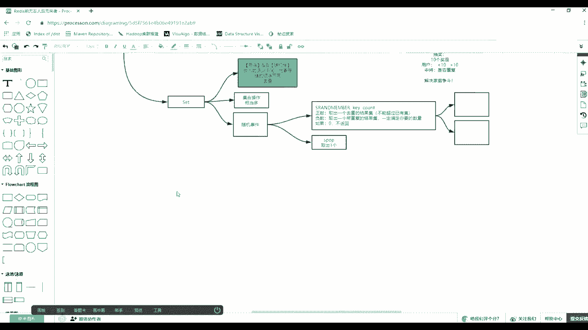
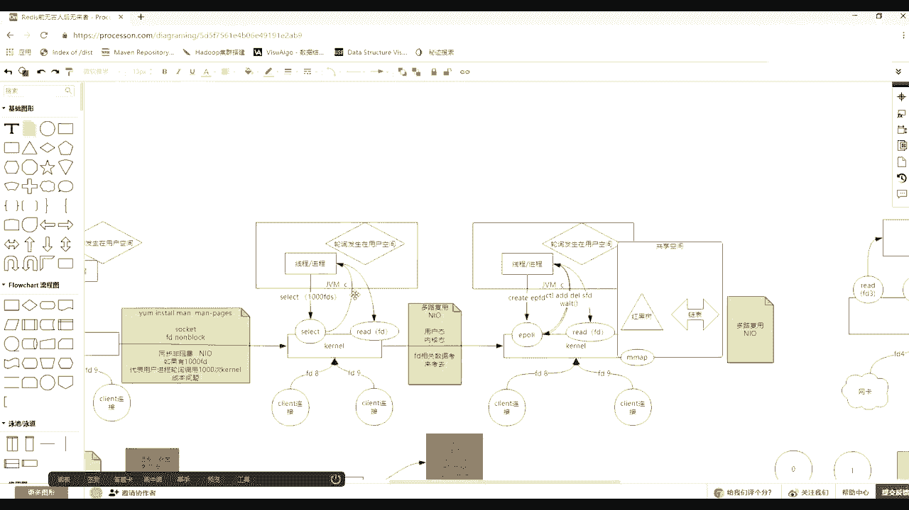
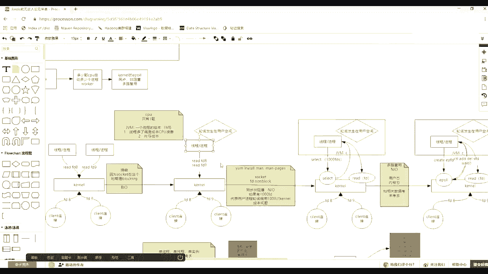
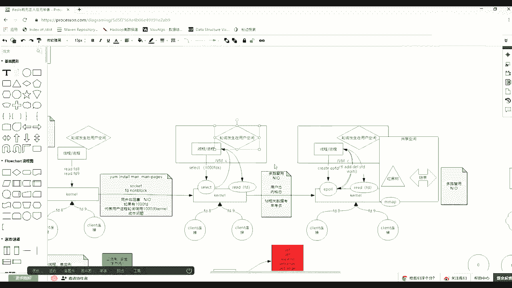

# 花了2万多买的Java架构师课程全套，现在分享给大家，从软件安装到底层源码（马士兵教育MCA架构师VIP教程） - P103：【Redis】redis中NIO问题解决 - 马士兵_马小雨 - BV1zh411H79h

三楼。有赛哥。你除了需要这。

哪个不太懂。

这个轮巡吗？对就是你代码里面会写一个死循环。然后呢，你肯定是你了一个sso。然后呢。当那下面接收到一个一个一个一个链接的时候，多了一个就多了一个那个slide是吧？一样一样slide。

我跟你说说说side一样。

起莱的里边。你程序里你用搜消费的时候，肯定拿到了，假假拿到了一个文件妙服，拿到了一个1个8。这是不是别人连接的那个文件面符啊，是你那个要监听80端口时候你拿到一个。然后你们放的这个s选择器当中。

然后监听的事件是as是同意就别人接进来。然后这个时候你现在就循环用中间，为什么要发生轮发生在用户间的轮虽然都发生在用中间，的成本不一样，它是成本不一样的。这边是每一个文件妙符都问一次，这边是循环一次。

我会掉一次slash，我会把1000个文件标传给他。现在第一次的时候你只有一个文件面符只传了一个传完之后，然后他进来内核状态之后，s拿着那个那个8，然后去看有没有这个。有没有这个这个这个连接到。

有到了之后给你返回，然后你就发现。拿到这个8号里边，谁就可以去去接收一个一个新的连接socket一个新的连接就建建立上了。然后这时候你再拿到他的文件标服，然后还得把你曾经那个监听的和那两个再调sag。

然后都放进去。然后一个要监听有没有有没有新的连接到达。另外一个设试状态的时候我要监听有没有数据到达。对吧。然后这时候你第二次录西的时候放了两个，然后只掉了一个s。

但是内盒去给你编利两个是否都有各自的事件。有的时候给你其实有了就给你返回了。返回之后，然后你会对着这两个便历一下。哎，是是第一个接收到了呢，还是后边那个数据到了。

然后数据到了之后调readd来读那个文件面符。如果又一个新的连接，等于现在你先听一个文件面符，两个连接，一共三个文件面符，你再循环是把三个压到这个side方码，内核拿三个有了扔后给你返回。😊，要先。

奇骏理解了吗？就前边也发轮询了，但是拿着一个电标服问一次，拿一个问一次，这是发轮询。轮询的时候，我拿着一批问一次，拿着一批问一次，拿着一批问一次。咱们VIP的课都是有回播的，录播的。

你到时候在页面上直接回看就可以了。一泡一样，一泡也是轮胸的。

