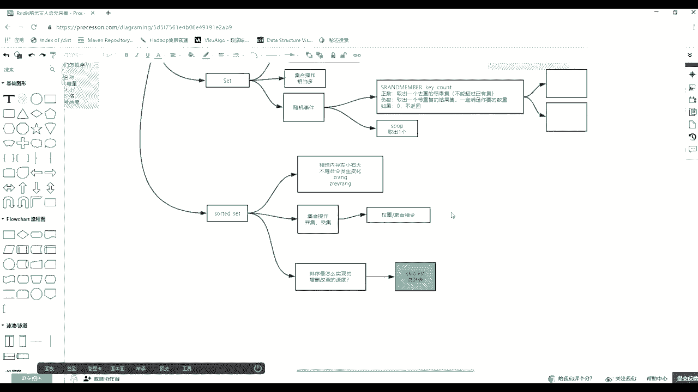
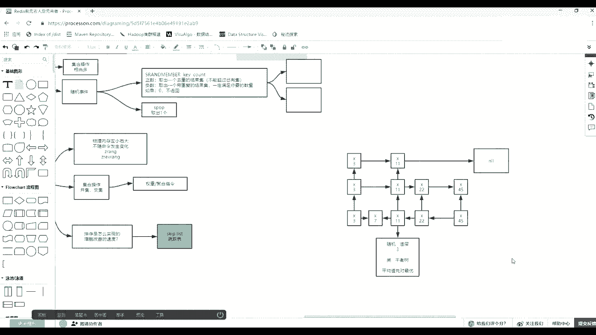
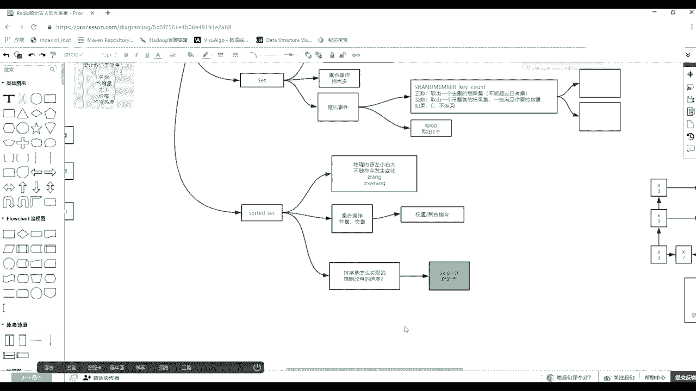
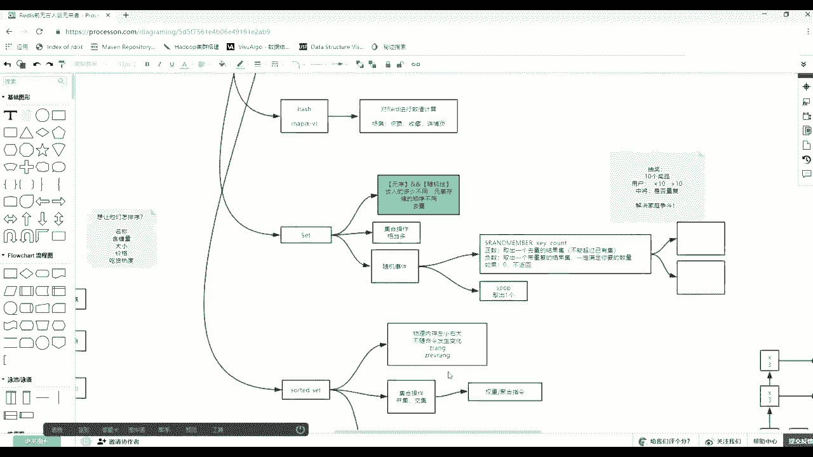
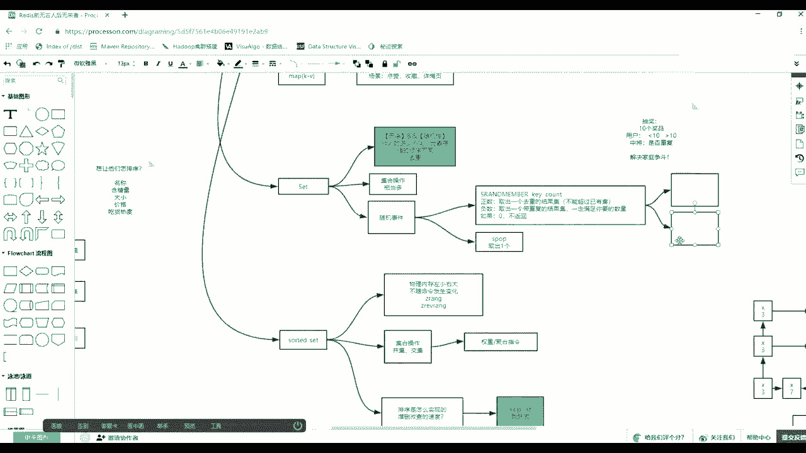
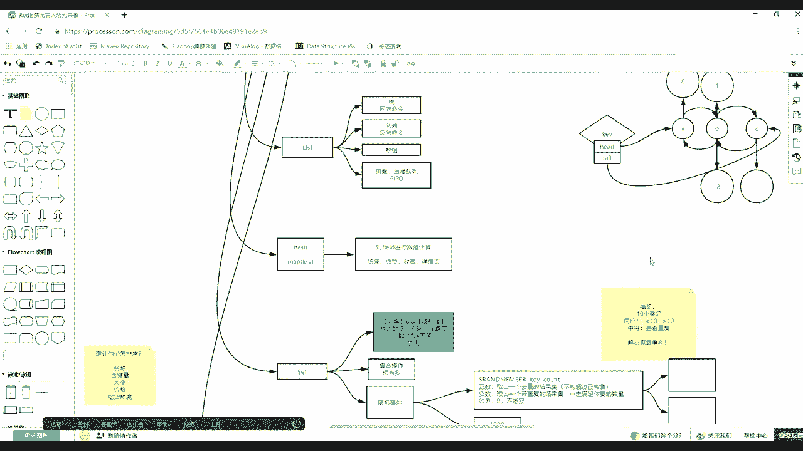

# 系列 3：P105：【Redis】redis中value类型--skiplist - 马士兵_马小雨 - BV1zh411H79h

再来思考。啊，刚才那个问题这个问题是面试当中问的相对较多的一个问题。相对角度的一个问题。都在使用read的时候稍计散的时候。排序。是怎么实现？比就它的排序这个顺序如何实现那么高效，那么快速对不对？

然后以及它的增生改查的速度。这常感的速度快不快呢？速度是一个什么样的速度？其实就是间接想考你它底层的什么权重结构，对不对？这里面注意它用到了一个存储结构叫什么呀？什么时候结狗？Sキバ。Please。

有说这样一个list子。没错，这个例子叫什么？跳跃表。唉，它就是一个跳表的概念。好吧，链表应该都知道对不对？是不链聊肯定都是知道的，对不对？

🤧简单说一下跳表是一个什么概念啊。那么我们先来描述一个场景，如果是链表的话，比如有X这样的元素。然后呢，列表其实就无非就是这样的去一个一个又一个一个一个又一个。我用X代表为知元素了啊。

会有很多元素在个列表里边。但是你如果给它排序的话，排序的话，怎么怎么怎么怎么去把它排除这个序位。其实当有第一个出现的时候，在第二个元素这个的时候，这要跟它比较一下，无非就是放前放后的问题。哎。

第二个元素来的时候很容易理解。第三个元素来的时候怎么办？这个元素来的时候要跟第一个比较，我者比你大呢，还是比你小呢，对不对？哎，我如果比你大的话，我跟后者比比，我说给你大的跟你小呢，放到中间就可以了。

这个非常好理解，最后最最容易实现的。但是随着那个列码越来越长1万个1万个元素。那么你再进了一个元素之后，它可能最大可难度是变了1万次。😊，特别找和合适的一个位置。是不是复担率变高了，就是欧N嘛，对不对？

这个理害吧，那么能怎么能把这个这个事情降低一点呢？😊，有人说二分。啊，二分那么二分的话，这个元素谁是中间这个呀？因为它是链表嘛，它并不是数足。你要找到中加的元素，是外从第一个遍利过去。😡。

同学们们有什么意思吧？那么这个其实各种事间都有复杂度。那么什么叫跳跃表？当列表你知道是一个什么概念之后，其实它是加了一个什么呀，垂直垂直又多了几层。都多了几层，比如说这里面有4个元素。

假设假设我们先给它排好序啊，先给排好序。第一个元素13。第二个元素。17。然后第三个元素是22。第四个元素。145。因为这么四个元素，什时跳一点，其实它还有一上面几个几个几个层次。比如说。

又一个它的出现。这个话其实不太严谨啊。哎，那么又多了一层，一层，最底下那层，就是零层零层存的就是真实元素和那个那个东西，无非就是这个元素曾经在列板里边，它可能只有两个指针，一个指向前面的一个指向后边的。

就有两个指针，指向前指向后。那么在跳转当中，这个元素除了有前后首尾的链表的指针之外，还又多存了一个存了一个其他的一个层次这么一个一个指针。那就是等于又多了一个S3出现在这个位置，然后呢它们之间会相连。

然后呢。这个元素它。出现了这一层后来也多了一个层，这个元素没出现，它只有一层，这有两层这有两层。那么它们两层里边会一个指向。然后呢，还有一个再多一个元素吧，假如这个元素也多了一层。然后它一个指向。

因为只要是一层呢，它们就会连起来。那么显然下面是4个元素，上面是三个元素。然后再往上的时候，可能只有这一个元素。这层再再往下再往上一层，层可有一层或者多层，这个层直接指向后边是一个一个空。

因为莫伟莫伟他没有指向最后那个元素。因为这个层只有两层。那么当这样一个查找的时候，如果有一个随便一个元素，随便一个随机元素要是插着的话。这个元素比如说11。当11想像那个跳转插的时候。

就注意它是在我们的K当中啊，K当中会维护着第一个头还第一个氦它的元素的那个指针。因为跟那个电点一样，从K当中可以找到它它里边是不是有一个每层的一个各层的那个指针那个元素，对不对？

所以这个时候当元素找的时候，是从第一个元素，这个害当中的从最高一层，找它跟它去比较，如果小于它就咣当插就插进去就就可以了。因为它第一个如果大于它看看它指的那个它这一层里边跟它下一个去比较。

来来我一看是缪，那么直接就是这层后面没有，那么这个东西还大于它，那么应该往后差哪个位置呢？降低降到下一层。就到下一分之后，它里边往后只指的是22，所以这个元素跟221比就到就到达这个这个这个元素了。

到这个元素之后发现哦，我比你大我比你小，那我就不用看你后边的，对不对？啊，我我肯定比你小比你小的时候，其实。😊，降到它下一层。就下一层，因为下一层才会有一个指针。向左的一个指针啊。

如果下边还有很多层的话，你就一定要下一层往往往左找就可以了。像现在个比较简单，就到直接到这层，直接到这层之后，其实就是按照这个向左这个指针找前面跟它比。😊，如果比它还小，那继续往前走。如果比它大。

直接把它插就可以了。刚才这个上面一个过程，就是这个我如果你插的时候。找到位置，这步找到位置，就是从最少的那个列列表元素，一层过虑到最终那个最长的列表元素。来这么着，然后你能听懂他的话，就间接啊。

你间接的先听懂一下，因为这个里边还不完整。因为你只是刚才完成了一步什么操作。我找到你在哪了，但是这时候其实我为什么说上来，咱们得直接先造这么一个跳业表。那么最重要的是这元素如果放在这儿。

这元素如果放在这儿的话。😡，他要不要再制造几个层次出来，对不对？😡，最终是不你如果说这个元素只要能插成功，完成所有的插入操作之后，因为你刚才找到它比较的过程，你还非非常容易容易理解。

只要在完成它出现在这儿，且其他从那个那个指向在一搞定，是际是你就你就才能明白。所以第一步它如果能找到这个位置，要放在这的话，其实很简单。

因为它的过是不是来自于它往左找指向它从它身的边你是不是既同时小于它又同时大于它了。所以如果放在这儿的话，要修改谁的指针，是不是要从它里边取出它指向这个指针改成什么样，改成它，对不对？

并把它里边指针附在它身上，所以会出现一个什么效果。在它那个点上是不是会。😊，打出这样的一个效果。这能看懂？同学们嗯，然后它放在这之后，注意我下面给你简单写写一下，每个元素被插入的时候随机造成。

会随机造成，就随机的。我应该这个元素出现在跳表这么多层次当中，我应该是出现一层呢还是两层呢还是三层的。我要不要在未来别人插入的时候，在其他层帮助别人做一个中间左右一个判断的事情。

它会有一个随机造成的一个事情，就是一个随机数，有可能两层用的一层又三层又的四层。当然这个时候根据优化肯定会有一个初始值，就尽量不要超过多少层。这个随机造成这个事儿能不能理解？

就是因为每这里边一个跳转当中不可能每一个元素都是三层。那这等于这个数据放了333倍，对不对？所以一定是什么呀？间接的跳着，每个元素各出现了不同的高度，其实就在牺牲什么，牺牲存储空间来换未来的查询速度。

这句话听同学来说波6。好吧，当这个点能知道之后，其实就是尽量的拿出一部分空间牺牲一下，但是又不是成倍的去拿那个空间去分倍啊，因为你等于你每次都发完之后，最终找找谁还是很麻烦。越晚上这个城里出现的点越少。

越晚上从里出现的点越少，概率越低。所以那时候其实就有点像树的这个这个变利的过程啊，就成本很低了。那么随意造成造成车突，假设造分层。这的四楼啊，假设造了三层，那么它是不是在这儿出现。

它未来在上面是不是也会出现？是不是在这里应该会出现，在逻辑上表述，对不对？逻辑表述时它会出现在三个三个层次里。当它出现之后，如果这些指针都被修正的话，未来别的元素在定里的时候，是不是找他在如果比它大。

是不是找他这儿就可以左右左右判定了。😊，这个结果是这个结果，但是这些指针是怎么找到被修正的呢？😡，因为太森。目前在一，他这边找2。找二的时候，它是不是要向左去涨？😡，是不是像左左去找找到它一看。

它也是一，然后从它的指针接往前找，还找到一个终于不二层了。好，然后在二层这一个节点从按键点中取出指针，这指针可来指要22，对不对？直接把指针指向它自己的这个元素。😡，只要他自己。

并把它里边存的指向22那个22那个那个地址附在它的指向，指向那个指针上。所以这个复杂度就是从往往前找找到一个他需要这个层的元素，然后找到一个层，把那个指针修改去修改它的指针，修改它的指针。

他用的他说不用懂，因为他的地址被他指被曾经被他指用，现在改成被他指用了，所以就是一些指针地址的修修改的过程。😊，改2了，是不是他他是要要要制造三轮出来，是不是一个三吨来？😊，问当前你是不是要三啊。

非有三好找到你了，然后把你的指针指向那个的直接改成指向它。😡，然后并把你曾经指向那个指针那个那个地址放成它的指向的一个地址，就会指向那了谬了。😡，这块耳Q就最最终这三头是不是就出现了？😡，唉。

一出现之后，这就是所谓增成感往里增对不对？😡，说我得插入一个新的元素。哎，那么出现之后，然后如果再出有一个元素，假正再有一个元素，你这时候再来看。就比你刚才听的时不明白了，你只懂怎么你放着了。

假如再出了1个33。😡，这个33往里放，是不是相当于三比角，唉，比你大。😊，跟那个一跳就跳到1一上了，一看哎，比你大，但你没有了，降级。哎，比你大找到你了，比你小okK从下边一层往左往左往左收敛，哎。

比你大比你小放中间再完成刚才那过程。😊，这个流口听得听懂了吧。😡，朋学们。那么有如说如果我想将其中的。我能其中的22。😡，改为爸怎么办？你是不是可以对22可以。

因为它有inin increment by，对不对？可以增正正负数，对不对？哎，我给它减减减到就变成8了。其实你对一个东西修改它的值等于什么呀？把这个元素从这儿P出来，指针重新修正。

因为直接把它的指针交互到这个这个上下游就可以了。然后让它重新走一遍插入的过程。😊，所以只你你你只要把插入这个事儿，这个逻辑能听明白了，是不是修改这个值的过程，你你你也懂了？😡，被告问同学们。😡，没错。

现在在登。开始。因为你你都会往里增了，增之前是不是一个查询的过程？😡，增之前是不是得查，查到之后，然后是不是再完成增的这个所有指针修正的过程。😡，对不对？增山改查是不是都会了？😊，啊。

同学们听懂同学就最终什么跳业表，听懂同学来刷波6。我给你，因为因为的确啊就是你要记住啊，咱们班参差不齐，有人可能这个东西不屑意听无所谓。但是有的人可能是这械表这块还不太熟，对不对？

所以我尽量的给你起一个蒙，注意我只能按照启蒙给你讲，用最通俗的普通话，其实这种描述非常非常不严谨，对不对？😊，啊，不要紧，咱们先按照就着大面的同学，应该大部分这种普通话都能听懂。

知道起码知道它是一个啥事儿了。有兴趣你可以下边。因为你启蒙找起开了，随便找一些文章或者直接看券表论文都可以。你起码就可以看懂里边要做一件什么事了。😊，分层它的分层是一个随我看看到了吗？

新差轮度要不要分层，要不要造层是随机的。啊，就跟投硬力一样。啊，先投一个投成零了那完蛋了，它就不分层投一了。哎，我我要我有一个多多一层类，然后再投一次硬币投成零了。okK我就这一层。

如果再投硬币变成一了，我就我还还要还多一层。😊，最多能造几层层太高也不太好，因为就像树一样，树的深度越深，其实变程度更更慢，对不对？你变得这个这个这个这个斜向斜斜向这个这个这个距离更更远，具体到多少层。

其实有时候是取取决于你的个数据量的。有时候也要调整这个层的高度。如果从。数学特少的时候，其实根本就不需要使用跳跃表，数据达到一定量的时候，才会扩充到变动到这个这个跳跃表。

其实跳跃表有一个另外的一个一个描述，它叫什么呀？叫做平衡柱。啊，它是泪平衡处的。什么叫做平衡处？是不是左旋右旋让所有的所有的深度基本保持一致，对不对？就掺照任何元素的那个复杂度就要比较均匀。あか。

到底增山改查的速度是快还是慢的，注意听这个问的非常重重点。你会发现，如果我就这个元素进来之后就比它大的话，其实这时候你要走好多次，对不对？甚是你转了一个圈回来，对呗？😡，收老理还不如就直接限金便利呢。

这个时候其实说白了它的平均的就是在一定量啊，就是这个数据量比较多比较宽这个表。然后且资格奶查这个操作比较多的时候，其实它的平均值是最优的。平均值相对。最优这总的来看，当很多病发的事情发生了。

就是这这个对对它反量比较多的时候，元素比较多的时候，那么有综有删有查有改。这四个综合来评定它的那个效率，不是只看其中一个，不是只看查询，不是只看插插入。增改都发生一遍之后，在一个定大的时候。

它各种数据各种差插入不同的位置的时候，它的平均的这种速度是最最最稳就是最稳定的。有这么一个概念。相对相对是最稳定的，好吧。okK启启蒙啊就只聊这么多啊，因为你我再聊太多的东西。

刚听明白的同学可能脑子就被挤出了，记忆点东西就就就懵了。所以今天就讲这么多，好吧，对他有一个认识就可以了，觉得很神奇就可以了。我刚才描述稍微有点差异，就是说什么叫做并发并发比说不对。

就是说比如我准备了各种各样的数据。每一个数据挨个进来做增深改查的操作，就各种各种复杂度出现在不同位置的。你为你比如说你增13579准备一堆数据挨个发生，挨个发生。

最终把他们的所有的这个每个人的损耗的时间加起来除一下平均值的时间。然后有增的，有查的，有删的，每笔数据造完之后，拿这批数据对它做为一个压测。然后再拿着别的平衡数，红黑数再做一次压测，对了吧？

那么会发现它的平均值是相对比较稳定的。好吧，朋友们。

ok那么这节课讲到这儿。基本5个歪的类型，大部分的知识点给你讲完了，以及它的应用场景和特殊性，对不对？面试的时候呢应该多说，我让你下去该补的东西都必须要手练实操补上来。

好吧，笔记自己要补。