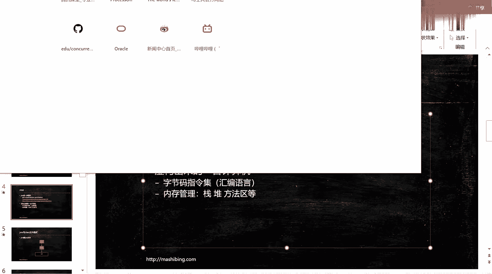
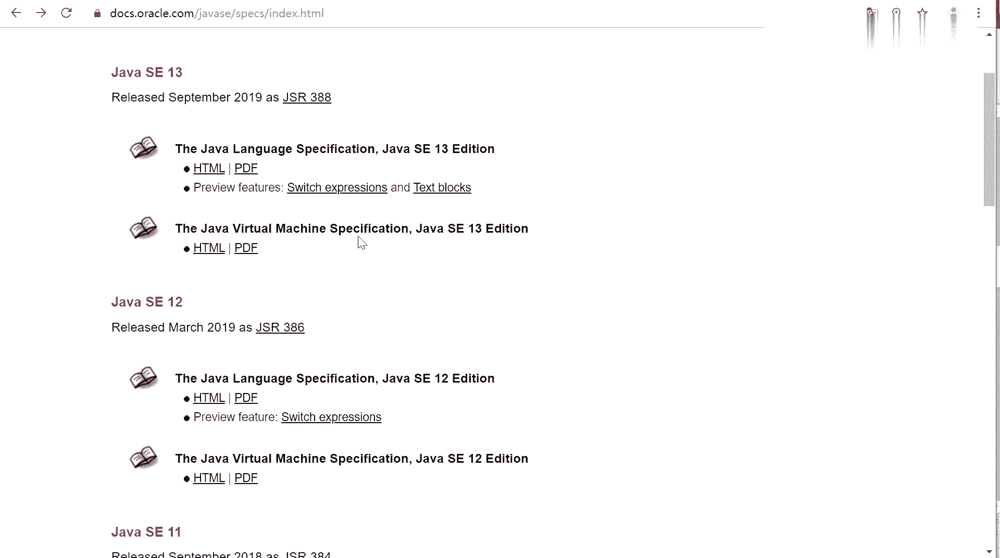
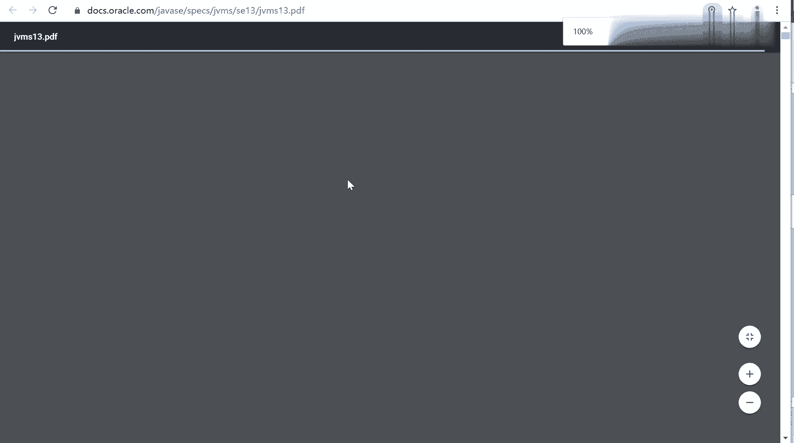
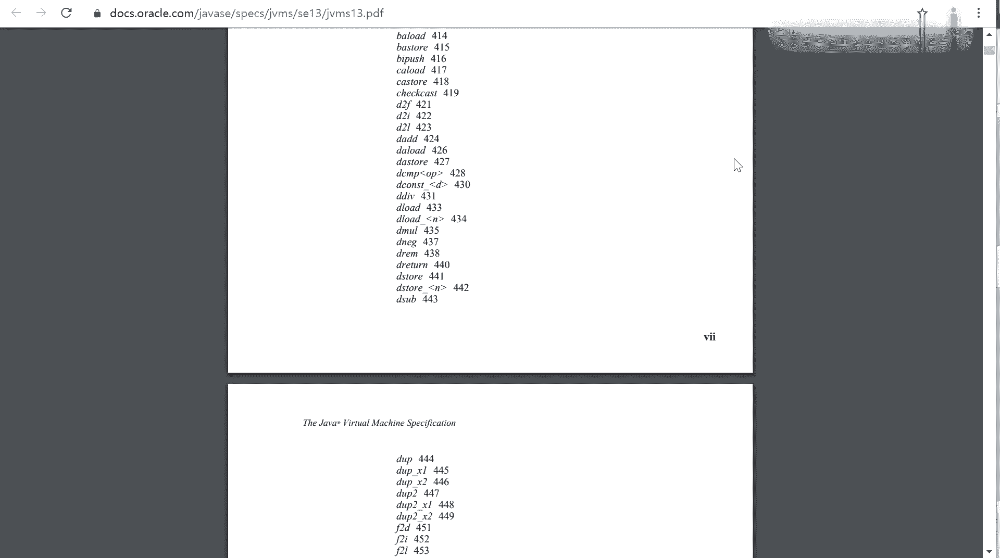

# 花了2万多买的Java架构师课程全套，现在分享给大家，从软件安装到底层源码（马士兵教育MCA架构师VIP教程） - P107：【JVM】JVM基础1 - 马士兵_马小雨 - BV1zh411H79h

呃。我们首先来看。第一个章的第一章的内容啊，叫java的JVM的基础入门，这里就不是java了啊，是JVM。首先呢我跟大家聊一聊呢，java呢是从怎么样从编码到执行的整个的过程，到底什么是JVM？

看这张图。把我的画图软件打开，稍等片刻。看两组。呃，有些内容非常的简单，我一带而过。咱们java从编码到执行到底是一个怎么样的过程？我们有一个文件S点java已执行java C。

他就变会变成X点class。这个class怎么执行的呢？当我们调用java命令的时候，class会被load到内存好，这块呢叫class loader。会被class load漏到内存，装载到内存里。

一呃，一般的情况下啊，我们。写自己的类文件的时候，也会用到java的类库。所以呢他会把java内库相关的这些个类也要装载到内存里。装载完了之后，装载完成之后呢。会调用自己码的解释器。

或者是及时编译器来进行解释或编译。编译完之后呢，有执行引擎开始执行。整引集呢下面面对的那就是操作系统和硬件了。好，这块的内容啊，这块这块的内容叫JVM。有这样的虚拟机。当然。

有的人呢会把class loader剔除掉，说只有下面这个叫Java虚拟机，这无所谓，只是概念上的一个划分而已。我一直强调概念这东西呢就是人类啊发明出来方便交流，方便说明问题用的。你理解就可以。

不要死抠就没有意思了。这是大体的这个图，希望大家在脑子里能够把这个图呢存一下啊。嗯。java完java编辑好了之后变成class class会被漏到内存。与此同时，像什么string啊、object啊。

这些个class啊也都会被漏到内存。呃，咱们原来老师有会问问一个问题，说java是这个解释执行的还是编译执行的？其实呢解释和编译是可以混合的，特别常用的一些代码。代码用到的次数特别多。好。

这个时候它会把代码呢进行一个。做成一个及时的编译，做成一个本地的编译。就像你可以理解为就像C语言知道呃在windows上执行的时候，把它编译成EEXE一样。那么下次在执行这张代码的时候。

就不需要通过解释器来一句一句解释来执行了。执行引擎。可以直接交给操作系统。去让它调用，这个效率要高很多，不是所有的代码呃，都要呃都会被JIT进行及时编译的。好吧，那如果是这样的话。

那你整个java就完全变成了不能跨平台了。所以。有一些。特定的。执行起来执行次数好多好多，用的用这特别多的时候啊，这个时候呢会进行一个及时编译器的编译。好，这块内容呢叫java虚拟机。关于这张图。

看大家有什么问题。嗯，没有那么继续啊。好，大家看这里。JVM呢现在呢我们可以称之为它是一个快语言的平台。Java叫跨平台的语言，这个大家都了解了。JVM实际上叫快语言的平台，什么意思呢？

作为javaJVM虚拟机来讲，目前能够在JVM上跑的语言特别多。除了java之外，还有scalecalar ，colingrbyclosure，jaon jruby还有好多好多好多。呃，据。

调查应该是100多种了，已经好吧。很比较恐怖，有100多种语言是可以直接跑在JVM虚拟机上的。当然所谓的这个JVM虚拟机，其实它本身也是一个规范。当linux上呢是由linux实现。

unux Uniuxwindows有windows实现likematic，它帮你屏蔽了操作系统的这些底层。好，那这个M虚拟机到底是怎么才能够做到？这么多语言都可以在上跑呢。

最关键的原因是就是因为class这个东西。我们可以说任何的语言，任何的语言，只要你能编译成class。符合class文件的规范，你就可以扔在java虚拟机上去执行。关于这一点。

我相信大家应该问题不大是吧？有没有同学有疑问的？所以从这位M的角度来讲呢，他呢是不看你任何的，不看你语言的。我只要看你只跟class文件有关系。甭管你是谁，你只要变成class，那就是我的菜。嗯。

context各个操作系统都有自己的GVM那跨平台是什么意思呢？是因为呢你写一个java语言，写同样的一个原文件。你的java呃，你在windows上和linux上都可以编译执行，不用修改任何东西。

以前的C和CI加是做不到的。大家伙可能慢慢的已经熟熟悉了java的这个特点啊，已经不再认为它是一个特点了。子明说，其他语言也是编译成class文件吗？是的，必须得是class文件。

不一定是编译成class文件。有的是在执行的过程之中呢。它就形成在内存之中的一个二进制的class流文件，那也扔给操系统呃扔给JVM，它也可以执行。所以JVM跟java是没有任何关系的。

所以这一点啊一定要理一定要理解。就是看上去比较怪异，说java的虚拟机实际上跟java语言没有关系。是的，是这么回事，它只跟class文件有关系，跟其他没有任何。只跟class格式的这个东西有关系。

跟其他的直接的这种语言没有任何关系。所以呢作为张有虚拟机来讲啊，它是一种规范。Java虚拟机是一种规范。它就定义了java虚拟机应该能够执行什么等等等等啊，Java虚拟机应该具备哪些模块。

遇到什么样的质量，该做一些什么样的东西等等。关于这个规范是怎么定义的，大家可以找到oracle的网站去看啊。嗯，每个版本跟每个版本都不一样了。

打开一个orQ网站。Dooxorle啊。拷贝一下。我打开来给大家看看啊。不好拷贝。

这是最新的java13的一个文档。我觉着大家要形成。自己的能力就是你直接去那个。oracle网站上找文档。我这个脾气比较好啊，你要是遇上黄老师的话，是吧？你说文档还要老师帮你找。嗯。

这个事情就不太对了啊，真的不太对。所以以后这个文档的时候，大家也要自己去找，好吧。GDK13的domentation。在下面呃这这这specation这个栏目里面有一项叫language and VM。

点进去。看这里啊，java language and the virtual machine specifications。WYSE13的WYSE12的、11的、10的、9的8的，你自己随便看。

我下载了一份java SE13的，它里面呢说了两个内容。第一个呢叫java language specification，就是java语言的规范。java语言里头哪些语法能用，哪些语法不能用，都在这里。

java SE13里头，你比如说它增加了哪些新的内容啊，在哪看呀，就在这看preview features，它增加了switch呃switch expressions andtext blocks。

当你点进去的时候，你就会看到jaYSC13这它里面的到底增加了哪些内容？switch expressions。switch expression switch block。

我原来曾经讲过那个这这这方面的一个内容，还有一个叫什么呢？叫tex blocks，就是整个字符串可以换行了。OK今天我们不是讲java语言十三里头到底有什么新内容。

我们要讲的是这块java virtual machine specification。所以这篇文档呢才是将来如果你能够阅读的话，应该直接阅读这篇文档。

java virtual machine的规范。这个规范呢这种东西呢一般都是比较的。晦涩难懂读起来比较费劲啊。另外你看啊它有600多页，应该是有600多页。呃，所以你要从头开始读读这个东西。

肯定会特别费劲。但是呢不耽误你直接下载下来，用到的时候去那里查。这个是最新的，2019年8月21号的。所有同学呢老师说老师我跟不上最新的东西，是因为你根本就没想跟上你去阅读过这些网站没有？

有没有业余的习惯，说看看有没有什么新东西出来，都知道这DK13出来了。那么它里面有什么新东西啊，你有没有这个习惯去查一查。其以前有没有不管了，从现在开始，建议大家养成这个习惯。

后面还会有GDK14、15、1617。怎么领先别人一步，很简单，你就去原氏网站查嘛，你不要等着说别人都帮你翻译好了之后，你回来再查，那时候你就变成穿二手鞋了已经。没人喜欢穿二手鞋，对不对？O。

所以GVM虚拟机里面包括哪些内容，这篇文这篇的才是最权威最权威的。我们大家瞅一眼啊，structure of JVM到底包括哪些呢？JVM的结构到底包括哪些呢？

class format这就是今天我们要讲的啊data types。呃，primitive呃primitive primitive data呃 types andvalue是基础的数据类型。

各种数据类型。好，还会有什么呢？compcompiling。编译的过程是吧？helber什呢是什么呢？啊，这这里已经说了class file format。Loading， linking。

 initializing。加载链接和初始化。我们现在就要讲的内容，还有呢GVM的instruction呃instruction set。他的指令指令级各种各样的指令啊，指令就特别多了。

这里呢它并没有列出来怎么调优。

关于调优。是另外一个事情，原因是什么？JVM只是一个规范，记住了，调优是针对这个规范的具体实现。好，一会儿我们来讲JVM有哪些个常见的这种具体的实现。翻回头来看，现在来看JVM是一种规范。

这个大家应该能理解了。它是呢虚构出来的一台计算机，JVM virtual是虚拟机嘛？既然它是一个虚拟的计算机，你就可以想象成一层单独的机器。那它有自己的CPU有自己的指令级。有自己的汇编语言。

我们后面会讲java的汇编语言，就是字节码的指令集。它是一台虚拟的机器，它就是有相当于自己是一个操作系统。那自己这个操作系统内存是怎么管理的？我们后面会讲。

