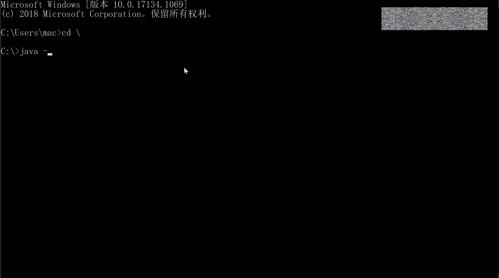
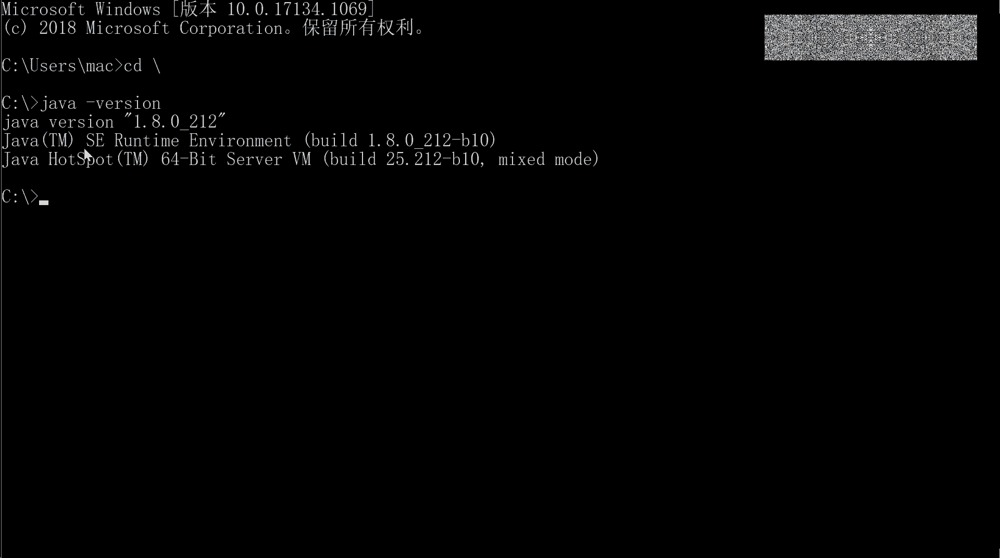
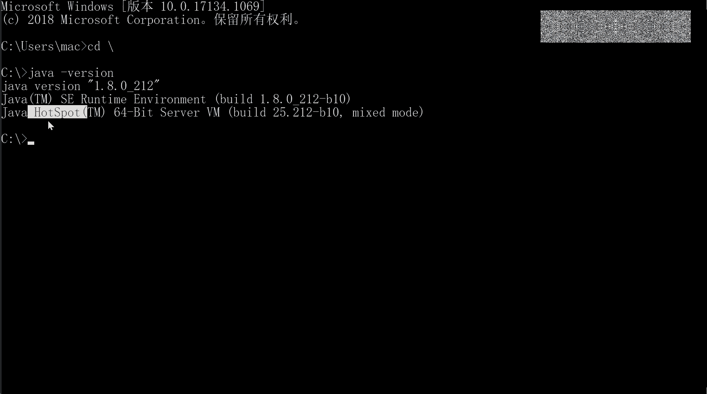
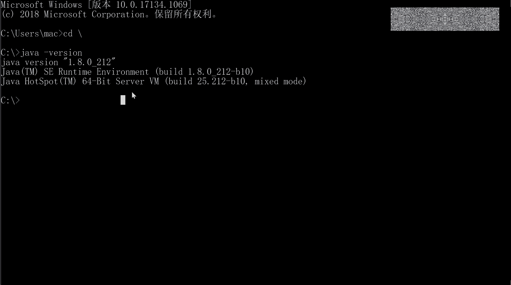
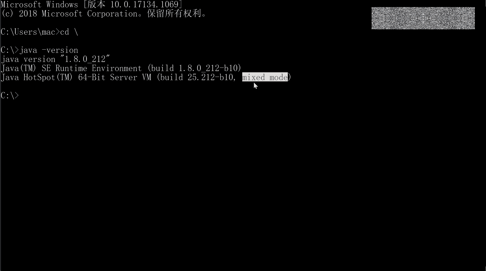
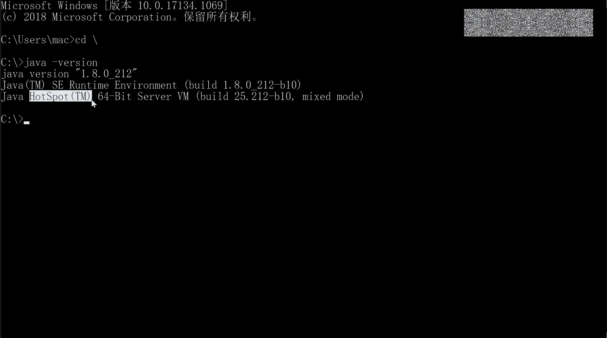

# 花了2万多买的Java架构师课程全套，现在分享给大家，从软件安装到底层源码（马士兵教育MCA架构师VIP教程） - P108：【JVM】JVM基础2 - 马士兵_马小雨 - BV1zh411H79h

我们来聊一聊呢，就是最新常比较常见的这种JVM的实现。这个这边的实现来讲呢。刚才咱们说了，说这VM呢是一种规范。既然是一种规范的话，那他就有具体的各种各样的实现。这个ATP协议站是吧。

具体的实现也非常多。嗯。定义了一个接口，具体的时现类呢也可以特别多，其实都是一样的啊。这1133三流的企业做产品是吧？二流企业做服务啊，一流企业呢定标准啊，这就是定的标准。呃。

oracle呢就定了这么一个这么一个标准。java虚拟机的实现标准。好，他自己呢也有一些实现。当然也是从s尔收购过来的。目前呢我们用的最多的这个java虚拟机，它叫什么名字呢？叫做hospot。

这我不知道大家了不了解啊，我起一个面航窗口给大家演示一下。

在我们的命令行里头提到加vadown version。

然后你会看到它会输出出来呢，你现在这个虚拟机的名字，我们现在用的这个虚拟机叫什么hospot。

64位的ser版。现在用的执行模式是mixed mode解释执行和编译执行混合的。

1。8版本。这个东西就是oracle的自己的hospot的实现。说其实除了oracle之外，还会有很多很多的实情。呃。

原来比如比较有名的BEABA这家公司是三个创始人的首字母的缩写形成的BEA这家公司呢叫它有一个自己的虚拟机的实现叫ja rocketcket。

曾经啊曾经号称是世界上最快的GVM后来呢被oracle给收呃收购了，应该现在是已经和hospot合并了。所以现在的hospot实际上是原来的jarock以及hospot的合并的版本。IBM有自己的。

呃呃，贾尔逊拟的实现，它的名字叫J9or这个microsoft啊序。微软有自己的时间叫micsoft VM。但不管怎么样，这些实现呢其实都是符合虚拟机规范的。

大的厂商不会说我一会我我我依赖于你oracle，我跟你体量是一样的。我会为什么要依赖你的oracle，依赖你oracle的东西。那如果你要是改的话，或者有一些什么样的东西的话，我我用起来非常的不方便。

另外还有一些版权上的冲突，所以我都会开发自己的。当然也只有有这种体量的这种规模的厂商，才会开发自己的虚拟机。那比如说淘宝淘宝有自己的淘宝VM，它实际上相当于是hospport的深度的定制版。

专门为淘宝准备的。阿里天猫用的都是这款虚拟机。还有的呢，既然他是咱们说现在虚拟机呢，你都是面对于某一个操作系统的，但是我能不能直接面对硬件啊？当然可以。我刚才不说了吗？

虚拟机这个东西本身就是一款操作系统。li VM是值得直接针对硬件的这样的一个虚拟机，它下面就是没有操作系统的，不是windows，也不是linux，只下面直接就是硬件。所以这个效率运行起来那就是更高了。

还有一个比较牛叉的呢，是是他啊这家公司这家公司叫这个应该怎么读呢？叫呃呃a z或者叫a z a a z之类的啊。el他有一家公司，它有一个产品叫Zin，这是一个商业产品。呃，你像hosport。

现在也是商业产品，但是它有一款叫open GDK，它有就对它来说呢，是还还是有这种开源的版本了。但是Zin呢是一款收费的版本，是一个土豪才能用得起的，据说特别贵。非常贵。国内估计只有像那些个垄断厂商啊。

才能用得起啊，比如说银行啊、电信啊，就这一类的估计才能用起，特别贵。呃，它商既然它是商业版本，那肯定有它的自己的一些特点了，对吧？它特点就是什么？快。速度非常快，尤其是垃圾回收。

它的垃圾回收号称是1毫秒以内。挺多时间。那个这个近的。它的一个算法，垃圾回收的一个算法，后来被hospot给吸收，所以才有了现在的。ZDC。不然的话，这个ZDC还没有。是参考的Z里面的视线。

还有很多还有很多啊。多了去了。据说阿里里面就有那么10个人能够自己写淘宝VM的啊。好，所以他们是那个P9P10P10级别，P11级别的这这个级别啊。专家你啊。好，那conex次问的问题非常的好。

conex问说hopot是商业的吗？官网不是可以下载吗？商业的就不能下载吗？我怎么觉得你这个逻辑有问题啊，学程序的人逻辑稍微给我好点啊，商业的就不能下载吗？哎，商业是可以的。😊。

很多的不都说个人他都不收费，或者是收很很少的费用。但是你公司要用的时候，我就收你更多的费用嘛。这种软件多了去了。java收费前一阵子呢。这搞得沸沸扬扬的，所以我专门还录了一段视频，叫做java要收钱。

我该怎么办？如果你想了解里面的来龙去脉，去网上搜一下老师我讲的视频，叫java要收钱，我该怎么办？中心思想很简单，hospot。8开始它不再提供那种免费升级了，谁要想必要八的升级，比如说1。081。8。

2版本升到1。8。3。好像这种时候作为公司来讲，你是要掏钱的。说的是虚拟机收费，不是java语言收费。java语言要收费，ja外语言就完蛋了。是我自己hosport设计的这款虚拟机。他要进行收费。

而果说我不再想免费的提供给你用了，免费还来给你升，级，还给你做维护。麻烦你以后想要这个升级版维护版本向我交钱。所以搬以后都要交钱。如果你要用hoport的话。但是你不用它不就完了吗？

你不是可以用open aDK吗？housebo开源版本吗？里面包含一个hobo的开源版本，对吧？或者是你用淘宝VM嘛，淘宝那个已经说了，这个是免费的，或者是你要用amazon的。实现或者你土豪。

你就买那个Zinex的实现。好了。最后呢，有的同学这由于是同学们的水平参差不齐，我需要给大家呢。解释一些相关相应的概念。这个概念是什么呢？就是GDKGRE和JVM到底是一个什么样的一个关系。

这张图一看你你就应该能看明白JVM叫Java的虚拟机，它只是来执行的，就是你所有东西都弄好了之后，让我来执行。你直接直接把那个。class的各种的东西全部弄好了，扔给我，我来执行，他就干这事了。

那么GRE叫什么？叫rtime呃 environmentment运行式环境。运行时环境，你只要要想在我操系统上运行，除了有虚拟机之外，你还得。你知道吧哪些核心内裤你得有，如果那些内库核心内裤没有的话。

你也跑不起来，你找不着那死 string点class，你觉得怎么跑啊？你找不着object那个class那个类，你怎么跑跑不了，所以。在GRE的范围来讲，要比JVM呃更大一些。

或者JVM呢是被GRE包所包含的这一个叫什么？那除了GRE之外呢？开发的这些个包这些内裤这些工具。好，这个呢叫做。Java的develop kit。JDK它里面包含这RE包含这边。好，关于这个包含关系。

看有没有同学有疑问的，没问题的同学给老师扣1。好了。😊，我呢简单的给大家介绍了介绍什么是JVM。我稍微回顾一下啊，JVM到底是个什么东西。大的范围来讲，它包括class loader。

包括自页码的解释器及速编译器和执行引擎。那么自己自己本身啊就是一个虚拟的机器。有自己的CPU有自己的计存器，有自己的内存管理。有自己的汇编语言。那么它呢是一个跨语言的平台。

只要你能够翻译成为class文件，你就可以在JVM上执行。它本身呢是一种规范，这个规范呢文档在oracle上面，嗯大家呢可以下载下来去读一下。常见的JVM的实现很多种，我们最常用的是hospot。

houses about8以后是要进行收费的，只是针对公司的商用，它会进行收费。如果你觉得买不起，你就用那个开源的。如果觉得买得起那你就买。这酒。IBM的microsoft VM。

是microsoft的啊，淘宝的有自己的VM，阿里好像最近是不是也分了一个叫阿里巴巴VM的，这个我不是很清楚啊，这个可以找他们问问。呃，laker VM针是可以针对针针对硬件的豪华版，你可以买金。Ha。

😊，嗯。那那关于JVM的最基础的内容，我半个小时讲完了，大家看看有什么有疑问的地方没有？