# 系列 3：P10：【多线程】synchonized实现过程 - 马士兵_马小雨 - BV1zh411H79h

第一个，首先我们在java代码这个层级，java源代码这个层级其实就是在你源代码里头加了synchronized的吗，大家知道这个代码这个你要执行的时候呢，就需要对它进行编译，编译成什么呀。

编译成class文件，class文件叫做java的字节码，好在这个字节码层面，这个srt又是怎么实现的呢，我给你分层角，你就更容易理解，因为网上有很多人呢讲这个东西的时候，它不是分层。

把那个操作系统的概念和你gv m那些概念全混在一起讲，所以你看不懂，我给你分层讲，你写一个java程序。

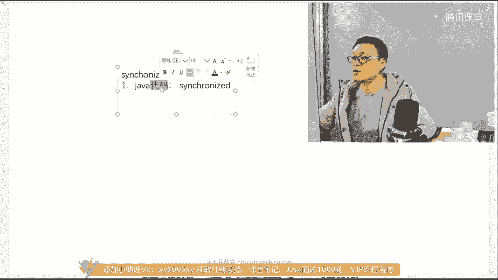

你在你的代码里写了synchronized，当你编译的时候，他干了件什么事呢，大家看这里。

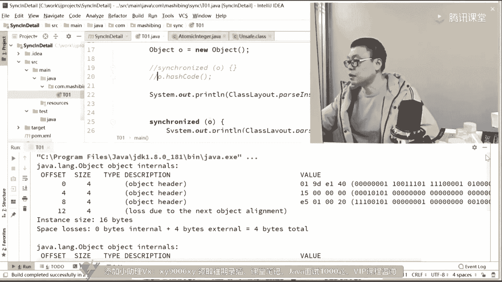

比如说我这里加了新功能o好，当你编译它的时候。

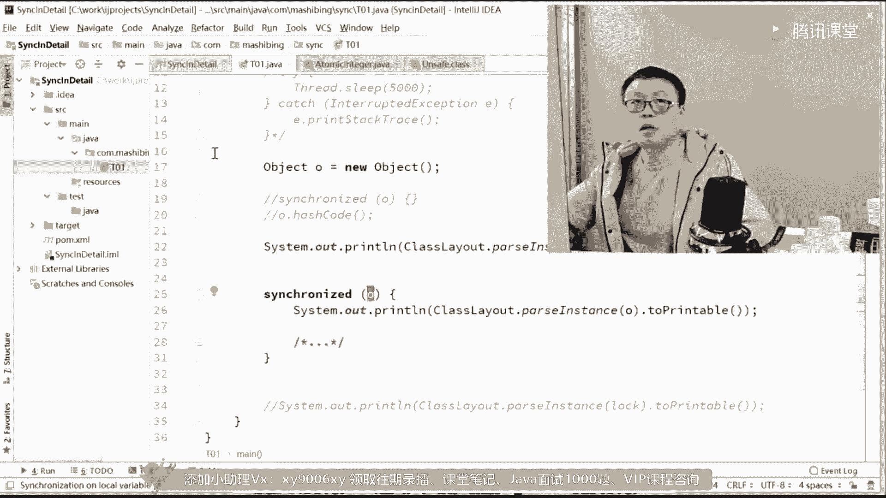

view show by code啊。

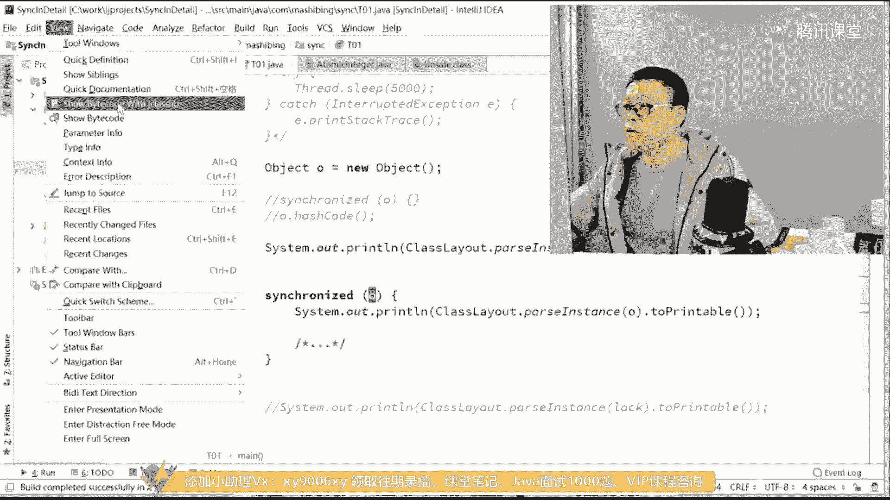

然后再拿出去去看他的字节码的实现，main方法里的字节码实现这个字节码实现，你会明显的看到这个东西，你把sirt去掉就没了，这个叫monitor enter。

monitor监视器退出的时候叫monitor exit，所以它在字节码层级的实现相当的简单。

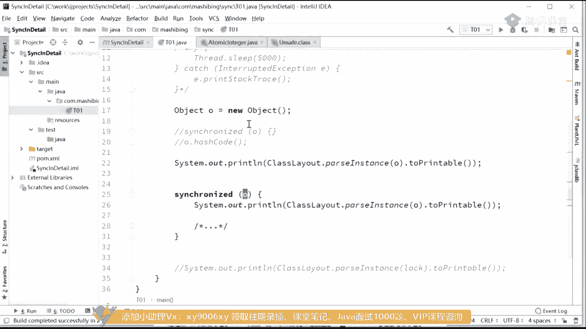

他在字节码层级就干了这么一件事，就是monitor enter加了这么一个指令，字节码的指令，然后呢整个synchront的代码执行完了之后要模拟it is it monitor监视器啊。

这个监视器我能监视你这把锁呢，现在我进入锁状态了，然后现在我退出锁状态了，就这么简单没了，但是在整个执行的jvm执行的过程之中进行所升级，自动升级，从六楼来进入到偏向左，从偏向左进入到自旋锁。

所好在更底层的时间，lot，compare and exchange，这是用我们更底层的一个事件，在cpu汇编这个层级就这么来实现的，所以一层一层一层single laze就是这么来实现的，好讲到这里。

关于synchroni的问题，你是不是可以吊打面试官了，感觉可以了吗，来有信心的同学给老师扣一吧。

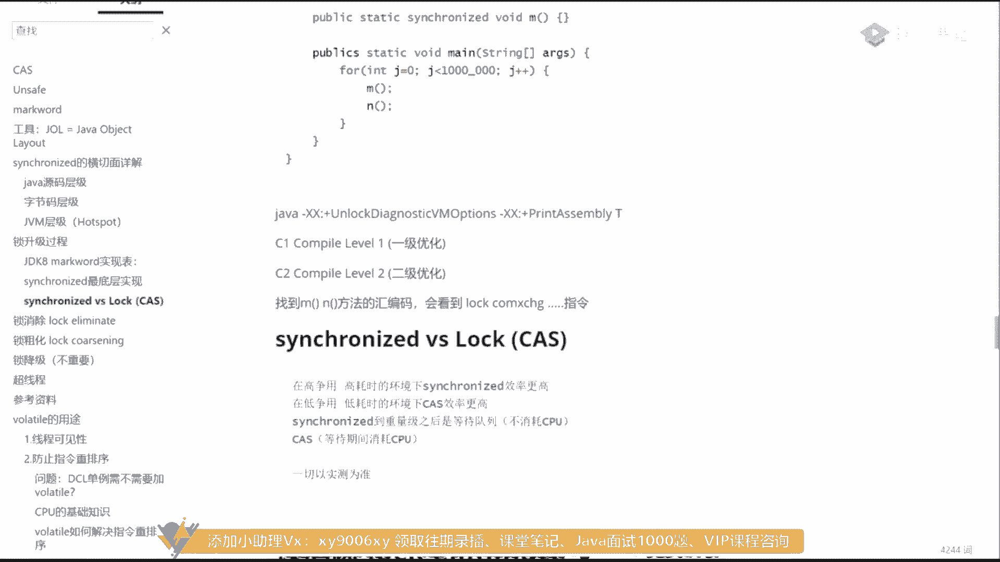

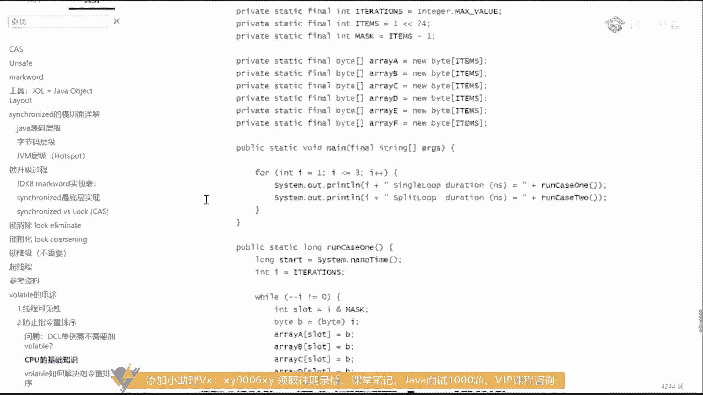

好了。

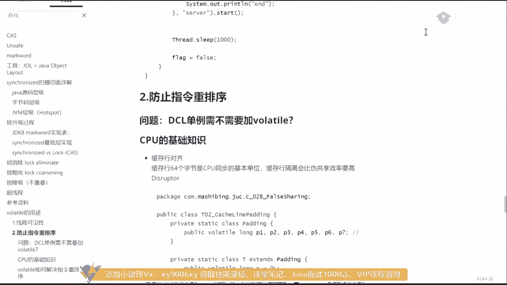

现在是09：50，再讲点儿，面试官不会也不会问吧，我讲完了，今天听的没有面试官吗，今天来听课的没有，面试官一定有啊，我不我不信没有，哈哈哈，再讲一点好吧，09：50，讲着讲着讲的不困了，所以再讲一点吧。

给大家就能多讲一点，就给大家多讲一点啊，但是关于volatile的话呢，其实它比synchront要难要难啊，我先跟你说一下，volatile其实要比synchront要难。

呃首先第一点model有两个，有两个概念，第一个呢叫做线程可见性，第二个呢叫做，阻止指令重排序，这个，关于线程可见性这一点需要老师讲吗，需要老师讲的，同学给老师扣二，哎呀县城肯定性也需要老师讲什么。

可见你对wallet就一点都不了解，应该是，所以我就想想我把程序放哪儿了，还得给你看看程序，the best locking，可中断的。

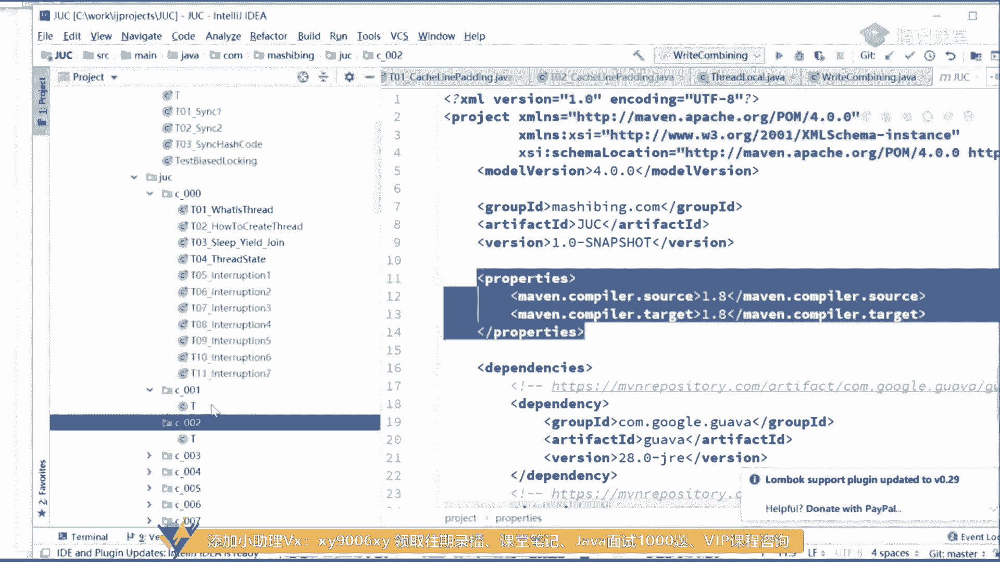

hello volt。

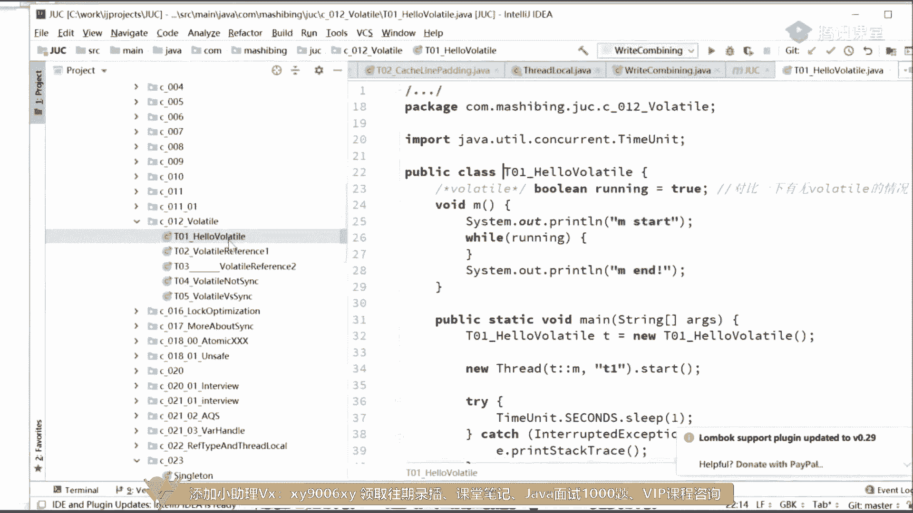

来先读一下这个程序。

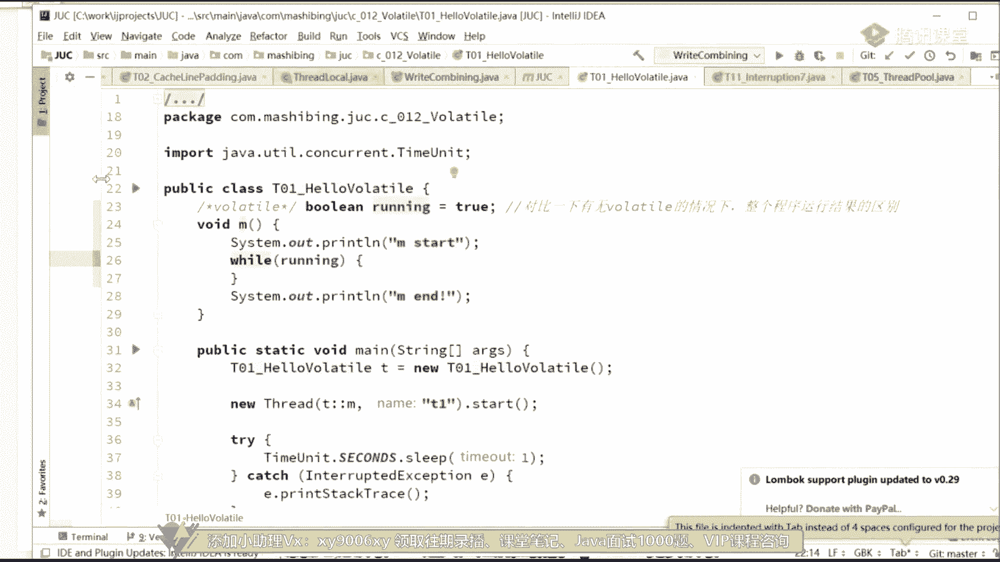

先给你这个了解一下小程序。

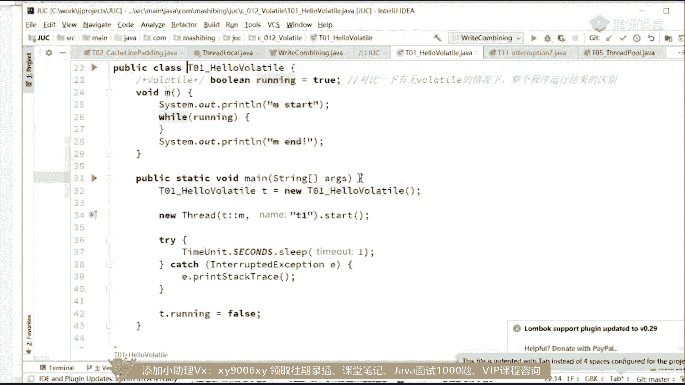

来，看这个wallet的基本的概念呃，比如说我们有这么一个小程序，这个小程序呢你可以理解为就是一个游戏服务器，这游戏估计运行还是停止，用一个布尔型的变量来存储它的状态，running等于true。

如果说你等于出的时候，它就不停地运行呃，在我们有一个m方法在方法里面的while running，只要它是在不停的运行好，那么呃他就不停地执行了这个m方法开始的时候，i'm stm方法结束的时候。

and，那么我们呢做了一个线程，尿了一个新的thread，在这个新的线程里面来执行m方法，这个方法里边是一个死循环，看到了吧，所以它它一打入进了m4 点之后呢，它不会停止，不要让他start。

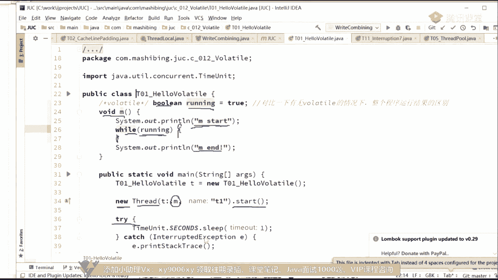

我把这个running设为false。

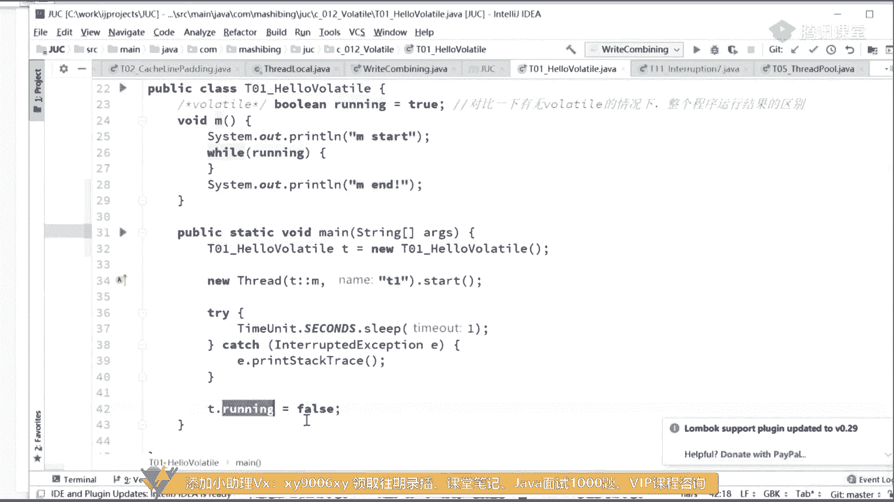

当然你想一下，我把running设为false代表什么一个概念，就这个while循环应该就结束了吗，while循环结束了，你整个m方法应该就结束了，还整个小程序啊，最基本的概念都不懂的。

你好好读一下这小程序写。

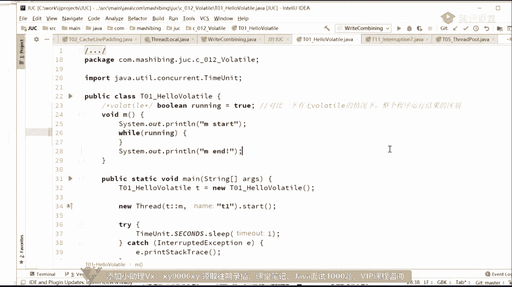

来读一下，十秒钟，好看这里啊我乱起来，run run run run，快点，啊因为我整个项目比较大，所以它run起来的话，得把整个项目全编译一遍，太客气了，当然你不用等了，你不用不论等多少秒。

他也不会结束的，他接受不了好，你往这儿看，我要是把这个变量给加了volde，停止我重新跑，把软件给变量给夹了，脖子条，stm结束了好这里是因为什么呢，因为model最基本的功能叫做保证线程之间的可见性。

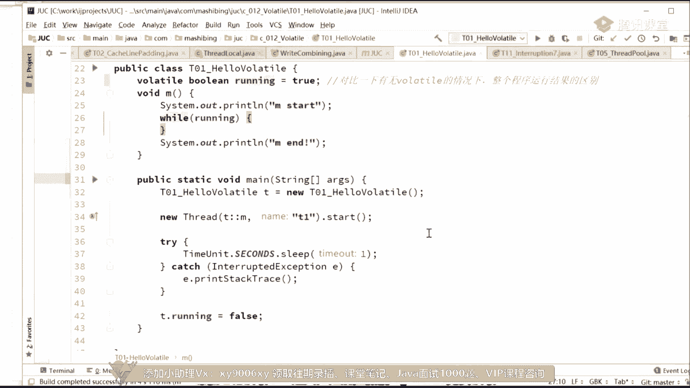

或者保证cpu之间的可见性啊，本质上是一样的，因为cpu是跑在不同的线程，是不同，跑在不同的cpu里的，来我们解释一下，大家知道我们有一个值叫running，它在平时在哪啊。

是在我们的内存里running，这时候能等于true，一个县城对他进行访问的时候，是把这个值复制到他县城本地去，线程本地内存，这个县城本地内存可以理解为就复制到自己的那块cpu的寄存器里面去。

我把这个值读进来，它是一个true，这个线程是t一的线程，它不停的执行m m里面只要y这个true就行了，well发现他外号为处，它就跟着不停的执行，不停的执行不停止，虽然在另外一个县城里。

我们的主线程里把这个r值读出来，然后给它设成了false，但是呢这边看不到，知道吧，那怎么让他结束啊，给这个直接问了他们，word上什么概念叫做保证线程可见性。

保证线程可见性的意思是一个线程对这个值进行了修改，马上给我写回去，而且另外一个简中要用到这个值的时候，下一次循环我要用到这个值了，重新给我读出来，这边改了之后，下一步它重新一读，读出来了。

读出来之后就结束了，还有这叫做保证线程可见性好了，同学们，所以wallet的第一个概念叫保证线程可见性好。

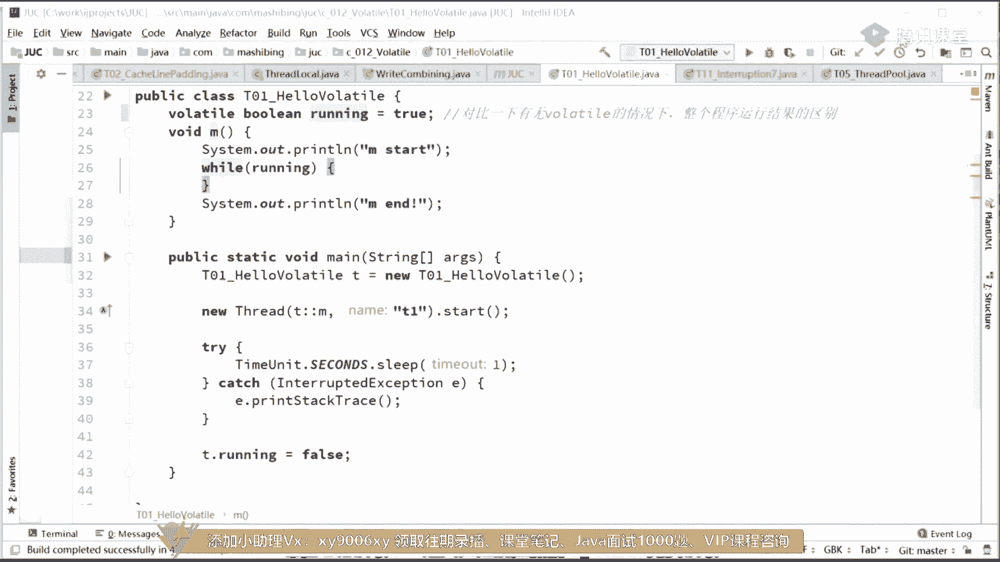