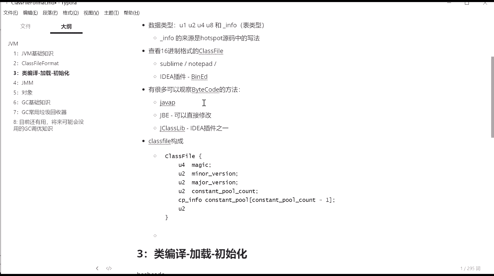
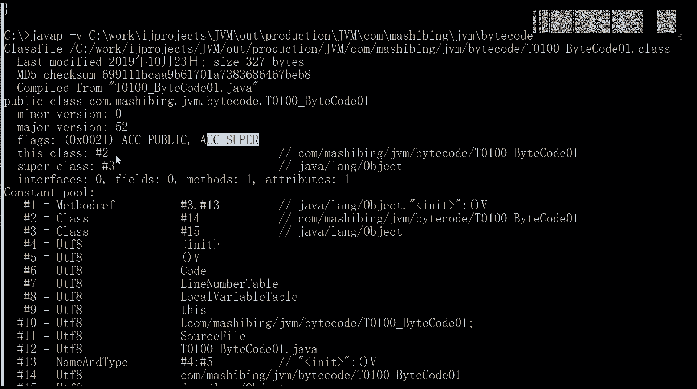
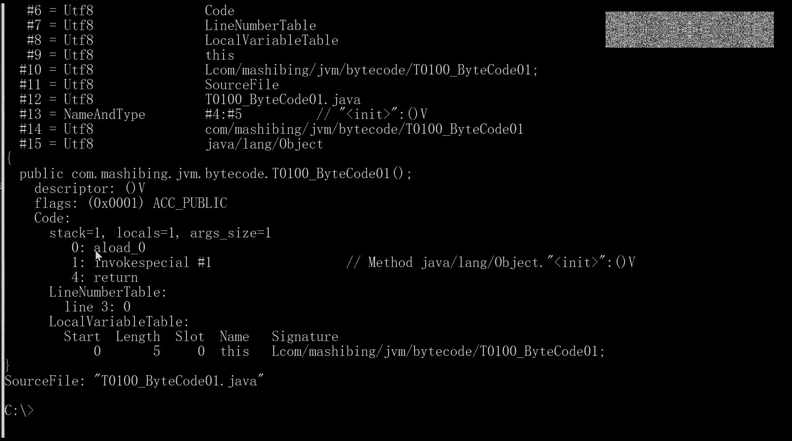

# 花了2万多买的Java架构师课程全套，现在分享给大家，从软件安装到底层源码（马士兵教育MCA架构师VIP教程） - P110：【JVM】Class文件解读_1 - 马士兵_马小雨 - BV1zh411H79h

所以我们讲呢整个class文件的格式，它就是一个二进制的自节流。这个二进制自节流怎么解释，那就看由谁来解释了。这个东西是由java虚拟机来解释的。它解释的时候是怎么解释呢？

注意看class呢大概有这么几种的内容啊。这里呢我给大家画了一图。因为很多那个书上也好，或者是文章上也好，他们讲这部分内容的时候呢，用的都是表格。那个表格的话呢，你要想脑子里有一个。

从大到小的一个完整的这种概念还是比较难的。所以呢我尝试呢用这个X mind呢给大家画了这么一张图。那么这张图呢，你你从头到尾看完了之后呢，你这个class文件啊差不多就能够全搞定了啊。好。

我们一点点来看啊，class文件呢它有这么几个几种几种几种。呃，整个class里面有这么几种内容啊。第一个呢叫呃mag number魔术啊。

man version major version这东西呢是一个class文件的版本号。后面的是constant pull count。你一看就知道常量池，然后下面是常量池的一个具体的实现。

你对常量池里面到底什么内容？我我先把打开的这部分给它合上。我们先勾屋建瓴，从最顶层的结构开始看，顶层结构就这么几个啊，medy number minor version  meta version。

但是这里就是全部都是。版本版本的东西，还有呢constant pull count说常量池相关的常量池的具体的实现。Access flags。这我们应该怎么翻译它嗯，叫做。那这这个应该怎么分？修饰符吧。

就是整个class间那个修饰符，你是public的，还是private还是protected的这部分东西啊。fis class当前的这个类叫什么名？super class副类叫啥名？呃。

anfaces count实现了几个接口，具体实现了哪些接口，有哪些个属性，fieldels count具体有哪些个属性？有多少个方法，具体有哪些方法 methodsds。

attribute count还有其他的一些附加的属性有哪些？附加属性的具体信息。大概就这么多然后大家呢如果大家真的对这个东西感兴趣，哎，我希望你能够背着把这东西呢给它。脑子里记下来。

或者在纸上能够画下来。这要求有点高了啊。感兴趣呢就可以研究研究。实在记不住也就算了。好，我尝试在PPT上呢给大家解释一下。这个我故意留了一些空格，咱们讲的时候呢，填上去。

让大家呢脑子里呢印象会更加深刻一些。我们一个一个来看。这里面呢能够很清晰的看出来，就是每部分到底有多长。一般来讲。U1U2U3U呃U4U8，这里指的什么？U是指的unigned叫。

无符号整数U一就是一个字节，把这一个字节看成无符号整数，就这意思。其实U一呢你不用多想，就是一个字节的意思。U2就是两个字节，U4就是四个字节，U8就8个字节。我一个小格是一个字节。这对16电制来讲呢。

我这一个16电制数就是4位嘛，两个16电制数就是一个字节8位。好，大家看这里。前面的四个字节。指的是这个文件的统一的标识符。当我们看到这个文件统一标识符的时候，就知道这是class文件。

而不是GIF文件，也不是PNG文件。很多文件格式都是嗯这么来标识的啊。你像GIF有它自己的头。呃，PNG应该也是，就是你你你打开这些文件，用16进制打开的时候，它前面这几位基本都一样的。

当我们看到这么几位的时候，就0X咖咖啡baby。你就知道哦，这是java的编译完的class文件，这是四个字节。所以这部分呢叫做magage number。过来。大家呢稍微的。画一画好吧。嗯。好。

这部分叫什么呢？叫做。My number魔术。你的EXE文件也有类似的东西啊。好，后面四位前面两位呢是。前面这两位是minor version。minoror。

miner的意思就是那个那个那个整个版本里头那个小。小版本和小标识符，比如说我们版本叫52。0，它就是那个点儿零的概念。后面这个叫大的版本号啊。我们class文件目前是有哪些个版本啊。

这个叫major version。我呢是用JDK8进行编译的，所以它编译完成这个编译完成之后的这个版本呢是0034。注意这个0034，这个34是什么东西呢？是1个16进制，那么翻译成十0进制是多少呢？

你自己去算一下3乘以。16的1次方就484乘以16的0次方，448加452。52在。整个的呃java的这个体系里头呢，52这东西就是。java呃1。8编译完成之后就是52。好吧，1。9应该就是53了啊。

毫无训练痕迹的小戏，你问出这个问题来。快气死我了啊。嗯，毫无训练痕迹的小戏，你下去之后找到咱们网站。里边有一个菜鸟预习。在菜鸟预习里边。是一个。有一个叫叫二进制的预习内容。下去之后把它看完。

这个里面写的是十六进制，我已经说半天了，这里面写的是十六进制啊。十六进制里面4A是10。C呢ABC是12啊。不会有同学问出这个问题来。嗯，你的基础真的是该好好打一打啊。好吧。

不过呢幸亏咱们是有基础的给你打的啊，你去翻一下菜鸟预习里面的二进制的内容，好吧。嗯。好，我刚才讲的这个这。这应该是几个字节了，这8个字节有没有同学有疑问的？

就是当我们看到这个class文件里面内容的时候，我们看到的这8个字节哎，就是代表的是这个意思。傻了，不不要傻啊，没事儿啊。😊，没有这方面基础是正常的啊，往前翻一翻。好，看这里后面是什么呢？

后面是constant pull count，就是常量池有多少个。有常量池里面有多少个内容？常量池是一个池子，是一个是整个class文件里面最复杂的内容，而且常量池里面会互相引用。

以及常量池会被其他的那些个各方面会引用到。所以常量池呢是极其复杂的一个内容。我们更详细的东西呢，我们一会儿再说，在这里呢会告诉你常量池有常量池里面存在了多少个常量。好。

所以这里是用两个字节来告诉你常量池里面有多个常量。那我问你，既然他用两个字节来代表，他最多能存多少个常量啊，同学们。这个叫做。Constant。P。Qut啊。嗯，conson book。两个字节啊。

二的16次方65536哎，当然。它最大的数能够代表65535。但是呢由于我们常量值后面。到底有多少个常量呢？唉，其实是constant pull count减一啊。拼错了。

consent pro count减1。constant pull count constant pro是长度为constant pull count减一的一张表。或者是这个一个数组就行了。

然后这里面的内容特别繁琐，特别。特别的繁琐，我们一会儿再来聊里面内容。所以当我们看到啊，比方说这里我写的是十。注意这十是16进制，那实际当中是有多少个常量池，有多少个？16减1。是有多少个常量呢？

15个，那为为什么要减一？因为我们的常量值的编号是从几开始呢？是从11开始。我们平常的数组是从几开始啊？是从零开始，但是呢常量值的编号是从一开始啊。为什么从一开始原因是它有一个零存在那里。

将来没准有哪一有一有一些引用指向呢，会表示不指向任何常量池中的任何一项，那个时候就可以用零号来代表。它保留了这么一个可能性啊，所以从一号开始。好，看这里史蒂文语说这个常量值数量个数和我编译的不一样啊。

你废话，你里边那个写了什么代码没有？你像我一样，什么代码都没写，它应该就是一样的，好吗？你里边要写了一个。11个成员变量或者方法，那肯定就不一样了嘛。

你见过哪个class跟另外一个class那就完全一样的那除非代码一样，否则肯定不一样啊。好，不不跟你不不多说啊，后面后面的是什么呢？我们继续看这个东西呢叫做access flags。就这小。

这项是什么东西呢？其实就是在class文件。前面你写的是public的，是不是final的，是不是一个interface，是不是abstract的，是不是annotation。

是不是enumeration？okK是不是public类型是吧嗯。后面呢又有两个代表的是什么？当前的class文件指到常量池里面的那个表里面，常量池那个表里面内容。super格副类置到畅量池里面。

Interface count。interfaces好好。这张图呢我先留在这儿。留作以后，你自自己的一个作业，你自己呢在纸上啪啪啪能把它画出来。我如果现在呢给大家这么来解释，我相信大家看起来非常的费劲。

所以呢我们采用另外一个工具，这个工具呢。叫做。它会把我们class文件里面内容帮我们翻译好，翻译好了之后呢，到底里边有哪些东西，我们能够看的更加的清晰。好，看这里。这个工具也有好多种。那么第一种呢。

java自带的叫java P的命令，我演示一下吧。

有javaP啊，有这么一个命令。java P是显示那些个class文件里面的信息，它的用法呢是java P后面跟一个我们自己的参数啊，再跟后面跟一个class文件的的的的的对class文件的名字。呃。

我们classus文件。的名字的话呢，我得切换到那个。

class文件所在的目录下面去。看这里。拷贝一下。

Copy path。嗯，我们这文件在这呢啊。😊，呃。javaP。嗯，后面写我们这文件的名字回撤。Compelled。那只是。4。只是显示了非常简单的内容。GP呢可以带带参数等Vvers。详细内容。

他就会帮我们把这个整个class文件里面的这些详细内容帮我们翻译一下，让我们来看。他会帮我们翻告诉你啊，theman version是多少，mar version是多少啊，flags呢是有什么东西呢？

public的，而且呢有一个supersuper是一个遗留的概念。

在我的。图里面呢跟大家呢。解释过了啊，看这里。这个super呢是一个该标志，必须为帧，是JD克1。0之后呢。

它一个遗留的概念，所以你看到的任何class这里的AC super都都是有的，这个很正常啊，不用去管它。大家你往下看啊，this次class后面编号是多少，super class编号是多少啊？

当你拿这个来看的时候，你就会方便很多了。

OK这是。这个工具java P这是java自带的，你不用安装任何的东西。还有一个叫就JBE如果你感兴趣的话呢，可以下载下来去使用一下。这个JBE呢叫java的呃ba code的edit。

它除了可以观看那个二进制码之外呢，还可以直接进行修改啊，你就可以在那个直接上面拿java的汇编语言直接写东西啊。那好，我最常用的是这个啊叫Jclass library是ide的插件之一。大家看这里。

这个插件你下次面自己去装settings，就这个插件Jclass lab。Bite code viewer。这拆件怎么用很简单。首先你确定你这个class文件已经有了。然后呢。

比如说啊你你你我们现在是呃有了这么一个原文件，然后呢，我把它编译一下build build project。当bu完了之后呢，我们。thinkk一下。嗯。好多class没有显示出来。必有的。啊。

正在 build的没 build的完。呃，你确认了你这些class文件呢已经全部编译出来了。好吧，然后你找到任何的一个class。把光标放在我们这class文件的。类体里边儿。然后看这个菜单儿。

view菜单。下面有一项叫做show bad code。With j class library。当你安装了这个插件之后，你就会有。嗯，这个选项了，点击你会看到啊。

它会整个的帮你分析整个class的内容，帮你分析出来。好，假如你没有按装这个插件的时候，是什么样子的呢？你只有这个菜单，这个菜单是什么叫做。6。当然你得选选中我们这个class文年啊。

Will show bad code。这是艾迪尔自带的。这这个东西啊s by code。那么这个东西呢就是用java P给分析出来的。也就是刚才我们用的那个命令行分析出来的。显示在这里了。

但是这个不好看，看起来不方便。所以一般我们用这个插件叫Jclass library。这个插件当我们打开了这个class文件之后呢，他会帮你来分析下这个class文件里面到底包含哪些信息啊？

我们来看看它分析的呢非常的。多看这里。他首先会帮你分译出来这class文件的general information通用的一些信息。看maner version。小版本大版本是1。8的，552。

他而且我会告诉你，这是这是这是1。8编译出来的classus。consin pro come的16。长度是16。产量池的长度是16啊。Xs flags是0X0021。

这里面涉及到了谓的谓语谓谓语呃呃安慰语的一个运算。按位语的运算呢。不知道咱们同学们有多少同学不熟的，需要我跟大家聊一下的，有没有？首先第一点啊，如果说你二进制不熟悉的话，你应该去看。我在刚才说过了。

菜鸟预习里面关于二进制的内容。如果你觉得不熟，需要老师讲的，可给老师扣2，好吧。如果不需要的给老师扣一就行。这里面牵扯到一个二进制呃安慰语的运算，原因其实是什么呢？我们来看这个class文件结构里面。

你看啊这个ACCplic是0X0001。然后ACC呃super是0X0020。刚才我们看到的它的结果是一个什么呢？是1个0X0021，其实就相当于嗯。其实就相当于这部分与上这部分。

这两个谚语就是0X0021。那好。当我们看到000X0021的时候，你就会知道啊，它是由0X0020和0X0001组成的。所以呢它既有ACCpublic，又有ACC superuper。嗯。那这样的话。

它就可以用。两个字节。能够代代表很多的内容，把某一位置乘1，把某一位置乘0都能代表很多内容。所以我们这个access flags两个字节就够了。好，讲到这里，有没有同学有疑问的？没问题的。

你要给老师扣一，好吧。嗯，O。所以你看到他的这些个。general information的时候，你就应该能理解了s flags0021呢说明什么palic克再加上。

ACC superuper那个那个super的话是正常的一个东西啊，说this class我当前这个类到底是哪个类呢？com嘛是用JVM by code下面的这个类，这是这个类的权限定名。

它叫做co fully qualify的 name，就是你就相当于一个全名就行了。权限的名，他只不过把这个斜杠变，他得把那个点变成了斜杠。它前面有一项叫CP音fer2号2号CP音fer指的是什么呀？

这个名字在哪存着呢呢？其实是在。常量池里面的2号存了这么一名字。jaline object为什么还会存这么一个东西啊？你想一下，也拿大腿想一也，应该知道这哥们儿是从他的父类里面继承，他父类是谁呀？

保不证他这个来。这个类的名字在哪存着呢？在修在常量池的3号里面存着呢。interfaces account有多少个？呃，你你实现了多少个接口？fieldels count，你有多少个属性。

你 methodss count，你有多少个方法，attributs count你有多少个。其他的那些个附加属性。这是一个general information，它自动的帮你分析出来的。下面。

第二项叫什么呢？叫consant pool。好，这一项是最多最复杂的。刚才我们看到了cons pool，一共有16减115项。当你打开的时候，它会默认的帮你把这首像全列出来。我们一个一个来看。

这个比较就比较好玩了。当你能看懂conant constant pro的时候，这class文件你基本上就懂了百分之七八十了。

