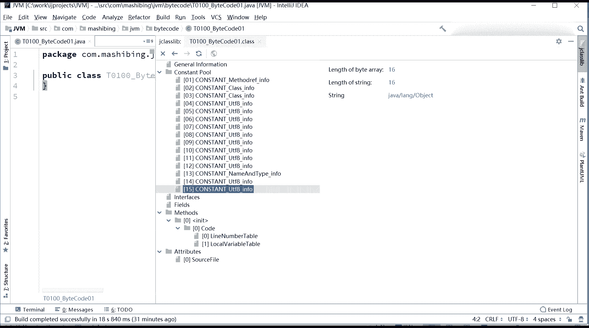
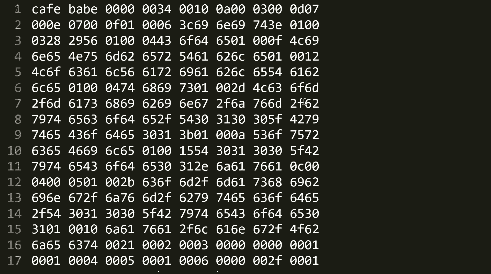

# 系列 3：P111：【JVM】Class文件解读_2 - 马士兵_马小雨 - BV1zh411H79h

呃，因为我这环境呢编译的时候用的是那个十1的那个编译器。但是我指定编译出来的版本是1。8版本。所以他这也稍微有点问题啊，他可能看到的，你们你们如果是用1。8编译啊，用1。8来观察。

可能跟我看到的稍有区别。常量池的长度什么的，里边内容什么的，呃，但是关系不大啊。你只要能读懂里边什么信息就行了，关键信息能看懂就OK。好，下面我们来讲常量池啊。首先第一件事啊。

常量池里面注意常量池里面的常量类型特别多。Oh。这个常量池里面的光常量类型就有这么多种。我给他就列出来了。就这么多种。1345有什么为为什么没有2啊？标记常量池的每一种类型，前面都有一个。

一个字节的标记。13456789101直到18。这里面呢是用的最多的叫constant pullcon pull uUTF8UTF8记住了，这是代表什么？UTF8的一个字符串。UTF字符串听懂了吧？

记住这个就行了啊。然后这一会儿我再给你详细解释一对那个二进制的，你就明白了。还有呢呢是integer是一个int类型，float类型，long类型，double类型class类型。呃。

Stamlation。Field reference。属性引用的类型，method reference方法的引用interface呃，met reference就是这这这接接口方法啊。

name type接口的就方法的名字和类型的一个代表。mettter handle， method type invoke dynamic infer，这后这是这是1。7之后才有的是关于。

加了那个leer表达式之后，sorry是加了那个动态的内容之后才有的三项啊。嗯。我们看这个主要的能把主要读懂再说。我们先来看这里面会有哪些东西啊。第一个呢叫constant method一fer。

它会它这东西呢，他已经帮你分析出来了。呃，我们来看这里，它常量值里面的第一项存的叫是med reference infer，是方法的一个引用的信息。那这方法引用的信息里头包括什么呢？

方法引用信息里头我们来查一下啊，metd reference infer method method where。mer infer在这里。它包括里边包括三项，就这这个这个信息里面又包括三项，哪三项呢？

它的标记标记是10。呃，是后面的index两个字节。指向什么呢？说这个方法到底是由是包含在哪些可哪个class里面的。它是指向常量池里面的另外一项，哪一项呢？

就是这项constant class infer。那好，下面的这个呢叫指向谁呢？指向constant type nameman type infer的所所引的。下标值。如果我们能这么来理解的话。

就是我们常量池里头呢有123456，1共15个这么多。我的第一项里面存的内容，它会指向谁呢？指向别的项的内容指向别的项的内容。当然了这个工具已经帮你分析出来了，它指向的呢有谁呢？

class的名字是指向我们常量识别的3号内容，3号内容是一个const class infer嘛。你看这个3号内容的名字是什么呢？javaline object。O。然后接下来呢。

是指向nameman type的类型。是指向几号内容呢？13号内容13号内容是name type， name type是指的是什么？指的是这个方法。第一，这个方法的名字是什么？第二，这个方法的。

这我们应该怎么说描述符。是什么？好，看这里。当我们看到这个方法in initial的时候，你就会知道这是一个构造方法。构造。当我们看到这个方法的描述符的时候，你就应该能知道啊，这个方法是前面是一个括号。

代表什么？这方法里面没有任何参数。返回值是一个VV代表什么？V代表word，它的返回值是一个w。所以这里是。object那个类下面的。默认的那个构造方法。啊，不知道我说到现在。

你大体的意思是不是明明白了没有？刚才的这小段有没有同学有疑问的？大概的意思啊，因为这东西需要你下去之后，自己慢慢的好好的细细的抠。And。没问题，同学给老师扣一好吧。😊，有的学说我还是不理解，我的妈呀。

怎么从二进制里面读出来这么多内容，到底是怎么读出来的呢？好，我下面再进行一个直接对二进制的分析，看看你是不是能理解。大家看这里。这是刚才呢我们这文件啊编译出来之后的。

内容咖feba这这个这块这个这块我就不说了啊，就这个。呃， many number minor version， major versionconsant count一共是15项。好。

15箱里面的第一项。你还记得吗？第一项是什么东西？上来之后是一个字节的一个索引，注意是一个字节的锁引。重新化。我们我们翻回头去看这个规范，克class文念的规范。就是你看这个永远要对着这个来看。

当我们在constant pull count完了之后，后面马上就开始我们的里面的具体内容。而里面具体内容的话。这里面具体的内容呢，包括索引标志和类型。是这个首先呢我们来看任何一个项啊。

第一个字节只占一个字节。第一个字节是它的这个标志。这标志是什么东西？如果标志是一，那就是代表是UTF8。如果标志是三，代表的是NT值。好，对于我们来说，我们的这个标志是什么呢？我们第一项的标志是什么？

你看看。第一项的标志是什么呀？0A。0A。十进制就是十0。那我们就去查class文件里面十这项是谁呢？是constant method reference reference infer。

所以在我们常量池里面的第一项。刚才你看到了常量值里面的第一项是constant method reference infer。

接下来我们就要去查这个constant method reference infer的东西。好，看这里它里面的结构又什么样子？它里面首先标记是十，接下来呢是两个字节。这两个字节呢。

是指明声明方法的类或者描述V接口那个conclass infer的所引像，也是constant pool的所引像。后面两个字也是nameman type的所引效。所以你看啊，我们继续看。这个地方是。

我把它放出来。放大一些，看这里啊。呃，这个地方是我们的呃代表我们是我们的my method reference infer那个索引像。索引像完了之后的两个字节。

代表的是它指向的别人家那个那个那那个那个池子里面那个class类型啊，那个那个所影像。但是你看0303代表什么呀？指向的是常量池里面的3号。3号内容。好，后面呢是0D。000DD代表的是13是吧？A。

BCD对13，所以它指向的是13号内容。因此这部分到这儿。这是几个字节呢？123。455个字节。好，这部分就是我们常量池里面的第一号。当然，03代表的是什么？你是不是得找那个3号常量池里面内容去啊？

下面我们就继续看第二号常量池是07开头。长量池里面2号啊07开头，这里面又是什么内容？再这么一步一步一步一步进行分析。好，刚才这一段大家不知道是不是理解了，不知道说清楚没有。能够理解同学。

你给老师扣个一，好吧。所以我希望你下去之后呢，你就对照这个二进制，你就这么一个字一个字的来分析，你看看是不是能看懂这个常量池的部分。如果这部分你能看懂的话，那么常量池你过了。突然感觉克拉斯没那么丑了。

是吧啊？😊，好，我们再来分析一个，好吧，我们刚开始分析到了0B这里啊，我们来看07同学们告诉我这个07代表什么来着？告诉我一下07代表什么来着？给我家反馈。😊，我们得去查谁呀，得去查这个七代表什么。

这个七代表什么呀？😊，constant class infer。是吧什么标记嘛。所以。翻回头来看我们分析对不对的时候，你往这看，2号是一个constant class infer。

然后这个constant class infer又指向了他的名字，字符串是谁啊？是我们自己当前这个类的名字，它指向了14号。然后你再对照那二进制，看它是不是指向14号啊。看我们那二进制。07好。

是我们的常量池的第二号的标记。接下来000E。是不是十4啊？okK14啊。😊，那14号又是谁，你自己去看吧。接下来又是07，07是谁？class。然后000F指向的是D。15号大家还记得吗？

我们这最第一号的时候还指向了这个03呢，这是这是第三号啊。第三所以第三号还是class，它指向是谁呢？javaline object它代表的是我们是哪号呢？15号。所以你再往下看的时候，4号。

是1个UTL8UTL8比较简单，它就是一个字符串。imitial initial这个是代表一个方法的名字，这方法名字叫构造方法。由于各造方法呢都和和类同名，所以他都用引力手来代表。你继续往下看。

第六第5号是。方法的类型的一个代表。这个方法类型是特定的一种表示方式，前面用括号里边有参数，拿这个参数来代表，然后后边跟它的返回制类型，而这个返回制类型是用一个字母来代表的，是用哪个字母来代表的呢？好。

我这个文件里头已经给你写了。我们是写我是写在了message里面。啊。Methodds， the de index。它的描述符描述符是先参数列表放在小括号里面，后面跟着返回值。你比如说M。

你用括号V来代表，就表示它的返回值是V，里面没有任何参数。那假如说里边是一个tto string to string的一个方法。to string方法，它的返馈值是一个strring类型。

你该怎么代表呢？前面是一个括号，后面跟一个L。这是它的规范所标识的L，然后后面才是跟整个这个全名，后面还要加一个分号，用来用来分隔。好，这是整个方法的描述符。那更复杂的是什么类型呢？

你比如说我里面有这么几个参数，第一个参数是int类型，呃，一int数组类型，第二个呢是一个int类型，第三个是一个浪类型。好，这个方法的描述符会特别的奇怪，会是这么一个东西啊是这么一个东西。

这个东西呢你看的不清楚，我它拷贝一下，写到外面来。啊，这就是我们刚才那方法的对应的啊，我把放大。好，首先第一点I代表什么intI前面加个左中括号代表什么int数组，这是第一个参数。爱代表什么？int。

哎，左边加一个中块代表什么？应的数组，这是第二个参数。这代表什么long。第三个才说是浪类型。所以这里面包括三个参数。反回值是什么？愣了一下。はは。😊，嗯，我看我有没有给大家记每一个参数拿什么来代表。

看这里在这儿。discriptatory nextB代表的是byit，C代表是char，D代表是double floatat是Flong是J。后面SV代表是voL代表的是object。

但是后面你要跟整个的名称啊，数组是用左中号来代表的。如果你加两个左中号号，代表的就是两个数组。sorry，二维数组啊，对不起。第二餐数不是in吗？我看看啊，因为这个是我写的啊，不是不是那个什么什么的。

我有可能是不是写错了，笔误。看一眼。嗯。哦，对不起啊，这里笔误啊对不起，这里应该是把这个中块给去掉这样。突然看懂好。嗯，好。所以长证池里面内容最复杂啊，因为长量池呢牵扯牵扯特别多特别多多的内容啊。

okK我们再来看这个长量池里面的更详细的一些内容啊。你看呃这其实就是给这个方法做描述的。你一看就知道。好，继续看啊。这conant有第6号，第6号是code，这是一个属性表的名字。

后面我讲到这部分的时候，attribute attributebut。这里面呢除了so style之外啊，attribute。由于只是med里面啊，你看metd，我们现在只有一个方法嘛。

它里面有个属性叫coded。所以这个code的这个名称在哪儿来的？也是在我们常量池里存着的。因此你看到这个code实际上是后面要用到的一个常量的名字。

第7号叫line line number table，跟那个code一样，是我们后面要用到的某一个常量的名字。在这儿line number table。那么。这是第七项。

第八项呢叫local variable table，是我们在方法里面要用到的一个属性的名字，local variable table在这儿。你看这个local ver table。

它的名字的指向指向长辆车哪项啊？8号项我们来看这个8号项是不是local ver table。就这东西。优条单代表了字符串嘛？字符串 this。字符串儿。我们的整个。类的权限那个名全名。

字符串source style是我们后面要用到的。属性的一个名称。四符串儿。我们原文件的名字。后面用的source file，你看source file它指向哪一项呢？第11项第11项是什么呀？

s file。好，第12项是什么？呃，第12项是T01点java。是说字道是名字啊，第12项是那个我们真宗的那个名那个文件名啊。内蒙 type。name和type名称和类型。

名称、方法名、类型什么类型的？okK那么这个呢是呃是我们的整个的一个。不是权限那名，就是一个普通的名称。javaline object普通名称。所以常量值就完了。因此。

对于一个特别简单的class拉斯来说。好，这个常量池力就已经有这么多内容了。好，这个账调量词里大概存些什么样的东西，不知道大家理解了没有？好，能大致理解的同学啊，你给老师扣个一，好吧。

同学们大家记着这一点啊，呃就这个这个class的一些细节啊，你如果真的感兴趣，你真的需要花时间下去一点点的细一抠，好吧。总而言之，常量值是一个class里面最复杂的东西。写这种的人在阿里应该是P几。😊。

其实这个东西啊嗯它只是比较繁琐啊，它并不难。那么你说它难吗？它真的不难。我们我我们来看一眼这个原文件吧。

对我们学习的人来说真的不能，它只是比较繁琐。因为任何一个地儿你都得需要去查这个0T代表啥。这个0001指下来又是哪一个？然后呢，后面的0期又代表啥，这部分又指向哪个等等等等。你得去查这些东西。

得去查相关的一些规范。但是真正设计的人是比较牛叉的。真正做设计的，设计出来这个人是比较牛叉的class文件设计的特别的紧密，紧实紧致，没有任何的分割符。因此，这个class文件也得到了很多人的认可。

所以以后大家伙设计编程语言的时候，都不用自己设计格式了，我只要给它翻译成class就可以了。

