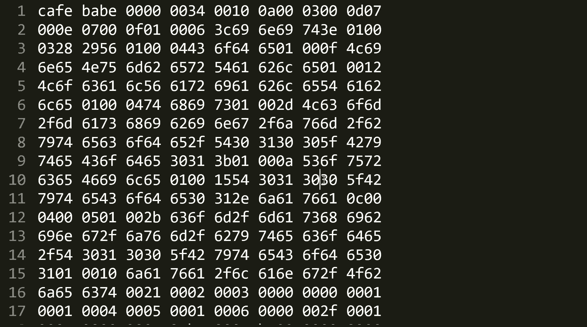

# 花了2万多买的Java架构师课程全套，现在分享给大家，从软件安装到底层源码（马士兵教育MCA架构师VIP教程） - P112：【JVM】Class文件解读_3 - 马士兵_马小雨 - BV1zh411H79h

好，看这里。后面的呢是interfaces。由于我们这个class呢我们没有实现interface，所以无所谓就没有了。呃，后面是fieldels，由于我们这个class里面没有任何的属性。

所以这fes里面也没有任何东西。好。有同学会说，里边没有任何方法呀，为什么meds里面会有一个选项呢？这刚才你看到了，它会自动的帮我们加一个什么内容呢？哎，就是。我给给给我们这个构造方法啊。

加一个无餐的构造方法，默认的。好在这个方法里面。这是这个方法的名称，namedescript。name是引用的第4行。是常量池里面的第四号descriptor描述是常量池里面的第5号。

Aces flags。他的访问符。访问标识符。public的。好，看这里。关于方法的仿标识符。都在这儿wesds的。Weathds。任何一个mets里面的选项都有这么几项。

access flag两个字节标识符有这么多。OK特别 low。好，name name刚才你看到第四行，descriptor第五行，其实这方法还有一些个属性附加属性。那附加属性是什么东西呢？

在这里全有了。最主要的有这么几个。扣的这是最重要的一项，就这个方法的代码是怎么实现的？大家记住这一点。好，这是他的名字，名字扣d就第六号。但是。

这个才是一个方法的具体的实现才是最重要的那这个方法具体是怎么实现的呢？好，认真听认真听。认真听。下面才是真真正正的显示了这个方法的实现。而这个方法的实现呢，实际上它引用的是code里面的这个属性。

而这个属性的话。内容就多了。当我们看到这个方法的时候，我们会去里边找他的这个方法里面的那些个1一条一条的命令，一条一条的指令。而java里面的这个指令。好，我打开我们的java虚拟机规范那本书。嗯。

指令。稍等一下啊。打开我们java虚拟机规范的这本书。怎么什么都打不开了？气死我了，这个。哦，打开了。这本书呢我已经下载下来了啊，你也可以去or克网站去下载。呃。薯签儿目录。

在java信息规范里头的第六节讲的是java virtual machine instruction set。第七节是它的一个参考，就是你整个的这个二进制码分别代表的什么内容？

认真听认真听这个方法的具体实现，翻译成class文件之后，全是这些东西。一个方法的具体的实现，这个翻译完了之后呢，全是这些东西啊，00代表没有做任何操作。

01代表A constant now02代表什么什么什么。这东西是什么？java的汇编。

所以作为我们java虚拟机来讲，当它读到一个class文件的。里边的内容的时候。我我这个找不不好，直接找啊，就是找到这个方法的一个实现的时候，可能我们读到了30这个东西号。

他就要去里边查表里面查30代表的是哪一条指令。

O。然后呢再把这条指令翻译过来，它到底是哪条指令呢？A load0。然后再去表里面查A load零里边到底是个什么东西，我们找一下A load0。

A漏0。在A漏的。在这儿看到了吧？0X19。

看我们的哪部分有0X19存在在哪呢？0。19。19。19在哪里？对不起啊。19。问题啊。为什么没有呢？😔。

他调用了jaline object。那有可能是object里面的那个要求。哦，A load的0A load的0，对不起啊，这是A load的，不是A load的0。A漏的A漏的A漏的A漏的0在这儿啊。

0X26。哎，不对，D漏的0。A load的A load的00X2A。

0X2A。找一下。2A。2A好，在这儿。这其实是我们那个方法的执行那段那段代码。你看啊第一个呢叫2A。

2A呢我我去就去查这个表，这个表里面呢告诉你这个2A呢，实际上它是。呃，A6的0的。这条指令好，接下来呢我们就要去查A50里这个这个指令代表什么？那么这个指令代表什么呢？

如果我们用Jclass library的话。我们直接点A load的0点一下。他就会帮我们。直接打开我们的oracle的链接。太讨厌了，我这口内部出错。

A漏的杠N。欧尔口把这链接给改了，太过分了啊，我们只能自己去查了啊。😊。

我们自己只能去自己去尝。😊，妈呀，这可就麻烦了。嗯。structions a load的0找吧。It's eat all。AAA。A漏的根啊这个。好，接下来你就去读哎这个。汇编指令到底代表的是什么意思？

这个汇编指令代表的是啊把本地的那个。呃，本地变量表里面的第零效是吧，放到站里，嗯，放到站里之后呢，进行第二条指令invoke special。啊，一环抄一环，这就是这YM会音。

当然今我们第一节课呢还讲不了这么些，我们下节课再来讲这里面的指令到底的是什么意思。但是不管怎么样，我相信呢你应该对整个class文件它的一个组织结构有一些呃认识了。我们再来的稍微的这个回顾一下啊。

整个class文件结构呢有好多好多种。类型。呃。尤其是到mes这啊，我们我们我们再稍微稍微回顾一下。嗯。

看这里。

好。整个class拉斯文件的结构啊。等我们大概理解了一些基础的内容之后呢，再来看这些就没有那么头疼了。它是一环套一环，一环扣一环的。好。

看这里整要克拉文件结构呢有这么几个may number0X咖fe baby是吧？matter version小号m version主号主号次号1。8是52。0，所以前面是00，后面是34。

然后constant pro count有多少个常量池，下面是常量池减易具体的内容。这常量值简易具体内容呢有有这么多种类型。我们我这我写的这个第一个呢非常的简单，所以你看到的那里就只有UTM8的。

还有呢像是me method reference的方法的，还有呢name and type的。现在你看到就只有这么多。如果你这个class越写越复杂的时候，你们自己感兴趣，下去加一点儿。

东西再加一点东西，然后来看看它生成的class文件到底有什么不同。最关键是这里面呢互相之间还引来引去的是吧？好，下面是excess flags。

 accessces flags呢指的就是整个class里呢，你你前面是写的public的，还是pripri还是还是什么什么什么东东？face class，我当前的这个类是谁？

super class副类又是谁？这个在哪看啊？这个实际上如果用这class library呢是在这里看。呃，他默他会给你放在gene information里面，它并没有在下面列出来。

那this class是谁呢？哦，它是访问的常量池里面的第二号，superclass是常量池里面第三号。你自己去找那个乘量池对应的内容就行了。那好。T续。实现了哪些？接口那些接口的索引。你可以想象一下。

如果你写了接口之后，那长量池里面肯定接口的名字写在常量池里。然后下面呢是对那些长量池的一个索引号的访问。有哪些属性？属性有具体的，有这么几项。这个属性呢access flags，它是public的。

是不是public的，是不是s的，是不是final的，是不是 volatile的，是不是transient的，是不是 syntheticthetic的。

 syntheticthetic是不是我们自己写的，而是由编译器自动帮你生成的。这样的属性。好。它的名称的锁引，记住这一看这个锁引，你啥也别说，一定是长量石的一个缩引。它的描述符到底是什么类型的？

具体是哪哪种类型的？另外它所附加的一些属性，attribute是附加属性，有的有有的没有。方法。方法的各种的。结构方法的结构是什么？哎，它到底是怎么样进行标识的？然后呢，它的名字的缩引。

它的描述符的缩引。还有它附加的一些属性，方法的附加属性最重要最重要的一项是扣的。代码是怎么实现的？而这个代码这个东西具体的在哪儿呢？实际上是在最后一项attributs里面。

就附加属性里面最重要的一项呢是方法表，也就是这个方法。编译完成之后的字检码指令。那么JVM看到这个指令的时候，首先会读这个指令进来，然后他根据指令去查他自己的指令表。到底是哪条指令？找到这个指令之后呢。

再来看你这个指令到底代表的是什么意思。比如拿A load的零来说，它其实就是在方法的局部变量表里面的第零项。第零项是谁，永远都是只要是你你你不是静态方法，永远都是这个d。他会把这个this扔到。

操作数站领。领导操作站在执行第二条指令。第二条指令叫invoke special，叫特殊调用，调用什么呢？调用this的构造方法。O。invoke special啊，invoke special。

这时候你在一些表里面去查。Invoke special。你看一眼这个invo special到底在的到底呢？哎它是怎么定义的，里边讲的是一个什么样的东西。然后JVM再根据条指令一句一句的执行。

当我们看到这个code的时候，最后一条是哪哪条指定的是return。

呃，我们看到的是A load0。A6的零完了之后呢，A漏的0是2A，下一条指令是B7。

我们来看B7对应的是不是叫invo special。invo special看到了吗？0XB7。

所以对于java虚拟机来说，它读一条指令嘣儿执行这个方法的时候啊，在执行这个方法的时候，嘣儿读了一条指令。他一查哦，A load的0，然后做相应操作。接下来再读下一条指令B7哦一叉是B7。好。

做下一个做下一个操作。

完事儿之后呢，再读另外一条指令，下一条指令是return，对吧？Return。return是B1，对不起啊，inbook special后面应该是带参数的。Invoke special。嗯。

Used to construct index to the runtime constant pool the current class。下面应该是两个参数啊，B1和B2。也就是说。它调用的是。

因为他有的指令带参数，有的指令不带参数啊。下节课呢我专门讲这个指令的内容。

我们来读这二进制啊，这个B7呢是带了两个参数啊。呃，D0001。后面这两个字节是那个指向常量池的第几号，常量池第一号还记得吗？是jaline object，如果没记错的话。

所以它调用了那个ja line object的构造方法。是干了这么一件事儿。然后呢，下一条指令是B1B1这个指令又是谁呢？我们去查一下。

嗯。去找啊B一的指令是谁呀？你看啊0XB1是谁呢？是return说明方法结束了。

因此。构造方法里面。好，这几条。有同学听懵了是吧？别着急啊，因为你听前面应该没听蒙就没问题。因为这块儿呢是我下节课要讲的内容，只是提前跟大家伙说一下了。这几条。就这么1234。5个字典。这五个字节。

是谁呢？是我们这个文件的构造方法的一个具体实现。我再说一遍。刚才你看到了我们生成了一个方法，这个方法呢叫构造方法。这个方法呢有一个code属性。code属性里面呢才是我们真真正正的这个方法的具体的实现。

这个方法呢？在站在站在虚拟机的角度，它是怎么实现的呢？它是就有这么这么123455个字节来实现的这个方法的具体实现。在我们人看来，这个方法里面什么都没写。但是大家应该都知道，调用这个方法的时候。

你需要调用谁啊？需要调用object的构造方法，这点没问题吧。我再说一遍，我们任何的一个class。当。呃，你你你你你如果不给他写任何构造方法的时候，他会生自己生成一个构造方法，这个没问题，对不对？

而生成构造方法里面你没有做任何调用的时候，它会调用副类的构造方法，object括号。我这我我讲到这儿，有没有同学有疑问的，有没有？再重复一遍，写任何class，你没有写任何东西的时候。

编辑器默认给你加一个无餐构造方法，无餐构造方法你的实现必须得你还记得吗？就是。任何的构造方法必须得调用副类构造方法。我们叫做构造子类之前必须先构造腹类。那副类里面呢就默认它会调用腹类无餐的构造方法。

也就是它会调用object这个类的。构造方法。好，讲到这儿，有没有同学有疑问的？有疑问你提没有没有问题，同学给老师扣1。那么这段代码是在虚拟机里面是怎么实现的，这么来实现的。就是这5个字节来实现的。

那这个五个字节到底是怎么实现的？刚才我们分析了一下。当。这5个字检。这五个字节，当他读到2A的时候，他知道这个。指令叫A漏的0A漏的零代表什么呢？把this压榨。压榨啊扔进去。然后后面呢是调用下条指令。

下调指令是谁呢？是B7，B7叫invo special。而invo special是需要两条，是需要两个参数的，哪两个参数呢？就是00和01，后面这两个参数，001代表什么？代表常量池里面的第一项。

常量池里面的第一项是java。L。All object。invoke special调用了javaline object，它的构造方法。所以这条指令是调用jaline object构造方法的。

最后一个B1。Return。好了，同学们。今天呢我带大家入门了class文件格式，但是我并没有详细的解释这里面每个字节代表的都是什么。呃，如果大家对这感兴趣。请大家下去之后呢。

你对照java的这条这个这个。

lananguage的specation，或者你去看那个深入呃理解张旭一那本书啊，它里面也进行了一些总结。当然也没有必要。因为我我已经给你总结出来了。你你你只要看到看着这个这个这篇文档啊，就这个。呃。

X mind的这个东西。你就能查出来到底每个字节代表的是什么东西了。嗯。这节课呢我们讲了class文件基本的结构。下一节课我们讲什么呢？好，将这些东西。A load到底代表啥是吧？

A store又代表什么？然后。F都要代表什么？invoke special代表什么啊？in呃invo static代表什么？invoke virtual代表什么IOR又是什么东西等等。其实这个东西呢。

java的指令集呢是用一个字节来代表，统共呢它就有个256条指令，最多有256条。所以他指令级呢并不复杂。另外呢我们也不可能带大家呢去每条指令，我都给你讲一遍，我也完全没有这个必要。

你要学会怎么去阅读说明书。就当你看到这条指令的时候，它到底代表是什么意思？我不理解不理解怎么办？要去看那个说明书。

🎼所以下节课重点讲java运行时的这种东西。