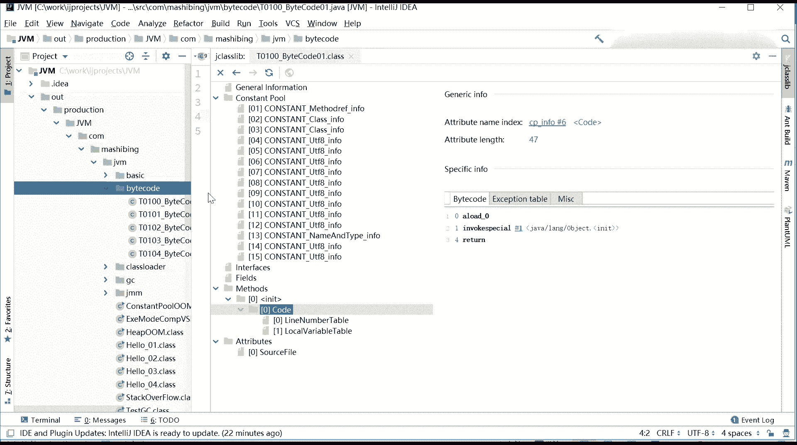

# 花了2万多买的Java架构师课程全套，现在分享给大家，从软件安装到底层源码（马士兵教育MCA架构师VIP教程） - P113：【JVM】第一天课后作业 - 马士兵_马小雨 - BV1zh411H79h

我建议大家做这样两一件事儿，可想啊给大家留点作业。

你比如说啊。一。

Okay。好，你比如说呃我我我我现在我写的文件呢就只有。

就只有这么简单，那么我是不是可以加一个接口啊，你比如说这个classpublic class T0101，然后它实际上两个接口，一个叫collonable，一个叫sealizable。

那它对应的这个二进制的码到底有什么东有什么有什么有什么区别吗？那你就打开来看看嘛，对吧？

这个class library嗯，你会看到thecont pro呢就有19项了，为什么会有19项啊？肯定会有接口存在吗？我们找一找一下，肯定有啊。

你看这 object的。J Iizable。强有了对吧？

那interface呢interface零是什么？interface一是什么？他。去指向了长量池里面哪一项，你就你就理解了，你就真正的彻底理解了哦。原来这个东西编译完了之后是一个什么样的内容？

那么你继你就继续啊，学这种东西的时候你循序渐进。你不要一下子搞特别复杂，有的同学上来二话不说，哇，七八十个属性啊，八九十个方法，你这样看就没法看。学东西也得需要。方法的好吧，循序渐进的来。

你比方说你再写一个里面就有就有一个成员变量，因他I等零。你看你再来看它里面生成的代码是什么样子。我简单看一下。

你看他cons pro里面一定有一项是什么东西呢？是那个。

因体者。

内门type。はい。这是它的类型的描述。Fiels。哎。

哦，关于这个主主要是这个零呢，它内部做了一些优化啊，它没有产生这个零。

嗯。这得改才行。就能等0这零是他内部做了一些优化，能写个888。然后要重新。rebud一下啊，一定要让它重新rebud一下。

我们看朝常池里面有没有这个888存在啊。

嗯。常量池没。

Should by code with your class library。常量池。Fielel the reference。

。嗯。😊。

Field。

第17项。は。

M粉。现在编义呢编译到这儿了。Code。哦，在这儿啊，对不起，它常量池力并没有存在，但是它存在了代码代码选项里面，代码项里面。他会把这个888的怎么复制过去。呃，你通过读这些代码，你就会知道它。

你你你你你你的成员面量到底是怎么实现的？呃，我给你举个例子啊，你看啊呃我们刚才说al load0invoke special调用javaline object的 initial方法。

然后又漏漏的0，把this装进去。SI pushush888，然后把888扔进去，put field2号，2号是那个I那个那个那个那个那那个变量，然后把这888push呢put啊，对对不起。

put field就是把这888扔到I这个变量值里面去。所以通过这个读，你就能至少能大概读出一个什么信息来呢？它会首先所谓所谓的构造过程是怎么构造的？一个对象出来之后呢。

这个构造过程首先会调用负类的构造方法，然后呢才会把自己的成员变量进行初始化。

至少你能读读出来这个东西啊。然后你再继续继续学。

你比方说你再加一个str，你看看它的。他的他的这种。

二进制码是怎么生成的，你再加一个方法，看看它二进制码是怎么生成的。

如果说这个方法。

这是构造方法，你加构造方法，它默认的就没有了。你可以继续。再加一个这种方法，tablebo的M。一定要先简单从简单往复杂一点点慢慢来。加当你加了这个方法之后，你再来看。它的二进制码里边又包含了哪些东西？

就这样一步一步的整个class的文件你就慢慢全熟悉了。由于方法所牵扯的内容比较多，这个东西我们是放到下节课再来给大家讲。而且呢。当有了这个方法指令集之后，会有一些比较复杂的面试题，比较恶心的面试题。

我们下节课呢再来给大家讲，好吧。

