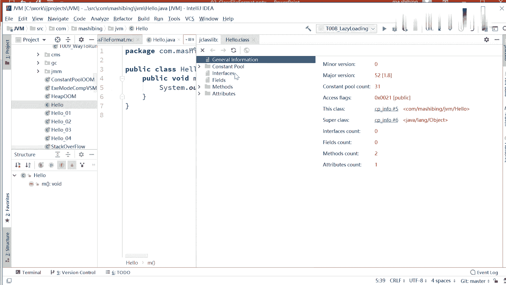
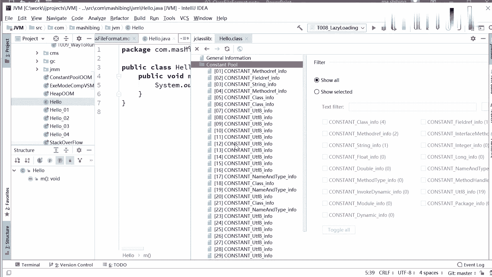

# 花了2万多买的Java架构师课程全套，现在分享给大家，从软件安装到底层源码（马士兵教育MCA架构师VIP教程） - P114：【JVM】第二天课前复习 - 马士兵_马小雨 - BV1zh411H79h

OKOK好，咱们准备开始上课啊。😊，那今天呢我们上JVM的第二第二堂课。呃，今天呢准备给大家讲。classas的 loading， linking和 initialitializing。简单说呢。

我上节课讲了class文件的格式。那么这节课呢我准能给大家讲这个class文件是怎么放到内存的。classas loading， linking和initializing。好，在讲这个之前。

我稍微回顾一下上节课讲的内容。呃，我再说一下啊，上节课讲的内容你没有听，也不耽误上今天的课。JVM的很多课呢，实际上它是一个并行的，并没有这个前后的关系。呃。

我要讲GC其实呢你不听今天的课GC你也可以照样听。所以呢大家放松了听啊，有时间的情况下，把前面那堂课补一补就行了。呃，我们稍微回顾一下上堂课讲的什么内容啊。上堂课呢呃我教了大家呢。

就是你怎么去认识那个class的文件格式。也就是说当你看到这堆东西的时候啊，你起码心里头不再那么抵触了。class的文件这个东西呢，现在啊面试题里头还没有人问到过，好吧，还没有人问到过。呃。

不过了解一下，总是让你觉得心里踏实啊。上节课呢就是讲了这堆东西里头，这每个字节都代表的是啥意思？啊，主要讲的这个东西。😊，那。呃，我们简单回顾一下啊。就带着大家呢一点点的你就平记一来，好吧。呃。

还记得吗？前面四个字节是代表什么东西呢？class文件的一个魔术，imagine number这魔术是固定的对，cafeba。后面两个字节代表的是它的。versionion的小值部分。

minor version这应该怎么翻译啊？呃，后面再有两个字节代表的是它的major version。一般来讲，这是一个16进制数了。用JDK1。8编译出来的class文件，这个模数呢是34。

算过来的话就是52啊。算成时间制。你在用呃。整个的就简单说，整个的这四个字节代表的什么呢？代表的是这个class文念的version版本号。后面是最重要最重要的部分啊，也是最最容易让人混淆的部分。

就是这部分。这部分是什么东西啊？是一个什么样的结构的，我不知道大家还有没有印象。这个呢是一个线中池。sorry是一个常量池。刚起床呢，有点晕呢，还。这于常量池，这常量池是怎么存储的，它的结构呢？

前面两个字节是它的常量池的长度，那么后面呢是真真正正的常量池的存储的内容。呃，我不知道大家还有没有印象，就是后面存储内容里头是这个常量池有几项呢？你看啊，如果说我的常量池。呃。

它的长度上面写的是0010，哪位同学能告诉我一下后面这个常量池真正存储内容的时候存了几项。1515对，没错，为什么15呢？0010。转换成十进制是16，后面长度是16减1，所以是15。

当然这个常量池里面存的是具体的什么类型的话，大概得有十几种类型。这个大家回去查那个图就可以了啊。好，我们往后敲一敲。呃。传量池后面跟着的是什么东西啊，不知道大家还有没有印象。长两吃后面跟着的叫做。

access flags是吧？叫仿标记啊。仿标记说的是什么呢？说的是你这个lay啊，前面写的是public呀，还是private呀啊，是不是一个annotation啊。

或者是不是一个anumeration呢？是这些东西。再后面右边两个字节，这两个字节代表什么？This class。当前类。啊，face class当前类是什么意思呀？

是记录着嗯这个class的文件的名字吗？而字符串的名字吗？是吗？是这样的吗？这里面是不是记录着我当前字符串的名字，是吗？两个字节。不可能的是吧，我两个字节记录这名字，我记录不了几个字符的。

就只能记住两个字符。对，永远记着常量池，关键就关键就在于后面的所有东西呢都是去引用它的。所以这是指向常量池的类名的那个引用。好，再往后这个部分呢叫super class。好那好后呢。

super class完之后是interface count。interface count就是我这一类呢到底实现了多少个接口，后面呢就是一个一个一个的interface意。

一个一个的接口一个一个的接口。好，这个接口里边仍然存的是指向常量池的引用。好，账号fields。Pause。有多少个属性？后面呢就是一个一个的field。具体的属性是哪些？有多少个方法，mes。

Comm。后面呢就是一个一个一个的方法啊，他们具体的那个属性啊，me method infer。那好，最后一项呢叫attribute count。

然后里面存的是各种各样的 attributetributs，各种各样的属性。这个属性里面最重要的一项呢，其实是code是吧？代码。方法里面的代码。上节课呢我还教了大家呢用什么样的工具。

去来查询一个class里面内容，我不知道咱们同学下去试没试啊，这工具。

6。

show back code with G class library，用这个工具去看它二进制的内容。

这里面呢它会清清楚楚的帮你列出来constcent有哪些？

interfaces有哪些fields哪些，然后metters哪些。

嗯，等等等等。然后mas里面的。他这些生成的呃这里面内容呢，我们后面再来讲给大家听。呃，java的汇编指令呢并不是特别多，200多条。当然作为老师来讲，也不可能把200多条从头到尾给你解释一遍。

讲最常用面试题里头有可能会遇上的啊。

OK好，这是上节课我们讲过内容。