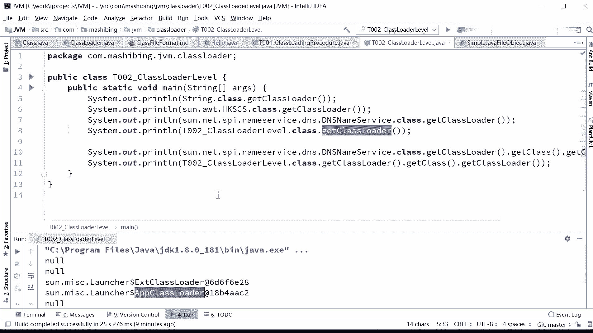
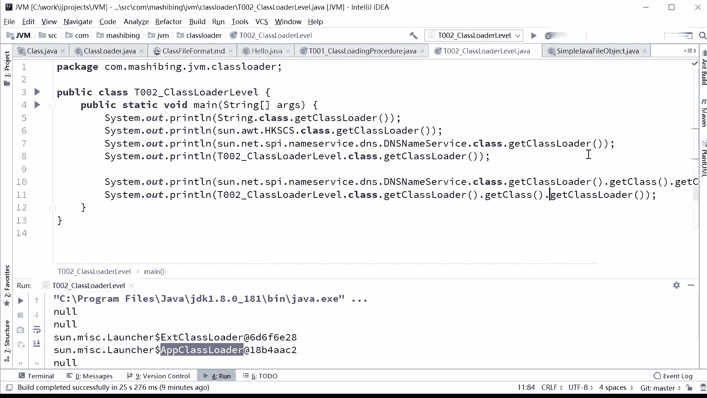
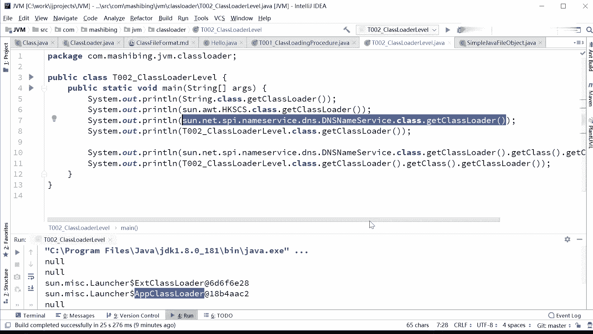
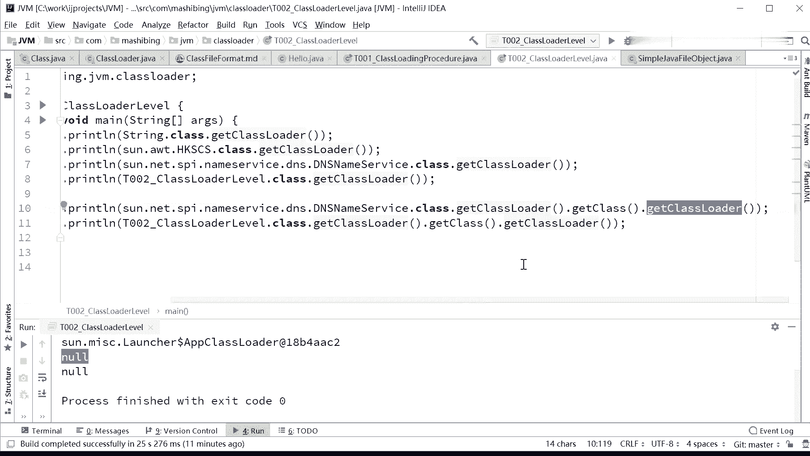
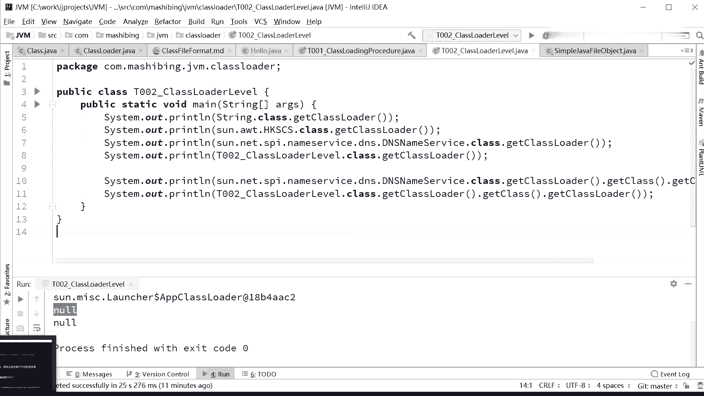

# 系列 3：P116：【JVM】双亲委派 - 马士兵_马小雨 - BV1zh411H79h

好，所以这个图呢你你心里很有数就行，好吧。就烦讲着讲着，突然之间呢讲了两个体系啊，然后又又没说清楚嗯。那下面我们来讲的就是双切维派到底是个什么庸。当然还呃这这个后面还有两两段小代码我没有讲完。

你你注意看啊，你仔细看你看。

呃。snet SPI他的class loader，也就是这个class loader。刚才咱们看到了，它是1个EXT的class loader。

那么这个ESC class loader调用它的get class，它本身也是一个class呀。然后调用他的class loader。他的class loader又是谁？

就是这个class loader的class loader是谁？你会看到控制。说明啥，这个class load的class loader。是我们的最顶级的。那个克拉斯罗他给绕进来的。其实。所有的。

这个我们的class往上头找的话，最后一定是被我们最顶级的那个bustr class loader给load进来了。所以过程就是这样的啊，bustr class loader把谁给漏进来了呀，把。

EST的那class loader load进来，再他再去负责load别的。然后呢。像这个这是我们的APP的class loader了，他又把APPclass loadload了进来。

然后他再去load别的。这是被谁加载的？加载器的加载器是谁啊？所以你也不知道混混淆成什么样的，说加载器的加载器是不是就是他的parent，不是。parent是加载类的过程中需要查找的一个层次关系。

至于这个parent它是被谁加载的那是两回事儿。

那千万这里面容易混淆的概念呢非常多啊，要三个三条线混一起哈。😊，呃，面朝大海问说那个bstr为什么返回空，是因为呢不str呢。呃，是由C加加来实现的。java里面并没有一个class和它对应。

因此呢它返回的是一个空值。嗯。book drive加载器是什么呢？是C加加实现的一个模块，可以这么来认为。

嗯。不 drive。它本身是java虚拟机内部用CR加代码写的来实现的这么一个模块。在java里面直接访问呢是没有一个class和它去直接对应的。因此。

当我们get class loaderge到头的时候。这个时候他只能给你返回一个空值。所以当我们看到这个空值的时候，它代表啊你已经到头了。好。我们说一个class文件需要被漏到内存的时候。

执行的过程呢是这样子的啊，认真听。一个class文件需要被漏到内存的时候，执行的过程什么样的呢？任何一个class。假如你自定义了。那么这个时候呢，就先尝试着去自定义的这个class load里面去找。

他内部维护着一个缓存。说哥们儿，你有没有把我已经加载进来了？你如果加载进来一遍了，你就不用去不需要再加载第二遍了。你如果没有加载进来。你赶紧的把我给加载进来。这个过程你先听一大概啊。

因为后面我们还没有讲这个class load的加呃，就自定义的class loader，一会儿我我会给大家演示。那好，然后他如果在自己的这块缓存里面没找着的话，注意他并不是直接加载这块内存。

直接把你这个克文件。二话不说给你加载进来。不是不是这样的，他会去他的父亲附了附加载器。APPclass load里面说。爸爸，你有没有把这个类，比方说这个类叫S吧，把S给我加载进来啊。

那APP里就会他去他的缓存里面去找我认为有没有S呀？如果有返回了。如果没有。委托给他的父亲去找我这里面有没有S呀？好了，如果有范位如果没有。委托给他里面去找哎。找他爸爸，你有没有S呀？那，如果都没有S。

bos drive呢就往回再委托。我这没有S啊，麻烦你去给我加载。严森生说我只负责加载这部分，那S我找不着啊，找不着怎么办？哎，麻烦你给我去加载APP说我只负责加载这部分啊。其他的我我我我不知道啊。

我找了半天，反正class pass里面没有没有怎么办？哎，委托你给我去找。整个过程。最后是经过了一圈，转了一圈，才会真正的把这个S给加载进来。

当我们class custom class loader能够把这个S加载进来的时候，好，叫做叫做成功。如果加载不进来。跑一场哪个一场啊，class not found。找不着。好，这个就叫做双亲尾派。

O。不知道这个图呢大概清楚了没有？我后面画了一个动画。每次给大家画动画啊。嗯，我都都快崩溃了，因为每个动画画起来都要画一个小时，给大家演示不到一分钟。好，认真看。认真看。看这里啊。

有一个class文件需要被加载到内存的时候。他首先呢调用你自己定义的那个class文件的load class这方法，把自己给load进去。找到我们的克拉自自己定义的这部分。嗯，如果说他。找一下。

在自己的缓存里找找找。如果说找到了返回结果，如果没找着找到他自己的负类加载器，谁呃谁呢？附加载器啊，不叫叫负类加载器，附加载器谁呢？APPclass load。如果找着了返回。如果没找着。

找EXT的class load。如果找着了返回，如果没找着，找不str class load。不scribe class load找着了返回。如果没找着的话呢。回过头来，又让EXT你负责去加载好。

这个时候是加载啊，是找到这个class，并且加载了。原来呢是在cch里面，在缓存里面找，有没有找着。那如果加载成功了，那就返回结果。如果说加载没成功，我找不着我在我我负责的这部分里面这个小区里面。

我找不着这个类怎么办？交给他的孩子，他的孩子去找并加载。如果找着成功，如果没找着交给他自己的孩子，他自己的孩子找着成功了，成功就返回结果不成功。class not found不知道大家看完这个动画之后。

是不是理解了class的load的这个过程。这张图你抓一下吧，好吧。老师，我画张头，画了一个小时快。一分钟就演示完。面朝大海问这个缓存是在哪儿？缓存你可以这么简单的认为就是它自己内部维护的一个容器嘛。

一个list或者呃一个一个数组加载的东西都扔在里面嘛。每个加载器都有自己的缓存。对每个加载器都有自己的缓存。他负自己负责哪部分，就负责哪一块啊。好当，你明白这个双亲委派的过程。

这双亲呢这个双亲尾派这个词儿啊起的也不是特别好。呃，双亲委派。双亲委派这个过程就双亲，一般我们指什么呀？父和母嘛？父母双亲双亲俱在。所以这个东西说叫双亲尾派的这这个这个这个词儿起的过特别好。

其实双亲尾派指的是什么呢？指的是是由一个从子到父的过程，又有一个从父到子的过程。这叫双亲。啊，所以这个名字非常的怪啊，翻译有问题。对嗯。嗯。好了好了。那下面问题就来了是吧？为什么要搞双击委派啊？😡。

你给我一class，我直接给你漏到内存不完了吗？你你你搁那扯什么扯，你我非得找我到我后期里找找找同学们为什么呀？好，这是面试。如果问到内加载器是属于必问的一个问题，就是Y为什么？为啥？为啥要搞双清委派？

不知道有没同学知道的。清然，你说的对啊，你理解的没问题嗯。好，听我说主要是为了安全。主要是为了安全。说安全跟这有关系吗？有关系。哦，我们假如用反正法，假如给你任何一个class。

你自定义的class都可以自由的把它漏到内存的话。那么我就可以给你这么一个class，这个class叫java点儿 land点儿stream。哇，这牛叉了啊，我我这个class叫java点烂点str。

我直接把s就是oracle自己写的那个内部的核心的sring给它给它覆盖掉。我交给我的自定义的class loader。然后把这个str漏到内存。接下来呢我把整个的这个东西打包成一个内裤。

我交给我的客户。大家知道我的客户在输入密码的时候，他应该会把这个密码存成一个sstreamam类型的对象。哇，太棒了，把你的密码存成一个spring类型对象。我这个spring类型对象。

是反正这部分代码是我自己写的嘛，java点 line点 string是我自己定义的这么一个str。我干脆直接把你的密码偷偷摸摸的发给发一封邮件发给我自己。哇，全世界的密码都到我这儿了，太爽了。

只要你拿java写用过我这个内库，你的密码。全是我的。你们会想想看是不是会有这种问题。但是如果采用双亲纬派，就不会有这个问题。当我们要求一个class。

class自己定义的class loader去加载一个java点line点s stream的时候，它就产生了警惕。我得先去上面查查有没有加载过。查查查查到最上面的时候，发现已经加载过了，加载过了。

直接给你返回。睡啥话。我还重新给你加载啊。好了，所以当有人问你为什么类加载器要使用双亲维派机制的时候，注意这是面试经常有可如果问到这部分，基本就会被问到的问题。为什么要使用双切维派？主要是由于安全问题。

大家听明白了吧？当然还有几个次要的问题呢，就是你你你上面已经加载完了，我就不需要重新加载了吗？我为什么要加载两次，我找找看就行了，这是一个资源是不是浪费的问题。但是这个是次要问题，主要的问题是安全问题。

嗯。😊，好，感悟感悟说既然是自定义。要是我不去上机照，自己可以加载。你以为这么简单不可能的，一会儿我们累加载器写的时候，你就明白了。这个。这个过程是已经写死了的，这个过程是已经写死了。

你只能去实现查找class的那部分啊，这过程已经在内部写死了，好吧。这事儿你是改变不了的。啊。