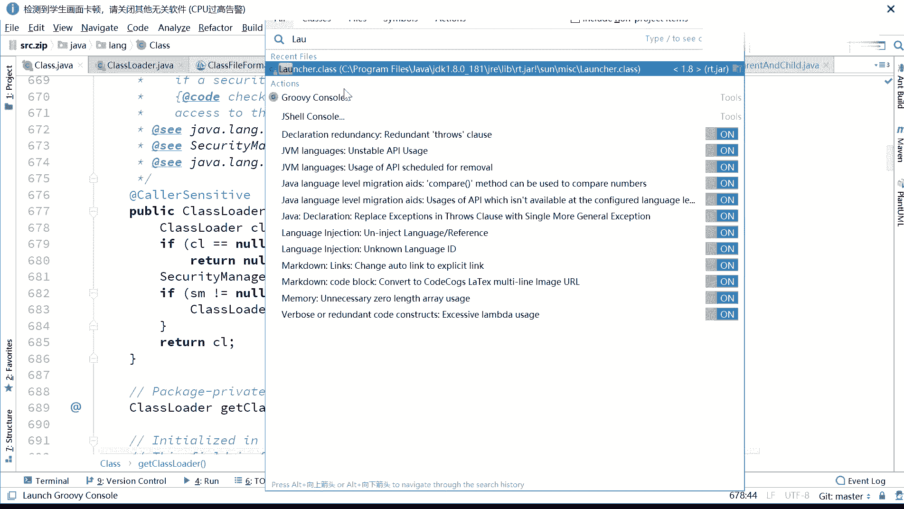
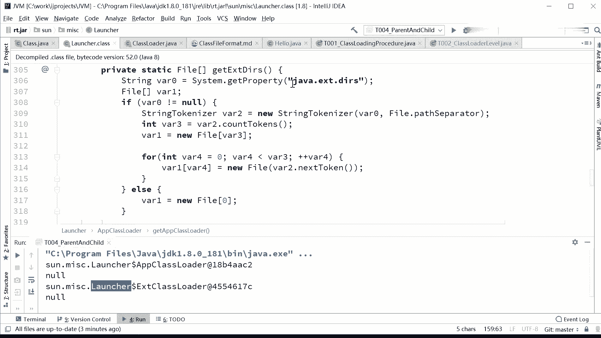
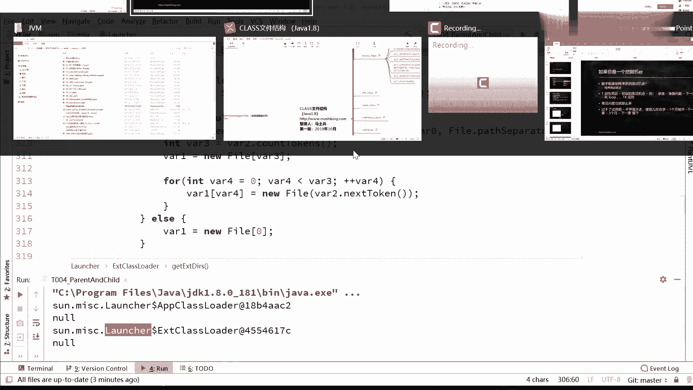
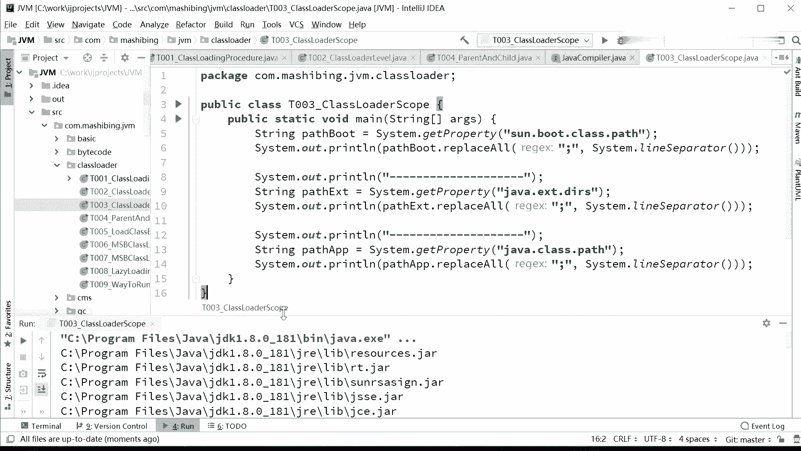
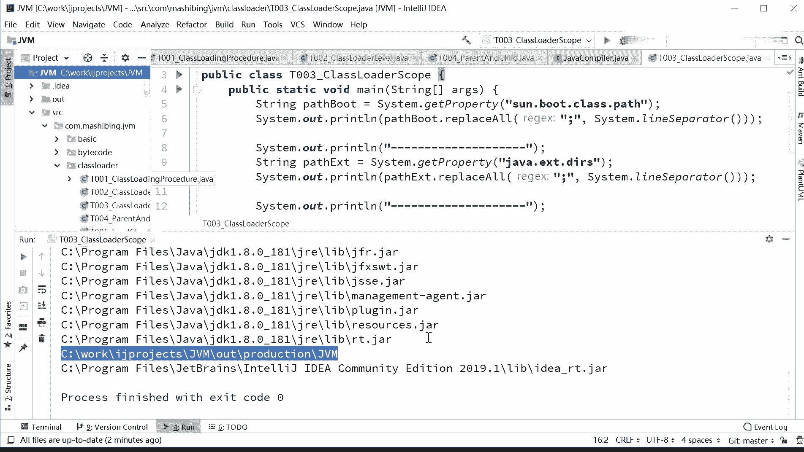

# 系列 3：P118：【JVM】类加载器范围 - 马士兵_马小雨 - BV1zh411H79h

我们看呃各个类加载器的一个范围。类加载器的范围，我说过它是来自于launer的原码。有同学说啊。什么意思？看这里啊。呃。找到我们的。Class load。我们来读一下这个原码啊，大大大概大概理解一下嗯。

该 class load。嗯。不是跟class load，这个应该是。刚才我们打印的时候呢，一直没有呃关注这块。呃，launer。

就这个类。launcher launchcher启动器在我这我们刚才打印的时候，可能大家伙没有仔没有仔细看这段啊，把termin调出来看看。软点来看啊，你注意看啊这部分呢其实我没给大家细讲。

其实呃呃这这个我们说打印一个class文件的to string的方法，它默认显示是什么呀？是类的名字加后面的他的还是code的一个码嘛。那类的名字呢，你看这个类的名字呃。

这种类的名字大家我不知道能不能理解。这什么意思呀？是smisslins下面的包下面的launer这个类，这个类下面有一个内部类叫EXTclass loader。对，这是它内部类的意思。好。

这个launcher是个什么东西呢？这launcher呢呃其实就是class load的一个包装类，一个启动类。好，在这个类里面，其实它你你要看这个代码的话呢，你能够看出很多内容来。

就是说我们是怎么看出来，我说不 strap它加载的这个呃路径是。我们的核心路径，而EST呢是指的是呃EXTDIRS指定的这个这个属性指定的一些路径呢？

我们的ja为为什么我们都APP class load指定的是java class点pas这个路径呢？其实所有的代码都是来自于launcher它的源码。laer原码呢。

你看啊boot boot class pass和你指定的是这个sstem get property。散步的 class pass。嗯后面呢。代码读时间很长了啊。java点class pass，这是谁呢？

这是。APPclass loader看到了吧？它内部类APP class loader，它负责加载哪部分java class pass。system的属性这部分。那好。

那ESCclass loader负责加载哪部分呢？负责加载这部分java点EXT点D2。

所以如果你呃说老师你讲的这个我能不能验证一下，你可以完全是可以通过这种方式来验证，怎么验证呢？看这里。

这验证呢也非常简单啊，其实讲原理的这种小代码呢都比较简单。看这里。你就这么来写就行了。呃，boot的 class pass是哪些。

你就拿到这个属性stem get property拿到这个属性之后是一个长的字符串，我把这个字符串里面的分号来替换成为换行符。嗯，stem lines，这比较简单啊，大家读一下代码。

给10秒钟看能不能看得懂。就是我拿到这个属性，我看这个属性啊，系统的属性里面这部分刚才我们读源码的时候不看到了吗？这部分代表的是哪部分的内容啊，我们把它读读出来。把符号换成换行符给大家展示一下。好。

第二部分java EXT direction呃 directions。directries啊java EXT的扩展的那些个目录在哪里？javaclass pass呃。

我这个程序定义的这个class pass又指的是哪个？跑一下看看。好，中间是用横线隔开的，我们一个一个来看。

通过这个小程序，你能够很明显的看到哪些炸包是被我们的bstr加载的这些。这一个1。8杠01GRElibr下面的resource点诈RT点炸。呃。上R呃。

RSA sign这是加密的GSSE啊GCE叉SJFR以及GRE下面如果有这个目录class。这下面的class是被我们根儿加载器加载的根上的加载器。好，那就继续。还有。对我们的EST。

那个class呃loader来加载的是谁呢？EXT目录下面的。EXT目录下面这些个炸包是被他加载的。那对我们的应用程序的这个呃来呃APPclassro加载是谁呢？下面这些。一对。看这里主要是看这个。

productdion这VM这是我的什么呀？这是我的。呃，像项目的路径嘛，他会去到我的项目路径下面去找。

呃，下面这个呢是idea啊，自己帮你指定的啊。