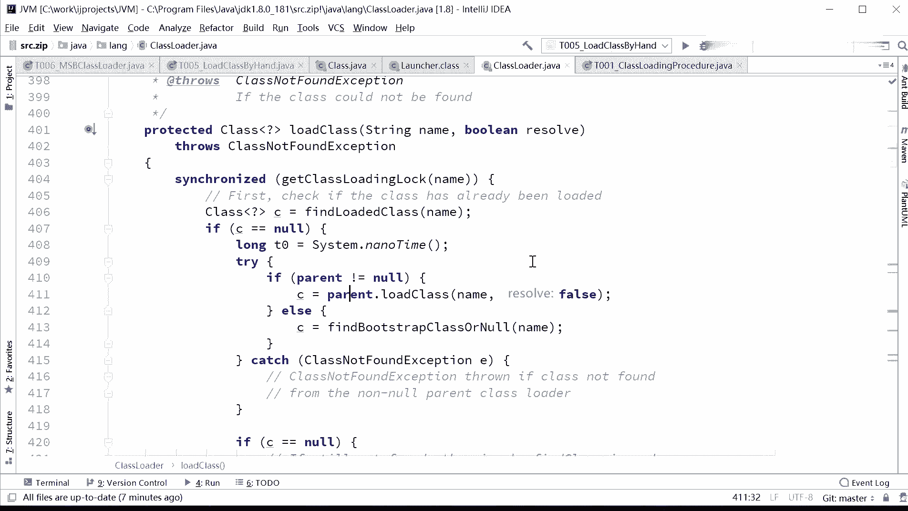
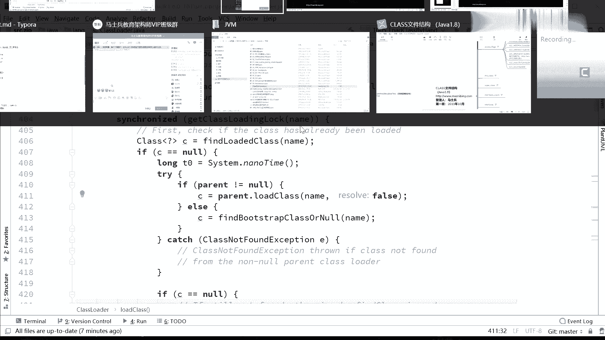
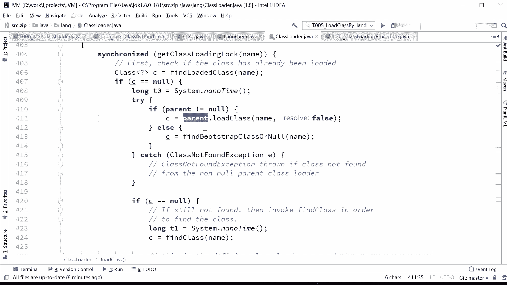
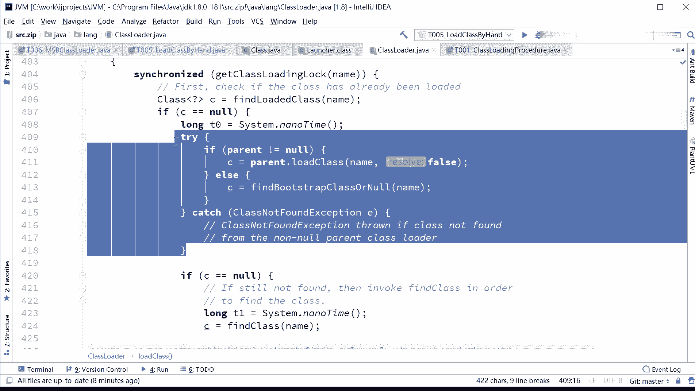
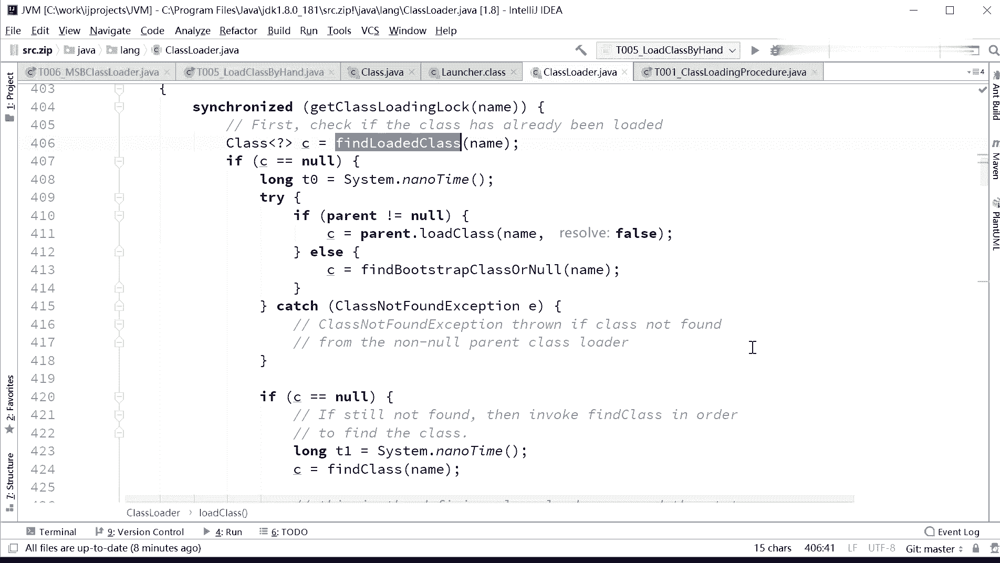
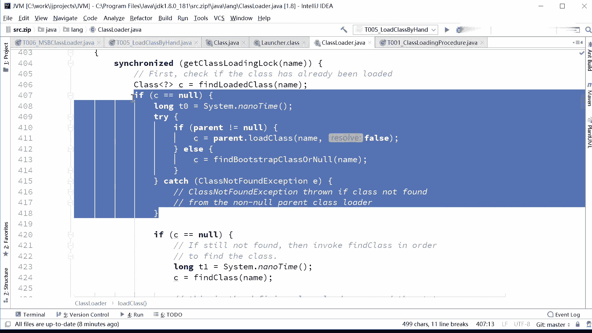
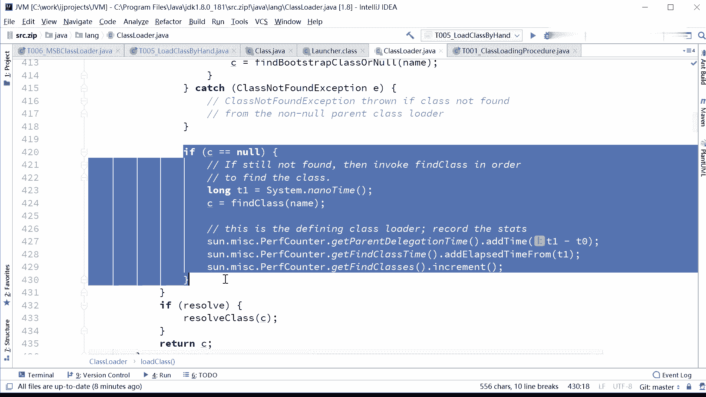
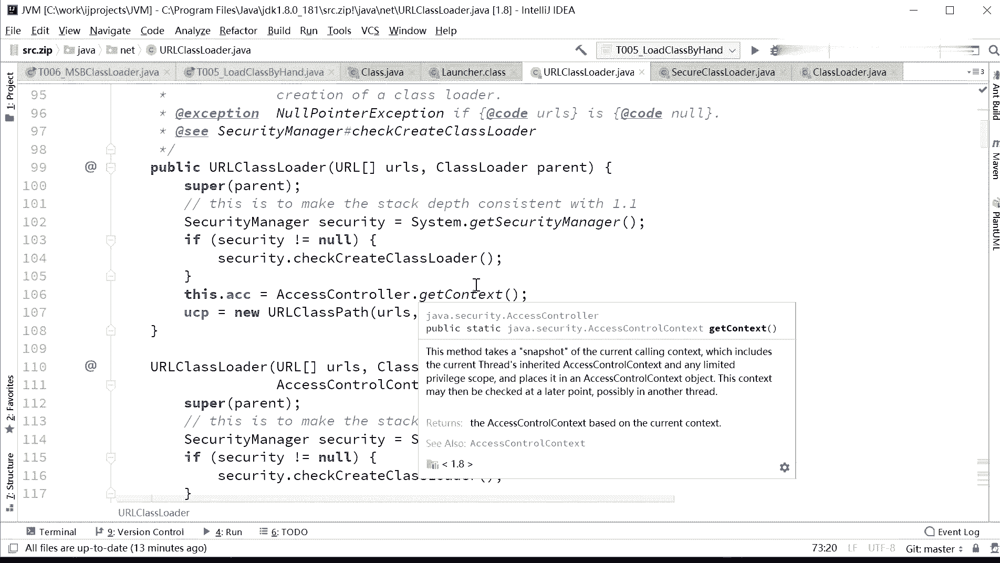
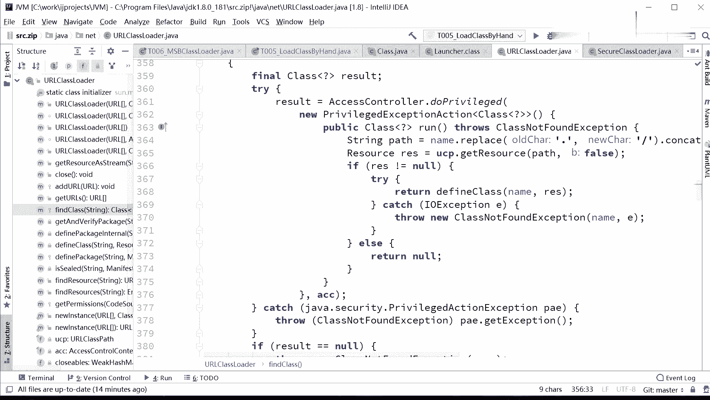

# 系列 3：P119：【JVM】自定义类加载器_1 - 马士兵_马小雨 - BV1zh411H79h

啊。接下来呢我们来看看呢怎么样呢才能够自定义一个类加载器。呃，想自定义类加载器的话呢。근得要。稍微的嗯。读一读这个class loader的源码。简单读一下啊，看这里。谁带大家读。你静下心来。

现在呢你静下心来跟着我的思路走，好吧。呃，读这个原码呢稍微的有一点点复杂。如果你没有学过前面的老师讲的。设计模式的话读起来呢会稍微有点复杂，不过解释给你听莫急啊。在 class load。

最顶级的副累abstract class class loader。我们先说第一件事，就是你如果说想把一个。类给加载到内存的时候，你应该是怎么做？呃，想把一个类加载的内存的时候呢。

这个小例子就是load class by hand，我们我们用利用。现有的这个类加载器去加载一个类的时候，去怎么加载。注意看是调哪个方法呢？是这样来调，看这里啊。呃，这个类。

T05low class by hand点class get class loader来，大家告诉我，这时候我们会拿到哪个类加载器。APP是吧？APP好，拿到这个类类加载器之后，我只要调用它的一个方法。

叫load class方法。接下来呢我把你需要加载的这个类的名字告诉他。他就会帮我加载进来。所以首先第一点，load class这个方法。大家先要认识一下，就是说你要加载一个类，很简单。

你只需要调用class loader的 load class方法，就能够把这个类加载到内存。那加载到内存，它会给你返回一个class类的。对象。也就是我刚才讲的那个过程，它会硬盘上找到这个类的源码。

这类源码呢可能在哪个目录下面。好，找到这个class文件源码之后，把它漏到内存，与此同时生成一个class类的对象，把这个class对象返返回给你。所以它返回的是一个class类的对象。因此。

我们这个小程序。Note class by hand。我找到APPclass load调用它的load class方法，让他帮我去load的T002class load level。没问题。

可以load进来。load进来之后返回给你的是class类的一个对象，我给他起这编列名叫class。接下来我就要用class点 get name，那么正常的话一定会返回我那个。T062那个类。

OK大家看到了，它返回的我的类的名字T062说明已经正常加载了。如果大家我不知道有有因为有一些新报名的同学啊，你以前应该可有可能没有看到老师讲坦克的时候，坦克一期那会儿呢我是利用一个类加载器来加载资源。

大家我不知道大家还有没有印象啊。呃，有多少同学那个听过坦克这部分呢，就会应该有印象。我是利用类加载器呢来加载坦克以及图片的资源。

Get class loader or get a resource as stream。所以class load呢能帮你干很多事情，能够帮你去加载各种各样的东西。如果你像想加载某个类的时候。

你直接调用它的low class方法。嗯。嗯。折子细说和反射的区别是什么？这个这和反射有什么区别？class load是反射的一个基石。你平时用的所谓的反射。

无非就是你用的class类的这个对象去访问二进制的这些代码。这不就是反射吗？这没有没有嗯聊啥区别，这没有区别。他是一个。相相辅相成的有关系啊。风林说什么时候需要自己去加载呢？哇，风林。

你问的这个问题相当的有深度啊。同学们什么时候需要自己去加载一个类啊？来有哪位同学说一下。什么时候我们需要去加载一个类？嗯。呃，学过spring的。s会某一个classs会给你生成一个。

动态代理这个动态代理是一个新的class。那么当你要用的时候，实际上spring偷偷的漏的把这个新的class给你漏到内存了啊。呵。给你放内存里了嗯。嗯，好多有网络的问系。没错嗯。

toom get对load自己自己那部分，它肯定是需要load load load load自己的自定义的这些class的。这日报。前面一边老师讲过的这be热部署，怎么才能热部署啊大哥。

你这个class放到那放到硬盘上，我是怎么才能给你进行热替换，怎么是热替换呀，我肯定需要一个class loader，把这个。手动的漏到内存里面去。还，不知道我说清楚没有。But。哦。

我看刚才好像面朝大海也问了个问题啊，给刷过去了。等看。面朝大海问，加载进去就生成class对象吗？不是要经过初始化才生成class对象。初始化呢一会儿咱们再聊吧。初始化呢是把它的。呃。

静态变量进行赋值是那个过程。初始化不不不不初始化啊初始化不是实力，你说的实力得去调用了谬了。那个昧方法呀，已经开始执行了才有实力的概念。那方法开始执行了，才得里边才可以没有实才有实力的这个概念。

这里的初始化呢指的是这个class load的进去。生成。指向那个class的对象，然后这个对象里面有一些静态的东西，这个静态东西是不需要实力，不需要new的，不需要ma方法执行的。好。

这个初始化过程我们一会儿再说，好吧。你讲到了啊，别着急。哦，我先讲完的这部分，大家能不能理解？就是我们需要加哪一个类的时候，是调用它的low class方法。

下面我们就来看看呢这个low class方法，它一个核心的。核心的他的这种执行的逻辑到底是一个什么逻辑，也就能够呃告诉大家，为什么你是不能够。改变这个逻辑不能够去。刚才有同学问到了。

说我我干脆就不找我的副累行不行？不行，因为它里面已经写死了，这个low class是已经写死在里面了。好，我们来看这个loc class代码。loc class代码呢。他调用了另外的一个。呃。

重载的方法，这方法叫loc class，就是你需不需要解析。解析刚才我解释过了，把符号引用转换成为直接访问那个地址啊。呃， synchronize的一个log，这个你加载的时候呢，一定是要加锁的。

别我加载了一半，另外一个也加载了进来了啊，加了加了把锁。find loaded class这部分是什么呀？first它在注释了。first。

 check if the class has already been loaded，你是不是已经加载进来了？那么这部分呢。是你读到最后的时候，它返回的是一个呃find class loader0。

当你 class load零的时候，你就只能去读java虚拟机的原码了。hosbo原码。因为他已经是内地了。喂。嗯，在这儿读过只要心里原码呢，嗯如了，这不是不是这个这个这个黄老师读过啊。

他后面会给大家分析分析hos胞原码。如果大家感兴趣听一，不感兴趣的话就算了。一般呢也不会问到这种深深入到这种层次的问题啊。好，看这里。呃，这个class has already been loaded。

你检查一下是不是已经漏进来了。如果等于空的，没漏进来怎么办？如果漏进来直接返回了就啊，如果漏进来直接返回了。所以如果等于空没有漏进来，没有就没有漏进来的时候才去漏的。漏的时候怎么漏的呀？啊。

parent调用他的parent。去load class，所以这就是开始委派过程了。没有漏进来，我得先去调研parent，parent上来是不是也得先找啊。

你分析一下parent的load class不也是这个代码吗？他上来也是先找。而没找着怎么办？又调用了4类的那就就继续继续找嘛。一知什么如果说cch里面找到了，那就不用了，不然的话呢。

我们就调用low继续来load。那这个loadload的过程呢，所以这呃我相信大家应该就能理解这这个呃过程了，这是一个类似于递归的一个调用。

类似于D位的个调。所以首先呢去找catch里面，如果找不着的话，让他副类去look class look，而他副类look class时候上来也是先找，有没有找着？然我们继续看啊。

这个load class。如果说呃我副类没找着，副类没找着，都没找着，那我就必须自己去加载的时候，自己去加载的时候怎么加载呢？哦，我先给大家看一下这个parent啊。

你看啊每一个class loader，它内部的这个parent是一个final值，已经指定了，连改都改不了。所以他就决定了你是改不了你的这个parent的，你也你也没办法去去修改整个的过程。你放心。

人家设计的这个时候不可能给你留下这么大的漏洞。好，我们来看这个加载的过程啊，加载过程怎么加载呢？😊。

也就是说经过了上面这步，我也没找着，然后我的负累也没加载成功，那说明只能交给我自己去加载了。我再说一遍，上来呢先找。

哥们儿，我我有没有加载过我的cache里有没有？如果有就直接返回。如果没有等于空吧。如果没有，如果没有找副类，让副类去加载，负类加载上来也是先找嘛，所以是从上的这个过程。假如说一直涨到上面。

一直都没找着。

那我只能由我自己去加载，对吧？只能由我自己去加载的时候，怎么加载的呢？注意看它调用了一个方法叫做find class。你去找这个类。

好，这个方法。这方法的实现只有一句话。这个方法protected。受保护的。只能在它的子类里面去访问。其实通过这个，我不知道大家能不能够想出来，我自定义class loader该怎么定义。大家看这里。

在class load里面，find class最终呢我们是要调用fin class的，可是find class它的一个实现直接抛ll了个异常，class not phone exception。

那怎么办啊？很简单嘛，你自己去实现这个方法吗？那这个过程我们再分析一下，现在是不是通过那个原码能看明白了。首先上来呢，我先自己找，对吧？我自己找，如果说没找着，我调用负类load class。

可是负类 load class是不是也是上来先自己找啊？类 load class是不是也是向来先自己找啊，如果没找着，是不得交给我自己自己去录的啦，我自己去的，他说是不是调用find class呀。

同学们。😊，所以我们自定义class loader，我只用干嘛？重写find class。每个副类都有f class，那必须的啊。嗯嗯，launer里面。不是负类啊，其实应该是负附加载器。

你看这个呃呃本身那个ES class loader是从URL class loader继承。那URL class load是从secure class loader继承。

 secureecure class loader呢。是从克拉 loader集成是吧？好。我们来看这个URLclass loader。也就是这U克 loader里面。

7。哟可修的看到了吗？find class。这他不就有实现了吗？你自己去就是他这个实现你要感兴趣就看一看，不感兴趣就算了，无非就是那个在目录里面找嘛嗯。

那你从EXT是从那继承的那EXT当然也有自己的find class了，是吧？所以你想想看，如果我们要自定义一个class loader的话，我们怎么办呀？我们只需要干一件事就就可以。

我这么简单，能不能理解？呃，我只需要干一件事就可以。我只需要。定义自己的find class就可以了啊。

