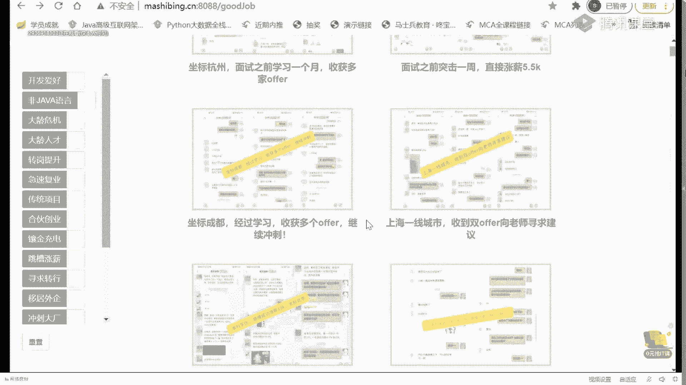
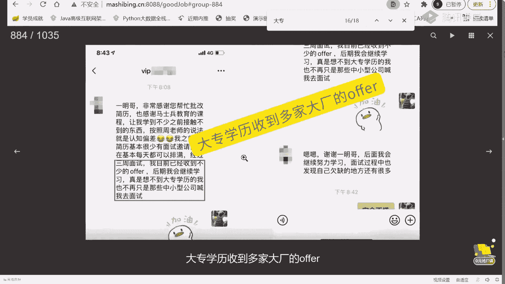
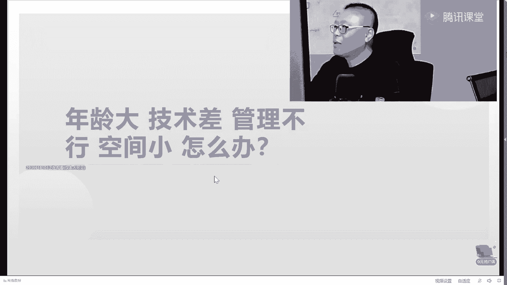
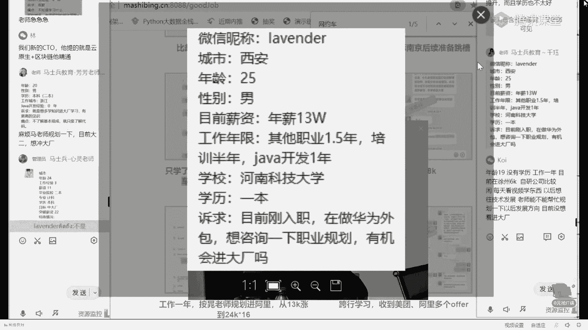
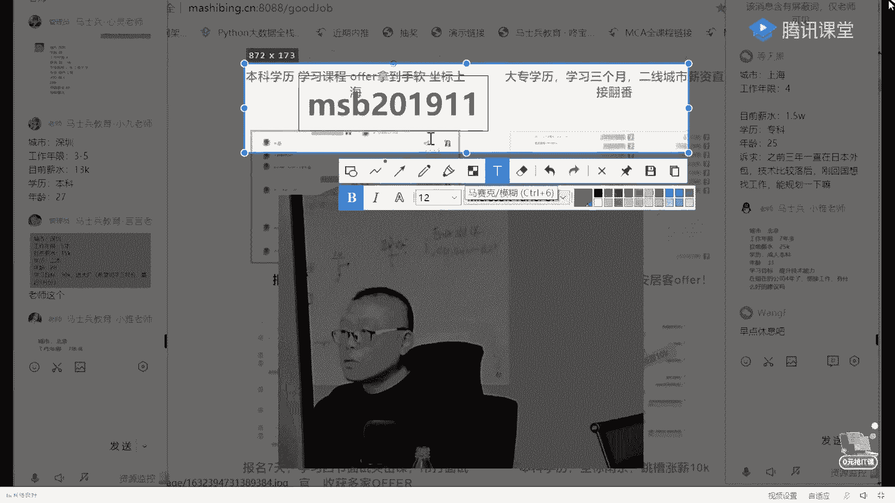
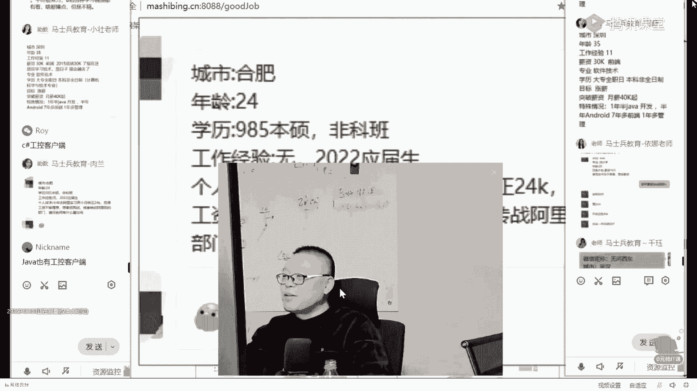

# 花了2万多买的Java架构师课程全套，现在分享给大家，从软件安装到底层源码（马士兵教育MCA架构师VIP教程） - P11：马士兵：不同人群进大厂的攻略都有哪些？ - 马士兵_马小雨 - BV1zh411H79h

呃，我就从大厂的整体体系聊，好吧。呃，想对阿里的直级，我觉得拿阿里的职级体系啊。实际上阿里的职级体系呃，跟这个阿里的阿里是双序列啊，就P系列跟M系列，一个是技术，一个是管理。🤧。

其他人的那个直机体系我没有拿。呃，但是我告诉你啊，那个你像阿里的腾讯的、百度的、京东的基本直级体直级体系都差不多。无非就是说这边是L7，那边是P6，就是大概是这个这这样的一个行义，这边是T5。

那边是P6。就这么点区别。呃，这是一个嗯。职级体系它怎么设计，为什么是这么什么就什么这么设计成这样呢？我就不多说了。我主要聊大家比较关心的，呃，就是什么样的人会是P几。然后呢。

他主要是那个那个那个那个呃主要的能力是在是在哪个层面上，好吧。那么关于这个的话呢，嗯你可以完完全可以到我们的网站上啊。就是嗯找到我们MCA的这个课，他的课程介绍里面。呃。

我们在这里呢做了一个自己的非常粗浅的一个总结，但是大家伙可以作为参考。呃，首先我跟大家说一句啊，这个P5是一个什么职金？P5是一个入门级别的大厂入门级别的职金。实际上以前阿里是有P4的。实习生呃。

但是后来P4这个直接就不招了，现在基本上就是P5P5是什么样的人，会是P5呢？😊，呃，按理说应该是0到3年。他们认为你是P5，好吧，也就是说你社招三年以上的那直接就是P6了。但是到在目前的情况下来说呢。

大多数的情况下，作为P5是。你刚刚毕业的应届生。应届生往往是定级屁股。呃，不管你是本科生。也还是研究生啊，我这里头没有提专科，因为专科屁股这个职职级你进不去，好吧。刚刚毕业的应届生，然后呢。

大概在你工作，你比方说你最开始的时候没有进到大厂里面，你进到了一家中小厂，工作3年左右。哎，你社招通过社招进到大厂了，这个时候往往是P6。然后你在你项目组里头慢慢成长为带那么四五个人。

这个时候你往往是P7。当你负责完整的整个的项目组的时候。我告诉你，你这个时候。呃，大概你手底下是几十个人的这样的一个一个一个规模的时候，你大概就是P8了。当你手底下有不同的技术团队，包括业务团队的时候。

你这个时候就是P9了。嗯。那个我如果从呃薪资的角度来说，P5的薪资的话呢，大概是20万到40万左右。那么如果是从呃。P6的薪资来说呢，大概是40万到60万左右啊。呃，如果是P7的话呢。

大概是50万到70万。但是这时候是有股票的。呃，就是大部分PT是有股票的，只有少部分没有。因为阿里有一种文档P7也比较好玩啊，他专门写文档的，他那个薪资就低很多，50万到70万。

大概再加上800到1200股啊。那个股票比较值钱的时候呢，这个差不多P7的薪水能拿到120万左右顶薪。哎，我讲到这儿，有没有同学想想看看那个P7的简历的，有没有？有没有有的话，给老师扣个一来。

3年以上还可以面屁5吗？3年以上你就要奔P6去了，你为什么还要面P5啊，干嘛这么看不起自己？呃。我我我给大家看一个非常牛逼的简历啊，这个是顶新的120万年薪的简历。我找一下。嗯。😊。

这个。呃，这哥们儿当时是29岁，拿到的是阿里的P7plus，它不叫P7，这个叫P7plus，我一会儿给你解释什么叫P7plus。P7plus。那个呃100就是80万的正常薪资，外加40万每年的股票。嗯。

就类似你大概的估算的值啊，120万年薪。呃，你们也可以呢读一读看，看看这个简历呢呃自己能不能照得住。这个简历呢如果你仔细读的话，其实你会看得出来那个。这里面最重要的最值钱的点到底在哪？

5年java开发经验，其中3年以上全是大型系统架构设计经验。三年以上团队管理经验。分布式高并发、高可用大数据量的系统架构设计和研发经验。好了，这是最值钱的。当然，目前政府的什么注册用户多少，日活多少。

日访问量多少，这种的比较吹牛逼的啊，这实际当中的数据很可能到不了这么多嗯。对开源源码有过深度阅读。好，从这儿呢你大概可以看出来P7到底是一个什么样的水平。架构设计原码阅读。

这就是为什么我在课程里面会给大家这么设计的原因，明白吧？嗯，就是老师的课程设计不是说随随便便给你设计的啊，为什么要读读原码读原理？为什么要做架构的设计？其实就在于这儿。就是希望你们能达到这样的水平。

当不是说每个人的薪资啊都能达到120万，不是那么容易的。😊，呃，取法忽上得乎中，取法乎中得乎下，你的目标定的高一点，哪怕没有到，你跟其他人相比，你都是赚的。你的目标本身就定的非常低。

我今天就吃掉一个饺子。你就算达到了，你也就吃了一个。我今天要吃100个饺子。然后就算没吃完，我吃了50个，那我比你这一个也要牛逼的多得多。好，这是他的一些个技术站。这些技术站咱们课程体系里全有。呃。

可以这么说，我的很多的课程的设计是根据。咱们同学们遇到的各种各样的问题来设计的。那个这这这这全是一堆一堆精通了啊，这个你放心啊，呃，其实看上去很难，但是呢不是想象中的那么的难。

无非就是你需要掌握架构的一些个技术选型。是吧当然最新的还有posa啊。然后呢，搜索上的一些技术选型啊，这种那种呃这这个持久化的一些技术选型，缓存的一些技术选型等等。就这么多加上一些底层的知识啊。呃。

他这个呢还没有写算法，写太多啊嗯。其实还需要有有一点算法的知识就OK了。这背后究竟付出了多少？呃。不要不要羡慕别人，我有的时候会说可以拿别人来举例子。但是呢每个人的路啊，每个人的人生路他都是不一样的呃。

你不可能完完全全的复制另外一个人的人生，跟自己比就OK。你比自己更强了，今天我比昨天强一点点，明天比今天强一点点。时间稍微一积累都不用长几个月的时间，你就会发现你已经脱颖而出了。其实就这么简单。那个。

嗯。你们你们你你你们想知道那个那个那个他现在的一个状况吗？这个这哥们是。是咱们。史上最牛逼的一个学生啊。史上最牛逼的学生。你找一下他现在的一个状况。嗯。呃，这里是大概有1000多位我的学生。

然后做的一些个小小的总结和聊天的这个过程。嗯。找一下啊。呃，就是他。Yeah。嗯。呃，这个呢是他那个。最近然后拿了5000万的股票，呃，套现之后然后从公司离开呃，做了一个小小的总结。

就是P7的一些一些一些个内容啊。P7说到底是硬通货，是个分水岭。呃，这里面需要你掌握什么，需要你掌握什么，需要你掌握什么ok。呃，大家可以到这个网站上去访问访问看看啊。

这里面都是很多同学非常真实的聊天啊，你们看看就会知道了。那个。呃，当然还是那句话啊，就是这种呢比较极端，呃，我也绝对不会说奢望，说我们每个人都能达到这样一个水平。

我在他这个年龄的时候也达不到这样的一个水平。好吧，所以大家呢也不要说太羡慕，这个也没也没有意义。但是呢最起码这份简历会给你指出方向来，我们可以朝这方向去吧。

我们今天啃下来其中的一小点是不是就进步了一点点？我说今天我们甭啃别的，我今天啃了一个分布式事务。这东西不难的。咱们一堂课里头呢，差不多你你花个三天，顶多花个3天左右的业余时间。

就能把这搞就能就能够把这个搞定，你知道吗？我们是不是搞定一条？好，我今天不干别的，我就聊一个自动化部署。我今天不干别的，我就把docker给给给搞定了。你想想看这个三天这个5天。然后那个7天加起来的话。

能有多长时间？最重要的是你根本没有必要。每一个都全部精通。面试的时候，我说过了10家乘2家就可以了。不用面面俱到。这大家能听进去吗？天神下凡，对什么学历呃，学历相对比较好。985。浙江大学。

浙江大学是985吧，嗯肯定是啊。当然我说到这儿，很多同学就开始给自己找借口了。老老哥，我是大专，所以我不如他很正常。因此我又可以安心的躺平了。😊，我说我我再给你说一遍，我说他这个案例不是要你跟他比。

而是要你建立起来跟自己比的感觉。你今天要比昨天强一点。以他的这个技术为目标能听进去吗？就是你天天跟比尔盖茨比，那你这辈子永远完蛋，你天天跟艾隆马斯克比啊，你这辈子就别活了，所有人都别活了，对不对？

跟自己比。我今天比昨天强一点，明天比今天强一点。不就成了吗？嗯。能忽悠大钱的背景。肯定背景必须放光，这就是背景背景决定论吗？来我我想问你那个马云背景怎么样？马云985的，对不对？

马云是杭州师范的大专生啊，如果没记错的话。任正非是原来当兵的嘛，对不对？英语老师。对啊。所以。不要找借口，我跟你说，你所有的这些这么说的，其实都是在暗示自己。我没有他的硬件，所以我有自己的不成功的借口。

其实就是这个给自己一点心理安慰嘛。我是种田的对。呃。好了，但是这个就比较夸张了啊，我们讲想想起来了，拿这个举个案例。呃，这是1个P7的薪资。那P8的薪资的话呢，多数人应该是到不了的。呃，到目前为止。

我直接培训的学生里头还没有还还目前啊我跟大家说，呃，确实我还没有能把一个人直接呃学完咱们课给干到P8的。I'm sorry，我这个还确实还没有干到。因为P8呢真的就很难培养了。

他的这个薪资呢大概是200万。就是按照官方的说法，应该是120万到200万啊，这是这样的一个薪资。那么这里面呢就有很多很多的非技术的因素了。技术层面我完全可以让你到这个水平，但是非技术层面我也在尝试。

呃，目前呢也有一点点好一点的那呃好消息了啊。就是这这这这种层面呢也我我也在给大家做尝试。就是课程体系里面，为什么给大家要增加团队的管理课，产品的管理课。

其实呢就是想让大家在你以后的职业生涯里头走到高端的时候，也能够还有空间。呃，到现在为止，我我们现在有一个学生啊，我在我的微信里已经把他给置顶了。我只有一个学生，他已经面了7面了，明白吗？他现在面P8。

他灭了7次了，已经灭完这7次之后呢，还有第八轮的交叉面。就是为什么说那个那个那那个那那个那个哥们说那个我考着面了，面了7次了，还没这个P琶定级太难了，确实非常的难。然后呢，还有最后一轮的交叉面。

因为什么？因为他要求的定级太高了。😊，所以就一一轮面一轮面一轮面一轮面。然后很多人都认为你确实到这个程度之后才会给你这个职级。当然这个职级到来的时候就意味着。200万年线了O。呃，据我知道的。

从京东呃跳到高德的。就是那个有一本书叫一级流量，我不知道你们了解过没有。那本书他的作者就是从京东跳到高德。啊，我当时微信联系他，说给咱们来讲讲课。然后呢，高德实在太忙了。

高德可能是阿里里面所有最忙的BU。然后那个没没有时间讲课啊，不然的话呢，把他请过来讲讲课。呃，从京东跳到高德。大概是据我了解，应该是这个数。400万。好。嗯，所以小伙伴们，你首先要敢于想。

就是你要知道呢这个世界上呢是有好多好多潜力的。你首先你你的潜力呢也不要想那么高，我现在拿12万。好，我明年的目标能不能够拿到18万，听懂了吧？这就是一步一个脚印的扎扎实实的。

今天比昨天强的非常科学的一个一个目标的定级OK。😊，怎么说呢？机会有的是啊，在这里呢。大概是1000多份1000多位的同学啊，好同学说老师，你做假，放心，老师这里头全部的案例要有一份是假的。

10倍学费赔付给你，你随便找。你想找任何一个人说他的那个那个找他联系方式，只要他同意，我都可以给你联系上啊。嗯，怎么说呢？这里面的案例呢，就是不同的人，不同的案例都多的是有顶级的。

我刚才介绍的都是顶级的案例。当然也有呢刚刚入门级别的，我还是一话就是路是一步一步走的啊，比方说入门级别的像什么样子的呢嗯。

这种呢最开始呢原来是拿8000块钱，然后学学4个月给拿到1万14000还可以吧，一年就7万多呀。

这就是学习的收获。啊。当然扯得远了，我们翻过头来再来看看啊，就是什么样的人可以到P5，什么样的人呢？可以到呃P6，什么样的人可以到P7。他到底是都需要哪些哪些东西？呃，我刚才呢给大家讲了一个概念。

这个概念呢叫什么呢？就。P7plus你们这个你们知道这个plus是什么意思吗？有没有知道这个plus什么意思？SSP。其最高嗯。呃，我想问大家一个小小的问题。那个。这里有一堆P6，1233个P6。

我要在这3个P6里面挑一个人做晋升。升值为P7。来，你告诉我谁会升上来。谁会生上来？Who。当然有同学哥就开玩笑了，开始是吧？长得漂亮的。😊，跟。评跟那个考考评官有一腿的。跟考评官关系好的。

首先第一点呃，高级别的晋升并不是只有一个考评官，也不是只有你熟悉的那个。呃，第二1点，长得漂亮跟漂亮，长得漂亮确实有点优势啊，但是呢他肯定不能不是决定性的因素。好好听我说。如果我要在3个P6里面。

挑1个P7出来，那么我一定会找那个优先已经开始做P7事情的人，能听懂吗？我再说一遍。如果我要在一堆P6里找1个P7出来，我一定会找那个已经开始在做P7事情的人。好了。

这个就是P6plus同理那个就是P7plus。就是我为什么说在你们平时工作的时候要多承担一些，多做一些，不要老在那斤斤计较。我给我这点钱，我就干这点活，我多干点，我就亏了。我我是真的遇见过这个这样的人。

😡，这样的人最终的结果就是滚蛋，没有别的。所以。让自己。就是简单说提前一步好吧，来听进去的给老师扣个一。啊。嗯。嗯。讲点儿。嗯。今天感觉讲的比较碎，因为主要我没有给大家解释为什么职级体系啊。

典型的职级体系什么样？嗯，以及呢他的一些个各种的说法啊，我简单跟大家呃说一说。也就是大概是一个什么样的什么样的什么样的一个一个一个。Okay。一个水平吧，就是P5呢它大概做了一些哪些事情啊？

P5大概是这样的，它叫做。诶。职职级的入门就是新兵呃，给你一个模块。独立完成，就是给你个程序。在别人的指导之下，我告诉你啊，这个这个东西要完成这个业务。哎，然后告诉你用什么技术，好了，你能独立完成。

这个基本上就是就是P5，听懂了吧？然后呃作为P6来说呢。就是你独立开发。某一个。这个不能叫模块啊，就是P5来说就是某一个模块的分支，就一个小程序啊，独立完成你自己的一份呃编程的工作。就这样简单。

那么P6呢可以独立完成一个模块。模块级别。那么P7的话呢，实际上就是项目整个项目级别。你可以带领团队来完成整个项目，好吧。呃，基本上大多数人呢是集中在的这三个职级啊，我目前只有一个学生在冲P8。

他冲不冲得下来，冲下来，我会告诉大家，冲不下来的话，我也不会跟着吹牛逼啊。那个。呃，作为P5来说呢，一般来说我刚才说过了，就是应届生。所以呢你社招生呢也就别跟那玩什么这种这种这种玩玩P股了。好。

大家听我说啊，呃在这儿呢我我给大家讲一个比较大家比较关心的问题啊。就是。不是。如何在毕业的时候指定大厂？来有有有有多少同学毕业的时候想直进大厂的，有没有有的话扣个一来。我们说毕业的时候直进大厂。

什么样的人能进啊。听我说，我首先是定义什么叫大厂啊？这个大厂的话呢，我自己的定义叫做一类互联网大厂。大概就是这些百度、阿里、京东、腾讯、字节、拼多多、美团、滴滴、快手、华为、蚂蚁、网易、新浪、微软、谷歌、甲骨文、or尔卡拉。

就是瞎皮小米、amazon啊，当然。😊，呃，如果你还觉得还还可以认为是大厂的话呢，你你也可以往里添加。当然也包括他的一些子公司啊，比如说他投资占比超过10%的，这个基本上长的都是不错的啊。O。

还还还有补充的吗？vivo， I I don't think so啊。vi vivo觉得不算互联网一线大厂。但vivo给的薪资据我所知还可以嗯。对方被加好友过于频繁，请稍后再试。what。

这并发量上来了，应该是。什什么时候你想起来再家吧，好不好？嗯，没关系。诶。难道是并发量上来了吗？哦，有24个。有。24个新好友的申请，等我慢慢通过，通过之后再慢慢再再慢慢加吧。不知。

那个一般来说啊呃大专和三本算一算一个层次。呃，这个层次呢不好意思，进不进不了。就是毕业直进这件事情。不能说百分之百的不行，但是99。99%的不行。但是我会告诉你后面。你该怎么进，好吧，不着急。好。

只要你是二本，你就有机会了。你是一本。90%以上的概率老师送你进去。2119850基本上百分百接近百分百啊，99%的概率老师能送你进去。呃，同学们听我说啊，当然我是需要时间的，你不能说你明天面试了。

今天找到老师，明天我就从送进去，这个这个不太可能。但是像2119。5的这种的，你只要大三找到老师，差不多就能送你进去了。呃，给大家瞅几个案例就成了。看几个字节的啊，我一会儿告诉大家是怎么怎么最容易进去。

好不好？呃，这个是字节。这是进京东了，开始内推实习。那个。找实习吧。实习。呃，实习17K。这是在校的大学生干进自己去实习的。大二升大三，正常的实习生一天400。当然这个实习的工资你也不要求不要要求太高。

最主要呢你是要到收到这种大厂的实习，这是最开心的。最能够打开你职业生涯的就是你从大厂开始。Ooppo的实习啊，oppo只能算我在我看来只能算二线的厂啊。嗯，这是。这是蚂蚁金服的时期。呃，听我说。

如果你学历够，比方说你是一本，你是985211。呃，当你找到老师，基本上就板上钉钉的就送你进去了。而且呢在这儿我也跟大家说一句，呃，我们目前也已经打通了和华为的这个内推内推的渠道。但是华为要求比较高。

他只要985。哈哈。😊，华为现在比较。格调比较高啊。嗯。嗯。那个那个我我告诉大家啊，就是怎么样才能够以实习的方式进去。呃，大家听我说呃，毕业时候直进大场，实际上不能叫毕业的时候，而应该是在实习的时候。

这是最合理的，也是最简单、最安全的方式，听懂了吗？当然。准备这件事情的时候，我希望你是从大二开始是最合适的啊。大三开始呢稍微有点晚，但也还来得及，大四就有点晚了，老师就没有那么大把握了。好。

有多少人目前是在大二大三的，你扣个一，我来告诉你现在的学习应该学什么。为了准备大厂的实习，你应该学什么好不好？嗯，有有大一大二吗？大大一当然更好了啊。对，21985研究生也是可以的，完全没问题啊。

但四了就是得得得得得得看运气了，好不好？但你也要努力啊，你不能说大四了，我就放弃了，也不要这样啊。没关系啊，像是种刚毕业的，我也会告诉你后面该怎么办，年龄大的，咱们往后放放，我告诉你该怎么办。呃。

同学们听我说，作为如果你现在还是在大二大三，最好的方进大厂的方式就是实习，没有别的。这个实习啊是你最容易进去的那怎么样才能拿到大厂的实习呢？拿到大厂的实习，重点看下面这几点。第一个叫做你的专业课。

你认真听就是了啊，第一个叫做你的专业课。专业课有哪些呢？有同学说那个那个那个数数字电路模拟电路啊，和高数no不是。用不着我讲这个的时候，非计算机专业的同学们，你也认真听。你只要把这几门课补上。

你就跟计算机专业没有太大区别。好，第一门最重要的课叫做什么东西？叫做计算机组成原理啊，简称机组。呃，我在讲课的时候是把机组和操作系统混在一起讲，为什么呢？因为机组里面包含了太多硬件的东西。严格来讲呢。

如果说你只是做java的后端，做软件的开发。这里面硬件的很多东西你可以忽略掉的。我讲课的时候会给大家讲一些硬件的东西，但主要是跟软件有关系的啊，但是你像那个门店路怎么设计，门店路怎么组合。

像这种的就没有必要啊。呃，讲讲到这儿那个推荐一本书吧。有有有有没有有没有非计算机专业的呀，有没有？我来推荐你推荐一本书吧。哎，我看我那书在在手边上吗？有飞件的一专页的吗？非机的专业的扣扣扣个一有吗？

就是飞析能机专业，你补计计算机组成原类，你补哪本书啊？😊，有好多书籍的计懂的原理呢讲的太深了。你补起来也费劲。我就我教大家啊，你你大家稍等我一下，我拿一下拿一下那本书。😡，嗯。靠，好找了。

我这书入生的太乱了啊，不太好找，直接说吧。呃，这本书叫做编码。

搜一下给大家搜一下。

OK这本书啊，你可以截图，就是编码隐匿在计算机软硬件背后的语言。呃。呃，所有非计算机的这种这种小伙伴们看这本数据，做那个硬件的入门。听懂了吧。ok。呃，说呢讲的比较有意思，也比较简单啊。呃。

你像我在讲那个多远程的时候，我基本上就是。就是给大家呃过过了一下这个硬件的知识。我有原来讲过一个多线程的内容。大概他里边是讲的这些东西。嗯。大概它里边讲的是什么东西呢？就是这个硬件的基础知识啊。嗯。

CPU的原理就是从门电路啊，就是这些门电路呢到底是怎么怎么组成计算机的这个软件是怎么驱动硬件的啊，为什么计算机一个非常硬的东西，我们居然能够用写程序的非常虚虚的东西去控制它啊，这这件事情很神奇的啊呃。

但是呢你只要把这个把这书大概6啊，你也没有必要说弄懂每一个电路，你就大致能理解整个计算机的组成了，好吧，推荐这本书OK。😊。

当然最推荐的是你听老师讲啊，这个是最省劲儿的啊，你自己啃书，他再容易也是比较难的。好，呃，这是第一个需要你掌握的。我继我我继续写。嗯。实习生啊就是第一个机组。

当然这个对计算机系的来说就就没有什么太大问题了。第二个是什么操作系统。OK操作系统原理OS。呃，这个书的话呢就太多了，我就不专门推荐了。呃，我推荐大家呢，就是你扎实听老师课就完了。

这里面最重要的东西是什么呢？一个是IO的知识。呃，一个是关于呃就是县城或者进程调度，明白吧？当然还有一个呢就虚拟内存管理啊这些。这些个是操作系统的知识啊，这个我专门讲过很长时间的课。好，这是第二个。

那么第三个是什么呢？第三个叫做网络，简称就是计算机网络。啊，关于网络这块的话呢，是咱们课程里的面是阿里的P8啊，林群老师给大家讲的网络的知识。大概从TCPIP开始讲，三次握手四次分手啊。

分组呃这个滑动窗口，这都是这这些个东西都是谁谁考啊。那个腾讯。华为百度就喜欢考这玩意儿，听懂了吧？就这这个都是大厂最喜欢考的东西啊。呃，基本上这三门课，其他的课都可以放弃了。呃，不是说放弃啊。

就是其他的课你学过最好，没学过的话，关系也不太大，基本就这三门课。机组操作系统网络。记下来了吧。这是三门课程，单里面的冬季其实内容比较多。呃，如果让我的话，我还会给大家加什么呢？

mycycl就是数据库的调优，myci的调优。还要给大家什么呢？spring的原码。OK那么还会给大家加什么呢？😊，呃，IO的就是相关的编程的知识啊，就是netty这一类的。啊，当然还有一些其他的。

我就在这儿不不给大家乱加，因为加起来就没完了。呃，原来曾经规划过6加2，曾经规划过7加1加1啊，曾经规划过1010加10加2啊，但是现在呢这些个呢都被我们放弃了。我们现在采用的是什么呢？呃。

现在给大家呃规划的学习，就是每个人不同的学习路线。大概采用的是一种。

是一种是一种这样的方式啊。在这儿也简单做一点儿。

小介绍。呃，大概你像每个人的路线的话呢，都是会不太一样的啊。你要说像他的话，他就应该先学哪个再学哪个。计算机的底层技术先学这个啊再学操作系统啊，再学爱后，再学多线程，再学JVM再学设计模式啊等等。

然后spring cloud相关的这一系列的，它的可以并行学的东西。那么卡不卡该怎么学等等。呃，每个人的话呢和每个人不太一样啊，只需要技术提升，年龄较大，不需要换工作。

技术就是每个人和每个人不太一样的这样的一条路线。但是其实普适性的路线呢也很多，呃，普实性路线呢拿下来的话呢效果会更好啊，就是这个会会帮你涵盖你用到用不到的知识点都会帮你涵盖到嗯。

那个这是这是第一个叫做技术底层。来，我我们继续聊啊。刚才我说了，我说这第一大块。那个作为大一大二大二大三的学生，这是你的第一大块。我把它叫做技术的基础，或者叫技术的底层底层原理啊，技础基础。

那么第二这是这是第一大块，这第二大块。第二大块是什么呢？这第二大块呢是你进大厂的重中之重，也是难点，是重点，也是难点。我一说你应你们应该就明白。重点是什么东西啊？算吧。刚才同学问说社招要不要？我告诉你。

像进华为、金字杰社招这位，就算你是社招。必问。算法必稳。这个是最难的。我这么跟大家说，呃，你像拿北美来说啊，美国来说，美国招招聘一个成员就考什么东西。如果你原来没有经验，就是从学校直接出来。

他就考一个东西。像我刚才说的什么操作系统啊，什么乱七八糟都不考，就考你一个就考算法，别的什么都不考。你就会知道它的重要性了。好，那如果有经验的北美的成语员好，这个时候考你什么呢？除了算法之外。

另外一个叫系统设计，就是我平时所说的架构设计。System。Design。这是要功利的。你没有，就说这两个东西啊是你做不了假的，你明白吗？如果你没有学过，没有了解过面试官一聊，你一定透顶儿。

算法你做得了假吗？你根本做不了假，你说你靠背，你能不搞定算法，这这是超级的硬实力，你搞不定的。华为现在的面试三道上机题，明白吗？三道上机体。全是算法题。你说你靠背不可能的。所以这个地儿就是做不了假的O。

我也推荐所有面程序员的，就应该这么面。他只不过现在面试官有的都比较水，算法都不过硬。所以他面的时候就只能问那些个应用级别的。呃，spring IOC什么原理啊？哎，你背过了okK你就知道。😊。

spring AOP是什么意思呀？OK你背过了，你都知道它的spring那种循环依赖啊，A依赖BB依赖CC依赖A这个又怎么解决的呀？😊，好了，你听过连老师的课，你就知道。明白吗？

就是这种东西是可以作假的。可以背的，就算你不会，你背背也能搞定。但这种东西呢是你不你你靠背你永远搞不定的。呃，这也是为什么我们在课程里头呢就是特别重视算法的原因。呃，这个也。

我我也跟大家简单呃介绍介绍这个算法的内容。呃，你呢？就算你自学也好，或者你干什么也好，随便你啊，你呢就可以。以这个为大纲，好吧，以这个为大纲。呃，大概呢在咱们整个算法体系课里头，一共是分了三个大的班型。

呃，第一个班呢叫新手班，这个主要是算法的最基本的概念啊，冒泡啊，什么选择呀、插入啊、二分法对数器。然后呢，数据结构最基本的概念啊，数组了，哈西表啊，单列表啊，双链表啊，然后二叉数，然后递归归并快排。

这个大概入门级，就是这个级别搞定搞定之后啊，新手班搞定之后呃，正常二本计算机器水平。大概二本的计算机。数据结构一算吧，这门课就学这个。但是呢这个水平是不足一斤大厂的啊，先跟大家说。呃。

那么想进大厂的话呢，要经过体系班的学习。这个体系的话呢，就是从二分法抑或基础的数据结构，各种的规并堆加强堆前缀数。排序二叉树。贪心并察集图，然后呢到动态规划。好，恭喜你到这里的时候，基本到这里的时候。

大概国内95%以上的大厂。就像你开门了。ok。所以各位在校的大学生来搞定到这里，国内95%的大厂啊，阿里了、快手了、华为了这类的基本就想你开门了，听懂了吧？那有同学说老师我想进字节了。

谷歌了这类国际上比较牛逼的这种大厂该怎么办？往后选。单调战。快速密蓄水池KMPmanature莫里斯便利啊，先德数自动机，然后呢矩矩形的问题啊，这个这个有序表卡特栏数四边形的不等式啊，后缀后缀数组啊。

动态规划的猜法。当然除了这个之外呢，呃左老师呢还向大家提了提供了刷题版啊。刷题班的话呢就是各种各样的问题啊，左中右的问题，二叉数的问题。动态规划的问题啊，这种LRULFU的问题。LLRU比相对比较简单。

LFU的话呢相对比较复杂嗯。股票问题、水王问题，月瑟付还的问题啊，完美洗牌的问题啊，像这种种的你做那个呃纸牌游戏的话，这这种是必须必须必须得那个那个那个那个搞定的嗯。呃，利扣的。

150题利寇最受欢迎的100题，今年大厂出现的最新面试题。那个我希望在座的诸位，如果你想提升作为一个程序员的内力。搞一门课就可以，这门课就是算法。而算法这门课呢。是靠突击是最不容易出效果的。

应该是建立在每天的小幅度的练习上，能不能理解？我再说一遍，建立在。每天的小幅度的练习上OK。就是每天你进步一点点，每天了解一一点点呃小小的算法，不要了解太多，也每天进步一点点啊。嗯。这是第二第二个。好。

你们还在吗？还还健在吗？我说的比较慢了，今天啊。还在的话扣个一啊啊，有同学说学过ok不错，学过学过很好啊，没学过的话就学就是了。他不是想象中那么的难。而且你了解了算法之后。

你就会发现当你真正理解了算法这件事情啊。你会发现整个计算机的世界对你来说就是透明的。明白吗？就是当你理解了你算法功力到位了之后，你会发现你理解什么操作系统啊，什么那个网络网络的各种算法了，呃。

是更不要提什么那种ATTPS像这种问题了，那都是小菜一点。因为这个东西。是易筋经。我如说平时啊你们去那个参加过工作，你们练的练的是地躺拳，练的是黑虎掏薪。但是你们没有劲儿。你们没有长远发展的潜力。

明白吗？你们说架构这些知识，那这全是算法。分布式的形容派克索斯。像什么那个那个那个那个呃选举算法呃呃这个这个道牌索引等等等等啊，page rank全是算法。这是你整个程序员的易筋经。gsip不对。嗯。

能记住吗？记就比不记强，我只能这么跟你说。我也不会记录所有的算法，不可能的。但是呢你练过就比没练过要强的多得多。你练过就打开新的空间。当然我这里说的是比较年轻的人，呃，你要是呃年龄现在比较大了。

我就不推荐你在算法上花太多精历了，听懂了吧？所以每个人是每个人不同的情况。有的人我是推荐他要好好学算法，有的人呢我是根本就不根本就不推荐他在算法上下太多功夫。但是你只要作为程序员。

算法是你这辈子都应该去了解的东西。这句话大家能听进去吗？嗯。Okay。一般来说，33岁以上吧。这时候面你的时候呢，多数都不会再考你算法了。所以这个时候呢你就可以呃对算法就只是了解的层面上。

但是呢你就没有必要说呃是动手敲啊或者这一类的，听懂了吧啊，我看有同学问。3二三岁。像面这类的成序员的时候，多数就不是那个特别初级的岗，听懂了？他就呃考你算法的概率就会很相对低一些。

但是我是遇到过32岁、33岁考你算法的啊，一般来说，你想被比较安全的，不被考到算法，基本在35岁以上。而且算很很有意思的东西，为什么不去了解一下呢？你可以不敲，但是你能不能了解一下。😊，好。

33岁怎么突破？不着急，我一会儿慢慢给你讲给你听。然后往这看。那个我我我刚说了，像这种进大厂的该怎么办啊，就是二本的一本的211985的啊，无非就是概率问题，二本的概率稍微低一些。

一本的概率更还要高一些，21985基本上板人钉钉的送进去。好，这是第一个。这是第一个。呃，第一个是底层，我刚才说过了啊，说了一说了一堆操作系统了网络原理了。第二个是算法，我说了，这是核心中的核心。好。

还有第3块。还有第3块。那么这第3块是什么东西呢？这第3块就是应用级别了。这个应用级别的体现，比如说啊你了解过最常用的spring cloud是吧？呃，我了解过现在的这种比较常见的云原声。

应用级别内容就太多了，贼多。你想短期在大学里头把应用级别全部搞定，这件事情是不存在的。这个时候往往体现你的是一个项目的概念，就是你做过一点应用级别的项目。比如说我们为大家准备的。游戏后端的项目。

你说我在校学压的时候做过小游戏，这个很容易就让人相信了。而且呢它的技术含量还很高。😊，作为一个游戏，后端有好多台服务器共同对外提供服务，是不是分布式？作为一个游戏，你是不是得支撑好多人同时在线？

作为一个游戏，你是不是得了解一些算法？ok。所以这个这个小东西对大家来说是一个很很很好的写在简历上的一个东西。Goodら。你可以再写一个应用级别的项目。你比如说商城。像商城的这喜大家喜闻乐见。

我说我练过，我写过okK也可以的。但是你记住进大厂这个东西不是决定性的。进大场决定性的是前面这这前面这两个。这是锦上添花的东西，你可以再了解一些大数据相关的。啊，数据的处理。数据库嘛。

这都很正常的一个了解了解。但是你的主要精力应该放在哪儿？放在这俩上。能理解了吧？来听您趣的给老师扣个一，后面东西就太多了，我就我就不在这儿一一列举了，好吧。呃。

那个后面最后这部分叫做你有多大的精力就学多大的东西就可以了啊。211的三本是啥？211的三本我我不太理解什么意思。好了，这是这波人怎么进到大厂最合适的方式就是实习，实习是最好进的。当你错过了实习。

这个时候就比较麻烦。错过实习，我还想往大厂杀怎么办？突击。这时候就需要你背了。这个东西呢你也不用操心，老师早就帮你准备好。但是这时候概率就一定低好多了啊，就不像原来有那么有把握了。那个嗯。

我们说呃另外一个就是难一些的，就是大专和三本。呃，刚才我说过，我说大专和三本啊，你在大学的时候想直进大厂这件事情，就是直进这些大厂这件事情是不太存在的。大专和三本大部分的同学。在你刚刚毕业的时候。

比较好的是你在大专的时候，哎，能够跟着老师学了学，然后拿到了一份不错的薪资。这个就为你铺就了后面提升的路。就是你第一份薪资会比较好，这是最美好的。听懂了吧？作为大专生三本的学生，你们认真听。

在你刚毕业的时候，应该是追求最应该追求的就是薪水。张老师让一个大专生毕业的时候21K。我可以这么说，3年左右到40K不成问题。这就是差距。第一步你应该追求的是薪水。我跟你讲，为什么要追求薪水。

我一会儿专门跟你说。同学们，我想问你呃，作为社招的人，想进到大厂最合适的时间是在你毕业多少年之后，这个大家知不知道？Yeah。嗯。3到5没错。说的非常对。你知道有些在场特别恶心。三年必须满3年。

不能高于5年，就要中间这批人。你知道为什么？原因是什么？你们想过没有？有但真真真真就这么要啊，你说你第于三年我都不要的，为什么？😡，便宜不是不是不是，也不是便宜。是这样的，第一。

他已经呃因为刚毕业有一帮愣愣头青，你知道吧？他什么都不知道，他就到处乱撞啊。这个年轻的时候呃，你们现在处于这个年龄，你们可能感觉不到。但是在一些比较成熟的人看来，你们好多时候是行为是比较幼稚的啊。呃。

各种思考呢也不成熟啊，刚才有同学问说我才毕业4个月，是不是没希望了，你是要死心是怎么着？难道你毕业4个月不能够慢慢的变成毕业三年是吗？所以就是有时候你们的想法吧。😊，他不是一种正常人的想法。

可以我可以这么说，说的直白一点，不好听一点。你出0到3年对于那些个不太成熟的人，出来就是坑企业的，就是坑人的，你就是男人练手的。啊，那个企业能控能能够控制你控制的比较好，能你能为企业做点贡献。

但是如果控制不好的话，你这个基本上就是负数。但是大多数的人经过社会3年左右的锤炼。他的心智就已经比较成熟了。又成熟又是熟手。然后呢，还没那么贵，还能听话。好了，这个是大厂最喜欢要的年龄段3到5年。对。

把了把你的棱角磨平了，他有些愣头型很愣的，从小娇生惯养，上大学的时候都没有什么利益利益冲突的那到那个企业里头，那真是随便玩啊，各种棱角啊，叮了咣啷的撞。刚感觉出来对。所以在今天听课的有一些还在棱角撞。

是自己感觉不到的，有一些已经出来的。我希望已经被磨出来的同学给给那些个还在棱角里头撞来撞去的同学说句话，好不好啊？拍拍他的肩膀，说，哥们儿。也是过来人哈哈。😊，多听听爷的话是吧？😊。

40万对大厂来说便宜吗？呃，今年腾讯给的应届生。月薪是40K。月薪是35K外加。每月4K的。住房补助。好吧，嗯。鹅卵石有经验，有干劲。对。所以所有的不管你是呃大专生还是三本的学生，或者是你就是二本一本。

然后211985，在你毕业的时候没有进到大厂，现在想进大厂的，拜托你抓住这个时间窗口。听懂了吗？我再说一遍我再说一遍，我希望你们听进去啊。所有的不管你是原来呃学历怎么样子的。那个。

进大厂的时间窗口3到5年，我希望你们能抓住。但是你想比较顺利的进去，他也不是那么容易的。想必我说这进西怎么办？我教大家。😡，我拿最最难进的这两类来教大家啊，您理解了这两类，你作为比这两类稍微强一点的。

你就理解该怎么进了。听我说。如果你是一个大专生。并且呢大专毕业的时候也没拿一个很好的薪水。打比方说你在北京你就拿了9K。我说的是在北京。这肯定是很低的薪水。为什么这么说？你要知道我们线下的保薪班啊。

我们线下有一个保薪班嘛？我们给大专生的保险保障年薪一年是15万。低于这个数，我们是要一分钱不收，把学费退回去的。然后本科生给保障的是18万，明白吧？我们假设你没有参加过任何的培训。

没有参加过任何的这种这种这种受教育，你就自己愣头青，使劲撞撞了1个9K的工作。这个可以吧，没问题吧，这就是不错了。OK然后你怎么规划你进大厂的道路？好听我说认真听。

请你务必在第一年的时候把这个薪资给我提上来。大概你在毕业一年左右要跳一次槽。跟老师学，以后跳槽都要听老师的，我让你跳你跳，不让你跳，你不要给我乱跳。你只要跳槽跳多了，必然会被毙掉。

今天有一同学跟我聊天说，老师我那个大厂呢投了好多，最后呢到呃那个呃我忘了是阿里还是美团到那个HR那了，然后被毙了的原因。频繁跳槽。我告诉你，死在大厂面试上的最弱的原因并不是技术。主要是这个。频繁调查。

所以为什么要帮你规划跳槽这件事情？毕业一年从9K至少给我提到167K左右。这是很容易的，一年时间让你提到这个数很容易的，真心不难。你用16K的工作时间在工作两年，注意在同一家单位。同意点。

在两年的毕业的头上，恭喜你毕进大成。啊，不能说毕竟啊，sorry，就是说进难场的概率高的多的多了啊。呃。然后为什么要提这次薪水？有同学说我9K工作3年行不行？这个概率的话呢就太低了，低好多。呃。

大厂能够让大厂忽略你学历的短板。我再说一遍。能够让那厂忽略你学历的短板。大概有两个层面。第一个层面是你的技术足够牛逼，但是你怎么证明你做技术足够牛逼啊，就是你的薪水足够高。啊。

你最好是进大厂之前25K以上。那我你的学历呢，我就认为哎应该是那个那个那个影影响没那么大了，听懂了吧？第二个呢，要么就是你的title啊，你是team leaderder，你是。技术经理。

你是CTO好了，这个时候别人会忘掉你的学历。啊，不知道我说清楚没有。那大专升三本的学生，有同学说，那我难道使劲我基础过硬的话，我就一是不是一定能进大厂啊？I don't think so。

如果你是这样认为就一定的话，那绝别绝对是有人忽悠你。同样的努力。你的学历比别人低。我就想问你，你凭什么就比别人要强？肯定不行啊，那不应该的，不能够的。所以呢。嗯。建议大家的一条一条线啊。

就是刚才给大家看那个大专生的简历，我不知道大家还记不记得。不要让你的学历只停留在大专上，这个大家是能做到的，也是很容易做到的。呃，哪怕你就是一个网教，哪怕你就是一个那个那个国开啊，国家开放大学的啊。嗯。

就是自考这个都可以，请你往上再拿一个学历拿到本科。就是我讲到这儿的时候，有同学就说老师有很多人还是看第一学历。有没有人这么想？有没有？老师好多人还是那个看第一学历，有没有来有有这么想的给老师扣个一。

就是。这样想的人吧，大多数人呢这样想的就是他的一个最多的想法就是悲观。就是负面心理。就是我永远看一件事情的负面。我不知道大家想过没有啊。那个如果这是能够接纳你的专科的范围，那么你只要你读一个本科。

能够接纳你的范围就扩大了。当然你给人家统招本科，可能人家统招本科是这个范围。但是你至少比你大专的范围要高多了。同学们。最关键是你之前留在这个本科的基础之上，到一定年龄之后，你再去读MBA。

那么很多那个原来那种统招的不知进取的，就已经被你甩在身后了。它是一个长期的系统的过程。是需要你保持终身进步的这种思维。同时需要你规划好你整个的。学习路线和你的职业晋升路线。怎么说呢？就是。你。

完全有机会跨越这件事情。就看你愿不愿意付出这个努力。我们退一万步讲，我们没有进到大厂。我们能不能拿到很好的薪资？我告诉你，我见过的薪资很高的大专生多了去了。给大家教大厂巴哥课的孙老师，他是原来的大专生。

原来进的。京东后来进的新浪，现在应该是60万年薪以上吧我没有去详细问过。35岁的一个女生，做侧开的大专生。在汽车之家100万到200万的年薪。ok。呃，刚才我给大家看那个简历，百万以上年限。

我再给大家看一个原来做游戏的大专生，就是好多大专生呢进游戏行业进起来比较比较方便。这个。这哥们儿是32岁大专生，然后5年经验他是原来从运维转过来。你看啊他写简历就又不一样。

就是每个人不同年龄写不同的简历。就突出这么几项就已经够了。这个在融36060万到70万年薪。ok。这原来做游戏的知道吧？啊，游游游戏服务器的架构设计，跨服跨跨服站啊，做这个的。😊，那个。呃。

再来家看几个大专的简历，大专的案例。就是我就希望你们呢能够建立在现有的基础之上往前进。就是啊你也不要说非得去超越别人，不要这么想。跟别人比是你烦恼的大前提啊，你不要不不要有这种。这种找找自己这种麻烦。

大专的简历，这是掌新的。嗯。PHP转行的掌薪了。7000块钱的。这是学了3个月，二线城市的薪资直接翻番的。

二线城是哪个城市啊？

开工收到offer7到15啊，他这薪资原来相对低。

这是坐标武汉大专的4个月给干了，干了7K的，一年8万多在武汉香不香？点点老师，我涨钱了，太感谢你能们的帮助了。OK。

大专的跳槽的，22岁的大专生，30万年薪的。自考大专工资翻倍的自考大专对日项目。网络的大专生，这是网络的大专。14K以干到25的。大专非科班的24K的。沈阳的大专6。5，干到14的。大专的退伍的。

嗯，这个这个我印象比较深刻，这哥们是错过阿里入职申通，为什么叫为什么给错过了？哥们儿在面面申通的时候，阿里给他打了8个电话。

啊。阿里三面的正在四面的时候，打了两次8个电话都没接到，都在面申通。

好了。

属于属于倒霉啊。这个是大专学历的多家大厂的offer。

经过三周面试，收到不少offer。真是想不到大专学历的我不在那些中小型公司喊我去面试。

呃，请你们听我说。就是学历这件事情在你们来说已经不可改变了，那怎么办？加强其他所有的硬腿，把能夺硬的全全全做硬了，听懂了吧？然后机会。到来的时候，你就有可能抓得住。听进去的给老师扣个一，好吧。啊。

扯起来没完了，这个外包能去吗？来，同学们外包能去吗？每每天都会遇到这样的问题，老师那个外包面了一家公司啊，中软国际这个能去吗？我都有点不能。工资高就去，还有同学说。各位同学们，我觉得问这种问题的呢。

就就是我我我我再推荐大家一本书叫批判性思维。批判性思维。呃，这不是输了，就是一种思考方式。同学们听我说那个。呃，你你们了解批判性思维的本质是什么吗？就。批判性思维的本质。

好多好多人说说我看到一个想法的时候，我要怀疑他到底对还是不对。我要做一个对对对，杠精啊，这个哈sK说的特别对啊，杠精。批判性思维就是杠精。但实际上这不是批判性思维的本质。批判性思维的本质叫做批判自己。

注意不是批判别人，是批判的自己，是你自己有某一个特定想法的时候，一定要多方印证。好好考虑一下自己的想法有没有什么纰漏和bug。是批判自己的思维。大哥。这杠精是批判别人的思维。

所以好多人把批判性思维这件事情理解错了。所谓的外包到底能不能去？我就觉得特别好玩，问这问问出这句话来的人都觉得特别好玩，你知道为什么吗？😡，我就想问你为什么不能去？难道去外包会死人还是怎么着？

所以这句话本身问的就有问题。所有问这句话的人都被我怼回去。我说你有没有其他选择？听懂了吗？假如他说我有一个外包中软。我另外还有一个东南亚的。机会，那我应该选哪个？那我外包能不能去，你得这么问。

你有没有其他选择？如果你只有一个选择。不要提外包啊，你就是凤姐，你也得老老实实的该进洞房进洞房。好吧，但是你有两个选择，一个是凤姐，一个是杨超越。那你该选谁？老师给你提建议。好，不开玩笑。

我们说外包这件事情到底能不能去？当然能去，为什么不能去？外包的很多很多人的这个呃。他进大厂之前的经历就是外包。那还需要你建议。😊，万一有人选凤姐呢，对吧？😊，嗯。外包当然能去啊，就是有好的外包的话。

他做的项目也是非常不错的。外包的技术也是锻炼人的，他的技术也不是白给的，天天还加班是吧？给的工资又低，使劲让你加班，你说你的技术能不练吗？得使劲练。听懂了吧？所以可以去，但是能能不能去，其实要有对比的。

就是你有没有其他选择，没有其他选择一定要去，为什么不去？外包有方方面面的形式，比较有名的，像中软了、博彦了这一类的。其实好多大厂也是认可的。当然还有一些。比方说有一类外包呃，华为的OD。德科。

这大家知道吗？多个就住住不知道。嗯，华为的欧弟现在华为的社招，不好意思，都从德科走。华为是要你想进必须先进欧D，必须先进那个那个外包OK。外包能不能去，当然可以去，为什么不去啊？

多个选择的时候再来问这个问题，好吧，不要歧视外包，外包没有问题的。它的好多的技术用用的技术跟你真正的甲方没有区别啊。最重要是技术过硬。就完全可以去。华为社招不是停了吗？呃，准确的解读，我给你解读一下。

华为的社招现在什么样？想认真听的给老师扣个一。我给你准确的解读华为的社招。华为手得现在是这样的。嗯。第一，应届生没有停。985。常呃，那个常春腾好吧。第二，5年以上的没有停，就是那些高端稿没有停。

技术专家这种级别的没有停。停的是什么？0到5年大现111到5年这些。那么这些如果想去的话，先去德科。先去欧D，然后OD呢每年有百分之。多少的机会进到华为本部，忘了啊，大概是有百分之几十的概率进去。

听懂了吧嗯。权威解读啊，因为我们刚刚跟华为达成了协议。

合作协议啊，给他内推。来。老有同学说我现在年龄大了。

今天聊一个大的话题，就聊最后一个吧，就是你年龄大的。我跟你说，年龄还大，技术还差，管理也不行。空间已经被挤得非常的小了，我该怎么办？哎，同学们有没有这其中有一个或者多个问题的老师扣个一，好吧。😊，嗯。

对。嗯。年龄到有多大？你们。来来来，各位各位认为自己年龄大的敲出来，我看你们有多大年龄，3033、34、22、22，你搁那扯淡呢，46嗯29。😊，2825。4934、43。okK好好好，呃。

同学们那个36岁以下的，你就别跟我这聊，年龄大了，好不好？那个年龄还很年轻很年轻很年轻啊。😊。

呃，我们长远别别的我就不跟你说什么褚实践啊，不跟你说什么呃邓我们邓小平也也79岁才主动中国，对吧？然后就不跟你说，任正非40多岁才创立华为，还差点破产，对不对？那个那个那个马云CS才30多岁。

就是你正当年是正当年的时候，麻烦你不要放弃啊，有好多人说我35了，我以后怎么办，感觉就要死了似的，以后就得去开滴滴开饭馆了。大哥远远不是这么回事。😊。

呃。呃，课程底型面有两位老师啊，我推荐你们去听一听，听听一听，跟跟他们跟他们交流交流。😊，呃，首先第一个是讲这个课，就是大型团队管理的P8课，它本身就是P8。然后呢那个。现在是3十八九岁了。

应该快接接近40。好吧，现在依然是在那个团队里头担任很核心的角色，然后年薪依然是那你牛牛逼的很啊，这就不不跟你说了。然后这哥们是已经40多岁了。OKP9P9的老师已经40多了啊。呃。

目前呢在那个也是一家大厂，我就不说他的那个那个那个背景了啊，就是你离开阿里之前P9，然后到新的大厂之后，担任更加牛逼的角色，还是这句话。就是我最最开始就跟大家说过一句。

年龄大这件事情一定如果你现在有危机，一定是你原来规划的不够，学习的不够，提升的不够，这点大家能认可吗？如果你学习够了，提升够了，你现在具备了你这个年龄的人应该具备的水平，你怎么会没有空间。

他一定是有空间才对。当然有同学说，老师，我已经这样了，我下面该怎么办？首先调思想。你还要一定告诉自己，我还有的是空间。哪怕就是这对你来说，这个鸡汤它也是一种正面激励。嗯，我再加一个年龄又大，基础还差。

管理也不行，空间还小，还是女生有没有？感觉没有年轻人的活力了。还是女生。对。

看你个小案例看你个小案例啊。我找找找几个女生的案例。女生进入美团。拼多多。😔，京东。这是35岁的40万年薪也干到了70万。还可以吧。其实35岁呢很年轻很年轻的啊嗯这个这个超级印象深刻啊这课。😊。

这个是38岁的这个这位这位这位姑娘，我们是印象超级深刻，因为是给她费了太大的劲儿了啊，才把她给带出来。但是她带出来，她现在很牛逼的，她不仅跳了第一次槽，现在又跳第二次槽。

然后还嘲笑当时他们项目组的人特别弱，你你明白吗？😊，呃。这是他当时的肺腑之言，我当时那个还还还挺感动的，非常感动啊，说说这句话，就是老师的成就感就在于这儿。特别想择公开课的时候。

多影响一些人职业生涯中尽快走出迷茫。但是人家会以为我是托啊，暂时只能忍着。😊，如果你觉得你的比他还差，那我就也就没什么太大脾气了啊那个。怎么说。这个是39岁的大龄的成序员。呃，我首先给大家一点啊。

给大家做一个就是大龄的小伙伴嘛，给大家做一个做一个呃这个这个这个小小的建议，你们一定要听进去啊。嗯，大龄大龄的女程序员。嗯，记得应该有一个。这是大龄成员34到50的。嗯，因个有1个40多岁的啊。

大龄的大专生，大龄的跨行成序员。疫情的嗯。有1个40多的，点忘了是四十几来着。43。そ3万。还有1个40。四十几岁的来着。

啊，这个这个。呃，这个姐姐是44岁。女成员，然后收到外企的offer。那个。这这是他他搞定工作之后呢，也是肺腑之言啊，我希望给大家敲响一个警钟。你可以不跟老师学没有关系，但是麻烦你保持进步好不好？

这次找工作时间提醒提了醒，不会再温水煮青蛙了。呃，他的这个。怎么说呢？他最后啊实际上还长了新了，我不知道大家看看出来没有？鼓励一下那些大龄成员，我43岁女生，薪水跟大厂不能比，生活工作更拿了外企的研发。

薪水差不多，选了这个OK。我问他就是那个薪资达到了预期没有是吧，我说达到预期了。

怎么说呢？你相信我一点，就是当你开始正视自己心态放正。然后呢，放积极了之后，开始改变自己之后，你一定会有收获，这个收获可能会大可能会小，可能你自己没有长，甚至没有长薪。但是呢你是不是心态上已经放好了。

人是一个很好的心态的，人这一一辈子就这么几十年呢？你保持一个很好的心态，也是一很好的一种收获的。但是你只要心态好了，好多事情就会变好。你不信你试试看。那个。嗯。作为大连的小伙伴，我给大家一个建议。😊。

我我不希望大家伙。呃，年龄很大的同学，三十八九岁。找到我说老师，你能不能给我找条路线，让我进大厂。大哥，这是这这是这是非常难的。老师目前规划了好多好多人进到大厂。这个确实是。啊。

我们我我们就从这里面搜大厂的名字，你就你就能找得到啊。就比如说你就搜。阿里。嗯。这俩是55353个呃，阿阿里的就是我们公布出来的啊，搜字杰这个叫12个，然后搜那个那个呃呃美团。这是36个啊，搜。

京东啊43个，就是说其实呃进到大厂这件事情，在一个合适的年龄，合适的背景的情况下，老师帮你稍做规划，稍做指点你就进了。但是呢有的人是强人所难，他非得说我学历又不怎么样，然后技术积累还不行，现在年龄还大。

三十八九岁四十多了。老师，你能不能帮我送进大厂？如果你送进大厂，哎，我就报我就报名学习。你别跟我这扯着淡，你爱报不报？你行就行不行就不行，你不行，你报了也不行。你行的话呢，老师判断你行，他他就。

概率就高的很，就一定能行。呃，同学们听我说那个理智一点啊，如果你提出这样的要求来，说明你没活明白，三十八九岁了还没活明白，你这是人生的失败。这时候你应该对自己的最理智的说法是一个什么样子的，认真听。

应该是建立在题心上。提高收入上。这是最简单的提升你生活质量的办法，就是提收入。当然还有一种呢就是你追求你下一步的呃更好的职业的规划。比如说我想进外企，我想进到甲方企业。

我想进到那个非IT类的这一类的企业里头去。然后考虑我后面养老的事情了，这个也很也很务实，也很科学。也也相对靠谱一些是吧？提收入这件事情，老师有的是办法啊，你年龄多大，老师也能够找出办法来。

能让你把收入提上来，这是比较简单的，不难。可以这么说。报名马士兵教育的还没有说薪资涨不了的。😡，就是多少的事儿，少的也是5000以上啊，低于5000的就太少了。时间维度3到6个月左右。还可以吧。

打个牛逼出来好吗？😡，没有一个啊没有一个到不了说说完完不成这个任务的。嗯。那个。怎么说呢？就是你你把你的当你把定位定位在题心上的时候，呃，老师办法和手段就多了去了，好吧。哪怕就是让你搞点副业。

你也能把薪思提上来啊。当然前提是你要保持正向的进步的积极的心态，这样才可以啊。嗯，做出改变。有一些那个年龄比较大的小伙伴啊。每个人的情况跟每个人的情况不一样，所以年龄比较大的时候。

我就没有办法找到那种普世性的东西了。就是没有办法说我给你一个像那个呃那个那个计计算机系的这种这种学生啊，这个呃本科的这种二本的、三本、二本的、一本的这种的进大厂的路。

我们是没有办法找到找到这么一条普适性的路的，这只能是每个人的问题，每个人分析。啊。对，当然这这个就比较麻烦了，麻烦一点，好吧嗯。进大厂不也是为了钱吗？我觉得你这个人生的格调，麻烦你稍微往上提一提。

不然你这辈子会活得很痛苦。钱是赚不完的，也是赚不够的。有多少钱你永远也是够不了的。你如果只是钉在钱上，那我觉得这就是你将来痛苦的根源。呃，让你这一生活的充实一些。格调高一些，你会发现钱是自然而然就来了。

好不好？把你的目标稍微定的高一点点啊，信贷厂的目标是什么呢？实际上是为了你更好的一个职业规划职业的学历。啊，就是职业的职业的一个经历。你的你从大厂出来之后，有好多中小厂抢着要。给好多钱也也要明白吗？呃。

给大家看一个内推的11个1个一个小案例。内推呢我一般都不怎么给大家展示，主要是什么呢？呃内推这件事情并不能够让大家伙儿说我降低学习难度。注意这是两回事儿。呃，这是自自杰找我们做内推啊。

最近找我们做内推的其实已经非常多，就全国的一线大厂，呃，我们都有都有渠道内推。这个不是说那种吹牛逼的啊，就老师这儿不跟你们。

吹这种不靠谱的牛逼。这是我们大概3月份那会儿疫情还没有这么严重的时候。

我们跟那个呃微软AMD和京东联合举办了大学生的编程大赛。然后呢，这个呢是我们在给京东做培训。呃，这是呃编程大赛的现场。然后。在3月份的时候，我们和小米和百度还有京东啊，京东当时没有没有没有来人。

因为他们疫情不允许出来。当时就在我们的现场啊，我们自己公司的内部现场做的招聘会。呃，有的人呢应该是参加过啊。就是内推的渠道呢，老师这有一大堆一大堆一大堆的。就是你想进哪个大厂，只要你水平够。

我判断你水平够。这个内推的渠道非常的通畅，但是前提是你的水平要高，能听懂吗？所以内推呢我一般不太使着劲儿的说我们有内推，我们有内推之类的。我不一般不我我一般不会说这个。那个怎么说呢？

他不会降低你的学习难度，你也不要指望着说你学习的程度不够，老师能把你推进去，这不可能的。一定是建立在你硬技能过硬的基础之上啊，我刚才说的是什么呢？我刚才说的是当你有了大厂的背景之后。

像这一类的非IT类的大厂，那给的年薪是相当可观。罗湖地产年薪150万以上。team leader的年薪120万。你说他是IT类的吗？他也不是谈工作会很累吗？也不会很累。但是你你要是有大厂的背景。

我是美团出来的，我是阿里出来的。我是和他这个比较相关的。比方说ERP拥有出来的OK这特定相关了，就属于。OK我是平安出来。好，你就有机会能够到这种企业里头拿很好的年薪了。

这是年龄大一些的人的另外一条比较不错的路线。不知道大家听进去没有，作为咱们年龄大的小伙伴啊。我就在直接上直接上班。嗯，那咱们离得很近啊。我在进门桥。你如果是在防洪中心这边。

那我们直线距离就两两三百米哈哈嗯。老师，联想可以算镀金吗？我个人认为不算啊，联想。I I don't think联想是一个镀金。我在学院路这边那离得很近啊，可以过来呃坐坐。聊个天喝个茶。

子杰最近离职了不少。呃，我们曹老师跟字杰的人大概住一个楼，住的比较多。嗯。TME算吗？TME是谁啊？银行算吗？嗯，银行的用的技术其实真的一般般，所以不能算。科技公司参观吗？可以啊，我们搞线下活动啊。

因为近期的也在规划线下活动，只要疫情过去，呃，我们会找一些咱们大厂里头的高P啊，P8P9P7这些人来跟大家做见面会啊，你就会知道呢深入的了解就是他们的职业发展到底什么样子的。

并不是所有人的学历都特别好啊，呃，我给大家讲那个架构设计的老师，曹老师吧，他就是二本的学生。呃，黄老师二十四五岁，今年是25岁了。黄老师25岁。呃，离开美团的时候，85万年薪。牛没有逼？

这就是技术牛的人啊他的一个他的一个。可以达到的宽度，好吧。TME啊腾讯音乐酷狗K歌。哦，这不就腾讯吗？腾讯当然是大厂了啊。25岁对，25岁。想看看他的简历吗？他当时到阿里的时候是24岁嗯。

大概是60万年薪，那会呢嗯。嗯，打开来看看好吧。呃，我我我隐蔽了一些他的那个隐私啊。当然他这个是属于纯硬核，非常硬核。OK非常硬水。超级硬啊。这个全是基本全是精通。嗯。怎么说呢？他在大学四年。

没谈恋没谈恋爱。没有出去玩，不打游戏。就学习了。听懂了吧？所以他付出努力了，当然就会有收获啊。他二十四五岁的时候，比我二十四五岁的时候，那牛那那牛牛逼多了OK。哎呀，怎么说呢？就一分耕耘，一分收获。呃。

老师能向你提供的，就是让你少走弯路。讲到这儿呢，其实我们的课呢，其实我介绍也差不多了。我就不专门做什么特殊的广告了。

呃，简单说，你想提新的，你想进大厂的老师早就帮你想的方方面面都已经非常透彻了，你也逃不出那1000多人的案例里头去的，你也没那么特殊。想多找点薪水的，今晚你就扎实来来找老师就完了，好吧。呃。

几句话介绍晚上的活动。然后有一些需要跟老师交流的，咱们就瞎聊瞎聊会天，好不好？简单几句话接说完。

双十一的活动。今晚报名的，然后。跟那个跟那个跟那个呃今晚报完名，然后跟明天的抽奖，明天等着抽奖就行了。大概的话呢，一等奖是个什么东西？任天堂的游戏机，二等奖是哈曼卡顿的音响，三等奖是一个电脑桌升降的。

那么四等奖呢是一个西部数据的基械硬盘，无等奖啊，不念了，你们自己看找小姐要就是了。然后呢呃价格上就是这个价格。如果你觉得这个价格能让你一年涨个几万块钱，只当投资的话，你扎实来。还有很重要一点呢。

呃我们送出去的VIP的卡，这里面最重要的一点是1元升级的权限。这个呢。双十一过后，我就不打算再送了。就是1元每年的升级。这以前我们定价是18881年。当然这个有点贵了。

所以我们后面呢为了促销双十一的促销，1块钱一年升级费用。呃，每年呢新技术你不用想那么多，跟着老师做就可以了。老师来帮来研究新技术。只要你。技术当中遇见了，先来老师这里查一查有没有讲过啊。

对你的职业的生涯的助力巨大。嗯，后面的话呢，我觉得最少的收费也得几百块钱一年，好吧。不可能只是按这个价格给大家改下去啊，当然这是双十一的福利。呃，11个名额，今晚就11个。找老师来做规划。

来报名就OK了。好啦。在这就。不多多废话了，我们聊会小天啊，准备结束。今天啰里吧嗦的聊的东西比较多。嗯。讲的有点啰嗦。主要脑子里东西太多，一讲的时候吧，就容易发散。讲到一个点呢，哎想到一个案例。

就想给大家说说讲到一个点。想那一个案例跟大家说说就就会比较多。啊，这个东西呢叫知识的诅咒，就脑子东西太多了，明白吗？所以讲东西反而讲不清楚了。脑子的东西就一个一加一一说就清楚啊。

当然跨越这个知识的诅咒也是需要慢慢来的。老师一定能跨越。老师咱们网站的自测的题，麻烦赶紧添加哈哈。😊。

呃，需要人力。一步一步来啊，我看有有几个小同学看看他的一个情况。

呃，28岁的男生。硕士上海4年，国企四年30万80技术20管理，晋升搅慢，想涨型纠结，确定不了下一步的发展方向。那个首先呃第一点要判断一下你在你们原来的这个企业里头有没有下一步的成长空间。那如果没有了。

要就要考虑跳。那跳的时候呢，呃由于你已经在国企4年了啊，这个呢。你也你要想像你这种的啊，如果想进那个呃一线的互联网大厂，这个基本上属于板上钉钉的事情啊，就是百分接近百分百啊。无限接近百分百。

假如说你现在这个30万，你想拿到60万。啊，大概给老师的话，也就也就需要半年左右时间，不会超过这这个这个年限啊，明年34月份左右就让你进去了。呃，但是呢你得自己呢做出决策，有老师能提供建议啊。

就国企是比较清闲的。呃，你拿这个年薪能不能去接受一线大厂的苦？啊，一线大成的卷。那个或者你就甘愿在国企里面拿一个比较低的年薪比较清闲，这个是你自己的选择，能理解吧？嗯，而且。你需要嗯就是你需要很多细节。

我就在这儿没没法没法说太多了，就是基本上帮你送进送你进一线互联网大厂的，应该是玩似的，很轻松啊。

啊。

呃，32岁的男生，本科大连20万。5年其他语言3年。对日。呃，对日向想要懂一些，但是不精。那个是这样的啊，那个如果你想呃提薪水，其实我觉得你这个年薪啊好像在大连还是不错的。呃，提薪水的空间有没有？

当然是有这个是需要看机会了，骑驴找马慢慢找着，把技术提上来，你的机会就多了，就是这个意思。😊，呃，但是。你你你你你你说你这个满足于对日，我觉得就有点不求上进了啊，就是对日的话呢。

你应该知道他好多技术用的非常的古老，而且特别的死板。它跟好多那个技术的主流都格格不入的啊。你这个的话你不追求技术上进，那就啥也不说，你要追求技术上进的话呢，必须得搞点新东西啊。

呃，对日的这块儿。我找找我们有没有对日的小同学。这是一个自考的大专生啊，对日项目12K到23K继续30K的规划录，它是是不是也是不是也在大连，我忘了，因为大连对日是最多。嗯。就是你你提的目标不太明确。

你如果能提出明确的目标来。😡，比方说我给你举个最简的例子啊，就是大连嘛，全国的城市里头啊。呃，说这个又又又想多说了。你们想知不知道就是全国的按照IT薪水的排名，全国城市的排名是什么样子的，你们了解吗？

如果想了解的扣个一好吧。Okay。我告诉你啊。这个跟很多人想象的可能不太一样啊。😊，他们听我说啊，排在第一的薪水排在前面的叫北上深行啊，北上深行。而且这四个的排名基本上就是1234。没广州什么事儿。

没有广州什么事儿啊，呃，第二个呢第二类的城市就是二线的城市。所谓的二线啊，就是基本上可以算上广州了。广州、南京。然后据我所知的话呢，厦门应该这个薪水也是蛮高的。啊，珠海这几个薪资都都是蛮高的。

都可以给到比较不错的薪水啊，珠海。那个这算是二线吧，然后你像呃武汉呃成都。这个武汉成都。那个像什么无锡啦，苏州啦呃。然后这一类的吧呃基本上再往下排一节。然后你像大连。大连、郑州、济南呃，青岛。

然后石家庄呃，西安呃，就这一类的OK再往下排一级。不知道大家能不能理解。所以大连呢。他是这样的啊，就是凡是处在这个层面的，就是三四线往后的。我我可以这么说，不吹牛逼的说。

就是老师这课你只需要理解个50%到60%。那么在这个城市里面。排名在前5%左右的。这个岗位所需要的技术你就基本上全部涵盖了啊，比较简单。But。嗯。所以你要想提薪就简单。就看大连那边有没有机会啊。

有机会的话呢，你就去去去拿这个机会就OK了。呃，我我记得我们在成都就业的挺多的嗯。这个啊这是成都的海康威视，30万年薪左右。成都好像最近的薪水还可以啊，有一些大厂的嗯跑跑过去了啊。呃。

这个成都年薪涨了20万很牛逼吧，就是他本身年薪涨了20万，他不是说年薪是20万啊。

成都翻了倍了，5K到10K这太简单了。嗯。这是呃比较老的一个学员，就学了spring cloud成都18K的offer。

当然还有一些我记得武汉武汉也不少武汉的小同学。武汉的薪资的话也好像也也还是不错，这是涨了4K。呃。从12K干到了20K在武汉。那个30万年薪在武汉呢。呃，四涨了7K的大连的话，我忘了有没有有没有啊。

大连没有，sorry没没有案例嗯。咱基本上像什么沈阳是不是有啊？沈阳。这个应该那个跟大连差不多吧，呃，涨新涨了4。5，坐标是沈阳。那个这是6。5到14啊，就是怎么说呢？东北这一带呢薪资偏低。

所以你32岁拿了20万年薪，他差不多每个月18K多点。啊，其实还算是可以的，你明白吗？所以你要想追求更好的薪资，首先去找你们城市里面有没有这样的工作机会。如果有老师就一定让你把技术达到，听懂了吧？😊。

呃，两年半大专23学历低，但是想尽在产，不知道怎么规范学习。刚才我已经说过，专门讲过大专怎么进了。呃，你呢应该第一步提学历，建议你提上来。呃，但是我觉得你薪资还可以，还是很不错的，不要轻易跳槽，补技术。

然后大概半年到一年，我感觉啊我直觉上因为你中间很可能是跳过槽，我要看你跳槽的情况。如果跳槽跳的不是很频繁。补学历补技术，你就有机会了。但是这个机会我绝对不能说百分百的保障，听懂了吧？

但是你这个年龄呢还是很给力，比较给力啊。

你去就是路线也很简单，补学历补技术，你就有机会了啊。

就这么简单。27岁，贵阳2。5年。也有接触过最近面试的为微服务，那你就扎实学就行了。像在贵阳来说，就是贵阳那边提供什么样的薪资，要还你还是本科，贵阳那边最高提供什么样的分资呃。

这个这个这个呃薪资老师就一定让你把技术站给你涵盖到。嗯。

当然贵阳薪资肯定低低好多啊这个。嗯，没什么可说的，没有办法。嗯。嗯。大连的双非本科8K。希望进大厂学习年薪40万，你年年跳大厂年应该拿走多少薪资。你首先大连有没有大厂啊，应该没有。

所以你应该是要从大连出来。呃，你从大连出来8K的话呢，在你跳大场之前，我是希望你能够拿到18，至少是18啊。人为本科没问题的，学历够。拿18工作个1到2年，然后跳大厂，然后到40万不成问题，听懂了？

因为我前面讲的比较多了啊，我就讲的直直直接一点，好吧，行就行，不行就不行就算了。37岁，40万1年10年。不提了，大专70万保险中介。呃，这个呢应该是有点嗯，因为这个大连的小同大龄的大龄的小同学。

就大连的同学呢。我我得透彻理解，了解你原来的一个背景啊，然后你跳槽的一个情况。呃，如果说你原来还算是比较稳定。我就觉得特别奇怪，你37岁了，没想着把这个学历给提上来嘛，就说你这个原来。

原来的规划就是有问题嘛，对不对？嗯。刚才说过啊，你要想在整个的。你的大龄的人要想要想突破的话，尤其这个大专背景的话，要么就是你的技术非常的过硬，一定是架构师的级别。到不了这个级别。

你就不要提齐专一年肯定突破不了。那么要么呢就是你走管理岗。但是你管理岗的情况怎么样，这个不好说。嗯。所以怎么说呢？嗯，作为你来说。提交够。然后。提学历。然后提管理恐怕你都是要面临的问题，听懂了吧？嗯。

当然啊你只提架构，其实呢从你现在薪资也也能涨上来，这个是没问题不大的啊。因为现在架构师给的薪资还是蛮高的。但是我说的是你长远发展这三个层面，你恐怕一个都避不过去。不要认为我37岁了，我就可以放弃了。

我我我这这辈子就这样了，不要这样啊，有的是机会。

嗯。提学历提技术，就是提架构架构层面啊，我现在就不给你提算法了，算法对你来说意义就不大了，好吧。

具体问你具体分析啊大龄的小伙伴呢，我得看你非常具体的背景。青岛31岁，1万块钱，三本本科突破25。呃，青岛的25就是顶薪了，所以你要准备技术就行了，这个倒不太难。那个我们原来张富刚老师，他就是青。

他就是青岛的，他离开青岛之前就是25K。呃，在青岛那边的惠普。呃，但是青岛的25K好像就是顶薪。你可能得去什么像海尔啊、海信呢，像这一类的可能都得是很好的一个薪资才行。嗯，所以呢你技术过硬才有这个机会。

技术不过硬，你可能没有没有这个机会啊，把把架构补上啊，你到你到青岛现在这个程度就是补架构，补什么架构呢？

我告诉你啊，说到架构呢，我也跟大家多聊两句。呃，就是在整个课程体系里面。呃，在。资身架构师应该掌握的技术体系啊，这里。就这部分是我们下一步的一个重点，也是你将来的重中之重。我虽然把它放到了新增里面。

但是我认为这部分呢是所有人都应该掌握的东西。这是你将来做架构的基础，这个东西就叫做云原生。当然，云原生的内容相对来说比较多。我们自己像我们自己的这个平台，就是搭在云原生的基础之上是华为云。

华为云上相对便宜一些。呃，然后呢有一部分是搭载了阿里云，阿里云比较成熟一些。你一定要理解整个云原生的架构，这是叫未来的架构。可以说，将来你所有的架构师都避不过去的东西。是必须要理解的。听懂了吧。

那么你在青岛的话呢，呃要理解这些个对青岛当地的IIT人来说，可能相对关念稍微超前一点的东西。那么你就能领引领整个你你你你的整个薪资啊。嗯。

成春。21128日本读研躲一情回来，找到工作10K以上。大哥，如果你给老师个3个月左右，搞不定不能3个月，有3个月刚好过年，过完就过完春节。你你给老师点时间，如果让你搞不定。

这个薪资老师一分钱不收你的OK。你扎实来啊，一这个一定搞定的。如果你愿意走出长春，老是90%以上送你进大厂。

你这个太简单了，学历又好，背景还不错。就算你以前的底子再弱。你只要听话，老师都有办法让你提上来啊。

27、男生，本科16，深圳四年涨薪，不知道学什么写的越多，老师规划越详细的，你没什么可说的了。你这你这27岁的正常的薪资是多少？最少25K以上吧，所以第一目标拿到25。这简单啊，就几个几条线就让你到了。

第一条线项目线。spring cloud现在比较流行的项目。

可能网约车项目就一个网约车项目就让你干到这个这个这个薪资了，这个不吹牛逼啊，就是你把这一个项目搞定，很可能就就到了。😊，哦，有人说。这是应届生平网约车项目给干到了21K的offer。

这哥们还是一大专我印象比较深刻。呃，这是小白拿网约车面试了15K的。

你才16K。这是网约车涨到了那个涨薪资涨了5K，原来是25，现在30。学了几个技术点，薪资翻倍的。所以你你这个真心不难啊，这把几个点拿下可能就够了。二本 urban本。浙江明年。嗯有更高的见识。

不了解基本只了解代码。呃，你现在还在还在读书吧。读书的话，我刚才认认真真给你分析过，在读书的话，怎么杀进大厂。基础底层外加算法是你避不过去的这两个是必须的，重中之重的。然后项目大数据都是你的加分项目。

呃，细节比较多，我刚才已经透彻分析过，就不再多说了啊。你如果你忘了，你再找小姐姐拉小群跟你聊吧，好不好？Lavender那些13万。😔，其他职业1。5年培训一下，只外开发一年。

河南科技一本刚入职华为外包，职业规划有经济大场。你已经进华为外包了，你下一步的目标不就要进华为吗？当然有机会进那场了。你华为我不是是不是德科呀？如果是德科的话呢，呃我就直接告诉你啊。

华为的那些考题我们都是有现成的，123456，所以扎实练技术，练算法。然后呢目标进进华为就OK了。因为西安的话，大厂好像也不多。就好像像阿里华为也就你就这两家吧啊。

所以目标就是就华为就OK了。

24岁3年11，哎呀，你这个薪资太太太，中大厂呃，几科本科二本。你听我说啊，半年涨到22，如果到不了老师退你钱。必道。你这你这太简单了，我我我都不知道该说什么了。有好多人呢可能对我说这话，他老不相信。

他说那个老师，你凭什么一排板，你就能知道我就一定能突破这个数。

没什么，因为我们对可能太自信了。😊，像这种的太多了，你明白吗？你这个毕业12刚毕业12K了啊，像你这种涨幅的薪资呀，就太多了啊。十几K涨到二十几K的啊，我就直接告诉你啊，这个就是贼多贼多的。

以前12乘12，现在18乘21北京。😊，就很普遍的啊，他不是不是说一星半点的那种案例，就是拿5000万的那种案例，不是这样的。😊，呃，9乘12跳槽24乘14。上海。所以像你这种薪资涨起来。

那真的是太简单啊。你而且你学历还够啊，二本我都足你运气好，送你进大厂了，都长这点心思跟玩似的，你这是来就是了。北京物理本科M毕业刚毕业43，年薪3130到40K电信计费。核心经历开发技术没有提升。

不够系统，综合主任能了解。呃，你现在要想清楚呢是。你应该是走向技术管理岗，这个不用说。如果你现在还在跟年轻人拼一线，你也拼不过，你也没前途。所以在这个年龄，你这个年薪。相对比较可怜，我我有什么讲什么。

所以你下面的充的东西一定是技术管理岗，听懂了吧？技术管理岗。那么技术管理岗呢，这里面有两个大的层面了，一是你需要了解整个比较新鲜的架构的知识。你如果不了解的话，你根本也管理不了。

然后第二个呢就是基本的管理的内容。这2块加起来就是技术加管理。就是以前你你不要认为技术管理岗是技术转管理，是技术加管理啊，这两个层面搞上来，我觉得你是有机会能够翻翻的。到60万年薪是问题不太大。

因为你刚刚MBA也有了，你技术上再补上来，等于技术加管理就有了。好，这个时候你的空间就打开了。你其实最最吃亏的是你43的才拿31万，就是你以前肯定是。我不知道你在干嘛，应该是温水煮青蛙。

或者没有从来没有抬头看过路，世界已经在发生变化了。3亿万的年薪。很多刚毕业的小孩就直接到了。嗯，赶紧突破吧。30万年薪一年半，哎，这才比较正常嘛。本科。估值因为目前已经在估值百亿美金左右独角兽了。

明年年初50万。那P6还没有两年经验，这个问题也不大，你这个问题也不大。第一，背景很好。然后第二薪资到位。你所缺的你所欠缺的无非就是技术了。那补基数这件事交给老师就完了。让你补啥，你补啥就完了。呃。

你不到两年稍微吃点亏，最最晚最晚明年90月份也也就让你进去了啊。以下一步就是这些个超级大厂了吗？很简单很简单。这个已经看过，这个真真的很简单。这个都可以给你签对赌协议，你到不了就一分钱不收你的。

到了就多付我点钱。呃，29岁安徽。目标是40万。3万多吗。在上海。半年公司两年打酱油，银行外包已经3年，也就是三年没有跳过槽。是吧。😊。

这是你的亮点，恭喜你。你已经具备了。杀进那个。我刚才所列的一线大厂的机会。呃，如果让我挑一个进一进一线大厂的人，一个人呢是他技术特别好，但是跳槽特频繁。

另外一个人呢是呃他的技术呢相对一般，但是35年没跳过槽。我一定挑那个没跳过槽的。那个没跳过槽的人，想送你进大厂，要相对容易的多，补技术相对容易，补你的职业规划。我告诉你没有几年调不过来。

不计术这个从我们以前的经验角度讲啊，就基本上就是3到6个月左右。像这种是4个月了。这是学三个月的。呃，不需要你把所有东西学完啊，这是学4个月的。这是包了220天跳出外包了。哎呦，我去11点了。

我们还聊吗？明天要不明天聊。听我说没有聊到的呢。你要愿意也可以跟老师单独交流啊，这关系不大，老师的微信号。累了。你老师40多岁的年龄，讲这么长时间课，实际上是有点累的。

老师的微信号。就B一。

呃，这是第二个微信啊，因为第一个微信已经满了，所以就第一个微信就不再加了啊。嗯，有机会加应该是有点频繁。通过一下。对，但是我回聊天回的比较慢啊那个。有啥想聊的，你也不用客气，就直接留言就行。敲蚊字。

微信的最基本的。礼仪。敲文字，你敲文字，我可以说语音。这个都懂吧。微信的最基本的礼仪，不要问老师在吗？这应该都懂，对不对？我可以在可以不在。这个取决于你到底跟那儿聊啥，问什么？😊，有点频繁啊。

明明天加吧，没有关系。

Yeah。5年15K太可怜了。22830克金弹厂3月份最迟9月份呃，问我我问题不大小小意思。

但是深圳的大厂啊没有北京和。杭州上海这么多。嗯，我希望你能。😔，定出一个明确的来啊，就是深圳那边你能接受的大厂有哪些？据我所知呢，你应该接受这几个。呃，第一个呢就是腾讯，第二个呢是深圳有阿里吗？

好像也有吧。然后呃虾皮。lazada啊，这东南亚的这几个电商给的薪资非常的高。呃，好多时候比那个列的这几个一线大厂给的薪资还高。像目前为止，我们进大厂的这些小伙伴啊，薪资拿的最高的呃。

实际上是虾皮和拼多多。不是你想象中的啊阿里美团。是虾皮和拼多多。

老师有技术问题不明白，你直接发这最基本的礼仪跟这儿老师我有问题不明白，然后啥也不说，等着我问你是吗？我就不理你。南京30。5年经验17K还可以。呃，专科生的本科不错，专业是汽车，不错，专升本嗯。

项目不大，提升技术，涨薪资想就大涨。嗯。我看见你们小进大厂这几个字儿其实有点头疼，你是涨薪资这几个字比较简单。呃，作为南京来说。找到你南京的大厂。

主要是南京呢没什么大厂。这是头疼的点。我还是那句话啊，像南京这类城市呢，基本基本上前10%吧，老师能够让你把这些技术全涵盖掉。呃，但是呢你说他没有机会，老师也是真没有办法啊，就没有办法。

就巧妇难为5米之炊。南京的话提薪资不是问题，好吧。哎，这是涨4K的。原公司涨了3K，坐标南京。北京到南京14K涨到24K，这个还还比较牛逼吧。

原来在北京拿14，跑南京拿124，年薪30万哈哈。😊。

南京专科生了嗯。3个月南京18到30年薪40万还可以吧啊。呃，南京上海啊，听我说南京、上海，然后苏州呃这几个城市呢，什么样的东西相对于可以拿比较高的薪资。架构师的体系里面一定要加入大数据啊。

对于大数据的处理。这个是你在南京、上海、苏州拿高薪的挺关键的一个点。特殊情况只想在合肥，合肥30万年薪有点难呀，大哥。正经4年。我只能说让你拿到合肥顶薪。二本本科现在已经18K了。

我只能说老师能想办法帮助你在合肥拿到顶薪。但是合肥顶薪是多少，这件事就不好说了。29岁在合肥，你应该补下面这几个技术点。呃，面试常问的这个啥也啥也别说嗯。这必须得必须得得得掌握的，大概有10项左右。

然后呢，合肥这边。呃，你要稍微领先一点。基于云原生的分布式微服务。听懂了吧。因为我知道那个呃合肥应该是有大数据中心吧。也是云的一个基地。这块的机会应该就会你只要把这块搞定了之后，呃。

应该你会机会多好多好多。怎么说呢？就是前沿技术吧，跟上前沿的技术，跟上流行的技术。嗯。😊，行了，通过差不多了啊。

25岁的男生，大专生10K武汉，这个挺典型的。呃，三年提高薪资提薪的话呢比较简单啊。嗯，像你这种的。保守说最保守最保守的明年3四月份16K以上，不知道你能不能接受啊。呃，我看啊技术水平有限。

前沿技术了解不多，被框在了Mm行MES什么什么行业。成熟框架哦，我知道了。三年以来技术没贴上，偏业务针对MS。听我说啊呃，首先我给你做一个短期规划，呃，短期来说就是提技术，就你只要提技术就提新了。

这个肯定可以，完全没问题。那提技术主要提哪些个呢？你自己呢也说的非常的明确了。第一个叫做流行的东西，你现在不太了解。所以从我们整个的学习体系来说，spring cloud这条线。

spring cloud这条线到网约车项目。这个就是从传统的CRUD转向互联网的关键的点。这个好多人已经证明了的。然后第二个你用的全是成熟框架，你从来没了解过框架的底层。所以第二个读框架的源码。第3个。

从长远来看。提学历，你把这学历给我提上来。第4个，从长远来看，我希望你养成一个学习算法的习惯。对你将来的职业发展巨大的好处。然后至于架构的话，慢慢聊不着急。所以很简单很简单，你就可以把薪水提上来啊。嗯。

猪小屁。

嗯嗯。学习算法有什么书推荐吗？呃，你要看书的话，我是真心推荐你看咱们左老师的课程，他讲的可比书讲的好听多了，你自己啃啃算法，你就知道了啊。如果说你非要看书啊，第一本书呢叫。

java数据结构与算法这本书相对比较入门级，相对浅一些。但这本书已经停已经那个呃。停板了，所以你可以找到电子书java数据结构与算法啊，我不写了。呃。这个第二本书就不推荐了，因为第二第二本书太难了。

算法导论那本书太难了啊，对于很多专业搞算法的比较难，所以就放过他。呃，你把这本书搞定呢。像国内的这些个普通的厂子，呃，这个携成了，什么马蜂窝了，五八了这一类的搞定没问题啊。嗯。

7年多25K成本314年想换工作什么好的建议慎重。嗯，建议很多。首先第一个不许轻易跳。你这一跳呢应该是非常关键的一跳。因为你已经在这公司4年了。在这公司四年就意味着你对这个公司很坚定的忠贞。

就这个不不频繁跳槽。就算你学历稍微差一些。也会有进大场的机会。所以你这一跳一定一定要跳好。做好准备，骑驴找马，找到马之后再跳，不要轻易跳，千万不要说别人给你个什么3035，你就跳了，那你就亏死了。

这一跳目标40K以上。补40K以上应该具备的技术，然后目标就是40K以上，概率很高。上次有同学跳槽。原来拿12K，别人给了15K就跳了。我也是快疯了。我基本上直接建议涨幅不超过50%的就不要跳了。

意义不大。对你职业生涯是个伤害。啊好，通通过了一波好友啊。

java数据结构与算法是不是数据结构与算法分析java言描述，不是就是java数据结构与算法就叫这名。但是那本书比较老，但是它比较浅显，容易懂。呃，但没有没有指数了，只有只有电子版的，你搜一下。

应该能找着啊，这个意思嗯。网教202117K税后15，北京18年1月份的第一份京东外包。只说会用底层，那就补底层，这个没什么可说的。哎呦，这个正式工冷眼相看哈哈。大哥，你这个别太脆弱。

然后呢也不要太敏感。别人看你的。这种眼眼神也好，你不要太往心里去。首先，建立起来强大的心理，我已经说过这问题了。不要那个什么。再一个呢，我认为啊你作为这个学历来说，17K的话也还凑合也还可以。

所以你下一步的该怎么办呢？呃，我斗胆在你不了解你特别细节的情况下稍作规划，好不好？

你认真听啊，我建议你的是。呃，第一个你拿下这个本科了哎。为什么每次都会把这个给弄出来？Shit。😔，第。好，第一个呢，你已经拿下这个本科了，这说明你有本有本科学历了。然后呢，你现在在外包。

我觉得你第一步是应该要建议你是要跨出外包，这是你的第一步。这件事情很容易达到不难。但是呢我需要让你在快出外包的同时涨薪，至少涨到25K。这是至少的啊呃，但这个事情也不难。

就是这一步呢本身不是特别难补对应的技术，然后修改好简历，老师帮你做做好指导和润色抛装，做好准备，这步是很容易达到的。呃，但是比较难达到的是下一步，就是你让自己尽量拿一个高薪水，25K是起步价啊。

28K30，这是你的目标价。然后呢，在你下一步里边。一定要待一段足够长的时间啊，大概要2到3年左右。在这2到3年里，辛苦你好好的学习各方面的技术。认认真真的让自己的技术变得硬硬气起来。

绝对不能够比那个本科生差，而且还要比本科生更强。好在这种前提之下，你大概在29岁、30左右的时候进到大厂。呃，我跟大家说，我们曹老师进进到阿里的时候，大概是28岁还是229岁来着，就是在这个年龄进去的。

呃，时间稍微长一点。你想直接进这件事情概率比较低。不是很容易，尤其是你现在还在这个外包薪资还不算太高的情况下。呃，不过京东外包的话，应该有机会进到京东的那个那个呃本本部的吧，就看你能不表现了嘛。

你技术表现的比较牛逼，然后呃为人处事儿。

嗯又又会来事儿好，这个晋升嘛就相对来说容易很多。其实我说到这儿啊。各位想做晋升的小伙伴呃，嗯同学们一定不要放弃对于非技术的。非技术的这个追求啊，什么意思呢？就是有好多人我们俗称叫会来事儿。好。

那这个时候呢，他所。他所面临的机会要比你这种不会来事儿的，到处都是棱角的，生了吧唧的这样的人，他的机会要多的多。这点大大家同意吗？同意同学给老师扣个一，还还还有吗？还活着呢吗？没问题吧。你们想。

老师推荐你们几本那个教大家怎么为人处事的书。比较初级的那种。好冇。第一。呃。台湾作家刘墉写的叫我。不是。教你炸。好。呃，第21个。推荐一本非暴力沟通吧。非暴力沟通。其实为人处事这块重点是一个心态。

就是不要把自己看的特别低，也不要把自己看的特别高。不要把别人看成敌人，但是也不要把他当成那种完完全全的掏心窝子的呃，所有人都可以掏心窝子的那种啊，那种种傻傻了空也不行。这它是一种感觉，最关键的要去实践。

你要认识到和别人打交道，这件事情和技术同等重要。当你认识到这点的时候，你的晋升之路就打开了。是是这个说的有点那什么了啊嗯。对这个会来事怎么定义呢？这个确实不太好定义啊。

你也不要刻意的去追求说那个我就得让所有人都喜欢我，也不是这样的。他有些这方面也是有天赋的，有些人是有这方面天赋的啊，有些人呢他天生就不太适合去搞和人际关系相关的工作。

但是我认为呢你至少应该和人能够和谐相处。所谓的会来事儿，在私企里面，就是我能够专注自己做好自己的事情，同时不跟其他不给其他人带来呃负面的这种这种这种印象，好吧。积极合作不带来负面印象嗯。

普通985在读非机算机专业想转码可能性大吗？呃，你需要我预计啊，你如果想转一份普通的工作。就是只是想在计算机系计计算机这个行业里面转过来之后，拿一个普通的工作，半年足矣，老师一定能让你转过来。呃。

但是呢你如果想起点要比较高，你要给老师一年的时间，这个才才够听懂了吧？首先要补计算机的基础。然后还要补相关的呃各种的项目点啊，然后再做好简历，这样才可以。

珠海Cshop二开2一届啊转闸了，目前薪资6K1。2万。广州呃，小case啊，如果这个这个到不了，老师也也是可以退钱的。呃，你这个比较简单，而且也比较到位，你赶紧转Cshop这玩意儿没前途的。

为什么说他没前途，我不知道大家了不了解。我说了，C sharp这玩意儿没前途，原因是什么？呃，Cshop现在能干的工作，我给大家分析一下。第一个呢是做点net。点net本身是工作在微软平台。

微软平台目前在服务器领域1%都不到。很小众。C sharp能干什么？C sharp能干游戏的脚本语言。比如说你做呃unit3D的，你做cocus的，你可以考虑用C sharp做脚本。但是你说做游戏。

做脚本的，你能拿多少钱？很低。好，这是第二个。第3个C上盘能干嘛？公控的上位机。公控的上位机，但是这个领域想拿很好的薪资也很也很少。所以我跟你说，转过来是没是是是正正确的啊，而且必须赶紧转，你还年轻啊。

你要是年龄大的，搞C sharp的，想转的话都费劲了。

12000在广州的话问题不太大啊。Cshop公控上位机。对公共客户端没错嗯。

合肥985社飞科班2022。阿里实期转账24K就工资不够理想春招再战转账。阿里别的部门没有老师什么建议。哎，你这个有有点意思啊。

那个。嗯。😊，呃，你这属于呃别人使劲儿进不去是吧？你这在这凡尔凡尔赛哈，觉得薪资还稍微低一点。😊。

呃，其实作为2022届的应届生，明年才毕业。然后今年就已经拿到24。在。合肥。大哥，我认为可以了，哈哈。😊，呃，你是想秀一秀，是不是？😊，听我说啊，如果你想寻求更好的薪资，寻求大厂里面的SSP。

首先第一点呢，你已经转正了。你如果再跳到别的地方就叫跳槽。当然你想在内部阿里就想转岗，我个人认为你别动了，你为什么呢？你就给人一种特别不踏实的感觉。😡，娘的，我我这个部门刚收把你收进来，然后呢。

还还屁股还没捂热呢，你你现在就想走。😡，你别这样。呃，同时呢我也告诉你薪资这件事情，你的第一份薪资绝对不是你致富的根本。我再说一遍。无论你毕业拿多少薪资，你毕业就算拿5万。

这个你这辈子也不可不可能靠你第一份薪资来致富。能听进去吗？呃，我我跟你说，像我刚才给你看到的29岁，年薪120万的那位兄弟。他也是24岁毕的业，也是念完的呃。他是念文的本科啊。也是念他念完的本科。

你说他第一份薪资有多高，估计也就跟你差不了太多。但是不阻挡他几年之后拿到。上百万这样的年薪不足等他几年之后，在一个不错的企业里头拿到这个股票的期权。所以不要太看重这一点。

不要太看重这种这么短期的几千块钱的涨幅啊，给你涨到3万，你又能多多少钱？你应该真正看重的。是你这种感觉。是你给人的扎扎实实的感觉。你不知道我给你看的那个简历的那个那个小伙有多扎实。他给人的感觉就是踏实。

交给他，你就特别放心。你给别人这种感觉的时候，你的机会就大大的就来了。但是你给别人很机灵，很精明。啊，一有好的机会，我就要跳这样的感觉。你就错失了更大的人生机会。

所以我建议你别动了，好不好？不知道这种年轻人能不能听得进去。这个其实这种话吧，有的时候我想我要是这么年轻，我可能连听都听听听不太进去啊。你们能听进去吗？能听进去的扣个一，我也没白说嗯。

滚雪球我能听见滚雪球，你多大了？😊，就好多小年轻是听不进去的，知道吧？😊，男的本科，武汉五年13。啊高薪，你这个简单啊，那个在武汉来说非常保守的。明年34月份拿到18吧，好不好？这就是特别保守的了。

就是可以达不到给你退钱的那种保守了，好不好？😊，呃，就是你这不成体系吗？呃，跟老师这儿最容易的就是形成体系知识体系，这也是我们呃教课的一个目标啊，只要你形成体系，剩下的细节不就是钻的事吗？

这就学习的重点。

就学习为什么有人效率高，是因为他先形成了体系。为什么有人效率低，是因为他碎片化学习。哎呀，不聊了，太累了。明天再聊吧。明年双十一老师也是要参加活动的。没聊到的，可以明天聊好不好？当然想跟细细的聊的话呢。

报个名。改变你这这辈子的机会啊，就在老师这。新增13，目标新增20java。😔，呃，南京3。5。成本。高新视频资料容易忘。嗯，这不能。😔，嗯，但是你能不能到20，把握性不太高。18。如果你要是接受18。

这个把握基本上90%以上。因为你南京的话，上二师好像是个坎，我要没记错的话。十八的话呢，就基本给你补补基术，你就到了，都不用太费劲。好了，同学们，咱们就到这里吧，好不好？今儿聊的也够多了，也够累了。

有同学加我啊。呃，咱们 seeee you tomorrow。咱们直播间的话呢每天都有直播。呃，明天呢双十一的活动我也在直播间。呃，但是还是那句话呃，今天晚上的11个名额。呃，直接参与我们双十一的活动。

另外呢，双十一的抽奖双十一过后呢，像这种1块钱一年的这种这种活动，我们就不打算再提供了，好吧。呃，请大家抓住一年之中最好的活动的机会，而且这个活动保价一整年。放心啊，在你今年双十一到明年双十一之前。

你觉得你买贵了贵多少10倍赔付。参与抽奖啊，找小姐姐报名。南京去年毕业14000还可以吗？可以，我觉得可以。刚刚毕业1000吗？14K没问题啊。美浩我听累了。对啊，我说的也都已经很累，听都听累了。

说的就更累了。明天见see you tomorrowor，拜拜。拜拜。这个我建议你听听曹老师的建议，因为他本身是在大厂工作过好长时间的。呃，你这个的话呢，其实短板就在学历上。关于这个学历怎么样杀金大厂。

我在直播间讲的非常清楚。呃，恐怕呢。你现在还相当于小白。这个目标的话，我个人认为啊，你定的呢实际上是有挑战，这个难度是相对来说有挑战的。那么前三年的道路，我在直播间已经讲的非常清楚了那个。

尽量优先找一份薪资更好的一份薪水，这是第一步。然后呢，待一年左右。第二步呢提到我们进大厂之前的一个薪资，这个时候呢需要你可能要待个两2到3年这个阶段比较难熬，它是需要你长时间的一个毅力。

然后进大厂的概率就高很多了啊。呃，杀进大厂之后是另外的规划。呃，那个的时候你的这个目标，百万年薪的目标才能够。开展，所以一步一步来，先不要考虑那么远。嗯。😊，你的详细简历，哪个学校的什么背景？

SSM框架肯定是不够的。嗯。😊，大连腾讯子公司世纪鲲鹏，这算大场吗？我觉得在大连可能可以算啊。大厂嘛就是薪资比较高嘛，得给到很好的薪资才算大厂啊。拜拜。But。

