# 系列 3：P120：【JVM】自定义类加载器_2 - 马士兵_马小雨 - BV1zh411H79h

只要存在就不会被重新加载了啊。

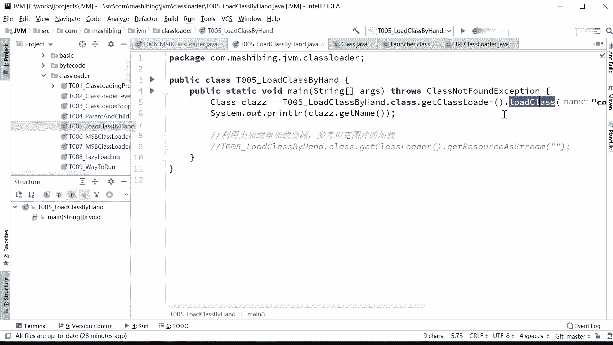

我们来看这个自定义自定义的加载器吧。在这里啊自定义。

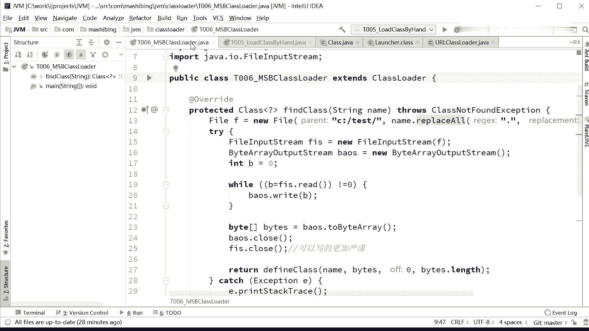

好，自定义类加载器有好多种方式了，最简单的一种从class load集成。呃，这个呢。刚才我们分析过，你只需要干一件事，重写它的find class方法就可以了，就OK了。呃。

大家看我重写这个find class方法的过程啊，重写这个fin方翻呃find class方法的这个过程呢，会用到的它的一个辅助方法。这方法呢叫deffinine class。

这个class这个 class呢一会儿我呃这个方法呢一会儿我们简单跟大家说啊。好，再看这里啊。fi F等于new file我创建了一个文件，这个文件呢是位于C盘test目录下面。

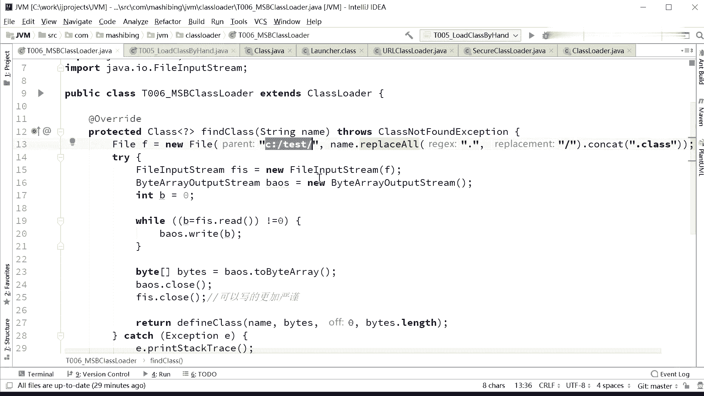

然后你传给我的名字，你传给我一个，比如说这个名字co马士兵JVMhello这名字。

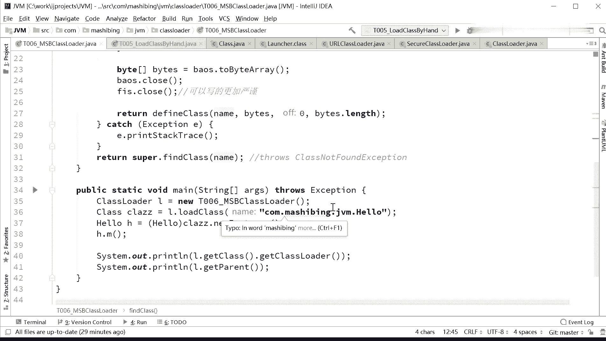

然后我把这名字呢点儿替换成为斜杠，那就是找到了它的全路径，最后加上它的克拉苏截名。这个fiel呢其实指的就是哪个哪个fi呢？大家来看一眼啊。

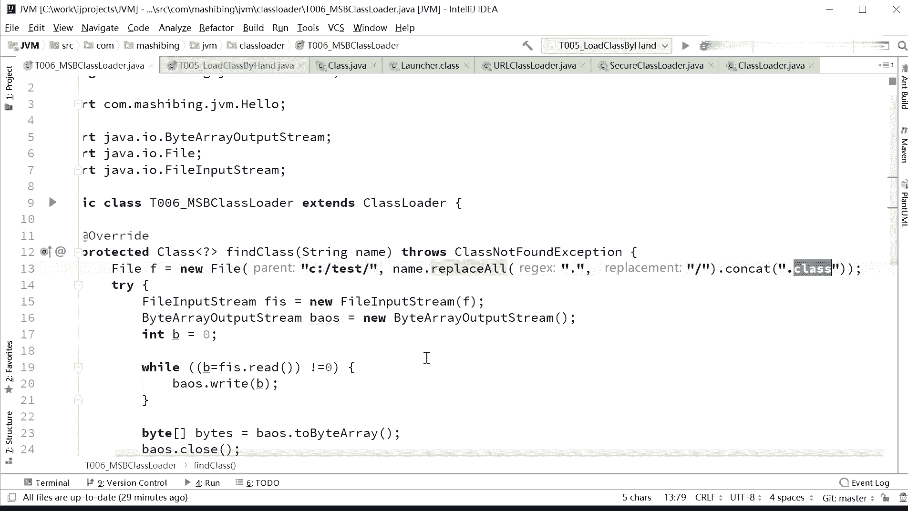

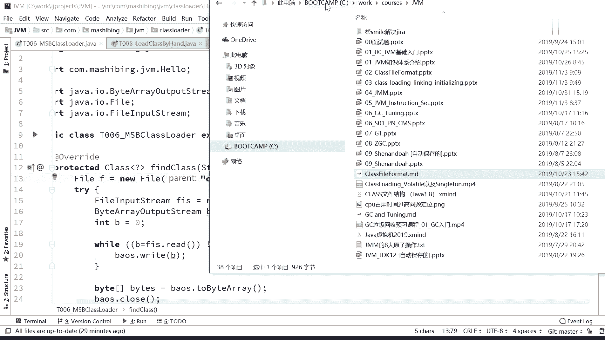

C以。Test。🎼下面有comme马士兵JVM。然后下面hello点class，其实就是这个这个这个类的全路定名吧，就是整个。

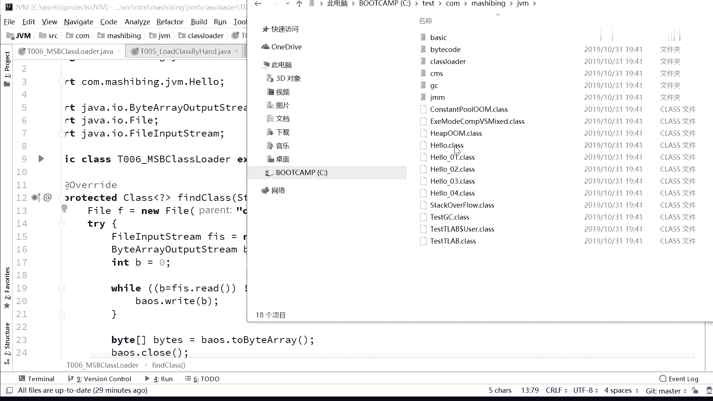

呃，类类的类的文件文文件路径，再加上类的名字啊。

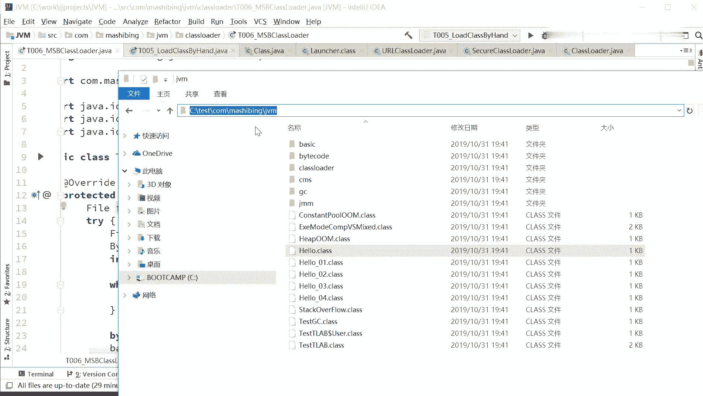

嗯，绝对落定。

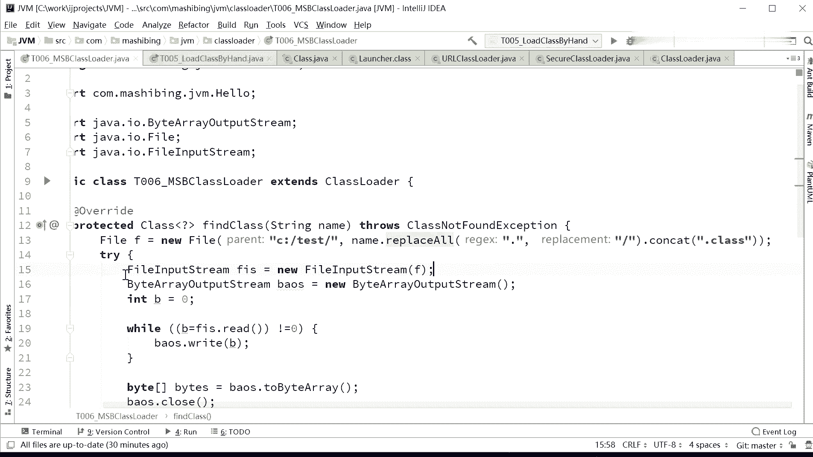

我你找这个范，我们怎么才能够把它给漏进来呢？是这样来做的。F input stream， to input stream by the array output stream。

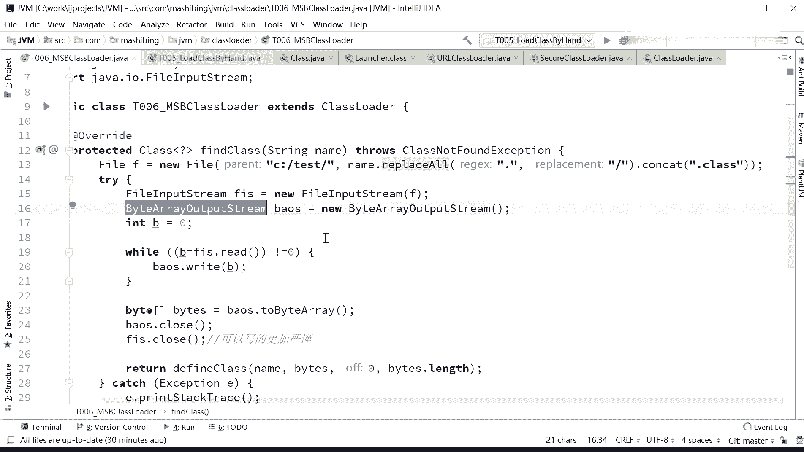

把它转换成为一个二进制字节数字节数度。从文件里读出来，写进字节数组里。协数字接数组之后呢，把它转换成为一个二进制的字节数组。转完了之后呢，怎么把这个二进制字节数组给变成一个class类的对象呢？

刚才我们说过，我们说是另外一一个流被我们加载进来，加载进来之后呢，是一个二进制的东西嘛。二进制完了之后，我怎么能把把它转换成一个呃class类的对象呢？用这个方法deefine class。

这方法呢也是在我们class loader里面定义好的，你直接拿来用就行。deefine class。Deite as。是把这部分的二进制的东西转换成为的类的名字是什么？空满是兵GVM排lo。好。

字节数组。是转换成了哪部分的内存里面的位置，字结束的起始的位置，0结束的位置，字接束的长度。相当于整个自己收组。通过这个方法，我就把它转换成为了一个class类对象。

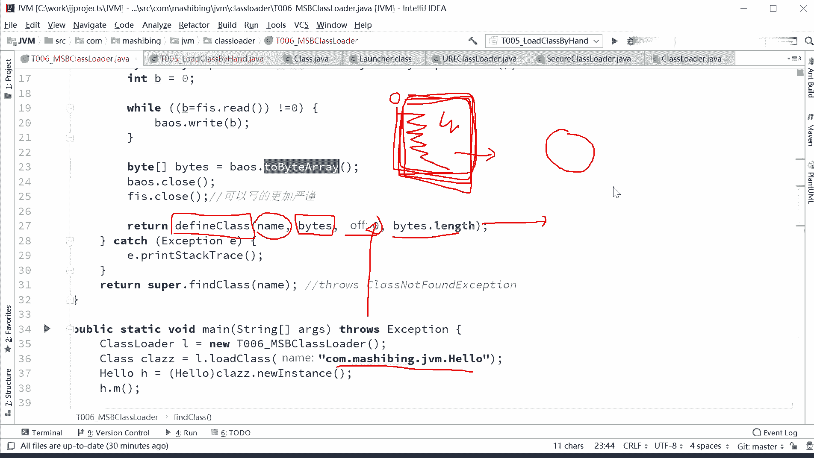

所以总而言之，想调用一个class load呃，想自己定义一个class loader的话。

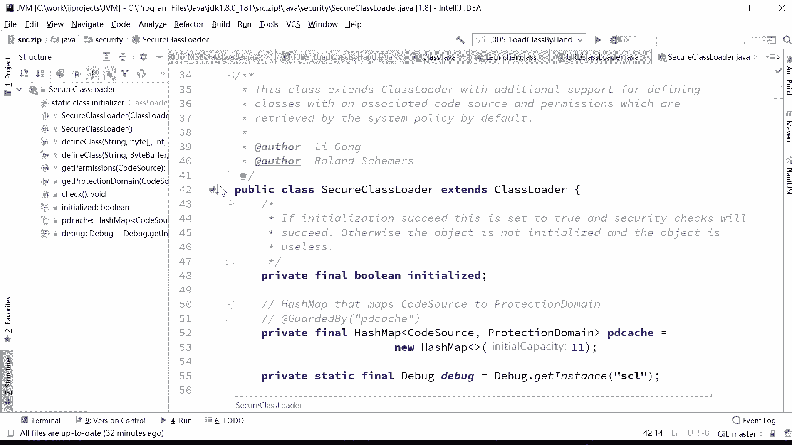

很简单，我们就是从class楼这继承，继承完了之后呢，重写它的fin class方法。

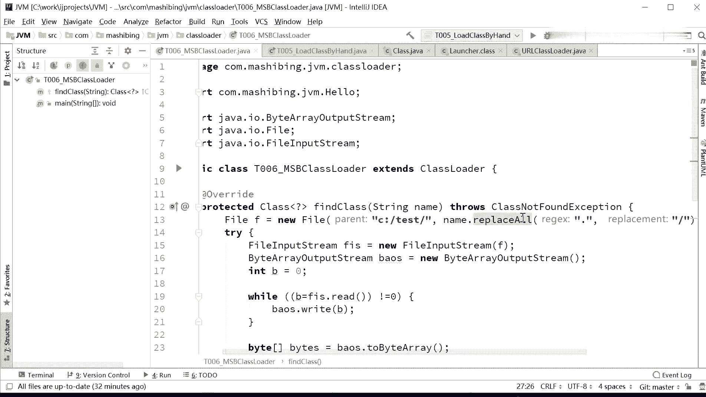

在fin class方法里面，我们找到。你要load进来的那个二进制的内容，在内存里面给它完完整的load进来。录完了之后呢，再把这个内存这部分内存转换成为一个。class类对象用哪个方法能？

用deeffinine class。搞定了啊。

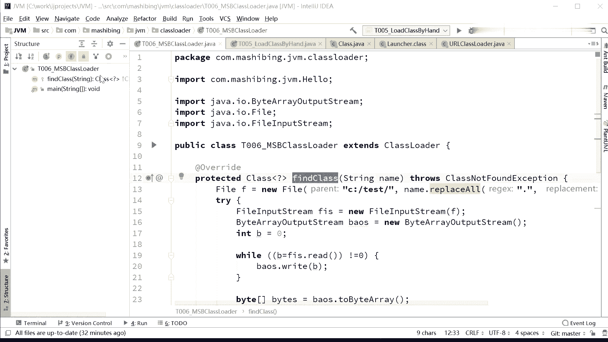

就OK了。那说这东西怎么用啊，这么来用，看这里。

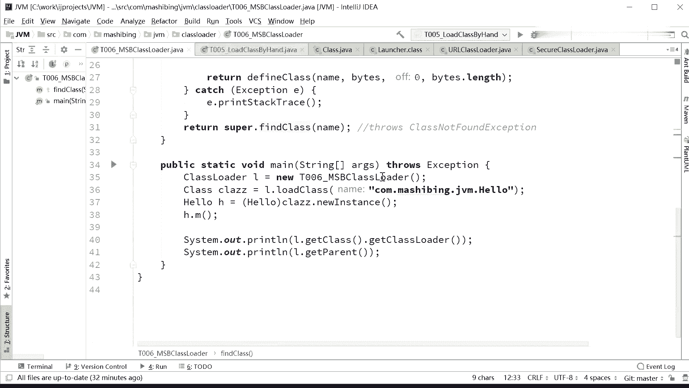

class loaderL等于6T006MSB的class loader。这是我们自己定义那class loader。然后我们要想加载一个class的时候，load class。

co马士兵这边Mhello。就能录进来，我们用反射去访问。他的方法啊把用反射呢把它弄出来一个对象扔在这儿。然后调用它的M方法。啊，跑一下。

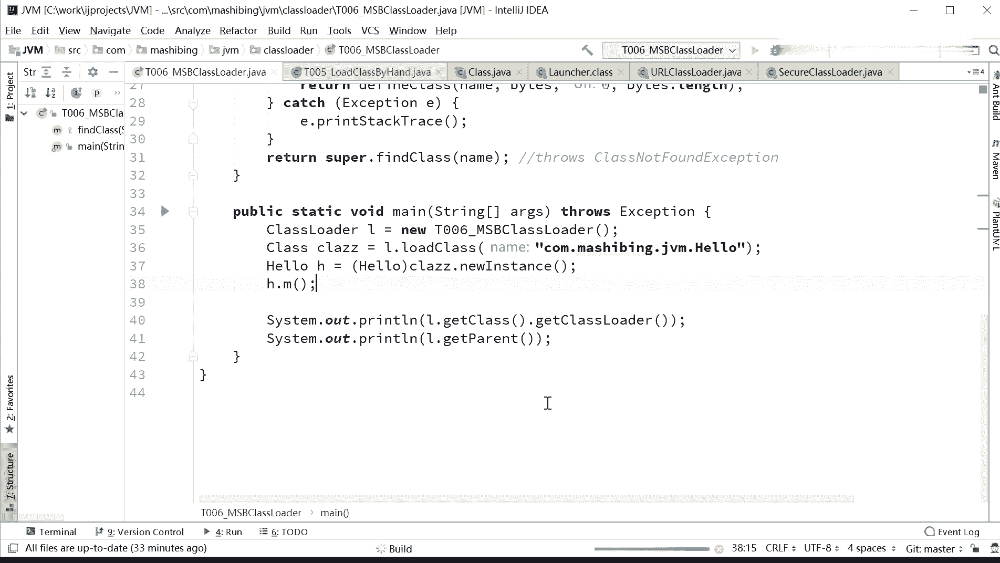

只要能漏进来，说明就没问题是吧？大看啊，hello这VM。😊。

已经调用完我的方法了，比就说已经漏进来了没问题。然后呢，L点ge class get class loader，就是我这个class loader是被谁加载进来的呀？是被我们的APP。

而L点geparent，他的父亲是谁呢？也是我们的APP。

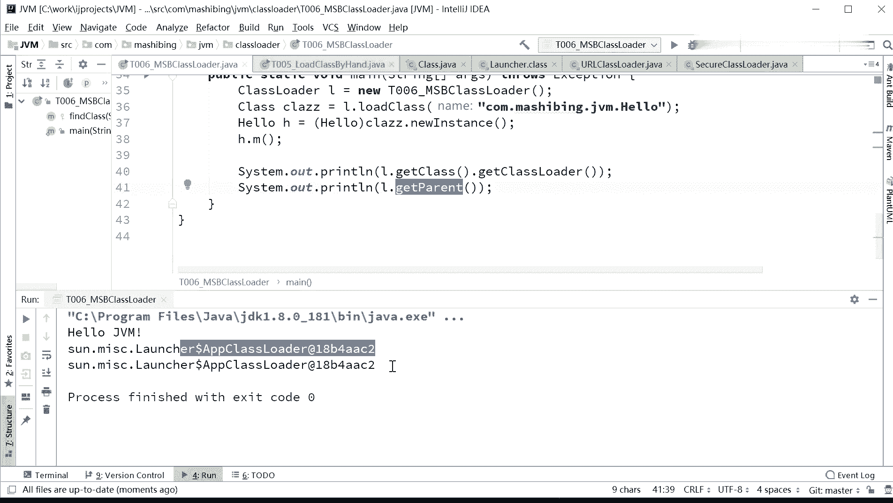

好，这就是自定义class loader啊。自定义class load呢。

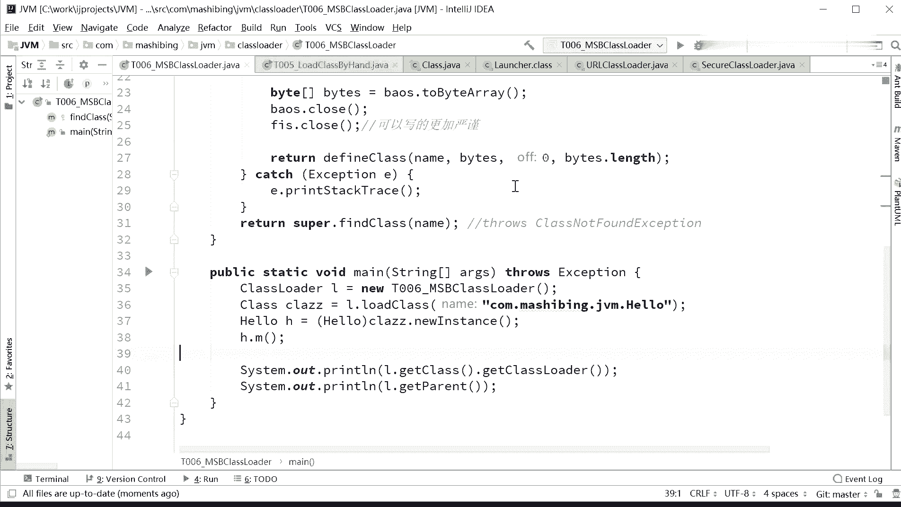

呃，写框架写内库的时候是基本上都要用的。spring有自己的class loader to care有自己的class loader。有自个class loader之后。

你想 load自己在某一个指定目录下面的class文件，你就可以用这样的方式去load的了。好，这就实现了一什么呢？这就是我们自己的自定义的那个class load。刚才我们看到。

由于他的父亲是我们的APPclass load，所以如果需要加载一个类的时候。他如果先先去他的父亲里面去找。他会去找这呃马士兵下面的马世斌的下面的海low。你你你你加载过吗？问他的父亲，他父亲是谁呀？

刚才看到了APP吗？他父亲在里面找了找了一下，说我这儿没加载过。但是我要问我的父亲好，他父亲是谁？EXTEXT你加载过这个这个这个hello这个吗？那EXT说我没加载过。找他的附亲。

不str不str说我也没加载过，我也没加载过，我我我我我尝试加载一下啊，你等着我我去加载一下。但是我其实上是没没有办法去加载的，原因是啥？原因是我在我的这些个站文件里面是找不着这个类的那那对不起。

那那你只能你你只只能你自己去加载啊，那我行，那这个这个ES就说那行，那我自己去加载吧，他找了一下说我这个也不也不够我加载，不够我加载怎么办啊，那那对不起，只能让我的孩子去加载，那孩子去找了一下，说哎。

不对啊，这个我也找不着为什么？因为你想想看C盘test，这是在我的classclass part下面吗？没在，所以我也找不着，我也找不着怎么办？哎，算了。我们自己定义的这个class load。

那不好意思，你去加载哦，那行，那我我我既然去加载，我就加载了，调用我自己的load class。😊，调用load class的过程呢，找了一圈，fin现都没找着。大家回回想那load class代码。

是不是到最后得调用我的find class啊，那我就去调用我的自己的find class。😊，好，我在fin class的时候。

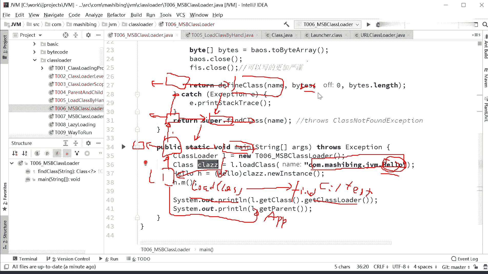

哎，我去找了一下，但我这有自己的fining class吗？哎，我找了一下，把这个文件给找着了。找着了之后呢，我就给它转换成反馈给你。

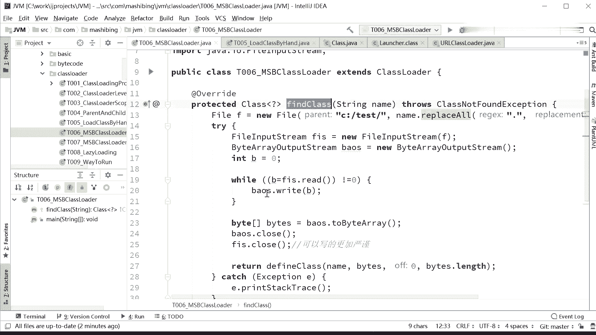

不就OK了吗？

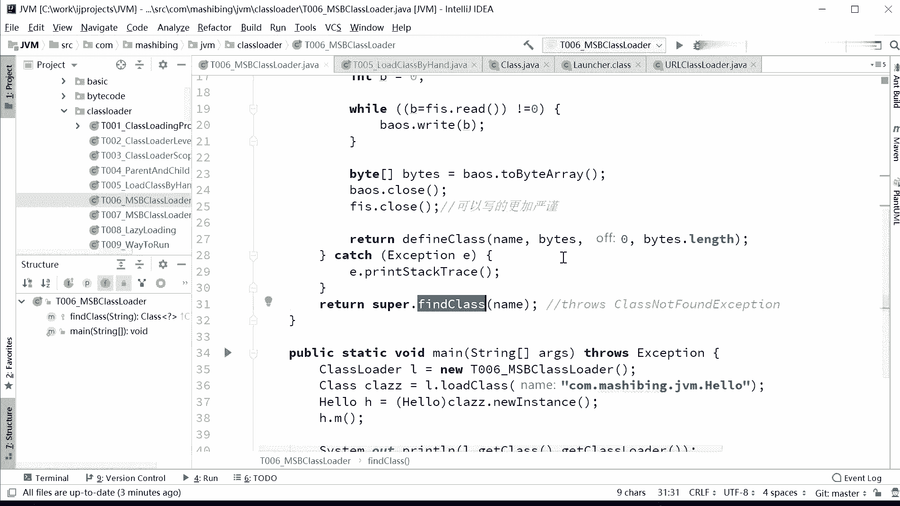

嗯。嗯。或制角云可以直接漏炸吗？漏炸的意思不就是你找到那个炸文件，把里面的classance挨着牌的全读出来，全漏进来，不就叫漏炸了吗。一般不会去漏的整个这文件。呃，java的这个加载呢叫做懒加载。

需要的时候才加载。叫lazy loading叫懒加载，需要才加载，这是一个比较细致，特别繁琐的内容。

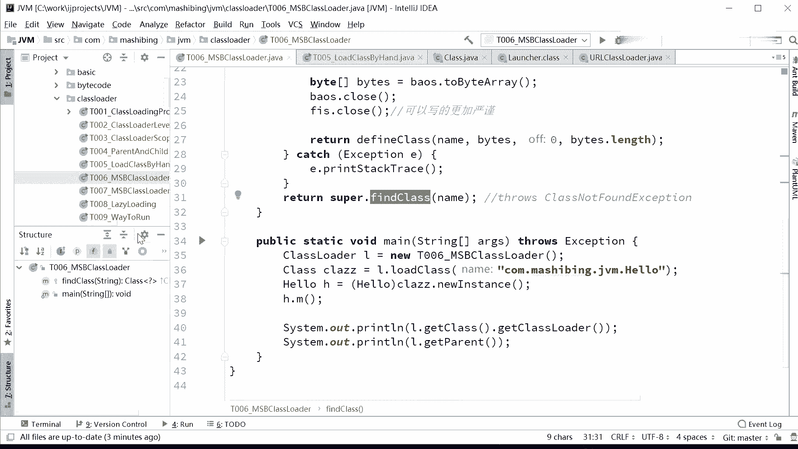

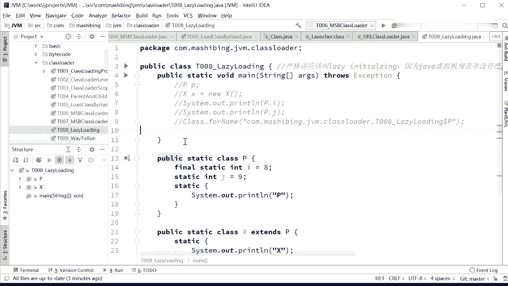