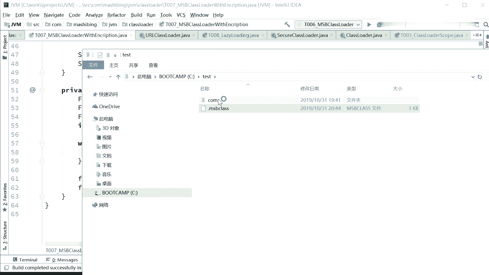
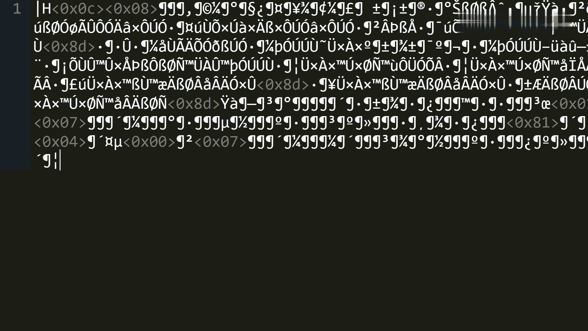
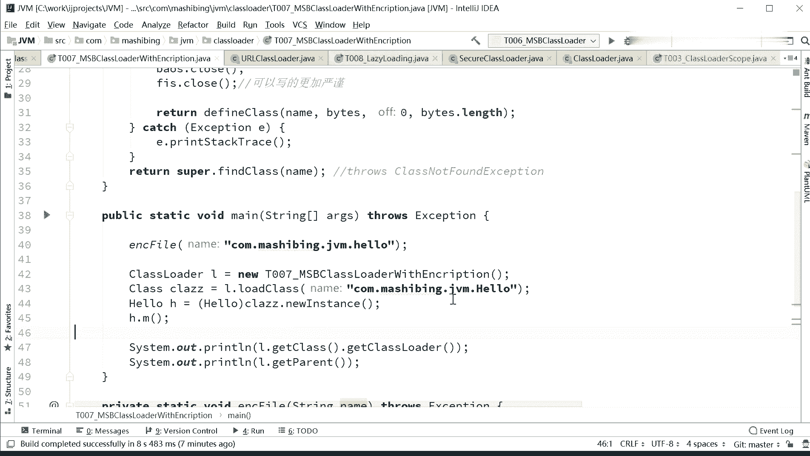

# 花了2万多买的Java架构师课程全套，现在分享给大家，从软件安装到底层源码（马士兵教育MCA架构师VIP教程） - P121：【JVM】加密 - 马士兵_马小雨 - BV1zh411H79h

看这里啊。嗯。后面讲的这个内容呢呃应该讲的就是算是给大家扩展，算比较好玩的内容了。啊，谈不上你必须得掌握的，好吧，我们所以我们放松了来。呃，我我们我们来聊这个通过自定义class呢。

其实你是可以定义那种自己加密过的class，就是你你给自己的代码加密。大家知道这java的代码class文件很容易就被反编译了，是吧？但是我要是给你自己定义自己的格式，我不想让别人反编译。

这时候怎么办呢？你可以通过自定义的class loader来进行。好的，看这里啊。通过资义class load来进行，我我我是这个小程序给大家做了一个小演示啊，这个当成一个兴趣点，了解了解就行。好。

注意看。我呢做了呃一个加密的操作啊，怎么做的呢？是这么来干的。呃，ink from是加密呃，加密我干了一件事儿，就是平时啊同学们一般的情况下。这知识点要扩展起来也特别多。好。平审就一般的情况下。

一个classus文念，它不就是一个二进制的。二进制流吗？呃，然后呢我编译好了之后呢，自自己手工编译好了之后，我我把这个class文件给它加密，怎么加密呢？我这里采用的是最笨的，特别普通的办法。

就是抑惑对某一个值进行一个异惑。呃，大家知道，如果对某一个值进行抑或，抑或完了之后再抑或这个值就相当于解密了，是吧？如果你不了解这块啊，二进制的二进制预习的内容ok。回去回去翻。就无所谓。总而言之呢。

我抑惑一个一个数，然后再抑惑他一下，我就回到原来的值了。有同学对这有没有同学对这块有疑问呢？就抑惑一下，双抑惑就回到了。有问题同学你直接扣2，没问题同学扣1。对我菜鸟也是讲过的对啊。

那所以呢我就弄了一个抑或的种子值，这个值呢叫二进制的10110110。那反正你两两亿一这这个值只有我自己知道是吧？我用这个值来对我的文件进行加密，怎么加密呢？我就是把这个文件里面的所有的内容全读出来。

每一个每一个字节全读出来，读出来之后呢，对这个细的进行抑惑。抑或完了之后呢，我再给它写回去。写回去的我给它起了一后缀名叫MSBclass。所以这是你为什么在这里看到了一个。

MSBclass，这是我们加过密的啊。你如果你用把这个用二进制来打开的话啊，open用slamme来打开一下。你就会看到呃，他。哎，what对16进制的。十六进制视图嗯。sle的16点制视图在哪？

淘不切了啊，找了。

呃，如果你用16斤针看的话，它最开始的这些就已经不再是那个呃cafeba了。所以别人去用普通的class load，把我这个class loadclass load进去，它是读不出来的。

那这时候怎么办呢？我要我自己要想用的时候，我怎么办？我自己要想用的时候，就是我find the class的时候，把它拿拿过来之后呢，我把里边的每一个字节读出来，读出来之后，我再抑惑我自己的这个。

加密了这个C。好，我我就相当于解密了。也就是说当我们自己有这个值之后，只有。我自己能用，别人就用不了了，除非他知道我这个C和加密方法。😀Yeah。大伙对你把自己的加密的原码也给他。嗯，像这种简单的加密。

那那人家肯定解了啊。杠精啊，你就属属于杠精中的杠精啊。

所以没方法里面，我先加密啊，解密完了之后呢，我再用通过自己的方法来进行解密，再来读，这就给大家快点着玩的，好吧。大家了解就行啊。

