# 系列 3：P122：【JVM】编译器 - 马士兵_马小雨 - BV1zh411H79h

好来看这里啊，我们再来看一个比较尖锐的问题。这个问题呢叫做编译器。刚才呢我们只讲了加载，其实上没有讲编译。呃，编译这个过程呢。需要大家掌握内容啊，觉着这块内容注意看。是。🤧是。呃，大家知道呢。

那个java呢是解释执行的一个class文件落到内存之后呢，它通过java的解释器interpreer来执行。那java呢其实有一个叫做JIT的JITjust in time。Just in time。

compilerGIT的编辑器指的是有某些代码，我需要把它编译成为。本地代码相当于是EXE的。那么在lins底下呢是lins啊这个可执行的格式。好，这种情况下。叫做。

我可以把java代码也可以编译成为本地代码来执行。所它里面呢有个GIT的东西。那这我说，所以现在大家如果有人在问你说java语言到底是一个解释性语言还是编译性语言呢？你完全可以告诉他，我想解释就解释。

想编译就编译，就看你怎么定。为什么呢？听我说。默认的情况下是一种混合模式。混合模式什么意思？指的是。使用解释器，再加上热点代码编译这两种方式同时进行。什么叫热点代码编译？听我说。是这样来做的。

我们写了一段代码。这代码里面呢有一个循环或者一个方法。在执行的时候，刚开始是用解释器执行。结果发现在执行整段代码，整个虚拟机执行的过程之中呢，有某一段方法或者某一段代码或者某一个段循环。呃。张普逊。

你就发现说这个循环呀执行的频率特别高，频率特别高，一秒钟执行它好几十万次。我解释器解释来解释去，我觉得这段代码呢老被人用，老被人用。算了，我干脆就把这段代码编译成为本本本地代码。

那么将来在执行这样代码的时候，请你执行我本地这样代码。就不要在解释器里面解释来执行了。效率提提升。O。这个叫混合模式。不知道听清了没有，有没有有没有同学有疑问的？这叫混合模式。能理解的同学给老师扣一来。

嗯。😊，那我相信啊。当你看到这个模式的时候，同学们应该有同学会问，那我为什么不干脆直接编译成。本地代码啊对吧？那执行效率不更高吗？为什么呢？因为第一加va的解释器。现在它的效率也已经非常高了。

在一些简单代码的执行上，它并不输于你编译成本地代码。这是第一点。第二一点呢，如果你一个执行的文件特别特别多，各种各样的内库的时候，啊好好几十个classus，这是很正常的一件事情。你上来二话不说。

先在内存里编译一遍，你这个启动过程会长的吓人。所以他现在默认的模式是混合模式，但是你完全可以只用参数的方式来指定到底是什么模式。杠X mixed是混合模式。杠X inter interpreter。

int杠X interpreter是编译模式。对不起，解释模式纯解释啊。sorry，这里写错了。嗯。是解释模式啊，interage解释。他启动很快，执行起来稍微慢，因为它解释执行吗？

那么刚X compare acompilation，那么这种的呢叫纯编译模式，直径很快，启动很慢。当然我所说的启动很慢的意思是你有好多好多类需要编译的时候，你如果只要有一个类需要编译呢。

其实启动还是挺快的。好。那么那实一据说本地代码啥意思啊？本地代码。嗯。EXE理解什么意思吧？这就是windows的本地代码。那么linux本地代码的格式是EERF是吧啊。

就是说C语言编译完的那个东西叫本地代码。这意思乱日依稀啊，不知道我记释清楚没有？嗯，Native代码嗯。好，呃，我看刚才那个有同学说那个呃怎么确定热点代码是吧？你们你看啊这个hot spot。热点。

6点。这hospot原来的意思就是就是我能够进行混合类型的执行的hospot热点。标等代码的检测呢。多次被调用的方法。多次被调用的循环，这这种情况下进行变译。他怎么检测呢？其实就是用个计数器。

某个方法每个方法上都有一个方法计数器监测这个方法。哎，突然间发现某个方法在一秒钟之内，哇塞，执行了某一个值啊，超过某个值10万次。好，我要对他进行编译。这意思。怎么干的？其实拿大拿大腿想一想。

应该知道怎么干，他只能这么干嘛？他没有其他的办法啊。不是标记大伙，我们刚才解释了吗？有一个方法计数剂，就是它监测这个方法。每执行一次都个记录几加一。然后一分钟之后，他检查了一下，发现这方法算了一下。

平均一秒钟都超过10万次了，怎么办？编译吧。嗯。这个阈值记得也能设置，见能见到过？这个阈值能设置是吗？查logo啊。就弄你查查。查查之后分享出来啊。好了，同们，这是混合模这种模式来我们来验证一下啊。

就是说。呃，这东西呢实际上是可以验证的。这一个小程序叫way to run啊，到底用什么样的方式来运行呢？嗯。呃，我我写了这么一方法，这个方法呢叫M。从一从零开始一直到10万啊，然后在里面的值呢。

每个值除以除以3要对三进行求余。嗯，房屋本身没意义，就是耗时间用的。

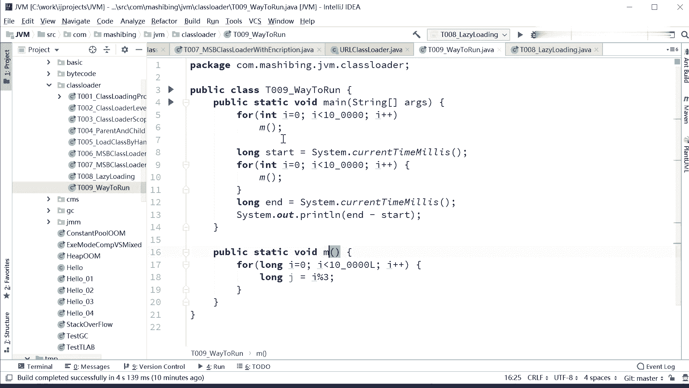

呃，然后我在卖方法里头上来先执行了10万遍M方法，10万遍M。

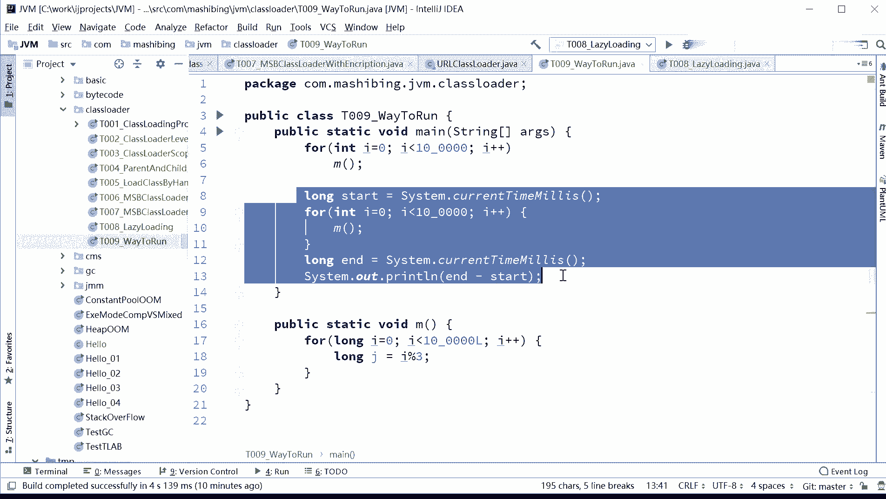

然后开始记时间。再执行10万遍M开始记时间。上面这段其实就是告诉JVM虚拟机。你看啊，现在有这个方法被执行了很多次，而且短时间内被执行了很多次。请你对它进行优化，就这意思。那我看到里啊。来躺一下试试。

我们先得确定一下它的执行模式啊，先执行一下看再说。停掉啊。

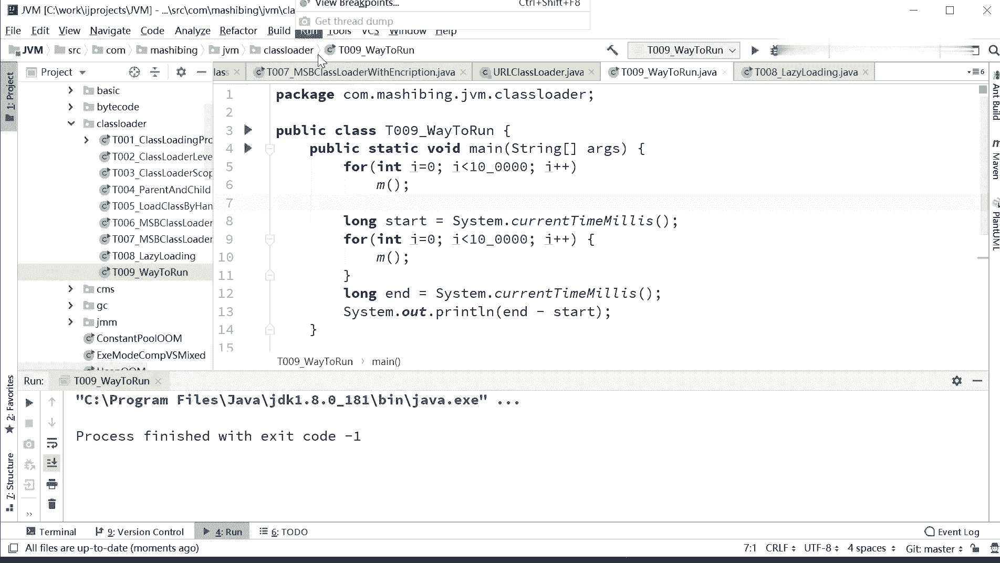

我们先指定一下它的模式run。

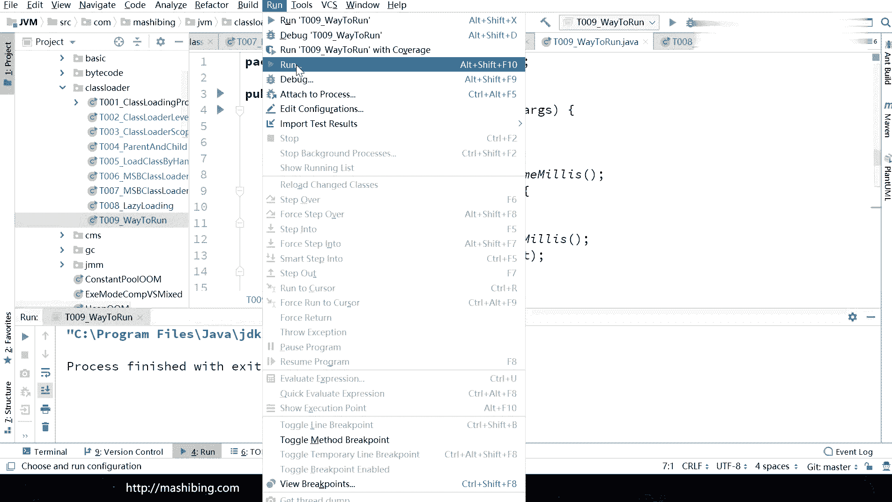

al shift F10啊，同学们。

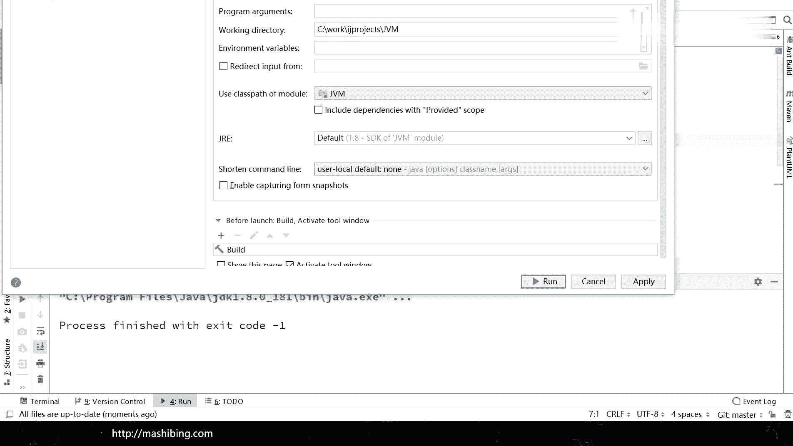

突这个正好出去了，让你让大家看不到啊，不要讨厌啊，在这儿啊run。Added configurations。好，去指定一下它的参数，这个V呃V motionja虚拟器的参数在这里没有做任何指定。

没有做任何指定，就代表着它是混合模式。我们记录一下混合模式，它的执行时间试一下。

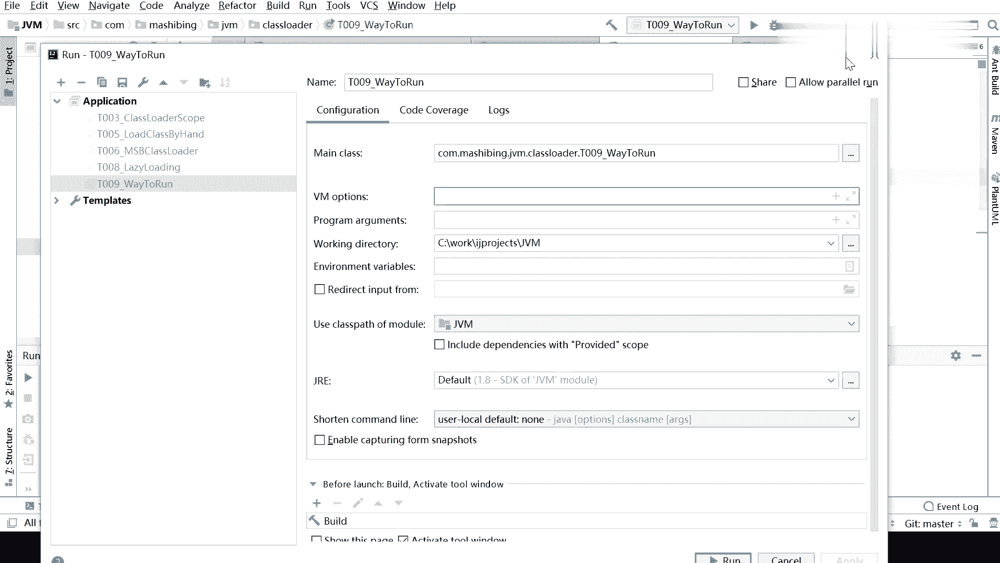

混合模式呢就是它监测到这个方法被重复执行了，所以呢他就会把这个方法进行一段编译。混合模式啊，其他的像这种的什么star啊这一类的全全是全是解释执行啊。现在是4秒2，我再指一遍，怎么这么长时间？哦。

4秒大概4秒左右吧，再执行一下。这其实你应该用我原来教大家的那个GMH来做一些统计和输出才会更好一些。3秒7再执行一下。讨厌了。

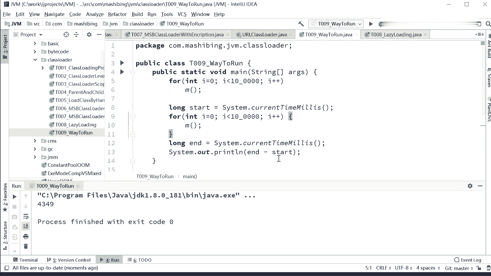

4秒3啊，反正大概吧4秒左右吧，差不多嗯。

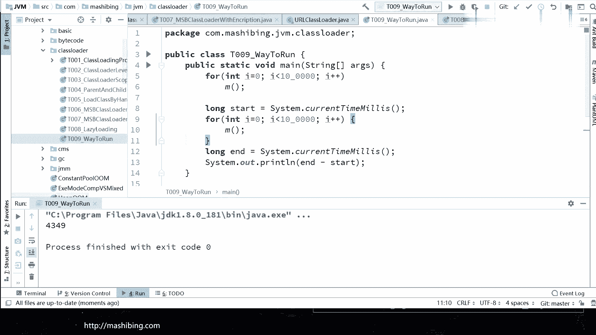

呃，4秒左右的话呃我们换一下模式啊。

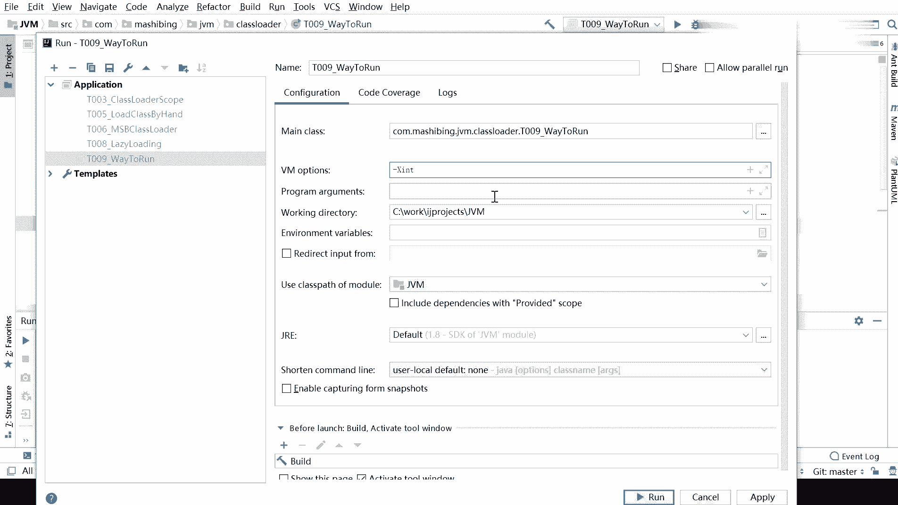

Run。Be configuration。指定一个杠X，我们只要intererin纯解释性，它就没有那个编译内部编译这个过程，跑一下纯解释看它多长时间。好，大家可以回去睡了。好，大家先去吃饭，下午再看。

😀哈哈哈哈。😊，算了，咱别等了，行吗？

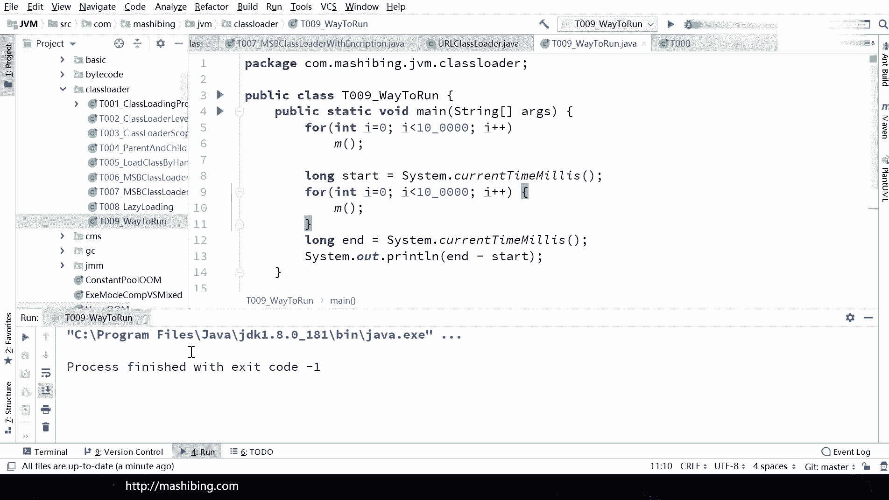

咱不等了是吗？O。哎，总而言之，你这个时候你要用纯解释执行起来就费老鼻子劲了啊。😊。

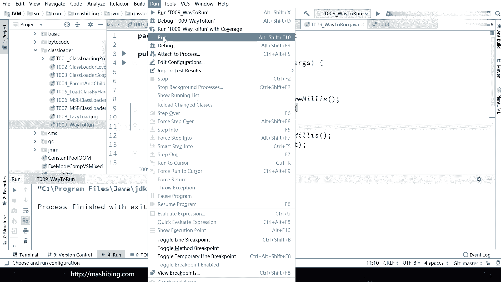

哎，算了算了不等了啊。😊。

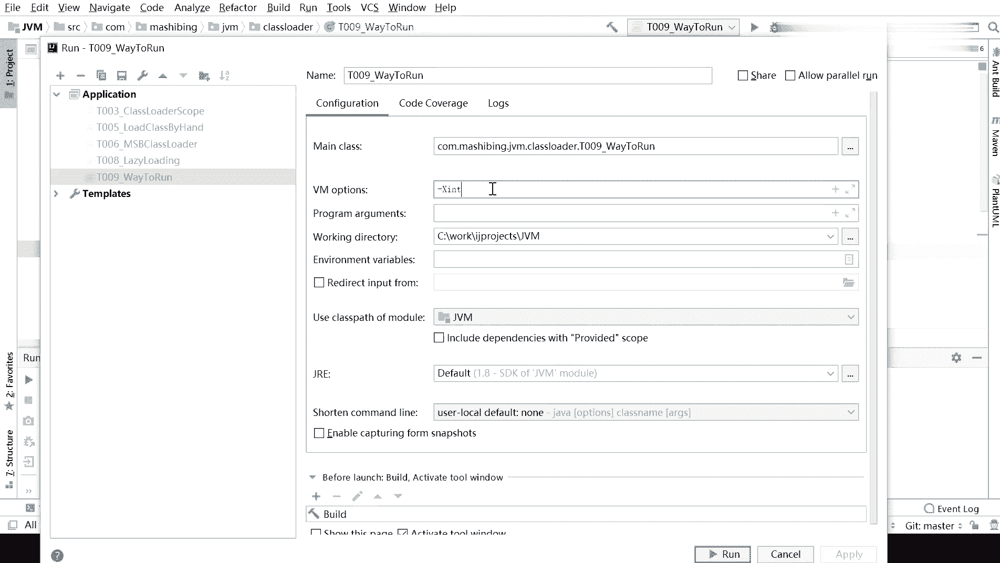

你你们自己下去，自己慢慢好玩的话，自己做实验吧。好吧，总而言之这么慢嘛。😊，好，我们使用编译纯编译。好。嗯。3。9。好。嗯。4秒8。就差不多比那个呃混合型的呢稍微的快那么一点点。别的也。

稍微快一点点也也也也没什么啊。呃，不过如果你累特别多的时候，你启动的速度就会特别慢。因为它编译的过程是需要时间的。

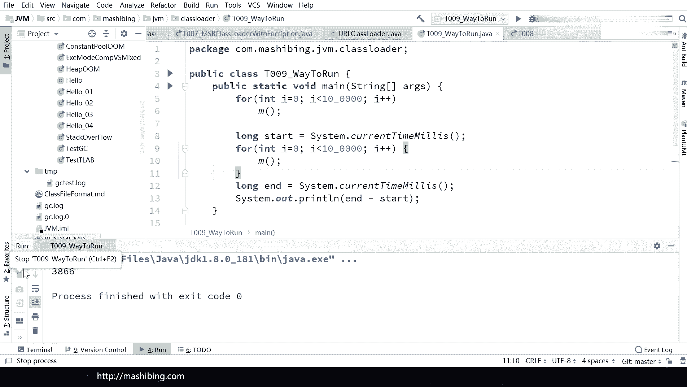

你感受到慢的是因为它在编译，好吧。嗯。