# 花了2万多买的Java架构师课程全套，现在分享给大家，从软件安装到底层源码（马士兵教育MCA架构师VIP教程） - P123：【JVM】懒加载 - 马士兵_马小雨 - BV1zh411H79h

Lazy loading。这个累 load顶严格来讲呢，应该叫la initialization呃呃。懒懒初始化啊，但是。就很多人就说懒家奶。这VM的规范里头。并没有规定什么时候加载这个类，听清楚。

首先第一点呢。多数的呃JVM虚拟机的实现啊，它都是用的懒加载。懒加载意思就是什么时候需要这个类的时候，我才去加载。我并不是说你一个炸文件里面2000多个类，但我只用到了其中一个类。

我需要把2000多个类全漏进来，不不适的。我用到了ms这个类，用它来做数学计算。那我只用把这个类的代码录进来就OK了。我真的没有必要把相关的那些个包里面所有代码全漏进来。所以这个我相信大家都能理解。

很很简单。但是JVM并没有规定，你什么时候把这个类给加载进来。有时候你要是真愿意啊，你自己写JVM实现，把二二话不说，把所有全加载进来，可以的，没问题，随便你。

但是呢他严格的规定了什么时候初始化5种情况。我再说一遍，别去深究他，没有意义，好吧，就扩展着玩了。什么时候必须初始化是规定这么一种情况。当new有这个类对象的时候。

get static访问这类对象的实例的时候，put static访问实例的时候，invoke static调用静态方法的时候。这些指令的时候，必须初始化这个类。访问final除外，final变量。

一个类里面的final变量。在你解析的过程之中，立刻就给它定好了。这个值就是一个固定的单独拿出来放在内存里面，某一个特定位置值，反正也变不了。所以我甚至都不需要对这个类径初始化。

我就能定知道这个翻动变量的值。当你使用反射调用的时候，当你初始化子类的时候，负类必选初始化。虚拟机定要用被执行的主类，含有卖方法那个类必须说始化。下面什么动态语言支持啊。

就是java method handle method handle解析这个结果的时候，如果解析成它是一个get static， push staticinvo static。啊，这个时候可你说实话。

我再说一遍，这一页讲的内容，我不需要你去严格掌握，没有没有必要。好吧。不过我们可以做一个实验。大致了解这到底是什么意思。听我说。所谓的加载这个类加载完了之后呢，刚才你看到加载完了之后。

它自动的就会进行一个呃loading linking和inial lighting的过程。

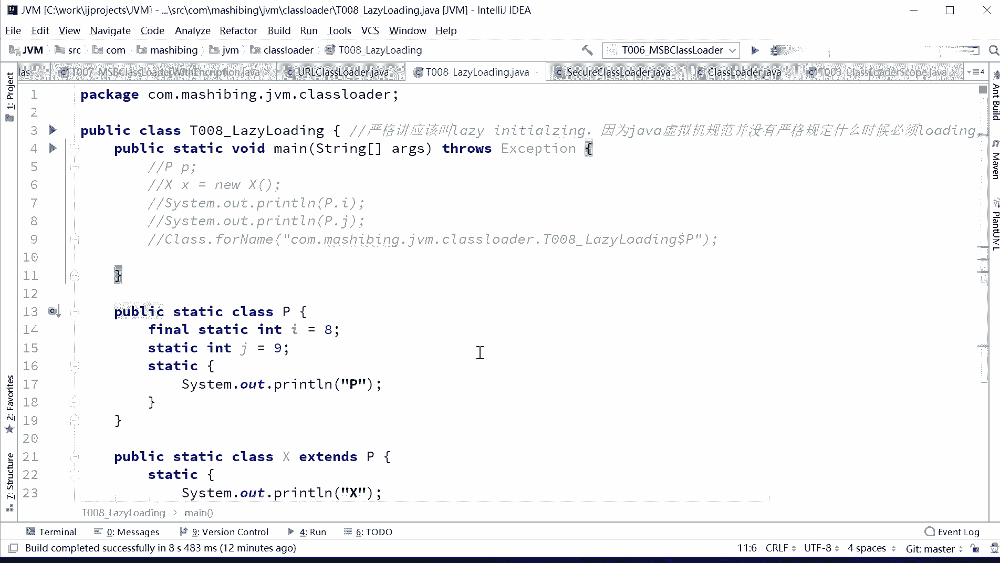

注意看我有这么一个类，这个类呢叫P。P这个类呢有一个静态变量叫I。还有一个静态变量呢叫J。

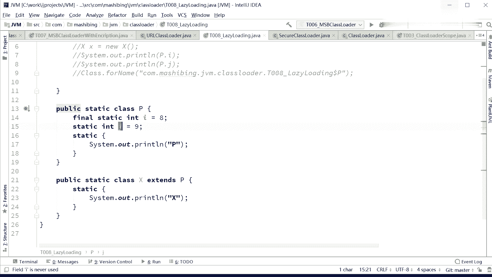

第一个动态变量是final值。另外它有一个静态的语句块，叫sstem out print。我们说需要这个类的时候才加载，我们怎么证明它被加载过？

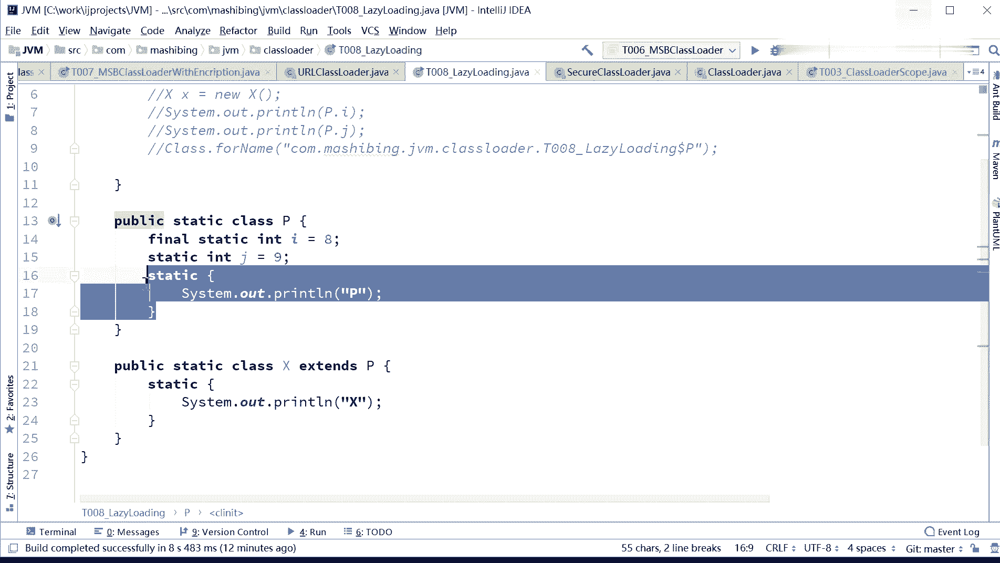

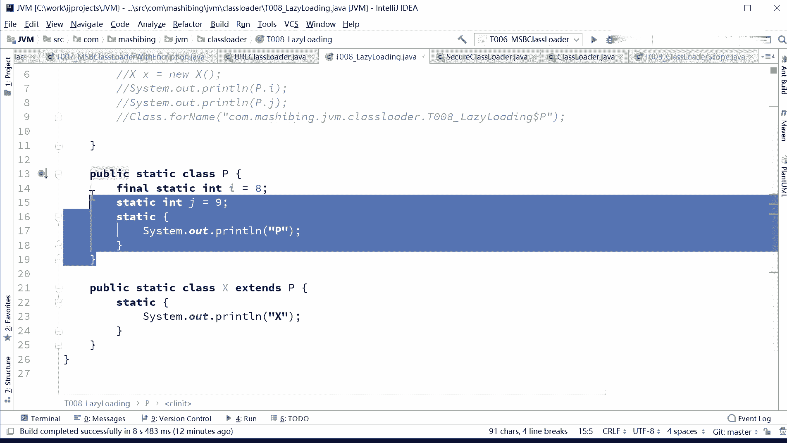

只要他被加载过，这个P一定是被打印出来的。

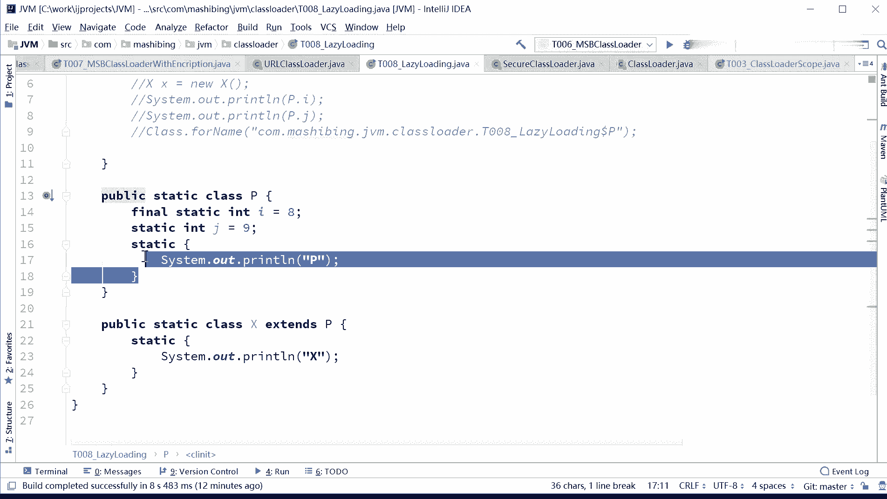

因为刚才我们说过一个class漏到内存之后，它有loading linkinginitializing的过程。initializing这个过程会执行静态语句块。所以这个类load进来。

这个静态语句块一定被只执行过。所以这个P一旦被打印，就证明这个class一定low进来了。我说到这里，有没有同学有疑问的？没有没有问题的同学给老师扣1。所以说这个P一旦打印出来，就证明这个。

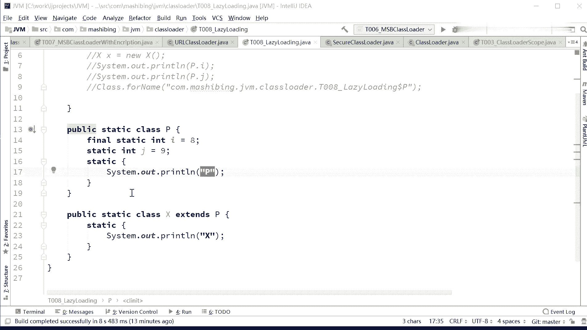

类被加载过了是吧？啊。我们一起去看啊。P小屁。同学告诉我这个类会不会被加载？我同学说老师，你这不是用到了吗？😡，你分析我刚才的那5种情况，我扭他了吗？没扭，我访问他的静态变量了吗？没有。好。

同学们告诉我。P小P这时候。会不会被加难呢？不会对。讨一下试试啊。

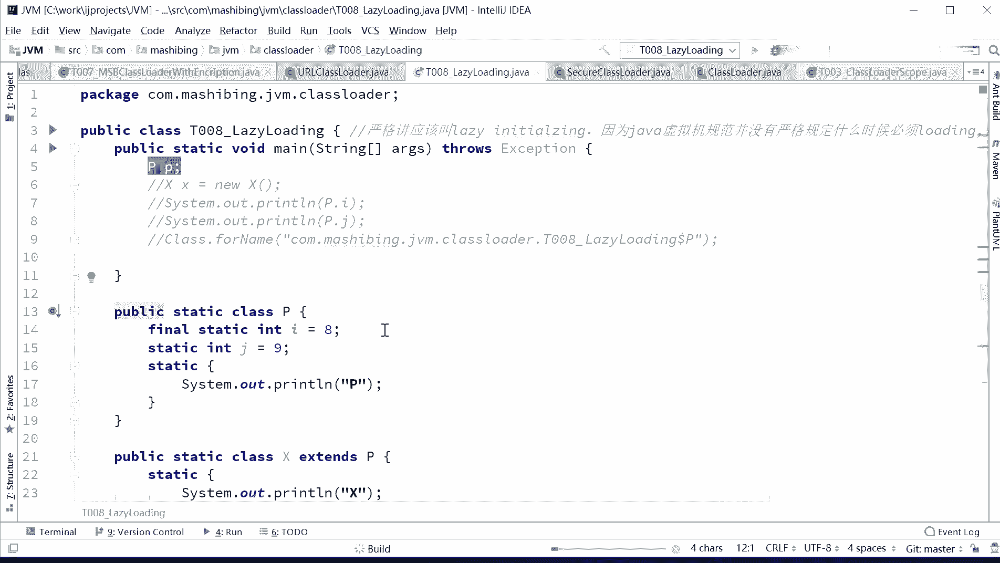

你看没有任何输出，没有加载过，按需加载。咱下面这个呢。

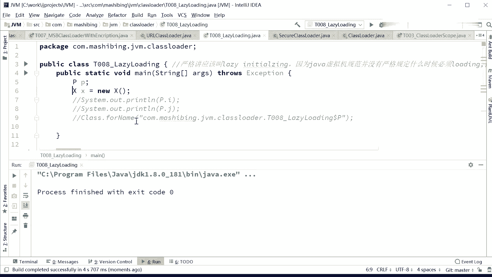

X小X等于6X，你说那P会不会打印出来？

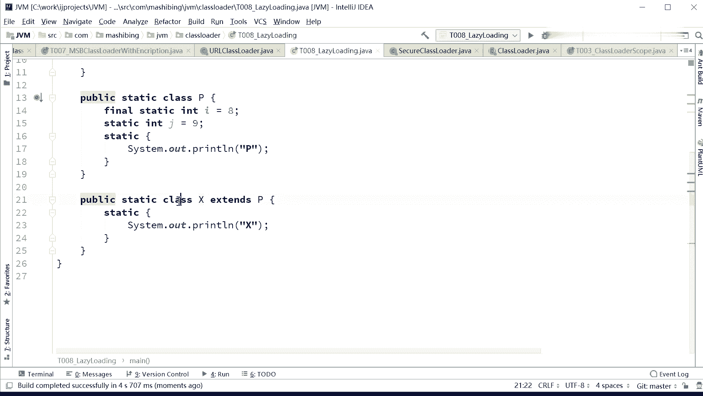

注意伦6了X了。

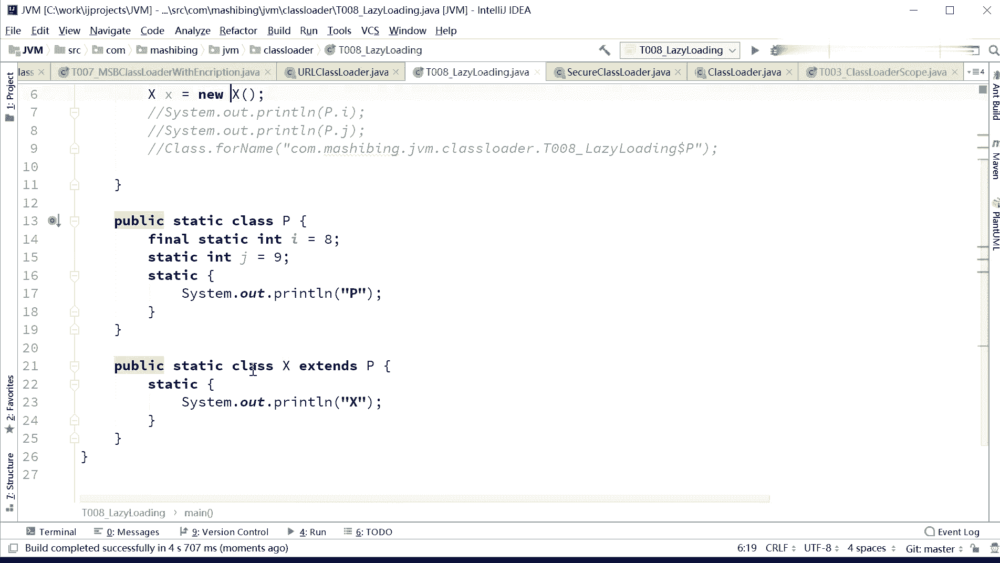

X的它的负类是P，那它一定是展印出来的，这个P必须得加载进来啊。

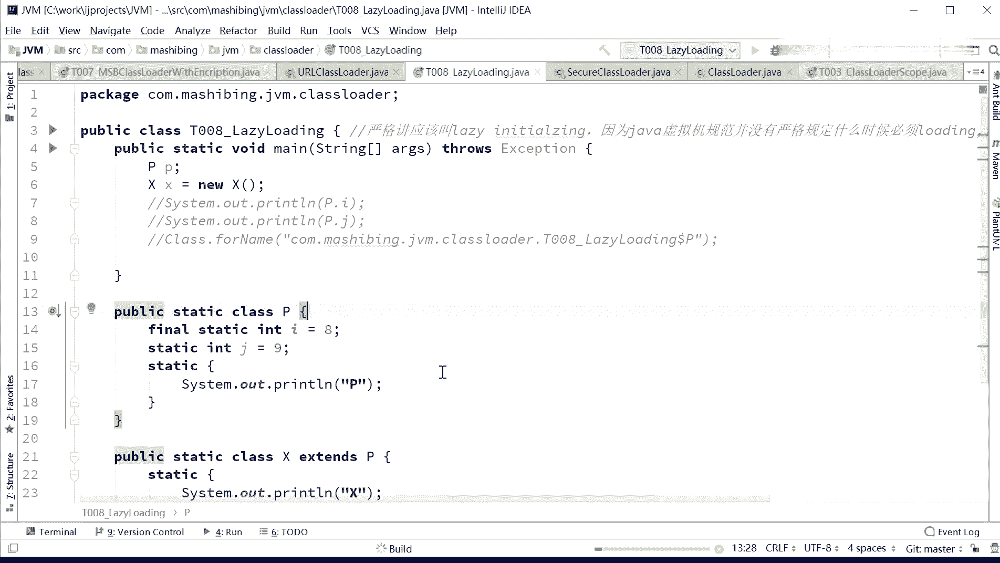

OPX。然我看下面这个。我打印P点I告诉我会不会再打印一个P后面。

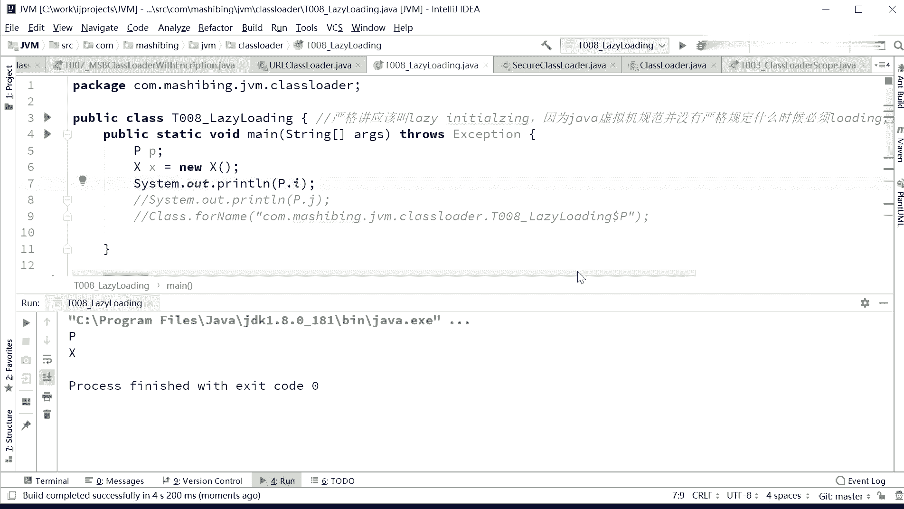

注意I是final类型，final的类型会吗？

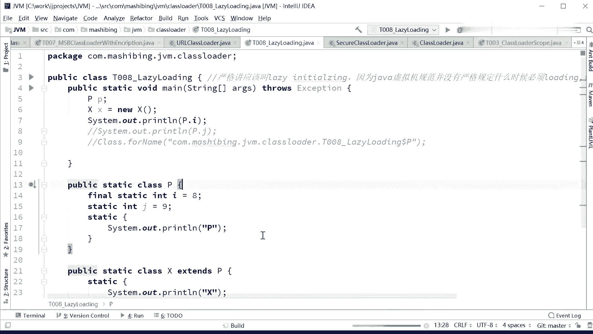

跑一下。

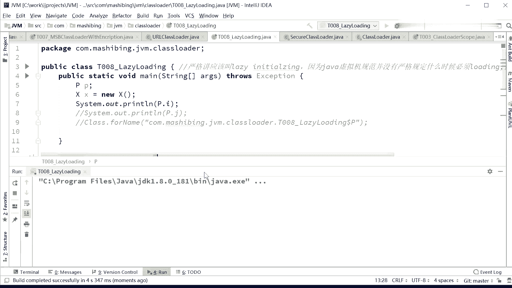

不不。我们刚才说他不会打印那个P，注意啊，他会把这个值打印出来，但不会打印那个P，说明那个类没被加载，知道吗？我打印final的值是不需要加载整个类的。

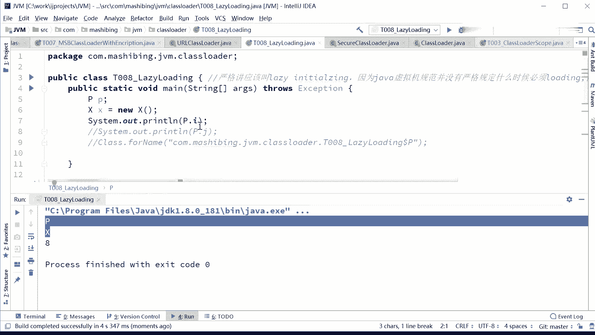

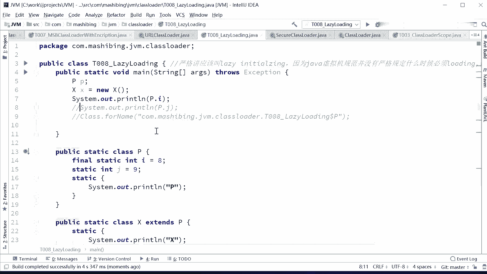

看这个P点J，这个呢非fin非 final呃，我这个类啊，你你注意看我这个P这个类。是lazy loading的内部类。所以我要访问P这个类的时候，必须得是外部类dollar内部类的名字啊。

不然我直接访问不到。

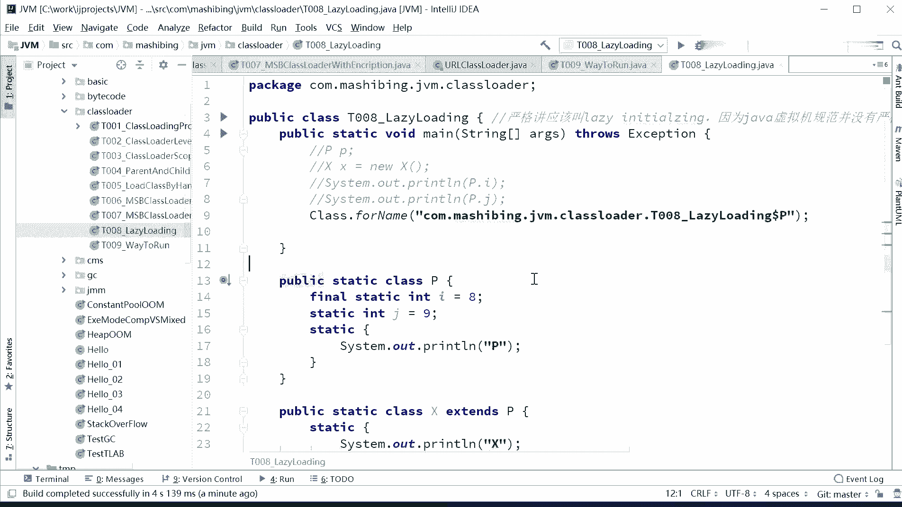